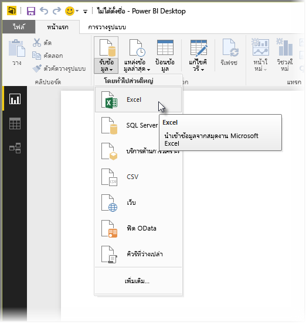
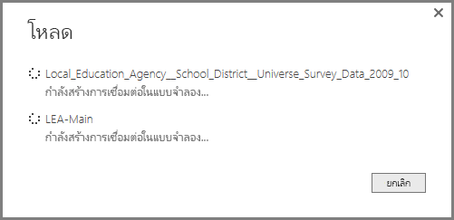

# เชื่อมต่อไปยัง Excel ใน Power BI DesktopConnect to Excel in Power BI Desktop
การเชื่อมต่อกับเวิร์กบุ๊ก Excel จาก Power BI Desktop เป็นเรื่องตรงไปตรงมา และบทความนี้จะแนะนำทีละขั้นตอนให้กับคุณConnecting to an Excel workbook from Power BI Desktop is straightforward, and this article walks you through the steps.

ใน Power BI Desktop เลือก **รับข้อมูล > Excel** จาก ribbon **หน้าแรก**In Power BI Desktop, select **Get Data > Excel** from the **Home** ribbon.

เลือกเวิร์กบุ๊กของคุณในกล่องโต้ตอบ **เปิด** ที่ปรากฏขึ้นSelect your workbook from the **Open** dialog that appears.

Power BI Desktop แสดงตารางของข้อมูลอื่น ๆ จากเวิร์กบุ๊กในหน้าต่าง **ตัวนำทาง**Power BI Desktop presents the tables on other data elements from the workbook in the **Navigator** window. เมื่อคุณเลือกตารางในบานหน้าต่างด้านซ้าย ตัวอย่างของข้อมูลจะปรากฏในบานหน้าต่างด้านขวาWhen you select a table in the left pane, a preview of the data appears in the right pane.

คุณสามารถเลือกปุ่มโหลดเพื่อนำเข้าข้อมูล หรือ ถ้าคุณต้องการแก้ไขข้อมูลโดยใช้ **ตัวแก้ไขคิวรี** ก่อนที่นำเข้าไปใน Power BI Desktop เลือกปุ่ม **แก้ไข**You can select the Load button to import the data, or if you want to edit the data using **Query Editor** before bringing it into Power BI Desktop, select the **Edit** button.

เมื่อคุณโหลดข้อมูล Power BI Desktop แสดงหน้าต่าง **โหลด** และกิจกรรมที่เกี่ยวข้องกับการโหลดข้อมูลWhen you load the data, Power BI Desktop displays the **Load** window and displays the activity associated with loading the data.  

เมื่อโหลดเสร็จ Power BI Desktop จะแสดงตารางและเขตข้อมูลที่ได้นำเข้าจากเวิร์กบุ๊ก Excel ของคุณในบานหน้าต่าง **เขตข้อมูล** ทางด้านขวาของเดสก์ท็อปWhen complete, Power BI Desktop displays the tables and fields it imported from your Excel workbook in the **Fields** pane, on the right side of the Desktop.

เท่านี้ก็เรียบร้อย!And that’s it!

ตอนนี้คุณพร้อมที่จะใช้ข้อมูลนำเข้าจากเวิร์กบุ๊ก Excel ของคุณใน Power BI Desktop เพื่อสร้างวิชวล รายงาน หรือโต้ตอบกับข้อมูลอื่น ๆ ที่คุณอาจต้องการเชื่อมต่อ และนำเข้า เช่นเวิร์กบุ๊ก Excel อื่นๆ ฐานข้อมูล หรือแหล่งข้อมูลอื่น ๆYou’re now ready to use the imported data from your Excel workbook in Power BI Desktop to create visuals, reports, or interact with any other data you might want to connect with and import, such as other Excel workbooks, databases, or any other data source.

## ขั้นตอนถัดไปNext steps
มีข้อมูลหลากหลายประเภทที่คุณสามารถเชื่อมต่อโดยใช้ Power BI DesktopThere are all sorts of data you can connect to using Power BI Desktop. สำหรับข้อมูลเพิ่มเติมเกี่ยวกับแหล่งข้อมูล โปรดดูทรัพยากรต่อไปนี้:For more information on data sources, check out the following resources:

* [Power BI Desktop คืออะไรWhat is Power BI Desktop?](../fundamentals/desktop-what-is-desktop.md)
* [แหล่งข้อมูลใน Power BI DesktopData Sources in Power BI Desktop](desktop-data-sources.md)
* [จัดรูปร่างและรวมข้อมูลด้วย Power BI DesktopShape and Combine Data with Power BI Desktop](desktop-shape-and-combine-data.md)
* [เชื่อมต่อกับไฟล์ CSV ใน Power BI DesktopConnect to CSV files in Power BI Desktop](desktop-connect-csv.md)   
* [ใส่ข้อมูลลงใน Power BI Desktop โดยตรงEnter data directly into Power BI Desktop](desktop-enter-data-directly-into-desktop.md)   
