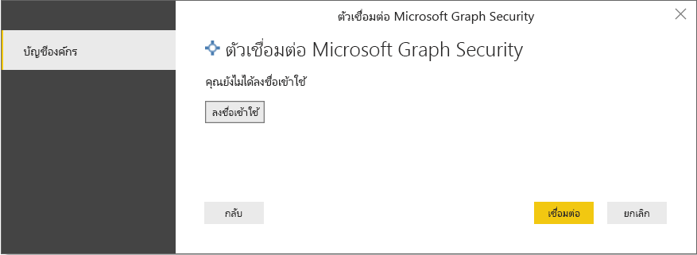
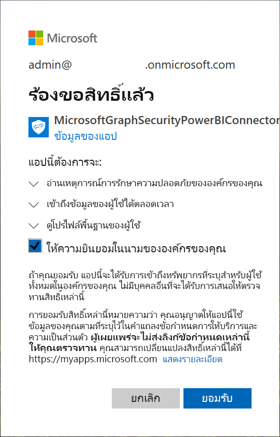
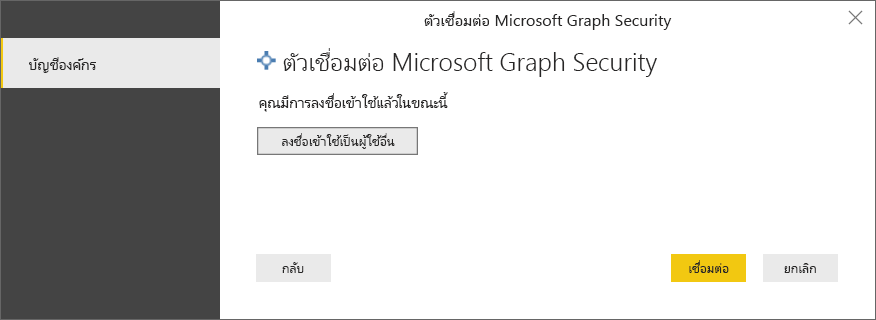
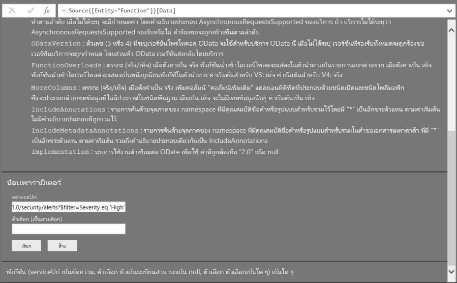
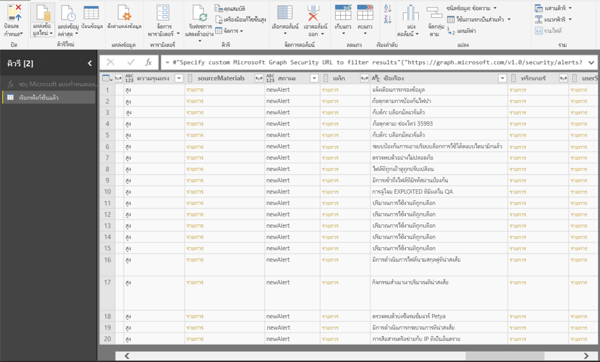

# เชื่อมต่อกับ Microsoft Graph Security API ใน Power BI DesktopConnect to the Microsoft Graph Security API in Power BI Desktop

ใช้ตัวเชื่อมต่อ Microsoft Graph Security ของ Power BI Desktop เพื่อเชื่อมต่อกับ [Microsoft Graph Security API](/graph/security-concept-overview)Use the Microsoft Graph Security connector of Power BI Desktop to connect to the [Microsoft Graph Security API](/graph/security-concept-overview). หลังจากนั้นคุณสามารถสร้างแดชบอร์ดและรายงานที่ช่วยให้คุณสามารถรับข้อมูลเชิงลึกให้กับการรักษาความปลอดภัยของคุณที่เกี่ยวข้อง [การแจ้งเตือน](/graph/api/resources/alert) และ [Secure Score](/graph/api/resources/securescores)You can then build dashboards and reports to gain insights into your security-related [alerts](/graph/api/resources/alert) and [secure scores](/graph/api/resources/securescores).

Microsoft Graph Security API เชื่อมต่อ [โซลูชันความปลอดภัยหลายรายการ](/graph/api/resources/security-api-overview#alerts) จาก Microsoft และคู่ค้าเพื่อให้การแจ้งเตือนสัมพันธ์กันง่ายขึ้นThe Microsoft Graph Security API connects [multiple security solutions](/graph/api/resources/security-api-overview#alerts) from Microsoft and its partners to make correlation of alerts easier. การผสานรวมนี้ให้การเข้าถึงข้อมูลบริบทที่หลากหลายและทำให้การทำงานอัตโนมัติเป็นเรื่องง่ายขึ้นThis combination provides access to rich contextual information and simplifies automation. ซึ่งช่วยให้องค์กรต่างๆ สามารถรับข้อมูลเชิงลึกและดำเนินการกับผลิตภัณฑ์รักษาความปลอดภัยหลายรายการได้อย่างรวดเร็วในขณะที่ลดต้นทุนและความซับซ้อนIt empowers organizations to quickly gain insights and act across multiple security products, while reducing cost and complexity.

## ข้อกำหนดเบื้องต้นเพื่อใช้งานตัวเชื่อมต่อ Microsoft Graph SecurityPrerequisites to use the Microsoft Graph Security connector

หากต้องการใช้งานตัวเชื่อมต่อ Microsoft Graph Security คุณต้องได้รับความยินยอมจากผู้ดูแลระบบส่วนกลาง Azure Active Directory (Azure AD) *อย่างชัดเจน*To use the Microsoft Graph Security connector, you must *explicitly* get consent by the Azure Active Directory (Azure AD) global administrator. โปรดดู [ข้อกำหนดการยืนยันตัวตนของ Microsoft Graph](/graph/security-authorization)See [Microsoft Graph Security authentication requirements](/graph/security-authorization).
การยินยอมต้องการรหัสแอปพลิเคชันและชื่อของตัวเชื่อมต่อซึ่งอ้างถึงที่นี่และพร้อมใช้งานใน [พอร์ทัล Azure](https://portal.azure.com):Consent requires the connector's application ID and name, which is cited here and is available in the [Azure portal](https://portal.azure.com):

| คุณสมบัติProperty | ValueValue |
|----------|-------|
| **ชื่อแอปพลิเคชัน****Application name** | `MicrosoftGraphSecurityPowerBIConnector` |
| **รหัสแอปพลิเคชัน****Application ID** | `cab163b7-247d-4cb9-be32-39b6056d4189` |
| **เปลี่ยนเส้นทาง URI****Redirect URI** | `https://oauth.powerbi.com/views/oauthredirect.html` |
|||

ในการให้ความยินยอมสำหรับตัวเชื่อมต่อ ผู้ดูแลระบบส่วนกลาง Azure AD ของคุณสามารถใช้วิธีใดวิธีหนึ่งต่อไปนี้:To grant consent for the connector, your Azure AD global administrator can use either of these methods:

* [ให้ความยินยอมสำหรับแอปพลิเคชัน Azure ADGrant consent for Azure AD applications](/azure/active-directory/develop/v2-permissions-and-consent)

* ตอบสนองต่อการร้องขอที่แอปลอจิกของคุณส่งในระหว่างการเรียกใช้ครั้งแรกผ่าน [ประสบการณ์ความยินยอมของแอปพลิเคชัน](/azure/active-directory/develop/application-consent-experience)Respond to a request that your logic app submits during its first run through the  [application-consent experience](/azure/active-directory/develop/application-consent-experience)
   
บัญชีผู้ใช้ที่ลงชื่อเข้าใช้ตัวเชื่อมต่อ Microsoft Graph Security ต้องได้รับการมอบหมายจากใน Azure AD **ถ้า** ตัวอ่านระบบความปลอดภัย หรือ *ผู้ดูแลระบบความปลอดภัย*The user account that signs in to the Microsoft Graph Security connector must be assigned the Azure AD Security Reader role, **if** the user is not a member of the *Security Administrator* role. โปรดดู [กำหนดบทบาท Azure AD ให้ผู้ใช้](/graph/security-authorization#assign-azure-ad-roles-to-users)See [Assign Azure AD roles to users](/graph/security-authorization#assign-azure-ad-roles-to-users).

## ใช้ตัวเชื่อมต่อ Microsoft Graph SecurityUsing the Microsoft Graph Security connector

ทำตามขั้นตอนเหล่านี้เพื่อใช้ตัวเชื่อมต่อ:Follow these steps to use the connector:

1. เลือก **รับข้อมูล** > **เพิ่มเติม** จากริบบอน **หน้าแรก** ใน Power BI DesktopSelect **Get Data** > **More** from the **Home** ribbon in Power BI Desktop.
2. เลือก **บริการออนไลน์** จากรายการหมวดหมู่ทางด้านซ้ายของหน้าต่างSelect **Online Services** from the categories list on the left side of the window.
3. โปรดเลือก **การรักษาความปลอดภัยของ Microsoft Graph**Select **Microsoft Graph Security (Beta)**.

    
    
4. ในหน้าต่าง **Microsoft Graph Security** ให้เลือกเวอร์ชันของ Microsoft Graph API เพื่อทำการคิวรี : **v1.0** หรือ **beta**In the **Microsoft Graph Security** window, select the Microsoft Graph API version to query: **v1.0** or **beta**.

    
    
5. ลงชื่อเข้าใช้บัญชี Azure Active Directory เมื่อคุณได้รับพร้อมต์แจ้งSign in to your Azure Active Directory account when you're prompted. บัญชีนี้ต้องมีบทบาท *ตัวอ่านระบบความปลอดภัย* หรือ *ผู้ดูแลระบบความปลอดภัย* ดังที่กล่าวไว้ในส่วนก่อนหน้าThis account needs to have the *Security Reader* or *Security Administrator* role, as mentioned in the previous section.

     
    
6. ถ้าคุณเป็นผู้ดูแลระบบ *และ* คุณยังไม่ได้ให้ความยินยอมกับตัวเชื่อมต่อ Microsoft Graph Security Power BI (แอปพลิเคชัน) คุณจะเห็นกล่องโต้ตอบต่อไปนี้If you're the admin *and* you don't yet have consent to the Microsoft Graph Security Power BI connector (application), you'll see the following dialog box. โปรดเลือก **ให้ความยินยอมในนามขององค์กรของคุณ**Select **Consent on behalf of your organization**.

    
    
7. เมื่อคุณลงชื่อเข้าใช้แล้ว คุณจะเห็นกล่องโต้ตอบต่อไปนี้ที่ระบุว่าคุณได้รับการตรวจสอบสิทธิ์แล้วWhen you're signed in, you'll see the following dialog box that indicates that you've been authenticated. เลือก **เชื่อมต่อ**Select **Connect**.

    
    
8. หลังจากคุณเชื่อมต่อแล้ว หน้าต่าง **ตัวนำทาง** จะแสดงการแจ้งเตือน คะแนนความปลอดภัย และเอนทิตีอื่น ๆ ที่มีอยู่ใน [Microsoft Graph Security API](/graph/security-concept-overview) สำหรับเวอร์ชันที่คุณเลือกในขั้นตอนที่ 4After you connect, the **Navigator** window displays the alerts, secure scores, and other entities that are available in the [Microsoft Graph Security API](/graph/security-concept-overview) for the version that you selected in step 4. เลือกเอนทิตี้ตั้งแต่หนึ่งรายการขึ่นไปเพื่อนำเข้า และใช้ใน Power BI DesktopSelect one or more entities to import and use in Power BI Desktop. จาดนั้น เลือก **โหลด** เพื่อดูผลลัพธ์ที่แสดงหลังจากขั้นตอนที่ 9Then, select **Load** to get the result view that's shown after step 9.

    
    
9. ถ้าคุณต้องการใช้งานคิวรีขั้นสูงกับ Microsoft Graph Security API ให้เลือก **ระบุ URL ของ Microsoft Graph Security แบบกำหนดเองเพื่อกรองผลลัพธ์**If you want to use an advanced query with the Microsoft Graph Security API, select **Specify custom Microsoft Graph Security URL to filter results**. ใช้ฟังก์ชันนี้เพื่อส่งคิวรี [OData.Feed](./desktop-connect-odata.md) ไปยัง Microsoft Graph Security API ด้วยสิทธิ์ที่จำเป็นUse this function to issue an [OData.Feed](./desktop-connect-odata.md) query to the Microsoft Graph Security API with the required permissions.

   ตัวอย่างต่อไปนี้ใช้ `https://graph.microsoft.com/v1.0/security/alerts?$filter=Severity eq 'High'` *serviceUri*The following example uses the `https://graph.microsoft.com/v1.0/security/alerts?$filter=Severity eq 'High'` *serviceUri*. เมื่อต้องการดูวิธีสร้างคิวรีเพื่อกรอง เรียงลำดับ หรือดึงผลลัพธ์ล่าสุดให้ดูที่ [ตัวเลือกคิวรีระบบ OData](/graph/query-parameters)To see how to build queries to filter, order, or retrieve the most-recent results, refer to [OData system query options](/graph/query-parameters).

   
    
   เมื่อคุณเลือกฟังก์ชัน **Invoke**, **OData.Feed** ทำให้เรียกใช้ API ซึ่งเปิดตัวแก้ไขคิวรีWhen you select **Invoke**, the **OData.Feed** function makes a call to the API, which opens Query Editor. คุณกรองและปรับแต่งชุดข้อมูลที่คุณต้องการใช้You filter and refine the set of data that you want to use. จากนั้นคุณโหลดข้อมูลนั้นลงใน Power BI DesktopThen, you load that data into Power BI Desktop.

นี่คือหน้าต่างผลลัพธ์สำหรับเอนทิตี Microsoft Graph Security ที่เราคิวรีไป:Here's the results window for the Microsoft Graph Security entities that we queried for:

   
    

ตอนนี้คุณพร้อมที่จะใช้ข้อมูลที่นำเข้าจากตัวเชื่อมต่อ Microsoft Graph Security ใน Power BI Desktop แล้วNow you’re ready to use the imported data from the Microsoft Graph Security connector in Power BI Desktop. คุณสามารถสร้างกราฟิกหรือรายงานได้You can create graphics or reports. หรือคุณสามารถโต้ตอบกับข้อมูลอื่นที่คุณนำเข้าจากเวิร์กบุ๊ก Excel ฐานข้อมูล หรือแหล่งข้อมูลอื่นได้Or, you can interact with other data that you import from Excel workbooks, databases, or other data sources.

## ขั้นตอนถัดไปNext steps
* ดูตัวอย่างและเทมเพลต Power BI ที่ใช้ตัวเชื่อมต่อนี้ที่ [ตัวอย่าง Microsoft Graph Security GitHub Power BI](https://aka.ms/graphsecuritypowerbiconnectorsamples)Check out Power BI samples and templates that use this connector at [Microsoft Graph Security GitHub Power BI samples](https://aka.ms/graphsecuritypowerbiconnectorsamples).

* สำหรับสถานการณ์ผู้ใช้และข้อมูลเพิ่มเติม โปรดดู [โพสต์บล็อกตัวเชื่อมต่อของ Microsoft Graph Security Power BI นี้](https://aka.ms/graphsecuritypowerbiconnectorblogpost)For user scenarios and additional information, see [this Microsoft Graph Security Power BI connector blog post](https://aka.ms/graphsecuritypowerbiconnectorblogpost).

* คุณสามารถเชื่อมต่อกับข้อมูลทุกประเภทได้โดยใช้ Power BI DesktopYou can connect to all sorts of data by using Power BI Desktop. สำหรับข้อมูลเพิ่มเติม โปรดดูทรัพยากรต่อไปนี้:For more information, check out the following resources:

    * [Power BI Desktop คืออะไรWhat is Power BI Desktop?](../fundamentals/desktop-what-is-desktop.md)
    * [แหล่งข้อมูลใน Power BI DesktopData sources in Power BI Desktop](desktop-data-sources.md)
    * [จัดรูปร่างและรวมข้อมูลด้วย Power BI DesktopShape and combine data with Power BI Desktop](desktop-shape-and-combine-data.md)
    * [เชื่อมต่อกับเวิร์กบุ๊ก Excel ใน Power BI DesktopConnect to Excel workbooks in Power BI Desktop](desktop-connect-excel.md)
    * [ป้อนข้อมูลลงใน Power BI Desktop โดยตรงEnter data directly into Power BI Desktop](desktop-enter-data-directly-into-desktop.md)