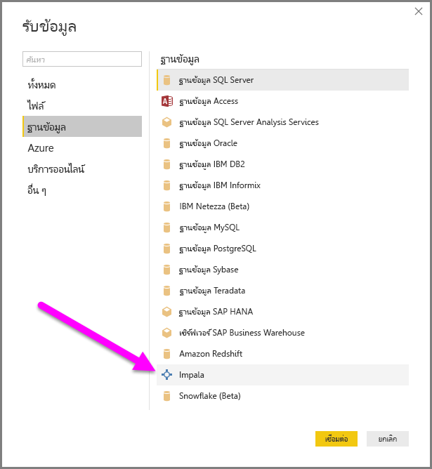

# เชื่อมต่อกับฐานข้อมูล Impala ใน Power BI DesktopConnect to an Impala database in Power BI Desktop
ใน Power BI Desktop คุณสามารถเชื่อมต่อกับฐานข้อมูล **Impala** และใช้ข้อมูลเบื้องต้นเช่นเดียวกับแหล่งข้อมูลอื่นใน Power BI Desktop ได้In Power BI Desktop, you can connect to an **Impala** database and use the underlying data just like you can with any other data source in Power BI Desktop.

## เชื่อมต่อกับฐานข้อมูล ImpalaConnect to an Impala database
หากต้องการเชื่อมต่อกับฐานข้อมูล **Impala** ให้ปฏิบัติตามขั้นตอนต่อไปนี้:To connect to an **Impala** database, take the following steps: 

1. เลือก **รับข้อมูล** จาก ribbon **หน้าแรก** ใน Power BI DesktopSelect **Get Data** from the **Home** ribbon in Power BI Desktop. 

2. เลือก **ฐานข้อมูล** จากหมวดหมู่ทางด้านซ้ายSelect **Database** from the categories on the left. คุณจะเห็น **Impala**Then you see **Impala**.

    

3. ในหน้าต่าง **Impala** ที่ปรากฏขึ้น ให้พิมพ์หรือวางชื่อเซิร์ฟเวอร์ Impala ลงในกล่องIn the **Impala** window that appears, type or paste the name of your Impala server into the box. จากนั้นเลือก **ตกลง**Then select **OK**. คุณสามารถเลือก **นำเข้า** ข้อมูลได้โดยตรงลงใน
 Power BI หรือจะใช้ **DirectQuery** ก็ได้You can **Import** data directly into Power BI or you can use **DirectQuery**. เรียนรู้เพิ่มเติมเกี่ยวกับ [การใช้ DirectQuery](desktop-use-directquery.md)Learn more about [using DirectQuery](desktop-use-directquery.md).

    

4. เมื่อได้รับพร้อมท์ ใส่ข้อมูลประจำตัวของคุณ หรือเชื่อมต่อแบบไม่ระบุชื่อWhen prompted, enter your credentials or connect anonymously. ตัวเชื่อมต่อ Impala รองรับการรับรองความถูกต้องแบบไม่ระบุชื่อ, แบบพื้นฐาน (ชื่อผู้ใช้ + รหัสผ่าน) และแบบ WindowsThe Impala connector supports Anonymous, Basic (user name + password), and Windows authentication.

    

    > [!NOTE]
    > หลังจากคุณใส่ชื่อผู้ใช้และรหัสผ่านสำหรับเซิร์ฟเวอร์ **Impala** ที่เฉพาะเจาะจงแล้ว Power BI Desktop จะใช้ข้อมูลประจำตัวเดียวกันนั้นเพื่อพยายามเชื่อมต่อในลำดับถัดมาAfter you put in your user name and password for a particular **Impala** server, Power BI Desktop uses those same credentials in subsequent connection attempts. คุณสามารถปรับเปลี่ยนข้อมูลประจำตัวเหล่านั้นได้โดยไปที่ **ไฟล์ > ตัวเลือกและการตั้งค่า > การตั้งค่าแหล่งข้อมูล**You can modify those credentials by going to **File > Options and settings > Data source settings**.

5. หลังจากที่คุณเชื่อมต่อ หน้าต่าง **ตัวนำทาง** จะปรากฏขึ้น และแสดงข้อมูลที่พร้อมใช้งานบนเซิร์ฟเวอร์After you connect, a **Navigator** window appears and displays the data that's available on the server. เลือกองค์ประกอบจากข้อมูลนี้เพื่อนำเข้าและใช้ใน **Power BI Desktop**Choose elements from this data to import and use in **Power BI Desktop**.

    

## ข้อควรพิจารณาและข้อจำกัดConsiderations and limitations
มีบางข้อจำกัดและข้อควรพิจารณาที่ควรระลึกถึงสำหรับตัวเชื่อมต่อ **Impala**:There are a few limitations and considerations to keep in mind with the **Impala** connector:

* เกตเวย์ข้อมูลภายในองค์กรรองรับตัวเชื่อมต่อ Impala โดยใช้กลไกการรับรองความถูกต้องที่รองรับสามแบบThe Impala connector is supported on the on-premises data gateway, using any of the three supported authentication mechanisms.

## ขั้นตอนถัดไปNext steps
มีแหล่งข้อมูลต่าง ๆ มากมายที่คุณสามารถเชื่อมต่อโดยการใช้ Power BI DesktopThere are many different data sources that you can connect to by using Power BI Desktop. สำหรับข้อมูลเพิ่มเติมเกี่ยวกับแหล่งข้อมูล โปรดดูทรัพยากรต่อไปนี้:For more information about data sources, check out the following resources:

* [Power BI Desktop คืออะไรWhat is Power BI Desktop?](../fundamentals/desktop-what-is-desktop.md)
* [แหล่งข้อมูลใน Power BI DesktopData sources in Power BI Desktop](desktop-data-sources.md)
* [จัดรูปร่างและรวมข้อมูลด้วย Power BI DesktopShape and combine data with Power BI Desktop](desktop-shape-and-combine-data.md)
* [เชื่อมต่อกับเวิร์กบุ๊ก Excel ใน Power BI DesktopConnect to Excel workbooks in Power BI Desktop](desktop-connect-excel.md)   
* [ใส่ข้อมูลลงใน Power BI Desktop โดยตรงEnter data directly into Power BI Desktop](desktop-enter-data-directly-into-desktop.md)   
