# เชื่อมต่อ LinkedIn Sales Navigator ใน Power BI DesktopConnect to LinkedIn Sales Navigator in Power BI Desktop

ใน **Power BI Desktop** คุณสามารถเชื่อมต่อกับ **LinkedIn Sales Navigator** เพื่อช่วยในการค้นหาและสร้างความสัมพันธ์เช่นเดียวกับแหล่งข้อมูลอื่นๆ ใน Power BI Desktop และสร้างรายงานที่พร้อมใช้งานเกี่ยวกับความคืบหน้าของคุณIn **Power BI Desktop**, you can connect to **LinkedIn Sales Navigator** to help find and build relationships just like any other data source in Power BI Desktop, and create ready-made reports about your progress.

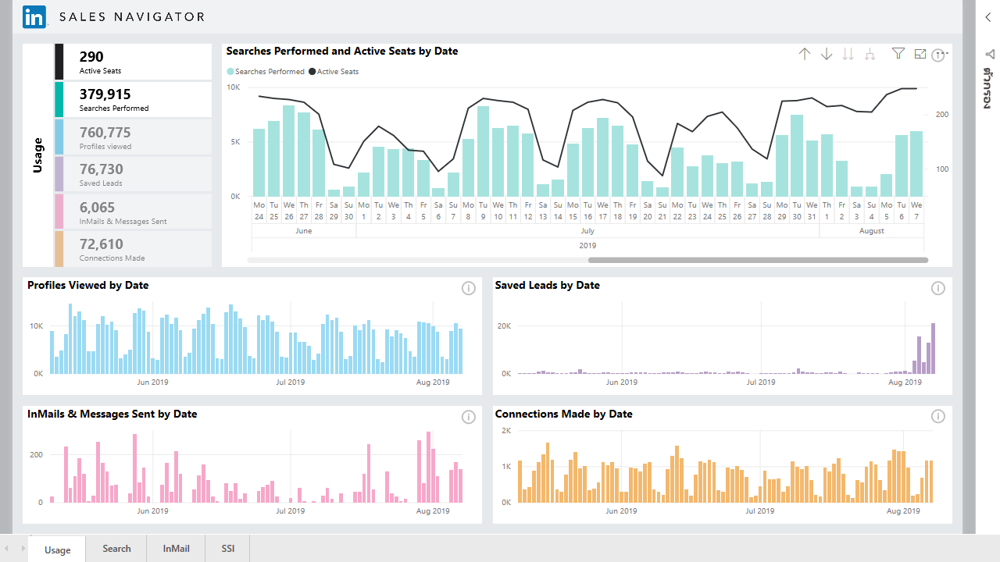

หากต้องการเชื่อมต่อกับข้อมูล LinkedIn โดยใช้ **LinkedIn Sales Navigator** คุณต้องมีแพ็กเกจ LinkedIn Sales Navigator Enterprise และเป็นผู้ดูแลหรือผู้ใช้การรายงานในสัญญา Sales NavigatorTo connect to LinkedIn data using the **LinkedIn Sales Navigator**, you need to have a LinkedIn Sales Navigator Enterprise plan, and either be an Admin or Reporting User on the Sales Navigator Contract.

วิดีโอต่อไปนี้ให้ข้อมูลแบบย่อและการฝึกใช้งานแอปแม่แบบ **LinkedIn Sales Navigator** ซึ่งจะอธิบายอย่างละเอียด [ภายหลังในบทความนี้](#using-the-linkedin-sales-navigator-template-app)The following video provides a quick tour and tutorial for using the **LinkedIn Sales Navigator** template app, which is described in detail [later in this article](#using-the-linkedin-sales-navigator-template-app). 

> [!VIDEO https://www.youtube.com/embed/ZqhmaiORLw0]

## เชื่อมต่อกับ LinkedIn Sales NavigatorConnect to LinkedIn Sales Navigator

หากต้องการเชื่อมต่อกับข้อมูล **LinkedIn Sales Navigator** ให้เลือก **รับข้อมูล** จากริบบิ้น **หน้าแรก** ใน Power BI DesktopTo connect to **LinkedIn Sales Navigator** data, select **Get Data** from the **Home** ribbon in Power BI Desktop. เลือก **บริการออนไลน์** จากหมวดหมู่ทางด้านซ้าย จากนั้นเลื่อนลงมาจนเห็น **LinkedIn Sales Navigator (Beta)**Select **Online Services** from the categories on the left, then scroll until you see **LinkedIn Sales Navigator (Beta)**.

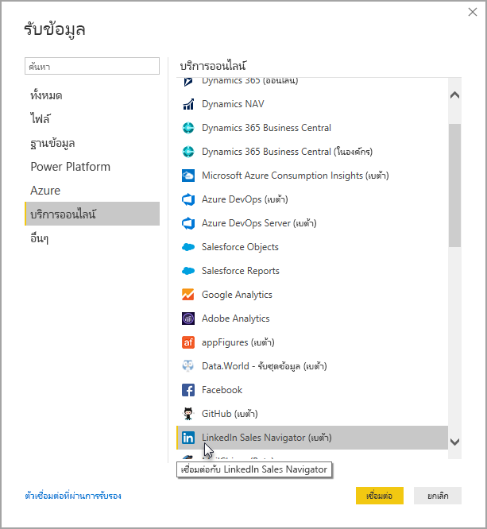

ระบบจะแนะนำคุณให้เชื่อมต่อกับตัวเชื่อมต่อบุคคลที่สามที่อยู่ในระหว่างการพัฒนาYou'll be advised that you're connecting to a third-party connecter that's still under development. 

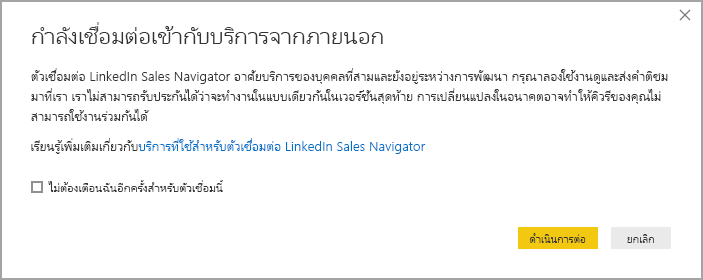

เมื่อเลือก **ดำเนินการต่อ** ระบบจะแจ้งให้คุณระบุข้อมูลที่ต้องการWhen you select **Continue**, you're prompted to specify which data you want.

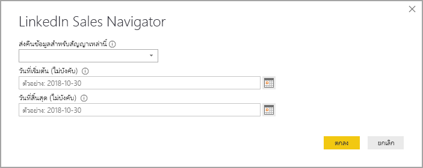

ในหน้าต่าง **LinkedIn Sales Navigator** ที่ปรากฎขึ้น ให้เลือกข้อมูลที่คุณต้องการให้แสดง เช่น *ผู้ติดต่อทั้งหมด* หรือ *ผู้ติดต่อที่เลือก* จากตัวเลือกแบบเลื่อนลงอันแรกIn the **LinkedIn Sales Navigator** window that appears, select which data you want to return, either *All contacts* or *Selected contacts* from the first drop-down selector. จากนั้นระบุวันที่เริ่มต้นและวันสิ้นสุดเพื่อจำกัดข้อมูลที่ได้รับไปยังหน้าต่างเวลาเฉพาะYou can then specify the start and end dates to constrain the data it receives to a particular time window.

เมื่อคุณให้ข้อมูลแล้ว Power BI Desktop จะเชื่อมต่อกับข้อมูลที่เชื่อมโยงกับสัญญา LinkedIn Sales NavigatorOnce you've provided the information, Power BI Desktop connects to the data associated with your LinkedIn Sales Navigator contract. ใช้อีเมลเดียวกันกับที่คุณใช้ลงชื่อเข้าใช้ LinkedIn Sales Navigator ผ่านเว็บไซต์Use the same email address you use to sign in to LinkedIn Sales Navigator through the website. 

เมื่อเชื่อมต่อเรียบร้อยแล้ว คุณจะได้รับแจ้งให้เลือกข้อมูลจากสัญญา LinkedIn Sales Navigator จากหน้าต่าง **Navigator**{3}{4}When you connect successfully, you're prompted to select which data from your LinkedIn Sales Navigator contract from a **Navigator** window.

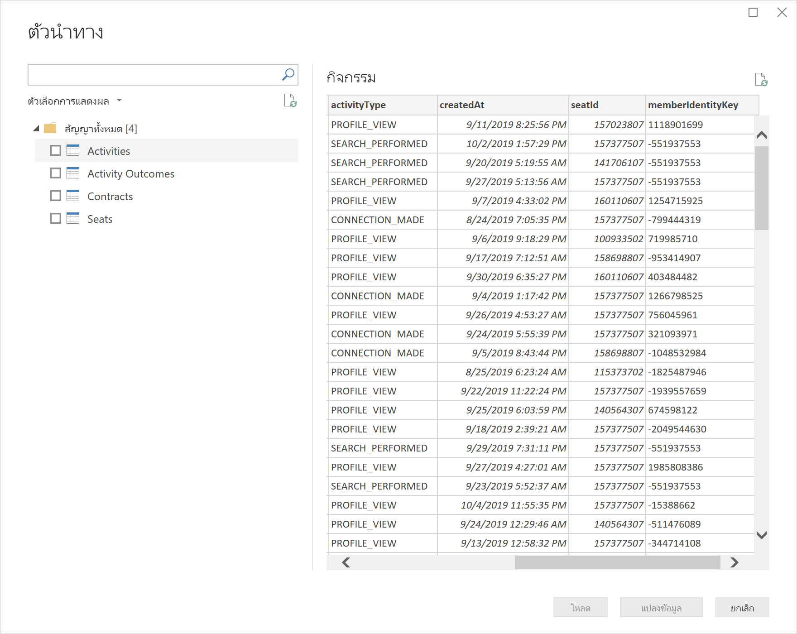

คุณจะสร้างรายงานที่คุณต้องการได้ด้วยข้อมูล LinkedIn Sales NavigatorYou can create whatever reports you like with your LinkedIn Sales Navigator data. เพื่อให้สิ่งต่างๆ ง่ายขึ้น นอกจากนี้ยังมีไฟล์ .PBIX ของ LinkedIn Sales Navigator ที่คุณดาวน์โหลดได้ซึ่งมีข้อมูลตัวอย่างอยู่แล้ว ดังนั้นคุณจึงทำความคุ้นเคยกับข้อมูลและรายงานได้โดยไม่ต้องเริ่มต้นใหม่To make things easier, there is also a LinkedIn Sales Navigator .PBIX file that you can download, that has sample data already provided, so you can get familiar with the data and the reports, without having to start from scratch.

คุณดาวน์โหลดไฟล์ .PBIX ได้จากตำแหน่งต่อไปนี้You can download the PBIX file from the following location:
* [PBIX for LinkedIn Sales NavigatorPBIX for LinkedIn Sales Navigator](service-template-apps-samples.md)

นอกเหนือจากไฟล์ .PBIX แล้ว LinkedIn Sales Navigator ยังมีแอปแม่แบบที่คุณดาวน์โหลดและใช้งานได้เช่นกันIn addition to the PBIX file, the LinkedIn Sales Navigator also has a template app that you can download and use, too. หัวข้อถัดไปจะอธิบายเกี่ยวกับแอปแม่แบบอย่างละเอียดThe next section describes the template app in detail.

## การใช้แอปแม่แบบ LinkedIn Sales NavigatorUsing the LinkedIn Sales Navigator template app

หากต้องการใช้ **LinkedIn Sales Navigator** ให้ง่ายที่สุด คุณจะใช้ [แอปแม่แบบ](service-template-apps-overview.md)ที่สร้างรายงานพร้อมใช้โดยอัตโนมัติจากข้อมูล LinkedIn Sales Navigator ได้To make using the **LinkedIn Sales Navigator** as easy as possible, you can use the [template app](service-template-apps-overview.md) that automatically creates a ready-made report from your LinkedIn Sales Navigator data.

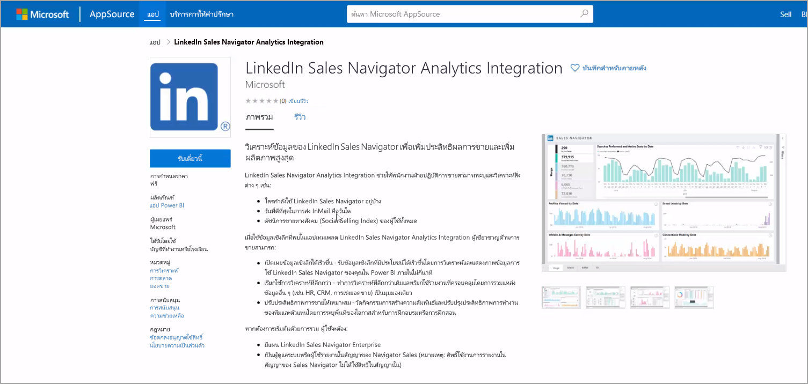

เมื่อดาวน์โหลดแอป คุณเลือกว่าจะเชื่อมต่อกับข้อมูลของคุณหรือสำรวจแอปด้วยข้อมูลตัวอย่างWhen you download the app, you can select whether to connect to your data, or explore the app with sample data. คุณย้อนกลับและเชื่อมต่อกับข้อมูล LinkedIn Sales Navigator ของคุณเองหลังจากที่คุณสำรวจข้อมูลตัวอย่างได้เสมอYou can always go back and connect to your own LinkedIn Sales Navigator data after you explore the sample data. 

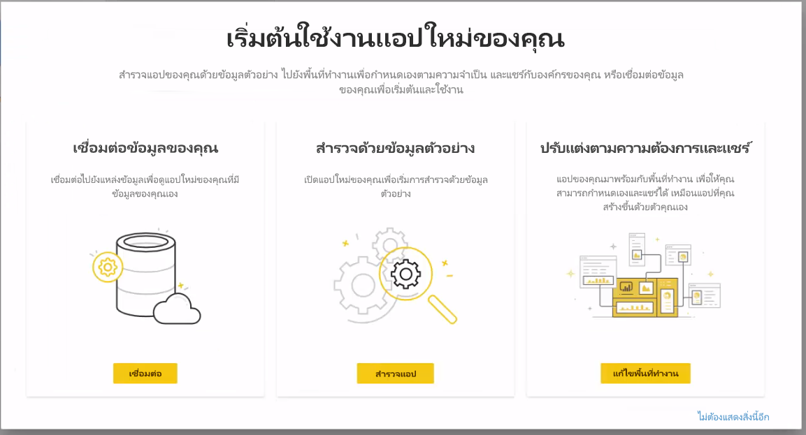

คุณดาวน์โหลดแอปแม่แบบ **LinkedIn Sales Navigator** ได้จากลิงก์ต่อไปนี้You can get the **LinkedIn Sales Navigator** template app from the following link:
* [แอปแม่แบบ LinkedIn Sales NavigatorLinkedIn Sales Navigator template app](https://appsource.microsoft.com/en-us/product/power-bi/pbi-contentpacks.linkedin_navigator)

แอปแม่แบบจะมีแท็บ 4 แบบเพื่อช่วยวิเคราะห์และแชร์ข้อมูลของคุณ ดังนี้The template app provides four tabs to help analyze and share your information:

* การใช้งานUsage
* SearchSearch
* InMailInMail
* SSISSI

แท็บ **การใช้งาน** จะแสดงข้อมูล LinkedIn Sales Navigator โดยรวมของคุณThe **Usage** tab shows your overall LinkedIn Sales Navigator data.

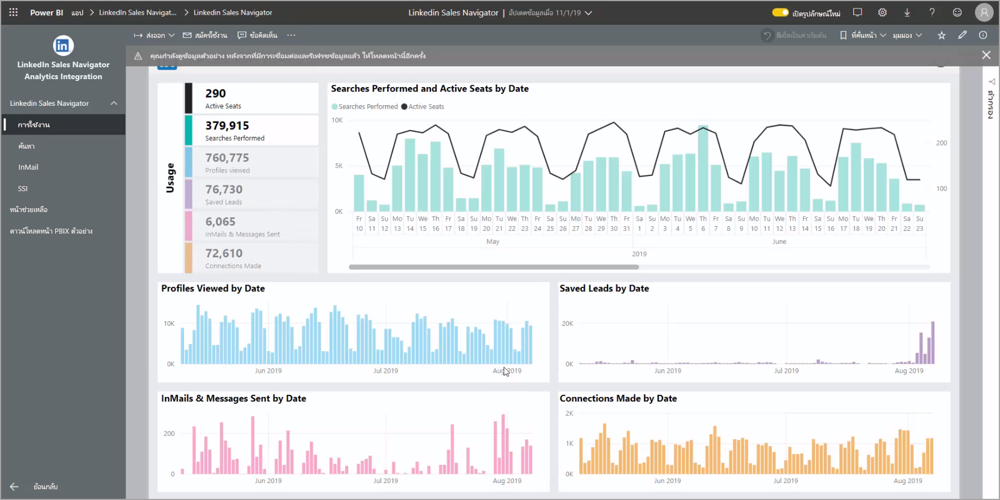

แท็บ **ค้นหา** จะช่วยให้คุณดูผลลัพธ์การค้นหาได้ละเอียดยิ่งขึ้นThe **Search** tab lets you drill deeper into your search results:

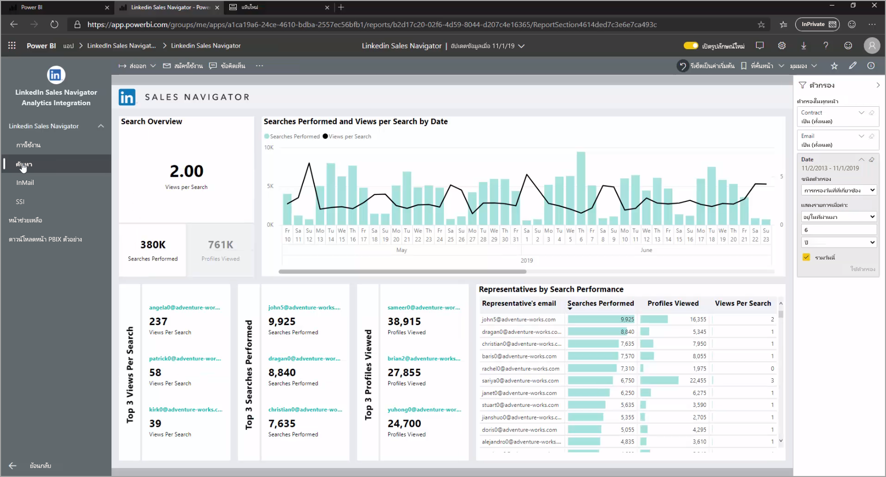

**InMail** ให้ข้อมูลเชิงลึกเกี่ยวกับการใช้งาน InMail รวมถึงจำนวนการส่ง InMail อัตราการยอมรับ และข้อมูลอื่นๆ ที่เป็นประโยชน์The **InMail** provides insights into your InMail usage, including number of InMails sent, acceptance rates, and other useful information:

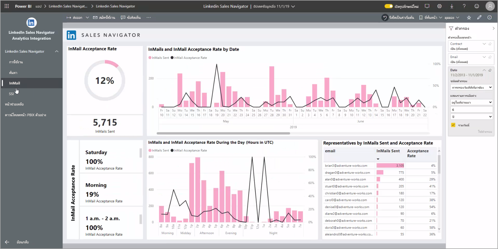

แท็บ **SSI** ให้รายละเอียดเพิ่มเติมเกี่ยวกับดัชนีการขายทางสังคม (SSI)The **SSI** tab provides additional details into your social selling index (SSI):

หากต้องการเปลี่ยนจากข้อมูลตัวอย่างปเป็นข้อมูลของคุณเอง ให้เลือก **แก้ไขแอป** ที่มุมขวาบน (ไอคอนดินสอ) และเลือก **เชื่อมต่อข้อมูล** จากหน้าจอที่ปรากฎขึ้นTo go from the sample data to your own data, select **edit app** in the top-right corner (the pencil icon) and then select **Connect your data** from the screen that appears.

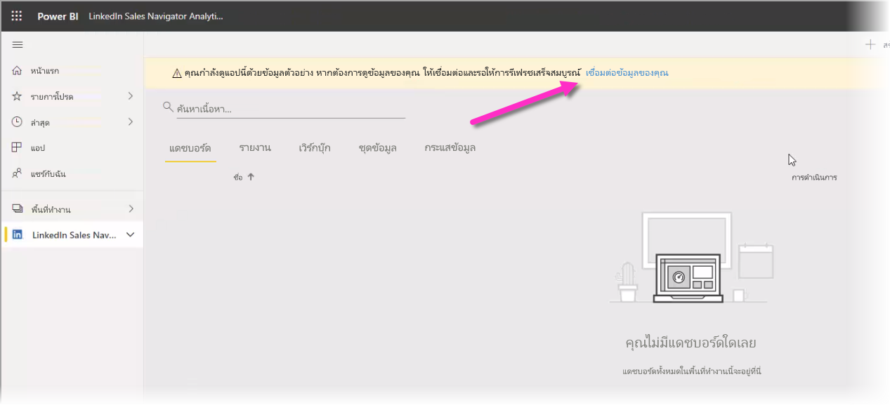

จากตรงนี้ คุณจะเชื่อมต่อข้อมูลของคุณได้โดยเลือกจำนวนวันของข้อมูลที่จะโหลดFrom there you can connect your own data, selecting how many days of data to load. คุณโหลดข้อมูลได้สูงสุดถึง 365 วันYou can load up to 365 days of data. คุณจะต้องลงชื่อเข้าใช้และใช้อีเมลเดิมที่คุณใช้ลงชื่อเข้าใช้ LinkedIn Sales Navigator ผ่านเว็บไซต์อีกครั้งYou'll need to sign in, again using the same email address you use to sign in to LinkedIn Sales Navigator through the website. 

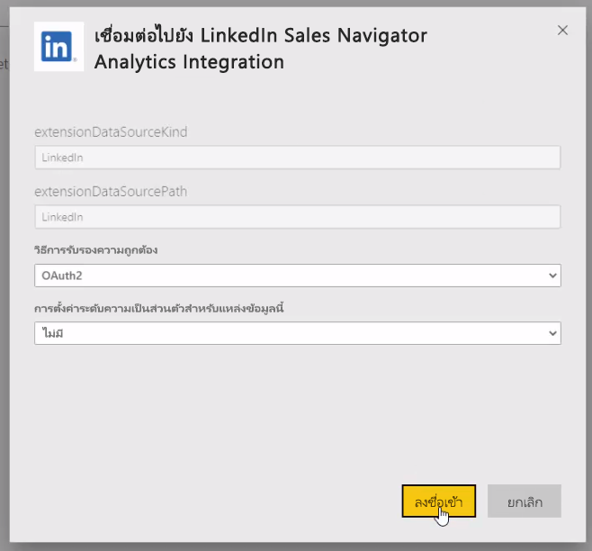

แอปแม่แบบ จากนั้นรีเฟรชข้อมูลในแอปด้วยข้อมูลข้องคุณthe template app then refreshes the data in the app with your data. คุณยังตั้งค่าการรีเฟรชตามกำหนดการได้เพื่อให้ข้อมูลในแอปเป็นปัจจุบันตามความถี่การรีเฟรชที่คุณระบุYou can also set up a scheduled refresh, so the data in your app is as current as your refresh frequency specifies. 

เมื่อข้อมูลอัปเดต คุณจะเห็นข้อมูลของคุณปรากฎในแอปOnce the data updates, you can see the app populated with your own data.

## การขอความช่วยเหลือGetting help

หากคุณประสบปัญหาเมื่อเชื่อมต่อกับข้อมูลของคุณ คุณสามารถติดต่อฝ่ายสนับสนุน LinkedIn Sales Navigator ได้ที่ https://www.linkedin.com/help/sales-navigatorIf you run into problems when connecting to your data, you can contact LinkedIn Sales Navigator support at https://www.linkedin.com/help/sales-navigator. 

## ขั้นตอนถัดไปNext steps
มีข้อมูลหลากหลายประเภทที่คุณสามารถเชื่อมต่อโดยใช้ Power BI DesktopThere are all sorts of data you can connect to using Power BI Desktop. สำหรับข้อมูลเพิ่มเติมเกี่ยวกับแหล่งข้อมูล โปรดดูทรัพยากรต่อไปนี้:For more information on data sources, check out the following resources:

* [Power BI Desktop คืออะไรWhat is Power BI Desktop?](../fundamentals/desktop-what-is-desktop.md)
* [แหล่งข้อมูลใน Power BI DesktopData Sources in Power BI Desktop](desktop-data-sources.md)
* [จัดรูปทรง และรวมข้อมูลด้วย Power BI DesktopShape and Combine Data with Power BI Desktop](desktop-shape-and-combine-data.md)
* [เชื่อมต่อกับเวิร์กบุ๊ก Excel ใน Power BI DesktopConnect to Excel workbooks in Power BI Desktop](desktop-connect-excel.md)   
* [ใส่ข้อมูลลงใน Power BI Desktop โดยตรงEnter data directly into Power BI Desktop](desktop-enter-data-directly-into-desktop.md)   
