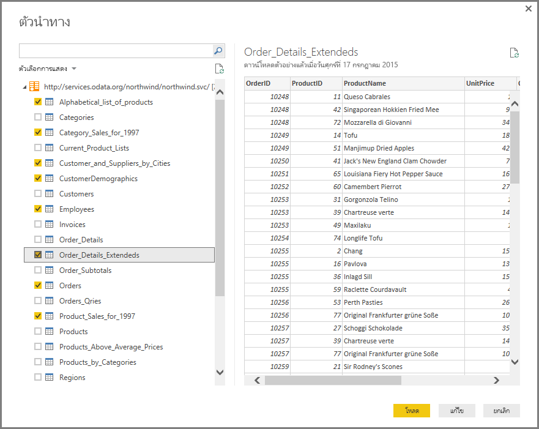
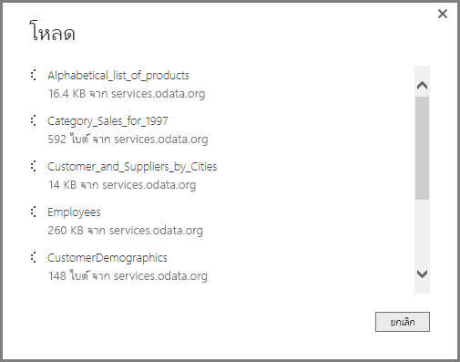
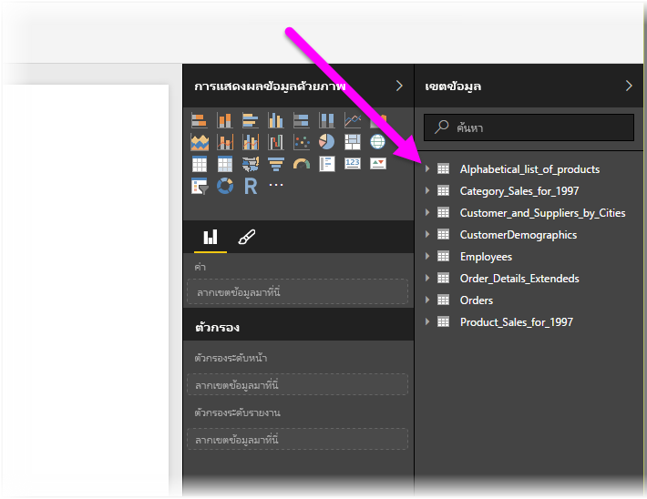

# เชื่อมต่อกับตัวดึงข้อมูล OData ใน Power BI DesktopConnect to OData feeds in Power BI Desktop
ใน Power BI Desktop คุณสามารถเชื่อมต่อกับ **ตัวดึงข้อมูล OData** และใช้ข้อมูลเบื้องต้นเช่นเดียวกับแหล่งข้อมูลอื่นใน Power BI Desktop ได้In Power BI Desktop, you can connect to an **OData feed** and use the underlying data just like any other data source in Power BI Desktop.

เมื่อต้องการเชื่อมต่อกับตัวดึงข้อมูล OData เลือก **รับข้อมูล > ตัวดึงข้อมูล OData** จาก Ribbon **หน้าหลัก** ใน Power BI DesktopTo connect to an OData feed, select **Get Data > OData Feed** from the **Home** ribbon in Power BI Desktop.

ในหน้าต่าง **ตัวดึงข้อมูล OData** ที่ปรากฎขึ้น พิมพ์ หรือวาง URL ของตัวดึงข้อมูล OData ของคุณลงในกล่อง และเลือก **ตกลง**In the **OData Feed** window that appears, type or paste your OData feed URL into the box, and select **OK**.

Power BI Desktop เชื่อมต่อกับตัวดึงข้อมูล OData และแสดงตารางที่พร้อมใช้งานและองค์ประกอบข้อมูลอื่น ๆ ในหน้าต่าง **ตัวนำทาง**Power BI Desktop connects to the OData feed, and displays the available tables and other data elements in the **Navigator** window. เมื่อคุณเลือกหนึ่งองค์ประกอบ พื้นที่ด้านขวาของหน้าต่าง **ตัวนำทาง** จะแสดงตัวอย่างของข้อมูลWhen you select an element, the right pane of the **Navigator** window displays a preview of the data. คุณสามารถเลือกตารางต่าง ๆ ได้มากเท่าที่คุณต้องการนำเข้าYou can select as many tables as you want to import. หน้าต่าง **ตัวนำทาง** จะแสดงตัวอย่างของตารางที่เลือกในปัจจุบันThe **Navigator** window shows a preview of the currently selected table.

คุณสามารถเลือกปุ่ม **แก้ไข** ซึ่งจะเปิด **ตัวแก้ไขแบบสอบถาม** ขึ้นมา ในหน้าต่างนี้คุณจะสามารถจัดการรูปร่างและเปลี่ยนแปลงข้อมูลจากตัวดึงข้อมูล OData ได้ ก่อนที่จะนำเข้าข้อมูลไปยัง Power BI DesktopYou can choose the **Edit** button, which launches **Query Editor**, where you can shape and transform the data from the OData feed before importing it into Power BI Desktop. หรือคุณสามารถเลือกปุ่ม **โหลด** และนำเข้าองค์ประกอบข้อมูลทั้งหมดที่คุณได้เลือกในช่องแสดงข้อมูลด้านซ้ายOr you can select the **Load** button, and import all of the data elements you selected in the left pane.

เมื่อเราเลือก **การโหลด** Power BI Desktop จะนำเข้ารายการที่เลือกไว้และแสดงหน้าต่าง **การโหลด** ของความคืบหน้าการนำเข้าWhen we select **Load**, Power BI Desktop imports the selected items, and displays a **Load** window of the import progress.

เมื่อเสร็จสมบูรณ์ Power BI Desktop จะทำตารางที่เลือกและองค์ประกอบข้อมูลอื่น ๆ ที่พร้อมใช้งานในพื้นที่ **ช่องข้อมูล** ที่พบบนด้านขวาของตัวมุมมอง *รายงาน* ใน Power BI DesktopOnce complete, Power BI Desktop makes the selected tables and other data elements available in the **Fields** pane, found on the right side of the *Reports* view in Power BI Desktop.

เท่านี้ก็เรียบร้อย!And that’s it!

ตอนนี้คุณพร้อมที่จะใช้ข้อมูลที่นำเข้าจากตัวดึงข้อมูล OData ใน Power BI Desktop เพื่อสร้างภาพ รายงาน หรือโต้ตอบกับข้อมูลอื่น ๆ ที่คุณอาจต้องการเชื่อมโยงและต้องการนำเข้า เช่น สมุดงาน Excel อื่น ๆ ฐานข้อมูล หรือแหล่งข้อมูลอื่น ๆYou’re now ready to use the imported data from the OData feed in Power BI Desktop to create visuals, reports, or interact with any other data you might want to connect with and import, such as other Excel workbooks, databases, or any other data source.

## ขั้นตอนถัดไปNext steps
มีข้อมูลหลากหลายประเภทที่คุณสามารถเชื่อมต่อโดยใช้ Power BI DesktopThere are all sorts of data you can connect to using Power BI Desktop. สำหรับข้อมูลเพิ่มเติมเกี่ยวกับแหล่งข้อมูล โปรดดูทรัพยากรต่อไปนี้:For more information on data sources, check out the following resources:

* [Power BI Desktop คืออะไรWhat is Power BI Desktop?](../fundamentals/desktop-what-is-desktop.md)
* [แหล่งข้อมูลใน Power BI DesktopData Sources in Power BI Desktop](desktop-data-sources.md)
* [จัดรูปทรงและรวมข้อมูลด้วย Power BI DesktopShape and Combine Data with Power BI Desktop](desktop-shape-and-combine-data.md)
* [เชื่อมต่อกับเวิร์กบุ๊ก Excel ใน Power BI DesktopConnect to Excel workbooks in Power BI Desktop](desktop-connect-excel.md)   
* [ป้อนข้อมูลลงใน Power BI Desktop โดยตรงEnter data directly into Power BI Desktop](desktop-enter-data-directly-into-desktop.md)   
