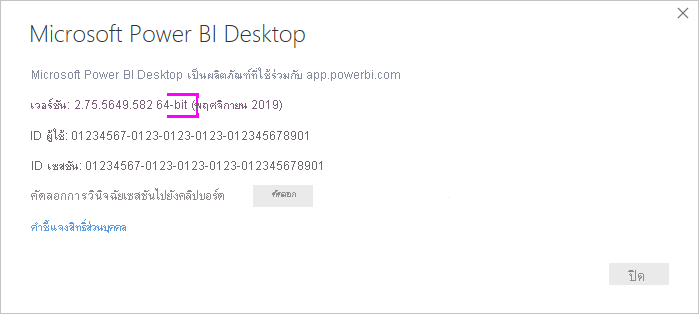
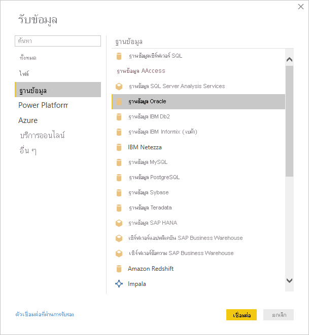
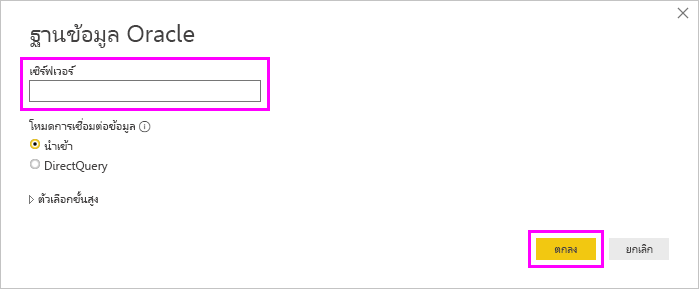
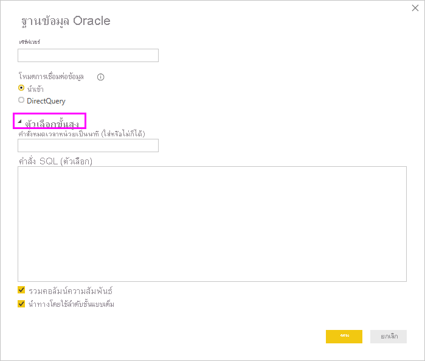

# เชื่อมต่อกับฐานข้อมูล Oracle ด้วย Power BI DesktopConnect to an Oracle database with Power BI Desktop
การเชื่อมต่อกับฐานข้อมูล Oracle ด้วย Power BI Desktop นั้น ต้องติดตั้งซอฟต์แวร์ไคลเอ็นต์ Oracle ที่ถูกต้องบนคอมพิวเตอร์ที่ใช้งาน Power BI DesktopTo connect to an Oracle database with Power BI Desktop, the correct Oracle client software must be installed on the computer running Power BI Desktop. ซอฟต์แวร์ไคลเอ็นต์ Oracle ที่คุณใช้ขึ้นอยู่กับเวอร์ชันของ Power BI Desktop ที่คุณได้ติดตั้ง: 32 บิต หรือ 64 บิตThe Oracle client software you use depends on which version of Power BI Desktop you've installed: 32-bit or 64-bit. นอกจากนี้ยังขึ้นอยู่กับเวอร์ชันของเซิร์ฟเวอร์ Oracle ของคุณIt also depends on your version of Oracle server.

เวอร์ชัน Oracle ที่รองรับ:Supported Oracle versions: 
- Oracle Server 9 และเวอร์ชันที่ใหม่กว่าOracle Server 9 and later
- ซอฟต์แวร์ Oracle Data Access Client (ODAC) 11.2 และเวอร์ชันที่ใหม่กว่าOracle Data Access Client (ODAC) software 11.2 and later

> [!NOTE]
> หากคุณกำลังกำหนดค่าฐานข้อมูล Oracle สำหรับ Power BI Desktop เกตเวย์ข้อมูลในองค์กร หรือ เซิร์ฟเวอร์รายงาน Power BI โปรดดูข้อมูลในบทความ[ชนิดการเชื่อมต่อ Oracle](/sql/reporting-services/report-data/oracle-connection-type-ssrs?view=sql-server-ver15)If you're configuring an Oracle database for Power BI Desktop, On Premises Data Gateway or Power BI Report Server, consult the information in the [Oracle Connection Type](/sql/reporting-services/report-data/oracle-connection-type-ssrs?view=sql-server-ver15) article. 

## หา Power BI Desktop ที่ติดตั้งอยู่เวอร์ชันใดDetermining which version of Power BI Desktop is installed
เมื่อต้องการตรวจสอบเวอร์ชันของ Power BI Desktop ที่ถูกติดตั้ง ให้เลือก **ไฟล์** > **วิธีใช้** > **เกี่ยวกับ** จากนั้นให้ตรวจสอบบรรทัด **เวอร์ชัน**To determine which version of Power BI Desktop is installed, select **File** > **Help** > **About**, then check the **Version** line. ในรูปต่อไปนี้ Power BI Desktop เวอร์ชัน 64 บิตถูกติดตั้งIn the following image, a 64-bit version of Power BI Desktop is installed:

## ติดตั้ง Oracle clientInstall the Oracle client
- สำหรับ Power BI Desktop เวอร์ชัน 32 บิต [ดาวน์โหลดและติดตั้งไคลเอ็นต์ Oracle 32 บิต](https://www.oracle.com/technetwork/topics/dotnet/utilsoft-086879.html).For the 32-bit version of Power BI Desktop, [download and install the 32-bit Oracle client](https://www.oracle.com/technetwork/topics/dotnet/utilsoft-086879.html).

- สำหรับ Power BI Desktop เวอร์ชัน 64 บิต [ดาวน์โหลดและติดตั้งไคลเอ็นต์ Oracle 64 บิต](https://www.oracle.com/database/technologies/odac-downloads.html).For the 64-bit version of Power BI Desktop, [download and install the 64-bit Oracle client](https://www.oracle.com/database/technologies/odac-downloads.html).

> [!NOTE]
> เลือกเวอร์ชันของ Oracle Data Access Client (ODAC) ซึ่งสามารถทำงานร่วมกับเซิร์ฟเวอร์ Oracle ของคุณได้Choose a version of Oracle Data Access Client (ODAC) which is compatible with your Oracle Server. ตัวอย่างเช่น ODAC 12.x ไม่รองรับเซิร์ฟเวอร์ Oracle เวอร์ชัน 9For instance, ODAC 12.x does not always support Oracle Server version 9.
> เลือกตัวติดตั้ง Windows ของไคลเอ็นต์ OracleChoose the Windows installer of the Oracle Client.
> ระหว่างการตั้งค่าของไคลเอ็นต์ Oracle คุณต้องตรวจสอบให้แน่ใจว่าได้เปิดใช้งาน *กำหนดค่า ODP.NET และ/หรือผู้ให้บริการ Oracle สำหรับ ASP.NET ที่ระดับเครื่อง* โดยการเลือกกล่องกาเครื่องหมายที่เกี่ยวข้องในระหว่างการตั้งค่าตัวช่วยสร้างDuring the setup of the Oracle client, make sure you enable *Configure ODP.NET and/or Oracle Providers for ASP.NET at machine-wide level* by selecting the corresponding checkbox during the setup wizard. ตัวช่วยสร้างไคลเอ็นต์ Oracle บางเวอร์ชันเลือกกล่องกาเครื่องหมายตามค่าเริ่มต้น ซึ่งเวอร์ชันอื่น ๆ ไม่ทำเช่นนี้Some versions of the Oracle client wizard selects the checkbox by default, others do not. ตรวจสอบให้แน่ใจว่าคุณได้เลือกกล่องกาเครื่องหมายเพื่อให้ Power BI สามารถเชื่อมต่อกับฐานข้อมูล Oracle ของคุณได้Make sure that checkbox is selected so that Power BI can connect to your Oracle database.

## เชื่อมต่อกับฐานข้อมูล OracleConnect to an Oracle database
หลังจากที่คุณติดตั้งไคลเอ็นต์ไดร์ฟเวอร์ Oracle ที่ตรงกัน คุณสามารถเชื่อมต่อกับฐานข้อมูล OracleAfter you install the matching Oracle client driver, you can connect to an Oracle database. เมื่อต้องทำการเชื่อมต่อ ให้ทำตามขั้นตอนต่อไปนี้To make the connection, take the following steps:

1. จากแท็บ **หน้าแรก** ให้เลือก **รับข้อมูล**From the **Home** tab, select **Get Data**. 

2. จากหน้าต่าง **รับข้อมูล** ที่ปรากฏขึ้น ให้เลือก **เพิ่มเติม** (ถ้าจำเป็น) เลือก **ฐานข้อมูล** > **ฐานข้อมูล Oracle** และจากนั้นเลือก **เชื่อมต่อ**From the **Get Data** window that appears, select **More** (if necessary), select **Database** > **Oracle database**, and then select **Connect**.
   
   
3. ในกล่องโต้ตอบ **ฐานข้อมูล Oracle** ที่ปรากฏขึ้น ให้ใส่ชื่อของ **เซิร์ฟเวอร์** และเลือก **ตกลง**In the **Oracle database** dialog that appears, provide the name of the **Server**, and select **OK**. หากกำหนดให้มี SID ให้ระบุโดยใช้รูปแบบ: *ServerName/SID* โดยที่ *SID* เป็นชื่อที่ไม่ซ้ำกันของฐานข้อมูลIf a SID is required, specify it by using the format: *ServerName/SID*, where *SID* is the unique name of the database. ถ้ารูปแบบ *ServerName/SID* ไม่ทำงาน ให้ใช้ *ServerName/ServiceName* โดยที่ *ServiceName* เป็นนามแฝงที่คุณใช้เพื่อเชื่อมต่อIf the *ServerName/SID* format doesn't work, use *ServerName/ServiceName*, where *ServiceName* is the alias you use to connect.

   

   > [!NOTE]
   > หากคุณกำลังใช้ฐานข้อมูลในเครื่องหรือการเชื่อมต่อฐานข้อมูลที่ทำงานแบบอิสระ คุณอาจต้องวางชื่อเซิร์ฟเวอร์ในเครื่องหมายคำพูดเพื่อหลีกเลี่ยงข้อผิดพลาดในการเชื่อมต่อIf you are using a local database, or autonomous database connections, you may need to place the server name in quotation marks to avoid connection errors. 
      
4. ถ้าคุณต้องการนำเข้าข้อมูลโดยใชคิวรี่ของฐานข้อมูลแบบเนทีฟ ให้ใส่คิวรีของคุณในกล่อง **คำสั่ง SQL** ที่ปรากฏขึ้นเมื่อคุณขยายส่วน **ตัวเลือกขั้นสูง** ของกล่องโต้ตอบ **ฐานข้อมูล Oracle**If you want to import data by using a native database query, put your query in the **SQL statement** box, which appears when you expand the **Advanced options** section of the **Oracle database** dialog.
   
   

5. หลังจากที่คุณป้อนข้อมูลของฐานข้อมูล Oracle ของคุณลงในกล่องโต้ตอบฐานข้อมูล **Oracle** (รวมถึงข้อมูลประกอบใดๆ เช่น SID หรือคิวรี่ฐานข้อมูลเนทีฟ) ให้เลือก **ตกลง** เพื่อเชื่อมต่อAfter you've entered your Oracle database information in the **Oracle database** dialog (including any optional information such as a SID or a native database query), select **OK** to connect.
5. ถ้าฐานข้อมูล Oracle ต้องใช้ข้อมูลประจำตัวผู้ใช้ฐานข้อมูล ให้ป้อนข้อมูลประจำตัวเหล่านั้นในกล่องโต้ตอบเมื่อได้รับการขอจากระบบIf the Oracle database requires database user credentials, input those credentials in the dialog when prompted.

## การแก้ไขปัญหาTroubleshooting

คุณอาจพบข้อผิดพลาดต่าง ๆ มากมายจาก Oracle เมื่อไวยากรณ์การตั้งชื่อไม่ถูกต้อง หรือไม่ได้กำหนดค่าอย่างถูกต้อง:You might encounter any of several errors from Oracle when the naming syntax is either incorrect or not configured properly:

* ORA-12154: TNS: ไม่สามารถแก้ไขตัวระบุการเชื่อมต่อที่ระบุได้ORA-12154: TNS:could not resolve the connect identifier specified.
* ORA-12514: TNS: ในขณะนี้ ตัวรอรับการติดต่อไม่รู้จักบริการที่ร้องขอในตัวอธิบายการเชื่อมต่อORA-12514: TNS:listener does not currently know of service requested in connect descriptor.
* ORA-12541: TNS: ไม่มีตัวรอรับการติดต่อORA-12541: TNS:no listener.
* ORA-12170: TNS: เกิดเหตุการณ์การเชื่อมต่อหมดเวลาORA-12170: TNS:connect timeout occurred.
* ORA-12504: TNS: ตัวรอรับการติดต่อไม่ได้รับ SERVICE_NAME ใน CONNECT_DATAORA-12504: TNS:listener was not given the SERVICE_NAME in CONNECT_DATA.

ข้อผิดพลาดเหล่านี้อาจเกิดขึ้นหากไม่ได้ติดตั้ง Oracle client หรือกำหนดค่าไม่ถูกต้องThese errors might occur if the Oracle client either isn't installed or isn't configured properly. ถ้ามีการติดตั้งอยู่แล้ว ให้ตรวจสอบว่ามีการกำหนดค่าไฟล์ tnsnames.ora อย่างถูกต้องหรือไม่ และคุณกำลังใช้ net_service_name ที่เหมาะสมหรือไม่If it's installed, verify that the tnsnames.ora file is properly configured and you're using the proper net_service_name. นอกจากนี้ คุณจะต้องตรวจสอบให้แน่ใจว่า net_service_name สำหรับเครื่องที่ใช้ Power BI Desktop และเครื่องที่ใช้งานเกตเวย์นั้นเป็นตัวเดียวกันหรือไม่You also need to make sure that the net_service_name is the same between the machine that uses Power BI Desktop and the machine that runs the gateway. สำหรับข้อมูลเพิ่มเติม โปรดดู [ติดตั้ง Oracle Client](#install-the-oracle-client)For more information, see [Install the Oracle client](#install-the-oracle-client).

คุณอาจประสบปัญหาความเข้ากันได้ระหว่างเวอร์ชัน Oracle server และเวอร์ชัน Oracle Data Access ClientYou might also encounter a compatibility issue between the Oracle server version and the Oracle Data Access Client version. โดยทั่วไปแล้ว คุณต้องใช้เวอร์ชันที่สอดคล้องกัน เนื่องจากชุดการทำงานบางอย่างอาจไม่เข้ากันTypically, you want these versions to match, as some combinations are incompatible. ตัวอย่างเช่น ODAC 12.x นั้นไม่รองรับเซิร์ฟเวอร์ Oracle เวอร์ชัน 9For instance, ODAC 12.x does not support Oracle Server version 9.

ถ้าคุณดาวน์โหลด Power BI Desktop จาก Microsoft Store คุณอาจไม่สามารถเชื่อมต่อกับฐานข้อมูล Oracle เนื่องจากปัญหาโปรแกรมควบคุม OracleIf you downloaded Power BI Desktop from the Microsoft Store, you might be unable to connect to Oracle databases because of an Oracle driver issue. ถ้าคุณพบปัญหานี้ ข้อความแสดงข้อผิดพลาดที่ส่งคืนคือ: *ไม่ได้ตั้งค่าการอ้างอิงอ็อปเจ็กต์*If you encounter this issue, the error message returned is: *Object reference not set*. การแก้ไขปัญหา ให้ทำหนึ่งในขั้นตอนเหล่านี้:To address the issue, do one of these steps:

* ดาวน์โหลด Power BI Desktop จาก [ศูนย์ดาวน์โหลด](https://www.microsoft.com/download/details.aspx?id=58494) แทนที่จะเป็น Microsoft StoreDownload Power BI Desktop from the [Download Center](https://www.microsoft.com/download/details.aspx?id=58494) instead of Microsoft Store.

* ถ้าคุณต้องการใช้เวอร์ชันจาก Microsoft Store: บนคอมพิวเตอร์ของคุณ ให้คัดลอก oraons.dll จาก _12.X.X\client_X_ ลงใน _12.X.X\client_X\bin_ โดยที่ _X_ แสดงเวอร์ชันและหมายเลขไดเรกทอรี่If you want to use the version from Microsoft Store: on your local computer, copy oraons.dll from _12.X.X\client_X_ to _12.X.X\client_X\bin_, where _X_ represents version and directory numbers.

หากคุณเห็นข้อความแสดงข้อผิดพลาด *ไม่ได้ตั้งค่าการอ้างอิงอ็อปเจ็กต์* ใน Power BI Gateway เมื่อคุณเชื่อมต่อกับฐานข้อมูล Oracle ให้ทำตามคำแนะนำใน [จัดการแหล่งข้อมูลของคุณ - Oracle](service-gateway-onprem-manage-oracle.md)If you see the error message, *Object reference not set*, in the Power BI Gateway when you connect to an Oracle database, follow the instructions in [Manage your data source - Oracle](service-gateway-onprem-manage-oracle.md).

ถ้าคุณกำลังใช้เซิร์ฟเวอร์รายงาน Power BI ให้ดูคำแนะนำในบทความ [ชนิดการเชื่อมต่อ Oracle](/sql/reporting-services/report-data/oracle-connection-type-ssrs?view=sql-server-ver15)If you're using Power BI Report Server, consult the guidance in the [Oracle Connection Type](/sql/reporting-services/report-data/oracle-connection-type-ssrs?view=sql-server-ver15) article.