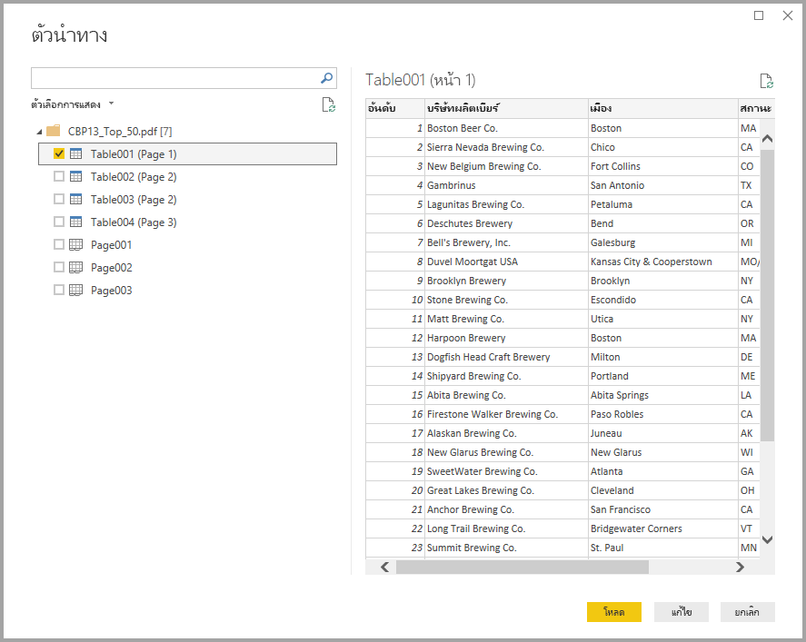
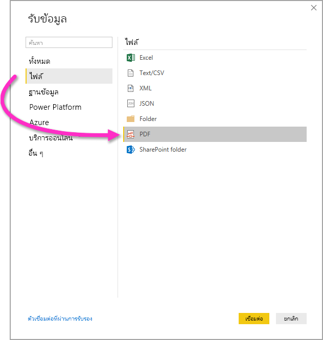

# เชื่อมต่อกับไฟล์ PDF ใน Power BI DesktopConnect to PDF files in Power BI Desktop
ใน Power BI Desktop คุณสามารถเชื่อมต่อกับ **ไฟล์ PDF** และใช้ข้อมูลที่รวมจากไฟล์เช่นเดียวกับแหล่งข้อมูลอื่น ๆ ใน Power BI DesktopIn Power BI Desktop, you can connect to a **PDF file** and use the included data from the file, just like any other data source in Power BI Desktop.

หัวข้อต่อไปนี้อธิบายถึงวิธีเชื่อมต่อกับ **ไฟล์ PDF** เลือกข้อมูล และนำข้อมูลดังกล่าวไปวางไว้ที่ **Power BI Desktop**The following sections describe how to connect to a **PDF file**, select data, and bring that data into **Power BI Desktop**.

เราแนะนำให้อัปเกรดเป็นเวอร์ชันล่าสุด **Power BI Desktop** เสมอ ซึ่งคุณสามารถรับได้จากลิงก์ใน [รับ Power BI Desktop](../fundamentals/desktop-get-the-desktop.md)We always recommend upgrading to the most recent release of **Power BI Desktop**, which you can get from a link in [get Power BI Desktop](../fundamentals/desktop-get-the-desktop.md). 

## เชื่อมต่อกับไฟล์ PDFConnect to a PDF file
หากต้องการเชื่อมต่อกับไฟล์ **PDF** ให้เลือก **รับข้อมูล** จากริบบิ้น **หน้าแรก** ใน Power BI DesktopTo connect to a **PDF** file select **Get Data** from the **Home** ribbon in Power BI Desktop. เลือก **ไฟล์** จากหมวดหมู่ด้านซ้าย และคุณจะเห็น **PDF**Select **File** from the categories on the left, and you see **PDF**.

คุณได้รับพร้อมท์ให้ระบุตำแหน่งของไฟล์ PDF ที่คุณต้องการใช้You're prompted to provide the location of the PDF file you want to use. เมื่อคุณระบุตำแหน่งไฟล์และโหลดไฟล์ PDF หน้าต่าง **เนวิเกเตอร์** จะปรากฏขึ้นและแสดงข้อมูลจากไฟล์ ซึ่งคุณสามารถเลือกองค์ประกอบหนึ่งหรือหลายรายการเพื่อนำเข้าและใช้ใน **Power BI Desktop**Once you provide the file location and the PDF file loads, a **Navigator** window appears and displays the data available from the file, from which you can select one or multiple elements to import and use in **Power BI Desktop**.

การเลือกช่องทำเครื่องหมายถัดจากองค์ประกอบที่ค้นพบในไฟล์ PDF จะแสดงรายการในบานหน้าต่างด้านขวาSelecting a checkbox next to discovered elements in the PDF file displays them in the right pane. เมื่อคุณพร้อมที่จะนำเข้าแล้วให้เลือกปุ่ม **Load (โหลด)** เพื่อนำข้อมูลมาไว้ใน **Power BI Desktop**When you're ready to import, select the **Load** button to bring the data into **Power BI Desktop**.

ตั้งแต่เดือนพฤศจิกายน 2018 ในการเผยแพร่ของ **Power BI Desktop** คุณสามารถระบุ **หน้าเริ่มต้น** และ **หน้าสุดท้าย** เป็นพารามิเตอร์เพิ่มเติมสำหรับการเชื่อมต่อ PDF ของคุณได้Beginning with the November 2018 release of **Power BI Desktop**, you can specify the **Start page** and **End Page** as optional parameters for your PDF connection. คุณยังสามารถระบุพารามิเตอร์เหล่านี้ในภาษาสูตร M โดยใช้รูปแบบต่อไปนี้:You can also specify these parameters in the M formula language, using the following format:

`Pdf.Tables(File.Contents("c:\sample.pdf"), [StartPage=10, EndPage=11])`

## ข้อจำกัดและข้อควรพิจารณาLimitations and considerations

เมื่อทำงานกับตัวเชื่อมต่อ PDF บนชุดข้อมูลในความจุพรีเมี่ยม ตัวเชื่อมต่อ PDF จะเชื่อมต่ออย่างไม่ถูกต้องWhen working with the PDF connector on datasets in a Premium capacity, the PDF connector does not properly make the connection. หากต้องการเปิดใช้งานตัวเชื่อมต่อ PDF เพื่อทำงานกับชุดข้อมูลในความจุพรีเมี่ยม ให้กำหนดค่าชุดข้อมูลนั้นเพื่อใช้เกตเวย์และยืนยันการเชื่อมต่อกับชุดข้อมูลนั้นผ่านเกตเวย์To enable the PDF connector to work on a dataset in a Premium capacity, configure that dataset to use a gateway, and confirm the connection to that dataset goes through the gateway.  

## ขั้นตอนถัดไปNext steps
มีข้อมูลหลากหลายประเภทที่คุณสามารถเชื่อมต่อโดยใช้ Power BI DesktopThere are all sorts of data you can connect to using Power BI Desktop. สำหรับข้อมูลเพิ่มเติมเกี่ยวกับแหล่งข้อมูล โปรดดูทรัพยากรต่อไปนี้:For more information on data sources, check out the following resources:

* [Power BI Desktop คืออะไรWhat is Power BI Desktop?](../fundamentals/desktop-what-is-desktop.md)
* [แหล่งข้อมูลใน Power BI DesktopData Sources in Power BI Desktop](desktop-data-sources.md)
* [จัดรูปทรงและรวมข้อมูลด้วย Power BI DesktopShape and Combine Data with Power BI Desktop](desktop-shape-and-combine-data.md)
* [เชื่อมต่อกับเวิร์กบุ๊ก Excel ใน Power BI DesktopConnect to Excel workbooks in Power BI Desktop](desktop-connect-excel.md)   
* [ป้อนข้อมูลลงใน Power BI Desktop โดยตรงEnter data directly into Power BI Desktop](desktop-enter-data-directly-into-desktop.md)   
