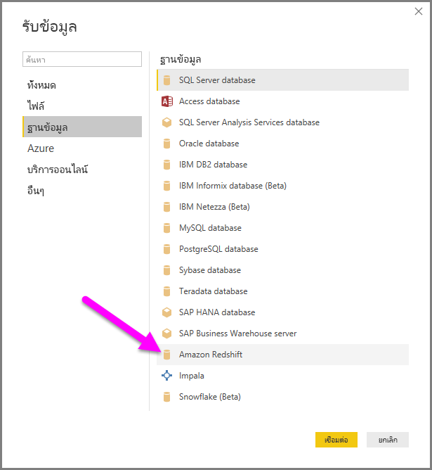
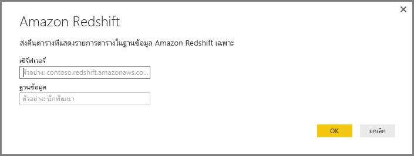
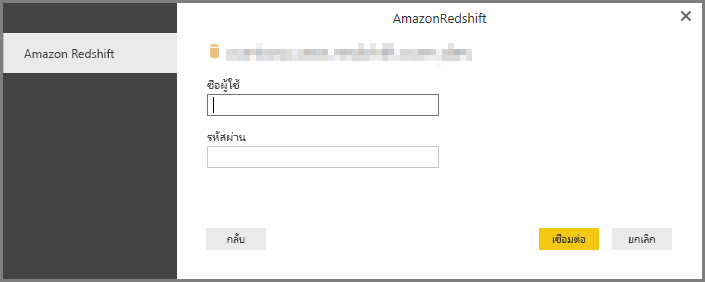
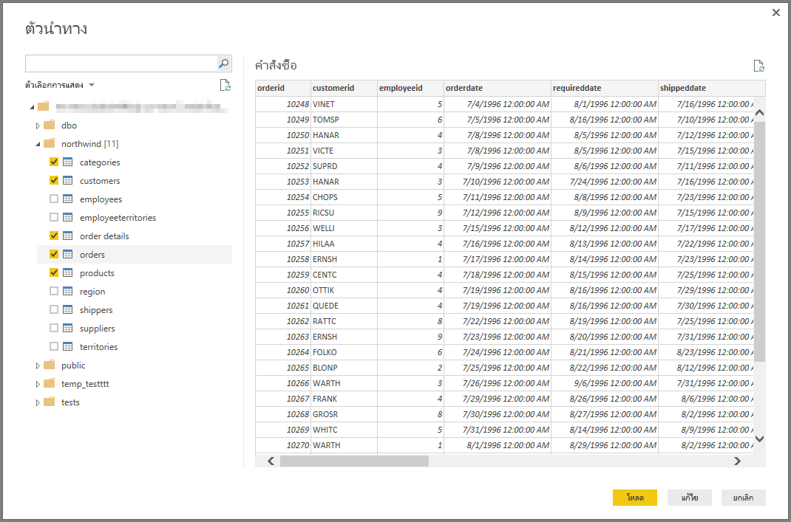

# เชื่อมต่อกับฐานข้อมูล Amazon Redshift ใน Power BI DesktopConnect to an Amazon Redshift database in Power BI Desktop
ใน **Power BI Desktop** คุณสามารถเชื่อมต่อกับฐานข้อมูล **Amazon Redshift** และใช้ข้อมูลเบื้องต้นเช่นเดียวกับแหล่งข้อมูลอื่นใน Power BI Desktop ได้In **Power BI Desktop**, you can connect to an **Amazon Redshift** database and use the underlying data just like any other data source in Power BI Desktop.

## เชื่อมต่อกับฐานข้อมูล Amazon RedshiftConnect to an Amazon Redshift database
เพื่อเชื่อมต่อกับฐานข้อมูล **Impala** ให้เลือก **รับข้อมูล** จาก ริบบอน **หน้าแรก** ใน Power BI DesktopTo connect to an **Amazon Redshift** database, select **Get Data** from the **Home** ribbon in Power BI Desktop. เลือก **ฐานข้อมูล** จากประเภททางด้านซ้าย จากนั้นคุณจะเห็น **Amazon Redshift**Select **Database** from the categories on the left, and you see **Amazon Redshift**.

ในหน้าต่าง **Amazon Redshift** ที่ปรากฎขึ้น พิมพ์หรือวางชื่อเซิร์ฟเวอร์ **Amazon Redshift** และฐานข้อมูลของคุณลงในกล่องIn the **Amazon Redshift** window that appears, type or paste the name of your **Amazon Redshift** server and database into the box. ในฐานะเป็นส่วนหนึ่งของเขตข้อมูล *เซิร์ฟเวอร์* ผู้ใช้สามารถระบุพอร์ตในรูปแบบต่อไปนี้: *ServerURL:Port*As part of the *Server* field, users can specify a port in the following format: *ServerURL:Port*

เมื่อได้รับการถาม ให้ใส่ชื่อผู้ใช้และรหัสผ่านของคุณWhen prompted, put in your username and password. คุณควรใช้ชื่อเซิร์ฟเวอร์ที่ได้ตรงกับใบรับรอง SSL เพื่อหลีกเลี่ยงข้อผิดพลาดYou should use the server name that precisely matches the SSL certificate to avoid errors. 

เมื่อเชื่อมต่อเสร็จเรียบร้อยแล้ว หน้าต่าง **ตัวนำทาง** จะปรากฏขึ้น และแสดงข้อมูลที่พร้อมใช้งานบนเซิร์ฟเวอร์ ซึ่งคุณสามารถเลือกองค์ประกอบหนึ่งรายการหรือหลายรายการเพื่อนำเข้าและใช้ใน **Power BI Desktop** ได้Once you successfully connect, a **Navigator** window appears and displays the data available on the server, from which you can select one or multiple elements to import and use in **Power BI Desktop**.

เมื่อคุณทำการเลือกจากหน้าต่าง **ตัวนำทาง** คุณสามารถเลือกที่จะ **การโหลด** หรือ **แก้ไข** ข้อมูลได้Once you make selections from the **Navigator** window, you can either **Load** or **Edit** the data.

* ถ้าคุณเลือกที่จะ **โหลด** ข้อมูล คุณจะถูกถามให้ใช้ฟังก์ชัน *นำเข้า* หรือโหมด *DirectQuery* เพื่อโหลดข้อมูลIf you choose to **Load** data, you'll be prompted to use either *Import* or *DirectQuery* mode to load the data. สำหรับข้อมูลเพิ่มเติม ให้ตรวจสอบ[บทความที่อธิบาย DirectQuery](desktop-use-directquery.md)For more information, check out this [article that explains DirectQuery](desktop-use-directquery.md).
* ถ้าคุณเลือกที่จะ **แก้ไข** ข้อมูล **ตัวแก้ไขคิวรี** จะปรากฏขึ้นซึ่งคุณสามารถทำการเรียงลำดับของการเปลี่ยนแปลงและตัวกรองข้อมูลทั้งหมด มีหลายตัวที่จะนำไปใช้กับต้นแบบฐานข้อมูล **Amazon Redshift**  (ถ้าได้รับการสนับสนุน)If you select to **Edit** the data, **Query Editor** appears where you can apply all sorts of transformations and filters to the data, many of which are applied to the underlying **Amazon Redshift** database itself (if supported).

## ขั้นตอนถัดไปNext steps
มีข้อมูลหลากหลายประเภทที่คุณสามารถเชื่อมต่อโดยใช้ Power BI DesktopThere are all sorts of data you can connect to using Power BI Desktop. สำหรับข้อมูลเพิ่มเติมเกี่ยวกับแหล่งข้อมูล โปรดดูทรัพยากรต่อไปนี้:For more information on data sources, check out the following resources:

* [Power BI Desktop คืออะไรWhat is Power BI Desktop?](../fundamentals/desktop-what-is-desktop.md)
* [แหล่งข้อมูลใน Power BI DesktopData Sources in Power BI Desktop](desktop-data-sources.md)
* [จัดรูปทรงและรวมข้อมูลด้วย Power BI DesktopShape and Combine Data with Power BI Desktop](desktop-shape-and-combine-data.md)
* [เชื่อมต่อกับเวิร์กบุ๊ก Excel ใน Power BI DesktopConnect to Excel workbooks in Power BI Desktop](desktop-connect-excel.md)   
* [ป้อนข้อมูลลงใน Power BI Desktop โดยตรงEnter data directly into Power BI Desktop](desktop-enter-data-directly-into-desktop.md)   
