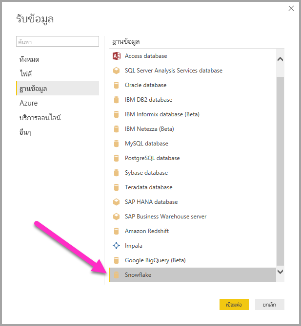
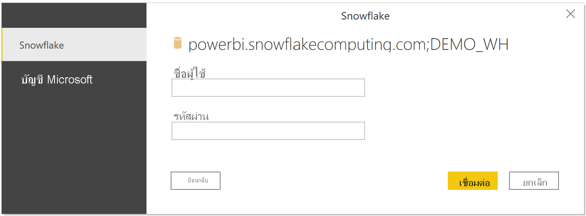
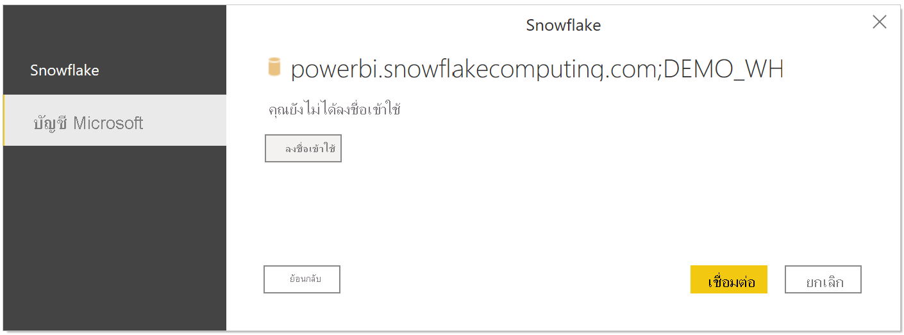

# เชื่อมต่อกับ Snowflake ใน Power BI DesktopConnect to Snowflake in Power BI Desktop
ใน Power BI Desktop คุณสามารถเชื่อมต่อไปยัง **Snowflake** Computing Warehouse และใช้ข้อมูลพื้นฐานได้เช่นเดียวกับแหล่งข้อมูลอื่นๆ ใน Power BI DesktopIn Power BI Desktop, you can connect to a **Snowflake** computing warehouse and use the underlying data just like any other data source in Power BI Desktop. 

## เชื่อมต่อกับ Snowflake Computing WarehouseConnect to a Snowflake computing warehouse
เมื่อต้องการเชื่อมต่อกับ **Snowflake** Computing Warehouse ให้เลือก **เรียกใช้ข้อมูล** จากแถบ **หน้าหลัก** ใน Power BI DesktopTo connect to a **Snowflake** computing warehouse, select **Get Data** from the **Home** ribbon in Power BI Desktop. เลือก **ฐานข้อมูล** จากประเภททางด้านซ้าย จากนั้นคุณจะเห็น **Snowflake**Select **Database** from the categories on the left, and you see **Snowflake**.

ในหน้าต่าง **Snowflake** ที่ปรากฏขึ้น ให้พิมพ์หรือวางชื่อ Snowflake Computing Warehouse ลงในกล่อง แล้วเลือก **ตกลง**In the **Snowflake** window that appears, type or paste the name of your Snowflake computing warehouse into the box and select **OK**. โปรดทราบว่าคุณสามารถเลือก **นำเข้า** ข้อมูลได้โดยตรงใน Power BI หรือจะใช้ **DirectQuery** ก็ได้Note that you can choose to **Import** data directly into Power BI, or you can use **DirectQuery**. เรียนรู้เพิ่มเติมเกี่ยวกับ[การใช้ DirectQuery](desktop-use-directquery.md)You can learn more about [using DirectQuery](desktop-use-directquery.md). โปรดทราบว่า AAD SSO สนับสนุนเฉพาะ DirectQuery เท่านั้นPlease note that AAD SSO only supports DirectQuery.

เมื่อได้รับการถาม ให้ใส่ชื่อผู้ใช้และรหัสผ่านของคุณWhen prompted, put in your username and password.

> [!NOTE]
> เมื่อคุณป้อนชื่อผู้ใช้และรหัสผ่านสำหรับเซิร์ฟเวอร์ **Snowflake** ที่เฉพาะเจาะจงแล้ว Power BI Desktop จะใช้ข้อมูลประจำตัวเดียวกันนั้นเพื่อพยายามเชื่อมต่ออีกครั้งOnce you enter your username and password for a particular **Snowflake** server, Power BI Desktop uses those same credentials in subsequent connection attempts. คุณสามารถปรับเปลี่ยนข้อมูลประจำตัวเหล่านั้นได้โดยไปที่ **ไฟล์ > ตัวเลือกและการตั้งค่า > การตั้งค่าแหล่งข้อมูล**You can modify those credentials by going to **File > Options and settings > Data source settings**.
> 
> 

ถ้าคุณต้องการใช้ตัวเลือกบัญชี Microsoft จะต้องมีการกำหนดค่าการรวม Snowflake AAD ในฝั่ง SnowflakeIf you want to use the Microsoft account option, the Snowflake AAD integration must be configured on the Snowflake side. เมื่อต้องการทำเช่นนี้ ให้อ่านส่วนเริ่มต้นใช้งานของ [เอกสารประกอบ Snowflake บนหัวข้อนั้น](https://docs.snowflake.net/manuals/user-guide/oauth-powerbi.html#power-bi-sso-to-snowflake)To do this, read the Getting Started section of the [Snowflake documentation on the topic](https://docs.snowflake.net/manuals/user-guide/oauth-powerbi.html#power-bi-sso-to-snowflake).

เมื่อเชื่อมต่อเสร็จเรียบร้อยแล้ว หน้าต่าง **ตัวนำทาง** จะปรากฏขึ้น และแสดงข้อมูลที่พร้อมใช้งานบนเซิร์ฟเวอร์ ซึ่งคุณสามารถเลือกองค์ประกอบหนึ่งรายการหรือหลายรายการเพื่อนำเข้าและใช้ใน **Power BI Desktop** ได้Once you successfully connect, a **Navigator** window appears and displays the data available on the server, from which you can select one or multiple elements to import and use in **Power BI Desktop**.

คุณสามารถ **โหลด** ตารางที่เลือก ซึ่งจะนำทั้งตารางลงใน **Power BI Desktop** หรือคุณสามารถ **แก้ไข** คิวรี ซึ่งจะเปิด **ตัวแก้ไขคิวรี** เพื่อให้คุณสามารถกรองและปรับปรุงชุดข้อมูลที่ต้องการใช้ จากนั้นจึงโหลดชุดข้อมูลที่ปรับปรุงแล้วลงใน **Power BI Desktop**You can **Load** the selected table, which brings the entire table into **Power BI Desktop**, or you can **Edit** the query, which opens **Query Editor** so you can filter and refine the set of data you want to use, and then load that refined set of data into **Power BI Desktop**.

## ขั้นตอนถัดไปNext steps
มีข้อมูลหลากหลายประเภทที่คุณสามารถเชื่อมต่อโดยใช้ Power BI DesktopThere are all sorts of data you can connect to using Power BI Desktop. สำหรับข้อมูลเพิ่มเติมเกี่ยวกับแหล่งข้อมูล โปรดดูทรัพยากรต่อไปนี้:For more information on data sources, check out the following resources:

* [Power BI Desktop คืออะไรWhat is Power BI Desktop?](../fundamentals/desktop-what-is-desktop.md)
* [แหล่งข้อมูลใน Power BI DesktopData Sources in Power BI Desktop](desktop-data-sources.md)
* [จัดรูปทรงและรวมข้อมูลด้วย Power BI DesktopShape and Combine Data with Power BI Desktop](desktop-shape-and-combine-data.md)
* [เชื่อมต่อกับเวิร์กบุ๊ก Excel ใน Power BI DesktopConnect to Excel workbooks in Power BI Desktop](desktop-connect-excel.md)   
* [ป้อนข้อมูลลงใน Power BI Desktop โดยตรงEnter data directly into Power BI Desktop](desktop-enter-data-directly-into-desktop.md)   
