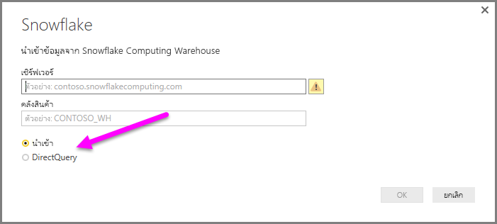

# เชื่อมต่อกับ Snowflake ใน Power BI Desktop
ใน Power BI Desktop คุณสามารถเชื่อมต่อไปยัง **Snowflake** Computing Warehouse และใช้ข้อมูลพื้นฐานได้เช่นเดียวกับแหล่งข้อมูลอื่นๆ ใน Power BI Desktop 

## เชื่อมต่อกับ Snowflake Computing Warehouse
เมื่อต้องการเชื่อมต่อกับ **Snowflake** Computing Warehouse ให้เลือก **เรียกใช้ข้อมูล** จากแถบ **หน้าหลัก** ใน Power BI Desktop เลือก **ฐานข้อมูล** จากประเภททางด้านซ้าย จากนั้นคุณจะเห็น **Snowflake**

ในหน้าต่าง **Snowflake** ที่ปรากฏขึ้น ให้พิมพ์หรือวางชื่อ Snowflake Computing Warehouse ลงในกล่อง แล้วเลือก **ตกลง** โปรดทราบว่าคุณสามารถเลือก **นำเข้า** ข้อมูลได้โดยตรงใน Power BI หรือจะใช้ **DirectQuery** ก็ได้ เรียนรู้เพิ่มเติมเกี่ยวกับ[การใช้ DirectQuery](desktop-use-directquery.md) โปรดทราบว่า AAD SSO สนับสนุนเฉพาะ DirectQuery เท่านั้น

เมื่อได้รับการถาม ให้ใส่ชื่อผู้ใช้และรหัสผ่านของคุณ

> [!NOTE]
> เมื่อคุณป้อนชื่อผู้ใช้และรหัสผ่านสำหรับเซิร์ฟเวอร์ **Snowflake** ที่เฉพาะเจาะจงแล้ว Power BI Desktop จะใช้ข้อมูลประจำตัวเดียวกันนั้นเพื่อพยายามเชื่อมต่ออีกครั้ง คุณสามารถปรับเปลี่ยนข้อมูลประจำตัวเหล่านั้นได้โดยไปที่ **ไฟล์ > ตัวเลือกและการตั้งค่า > การตั้งค่าแหล่งข้อมูล**
> 
> 

ถ้าคุณต้องการใช้ตัวเลือกบัญชี Microsoft จะต้องมีการกำหนดค่าการรวม Snowflake AAD ในฝั่ง Snowflake เมื่อต้องการทำเช่นนี้ ให้อ่านส่วนเริ่มต้นใช้งานของ [เอกสารประกอบ Snowflake บนหัวข้อนั้น](https://docs.snowflake.net/manuals/user-guide/oauth-powerbi.html#power-bi-sso-to-snowflake)

เมื่อเชื่อมต่อเสร็จเรียบร้อยแล้ว หน้าต่าง **ตัวนำทาง** จะปรากฏขึ้น และแสดงข้อมูลที่พร้อมใช้งานบนเซิร์ฟเวอร์ ซึ่งคุณสามารถเลือกองค์ประกอบหนึ่งรายการหรือหลายรายการเพื่อนำเข้าและใช้ใน **Power BI Desktop** ได้

คุณสามารถ **โหลด** ตารางที่เลือก ซึ่งจะนำทั้งตารางลงใน **Power BI Desktop** หรือคุณสามารถ **แก้ไข** คิวรี ซึ่งจะเปิด **ตัวแก้ไขคิวรี** เพื่อให้คุณสามารถกรองและปรับปรุงชุดข้อมูลที่ต้องการใช้ จากนั้นจึงโหลดชุดข้อมูลที่ปรับปรุงแล้วลงใน **Power BI Desktop**

## บทบาทแบบกำหนดเอง

ในขณะนี้การสนับสนุนสำหรับ ' บทบาทแบบกำหนดเอง ' ในตัวเชื่อมต่อเกล็ดหิมะจะทำงานกับการรับรองความถูกต้องพื้นฐานเท่านั้น การดำเนินการนี้จะได้รับการแก้ไขในอนาคตอันใกล้

## ขั้นตอนถัดไป
มีข้อมูลหลากหลายประเภทที่คุณสามารถเชื่อมต่อโดยใช้ Power BI Desktop สำหรับข้อมูลเพิ่มเติมเกี่ยวกับแหล่งข้อมูล โปรดดูทรัพยากรต่อไปนี้:

* [Power BI Desktop คืออะไร](../fundamentals/desktop-what-is-desktop.md)
* [แหล่งข้อมูลใน Power BI Desktop](desktop-data-sources.md)
* [จัดรูปทรงและรวมข้อมูลด้วย Power BI Desktop](desktop-shape-and-combine-data.md)
* [เชื่อมต่อกับเวิร์กบุ๊ก Excel ใน Power BI Desktop](desktop-connect-excel.md)   
* [ป้อนข้อมูลลงใน Power BI Desktop โดยตรง](desktop-enter-data-directly-into-desktop.md)   
