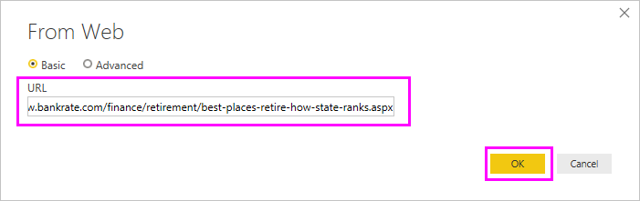
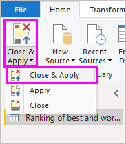

# เชื่อมต่อกับแหล่งข้อมูลใน Power BI DesktopConnect to data sources in Power BI Desktop

ด้วย Power BI Desktop คุณสามารถเชื่อมต่อไปทั่วโลกแห่งข้อมูลที่กำลังขยายตัวได้อย่างง่ายดายWith Power BI Desktop, you can easily connect to the ever expanding world of data. ถ้าคุณไม่มี Power BI Desktop คุณสามารถ[ดาวน์โหลด](https://go.microsoft.com/fwlink/?LinkID=521662)และติดตั้งได้If you don’t have Power BI Desktop, you can [download](https://go.microsoft.com/fwlink/?LinkID=521662) and install it.

ใน Power BI Desktop จะมีแหล่งข้อมูลต่าง ๆ *ทุกประเภท* ที่พร้อมใช้งานThere are *all sorts* of data sources available in Power BI Desktop. รูปต่อไปนี้แสดงวิธีการเชื่อมต่อกับข้อมูลโดยการเลือก **รับข้อมูล** > **อื่น ๆ** > **เว็บ**The following image shows how to connect to data, by selecting **Get Data** > **Other** > **Web**.

## ตัวอย่างการเชื่อมต่อกับแหล่งข้อมูลExample of connecting to data

สำหรับตัวอย่างนี้ เราจะเชื่อมต่อไปยัง **Web** แหล่งข้อมูลFor this example, we'll connect to a **Web** data source.

สมมติว่าคุณกำลังจะเกษียณImagine you’re retiring. คุณต้องการใช้ชีวิตในสถานที่ที่มีแสงแดดเยอะ ๆ มีการเก็บภาษีที่เหมาะสม และมีการดูแลสุขภาพที่ดีYou want to live where there’s lots of sunshine, preferable taxes, and good health care. หรือ...Or… คุณอาจจะเป็นนักวิเคราะห์ข้อมูล และคุณต้องการให้ข้อมูลเหล่านั้นเป็นประโยชน์ต่อลูกค้าของคุณ เช่น ช่วยลูกค้าผู้ผลิตเสื้อกันฝนในการตั้งเป้าหมายการขายในสถานที่ที่มีฝนตก *เยอะ*perhaps you’re a data analyst, and you want that information to help your customers, as in, help your raincoat manufacturing client target sales where it rains a *lot*.

ไม่ว่าวิธีใด คุณจะพบแหล่งข้อมูลบนเว็บที่มีข้อมูลที่น่าสนใจเกี่ยวกับหัวข้อเหล่านั้น และอื่น ๆ อีกมากEither way, you find a Web resource that has interesting data about those topics, and more:

[https://www.bankrate.com/finance/retirement/best-places-retire-how-state-ranks.aspx](https://www.bankrate.com/finance/retirement/best-places-retire-how-state-ranks.aspx)

เลือก **รับข้อมูล** > **อื่น ๆ** > **เว็บ**Select **Get Data** > **Other** > **Web**. ใน **จากเว็บ** ให้ใส่ที่อยู่In **From Web**, enter the address.

เมื่อคุณเลือก **ตกลง** ฟังก์ชันการทำงานของ Power BI Desktop ของ *Query* จะทำงานWhen you select **OK**, the *Query* functionality of Power BI Desktop goes to work. Power BI Desktop ติดต่อแหล่งข้อมูลเว็บ และหน้าต่าง **ตัวนำทาง** ส่งกลับผลลัพธ์ของสิ่งที่พบบนหน้าเว็บPower BI Desktop contacts the Web resource, and the **Navigator** window returns the results of what it found on that Web page. ในกรณีนี้ จะพบตารางและเอกสารโดยรวมIn this case, it found a table and the overall Document. เราสนใจตาราง ดังนั้นเราเลือกตารางจากรายการWe're interested in the table, so we select it from the list. หน้าต่าง **ตัวนำทาง** จะแสดงตัวอย่างThe **Navigator** window displays a preview.

ในตอนนี้ คุณสามารถแก้ไขการคิวรีก่อนทำการโหลดตาราง โดยการเลือก **แปลงข้อมูล** จากด้านล่างของหน้าต่าง หรือเพียงแค่โหลดตารางAt this point, you can edit the query before loading the table, by selecting **Transform Data** from the bottom of the window, or just load the table.

เลือก **แปลงข้อมูล** เพื่อโหลดตารางและเปิดใช้งานตัวแก้ไข Power QuerySelect **Transform Data** to load the table and launch Power Query Editor. บานหน้าต่าง **การตั้งค่าคิวรี** จะแสดงขึ้นมาThe **Query Settings** pane is displayed. ถ้าไม่ใช่ เลือก **ดู** จาก ribbon จากนั้น **การตั้งค่าคิวรี** เพื่อแสดงบานหน้าต่าง **การตั้งค่าคิวรี**If it's not, select **View** from the ribbon, then **Query Settings** to display the **Query Settings** pane. ซึ่งจะมีลักษณะเช่นนี้Here’s what that looks like.

คะแนนเหล่านั้นเป็นข้อความมากกว่าจะเป็นตัวเลข และเราต้องการให้มันเป็นตัวเลขAll those scores are text rather than numbers, and we need them to be numbers. ไม่มีปัญหาNo problem. แค่เพียงคลิกขวาที่ส่วนหัวของคอลัมน์ และเลือก **เปลี่ยนชนิด** > **จำนวนเต็ม** เพื่อทำการเปลี่ยนแปลงJust right-click the column header, and select **Change Type** > **Whole Number** to change them. เมื่อต้องเลือกมากกว่าหนึ่งคอลัมน์ ก่อนอื่นให้เลือกคอลัมน์ แล้วกดค้างที่ปุ่ม Shift เลือกคอลัมน์ที่อยู่ติดกันเพิ่มเติม และจากนั้นคลิกขวาที่ส่วนหัวของคอลัมน์เมื่อต้องเปลี่ยนคอลัมน์ที่เลือกทั้งหมดTo choose more than one column, first select a column then hold down Shift, select additional adjacent columns, and then right-click a column header to change all selected columns. ใช้ Ctrl เมื่อต้องเลือกคอลัมน์ที่ไม่ได้อยู่ติดกันUse Ctrl to choose columns that aren't adjacent.

ใน **การตั้งค่า Query** **ขั้นตอนที่กำหนดใช้** จะแสดงการเปลี่ยนแปลงทุกอย่างที่เกิดขึ้นIn **Query Settings**, the **APPLIED STEPS** will reflect any changes that were made. ขณะที่คุณทำการเปลี่ยนแปลงเพิ่มเติมไปยังข้อมูลตัวแก้ไข Power Query จะบันทึกการเปลี่ยนแปลงเหล่านั้นใน **ขั้นตอนที่กำหนดใช้** เป็นส่วนที่คุณสามารถ เข้ามาดูอีกครั้ง หรือลบได้หากจำเป็นAs you make additional changes to the data, Power Query Editor will record those changes in the **APPLIED STEPS** section, which you can adjust, revisit, rearrange, or delete as necessary.

คุณยังคงสามารถทำการเปลี่ยนแปลงเพิ่มเติมไปยังตารางหลังจากที่ทำการโหลดแล้วได้ แต่ในตอนนี้ยังไม่จำเป็นAdditional changes to the table can still be made after it's loaded, but for now this will do. เมื่อคุณทำเสร็จแล้ว ให้เลือก **ปิด & ใช้** จาก **หน้าหลัก** แถบ ribbon และ Power BI Desktop นำการเปลี่ยนแปลงไปใช้ และปิดตัวแก้ไข Power QueryWhen you're done, select **Close & Apply** from the **Home** ribbon, and Power BI Desktop applies the changes and closes Power Query Editor.

ด้วยโมเดลข้อมูลที่โหลดใน **รายงาน** มุมมองใน Power BI Desktop เราสามารถเริ่มสร้างแสดงภาพ โดยการลากเขตข้อมูลลงบนพื้นที่รายงานได้With the data model loaded, in **Report** view in Power BI Desktop, we can begin creating visualizations by dragging fields onto the canvas.

แน่นอนว่า นี่คือโมเดลอย่างง่ายด้วยการเชื่อมต่อข้อมูลเดียวOf course, this model is simple, with a single data connection. รายงาน Power BI Desktop ส่วนใหญ่จะมีการเชื่อมต่อกับแหล่งข้อมูลอื่นที่แตกต่างกันไป สร้างรูปร่างเพื่อให้ตรงกับความต้องการของของคุณด้วยความสัมพันธ์ที่สร้างโมเดลข้อมูลที่สมบูรณ์Most Power BI Desktop reports will have connections to different data sources, shaped to meet your needs, with relationships that produce a rich data model.

## ขั้นตอนถัดไปNext steps
มีมากมายหลากหลายสิ่งที่คุณสามารถทำได้ด้วย Power BI DesktopThere are all sorts of things you can do with Power BI Desktop. สำหรับข้อมูลเพิ่มเติมเกี่ยวกับขีดความสามารถ กรุณาดูแหล่งทรัพยากรต่อไปนี้:For more information on its capabilities, check out the following resources:

* [Power BI Desktop คืออะไรWhat is Power BI Desktop?](../fundamentals/desktop-what-is-desktop.md)
* [เกี่ยวกับการใช้ตัวแก้ไขคิวรีใน Power BI DesktopAbout using Query Editor in Power BI Desktop](../transform-model/desktop-query-overview.md)
* [แหล่งข้อมูลใน Power BI DesktopData sources in Power BI Desktop](desktop-data-sources.md)
* [จัดรูปร่างและรวมข้อมูลใน Power BI DesktopShape and combine data in Power BI Desktop](desktop-shape-and-combine-data.md)
* [ใช้งานคิวรีที่ใช้บ่อยใน Power BI DesktopPerform common query tasks in Power BI Desktop](../transform-model/desktop-common-query-tasks.md)   

ต้องการส่งคำติชมถึงเราหรือไม่Want to give us feedback? เยี่ยม!Great! ใช้รายการเมนู **ส่งความคิดเห็น** ใน Power BI Desktop หรือเยี่ยมชม [คำติชมชุมชน](https://community.powerbi.com/t5/Community-Feedback/bd-p/community-feedback)Use the **Submit an Idea** menu item in Power BI Desktop or visit [Community Feedback](https://community.powerbi.com/t5/Community-Feedback/bd-p/community-feedback). เราหวังว่าจะได้รับคำติชมจากคุณ!We look forward to hearing from you!

