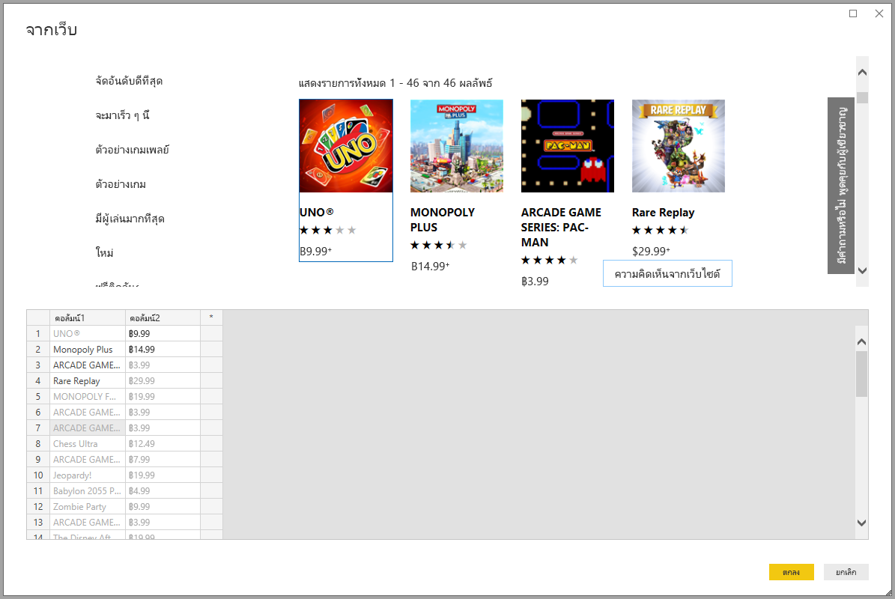

# <a name="get-webpage-data-by-providing-examples"></a><span data-ttu-id="e7047-103">รับข้อมูลเว็บเพจโดยให้ตัวอย่าง</span><span class="sxs-lookup"><span data-stu-id="e7047-103">Get webpage data by providing examples</span></span>

<span data-ttu-id="e7047-104">การรับข้อมูลจากเว็บเพจ ให้ผู้ใช้สามารถแยกข้อมูลจากเว็บเพจ และนำเข้าข้อมูลนั้นลงใน *Power BI Desktop* ได้อย่างง่ายดาย</span><span class="sxs-lookup"><span data-stu-id="e7047-104">Getting data from a web page lets users easily extract data from web pages, and import that data into *Power BI Desktop*.</span></span> <span data-ttu-id="e7047-105">อย่างไรก็ตาม ข้อมูลบนเว็บเพจมักจะไม่อยู่ในตารางที่เป็นระเบียบ ซึ่งดึงข้อมูลได้ง่าย</span><span class="sxs-lookup"><span data-stu-id="e7047-105">Often however, data on Web pages aren't in tidy tables that are easy to extract.</span></span> <span data-ttu-id="e7047-106">การรับข้อมูลจากหน้าดังกล่าวอาจเป็นปัญหาท้าทาย แม้ว่าข้อมูลดังกล่าวจะมีการจัดโครงสร้างและสอดคล้องกันก็ตาม</span><span class="sxs-lookup"><span data-stu-id="e7047-106">Getting data from such pages can be challenging, even if the data is structured and consistent.</span></span>

<span data-ttu-id="e7047-107">มีวิธีแก้ไขวิธีหนึ่ง</span><span class="sxs-lookup"><span data-stu-id="e7047-107">There's a solution.</span></span> <span data-ttu-id="e7047-108">ด้วยคุณลักษณะ *รับข้อมูลจากเว็บตามตัวอย่าง* คุณจะสามารถแสดง Power BI Desktop ว่าข้อมูลใดที่คุณต้องการดึงโดยจัดหาตัวอย่างหนึ่งรายการขึ้นไปภายในกล่องโต้ตอบของตัวเชื่อมต่อ</span><span class="sxs-lookup"><span data-stu-id="e7047-108">With the *Get Data from Web by example* feature, you can essentially show Power BI Desktop which data you want to extract by providing one or more examples within the connector dialog.</span></span> <span data-ttu-id="e7047-109">Power BI Desktop จะรวบรวมข้อมูลอื่นบนหน้าดังกล่าวที่ตรงกับตัวอย่างของคุณ</span><span class="sxs-lookup"><span data-stu-id="e7047-109">Power BI Desktop gathers other data on the page that match your examples.</span></span> <span data-ttu-id="e7047-110">ด้วยโซลูชันนี้ คุณสามารถแยกข้อมูลต่าง ๆ ได้จากเว็บเพจ รวมถึงข้อมูลที่พบในตาราง *และ* ข้อมูลอื่น ๆ ที่ไม่ใช่ตารางได้</span><span class="sxs-lookup"><span data-stu-id="e7047-110">With this solution you can extract all sorts of data from Web pages, including  data found in tables *and* other non-table data.</span></span>


<span data-ttu-id="e7047-112">ราคาในกราฟิกมีเพื่อใช้เป็นตัวอย่างเท่านั้น</span><span class="sxs-lookup"><span data-stu-id="e7047-112">Prices in graphics are for example purposes only.</span></span>

## <a name="using-get-data-from-web-by-example"></a><span data-ttu-id="e7047-113">รับข้อมูลจากเว็บโดยตัวอย่าง</span><span class="sxs-lookup"><span data-stu-id="e7047-113">Using Get Data from Web by example</span></span>

<span data-ttu-id="e7047-114">เลือก **รับข้อมูล** จากเมนู Ribbon **หน้าแรก**</span><span class="sxs-lookup"><span data-stu-id="e7047-114">Select **Get Data** from the **Home** ribbon menu.</span></span> <span data-ttu-id="e7047-115">ในกล่องโต้ตอบที่ปรากฏ เลือก **อื่นๆ** จากประเภทในบานหน้าต่างด้านซ้ายมือ จากนั้นเลือก **เว็บ**</span><span class="sxs-lookup"><span data-stu-id="e7047-115">In the dialog box that appears, select **Other** from the categories in the left pane, and then select **Web**.</span></span> <span data-ttu-id="e7047-116">เลือก **เชื่อมต่อ** เพื่อดำเนินการต่อ</span><span class="sxs-lookup"><span data-stu-id="e7047-116">Select **Connect** to continue.</span></span>


<span data-ttu-id="e7047-118">ใน **จากเว็บ** ป้อน URL ของหน้าเว็บที่คุณต้องการดึงข้อมูล</span><span class="sxs-lookup"><span data-stu-id="e7047-118">In **From Web**, enter the URL of the Web page from which you'd like to extract data.</span></span> <span data-ttu-id="e7047-119">ในบทความนี้ พวกเราจะใช้หน้าของ Microsoft Store Web และแสดงลักษณะการทำงานของตัวเชื่อมต่อนี้</span><span class="sxs-lookup"><span data-stu-id="e7047-119">In this article, we'll use the Microsoft Store Web page, and show how this connector works.</span></span>

<span data-ttu-id="e7047-120">ถ้าคุณต้องการทำตาม คุณสามารถใช้ [URL ของ Microsoft Store](https://www.microsoft.com/store/top-paid/games/xbox?category=classics) ที่เราใช้ในบทความนี้:</span><span class="sxs-lookup"><span data-stu-id="e7047-120">If you want to follow along, you can use the [Microsoft Store URL](https://www.microsoft.com/store/top-paid/games/xbox?category=classics) that we use in this article:</span></span>

```http
https://www.microsoft.com/store/top-paid/games/xbox?category=classics
```


<span data-ttu-id="e7047-122">เมื่อคุณเลือก **ตกลง** คุณจะถูกนำทางไปยังกล่องโต้ตอบ **ตัวนำทาง** ที่ซึ่งจะแสดงตารางที่ตรวจพบโดยอัตโนมัติจากเว็บเพจ</span><span class="sxs-lookup"><span data-stu-id="e7047-122">When you select **OK**, you're taken to the **Navigator** dialog box where any autodetected tables from the Web page are presented.</span></span> <span data-ttu-id="e7047-123">ในกรณีที่ปรากฏในรูปภาพด้านล่างนี้ จะไม่พบตาราง</span><span class="sxs-lookup"><span data-stu-id="e7047-123">In the case shown in the image below, no tables were found.</span></span> <span data-ttu-id="e7047-124">เลือก **เพิ่มตารางโดยใช้ตัวอย่าง** เพื่อแสดงตัวอย่าง</span><span class="sxs-lookup"><span data-stu-id="e7047-124">Select **Add table using examples** to provide examples.</span></span>


<span data-ttu-id="e7047-126">**เพิ่มตารางโดยใช้ตัวอย่าง** จะแสดงหน้าต่างแบบโต้ตอบที่คุณสามารถดูตัวอย่างของเนื้อหาของเว็บเพจได้</span><span class="sxs-lookup"><span data-stu-id="e7047-126">**Add table using examples** presents an interactive window where you can preview the content of the Web page.</span></span> <span data-ttu-id="e7047-127">ป้อนค่าตัวอย่างของข้อมูลที่คุณต้องการดึงออกมา</span><span class="sxs-lookup"><span data-stu-id="e7047-127">Enter sample values of the data you want to extract.</span></span>

<span data-ttu-id="e7047-128">ในตัวอย่างนี้ เราจะแยก *ชื่อ* และ *ราคา* สำหรับแต่ละเกมบนหน้า</span><span class="sxs-lookup"><span data-stu-id="e7047-128">In this example, we'll extract the *Name* and *Price* for each of the games on the page.</span></span> <span data-ttu-id="e7047-129">เราสามารถดำเนินการดังกล่าวได้โดยการระบุคู่ตัวอย่างจากหน้าดังกล่าวสำหรับแต่ละคอลัมน์</span><span class="sxs-lookup"><span data-stu-id="e7047-129">We can do that by specifying a couple of examples from the page for each column.</span></span> <span data-ttu-id="e7047-130">เมื่อป้อนตัวอย่างแล้ว *Power Query* จะดึงข้อมูลที่เหมาะกับรูปแบบของรายการตัวอย่างโดยใช้อัลกอริทึมการดึงข้อมูลอัจฉริยะ</span><span class="sxs-lookup"><span data-stu-id="e7047-130">As you enter examples, *Power Query* extracts data that fits the pattern of example entries using smart data extraction algorithms.</span></span>



> [!NOTE]
> <span data-ttu-id="e7047-132">ค่าแนะนำจะแสดงค่าที่มีความยาวน้อยกว่าหรือเท่ากับ 128 อักขระเท่านั้น</span><span class="sxs-lookup"><span data-stu-id="e7047-132">Value suggestions only include values less than or equal to 128 characters in length.</span></span>

<span data-ttu-id="e7047-133">เมื่อคุณพอใจกับข้อมูลที่ดึงออกมาจากเว็บเพจแล้ว เลือก **ตกลง** เพื่อไปที่ตัวแก้ไข Power Query</span><span class="sxs-lookup"><span data-stu-id="e7047-133">Once you're happy with the data extracted from the Web page, select **OK** to go to Power Query Editor.</span></span> <span data-ttu-id="e7047-134">คุณสามารถปรับใช้การแปลงข้อมูลเพิ่มเติมหรือจัดรูปร่างข้อมูลได้ เช่น การผสานข้อมูลนี้กับแหล่งข้อมูลอื่นของเรา</span><span class="sxs-lookup"><span data-stu-id="e7047-134">You can apply more transformations or shape the data, such as combining this data with other data our sources.</span></span>


<span data-ttu-id="e7047-136">จากที่นั่น คุณสามารถสร้างวิชวล หรือใช้ข้อมูลเว็บเพจเพื่อสร้างรายงาน Power BI Desktop ของคุณได้</span><span class="sxs-lookup"><span data-stu-id="e7047-136">From there, you can create visuals or otherwise use the Web page data when creating your Power BI Desktop reports.</span></span>

## <a name="next-steps"></a><span data-ttu-id="e7047-137">ขั้นตอนถัดไป</span><span class="sxs-lookup"><span data-stu-id="e7047-137">Next steps</span></span>

<span data-ttu-id="e7047-138">มีข้อมูลหลากหลายประเภทที่คุณสามารถเชื่อมต่อโดยใช้ Power BI Desktop</span><span class="sxs-lookup"><span data-stu-id="e7047-138">There are all sorts of data you can connect to using Power BI Desktop.</span></span> <span data-ttu-id="e7047-139">สำหรับข้อมูลเพิ่มเติมเกี่ยวกับแหล่งข้อมูล โปรดดูทรัพยากรต่อไปนี้:</span><span class="sxs-lookup"><span data-stu-id="e7047-139">For more information on data sources, check out the following resources:</span></span>

* [<span data-ttu-id="e7047-140">เพิ่มคอลัมน์จากตัวอย่างใน Power BI Desktop</span><span class="sxs-lookup"><span data-stu-id="e7047-140">Add a column from an example in Power BI Desktop</span></span>](../create-reports/desktop-add-column-from-example.md)
* [<span data-ttu-id="e7047-141">เชื่อมต่อหน้าเว็บจาก Power BI Desktop</span><span class="sxs-lookup"><span data-stu-id="e7047-141">Connect to webpages from Power BI Desktop</span></span>](desktop-connect-to-web.md)
* [<span data-ttu-id="e7047-142">แหล่งข้อมูลใน Power BI Desktop</span><span class="sxs-lookup"><span data-stu-id="e7047-142">Data sources in Power BI Desktop</span></span>](desktop-data-sources.md)
* [<span data-ttu-id="e7047-143">จัดรูปร่างและรวมข้อมูลใน Power BI Desktop</span><span class="sxs-lookup"><span data-stu-id="e7047-143">Shape and combine data in Power BI Desktop</span></span>](desktop-shape-and-combine-data.md)
* [<span data-ttu-id="e7047-144">เชื่อมต่อกับเวิร์กบุ๊ก Excel ใน Power BI Desktop</span><span class="sxs-lookup"><span data-stu-id="e7047-144">Connect to Excel workbooks in Power BI Desktop</span></span>](desktop-connect-excel.md)
* [<span data-ttu-id="e7047-145">เชื่อมต่อกับไฟล์ CSV ใน Power BI Desktop</span><span class="sxs-lookup"><span data-stu-id="e7047-145">Connect to CSV files in Power BI Desktop</span></span>](desktop-connect-csv.md)
* [<span data-ttu-id="e7047-146">ใส่ข้อมูลลงใน Power BI Desktop โดยตรง</span><span class="sxs-lookup"><span data-stu-id="e7047-146">Enter data directly into Power BI Desktop</span></span>](desktop-enter-data-directly-into-desktop.md)
