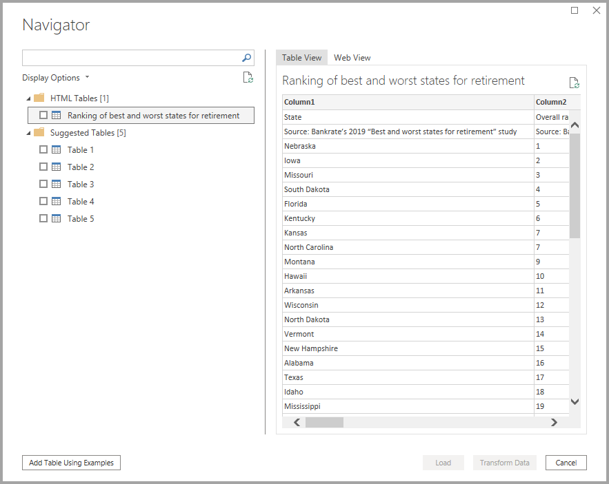

# เชื่อมต่อหน้าเว็บจาก Power BI DesktopConnect to webpages from Power BI Desktop

คุณสามารถเชื่อมต่อกับหน้าเว็บและนำเข้าข้อมูลไปยัง Power BI Desktop สำหรับใช้ในวิชวลและแบบจำลองข้อมูลของคุณYou can connect to a webpage and import its data into Power BI Desktop, to use in your visuals and in your data models.

ใน Power BI Desktop เลือก **รับข้อมูล > เว็บ** จาก **หน้าหลัก** แถบข้อมูล ribbonIn Power BI Desktop, select **Get Data > Web** from the **Home** ribbon.

ข้อความจะปรากฏขึ้นมาเพื่อถามถึง URL ของหน้าเว็บที่คุณต้องการนำเข้าข้อมูลA dialog appears, asking for the URL of the web page from which you want to import data.

เมื่อคุณพิมพ์ (หรือวาง) URL ลงไปแล้ว ให้เลือก **OK**Once you’ve typed in (or pasted) the URL, select **OK**. Power BI Desktop จะพร้อมท์แจ้งให้คุณระบุวิธีที่คุณต้องการเข้าถึงเนื้อหาเว็บPower BI Desktop prompts you to specify how you want to access the web content.

Power BI Desktop เชื่อมต่อกับเว็บเพจ จากนั้นจะแสดงข้อมูลที่มีอยู่ในหน้านั้นในหน้าต่าง **ตัวนำทาง**Power BI Desktop connects to the web page and then presents the page’s available data in the **Navigator** window. เมื่อคุณเลือกหนึ่งในองค์ประกอบข้อมูลที่มีอยู่ เช่น ตารางของหน้านั้นทั้งหน้า **หน้าต่าง** นำทาง จะแสดงตัวอย่างของข้อมูลนั้น ๆ อยู่ทางด้านขวาของหน้าต่างWhen you select one of the available data elements, such as a table of the entire page, the **Navigator** window displays a preview of that data on the right side of the window.

คุณสามารถเลือกปุ่ม **แปลงข้อมูล** ซึ่งจะเปิด **Query Editor** ออกมา ซึ่งในหน้าต่างนี้คุณจะสามารถจัดการรูปร่าง และเปลี่ยนแปลงข้อมูลบนหน้าเว็บได้ ก่อนที่จะนำเข้าข้อมูลไปยัง Power BI DesktopYou can choose the **Transform Data** button, which launches **Query Editor**, where you can shape and transform the data on that Web page before importing it into Power BI Desktop. หรือคุณสามารถเลือก **ปุ่ม** โหลด และนำเข้าองค์ประกอบข้อมูลทั้งหมดที่คุณเลือกในช่องแสดงข้อมูลด้านซ้ายOr you can select the **Load** button, and import all of the data elements you selected in the left pane.

เมื่อเราเลือก **โหลด** Power BI Desktop จะทำการนำเข้ารายการที่เลือก และทำให้ไฟล์นั้นพร้อมใช้งานใน **ช่อง** เขตข้อมูล ซึ่งอยู่ทางด้านขวาของมุมมองรายงานใน Power BI DesktopWhen we select **Load**, Power BI Desktop imports the selected items, and makes them available in the **Fields** pane, found on the right side of the Reports view in Power BI Desktop.

การเชื่อมต่อเว็บเพจ และนำเข้าข้อมูลลงใน Power BI Desktop มีขั้นตอนเพียงเท่านี้That’s all there is to connecting to a web page and bringing its data into Power BI Desktop.

จากตรงนี้ คุณสามารถลากเขตข้อมูลเหล่านั้นลงในพื้นที่รายงาน และสร้างการแสดงภาพที่คุณต้องการทั้งหมดได้From there, you can drag those fields onto the Report canvas and create all the visualizations you want. คุณยังสามารถใช้ข้อมูลจากหน้าเว็บนั้นได้แบบเดียวที่คุณใช้กับข้อมูลอื่น ๆ กล่าวคือ คุณสามารถสร้างรูปร่าง สร้างความสัมพันธ์ระหว่างข้อมูลเหล่านั้นและแหล่งข้อมูลอื่น ๆ ในโมเดลของคุณ และอีกเรื่องคือคุณสามารถทำทุกอย่างที่คุณต้องการเพื่อสร้างรายงาน Power BI ตามแบบที่ต้องการได้You can also use the data from that Web page just like you would any other data – you can shape it, you can create relationships between it and other data sources in your model, and otherwise do what you’d like to create the Power BI report you want.

เมื่อต้องการดูการเชื่อมต่อหน้าเว็บในเชิงลึกและดูการเคลื่อนไหวเพิ่มขึ้น ให้ดูที่[คำแนะนำการเริ่มต้นใช้งาน Power BI Desktop](../fundamentals/desktop-getting-started.md)To see connecting to a Web page in more depth and action, take a look at the [Power BI Desktop Getting Started Guide](../fundamentals/desktop-getting-started.md).

## การตรวจสอบการเพิกถอนใบรับรองCertificate revocation check

Power BI ใช้การรักษาความปลอดภัยสำหรับการเชื่อมต่อเว็บเพื่อปกป้องข้อมูลของคุณPower BI applies security for web connections to protect your data. ในบางสถานการณ์เช่นการรวบรวมคำขอเว็บด้วย Fiddler การเชื่อมต่อเว็บอาจทำงานไม่ถูกต้องIn some scenarios, such as capturing web requests with Fiddler, web connections may not work properly. เมื่อต้องการเปิดใช้งานสถานการณ์ดังกล่าว คุณสามารถยกเลิกการเลือกตัวเลือก **เปิดใช้งานการตรวจสอบการเพิกถอนใบรับรอง** ใน Power BI Desktop จากนั้นรีสตาร์ต Power BI DesktopTo enable such scenarios, you can uncheck the **Enable certificate revocation check** option in Power BI Desktop, then restart Power BI Desktop. 

ให้เลือก **ไฟล์ > ตัวเลือก** จากนั้นเลือก **การรักษาความปลอดภัย** ในบานหน้าต่างด้านซ้ายTo change this option, select **File > Options**, then select **Security** in the left pane. ภาพต่อไปนี้แสดงช่องทำเครื่องหมายThe following image shows the checkbox. การยกเลิกการเลือกช่องนี้จะทำให้การเชื่อมต่อเว็บมีความปลอดภัยน้อยลงUnchecking the box will make web connections less secure. 

## ขั้นตอนถัดไปNext steps
มีข้อมูลหลากหลายประเภทที่คุณสามารถเชื่อมต่อโดยใช้ Power BI DesktopThere are all sorts of data you can connect to using Power BI Desktop. สำหรับข้อมูลเพิ่มเติมเกี่ยวกับแหล่งข้อมูล กรุณาตรวจดูแหล่งที่มาต่อไปนี้:For more information on data sources, check out the following resources:

* [แหล่งข้อมูลใน Power BI DesktopData Sources in Power BI Desktop](desktop-data-sources.md)
* [จัดรูปทรงและรวมข้อมูลด้วย Power BI DesktopShape and Combine Data with Power BI Desktop](desktop-shape-and-combine-data.md)
* [เชื่อมต่อกับเวิร์กบุ๊ก Excel ใน Power BI DesktopConnect to Excel workbooks in Power BI Desktop](desktop-connect-excel.md)   
* [เชื่อมต่อกับไฟล์ CSV ใน Power BI DesktopConnect to CSV files in Power BI Desktop](desktop-connect-csv.md)   
* [ใส่ข้อมูลลงใน Power BI Desktop โดยตรงEnter data directly into Power BI Desktop](desktop-enter-data-directly-into-desktop.md)   
