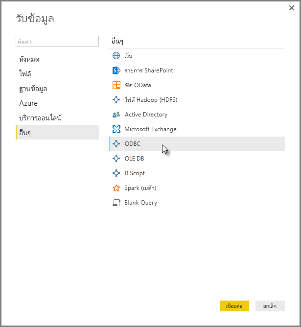
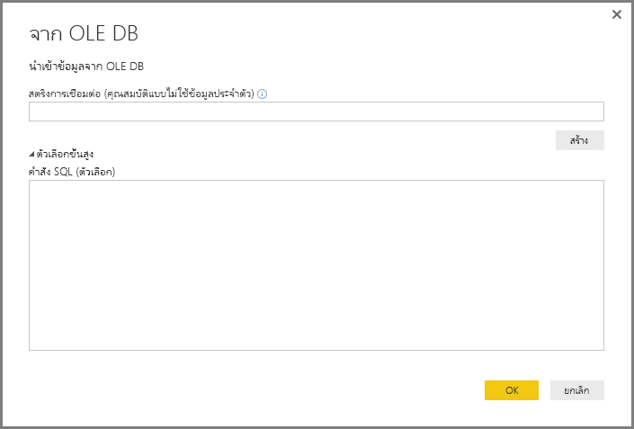
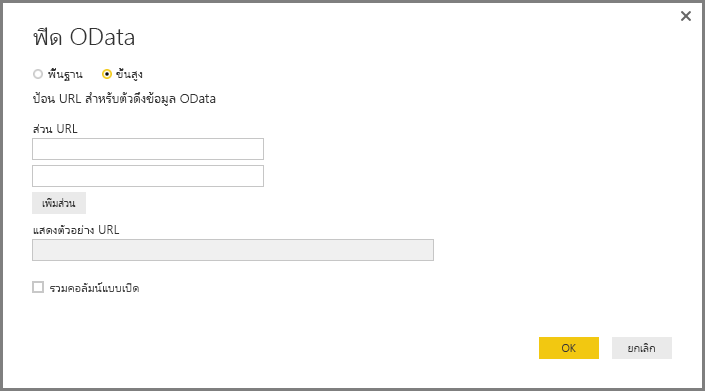

# เชื่อมต่อกับข้อมูลโดยใช้อินเตอร์เฟสทั่วไปของ Power BI DesktopConnect to data by using Power BI Desktop generic interfaces 

คุณสามารถเชื่อมต่อกับแหล่งข้อมูลต่าง ๆ ใน **Power BI Desktop** ด้วยตัวเชื่อมต่อข้อมูลอยู่ภายใน ตั้งแต่ **ฐานข้อมูล Access** จนถึงทรัพยากร **Zendesk** ตามที่แสดงในหน้าต่าง **รับข้อมูล**You can connect to a multitude of different data sources in **Power BI Desktop**, using built-in data connectors that range from **Access databases** to **Zendesk** resources, as shown in the **Get Data** window. คุณยังสามารถเชื่อมต่อกับแหล่งข้อมูล *อื่น ๆ* เพื่อขยายตัวเลือกการเชื่อมต่อของคุณ โดยใช้อินเทอร์เฟสทั่วไป (เช่น **ODBC** หรือ **REST API**) ที่มีอยู่แล้วใน **Power BI Desktop**You can also connect to all sorts of *other* data sources to further expand your connectivity options, by using the generic interfaces (such as **ODBC** or **REST APIs**) built into **Power BI Desktop**.

## อินเทอร์เฟซข้อมูลของ Power BI DesktopPower BI Desktop data interfaces
**Power BI Desktop** มีคอลเลกชันของตัวเชื่อมต่อข้อมูลที่มากขึ้นเรื่อย ๆ ที่ใช้การเชื่อมต่อกับแหล่งข้อมูลแต่ละชนิด**Power BI Desktop** includes an ever-growing collection of data connectors that are built to connect to a specific data source. ตัวอย่างเช่น ตัวเชื่อมต่อข้อมูล **รายการ SharePoint** มีเขตข้อมูลที่เฉพาะเจาะจงและการสนับสนุนลำดับการเชื่อมต่อที่ออกแบบสำหรับ **รายการ SharePoint** เช่นเดียวกับแหล่งข้อมูลอื่น ๆ ที่พบในหน้าต่างที่ปรากฏขึ้นเมื่อคุณเลือก **รับข้อมูล > เพิ่มเติม...**  (แสดงอยู่ในรูปภาพก่อนหน้า)For example, the **SharePoint List** data connector provides specific fields and supporting information during the connection sequence that are designed for **SharePoint Lists**, which is the case with other data sources found in the window that appears when you select **Get Data > More...** (shown in the previous image).

นอกจากนี้ **Power BI Desktop** ให้คุณเชื่อมต่อกับแหล่งข้อมูลที่ไม่ได้ระบุไว้ในรายการ **รับข้อมูล** โดยใช้อินเทอร์เฟซข้อมูลทั่วไปหนึ่งในนี้:In addition, **Power BI Desktop** lets you connect to data sources that aren't identified in the **Get Data** lists, by using one of the following generic data interfaces:

* **ODBC****ODBC**
* **OLE DB****OLE DB**
* **OData****OData**
* **REST API****REST APIs**
* **สคริปต์ R****R Scripts**

โดยการให้พารามิเตอร์ที่เหมาะสมสมในหน้าต่างการเชื่อมต่อของอินเทอร์เฟสทั่วไปเหล่านี้ แหล่งข้อมูลที่คุณสามารถเข้าถึง และใช้ใน **Power BI Desktop** เพื่อขึ้นอย่างมากBy providing the appropriate parameters in the connection windows that these generic interfaces provide, the world of data sources you can access and use in **Power BI Desktop** grows significantly.

ในส่วนต่อไปนี้ คุณสามารถค้นหารายการแหล่งข้อมูลที่สามารถเข้าถึงด้วยอินเทอร์เฟสทั่วไปเหล่านี้In the following sections, you can find lists of data sources that can be accessed by these generic interfaces.

ไม่พบแหล่งข้อมูลที่คุณต้องการใช้กับ **Power BI Desktop**?Can't find the data source you wanted to use with **Power BI Desktop**? ส่งแนวคิดของคุณมาที่ [รายการของแนวคิดและการร้องขอ](https://ideas.powerbi.com/) ของทีมงาน Power BISubmit your idea to the Power BI team's [list of ideas and requests](https://ideas.powerbi.com/).

## แหล่งข้อมูลที่สามารถเข้าถึงผ่าน ODBCData sources accessible through ODBC
ตัวเชื่อมต่อ **ODBC** ใน **Power BI Desktop** ให้คุณนำเข้าข้อมูลจากโปรแกรมควบคุม ODBC บุคคลที่สามใด ๆ โดยระบุแค่เพียง **ชื่อแหล่งข้อมูล (DSN)** หรือ *สตริงการเชื่อมต่อ*The **ODBC** connector in **Power BI Desktop** lets you import data from any third-party ODBC driver simply by specifying a **Data Source Name (DSN)** or a *connection string*. อีกทางเลือกคือ คุณยังสามารถระบุคำสั่ง SQL เพื่อดำเนินการกับโปรแกรมควบคุม ODBCAs an option, you can also specify a SQL statement to execute against the ODBC driver.

รายการต่อไปนี้แสดงบางตัวอย่างของแหล่งข้อมูลที่ **Power BI Desktop** สามารถเชื่อมต่อโดยใช้อินเตอร์เฟส **ODBC** ทั่วไปได้The following list details a few examples of data sources to which **Power BI Desktop** can connect by using the generic **ODBC** interface.

| ตัวเชื่อมต่อทั่วไปของ Power BI DesktopPower BI Desktop generic connector | แหล่งข้อมูลภายนอกExternal data source | ลิงก์สำหรับข้อมูลเพิ่มเติมLink for more information |
| --- | --- | --- |
| ODBCODBC |CassandraCassandra |[โปรแกรมควบคุม Cassandra ODBCCassandra ODBC driver](https://www.simba.com/drivers/cassandra-odbc-jdbc/) |
| ODBCODBC |Couchbase DBCouchbase DB |[Couchbase และ Power BICouchbase and Power BI](https://powerbi.microsoft.com/blog/visualizing-data-from-couchbase-server-v4-using-power-bi/) |
| ODBCODBC |DynamoDBDynamoDB |[โปรแกรมควบคุม DynamoDB ODBCDynamoDB ODBC driver](https://www.simba.com/drivers/dynamodb-odbc-jdbc/) |
| ODBCODBC |Google BigQueryGoogle BigQuery |[โปรแกรมควบคุม BigQuery ODBCBigQuery ODBC driver](https://www.simba.com/drivers/bigquery-odbc-jdbc/) |
| ODBCODBC |HBaseHBase |[โปรแกรมควบคุม Hbase ODBCHBase ODBC driver](https://www.simba.com/drivers/hbase-odbc-jdbc/) |
| ODBCODBC |HiveHive |[โปรแกรมควบคุม Hive ODBCHive ODBC driver](https://www.simba.com/drivers/hive-odbc-jdbc/) |
| ODBCODBC |IBM NetezzaIBM Netezza |[ข้อมูล IBM NetezzaIBM Netezza information](https://www.ibm.com/support/knowledgecenter/SSULQD_7.2.1/com.ibm.nz.datacon.doc/c_datacon_plg_overview.html) |
| ODBCODBC |PrestoPresto |[โปรแกรมควบคุม ODBC PrestoPresto ODBC driver](https://www.simba.com/drivers/presto-odbc-jdbc/) |
| ODBCODBC |Project OnlineProject Online |[บทความ Project OnlineProject Online article](desktop-project-online-connect-to-data.md) |
| ODBCODBC |Progress OpenEdgeProgress OpenEdge |[บล็อกโพสต์โปรแกรมควบคุม Progress OpenEdge ODBCProgress OpenEdge ODBC driver blog post](https://www.progress.com/blogs/connect-microsoft-power-bi-to-openedge-via-odbc-driver) |

## แหล่งข้อมูลที่สามารถเข้าถึงผ่าน OLE DBData sources accessible through OLE DB
ตัวเชื่อมต่อ **OLE DB** ใน **Power BI Desktop** ให้คุณนำเข้าข้อมูลจากโปรแกรมควบคุม OLE DB บุคคลที่สามใด ๆ โดยการระบุเพียงแค่ *สตริงการเชื่อมต่อ*The **OLE DB** connector in **Power BI Desktop** lets you import data from any third-party OLE DB driver simply by specifying a *connection string*. อีกทางเลือกคือ คุณยังสามารถระบุคำสั่ง SQL เพื่อดำเนินการกับโปรแกรมควบคุม OLE DBAs an option, you can also specify a SQL statement to execute against the OLE DB driver.

รายการต่อไปนี้แสดงบางตัวอย่างของแหล่งข้อมูลที่ **Power BI Desktop** สามารถเชื่อมต่อโดยใช้อินเตอร์เฟส **OLE DB** ทั่วไปได้The following list details a few examples of the data sources to which **Power BI Desktop** can connect by using the generic **OLE DB** interface.

| ตัวเชื่อมต่อทั่วไปของ Power BI DesktopPower BI Desktop generic connector | แหล่งข้อมูลภายนอกExternal data source | ลิงก์สำหรับข้อมูลเพิ่มเติมLink for more information |
| --- | --- | --- |
| OLE DBOLE DB |SAS OLE DBSAS OLE DB |[ผู้ให้บริการ SAS สำหรับ OLE DBSAS provider for OLE DB](https://support.sas.com/downloads/package.htm?pid=648) |
| OLE DBOLE DB |OLE DB SybaseSybase OLE DB |[ผู้ให้บริการ Sybase สำหรับ OLE DBSybase provider for OLE DB](http://infocenter.sybase.com/help/index.jsp?topic=/com.sybase.infocenter.dc35888.1550/doc/html/jon1256941734395.html) |

## แหล่งข้อมูลที่สามารถเข้าถึงผ่าน ODataData sources accessible through OData
ตัวเชื่อมต่อ **OData** ใน **Power BI Desktop** ให้คุณนำเข้าข้อมูลจาก **OData** URL ใด ๆ ได้อย่างง่าย ๆ โดยการพิมพ์หรือวาง URL ของ **OData**The **OData** connector in **Power BI Desktop** lets you import data from any **OData** URL simply by typing in or pasting the **OData** URL. คุณสามารถเพิ่ม URL หลายส่วน โดยการพิมพ์หรือวางลิงก์เหล่านั้นในกล่องข้อความที่มีอยู่ในหน้าต่าง **ตัวดึงข้อมูล OData** ได้You can add multiple URL parts by typing or pasting those links in the text boxes provided in the **OData Feed** window.

รายการต่อไปนี้แสดงบางตัวอย่างของแหล่งข้อมูลที่ **Power BI Desktop** สามารถเชื่อมต่อโดยใช้อินเตอร์เฟส **OData** ทั่วไปได้The following list details a few examples of the data sources to which **Power BI Desktop** can connect by using the generic **OData** interface.

| ตัวเชื่อมต่อทั่วไปของ Power BI DesktopPower BI Desktop generic connector | แหล่งข้อมูลภายนอกExternal data source | ลิงก์สำหรับข้อมูลเพิ่มเติมLink for more information |
| --- | --- | --- |
| ODataOData |จะมาเร็ว ๆ นี้Coming soon |กลับมาดูใหม่เร็ว ๆ นี้สำหรับแหล่งข้อมูล ODataCheck back soon for OData data sources |

## แหล่งข้อมูลที่สามารถเข้าถึงผ่าน REST APIData sources accessible through REST APIs
คุณสามารถเชื่อมต่อกับแหล่งข้อมูลที่ใช้ **REST API** และข้อมูลจากแหล่งข้อมูลทั้งหลายที่สนับสนุน **REST** ได้You can connect to data sources using the **REST APIs** and thereby use data from all sorts of data sources that support **REST**.

รายการต่อไปนี้แสดงบางตัวอย่างของแหล่งข้อมูลที่ **Power BI Desktop** สามารถเชื่อมต่อโดยใช้อินเตอร์เฟส **REST API** ทั่วไปได้The following list details a few examples of the data sources to which **Power BI Desktop** can connect by using the generic **REST APIs** interface.

| ตัวเชื่อมต่อทั่วไปของ Power BI DesktopPower BI Desktop generic connector | แหล่งข้อมูลภายนอกExternal data source | ลิงก์สำหรับข้อมูลเพิ่มเติมLink for more information |
| --- | --- | --- |
| REST APIREST APIs |Couchbase DBCouchbase DB |[ข้อมูล Couchbase REST APICouchbase REST API information](https://powerbi.microsoft.com/blog/visualizing-data-from-couchbase-server-v4-using-power-bi/) |

## แหล่งข้อมูลที่สามารถเข้าถึงผ่านสคริปต์ RData sources accessible through R Script
คุณสามารถใช้ **สคริปต์ R** เพื่อเข้าถึงแหล่งข้อมูล และใช้ข้อมูลนั้นใน **Power BI Desktop** ได้You can use **R scripts** to access data sources, and use that data in **Power BI Desktop**.

รายการต่อไปนี้แสดงบางตัวอย่างของแหล่งข้อมูลที่ **Power BI Desktop** สามารถเชื่อมต่อโดยใช้อินเตอร์เฟส **สคริปต์ R** ทั่วไปได้The following list details a few examples of the data sources to which **Power BI Desktop** can connect by using the generic **R scripts** interface.

| ตัวเชื่อมต่อทั่วไปของ Power BI DesktopPower BI Desktop generic connector | แหล่งข้อมูลภายนอกExternal data source | ลิงก์สำหรับข้อมูลเพิ่มเติมLink for more information |
| --- | --- | --- |
| สคริปต์ RR Script |ไฟล์ SASSAS Files |[คำแนะนำสคริปต์ R จาก CRANR script guidance from CRAN](https://cran.r-project.org/doc/manuals/R-data.html) |
| สคริปต์ RR Script |ไฟล์ SPSSSPSS Files |[คำแนะนำสคริปต์ R จาก CRANR script guidance from CRAN](https://cran.r-project.org/doc/manuals/R-data.html) |
| สคริปต์ RR Script |ไฟล์สถิติ RR Statistical Files |[คำแนะนำสคริปต์ R จาก CRANR script guidance from CRAN](https://cran.r-project.org/doc/manuals/R-data.html) |

## ขั้นตอนถัดไปNext steps
มีข้อมูลหลากหลายประเภทที่คุณสามารถเชื่อมต่อโดยใช้ **Power BI Desktop**There are all sorts of data sources you can connect to using **Power BI Desktop**. สำหรับข้อมูลเพิ่มเติมเกี่ยวกับแหล่งข้อมูล โปรดดูทรัพยากรต่อไปนี้:For more information on data sources, check out the following resources:

* [Power BI Desktop คืออะไรWhat is Power BI Desktop?](../fundamentals/desktop-what-is-desktop.md)
* [แหล่งข้อมูลใน Power BI DesktopData Sources in Power BI Desktop](desktop-data-sources.md)
* [จัดรูปทรงและรวมข้อมูลด้วย Power BI DesktopShape and Combine Data with Power BI Desktop](desktop-shape-and-combine-data.md)
* [เชื่อมต่อกับเวิร์กบุ๊ก Excel ใน Power BI DesktopConnect to Excel workbooks in Power BI Desktop](desktop-connect-excel.md)   
* [ป้อนข้อมูลลงใน Power BI Desktop โดยตรงEnter data directly into Power BI Desktop](desktop-enter-data-directly-into-desktop.md)   
