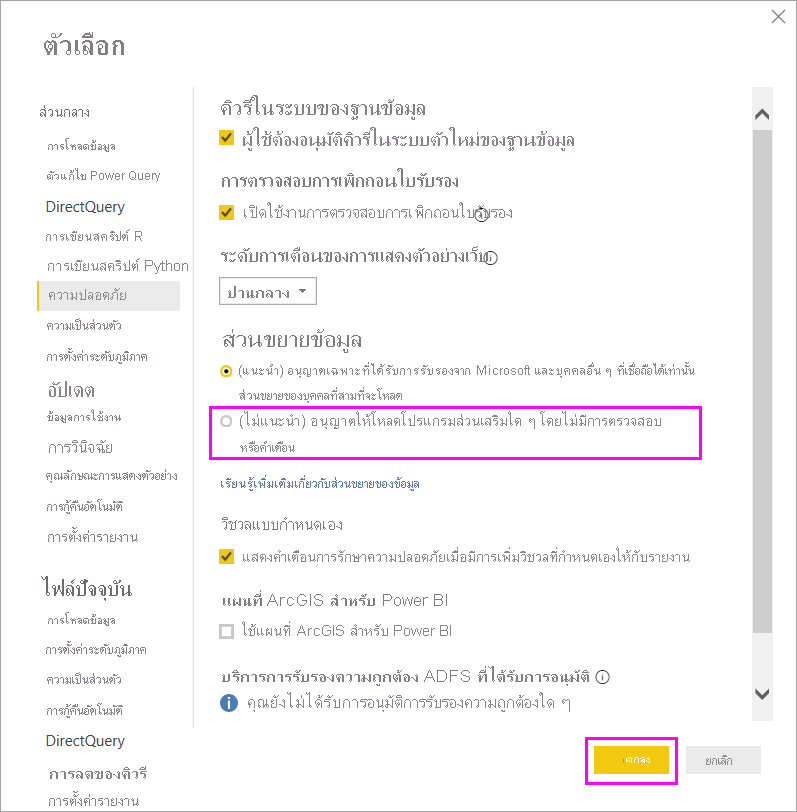

# การขยายของตัวเชื่อมต่อใน Power BIConnector extensibility in Power BI

Power BI สามารถเชื่อมต่อกับข้อมูลโดยใช้ตัวเชื่อมต่อและแหล่งข้อมูลทั่วไป เช่น ODBC, OData, OLE DB, Web, CSV, XML และ JSONPower BI can connect to data by using existing connectors and generic data sources, like ODBC, OData, OLE DB, Web, CSV, XML, and JSON. หรือนักพัฒนาสามารถเปิดใช้งานแหล่งข้อมูลใหม่ด้วยส่วนขยายข้อมูลแบบกำหนดเองที่เรียกว่า *ตัวเชื่อมต่อแบบกำหนดเอง*Or, developers can enable new data sources with custom data extensions called *custom connectors*. ตัวเชื่อมต่อแบบกำหนดเองบางตัวจะได้รับการรับรองและเผยแพร่โดย Microsoft ในฐานะ *ตัวเชื่อมต่อที่ได้รับการรับรอง*Some custom connectors are certified and distributed by Microsoft as *certified connectors*.

เพื่อใช้ตัวเชื่อมต่อแบบกำหนดเองที่ยังไม่ผ่านการรับรอง ซึ่งคุณหรือบุคคลที่สามได้พัฒนาขึ้น คุณจะต้องปรับการตั้งค่าการรักษาความปลอดภัยของ Power BI Desktop เพื่ออนุญาตให้ส่วนขยายสามารถโหลดได้โดยไม่จำเป็นต้องตรวจสอบความถูกต้องหรือคำเตือนTo use non-certified custom connectors that you or a third party have developed, you must adjust the Power BI Desktop security settings to allow extensions to load without validation or warning. เนื่องจากรหัสนี้สามารถจัดการข้อมูลประจำตัว รวมถึงการส่งข้อมูลประจำตัวผ่านทาง HTTP และเพิกเฉยระดับความเป็นส่วนตัว คุณควรใช้การตั้งค่าการรักษาความปลอดภัยนี้ ในกรณีที่คุณไว้วางใจในตัวเชื่อมต่อแบบกำหนดเองของคุณอย่างสมบูรณ์เท่านั้นBecause this code can handle credentials, including sending them over HTTP, and ignore privacy levels, you should only use this security setting if you absolutely trust your custom connectors.

อีกตัวเลือกหนึ่งสำหรับนักพัฒนาคือ การลงชื่อเข้าใช้ตัวเชื่อมต่อที่มีใบรับรอง และระบุข้อมูลที่คุณจำเป็นต้องใช้โดยไม่เปลี่ยนแปลงการตั้งค่าการรักษาความปลอดภัยAnother option is for the developer to sign the connector with a certificate, and provide the information you need to use it without changing your security settings. สำหรับข้อมูลเพิ่มเติม ดู [เกี่ยวกับตัวเชื่อมต่อบุคลที่สามที่เชื่อถือได้](desktop-trusted-third-party-connectors.md)For more information, see [About trusted third-party connectors](desktop-trusted-third-party-connectors.md).

## ตัวเชื่อมต่อแบบกำหนดเองCustom connectors

ตัวเชื่อมต่อแบบกำหนดเองที่ยังไม่ผ่านการรับรอง สามารถรวมการใช้งานได้อย่างกว้างขวาง ตั้งแต่ API ขนาดเล็กที่มีความสำคัญต่อธุรกิจของคุณไปจนถึงบริการเฉพาะของอุตสาหกรรมขนาดใหญ่ที่ Microsoft ยังไม่ได้เผยแพร่ตัวเชื่อมต่อให้Non-certified custom connectors can range from small business-critical APIs to large industry-specific services that Microsoft hasn't released a connector for. มีการเผยแพร่ตัวเชื่อมต่อจำนวนมากโดยผู้จำหน่ายMany connectors are distributed by vendors. ถ้าคุณจำเป็นต้องมีตัวเชื่อมต่อข้อมูลเฉพาะ ให้ติดต่อผู้จำหน่ายIf you need a specific data connector, contact the vendor. 

เมื่อต้องการใช้ตัวเชื่อมต่อแบบกำหนดเองที่ยังไม่ผ่านการรับรอง ให้วางตัวเชื่อมต่อไฟล์ *.pq*, *.pqx*, *.m* หรือ *.mez* ในโฟลเดอร์ *\[Documents]\\Power BI Desktop\\ตัวเชื่อมต่อแบบกำหนดเอง*To use a non-certified custom connector, put the connector *.pq*, *.pqx*, *.m*, or *.mez* file in the *\[Documents]\\Power BI Desktop\\Custom Connectors* folder. หากไม่มีโฟลเดอร์ ให้สร้างใหม่If the folder doesn't exist, create it.

ปรับการตั้งค่าการรักษาความปลอดภัยของส่วนขยายข้อมูลดังนี้:Adjust the data extension security settings as follows:

ใน Power BI Desktop เลือก **ไฟล์** > **ตัวเลือกและการตั้งค่า** > **ตัวเลือก** > **การรักษาความปลอดภัย**In Power BI Desktop, select **File** > **Options and settings** > **Options** > **Security**.

ภายใต้ **ส่วนขยายข้อมูล** เลือก **(ไม่แนะนำ) อนุญาตให้โหลดส่วนขยายใด ๆ โดยไม่มีการตรวจสอบความถูกต้องหรือคำเตือน**Under **Data Extensions**, select **(Not Recommended) Allow any extension to load without validation or warning**. เลือก **ตกลง** จากนั้น รีสตาร์ท Power BI DesktopSelect **OK**, and then restart Power BI Desktop. 

การตั้งค่าความปลอดภัยของส่วนขยายข้อมูล Power BI Desktop ค่าเริ่มต้นคือ **(แนะนำ) อนุญาตให้ส่วนขยายของบุคคลที่สามที่เชื่อถือได้อื่น ๆ และได้รับการรับรองจาก Microsoft เท่านั้นที่จะโหลดได้**The default Power BI Desktop data extension security setting is **(Recommended) Only allow Microsoft certified and other trusted third-party extensions to load**. ด้วยการตั้งค่านี้ หากมีตัวเชื่อมต่อแบบกำหนดเองที่ไม่ได้รับการรับรองบนระบบของคุณ กล่องโต้ตอบ **ตัวเชื่อมต่อที่ไม่ได้รับการรับรอง** จะปรากฏขึ้นที่หน้าเริ่มต้นของ Power BI Desktop โดยแสดงรายการตัวเชื่อมต่อที่ไม่สามารถโหลดอย่างปลอดภัยได้With this setting, if there are non-certified custom connectors on your system, the **Uncertified Connectors** dialog box appears at Power BI Desktop startup, listing the connectors that can't securely load.

เมื่อต้องการแก้ไขข้อผิดพลาดนี้ คุณสามารถเปลี่ยนการตั้งค่าการรักษาความปลอดภัยของ **ส่วนขยายข้อมูล** ของคุณ หรือลบตัวเชื่อมต่อที่ไม่ผ่านการรับรองออกจากโฟลเดอร์ *ตัวเชื่อมต่อแบบกำหนดเอง* ของคุณTo resolve the error, you can either change your **Data Extensions** security setting, or remove the uncertified connectors from your *Custom Connectors* folder.

## ตัวเชื่อมต่อที่ผ่านการรับรองCertified connectors

ชุดย่อยที่จำกัดของส่วนขยายข้อมูลถือว่า *ผ่านการรับรอง*A limited subset of data extensions is considered *certified*. ในขณะที่ Microsoft เผยแพร่ตัวเชื่อมต่อเหล่านี้ เราไม่รับผิดชอบต่อประสิทธิภาพการทำงานหรือการใช้งานฟังก์ชันได้อย่างต่อเนื่องของตัวเชื่อมต่อดังกล่าวWhile Microsoft distributes the connectors, it's not responsible for their performance or continued function. นักพัฒนาบุคคลที่สามที่สร้างตัวเชื่อมต่อนั้น มีหน้าที่รับผิดชอบเกี่ยวกับการบำรุงรักษาและการสนับสนุนThe third-party developer who created the connector is responsible for its maintenance and support. 

ใน Power BI Desktop ตัวเชื่อมต่อของบุคคลที่สามที่ผ่านการรับรอง จะปรากฏในรายการในกล่องโต้ตอบ **รับข้อมูล** พร้อมกับตัวเชื่อมต่อทั่วไปและที่พบบ่อยIn Power BI Desktop, certified third-party connectors appear in the list in the **Get Data** dialog box, along with generic and common connectors. คุณไม่จำเป็นต้องปรับการตั้งค่าการรักษาความปลอดภัยเพื่อใช้ตัวเชื่อมต่อที่ผ่านการรับรองYou don't need to adjust security settings to use the certified connectors.

หากคุณต้องการให้ตัวเชื่อมต่อแบบกำหนดเองผ่านการรับรอง โปรดสอบถามผู้จำหน่ายของคุณเพื่อทำการติดต่อ dataconnectors@microsoft.comIf you would like a custom connector to be certified, ask your vendor to contact dataconnectors@microsoft.com.
