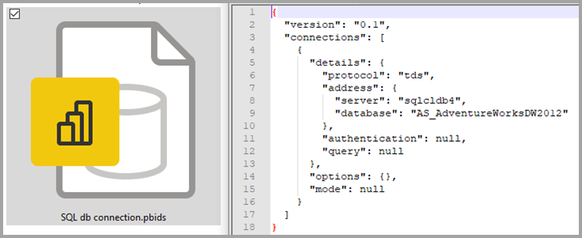

# <a name="data-sources-in-power-bi-desktop"></a>แหล่งข้อมูลใน Power BI Desktop

คุณสามารถเชื่อมต่อกับข้อมูลจากแหล่งต่าง ๆ มากมายด้วย Power BI Desktop สำหรับรายการทั้งหมดของแหล่งข้อมูลที่พร้อมใช้งาน ให้ดู[แหล่งข้อมูล Power BI](power-bi-data-sources.md)

คุณเชื่อมต่อไปยังข้อมูลโดยการใช้ริบบิ้น **หน้าหลัก** ในการแสดงเมนูประเภทข้อมูล **ทั่วไปส่วนใหญ่** เลือกป้ายปุ่ม **รับข้อมูล** หรือลูกศรชี้ลง


ไปยังกล่องบทสนทนา **รับข้อมูล** แสดงเมนูประเภทข้อมูล **ทั่วไปส่วนใหญ่** และเลือก **เพิ่มเติม** คุณยังสามารถนำกล่องบทนา **รับข้อมูล** ขึ้นไป (และทางอ้อมไปยังเมนู **ทั่วไปส่วนใหญ่**) โดยการเลือกไอคอน **รับข้อมูล** โดยตรง


> [!NOTE]
> ทีม Power BI ได้ทำการขยายแหล่งข้อมูลอย่างต่อเนื่องที่ใช้ได้ไปยัง Power BI Desktop และ Power BI service ดังนั้นคุณมักจะเห็นงานระหว่างแหล่งข้อมูลที่กำลังดำเนินการอยู่ในช่วงเริ่มต้นได้รับการทำเครื่องหมายเป็น **เบต้า** หรือ **แสดงตัวอย่าง** ทุกแหล่งข้อมูลทำให้ชัดเจนเป็น **เบต้า** หรือ **การแสดงก่อน** มีการสนับสนุนและการทำงานที่จำกัด และมันอาจจะไม่ถูกใช้ในสภาพแวดล้อมของการผลิต นอกจากนี้ทุกแหล่งข้อมูลที่ทำให้ชัดเจนเป็น **เบต้า** หรือ **การแสดงก่อน** สำหรับ Power BI Desktop อาจไม่สามารถใช้ได้สำหรับการใช้ในการบริการ Power BI หรือการบริการ Microsoft อื่นๆ จนกว่าแหล่งข้อมูลจะสามารถใช้ได้โดยทั่วไป (GA)

> [!NOTE]
> มีตัวเชื่อมต่อข้อมูลจำนวนมากสำหรับ Power BI Desktop ที่จำเป็นต้องใช้ Internet Explorer 10 (หรือใหม่กว่า) สำหรับการรับรองความถูกต้อง 


## <a name="data-sources"></a>แหล่งข้อมูล

กล่องบทสนทนา **รับข้อมูล** ทำการจัดระเบียบประเภทข้อมูลในหมวดหมู่ต่อไปนี้:

* ทั้งหมด
* ไฟล์
* ฐานข้อมูล
* Power Platform
* Azure
* บริการออนไลน์
* อื่นๆ

ประเภท **ทั้งหมด** รวมถึงชนิดการเชื่อมต่อข้อมูลทั้งหมดจากประเภททั้งหมด

### <a name="file-data-sources"></a>แหล่งข้อมูลไฟล์

ประเภท **ไฟล์** มีการเชื่อมต่อข้อมูลต่อไปนี้:

* Excel
* ข้อความ/CSV
* XML
* JSON
* โฟลเดอร์
* PDF
* โฟลเดอร์ SharePoint

รูปภาพต่อไปนี้แสดงหน้าต่าง **รับข้อมูล** สำหรับ **ไฟล์**


### <a name="database-data-sources"></a>แหล่งข้อมูลฐานข้อมูล

ประเภท **ฐานข้อมูล** มีการเชื่อมต่อข้อมูลต่อไปนี้:

* ฐานข้อมูล SQL Server
* ฐานข้อมูล Access
* ฐานข้อมูล SQL Server Analysis Services
* ฐานข้อมูล Oracle
* ฐานข้อมูล IBM Db2
* ฐานข้อมูล IBM Informix
* IBM Netezza
* ฐานข้อมูล MySQL
* ฐานข้อมูล PostgreSQL
* ฐานข้อมูล Sybase
* ฐานข้อมูล Teradata
* ฐานข้อมูล SAP HANA
* เซิร์ฟเวอร์แอปพลิเคชัน SAP Business Warehouse
* เซิร์ฟเวอร์ข้อความ SAP Business Warehouse
* Amazon Redshift
* Impala
* Google BigQuery
* Vertica
* Snowflake
* Essbase
* คิวบ์ AtScale
* Data Virtuality LDW (Beta)
* Denodo
* Dremio
* Exasol
* Indexima
* InterSystems IRIS (เบต้า)
* Jethro (รุ่นเบต้า)
* Kyligence
* Linkar PICK Style / MultiValue Databases (เบต้า)
* MariaDB (Beta)
* MarkLogic
* BI Connector
* Actian (รุ่นเบต้า)

> [!NOTE]
> ตัวเชื่อมต่อฐานข้อมูลบางอย่างจำเป็นต้องให้คุณเปิดใช้งานโดยการเลือก **ไฟล์ > ตัวเลือกและการตั้งค่า > ตัวเลือก** จากนั้นเลือก **คุณลักษณะการแสดงตัวอย่าง** และเปิดใช้งานตัวเชื่อมต่อ ถ้าคุณไม่เห็นตัวเชื่อมต่อที่กล่าวถึงด้านบน และต้องการใช้งานตัวเชื่อมต่อเหล่านั้น โปรดตรวจสอบการตั้งค่าของ **คุณลักษณะการแสดงตัวอย่าง** และโปรดทราบว่าแหล่งข้อมูลใด ๆ ที่ได้รับการทำเครื่องหมายเป็น *เบต้า* หรือ *แสดงตัวอย่าง* มีการจำกัดการสนับสนุนและฟังก์ชันการทำงาน และไม่ควรใช้ในสภาพแวดล้อมการผลิต

รูปภาพต่อไปนี้แสดงหน้าต่าง **รับข้อมูล** สำหรับ **ไฟล์**


### <a name="power-platform-data-sources"></a>แหล่งข้อมูล Power Platform

ประเภท **Power Platform** มีการเชื่อมต่อข้อมูลดังต่อไปนี้

* ชุดข้อมูล Power BI
* กระแสข้อมูล Power BI
* Microsoft Dataverse
* กระแสข้อมูล Power Platform (เบต้า)

รูปภาพต่อไปนี้แสดงหน้าต่าง **รับข้อมูล** สำหรับ **Power Platform**


### <a name="azure-data-sources"></a>แหล่งข้อมูล Azure

ประเภท **Azure** มีการเชื่อมต่อข้อมูลดังต่อไปนี้

* ฐานข้อมูล Azure SQL
* Azure Synapse Analytics (SQL DW)
* ฐานข้อมูล Azure Analysis Services
* ฐานข้อมูล Azure สำหรับ PostgreSQL
* พื้นที่เก็บข้อมูล Azure Blob
* พื้นที่เก็บข้อมูล Azure Table
* Azure Cosmos DB
* Azure Data Explorer (Kusto)
* Azure Data Lake Storage Gen2
* Azure Data Lake Storage Gen1
* Azure HDInsight (HDFS)
* Azure HDInsight Spark
* HDInsight Interactive Query
* Azure Cost Management
* Azure Databricks
* Azure Time Series Insights (เบต้า)


แสดงรูปภาพต่อไปนี้ **รับข้อมูล** สำหรับ **Azure**


### <a name="online-services-data-sources"></a>แหล่งข้อมูลการบริการออนไลน์

ประเภท **บริการออนไลน์** มีการเชื่อมต่อข้อมูลต่อไปนี้:

* รายการ SharePoint Online
* Microsoft Exchange Online
* Dynamics 365 (ออนไลน์)
* Dynamics NAV
* Dynamics 365 Business Central
* Dynamics 365 Business Central (ภายในองค์กร)
* Microsoft Azure Consumption Insights (เบต้า)
* Azure DevOps (เฉพาะบอร์ดเท่านั้น)
* Azure DevOps Server (เฉพาะบอร์ดเท่านั้น)
* ออบเจ็กต์ Salesforce
* รายงาน Salesforce
* Google Analytics
* Adobe Analytics
* appFigures (เบต้า)
* Data.World - รับชุดข้อมูล (เบต้า)
* GitHub (เบต้า)
* ผู้นำทางการขาย LinkedIn (เบต้า)
* Marketo (เบต้า)
* Mixpanel (เบต้า)
* Planview Enterprise One - PRM (เบต้า)
* QuickBooks Online (เบต้า)
* Smartsheet
* SparkPost (เบต้า)
* SweetIQ (เบต้า)
* Planview Enterprise One - CTM (เบต้า)
* Twilio (เบต้า)
* Zendesk (เบต้า)
* Asana (Beta)
* Dynamics 365 Customer Insights (Beta)
* แหล่งข้อมูล Emigo
* Entersoft Business Suite (เบต้า)
* การวิเคราะห์ FactSet
* กระบวนการหลอม Palantir
* Industrial App Store
* คลังข้อมูล Intune (เบต้า)
* การรักษาความปลอดภัยของ Microsoft Graph
* Projectplace สำหรับ Power BI
* ความเข้าใจผลิตภัณฑ์ (เบต้า)
* Quick Base
* Spigit (เบต้า)
* TeamDesk (เบต้า)
* การวิเคราะห์ Webtrends (เบต้า)
* Witivio (เบต้า)
* การวิเคราะห์สถานที่ทำงาน (เบต้า)
* Zoho Creator (เบต้า)
* eWay-CRM (เบต้า)
* Hexagon PPM Smart API


รูปภาพต่อไปนี้แสดงหน้าต่าง **รับข้อมูล** สำหรับ **บริการออนไลน์**


### <a name="other-data-sources"></a>แหล่งข้อมูลอื่นๆ

ประเภท **อื่น ๆ** มีการเชื่อมต่อข้อมูลต่อไปนี้:

* เว็บ
* รายการ SharePoint
* ตัวดึงข้อมูล OData
* Active Directory
* Microsoft Exchange
* ไฟล์ Hadoop (HDFS)
* Spark
* Hive LLAP
* สคริปต์ R
* สคริปต์ Python
* ODBC
* OLE DB
* Acterys : การวางแผน & แบบจำลองอัตโนมัติ (เบต้า)
* ระบบอัตโนมัติที่ใดก็ได้ (เบต้า)
* Solver
* Cherwell (เบต้า)
* การรวมข้อมูล Cognite
* FHIR
* เส้นตารางข้อมูล (เบต้า)
* Jamf Pro (เบต้า)
* MicroStrategy สำหรับ Power BI
* Paxata
* QubolePresto (เบต้า)
* Roamler (เบต้า)
* ทางลัดข้อมูลเชิงลึกทางธุรกิจ (เบต้า)
* Siteimprove
* SurveyMonkey(เบต้า)
* รายการ Tenforce (สมาร์ท)
* TIBCO(R) Data Virtualization (เบต้า)
* Vena (เบต้า)
* ข้อมูลเชิงลึก Vessel (เบต้า)
* Zucchetti HR Infinity (เบต้า)
* Anaplan Connector v1.0 (รุ่นเบต้า)
* Starburst Enterprise Presto (รุ่นเบต้า)
* คิวรีที่ว่างเปล่า


รูปภาพต่อไปนี้แสดงหน้าต่าง **รับข้อมูล** สำหรับ **อื่น ๆ**


> [!NOTE]
> ในขณะนี้คุณไม่สามารถเชื่อมต่อกับแหล่งข้อมูลแบบกำหนดเองที่รักษาความปลอดภัยโดยใช้ Azure Active Directory

### <a name="template-apps"></a>แอปแม่แบบ

คุณสามารถค้นหาแอปเทมเพลตสำหรับองค์กรของคุณได้โดยเลือกลิงก์ **เแอปเทมเพลต** ใกล้ด้านล่างของหน้าต่าง **รับข้อมูล** 


แอปเทมเพลตที่มีให้ใช้งานอาจแตกต่างกันไปตามองค์กรของคุณ

## <a name="connecting-to-a-data-source"></a>เชื่อมต่อกับแหล่งข้อมูล

เลือกแหล่งข้อมูลจากหน้าต่าง **รับข้อมูล** และเลือก **เชื่อมต่อ** เพื่อเชื่อมต่อกับแหล่งข้อมูล ในรูปต่อไปนี้ **เว็บ** ได้รับการเลือกจากประเภทการเชื่อมต่อข้อมูล **อื่น ๆ**


หน้าต่างการเชื่อมต่อจะแสดงขึ้นตามชนิดของการเชื่อมต่อข้อมูล คุณจะได้รับพร้อมท์เพื่อแจ้งให้ป้อนข้อมูลประจำตัว หากจำเป็นต้องใช้ รูปต่อไปนี้แสดง URL ที่ป้อนเพื่อเชื่อมต่อกับแหล่งข้อมูลเว็บ


ป้อน URL หรือข้อมูลการเชื่อมต่อแหล่ง จากนั้นเลือก **ตกลง** Power BI Desktop ทำการเชื่อมต่อไปยังแหล่งข้อมูล และแสดงแหล่งข้อมูลที่ใช้ได้ใน **ผู้นำทาง**.


ในการโหลดข้อมูล เลือกปุ่ม **โหลด** ที่ปุ่มของแผง **ผู้นำทาง** ในการแปลงหรือแก้ไขคำถามใน Power Query Editor ก่อนการโหลดข้อมูล เลือกปุ่ม **แปลงข้อมูล**

นั่นคือทั้งหมดของการเชื่อมต่อกับแหล่งข้อมูลใน Power BI Desktop ลองเชื่อมต่อกับข้อมูลจากรายการของแหล่งข้อมูลที่เรากำลังพัฒนา และกลับมาตรวจสอบบ่อยๆ - เราจะดำเนินการเพื่อเพิ่มลงในรายการนี้อยู่ตลอดเวลา

## <a name="using-pbids-files-to-get-data"></a>การใช้ไฟล์ PBIDS เพื่อรับข้อมูล

ไฟล์ PBIDS คือไฟล์ Power BI Desktop ที่จะมีโครงสร้างเฉพาะและยังมีส่วนขยาย .PBIDS ที่ระบุว่าตือไฟล์แหล่งข้อมูล Power BI

คุณสามารถสร้างไฟล์ PBIDS เพื่อปรับปรุงประสบการณ์ในการ **รับข้อมูล** สำหรับผู้สร้างรายงานมือใหม่หรือผู้เริ่มต้นในองค์กรของคุณ หากคุณสร้างไฟล์ PBIDS จากรายงานที่มีอยู่การเริ่มต้นผู้เขียนรายงานจะสร้างรายงานใหม่จากข้อมูลเดียวกันได้ง่ายขึ้น

เมื่อผู้เขียนเปิดไฟล์ PBIDS Power BI Desktop เปิดและพร้อมใช้สำหรับผู้ใช้สำหรับการอ้างอิงไปยังการรับรองและเชื่อมต่อไปยังแหล่งข้อมูลที่ถูกระบุในไฟล์ กล่องบทสนทนา **ผู้นำทาง** ปรากฏและผู้ใช้ต้องเลือกตารางจากแหล่งข้อมูลนั้นเพื่อโหลดไปในโมเดล ผู้ใช้อาจต้องเลือกฐานข้อมูลและโหมดการเชื่อมต่อหากไม่มีการระบุไว้ในไฟล์ PBIDS

จากจุดข้างหน้า ผู้ใช้สามารถเริ่มการสร้างการแสดงผลด้วยภาพหรือเลือก **แหล่งปัจจุบัน** เพื่อโหลดเซตใหม่ของตารางไปในโมเดล

ปัจจุบัน ไฟล์ PBIDS สนับสนุนเพียงแหล่งข้อมูลเดี่ยวในไฟล์เดียว การระบุแหล่งข้อมูลมากกว่าหนึ่งผลลัพธ์ในข้อผิดพลาด


### <a name="how-to-create-a-pbids-connection-file"></a>วิธีสร้างไฟล์การเชื่อมต่อ PBIDS

ถ้าคุณมีไฟล์ Power BI Desktop (.PBIX) ที่เชื่อมต่อกับข้อมูลที่คุณสนใจอยู่แล้ว คุณสามารถส่งออกไฟล์การเชื่อมต่อเหล่านี้จากภายใน Power BI Desktop ได้ นี่เป็นวิธีที่แนะนำเนื่องจากไฟล์ PBIDS สามารถสร้างขึ้นโดยอัตโนมัติจากเดสก์ท็อป นอกจากนี้คุณยังสามารถแก้ไขหรือสร้างไฟล์ด้วยตนเองในโปรแกรมแก้ไขข้อความ 

ในการสร้างไฟล์ PBIDS ให้เลือก **ไฟล์> ตัวเลือกและการตั้งค่า> การตั้งค่าแหล่งข้อมูล**:


ในกล่องโต้ตอบที่ปรากฏขึ้นให้เลือกแหล่งข้อมูลที่คุณต้องการส่งออกเป็น PBIDS จากนั้นเลือก **ส่งออก PBIDS**


เมื่อคุณเลือกปุ่ม **ส่งออก PBIDS** Power BI Desktop จะสร้างไฟล์ PBIDS ซึ่งคุณสามารถเปลี่ยนชื่อและบันทึกในไดเรกทอรีของคุณและแชร์กับผู้อื่นได้ คุณยังสามารถเปิดไฟล์ในโปรแกรมแก้ไขข้อความและแก้ไขไฟล์เพิ่มเติมรวมถึงการระบุโหมดการเชื่อมต่อในไฟล์ดังที่แสดงในภาพต่อไปนี้ 



หากคุณต้องการสร้างไฟล์ PBIDS ด้วยตนเองในโปรแกรมแก้ไขข้อความคุณต้องระบุอินพุตที่จำเป็นสำหรับการเชื่อมต่อเดียวและบันทึกไฟล์ด้วยส่วนขยาย PBIDS คุณยังสามารถระบุโหมดการเชื่อมต่อเป็น DirectQuery หรือ นำเข้า หาก **โหมด** ไม่พบ/ว่างในไฟล์ ผู้ใช้ที่เปิดไฟล์ใน Power BI Desktop ที่พร้อมใช้ให้เลือก **DirectQuery** หรือ **การนำเข้า**


### <a name="pbids-file-examples"></a>ตัวอย่างไฟล์ PBIDS

ส่วนนี้แสดงตัวอย่างจากแหล่งข้อมูลที่ใช้กันทั่วไป ประเภทไฟล์ PBIDS รองรับเฉพาะการเชื่อมต่อข้อมูลที่ได้รับการสนับสนุนใน Power BI Desktop โดยมีข้อยกเว้นต่อไปนี้: Wiki URLS, Live Connect และ Blank Query

ไฟล์ PBIDS *ไม่ได้* รวมกับข้อมูลที่พิสูจน์จริงและตารางและข้อมูลเค้าร่าง  

โค้ดต่างๆ ต่อไปนี้แสดงตัวอย่างทั่วไปที่หลากหลายสำหรับไฟล์ PBIDS แต่ไม่สามารถทำให้สำเร็จหรือครอบคลุมได้ สำหรับแหล่งข้อมูลอื่นๆ คุณสามารถอ้างอิงไปยังรูปแบบ [Data การอ้างอิงแหล่งข้อมูล (DSR) สำหรับโพรโทคอลและข้อมูลที่อยู่ ](/azure/data-catalog/data-catalog-dsr#data-source-reference-specification)

หากคุณกำลังแก้ไขหรือสร้างไฟล์การเชื่อมต่อด้วยตนเอง ตัวอย่างเหล่านี้มีไว้เพื่อความสะดวกเท่านั้นไม่ได้มีไว้เพื่อให้ครอบคลุมและไม่รวมตัวเชื่อมต่อที่รองรับทั้งหมดในรูปแบบ DSR

#### <a name="azure-as"></a>Azure AS

```json
{ 
    "version": "0.1", 
    "connections": [ 
    { 
        "details": { 
        "protocol": "analysis-services", 
        "address": { 
            "server": "server-here" 
        }, 
        } 
    } 
    ] 
}
```

#### <a name="folder"></a>โฟลเดอร์

```json
{ 
  "version": "0.1", 
  "connections": [ 
    { 
      "details": { 
        "protocol": "folder", 
        "address": { 
            "path": "folder-path-here" 
        } 
      } 
    } 
  ] 
} 
```

#### <a name="odata"></a>OData

```json
{ 
  "version": "0.1", 
  "connections": [ 
    { 
      "details": { 
        "protocol": "odata", 
        "address": { 
            "url": "URL-here" 
        } 
      } 
    } 
  ] 
} 
```

#### <a name="sap-bw"></a>SAP BW

```json
{ 
  "version": "0.1", 
  "connections": [ 
    { 
      "details": { 
        "protocol": "sap-bw-olap", 
        "address": { 
          "server": "server-name-here", 
          "systemNumber": "system-number-here", 
          "clientId": "client-id-here" 
        }, 
      } 
    } 
  ] 
} 
```

#### <a name="sap-hana"></a>SAP Hana

```json
{ 
  "version": "0.1", 
  "connections": [ 
    { 
      "details": { 
        "protocol": "sap-hana-sql", 
        "address": { 
          "server": "server-name-here:port-here" 
        }, 
      } 
    } 
  ] 
} 
```

#### <a name="sharepoint-list"></a>รายการ SharePoint

URL ต้องไปยังตำแหน่ง SharePoint ด้วยตัวเอง ไม่ใช่ไปยังรายการกับตำแหน่งอื่น ผู้ใช้จะได้รับตัวนำทางที่ช่วยให้พวกเขาสามารถเลือกอย่างน้อยหนึ่งรายการจากไซต์นั้นแต่ละอันจะกลายเป็นตารางในแบบจำลอง

```json
{ 
  "version": "0.1", 
  "connections": [ 
    { 
      "details": { 
        "protocol": "sharepoint-list", 
        "address": { 
          "url": "URL-here" 
        }, 
       } 
    } 
  ] 
} 
```

#### <a name="sql-server"></a>SQL Server

```json
{ 
  "version": "0.1", 
  "connections": [ 
    { 
      "details": { 
        "protocol": "tds", 
        "address": { 
          "server": "server-name-here", 
          "database": "db-name-here (optional) "
        } 
      }, 
      "options": {}, 
      "mode": "DirectQuery" 
    } 
  ] 
} 
```

#### <a name="text-file"></a>ไฟล์ข้อความ

```json
{ 
  "version": "0.1", 
  "connections": [ 
    { 
      "details": { 
        "protocol": "file", 
        "address": { 
            "path": "path-here" 
        } 
      } 
    } 
  ] 
} 
```

#### <a name="web"></a>เว็บ

```json
{ 
  "version": "0.1", 
  "connections": [ 
    { 
      "details": { 
        "protocol": "http", 
        "address": { 
            "url": "URL-here" 
        } 
      } 
    } 
  ] 
} 
```

#### <a name="dataflow"></a>กระแสข้อมูล

```json
{
  "version": "0.1",
  "connections": [
    {
      "details": {
        "protocol": "powerbi-dataflows",
        "address": {
          "workspace":"workspace id (Guid)",
          "dataflow":"optional dataflow id (Guid)",
          "entity":"optional entity name"
        }
       }
    }
  ]
}
```

## <a name="next-steps"></a>ขั้นตอนถัดไป

คุณสามารถทำการเรียงลำดับของของต่างๆ ด้วย Power BI Desktop สำหรับข้อมูลเพิ่มเติมเกี่ยวกับขีดความสามารถ กรุณาดูแหล่งทรัพยากรต่อไปนี้:

* [Power BI Desktop คืออะไร](../fundamentals/desktop-what-is-desktop.md)
* [ภาพรวมคำถามด้วย Power BI Desktop](../transform-model/desktop-query-overview.md)
* [ชนิดข้อมูลใน Power BI Desktop](desktop-data-types.md)
* [จัดรูปร่างและรวมข้อมูลด้วย Power BI Desktop](desktop-shape-and-combine-data.md)
* [งานแบบสอบถามทั่วไปใน Power BI Desktop](../transform-model/desktop-common-query-tasks.md)