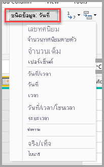
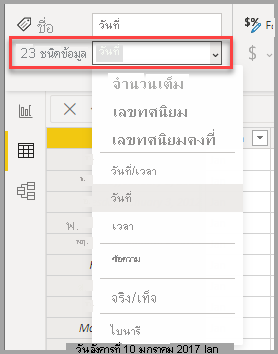

# ชนิดข้อมูลใน Power BI DesktopData types in Power BI Desktop
บทความนี้อธิบายถึงชนิดข้อมูลที่ใช้ใน Power BI Desktop และนิพจน์การวิเคราะห์ข้อมูล (DAX)This article describes data types supported in Power BI Desktop and Data Analysis Expressions (DAX). 

เมื่อคุณโหลดข้อมูลลงใน Power BI Desktop จะมีการพยายามแปลงชนิดข้อมูลของคอลัมน์ต้นฉบับเป็นชนิดข้อมูลที่ใช้ในการเก็บข้อมูล คำนวณ และแสดงผลข้อมูลที่มีประสิทธิภาพมากขึ้นWhen you load data into Power BI Desktop, it will attempt to convert the data type of the source column into a data type that better supports more efficient storage, calculations, and data visualization. ตัวอย่างเช่น ถ้าคอลัมน์ของค่าที่คุณนำเข้าจาก Excel มีค่าที่ไม่มีเศษส่วน Power BI Desktop จะแปลงข้อมูลนั้นเป็นชนิดข้อมูลจำนวนเต็มซึ่งเหมาะสำหรับจัดเก็บจำนวนเต็ม (integers)For example, if a column of values you import from Excel has no fractional values, Power BI Desktop will convert the entire column of data to a Whole Number data type, which is better suited for storing integers.

แนวคิดนี้เป็นสิ่งสำคัญเนื่องจากฟังก์ชัน DAX บางฟังก์ชันกำหนดชนิดข้อมูลพิเศษThis concept is important because some DAX functions have special data type requirements. ในหลายกรณี DAX จะแปลงชนิดข้อมูลของคุณโดยนัย แต่มีบางกรณีที่จะไม่แปลงWhile in many cases DAX will implicitly convert a data type for you, there are some cases where it will not.  ตัวอย่างเช่น ถ้าฟังก์ชัน DAX ต้องใช้ข้อมูลชนิดวันที่ และคอลัมน์ของคุณใช้ข้อมูลชนิดข้อความ ฟังก์ชัน DAX จะไม่ทำงานอย่างถูกต้องFor instance, if a DAX function requires a Date data type and the data type for your column is Text, the DAX function will not work correctly.  ดังนั้น จึงเป็นเรื่องสำคัญที่ต้องใช้ชนิดข้อมูลที่ถูกต้องในคอลัมน์หนึ่งๆSo, it’s both important and useful to get the correct data type for a column. การแปลงโดยนัยแสดงในบทความนี้ในภายหลังImplicit conversions are described later in this article.

## ตรวจสอบและระบุชนิดข้อมูลของคอลัมน์Determine and specify a column’s data type
ใน Power BI Desktop คุณสามารถตรวจสอบ และระบุชนิดข้อมูลของคอลัมน์ในตัวแก้ไขคิวรี หรือ ในมุมมองข้อมูลหรือมุมมองรายงาน:In Power BI Desktop, you can determine and specify a column’s data type in the Query Editor, or in Data View or Report View:

**ชนิดข้อมูลในตัวแก้ไขคิวรี****Data types in Query Editor**

**ชนิดข้อมูลในมุมมองข้อมูลหรือมุมมองรายงาน****Data types in Data View or Report View**

ชนิดข้อมูลแบบหล่นลงในตัวแก้ไขคิวรีมีสองชนิดที่ไม่อยู่ในมุมมองข้อมูลหรือมุมมองรายงานในขณะนี้ คือ: **วันที่/เวลา/โซนเวลา** และ **ระยะเวลา**The Data Type drop down in Query Editor has two data types not currently present in Data or Report View: **Date/Time/Timezone** and **Duration**. เมื่อคอลัมน์ที่มีชนิดข้อมูลเหล่านี้ถูกโหลดลงในแบบจำลองและดูในมุมมองข้อมูลหรือมุมมองรายงาน คอลัมน์ที่มีชนิดข้อมูลวันที่/เวลา/โซนเวลา จะถูกแปลงเป็น วันที่/เวลา และคอลัมน์ที่มีชนิดข้อมูลระยะเวลาจะถูกแปลงเป็นเลขทศนิยามWhen a column with these data types is loaded into the model and viewed in Data or Report view, a column with a Date/Time/Timezone data type will be converted into a Date/Time, and a column with a Duration data type is converted into a Decimal Number.

ข้อมูลประเภท **ไบนารี** ไม่ได้รับการรองรับภายนอกของตัวแก้ไขคิวรีอยู่ในขณะนี้The **Binary** data type is not currently supported outside of the Query Editor. ภายในตัวแก้ไขคิวรี คุณสามารถใช้ได้เมื่อโหลดไฟล์ไบนารีถ้าคุณแปลงเป็นข้อมูลประเภทอื่นก่อนที่จะโหลดไปยังแบบจำลอง Power BIInside the Query Editor you can use it when loading binary files if you convert it to other data types before loading it to the Power BI model. ซึ่งมีอยู่ในเมนูมุมมองข้อมูลและมุมมองรายงานสำหรับเหตุผลดั้งเดิมแต่ถ้าคุณพยายามโหลดคอลัมน์ไบนารีไปยังแบบจำลอง Power BI คุณอาจทำงานเป็นข้อผิดพลาดIt exists in the Data View and Report View menus for legacy reasons but if you try to load binary columns to the Power BI model you may run into errors.  

### ชนิดตัวเลขNumber types
Power BI Desktop สนับสนุนชนิดของตัวเลขสามแบบ:Power BI Desktop supports three number types:

**เลขทศนิยม** – แสดงเป็นตัวเลขทศนิยม 64 บิต (แปดไบต์)**Decimal Number** – Represents a 64 bit (eight-byte) floating point number. เป็นชนิดตัวเลขทั่วไปส่วนใหญ่ และเหมือนกับตัวเลขตามที่คุณมักจะคิดว่าเป็นอย่างนั้นIt’s the most common number type and corresponds to numbers as you usually think of them.  แม้ว่าได้รับการออกแบบมาเพื่อจัดการกับตัวเลขที่มีค่าเศษส่วน เลขทศนิยมมีตัวเลขจำนวนเต็มด้วยAlthough designed to handle numbers with fractional values, it also handles whole numbers.  ชนิดตัวเลขทศนิยมสามารถแสดงค่าลบตั้งแต่ -1.79E +308 จนถึง -2.23E -308, 0 และค่าบวกจาก 2.23E -308 จนถึง 1.79E + 308The Decimal Number type can handle negative values from -1.79E +308 through -2.23E -308, 0, and positive values from 2.23E -308 through 1.79E + 308. ตัวอย่างเช่น ตัวเลขเช่น 34, 34.01 และ 34.000367063 เป็นตัวเลขทศนิยมที่ใช้ได้For example, numbers like 34, 34.01, and 34.000367063 are valid decimal numbers. ความแม่นยำที่มากที่สุดที่สามารถแสดงในชนิดตัวเลขทศนิยมอยู่ที่ความยาว 15 หลักThe largest precision that can be represented in a Decimal Number type is 15 digits long. ตัวคั่นทศนิยมสามารถเกิดขึ้นที่ใดก็ได้ในหมายเลขThe decimal separator can occur anywhere in the number. ชนิดตัวเลขทศนิยมเป็นชนิดตัวเลขที่ Excel เก็บข้อมูลตัวเลขThe Decimal Number type corresponds to how Excel stores its numbers.

**ตัวเลขทศนิยมคงที่** – มีตัวคั่นในตำแหน่งถาวร**Fixed Decimal Number** – Has a fixed location for the decimal separator. ตัวคั่นทศนิยมแสดงตัวเลขทศนิยมสี่หลักทางด้านขวา และดังนั้นจึงแสดงตัวเลขทั้งหมด 19 ตัวThe decimal separator always has four digits to its right and allows for 19 digits of significance.  ค่ามากที่สุดที่สามารถแสดงได้คือ 922,337,203,685,477.5807 (บวกหรือลบ)The largest value it can represent is 922,337,203,685,477.5807 (positive or negative).  ชนิดตัวเลขทศนิยมคงที่นี้จะมีประโยชน์ในกรณีที่การปัดเป็นตัวเลขกลมอาจเกิดข้อผิดพลาดThe Fixed Decimal Number type is useful in cases where rounding might introduce errors.  เมื่อคุณทำงานกับตัวเลขทศนิยมที่มีค่าน้อย บางครั้งตัวเลขทศนิยมค่าน้อยเหล่านี้สามารถสะสมและบังคับให้ค่าลดลงเล็กน้อยWhen you work with many numbers that have small fractional values, they can sometimes accumulate and force a number to be slightly off.  เนื่องจากตัวเลขทศนิยมที่เกินสี่หลักทางด้านขวาของตัวคั่นทศนิยมถูกตัดออก ตัวเลขทศนิยมแบบคงที่สามารถช่วยให้คุณหลีกเลี่ยงการลดค่าของตัวเลขได้Since the values past the four digits to the right of decimal separator are truncated, the Fixed Decimal type can help you avoid these kinds of errors.   ถ้าคุณคุ้นเคยกับ SQL Server ชนิดข้อมูลนี้เหมือนกับตัวเลขทศนิยมของ SQL Server (19,4), หรือชนิดข้อมูลสกุลเงินใน Power PivotIf you’re familiar with SQL Server, this data type corresponds to SQL Server’s Decimal (19,4), or the Currency Data type in Power Pivot. 

**จำนวนเต็ม**– แสดงค่าจำนวนเต็ม 64 บิต (แปดไบต์)**Whole Number** – Represents a 64 bit (eight-byte) integer value. เนื่องจากเป็นจำนวนเต็ม จึงไม่มีตัวเลขทางด้านขวาของจุดทศนิยมBecause it’s an integer, it has no digits to the right of the decimal place. ซึ่งมีได้ 19 ตัว เป็นค่าจำนวนเต็มบวกหรือลบ ระหว่าง -9,223,372,036,854,775,807 (-2^63+1) และ 9,223,372,036,854,775,806 (2^63-2)It allows for 19 digits; positive or negative whole numbers between -9,223,372,036,854,775,807 (-2^63+1) and 9,223,372,036,854,775,806 (2^63-2). ซึ่งจะแสดงความแม่นยำที่มากที่สุดเท่าที่เป็นไปได้ของชนิดข้อมูลตัวเลขต่างๆIt can represent the largest possible precision of the various numeric data types.  เช่นเดียวกับข้อมูลเลขทศนิยมแบบคงที่ จำนวนเต็มมีประโยชน์ในกรณีที่คุณจำเป็นต้องควบคุมการปัดเศษขึ้นAs with the Fixed Decimal type, the Whole Number type can be useful in cases where you need to control rounding. 

> [!NOTE]
>  รูปแบบข้อมูล Power BI Desktop สนับสนุนค่าจำนวนเต็ม 64 บิต แต่จำนวนที่มากที่สุดที่ภาพสามารถแสดงได้อย่างปลอดภัยคือ 9,007,199,254,740,991 (2^53-1) เนื่องจากข้อจำกัดของ JavaScriptThe Power BI Desktop data model supports 64 bit integer values, but the largest number the visuals can safely express is 9,007,199,254,740,991 (2^53-1) due to JavaScript limitations. หากคุณทำงานกับตัวเลขในรูปแบบข้อมูลข้างต้นนี้ คุณสามารถลดขนาดได้โดยการคำนวณก่อนที่จะเพิ่มลงในภาพIf you work with numbers in your data model above this, you can reduce the size through calculations before adding them to a visual 
> 
>

### ชนิดวันที่/เวลาDate/time types
Power BI Desktop สนับสนุนประเภทข้อมูล วันที่/เวลา จำนวนห้าประเภทในมุมมอง QueryPower BI Desktop supports five Date/Time data types in Query View.  ทั้งวันที่/เวลา/โซนเวลาและระยะเวลาจะถูกแปลงในระหว่างการโหลดลงในแบบจำลองBoth Date/Time/Timezone and Duration are converted during load into the model. รูปแบบข้อมูลของ Power BI Desktop จะสนับสนุนเฉพาะ วันที่/เวลา แต่สามารถจัดรูปแบบเป็นวันที่หรือเวลาแบบแยกจากกันได้The Power BI Desktop data model only supports date/time, but they can be formatted as dates or times independently. 

**วันที่/เวลา** – แสดงค่าวันและเวลา**Date/Time** – Represents both a date and time value.  ภายใต้การปกปิด ค่าวันที่/เวลาถูกจัดเก็บเป็นชนิดตัวเลขทศนิยมUnderneath the covers, the Date/Time value is stored as a Decimal Number Type.  ดังนั้น คุณสามารถแปลงระหว่างข้อมูลสองชนิดนี้So you can actually convert between the two.   ส่วนเวลาของวันที่ถูกจัดเก็บเป็นเศษส่วนเป็นพหุคูณทั้งหมดของ 1/300 วินาที (3.33 มิลลิวินาที)The time portion of a date is stored as a fraction to whole multiples of 1/300 seconds (3.33 ms).  สามารถใช้วันที่ระหว่างปี 1900 ถึง 9999 ได้Dates between years 1900 and 9999 are supported.

**วันที่** – แสดงเพียงวันที่ (ไม่มีเวลา)**Date** – Represents just a Date (no time portion).  เมื่อถูกแปลงเป็นรูปแบบจำลอง วันที่จะแสดงเหมือนค่าวันที่/เวลา และมีค่าศูนย์เป็นทศนิยมWhen converted into the model, a Date is the same as a Date/Time value with zero for the fractional value.

**เวลา** – แสดงเพียงแค่เวลา (ไม่มีวันที่)**Time** – Represents just Time (no Date portion).  เมื่อถูกแปลงเป็นรูปแบบจำลอง ค่าเวลาจะแสดงเหมือนกับค่าวันที่/เวลา ไม่มีตัวเลขทางด้านซ้ายของจุดทศนิยมWhen converted into the model, a Time value is the same as a Date/Time value with no digits to the left of the decimal place.

**วันที่/เวลา/โซนเวลา** – แสดงวันที่/เวลา UTC ด้วยค่าออฟเซ็ตโซนเวลา**Date/Time/Timezone** – Represents a UTC Date/Time with a timezone offset.  โดยข้อมูลจะถูกแปลงเป็นวันที่/เวลา เมื่อโหลดลงในโมเดลIt’s converted into Date/Time when loaded into the model. โมเดล Power BI ไม่ปรับโซนเวลาตามตำแหน่งที่ตั้งหรือระบบภาษาของผู้ใช้ ฯลฯ หากค่า 09:00 ถูกโหลดลงในโมเดลในสหรัฐอเมริกา ข้อมูลจะแสดงเป็น 09:00 ไม่ว่าจะมีการเปิดหรือดูรายงานจากที่ใดก็ตามThe Power BI model doesn't adjust the timezone based on a user's location or locale etc. If a value of 09:00 is loaded into the model in the USA, it will display as 09:00 wherever the report is opened or viewed. 

**ระยะเวลา** – แสดงเป็นระยะเวลา**Duration** – Represents a length of time. ในปัจจุบัน ค่าดังกล่าวจะถูกแปลงเป็นข้อมูลชนิดเลขทศนิยมเมื่อโหลดลงในแบบจำลองIt’s converted into a Decimal Number Type when loaded into the model.  เนื่องจากเป็นชนิดตัวเลขทศนิยม สามารถเพิ่มหรือลบระยะเวลากับเขตข้อมูลวันที่/เวลาเพื่อหาผลลัพธ์ที่ถูกต้องAs a Decimal Number type it can be added or subtracted from a Date/Time field with correct results.  และเนื่องจากเป็นชนิดตัวเลขทศนิยม คุณสามารถใช้ค่านี้ในภาพข้อมูลที่แสดงปริมาณAs a Decimal Number type, you can easily use it in visualizations that show magnitude.

### ชนิดข้อความText type
**ข้อความ** - สตริงข้อมูลอักขระ Unicode**Text** - A Unicode character data string. เป็นสตริง ตัวเลข หรือวันที่แสดงในรูปแบบข้อความCan be strings, numbers, or dates represented in a text format. ความยาวสตริงสูงสุดคือ อักขระ Unicode 268,435,456 ตัว (256 ล้านอักขระ) หรือ 536,870,912 ไบต์Maximum string length is 268,435,456 Unicode characters (256 mega characters) or 536,870,912 bytes.

### ชนิด จริง/เท็จTrue/false type
**True/False** – เป็นค่าบูลีนที่เป็น จริง หรือ เท็จ**True/False** – A Boolean value of either a True or False.

### ชนิด ช่องว่าง/ค่า nullBlanks/nulls type
**ช่องว่าง** - เป็นชนิดข้อมูลใน DAX ที่แสดงและแทนค่า SQL null**Blank** - Is a data type in DAX that represents and replaces SQL nulls. คุณสามารถสร้างช่องว่างโดยใช้ฟังก์ชัน[ว่างเปล่า](/dax/blank-function-dax)และทดสอบช่องว่างโดยใช้ฟังก์ชันทางตรรกะ [ISBLANK](/dax/isblank-function-dax)You can create a blank by using the [BLANK](/dax/blank-function-dax) function, and test for blanks by using the [ISBLANK](/dax/isblank-function-dax) logical function.

### ข้อมูลประเภทไบนารีBinary data type

ข้อมูลประเืภไบนารีสามารถใช้เพื่อแสดงข้อมูลอื่น ๆ ที่มีรูปแบบไบนารีได้The Binary data type can be used to represent any other data with a binary format. ภายในตัวแก้ไขคิวรี คุณสามารถใช้ได้เมื่อโหลดไฟล์ไบนารีถ้าคุณแปลงเป็นข้อมูลประเภทอื่นก่อนที่จะโหลดไปยังแบบจำลอง Power BIInside the Query Editor, you can use it when loading binary files if you convert it to other data types before loading it to the Power BI model. คอลัมน์ไบนารีไม่ได้รับการรองรับในแบบจำลองข้อมูล Power BIBinary columns aren't supported in the Power BI data model. ซึ่งมีอยู่ในเมนูมุมมองข้อมูลและมุมมองรายงานสำหรับเหตุผลดั้งเดิมแต่ถ้าคุณพยายามโหลดคอลัมน์ไบนารีไปยังแบบจำลอง Power BI คุณอาจทำงานเป็นข้อผิดพลาดIt exists in the Data View and Report View menus for legacy reasons but if you try to load binary columns to the Power BI model you may run into errors.

> [!NOTE]
>  ถ้าคอลัมน์ไบนารีอยู่ในผลลัพธ์ของขั้นตอนของคิวรี การพยายามรีเฟรชข้อมูลผ่านเกตเวย์อาจทำให้เกิดข้อผิดพลาดIf a binary column is in the output of the steps of a query, attempting to refresh the data through a gateway can cause errors. ขอแนะนำให้คุณลบคอลัมน์ไบนารีใด ๆ เป็นขั้นตอนสุดท้ายในคิวรีของคุณอย่างชัดเจนIt's recommended that you explicitly remove any binary columns as the last step in your queries.    
> 

### ชนิดข้อมูลตารางTable data type
DAX ใช้ชนิดข้อมูลตารางในฟังก์ชันมากมาย เช่น การรวมและการคำนวณเวลาDAX uses a table data type in many functions, such as aggregations and time intelligence calculations. ฟังก์ชันบางอย่างจำเป็นต้องมีการอ้างอิงถึงตาราง ฟังก์ชันอื่นๆ ส่งค่าตารางที่สามารถนำไปใช้เป็นข้อมูลป้อนเข้าไปยังฟังก์ชันอื่นๆSome functions require a reference to a table; other functions return a table that can then be used as input to other functions. ในบางฟังก์ชันที่จำเป็นต้องใช้ตารางเป็นข้อมูลป้อนเข้า คุณสามารถระบุนิพจน์ที่ทำการประเมินใส่ลงในตาราง สำหรับบางฟังก์ชัน ต้องมีการอ้างอิงถึงตารางฐานIn some functions that require a table as input, you can specify an expression that evaluates to a table; for some functions, a reference to a base table is required. สำหรับข้อมูลเกี่ยวกับข้อกำหนดของฟังก์ชันบางอย่าง ดู[การอ้างอิงฟังก์ชัน DAX](/dax/dax-function-reference)For information about the requirements of specific functions, see [DAX Function Reference](/dax/dax-function-reference).

## การแปลงชนิดข้อมูลโดยนัยและแบบชัดแจ้งในสูตร DAXImplicit and explicit data type conversion in DAX formulas
แต่ละฟังก์ชัน DAX มีข้อกำหนดเฉพาะเกี่ยวกับชนิดของข้อมูลที่ใช้เป็นข้อมูลป้อนเข้าและผลลัพธ์Each DAX function has specific requirements as to the types of data that are used as inputs and outputs. ตัวอย่างเช่น บางฟังก์ชันจำเป็นใช้จำนวนเต็มเป็นอาร์กิวเมนต์บางอย่างและใช้วันที่เป็นอาร์กิวเมนต์อื่นๆ ฟังก์ชันบางอย่างอื่นๆ ใช้ข้อความหรือตารางFor example, some functions require integers for some arguments and dates for others; other functions require text or tables.

ถ้าข้อมูลในคอลัมน์ที่คุณระบุว่าเป็นอาร์กิวเมนต์ไม่เข้ากันกับชนิดข้อมูลที่ฟังก์ชันต้องการ ในหลายกรณี DAX จะส่งกลับว่าเกิดข้อผิดพลาดIf the data in the column you specify as an argument is incompatible with the data type required by the function, DAX in many cases will return an error. อย่างไรก็ตาม DAX จะพยายามทำการแปลงข้อมูลให้เป็นชนิดข้อมูลที่ต้องการHowever, wherever possible DAX will attempt to implicitly convert the data to the required data type. ตัวอย่างเช่น:For example:

* คุณสามารถพิมพ์วันที่เป็นสตริง และ DAX จะวิเคราะห์สตริง และพยายามที่จะแสดงเป็นรูปแบบวันที่และเวลาของ Windows ในรูปแบบหนึ่งYou can type a date as a string, and DAX will parse the string and attempt to cast it as one of the Windows date and time formats.
* คุณสามารถเพิ่ม TRUE + 1 และรับผลลัพธ์ 2 เนื่องจากเป็นค่า TRUE จะถูกแปลงโดยนัยเป็นตัวเลข 1 และ operation 1 + 1 จะดำเนินการYou can add TRUE + 1 and get the result 2, because TRUE is implicitly converted to the number 1 and the operation 1+1 is performed.
* ถ้าคุณเพิ่มค่าในสองคอลัมน์ และค่าหนึ่งถูกแสดงเป็นข้อความ ("12") และอีกค่าหนึ่งถูกแสดงเป็นตัวเลข (12), DAX จะแปลงสตริงเป็นตัวเลข และทำการบวกเพื่อสร้างผลลัพธ์ที่เป็นตัวเลขIf you add values in two columns, and one value happens to be represented as text ("12") and the other as a number (12), DAX implicitly converts the string to a number and then does the addition for a numeric result. นิพจน์ต่อไปนี้ส่งกลับ 44: = "22" + 22The following expression returns 44: = "22" + 22.
* ถ้าคุณพยายามทำการเชื่อมสองตัวเลขเข้าด้วยกัน Excel จะนำเสนอตัวเลขเหล่านั้นเป็นสตริง และเชื่อมเข้าด้วยกันIf you attempt to concatenate two numbers, Excel will present them as strings and then concatenate. นิพจน์ต่อไปนี้ส่งกลับ "1234": = 12 & 34The following expression returns "1234": = 12 & 34.

### ตารางของการแปลงข้อมูลโดยนัยTable of implicit data conversions
ชนิดของการแปลงจะขึ้นอยู่กับตัวดำเนินการ (operator) ซึ่งจะแปลงเป็นค่าที่ต้องการก่อนที่จะดำเนินการตาม operation ที่ถูกร้องขอThe type of conversion that is performed is determined by the operator, which casts the values it requires before performing the requested operation. ตารางเหล่านี้แสดงรายการตัวดำเนินการ (operators) และระบุการแปลงชนิดข้อมูลที่อยู่ในคอลัมน์เมื่อมีการจับคู่กับชนิดของข้อมูลในแถวที่ตัดกันThese tables list the operators, and indicate the conversion that is performed on each data type in the column when it is paired with the data type in the intersecting row.

> [!NOTE]
>  ชนิดข้อมูลข้อความจะไม่อยู่ในตารางเหล่านี้Text data types are not included in these tables. เมื่อตัวเลขถูกแสดงในรูปแบบข้อความ ในบางกรณี Power BI จะพยายามระบุว่าเป็นชนิดตัวเลขและแสดงเป็นตัวเลขWhen a number is represented as in a text format, in some cases Power BI will attempt to determine the number type and represent it as a number.
> 
> 

**การบวก (+)****Addition (+)**

| ตัวดำเนินการ(+)Operator(+) | จำนวนเต็มINTEGER | CURRENCYCURRENCY | จริงREAL | วันที่/เวลาDate/time |
| --- | --- | --- | --- | --- |
| จำนวนเต็มINTEGER |จำนวนเต็มINTEGER |CURRENCYCURRENCY |จริงREAL |วันที่/เวลาDate/time |
| CURRENCYCURRENCY |CURRENCYCURRENCY |สกุลเงินCURRENCY |จริงREAL |วันที่/เวลาDate/time |
| จริงREAL |จริงREAL |จริงREAL |จริงREAL |วันที่/เวลาDate/time |
| วันที่/เวลาDate/time |วันที่/เวลาDate/time |วันที่/เวลาDate/time |วันที่/เวลาDate/time |วันที่/เวลาDate/time |

ตัวอย่างเช่น ถ้ามีการใช้จำนวนจริงใน operation การบวก กับข้อมูลสกุลเงิน ค่าทั้งสองจะถูกแปลงเป็น จริง และผลลัพธ์ถูกส่งคืนมาว่า จริงFor example, if a real number is used in an addition operation in combination with currency data, both values are converted to REAL, and the result is returned as REAL.

**การลบ (-)****Subtraction (-)**

ในตารางต่อไปนี้ ส่วนหัวของแถวคือ ตัวตั้ง (ทางด้านซ้าย) และส่วนหัวของคอลัมน์คือ ตัวลบ (ด้านขวา)In the following table, the row header is the minuend (left side) and the column header is the subtrahend (right side).

| ตัวดำเนินการ (-)Operator(-) | จำนวนเต็มINTEGER | CURRENCYCURRENCY | จริงREAL | วันที่/เวลาDate/time |
| --- | --- | --- | --- | --- |
| จำนวนเต็มINTEGER |จำนวนเต็มINTEGER |CURRENCYCURRENCY |จริงREAL |จริงREAL |
| CURRENCYCURRENCY |CURRENCYCURRENCY |สกุลเงินCURRENCY |จริงREAL |จริงREAL |
| จริงREAL |จริงREAL |จริงREAL |จริงREAL |จริงREAL |
| วันที่/เวลาDate/time |วันที่/เวลาDate/time |วันที่/เวลาDate/time |วันที่/เวลาDate/time |วันที่/เวลาDate/time |

ตัวอย่างเช่น ถ้ามี ตัวดำเนินการ ลบ ข้อมูลวันที่ ด้วยชนิดข้อมูลอื่น ค่าทั้งสองจะถูกแปลงเป็นวันที่ และค่าที่ส่งกลับก็จะเป็นวันที่For example, if a date is used in a subtraction operation with any other data type, both values are converted to dates, and the return value is also a date.

> [!NOTE]
>    แบบจำลองข้อมูลยังสนับสนุนตัวดำเนินการ unary, - (ลบ), แต่ตัวดำเนินการนี้ไม่เปลี่ยนแปลงชนิดข้อมูลของตัวถูกดำเนินการ (operand)Data models also support the unary operator, - (negative), but this operator does not change the data type of the operand.
> 
> 

**การคูณ (\*)****Multiplication (\*)**

| ตัวดำเนินการ (\*)Operator(\*) | จำนวนเต็มINTEGER | CURRENCYCURRENCY | จริงREAL | วันที่/เวลาDate/time |
| --- | --- | --- | --- | --- |
| จำนวนเต็มINTEGER |จำนวนเต็มINTEGER |CURRENCYCURRENCY |จริงREAL |จำนวนเต็มINTEGER |
| CURRENCYCURRENCY |สกุลเงินCURRENCY |จริงREAL |CURRENCYCURRENCY |สกุลเงินCURRENCY |
| จริงREAL |จริงREAL |CURRENCYCURRENCY |จริงREAL |จริงREAL |

ตัวอย่างเช่น ถ้ารวมจำนวนเต็มกับจำนวนจริงด้วยตัวดำเนินการคูณ ตัวเลขทั้งสองจะถูกแปลงเป็นตัวเลขแบบจริง และค่าที่ส่งกลับจะเป็น จริงFor example, if an integer is combined with a real number in a multiplication operation, both numbers are converted to real numbers, and the return value is also REAL.

**การหาร (/)****Division (/)**

ในตารางต่อไปนี้ ส่วนหัวของแถวคือ ตัวตั้ง (numerator) และส่วนหัวของคอลัมน์เป็น ตัวหาร (denominator)In the following table, the row header is the numerator and the column header is the denominator.

| ตัวดำเนินการ (/) (แถว/คอลัมน์)Operator(/) (Row/Column) | จำนวนเต็มINTEGER | CURRENCYCURRENCY | จริงREAL | วันที่/เวลาDate/time |
| --- | --- | --- | --- | --- |
| จำนวนเต็มINTEGER |จริงREAL |CURRENCYCURRENCY |จริงREAL |จริงREAL |
| CURRENCYCURRENCY |สกุลเงินCURRENCY |จริงREAL |CURRENCYCURRENCY |จริงREAL |
| จริงREAL |จริงREAL |จริงREAL |จริงREAL |จริงREAL |
| วันที่/เวลาDate/time |จริงREAL |จริงREAL |จริงREAL |จริงREAL |

ตัวอย่างเช่น ถ้าเลขจำนวนเต็มถูกตัวดำเนินการหารด้วยค่าสกุลเงิน ค่าทั้งสองจะถูกแปลงเป็นตัวเลขแบบจริง และผลลัพธ์จะเป็นเลขจำนวนจริงFor example, if an integer is combined with a currency value in a division operation, both values are converted to real numbers, and the result is also a real number.

### ตัวดำเนินการเปรียบเทียบComparison operators
ในนิพจน์การเปรียบเทียบ ค่าบูลีนจะถูกถือว่ามากกว่าค่าสตริงและค่าสตริงที่จะถูกถือว่ามีค่ามากกว่าค่าตัวเลขหรือวันที่/เวลา นอกจากนี้ จะถือว่าค่าตัวเลขและค่าวันที่/เวลา มีอันดับเดียวกันIn comparison expressions, Boolean values are considered greater than string values and string values are considered greater than numeric or date/time values; numbers and date/time values are considered to have the same rank. ไม่มีการแปลงโดยนัยสำหรับค่าบูลีนหรือสตริง ว่างเปล่า หรือช่องว่างจะถูกแปลงเป็น 0/""/เท็จ โดยขึ้นอยู่กับชนิดข้อมูลของอีกค่าที่ถูกเปรียบเทียบNo implicit conversions are performed for Boolean or string values; BLANK or a blank value is converted to 0/""/false depending on the data type of the other compared value.

นิพจน์ DAX ต่อไปนี้แสดงลักษณะการทำงานนี้:The following DAX expressions illustrate this behavior:

=IF(FALSE()\>"จริง", "นิพจน์เป็นจริง", "นิพจน์เป็นเท็จ"), ส่งกลับ "นิพจน์เป็นจริง"=IF(FALSE()\>"true","Expression is true", "Expression is false"), returns "Expression is true"

=IF("12"\>12,"นิพจน์เป็นจริง”, "นิพจน์เป็นเท็จ"), ส่งกลับ "นิพจน์เป็นจริง"=IF("12"\>12,"Expression is true", "Expression is false"), returns "Expression is true"

=IF("12"=12,"นิพจน์เป็นจริง”, "นิพจน์เป็นเท็จ"), ส่งกลับ "นิพจน์เป็นเท็จ"=IF("12"=12,"Expression is true", "Expression is false"), returns "Expression is false"

การแปลงจะดำเนินการโดยนัยสำหรับชนิดข้อมูลตัวเลขหรือขนิดข้อมูลวันที่/เวลาตามที่อธิบายไว้ในตารางต่อไปนี้:Conversions are performed implicitly for numeric or date/time types as described in the following table:

| ตัวดำเนินการเปรียบเทียบComparison Operator | จำนวนเต็มINTEGER | CURRENCYCURRENCY | จริงREAL | วันที่/เวลาDate/time |
| --- | --- | --- | --- | --- |
| จำนวนเต็มINTEGER |จำนวนเต็มINTEGER |CURRENCYCURRENCY |จริงREAL |จริงREAL |
| CURRENCYCURRENCY |CURRENCYCURRENCY |สกุลเงินCURRENCY |จริงREAL |จริงREAL |
| จริงREAL |จริงREAL |จริงREAL |จริงREAL |จริงREAL |
| วันที่/เวลาDate/time |จริงREAL |จริงREAL |จริงREAL |วันที่/เวลาDate/Time |

### จัดการช่องว่าง สตริงว่าง และค่าศูนย์Handling blanks, empty strings, and zero values
ใน DAX ค่า null ค่าว่าง เซลล์ว่าง หรือค่าหายไปถูกแสดง ด้วยชนิดค่าเดียวกันใหม่ คือ ว่างเปล่าIn DAX, a null, blank value, empty cell, or a missing value is all represented by the same new value type, a BLANK. คุณสามารถสร้างช่องว่างโดยใช้ฟังก์ชัน ว่างเปล่า และทดสอบหาช่องว่างโดยใช้ฟังก์ชัน ISBLANKYou can also generate blanks by using the BLANK function, or test for blanks by using the ISBLANK function.

วิธีจัดการช่องว่างในการดำเนินการ เช่น การบวกหรือการเรียงต่อกัน ขึ้นอยู่กับฟังก์ชันแต่ละรายการHow blanks are handled in operations such as addition or concatenation depends on the individual function. ตารางต่อไปนี้สรุปความแตกต่างระหว่าง DAX และสูตร Microsoft Excel ในการจัดการช่องว่างThe following table summarizes the differences between DAX and Microsoft Excel formulas, in the way that blanks are handled.

| นิพจน์Expression | DAXDAX | ExcelExcel |
| --- | --- | --- |
| ว่างเปล่า + ว่างเปล่าBLANK + BLANK |ว่างเปล่าBLANK |0(ศูนย์)0(zero) |
| ว่างเปล่า + 5BLANK + 5 |55 |55 |
| ว่างเปล่า \* 5BLANK \* 5 |BLANKBLANK |0(ศูนย์)0(zero) |
| 5/ว่างเปล่า5/BLANK |ค่าอนันต์Infinity |ข้อผิดพลาดError |
| 0/ว่างเปล่า0/BLANK |NaNNaN |ข้อผิดพลาดError |
| ว่างเปล่า/ว่างเปล่าBLANK/BLANK |BLANKBLANK |ข้อผิดพลาดError |
| เท็จ หรือ ว่างเปล่าFALSE OR BLANK |FALSEFALSE |FALSEFALSE |
| เท็จ และ ว่างเปล่าFALSE AND BLANK |FALSEFALSE |FALSEFALSE |
| จริง หรือ ว่างเปล่าTRUE OR BLANK |TRUETRUE |TRUETRUE |
| จริง และ ว่างเปล่าTRUE AND BLANK |FALSEFALSE |TRUETRUE |
| ว่างเปล่า หรือ ว่างเปล่าBLANK OR BLANK |BLANKBLANK |ข้อผิดพลาดError |
| ว่างเปล่า และ ว่างเปล่าBLANK AND BLANK |BLANKBLANK |ข้อผิดพลาดError |
