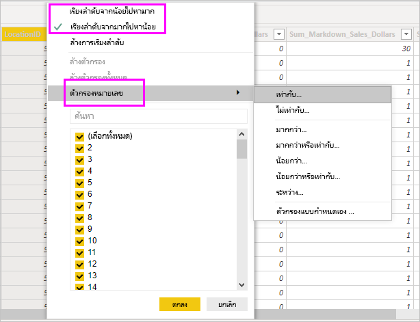

# ทำงานด้วยมุมมองข้อมูลใน Power BI DesktopWork with Data view in Power BI Desktop

*มุมมองข้อมูล* ช่วยให้คุณตรวจสอบ สำรวจ และทำความเข้าใจข้อมูลในรูปแบบ *Power BI Desktop**Data view* helps you inspect, explore, and understand data in your *Power BI Desktop* model. ซึ่งจะแตกต่างจากวิธีที่คุณดูตาราง คอลัมน์ และข้อมูลใน *ตัวแก้ไข Power Query*It's different from how you view tables, columns, and data in *Power Query Editor*. ด้วยมุมมองข้อมูล คุณจะกำลังดูข้อมูลของคุณ *หลังจาก* ที่โหลดเข้ามาในรูปแบบเรียบร้อยแล้วWith Data view, you're looking at your data *after* it has been loaded into the model.

> [!NOTE]
> เนื่องจากมุมมองข้อมูลแสดงข้อมูลหลังจากที่โหลดลงในแบบจำลองแล้ว ไอคอนมุมมองข้อมูลจะไม่สามารถมองเห็นได้หากแหล่งข้อมูลทั้งหมดขึ้นอยู่กับ DirectQuerySince Data view shows data after it's loaded into the model, the Data view icon is not visible if all data sources are based on DirectQuery. 

เมื่อคุณกำลังจัดรูปแบบข้อมูลของคุณ บางครั้งคุณต้องการดูว่ามีอะไรอยู่ในตารางหรือคอลัมน์จริง ๆ โดยไม่สร้างวิชวลบนพื้นที่รายงานWhen you're modeling your data, sometimes you want to see what's actually in a table or column without creating a visual on the report canvas. คุณอาจต้องการดูลึกลงไปถึงระดับแถวYou might want to see right down to the row level. ความสามารถนี้จะเป็นประโยชน์มาก โดยเฉพาะอย่างยิ่งเมื่อคุณกำลังจะสร้างการวัดและคอลัมน์จากการคำนวณ หรือคุณจำเป็นต้องระบุชนิดข้อมูลหรือประเภทข้อมูลThis ability is especially useful when you're creating measures and calculated columns, or you need to identify a data type or data category.

ลองมาดูรายละเอียดองค์ประกอบที่พบในมุมมองข้อมูลกันบ้างLet's take a closer look at some of the elements found in Data view.

1. **ไอคอนมุมมองข้อมูล****Data view icon**. เลือกไอคอนนี้เพื่อเข้าสู่มุมมองข้อมูลSelect this icon to enter Data view.

2. **ตารางข้อมูล****Data Grid**. พื้นที่นี้แสดงตารางที่เลือกและคอลัมน์และแถวทั้งหมดในตารางดด้วยThis area shows the selected table and all columns and rows in it. คอลัมน์ที่ซ่อนจากมุมมอง *รายงาน* จะเป็นสีเทา คุณสามารถคลิกขวาบนคอลัมน์สำหรับตัวเลือกColumns hidden from *Report* view are greyed out. You can right-click on a column for options.

3. **Ribbon การจัดรูปแบบ****Modeling ribbon**. คุณสามารถจัดการความสัมพันธ์ สร้างการคำนวณ เปลี่ยนชนิดข้อมูล รูปแบบ ประเภทข้อมูลสำหรับคอลัมน์Here you can manage relationships, create calculations, change data type, format, data category for a column.

4. **แถบสูตร****Formula bar**. ป้อนสูตรนิพจน์การวิเคราะห์ข้อมูล (DAX) สำหรับการวัดและคอลัมน์จากการคำนวณEnter Data Analysis Expression (DAX) formulas for Measures and Calculated columns.

5. **ค้นหา****Search**. ค้นหาตารางหรือคอลัมน์ในแบบจำลองของคุณSearch for a table or column in your model.

6. **รายการเขตข้อมูล****Fields list**. เลือกตารางหรือคอลัมน์เพื่อดูในตารางข้อมูลSelect a table or column to view in the data grid.

## การกรองในมุมมองข้อมูลFiltering in Data view

คุณยังสามารถกรองและจัดเรียงข้อมูลในมุมมองข้อมูลได้อีกด้วยYou can also filter and sort data in Data view. แต่ละคอลัมน์จะแสดงไอคอนที่ระบุทิศทางการจัดเรียง ถ้ามีการนำไปใช้Each column shows an icon that identifies the sort direction, if applied.

คุณสามารถกรองค่าแต่ละค่าได้ หรือใช้การกรองขั้นสูงตามข้อมูลในคอลัมน์You can filter individual values, or use advanced filtering based on the data in the column.

> [!NOTE]
> เมื่อมีการสร้างแบบจำลอง Power BI ในวัฒนธรรมอื่นนอกเหนือจากส่วนติดต่อผู้ใช้ปัจจุบันของคุณ กล่องการค้นหาจะไม่ปรากฏในส่วนติดต่อผู้ใช้ของมุมมองข้อมูล สำหรับสิ่งอื่นใดนอกเหนือจากเขตข้อมูลข้อความWhen a Power BI model is created in a different culture than your current user interface, the search box will not appear in the Data view user interface for anything other than text fields. ตัวอย่างเช่น รายการนี้จะปรับใช้สำหรับแบบจำลองที่สร้างขึ้นในภาษาอังกฤษแบบสหรัฐอเมริกาที่คุณดูในภาษาสเปนFor example, this would apply for a model created in US English that you view in Spanish.

## ขั้นตอนถัดไปNext steps

คุณสามารถทำการเรียงลำดับของของต่างๆ ด้วย Power BI DesktopYou can do all sorts of things with Power BI Desktop. สำหรับข้อมูลเพิ่มเติมเกี่ยวกับขีดความสามารถ กรุณาดูแหล่งทรัพยากรต่อไปนี้:For more information on its capabilities, check out the following resources:

* [Power BI Desktop คืออะไรWhat is Power BI Desktop?](../fundamentals/desktop-what-is-desktop.md)
* [ภาพรวมคำถามด้วย Power BI DesktopQuery overview with Power BI Desktop](../transform-model/desktop-query-overview.md)
* [ชนิดข้อมูลใน Power BI DesktopData types in Power BI Desktop](desktop-data-types.md)
* [จัดรูปร่างและรวมข้อมูลด้วย Power BI DesktopShape and combine data with Power BI Desktop](desktop-shape-and-combine-data.md)
* [งานแบบสอบถามทั่วไปใน Power BI DesktopCommon query tasks in Power BI Desktop](../transform-model/desktop-common-query-tasks.md)
