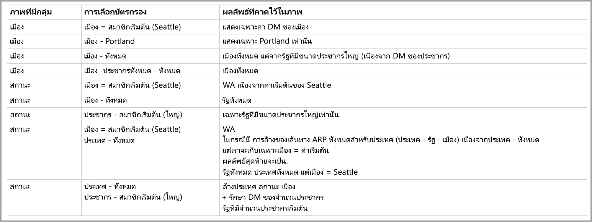

# ทำงานกับแบบจำลองหลายมิติใน Power BIWork with multidimensional models in Power BI

คุณสามารถเชื่อมต่อกับแบบจำลองหลายมิติใน Power BI และสร้างรายงานที่แสดงภาพข้อมูลทั้งหมดภายในแบบจำลองYou can connect to multidimensional models in Power BI, and create reports that visualize all sorts of data within the model. เมื่อทำงานกับแบบจำลองหลายมิติ Power BI จะใช้กฎวิธีการประมวลผลข้อมูล โดยยึดตามคอลัมน์ที่กำหนดเป็นคำ *สมาชิกเริ่มต้น*When working with multidimensional models, Power BI applies rules to how it processes data, based on which column is defined as the *default member*. 

เมื่อทำงานกับแบบจำลองหลายมิติ Power BI จัดการข้อมูลจากแบบจำลองตามจุดคอลัมน์ที่มีการใช้ **DefaultMember**When working with multidimensional models, Power BI handles data from the model based on where the column that contains the **DefaultMember** is used. แอตทริบิวต์ *DefaultMember* จะถูกตั้งค่าใน CSDL (Conceptual Schema Definition Language) สำหรับคอลัมน์เฉพาะในแบบจำลองหลายมิติThe *DefaultMember* attribute is set in CSDL (Conceptual Schema Definition Language) for a particular column in a multidimensional model. คุณสามารถเรียนรู้เพิ่มเติมเกี่ยวกับสมาชิกเริ่มต้นใน[บทความคุณสมบัติแอตทริบิวต์](/sql/analysis-services/multidimensional-models/attribute-properties-define-a-default-member?view=sql-server-2017)ดังกล่าวYou can learn more about the default member in its [attribute properties article](/sql/analysis-services/multidimensional-models/attribute-properties-define-a-default-member?view=sql-server-2017). เมื่อดำเนินการคิวรี DAX สมาชิกเริ่มต้นที่ระบุในแบบจำลองจะถูกนำไปใช้โดยอัตโนมัติWhen a DAX query is executed, the default member specified in the model is applied automatically.

บทความนี้อธิบายวิธีการทำงานของ Power BI ภายใต้สถานการณ์ต่าง ๆ เมื่อทำงานกับแบบจำลองหลายมิติ โดยอิงตามตำแหน่งที่พบ *สมาชิกเริ่มต้น*This article described how Power BI behaves under various circumstances when working with multidimensional models, based on where the *default member* is found. 

## การทำงานกับบัตรตัวกรองWorking with filter cards

เมื่อสร้างบัตรตัวกรองบนเขตข้อมูลที่มีสมาชิกเริ่มต้น ค่าเขตข้อมูลของสมาชิกเริ่มต้นจะถูกเลือกโดยอัตโนมัติในบัตรตัวกรองWhen creating a filter card on a field with a default member, the default member field value is selected automatically in the filter card. ผลลัพธ์คือ วิชวลทั้งหมดที่ได้รับผลกระทบจากบัตรตัวกรองจะรักษาแบบจำลองเริ่มต้นในฐานข้อมูลThe result is that all visuals that are affected by the filter card retain their default models in the database. ค่าต่าง ๆ ในบัตรตัวกรองดังกล่าวจะแสดงเป็นสมาชิกเริ่มต้นThe values in such filter cards reflect that default member.

หากลบสมาชิกเริ่มต้น การยกเลิกการเลือกค่าจะล้างออกเพื่อวิชวลทั้งหมดสำหรับใช้บัตรตัวกรอง และค่าที่แสดงจะไม่แสดงสมาชิกเริ่มต้นIf the default member is removed, de-selecting the value clears it for all visuals to which the filter card applies, and the values displayed do not reflect the default member.

เช่น สมมติว่าเรามีคอลัมน์ *สกุลเงิน* ที่มีสมาชิกเริ่มต้นซึ่งตั้งค่าเป็น *USD*:For example, imagine we have a *Currency* column that has a default member set to *USD*:

* ในกรณีตัวอย่างนี้ หากเรามีบัตรที่แสดง *ยอดขายรวม* ค่าจะมีสมาชิกเริ่มต้นที่นำไปใช้ และเราจะเห็นยอดขายที่สอดคล้องกับสกุลเงิน "USD"In this example case, if we have a card that shows *Total Sales*, the value will have the default member applied and we see sales that correspond to "USD".
* หากเราลาก *สกุลเงิน* ไปยังบานหน้าต่างบัตรตัวกรอง เราจะเห็น *USD* เป็นค่าเริ่มต้นที่เลือกไว้If we drag *Currency* to the filter card pane, we see *USD* as the default value selected. ค่าของ *ยอดขายรวม* จะยังคงเหมือนเดิม เนื่องจากมีการใช้สมาชิกเริ่มต้นThe value of *Total Sales* remains the same, since the default member is applied.
* อย่างไรก็ตาม หากเรายกเลิกการเลือกค่า *USD* จากบัตรตัวกรอง สมาชิกเริ่มต้นสำหรับ *สกุลเงิน* จะถูกล้างออก และตอนนี้ *ยอดขายรวม* จะแสดงสกุลเงินทั้งหมดHowever, if we deselect the *USD* value from the filter card, the default member for *Currency* is cleared, and now *Total Sales* reflects all currencies.
* ดังนั้น เมื่อเราเลือกค่าอื่นในบัตรตัวกรอง (สมมติว่าเราเลือก *EURO*) *ยอดขายรวม* จะแสดงตัวกรอง *สกุลเงินเป็น {USD, EURO}* ในสมาชิกเริ่มต้นทั้งหมดConsequently, when we select another value in the filter card (let's say we select *EURO*), along the default member, the *Total Sales* reflects the filter *Currency IN {USD, EURO}*.

## การจัดกลุ่มลักษณะการทำงานGrouping behavior

ใน Power BI ทุกครั้งที่คุณจัดกลุ่มวิชวลบนคอลัมน์ที่มี *สมาชิกเริ่มต้น* Power BI จะล้าง *สมาชิกเริ่มต้น* สำหรับคอลัมน์ดังกล่าวและเส้นทางความสัมพันธ์ของแอตทริบิวต์In Power BI, whenever you group a visual on a column that has a *default member*, Power BI clears the *default member* for that column and its attribute relationship path. ซึ่งทำให้แน่ใจวิชวลจะแสดงค่าทั้งหมดที่ไม่ใช่แค่เฉพาะค่าเริ่มต้นThis ensures the visual displays all values, rather than just the default values.

## เส้นทางความสัมพันธ์ของแอตทริบิวต์ (ARP)Attribute relationship paths (ARPs)

เส้นทางความสัมพันธ์ของแอตทริบิวต์ (ARP) จะมี *สมาชิกเริ่มต้น* พร้อมความสามารถที่มีประสิทธิภาพ แต่ยังคงมีความซับซ้อนอยู่ส่วนหนึ่งAttribute relationship paths (ARPs) provide *default members* with powerful capabilities, but also introduce a certain amount of complexity. เมื่อตรวจพบ ARP, Power BI จะติดตามเส้นทางของ ARP เพื่อล้างสมาชิกเริ่มต้นเพิ่มเติมสำหรับคอลัมน์อื่น ๆ เพื่อให้การจัดการข้อมูลสำหรับวิชวลมีความสอดคล้องและแม่นยำWhen ARPs are encounter, Power BI follows the path of ARPs to clear additional default members for other columns, to provide consistent, and precise handling of data for visuals.

ลองดูตัวอย่างเพื่อทำความเข้าใจลักษณะการทำงานLet's look at an example to clarify the behavior. พิจารณาการกำหนดค่าของ ARP ต่อไปนี้:Consider the following configuration of ARPs:

ตอนนี้ลองจินตนาการ *สมาชิกเริ่มต้น* ต่อไปนี้ที่ตั้งค่าสำหรับคอลัมน์เหล่านี้:Now let's imagine the following *default members* are set for these columns:

* เมือง > ซีแอตเทิลCity > Seattle
* รัฐ > วอชิงตันState > WA
* ประเทศ > สหรัฐอเมริกาCountry > US
* ประชากร > ขนาดใหญ่Population > Large

ตอนนี้ลองตรวจสอบสิ่งที่เกิดขึ้นเมื่อแต่ละคอลัมน์ที่ถูกใช้ใน Power BINow let's examine what happens when each of the columns is used in Power BI. เมื่อวิชวลจับกลุ่มบนคอลัมน์ต่อไปนี้ จึงเกิดผลลัพธ์ต่าง ๆ ดังนี้:When visuals group on the following columns, here are the results:

* **เมือง** - Power BI แสดงเมืองทั้งหมด โดยล้าง **สมาชิกเริ่มต้น** ทั้งหมดสำหรับ *เมือง* *รัฐ* *ประเทศ* แต่ไม่ล้าง **สมาชิกเริ่มต้น** สำหรับ *ประชากร* เนื่องจาก Power BI ได้ล้าง ARP ทั้งหมดสำหรับ *เมือง* แล้ว**City** - Power BI displays all the cities by clearing all the **default members** for *City*, *State*, *Country* but preserves the **default member** for *Population*; Power BI cleared the entire ARP for *City*.
    > [!NOTE]
    > *ประชากร* ไม่อยู่ในเส้นทาง ARP ของ *เมือง* ซึ่งเกี่ยวข้องกับ *รัฐ* เพียงอย่างเดียว ดังนั้น Power BI จึงไม่ได้ล้างค่า*Population* is not in the ARP path of *City*, it is solely related to *State* and thus Power BI doesn't clear it.
* **รัฐ** - Power BI แสดง *รัฐ* ทั้งหมดโดยล้าง **สมาชิกเริ่มต้น** ทั้งหมดสำหรับ *เมือง* *รัฐ* *ประเทศ* และ *ประชากร***State** - Power BI displays all the *States* by clearing all **default members** for *City*, *State*, *Country* and *Population*.
* **ประเทศ** - Power BI แสดงประเทศทั้งหมด โดยล้าง **สมาชิกเริ่มต้น** ทั้งหมดสำหรับ *เมือง* *รัฐ* *ประเทศ* แต่ไม่ล้าง **สมาชิกเริ่มต้น** สำหรับ *ประชากร***Country** - Power BI displays all the countries by clearing all **default members** for *City*, *State* and *Country*, but preserves the **default member** for *Population*.
* **เมืองและรัฐ** - Power BI จะล้าง **สมาชิกเริ่มต้น** ทั้งหมดสำหรับคอลัมน์ทั้งหมด**City and State** - Power BI clears all **default members** for all columns.

กลุ่มที่แสดงในวิชวลมีเส้นทาง ARP ทั้งหมดที่ถูกล้างแล้วGroups displayed in the visual have their entire ARP path cleared. 

หากมีกลุ่มหนึ่งไม่แสดงในวิชวล แต่เป็นส่วนหนึ่งของเส้นทาง ARP บนคอลัมน์ที่จัดกลุ่มอื่น จะมีสิ่งต่อไปนี้เกิดขึ้น:If a group is not displayed in the visual, but is part of the ARP path of another grouped-on column, the following applies:

* เส้นทาง ARP บางสาขาจะถูกล้างออกโดยอัตโนมัติNot all branches of the ARP path are cleared automatically.
* กลุ่มดังกล่าวจะยังคงถูกกรองโดย **สมาชิกเริ่มต้น** ที่ยังไม่ได้ล้างThat group is still filtered by that uncleared **default member**.

### ตัวแบ่งส่วนข้อมูลและบัตรตัวกรองSlicers and filter cards

เมื่อทำงานกับตัวแบ่งส่วนข้อมูลหรือบัตรตัวกรอง จะมีลักษณะการทำงานต่อไปนี้เกิดขึ้น:When working with slicers or filter cards, the following behavior occurs:

* เมื่อป้อนข้อมูลลงในตัวแบ่งส่วนข้อมูลหรือบัตรตัวกรอง Power BI จะจัดกลุ่มบนคอลัมน์ในวิชวล เพื่อให้การแสดงลักษณะการทำงานเหมือนกับที่อธิบายไว้ในส่วนก่อนหน้าWhen a slicer or filter card is loaded with data, Power BI groups on the column in the visual, so the display behavior is the same as described in the previous section.

เนื่องจากตัวแบ่งส่วนข้อมูลและบัตรตัวกรองมักใช้เพื่อโต้ตอบกับวิชวลอื่น ๆ ตรรกะของการล้าง **สมาชิกเริ่มต้น** สำหรับวิชวลที่ได้รับผลกระทบจะเกิดขึ้นตามที่อธิบายไว้ในตารางต่อไปนี้Since slicers and filter cards are often used to interact with other visuals, the logic of clearing **default members** for the affected visuals occurs as explained in the following table. 

สำหรับตารางนี้ เราใช้ข้อมูลตัวอย่างเดียวกันกับที่ใช้ก่อนหน้าในบทความนี้:For this table, we use the same example data used earlier in this article:

กฎต่อไปนี้จะใช้กับวิธีการทำงานของ Power BI ในสถานการณ์เหล่านี้The following rules apply for how Power BI behaves in these circumstances.

Power BI จะล้าง **สมาชิกเริ่มต้น** สำหรับคอลัมน์ที่มีให้หาก:Power BI clears a **default member** for a given column if:

* Power BI จัดกลุ่มบนคอลัมน์ดังกล่าวPower BI groups on that column
* Power BI จัดกลุ่มบนคอลัมน์ที่เกี่ยวข้องกับคอลัมน์ดังกล่าว (ทุกที่ใน ARP ขึ้นหรือลง)Power BI groups on a column related to that column (anywhere in the ARP, up or down)
* Power BI กรองคอลัมน์ที่อยู่ใน ARP (ขึ้นหรือลง)Power BI filters on a column that is in the ARP (up or down)
* คอลัมน์มีบัตรตัวกรองที่มีรัฐ *ทั้งหมด*The column has a filter card with *ALL* state
* คอลัมน์มีบัตรตัวกรองที่มีค่าใด ๆ ที่เลือกไว้ (Power BI ได้รับตัวกรองสำหรับคอลัมน์)The column has a filter card with any value selected (Power BI receives a filter for the column)

Power BI ไม่ล้าง **สมาชิกเริ่มต้น** สำหรับคอลัมน์ที่มีให้หาก:Power BI does not clear a **default member** for a given column if:

* คอลัมน์มีบัตรตัวกรองที่มีสถานะเริ่มต้น และ Power BI กำลังจัดกลุ่มบนคอลัมน์ใน ARPThe column has a filter card with default state, and Power BI is groupings on a column in its ARP.
* คอลัมน์อยู่เหนือคอลัมน์อื่นใน ARP และ Power BI มีบัตรตัวกรองสำหรับคอลัมน์อื่น ๆ ดังกล่าวในสถานะเริ่มต้นThe column is above another column in the ARP, and Power BI has a filter card for that other column in default state.

## ขั้นตอนถัดไปNext steps

บทความนี้อธิบายลักษณะการทำงานของ Power BI เมื่อทำงานกับสมาชิกเริ่มต้นในแบบจำลองหลายมิติThis article described the behavior of Power BI when working with default members in multidimensional models. คุณอาจมีความสนใจบทความต่อไปนี้:You might also be interested in the following articles: 

* [แสดงรายการที่ไม่มีข้อมูลใน Power BIShow items with no data in Power BI](../create-reports/desktop-show-items-no-data.md)
* [แหล่งข้อมูลใน Power BI DesktopData sources in Power BI Desktop](desktop-data-sources.md)