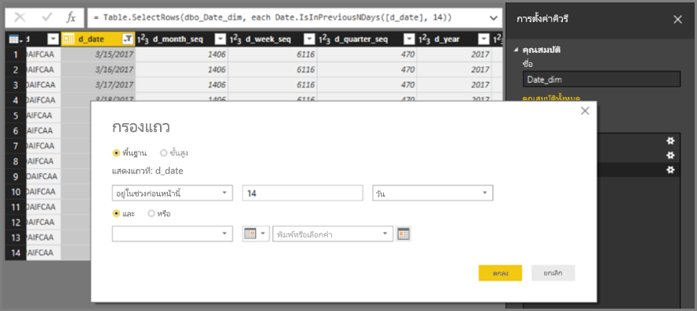
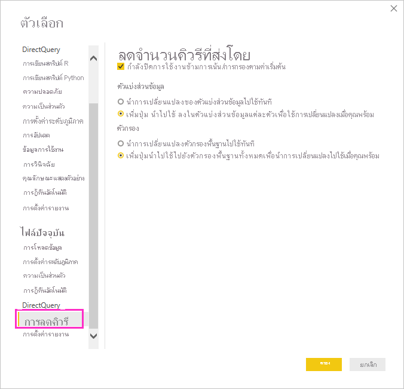
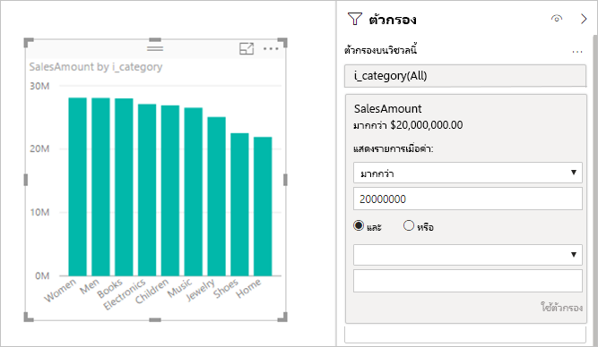
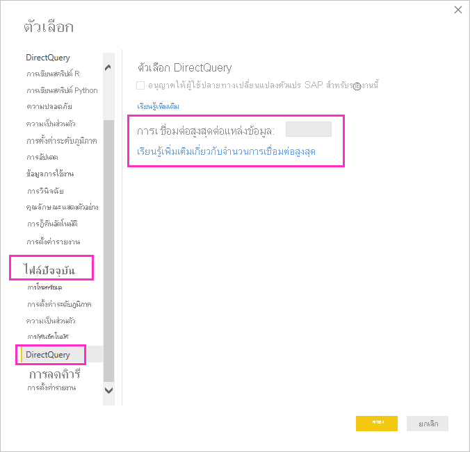
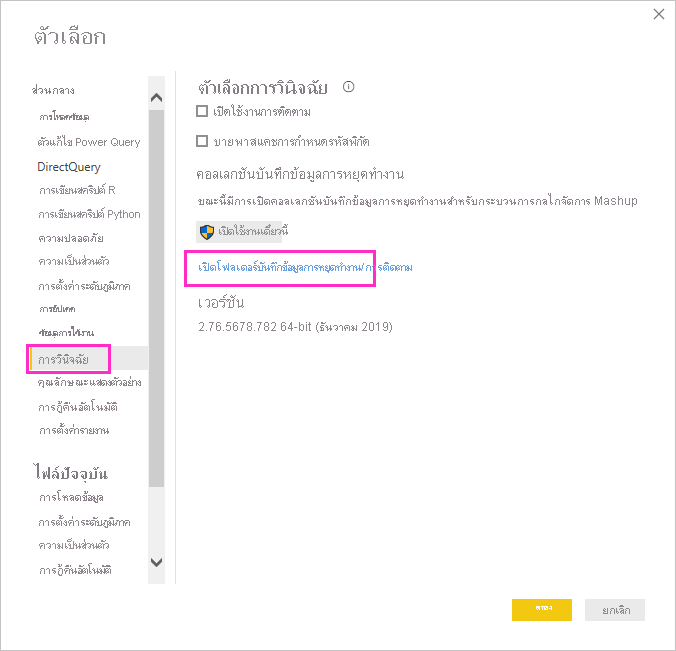
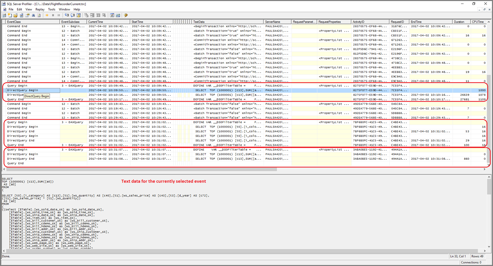
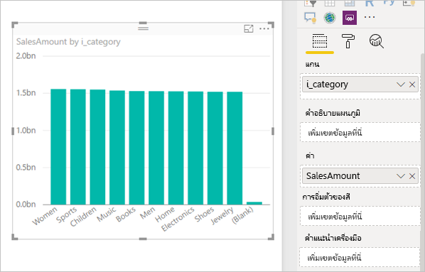

# <a name="about-using-directquery-in-power-bi"></a><span data-ttu-id="ff793-103">เกี่ยวกับการใช้ DirectQuery ใน Power BI</span><span class="sxs-lookup"><span data-stu-id="ff793-103">About using DirectQuery in Power BI</span></span>

<span data-ttu-id="ff793-104">คุณสามารถเชื่อมต่อกับแหล่งข้อมูลต่าง ๆ ได้ทุกประเภท เมื่อใช้ *Power BI Desktop* หรือ *บริการ Power BI* และคุณสามารถทำการเชื่อมต่อข้อมูลเหล่านั้นด้วยวิธีต่าง ๆ ได้</span><span class="sxs-lookup"><span data-stu-id="ff793-104">You can connect to all sorts of different data sources when using *Power BI Desktop* or the *Power BI service*, and make those data connections in different ways.</span></span> <span data-ttu-id="ff793-105">คุณสามารถ *นำเข้า* ข้อมูลไปยัง Power BI ซึ่งเป็นวิธีทั่วไปในการรับข้อมูล หรือคุณสามารถเชื่อมต่อโดยตรงไปยังข้อมูลในที่เก็บแหล่งข้อมูลดั้งเดิม หรือที่เรียกว่า *DirectQuery*</span><span class="sxs-lookup"><span data-stu-id="ff793-105">You can *import* data to Power BI, which is the most common way to get data, or connect directly to data in the original source repository, which is known as *DirectQuery*.</span></span> <span data-ttu-id="ff793-106">บทความนี้อธิบายความสามารถของ DirectQuery:</span><span class="sxs-lookup"><span data-stu-id="ff793-106">This article describes DirectQuery capabilities:</span></span>

* <span data-ttu-id="ff793-107">ตัวเลือกการเชื่อมต่อที่แตกต่างกันสำหรับ DirectQuery</span><span class="sxs-lookup"><span data-stu-id="ff793-107">Different connectivity options for DirectQuery</span></span>
* <span data-ttu-id="ff793-108">คำแนะนำว่าเมื่อใดที่คุณควรใช้ DirectQuery แทนการนำเข้า</span><span class="sxs-lookup"><span data-stu-id="ff793-108">Guidance for when you should consider using DirectQuery rather than import</span></span>
* <span data-ttu-id="ff793-109">ข้อเสียของการใช้ DirectQuery</span><span class="sxs-lookup"><span data-stu-id="ff793-109">Drawbacks of using DirectQuery</span></span>
* <span data-ttu-id="ff793-110">แนวทางปฏิบัติที่ดีที่สุดสำหรับการใช้ DirectQuery</span><span class="sxs-lookup"><span data-stu-id="ff793-110">Best practices for using DirectQuery</span></span>

<span data-ttu-id="ff793-111">ปฏิบัติตามแนวทางปฏิบัติที่ดีที่สุดสำหรับการใช้การนำเข้าเมื่อเทียบกับ DirectQuery:</span><span class="sxs-lookup"><span data-stu-id="ff793-111">Follow best practices for using import versus DirectQuery:</span></span>

* <span data-ttu-id="ff793-112">คุณควรนำเข้าข้อมูลไปยัง Power BI ทุกที่ที่เป็นไปได้</span><span class="sxs-lookup"><span data-stu-id="ff793-112">You should import data to Power BI wherever possible.</span></span> <span data-ttu-id="ff793-113">การนำเข้าข้อมูลจะใช้ประโยชน์จากกลไกจัดการคิวรีประสิทธิภาพสูงของ Power BI และมอบประสบการณ์ที่มีการโต้ตอบสูงและโดดเด่น</span><span class="sxs-lookup"><span data-stu-id="ff793-113">Importing takes advantage of the high performance query engine of Power BI, and provides a highly interactive and fully featured experience.</span></span>
* <span data-ttu-id="ff793-114">ถ้าเป้าหมายของคุณไม่สามารถดำเนินการนำเข้าข้อมูล โปรดพิจารณาการใช้ DirectQuery</span><span class="sxs-lookup"><span data-stu-id="ff793-114">If your goals can't be met by importing data, consider using DirectQuery.</span></span> <span data-ttu-id="ff793-115">ตัวอย่างเช่น ถ้าข้อมูลมีการเปลี่ยนแปลงบ่อย และรายงานต้องแสดงข้อมูลล่าสุด การใช้ DirectQuery อาจที่ดีที่สุด</span><span class="sxs-lookup"><span data-stu-id="ff793-115">For example, if the data is changing frequently and reports must reflect the latest data, DirectQuery may be best.</span></span> <span data-ttu-id="ff793-116">อย่างไรก็ตาม จะสามารถใช้ DirectQuery ได้เมื่อแหล่งข้อมูลต้นแบบมีคิวรีแบบโต้ตอบ น้อยกว่า 5 วินาที สำหรับคิวรีรวมทั่วไป และสามารถจัดการกับการโหลดคิวรีที่จะสร้างขึ้น</span><span class="sxs-lookup"><span data-stu-id="ff793-116">However, using DirectQuery is only feasible when the underlying data source can provide interactive queries, less than 5 seconds for the typical aggregate query, and can handle the query load that will be generated.</span></span> <span data-ttu-id="ff793-117">นอกจากนี้ ควรพิจารณารายการของข้อจำกัดสำหรับการใช้งาน DirectQuery อย่างรอบคอบ เพื่อให้แน่ใจว่ายังคงสามารถดำเนินการตามเป้าหมายของคุณ</span><span class="sxs-lookup"><span data-stu-id="ff793-117">Additionally, the list of limitations for the use of DirectQuery should be considered carefully.</span></span>

<span data-ttu-id="ff793-118">ชุดของความสามารถที่เสนอโดย Power BI สำหรับการนำเข้าและ DirectQuery มีการพัฒนาตลอดเวลา</span><span class="sxs-lookup"><span data-stu-id="ff793-118">The set of capabilities offered by Power BI for import and DirectQuery evolve over time.</span></span> <span data-ttu-id="ff793-119">การเปลี่ยนแปลงจะรวมถึงการให้ความยืดหยุ่นมากขึ้นเมื่อมีการใช้ข้อมูลที่นำเข้า และการนำเข้านั้นสามารถใช้ได้ในหลายกรณี และสามารถกำจัดข้อเสียบางส่วนของการใช้ DirectQuery</span><span class="sxs-lookup"><span data-stu-id="ff793-119">Changes will include providing more flexibility when using imported data, such that import can be used in more cases and eliminating some of the drawbacks of using DirectQuery.</span></span> <span data-ttu-id="ff793-120">เมื่อใช้ DirectQuery ประสิทธิภาพของแหล่งข้อมูลต้นแบบยังคงเป็นข้อพิจารณาหลักอยู่เสมอ โดยไม่คำนึงถึงการปรับปรุง</span><span class="sxs-lookup"><span data-stu-id="ff793-120">Regardless of improvements, when using DirectQuery, the performance of the underlying data source always remains a major consideration.</span></span> <span data-ttu-id="ff793-121">ถ้าแหล่งข้อมูลต้นแบบนั้นช้า ให้ใช้ DirectQuery และแหล่งข้อมูลนั้นจะยังไม่สามารถดำเนินการได้</span><span class="sxs-lookup"><span data-stu-id="ff793-121">If that underlying data source is slow, using DirectQuery for that source will remain unfeasible.</span></span>

<span data-ttu-id="ff793-122">บทความนี้ครอบคลุม DirectQuery กับ Power BI แต่ไม่รวมถึง *SQL Server Analysis Services*</span><span class="sxs-lookup"><span data-stu-id="ff793-122">This article covers DirectQuery with Power BI, and not *SQL Server Analysis Services*.</span></span> <span data-ttu-id="ff793-123">DirectQuery ยังเป็นคุณลักษณะของ SQL Server Analysis Services</span><span class="sxs-lookup"><span data-stu-id="ff793-123">DirectQuery is also a feature of SQL Server Analysis Services.</span></span> <span data-ttu-id="ff793-124">รายละเอียดหลายอย่างที่อธิบายไว้ในบทความนี้นำไปใช้กับคุณลักษณะนั้น</span><span class="sxs-lookup"><span data-stu-id="ff793-124">Many of the details described in this article apply to that feature.</span></span> <span data-ttu-id="ff793-125">นอกจากนี้ยังมีความแตกต่างที่สำคัญอีกด้วย</span><span class="sxs-lookup"><span data-stu-id="ff793-125">There are also important differences.</span></span> <span data-ttu-id="ff793-126">สำหรับข้อมูลเกี่ยวกับการใช้ DirectQuery กับ SQL Server Analysis Services โปรดดู [DirectQuery ใน SQL Server 2016 Analysis Services](https://download.microsoft.com/download/F/6/F/F6FBC1FC-F956-49A1-80CD-2941C3B6E417/DirectQuery%20in%20Analysis%20Services%20-%20Whitepaper.pdf)</span><span class="sxs-lookup"><span data-stu-id="ff793-126">For information about using DirectQuery with SQL Server Analysis Services, see [DirectQuery in SQL Server 2016 Analysis Services](https://download.microsoft.com/download/F/6/F/F6FBC1FC-F956-49A1-80CD-2941C3B6E417/DirectQuery%20in%20Analysis%20Services%20-%20Whitepaper.pdf).</span></span>

<span data-ttu-id="ff793-127">บทความนี้มุ่งเน้นไปที่สมุดงานที่แนะนำสำหรับ DirectQuery ซึ่งรายงานจะถูกสร้างใน Power BI Desktop แต่ยังคงครอบคลุมถึงการเชื่อมต่อโดยตรงในบริการ Power BI</span><span class="sxs-lookup"><span data-stu-id="ff793-127">This article focuses on the recommended workflow for DirectQuery, where the report is created in Power BI Desktop, but also covers connecting directly in the Power BI service.</span></span>

## <a name="power-bi-connectivity-modes"></a><span data-ttu-id="ff793-128">โหมดการเชื่อมต่อ Power BI</span><span class="sxs-lookup"><span data-stu-id="ff793-128">Power BI connectivity modes</span></span>

<span data-ttu-id="ff793-129">Power BI เชื่อมต่อกับแหล่งข้อมูลที่แตกต่างกันจำนวนมาก ครอบคลุมไปถึง:</span><span class="sxs-lookup"><span data-stu-id="ff793-129">Power BI connects to a large number of varied data sources, encompassing:</span></span>

* <span data-ttu-id="ff793-130">บริการออนไลน์ (Salesforce, Dynamics 365 และอื่น ๆ)</span><span class="sxs-lookup"><span data-stu-id="ff793-130">Online services (Salesforce, Dynamics 365, others)</span></span>
* <span data-ttu-id="ff793-131">ฐานข้อมูล (SQL Server, Access, Amazon Redshift และอื่น ๆ)</span><span class="sxs-lookup"><span data-stu-id="ff793-131">Databases (SQL Server, Access, Amazon Redshift, others)</span></span>
* <span data-ttu-id="ff793-132">ไฟล์แบบง่าย (Excel, JSON และอื่น ๆ)</span><span class="sxs-lookup"><span data-stu-id="ff793-132">Simple files (Excel, JSON, others)</span></span>
* <span data-ttu-id="ff793-133">แหล่งข้อมูลอื่น ๆ (Spark, เว็บไซต์, Microsoft Exchange และอื่น ๆ)</span><span class="sxs-lookup"><span data-stu-id="ff793-133">Other data sources (Spark, Web sites, Microsoft Exchange, others)</span></span>

<span data-ttu-id="ff793-134">สำหรับแหล่งข้อมูลเหล่านี้ จะสามารถนำเข้าข้อมูลไปยัง Power BI ได้</span><span class="sxs-lookup"><span data-stu-id="ff793-134">For these sources, it's possible to import the data to Power BI.</span></span> <span data-ttu-id="ff793-135">บางแหล่งข้อมูลยังสามารถเชื่อมต่อโดยใช้ DirectQuery ได้อีกด้วย</span><span class="sxs-lookup"><span data-stu-id="ff793-135">For some, it's also possible to connect using DirectQuery.</span></span> <span data-ttu-id="ff793-136">สำหรับข้อสรุปของแหล่งข้อมูลที่สนับสนุน DirectQuery โปรดดู [แหล่งข้อมูลที่ DirectQuery สนับสนุน](power-bi-data-sources.md)</span><span class="sxs-lookup"><span data-stu-id="ff793-136">For a summary of the sources that support DirectQuery, see [Data Sources supported by DirectQuery](power-bi-data-sources.md).</span></span> <span data-ttu-id="ff793-137">แหล่งข้อมูลเพิ่มเติมที่จะเปิดใช้งาน DirectQuery ในอนาคต จะมุ่งเน้นที่แหล่งข้อมูลที่คาดว่าจะสามารถแสดงประสิทธิภาพการทำงานคิวรีแบบโต้ตอบได้ดี</span><span class="sxs-lookup"><span data-stu-id="ff793-137">More sources will be DirectQuery enabled in the future, focusing primarily on sources that can be expected to deliver good interactive query performance.</span></span>

<span data-ttu-id="ff793-138">SQL Server Analysis Services เป็นกรณีพิเศษ</span><span class="sxs-lookup"><span data-stu-id="ff793-138">SQL Server Analysis Services is a special case.</span></span> <span data-ttu-id="ff793-139">เมื่อเชื่อมต่อกับ SQL Server Analysis Services คุณสามารถเลือกที่จะนำเข้าข้อมูล หรือใช้ *การเชื่อมต่อแบบสด (Live Connection)* ได้</span><span class="sxs-lookup"><span data-stu-id="ff793-139">When connecting to SQL Server Analysis Services, you can choose to import the data or use a *live connection*.</span></span> <span data-ttu-id="ff793-140">การใช้การเชื่อมต่อแบบสดจะเหมือนกับ DirectQuery</span><span class="sxs-lookup"><span data-stu-id="ff793-140">Using a live connection is similar to DirectQuery.</span></span> <span data-ttu-id="ff793-141">ไม่มีการนำเข้าข้อมูล และมีการคิวรีแหล่งข้อมูลต้นแบบเพื่อรีเฟรชวิชวลเสมอ</span><span class="sxs-lookup"><span data-stu-id="ff793-141">No data is imported and the underlying data source is always queried to refresh a visual.</span></span> <span data-ttu-id="ff793-142">การเชื่อมต่อแบบสดนั้นแตกต่างกันไปในหลาย ๆ ด้าน ดังนั้นคำศัพท์ที่ใช้จึงแตกต่างกันด้วยระหว่าง *การเชื่อมต่อแบบสด* กับ *DirectQuery*</span><span class="sxs-lookup"><span data-stu-id="ff793-142">A live connection is different in many other regards, so a different term, *live connection* versus *DirectQuery*, is used.</span></span>

<span data-ttu-id="ff793-143">ตัวเลือกสำหรับการเชื่อมต่อกับข้อมูลทั้งสามตัวเลือกนี้: *นำเข้า*, *DirectQuery* และ *การเชื่อมต่อแบบสด*</span><span class="sxs-lookup"><span data-stu-id="ff793-143">These three options for connecting to data: *import*, *DirectQuery*, and *live connection*.</span></span>

### <a name="import-connections"></a><span data-ttu-id="ff793-144">นำเข้าการเชื่อมต่อ</span><span class="sxs-lookup"><span data-stu-id="ff793-144">Import connections</span></span>

<span data-ttu-id="ff793-145">สำหรับการนำเข้า เมื่อใช้ **รับข้อมูล** ใน Power BI Desktop เพื่อเชื่อมต่อกับแหล่งข้อมูลเช่น SQL Server ลักษณะการทำงานของการเชื่อมต่อดังกล่าวจะเป็นดังนี้:</span><span class="sxs-lookup"><span data-stu-id="ff793-145">For import, when using **Get Data** in Power BI Desktop to connect to a data source like SQL Server, the behavior of that connection is as follows:</span></span>

* <span data-ttu-id="ff793-146">ในระหว่างประสบการณ์การใช้งาน รับข้อมูล เริ่มต้น ชุดของตารางที่เลือกแต่ละรายการจะกำหนดคิวรีที่จะส่งคืนชุดข้อมูล</span><span class="sxs-lookup"><span data-stu-id="ff793-146">During the initial Get Data experience, the set of tables selected each define a query that will return a set of data.</span></span> <span data-ttu-id="ff793-147">คุณสามารถแก้ไขคิวรีเหล่านั้นได้ก่อนการโหลดข้อมูล ตัวอย่างเช่น เมื่อต้องการใช้ตัวกรอง หรือรวมข้อมูล หรือต่อตารางที่แตกต่างเข้าด้วยกัน</span><span class="sxs-lookup"><span data-stu-id="ff793-147">Those queries can be edited before loading the data, for example, to apply filters, or aggregate the data, or join different tables.</span></span>
* <span data-ttu-id="ff793-148">เมื่อมีการโหลด ข้อมูลทั้งหมดที่กำหนดโดยคิวรีเหล่านั้นจะได้รับการนำเข้าลงในแคช Power BI</span><span class="sxs-lookup"><span data-stu-id="ff793-148">Upon load, all of the data defined by those queries will be imported into the Power BI cache.</span></span>
* <span data-ttu-id="ff793-149">เมื่อสร้างวิชวลภายใน Power BI Desktop ข้อมูลที่นำเข้าจะถูกคิวรี</span><span class="sxs-lookup"><span data-stu-id="ff793-149">Upon building a visual within Power BI Desktop, the imported data will be queried.</span></span> <span data-ttu-id="ff793-150">Power BI store ช่วยให้มั่นใจว่าการคิวรีจะรวดเร็ว</span><span class="sxs-lookup"><span data-stu-id="ff793-150">The Power BI store ensures the query will be fast.</span></span> <span data-ttu-id="ff793-151">การเปลี่ยนแปลงทั้งหมดไปยังวิชวลจะปรากฏขึ้นทันที</span><span class="sxs-lookup"><span data-stu-id="ff793-151">All changes to the visual are reflected immediately.</span></span>
* <span data-ttu-id="ff793-152">การเปลี่ยนแปลงใดก็ตามที่ทำกับข้อมูลต้นแบบจะไม่มีผลกับวิชวล</span><span class="sxs-lookup"><span data-stu-id="ff793-152">Any changes to the underlying data aren't reflected in any visuals.</span></span> <span data-ttu-id="ff793-153">จำเป็นต้อง *รีเฟรช* เพื่อนำเข้าข้อมูลอีกครั้ง</span><span class="sxs-lookup"><span data-stu-id="ff793-153">It's necessary to *Refresh* to reimport data.</span></span>
* <span data-ttu-id="ff793-154">เมื่อมีการเผยแพร่รายงานเป็นไฟล์ *.pbix* ไปยังบริการ Power BI ชุดข้อมูลจะถูกสร้าง และอัปโหลดไปยังบริการ Power BI</span><span class="sxs-lookup"><span data-stu-id="ff793-154">Upon publishing the report as a *.pbix* file to the Power BI service, a dataset is created and uploaded to the Power BI service.</span></span> <span data-ttu-id="ff793-155">ข้อมูลนำเข้าจะรวมอยู่ในชุดข้อมูลนั้น</span><span class="sxs-lookup"><span data-stu-id="ff793-155">The imported data is included with that dataset.</span></span> <span data-ttu-id="ff793-156">จากนั้นจะสามารถตั้งกำหนดเวลาการรีเฟรชของข้อมูลดังกล่าวได้ ตัวอย่างเช่น นำเข้าข้อมูลอีกครั้งทุกวัน</span><span class="sxs-lookup"><span data-stu-id="ff793-156">It's then possible to schedule refresh of that data, for example, to reimport the data every day.</span></span> <span data-ttu-id="ff793-157">อาจจำเป็นต้องกำหนดค่าเกตเวย์ข้อมูลภายในองค์กร โดยขึ้นอยู่กับตำแหน่งที่ตั้งของแหล่งข้อมูลต้นฉบับ</span><span class="sxs-lookup"><span data-stu-id="ff793-157">Depending upon the location of the original data source, it might be necessary to configure an on-premises data gateway.</span></span>
* <span data-ttu-id="ff793-158">เมื่อเปิดรายงานที่มีอยู่แล้วในบริการ Power BI หรือเขียนรายงานใหม่ ข้อมูลนำเข้าจะได้รับการคิวรีอีกครั้ง เพื่อยืนยันการโต้ตอบ</span><span class="sxs-lookup"><span data-stu-id="ff793-158">When opening an existing report in the Power BI service, or authoring a new report, the imported data is queried again, ensuring interactivity.</span></span>
* <span data-ttu-id="ff793-159">วิชวลหรือหน้ารายงานทั้งหมดสามารถปักหมุดเป็นไทล์แดชบอร์ด</span><span class="sxs-lookup"><span data-stu-id="ff793-159">Visuals, or entire report pages, can be pinned as dashboard tiles.</span></span> <span data-ttu-id="ff793-160">ไทล์จะรีเฟรชอัตโนมัติเมื่อชุดข้อมูลต้นแบบรีเฟรช</span><span class="sxs-lookup"><span data-stu-id="ff793-160">The tiles automatically refresh whenever the underlying dataset refreshes.</span></span>

### <a name="directquery-connections"></a><span data-ttu-id="ff793-161">การเชื่อมต่อ DirectQuery</span><span class="sxs-lookup"><span data-stu-id="ff793-161">DirectQuery connections</span></span>

<span data-ttu-id="ff793-162">สำหรับ DirectQuery เมื่อใช้ **รับข้อมูล** ใน Power BI Desktop เพื่อเชื่อมต่อกับแหล่งข้อมูล ลักษณะการทำงานของการเชื่อมต่อจะเป็นดังนี้:</span><span class="sxs-lookup"><span data-stu-id="ff793-162">For DirectQuery, when using **Get Data** in Power BI Desktop to connect to a data source, the behavior of that connection is as follows:</span></span>

* <span data-ttu-id="ff793-163">ในระหว่างประสบการณ์การใช้งาน รับข้อมูล เริ่มต้น แหล่งข้อมูลจะถูกเลือก</span><span class="sxs-lookup"><span data-stu-id="ff793-163">During the initial Get Data experience, the source is selected.</span></span> <span data-ttu-id="ff793-164">สำหรับแหล่งข้อมูลเชิงสัมพันธ์ ชุดตารางจะถูกเลือก และแต่ละชุดยังคงกำหนดคิวรีที่จะส่งกลับชุดข้อมูลตามหลักตรรกะ</span><span class="sxs-lookup"><span data-stu-id="ff793-164">For relational sources, a set of tables are selected and each still define a query that logically returns a set of data.</span></span> <span data-ttu-id="ff793-165">สำหรับแหล่งข้อมูลหลายมิติ เช่น SAP BW จะเลือกเฉพาะแหล่งข้อมูลเท่านั้น</span><span class="sxs-lookup"><span data-stu-id="ff793-165">For multidimensional sources, like SAP BW, only the source is selected.</span></span>
* <span data-ttu-id="ff793-166">อย่างไรก็ตาม เมื่อมีการโหลด จะไม่มีการนำเข้าไปยัง Power BI store</span><span class="sxs-lookup"><span data-stu-id="ff793-166">However, upon load, no data is imported into the Power BI store.</span></span> <span data-ttu-id="ff793-167">แต่ให้ดำเนินการสร้างวิชวลภายใน Power BI Desktop คิวรีจะถูกส่งไปยังแหล่งข้อมูลต้นแบบเพื่อดึงข้อมูลจำเป็นออกมา</span><span class="sxs-lookup"><span data-stu-id="ff793-167">Instead, upon building a visual within Power BI Desktop, queries are sent to the underlying data source to retrieve the necessary data.</span></span> <span data-ttu-id="ff793-168">เวลาที่ใช้ในการรีเฟรชวิชวลจะขึ้นอยู่กับประสิทธิภาพของแหล่งข้อมูลต้นแบบ</span><span class="sxs-lookup"><span data-stu-id="ff793-168">The time taken to refresh the visual depends on the performance of the underlying data source.</span></span>
* <span data-ttu-id="ff793-169">การเปลี่ยนแปลงใดก็ตามที่ทำกับข้อมูลต้นแบบไม่มีผลกับวิชวลที่มีอยู่โดยทันที</span><span class="sxs-lookup"><span data-stu-id="ff793-169">Any changes to the underlying data aren't immediately reflected in any existing visuals.</span></span> <span data-ttu-id="ff793-170">ซึ่งคุณจำเป็นต้องรีเฟรช</span><span class="sxs-lookup"><span data-stu-id="ff793-170">It's still necessary to refresh.</span></span> <span data-ttu-id="ff793-171">คิวรีที่จำเป็นสำหรับแต่ละวิชวลจะถูกส่งใหม่อีกครั้ง และจะมีการอัปเดตวิชวลตามความจำเป็น</span><span class="sxs-lookup"><span data-stu-id="ff793-171">The necessary queries are resent for each visual, and the visual is updated as necessary.</span></span>
* <span data-ttu-id="ff793-172">เมื่อมีการเผยแพร่รายงานไปยังบริการของ Power BI จะส่งผลกับชุดข้อมูลในบริการ Power BI เหมือนกับการนำเข้าอีกครั้ง</span><span class="sxs-lookup"><span data-stu-id="ff793-172">Upon publishing the report to the Power BI service, it will again result in a dataset in the Power BI service, the same as for import.</span></span> <span data-ttu-id="ff793-173">อย่างไรก็ตาม *ไม่มีข้อมูลใด* รวมกับชุดข้อมูลนั้น</span><span class="sxs-lookup"><span data-stu-id="ff793-173">However, *no data* is included with that dataset.</span></span>
* <span data-ttu-id="ff793-174">เมื่อเปิดรายงานที่มีอยู่ในบริการ Power BI หรือเขียนรายงานใหม่ แหล่งข้อมูลต้นแบบจะถูกคิวรีอีกครั้งเพื่อดึงข้อมูลจำเป็น</span><span class="sxs-lookup"><span data-stu-id="ff793-174">When opening an existing report in the Power BI service, or authoring a new one, the underlying data source is again queried to retrieve the necessary data.</span></span> <span data-ttu-id="ff793-175">อาจจำเป็นต้องกำหนดค่าเกตเวย์ข้อมูลภายในองค์กรโดยขึ้นอยู่กับตำแหน่งที่ตั้งของแหล่งข้อมูลต้นฉบับ เนื่องจากจำเป็นสำหรับโหมดนำเข้าหากข้อมูลถูกรีเฟรช</span><span class="sxs-lookup"><span data-stu-id="ff793-175">Depending upon the location of the original data source, it might be necessary to configure an on-premises data gateway, as is needed for import mode if the data is refreshed.</span></span>
* <span data-ttu-id="ff793-176">วิชวลหรือหน้ารายงานทั้งหมดสามารถปักหมุดเป็นไทล์แดชบอร์ด</span><span class="sxs-lookup"><span data-stu-id="ff793-176">Visuals, or entire report pages, can be pinned as Dashboard tiles.</span></span> <span data-ttu-id="ff793-177">เพื่อให้แน่ใจว่าการเปิดแดชบอร์ดจะรวดเร็ว ไทล์จะถูกรีเฟรชโดยอัตโนมัติตามกำหนดการ ตัวอย่าง เช่น ทุกชั่วโมง</span><span class="sxs-lookup"><span data-stu-id="ff793-177">To ensure that opening a dashboard is fast, the tiles are automatically refreshed on a schedule, for example, every hour.</span></span> <span data-ttu-id="ff793-178">คุณสามารถควบคุมความถี่ของการรีเฟรชนี้ เพื่อแสดงความถี่ที่ข้อมูลมีการเปลี่ยนแปลง และความสำคัญในการดูข้อมูลล่าสุด</span><span class="sxs-lookup"><span data-stu-id="ff793-178">The frequency of this refresh can be controlled, to reflect how frequently the data is changing, and how important it's to see the latest data.</span></span> <span data-ttu-id="ff793-179">เมื่อเปิดแดชบอร์ด ไทล์จะแสดงข้อมูลตามเวลาการรีเฟรชล่าสุด และไม่จำเป็นต้องมีการเปลี่ยนแปลงล่าสุดที่ทำกับแหล่งข้อมูลต้นแบบ</span><span class="sxs-lookup"><span data-stu-id="ff793-179">When opening a dashboard, the tiles reflect the data at the time of the last refresh, and not necessarily the latest changes made to the underlying source.</span></span> <span data-ttu-id="ff793-180">คุณสามารถรีเฟรชแดชบอร์ดที่เปิดอยู่เพื่อให้แน่ใจว่าเป็นปัจจุบัน</span><span class="sxs-lookup"><span data-stu-id="ff793-180">You can refresh an open dashboard to ensure it's current.</span></span>

### <a name="live-connections"></a><span data-ttu-id="ff793-181">การเชื่อมต่อโดยตรง</span><span class="sxs-lookup"><span data-stu-id="ff793-181">Live connections</span></span>

<span data-ttu-id="ff793-182">เมื่อเชื่อมต่อกับ SQL Server Analysis Services จะมีตัวเลือกเพื่อให้นำเข้าข้อมูลจากแบบจำลองข้อมูลที่เลือก หรือเชื่อมต่อโดยตรงไปยังแบบจำลองข้อมูลที่เลือก</span><span class="sxs-lookup"><span data-stu-id="ff793-182">When connecting to SQL Server Analysis Services, there's an option to either import data from or connect live to, the selected data model.</span></span> <span data-ttu-id="ff793-183">ถ้าคุณใช้นำเข้า ให้คุณกำหนดคิวรีสำหรับแหล่งข้อมูล SQL Server Analysis Services ภายนอกนั้น และข้อมูลจะถูกนำเข้าตามปกติ</span><span class="sxs-lookup"><span data-stu-id="ff793-183">If you use import, you define a query against that external SQL Server Analysis Services source, and the data is imported as normal.</span></span> <span data-ttu-id="ff793-184">ถ้าคุณเลือกการเชื่อมต่อแบบสด จะไม่มีการกำหนดคิวรีใดเลย และแบบจำลองภายนอกทั้งหมดจะแสดงในรายการเขตข้อมูล</span><span class="sxs-lookup"><span data-stu-id="ff793-184">If you use connect live, there's no query defined, and the entire external model is shown in the field list.</span></span>

<span data-ttu-id="ff793-185">สถานการณ์ที่อธิบายไว้ในย่อหน้าก่อนหน้านี้สามารถนำไปใช้กับการเชื่อมต่อกับแหล่งข้อมูลต่อไปนี้เช่นกัน เว้นแต่ว่าไม่มีตัวเลือกการนำเข้าข้อมูล:</span><span class="sxs-lookup"><span data-stu-id="ff793-185">The situation described in the previous paragraph applies to connecting to the following sources as well, except that there's no option to import the data:</span></span>

* <span data-ttu-id="ff793-186">ชุดข้อมูล power BI ตัวอย่างเช่น เมื่อเชื่อมต่อกับชุดข้อมูล Power BI ที่ได้รับการสร้าง และเผยแพร่ไปยังบริการก่อนหน้านี้เพื่อสร้างรายงานใหม่</span><span class="sxs-lookup"><span data-stu-id="ff793-186">Power BI datasets, for example, when connecting to a Power BI dataset that has previously been created and published to the service, to author a new report over it.</span></span>
* <span data-ttu-id="ff793-187">Microsoft Dataverse</span><span class="sxs-lookup"><span data-stu-id="ff793-187">Microsoft Dataverse.</span></span>

<span data-ttu-id="ff793-188">ลักษณะการทำงานของรายงานด้วย SQL Server Analysis Services เมื่อมีการเผยแพร่ไปยังบริการ Power BI จะมีลักษณะคล้ายกับรายงาน DirectQuery ดังต่อไปนี้:</span><span class="sxs-lookup"><span data-stu-id="ff793-188">The behavior of reports over SQL Server Analysis Services, upon publishing to the Power BI service, is similar to DirectQuery reports in the following ways:</span></span>

* <span data-ttu-id="ff793-189">เมื่อเปิดรายงานที่มีอยู่ในบริการ Power BI หรือเขียนรายงานใหม่ แหล่งข้อมูล SQL Server Analysis Services ต้นแบบจะได้รับการคิวรี ซึ่งอาจต้องใช้เกตเวย์ข้อมูลภายในองค์กร</span><span class="sxs-lookup"><span data-stu-id="ff793-189">When opening an existing report in the Power BI service or authoring a new report, the underlying SQL Server Analysis Services source is queried, possibly requiring an on-premises data gateway.</span></span>
* <span data-ttu-id="ff793-190">ไทล์แดชบอร์ดที่จะรีเฟรชโดยอัตโนมัติตามกำหนดการ เช่น ทุกชั่วโมง</span><span class="sxs-lookup"><span data-stu-id="ff793-190">Dashboard tiles are automatically refreshed on a schedule, such as every hour.</span></span>

<span data-ttu-id="ff793-191">นอกจากนี้ยังมีความแตกต่างที่สำคัญอีกด้วย</span><span class="sxs-lookup"><span data-stu-id="ff793-191">There are also important differences.</span></span> <span data-ttu-id="ff793-192">ตัวอย่างเช่น สำหรับการเชื่อมต่อแบบสด ข้อมูลประจำตัวของผู้ใช้ที่เปิดรายงานจะถูกส่งผ่านไปยังแหล่งที่มา SQL Server Analysis Services ต้นแบบเสมอ</span><span class="sxs-lookup"><span data-stu-id="ff793-192">For instance, for live connections, the identity of the user opening the report is always passed to the underlying SQL Server Analysis Services source.</span></span>

<span data-ttu-id="ff793-193">จากการเปรียบเทียบเหล่านี้ ให้ลองมาโฟกัสที่ DirectQuery ในส่วนเหลือของบทความนี้เท่านั้น</span><span class="sxs-lookup"><span data-stu-id="ff793-193">With these comparisons out of the way, let's focus solely on DirectQuery for the rest of this article.</span></span>

## <a name="when-is-directquery-useful"></a><span data-ttu-id="ff793-194">DirectQuery จะมีประโยชน์เมื่อไหร่</span><span class="sxs-lookup"><span data-stu-id="ff793-194">When is DirectQuery useful?</span></span>

<span data-ttu-id="ff793-195">ตารางต่อไปนี้อธิบายสถานการณ์ที่การเชื่อมต่อกับ DirectQuery อาจมีประโยชน์อย่างยิ่ง</span><span class="sxs-lookup"><span data-stu-id="ff793-195">The following table describes scenarios where connecting with DirectQuery could be especially useful.</span></span> <span data-ttu-id="ff793-196">ซึ่งรวมถึงกรณีที่การทิ้งข้อมูลในแหล่งดั้งเดิมจะถือว่าเป็นประโยชน์</span><span class="sxs-lookup"><span data-stu-id="ff793-196">It includes cases where leaving the data in the original source would be considered beneficial.</span></span> <span data-ttu-id="ff793-197">คำอธิบายรวมถึงการอภิปรายว่าสถานการณ์ที่ระบุมีอยู่ใน Power BI หรือไม่</span><span class="sxs-lookup"><span data-stu-id="ff793-197">The description includes a discussion about whether the specified scenario is available in Power BI.</span></span>

| <span data-ttu-id="ff793-198">ข้อจำกัด</span><span class="sxs-lookup"><span data-stu-id="ff793-198">Limitation</span></span> | <span data-ttu-id="ff793-199">คำอธิบาย</span><span class="sxs-lookup"><span data-stu-id="ff793-199">Description</span></span> |
| --- | --- |
| <span data-ttu-id="ff793-200">ข้อมูลมีการเปลี่ยนแปลงอยู่บ่อยครั้ง และจำเป็นต้องมีการรายงานแบบเรียลไทม์</span><span class="sxs-lookup"><span data-stu-id="ff793-200">Data is changing frequently, and near real-time reporting is needed</span></span> |<span data-ttu-id="ff793-201">แบบจำลองที่มีข้อมูลที่นำเข้าสามารถรีเฟรชได้มากที่สุดต่อชั่วโมง (มักพบว่าบ่อยมากกว่า เมื่อใช้ Power BI Pro หรือการสมัครใช้งาน Power BI Premium)</span><span class="sxs-lookup"><span data-stu-id="ff793-201">Models with imported data can be refreshed at most once per hour (more frequently with Power BI Pro or Power BI Premium subscriptions).</span></span> <span data-ttu-id="ff793-202">ถ้าข้อมูลมีการเปลี่ยนแปลงอย่างต่อเนื่อง และจำเป็นสำหรับรายงานเพื่อที่จะต้องแสดงข้อมูลล่าสุด การใช้การนำเข้าที่มีการรีเฟรชตามกำหนดการอาจไม่ตรงกับความต้องการเหล่านั้น</span><span class="sxs-lookup"><span data-stu-id="ff793-202">Tf the data is continually changing, and it's necessary for reports to show the latest data, using import with scheduled refresh might not meet those needs.</span></span> <span data-ttu-id="ff793-203">คุณสามารถสตรีมข้อมูลไปยัง Power BI โดยตรง แม้ว่าจะมีข้อจำกัดปริมาณข้อมูลที่สนับสนุนสำหรับกรณีนี้</span><span class="sxs-lookup"><span data-stu-id="ff793-203">You can stream data directly into Power BI, though there are limits on the data volumes supported for this case.</span></span> <br/> <br/> <span data-ttu-id="ff793-204">ในทางตรงกันข้าม การใช้ DirectQuery หมายความว่าการเปิด หรือการรีเฟรชรายงานหรือแดชบอร์ดจะแสดงข้อมูลล่าสุดในแหล่งข้อมูลเสมอ</span><span class="sxs-lookup"><span data-stu-id="ff793-204">Using DirectQuery, by contrast, means that opening or refreshing a report or dashboard always shows the latest data in the source.</span></span> <span data-ttu-id="ff793-205">นอกจากนี้ยังสามารถอัปเดตไทล์แดชบอร์ดได้บ่อยมากขึ้น อัปเดตได้ทุก 15 นาที</span><span class="sxs-lookup"><span data-stu-id="ff793-205">Additionally, the dashboard tiles can be updated more frequently, as often as every 15 minutes.</span></span> |
| <span data-ttu-id="ff793-206">ข้อมูลมีขนาดใหญ่มาก</span><span class="sxs-lookup"><span data-stu-id="ff793-206">Data is very large</span></span> |<span data-ttu-id="ff793-207">หากข้อมูลมีขนาดใหญ่มาก จะไม่สามารถนำเข้าได้ทั้งหมด</span><span class="sxs-lookup"><span data-stu-id="ff793-207">If the data is very large, it wouldn't be feasible to import it all.</span></span> <span data-ttu-id="ff793-208">ในทางตรงกันข้าม DirectQuery ไม่ต้องการการถ่ายโอนข้อมูลขนาดใหญ่มากเนื่องจากมีการคิวรรีอยู่แล้ว</span><span class="sxs-lookup"><span data-stu-id="ff793-208">DirectQuery, by contrast, requires no large transfer of data, because it's queried in place.</span></span> <br/> <br/> <span data-ttu-id="ff793-209">อย่างไรก็ตาม ข้อมูลขนาดใหญ่อาจหมายความว่า ประสิทธิภาพการทำงานของคิวรีกับแหล่งข้อมูลต้นแบบนั้นช้าเกินไป ตามที่อธิบายไว้ใน[ผลกระทบจากการใช้ DirectQuery](#implications-of-using-directquery)</span><span class="sxs-lookup"><span data-stu-id="ff793-209">However, large data might also imply that the performance of the queries against that underlying source is too slow, as discussed in [Implications of using DirectQuery](#implications-of-using-directquery).</span></span> <span data-ttu-id="ff793-210">คุณไม่จำเป็นต้องนำเข้าข้อมูลที่มีรายละเอียดสมบูรณ์เสมอ</span><span class="sxs-lookup"><span data-stu-id="ff793-210">You don't always have to import the full detailed data.</span></span> <span data-ttu-id="ff793-211">แต่คุณสามารถรวมข้อมูลไว้ล่วงหน้าในระหว่างการนำเข้าได้</span><span class="sxs-lookup"><span data-stu-id="ff793-211">Instead, the data can be pre-aggregated during import.</span></span> <span data-ttu-id="ff793-212">*ตัวแก้ไขคิวรี* ทำให้ง่ายต่อการรวมข้อมูลล่วงหน้าในระหว่างการนำเข้า</span><span class="sxs-lookup"><span data-stu-id="ff793-212">The *Query Editor* makes it easy to pre-aggregate during import.</span></span> <span data-ttu-id="ff793-213">และในที่สุดก็จะสามารถนำเข้าข้อมูลรวมที่จำเป็นสำหรับแต่ละการแสดงผลด้วยภาพ</span><span class="sxs-lookup"><span data-stu-id="ff793-213">In the extreme, it would be possible to import exactly the aggregate data needed for each visual.</span></span> <span data-ttu-id="ff793-214">ในขณะที่ DirectQuery เป็นวิธีที่ง่ายที่สุดในการเข้าถึงข้อมูลขนาดใหญ่ แต่การนำเข้าข้อมูลรวมอาจเสนอวิธีแก้ปัญหาหากแหล่งข้อมูลต้นแบบช้าเกินไป</span><span class="sxs-lookup"><span data-stu-id="ff793-214">While DirectQuery is the simplest approach to large data, importing aggregate data might offer a solution if the underlying source is too slow.</span></span> |
| <span data-ttu-id="ff793-215">กฎการรักษาความปลอดภัยจะได้รับการกำหนดในแหล่งข้อมูลต้นแบบ</span><span class="sxs-lookup"><span data-stu-id="ff793-215">Security rules are defined in the underlying source</span></span> |<span data-ttu-id="ff793-216">เมื่อนำเข้าข้อมูลแล้ว Power BI จะเชื่อมต่อกับแหล่งข้อมูลโดยใช้ข้อมูลประจำตัวของผู้ใช้ปัจจุบันจาก Power BI Desktop หรือข้อมูลประจำตัวที่กำหนดไว้เป็นส่วนหนึ่งของการกำหนดค่าการรีเฟรชตามกำหนดการจากบริการ Power BI</span><span class="sxs-lookup"><span data-stu-id="ff793-216">When the data is imported, Power BI connects to the data source using the current user's credentials from Power BI Desktop, or the credentials defined as part of configuring scheduled refresh from the Power BI service.</span></span> <span data-ttu-id="ff793-217">ในการเผยแพร่และแบ่งปันรายงานดังกล่าวพร้อมข้อมูลในโหมด *นำเข้า* โปรดระมัดระวังให้แบ่งปันกับผู้ใช้ที่ได้รับอนุญาตให้ดูข้อมูลเดียวกันเท่านั้น หรือกำหนดให้ Row Level Security เป็นส่วนหนึ่งของชุดข้อมูล</span><span class="sxs-lookup"><span data-stu-id="ff793-217">In publishing and sharing such a report with data in *import* mode, be careful to only share with users allowed to see the same data, or to define row-level security as part of the dataset.</span></span> <br/> <br/> <span data-ttu-id="ff793-218">DirectQuery อนุญาตให้ส่งข้อมูลประจำตัวของผู้ดูรายงานไปยังแหล่งข้อมูลพื้นฐานและกฎความปลอดภัยที่จะนำไปใช้ที่นั่น</span><span class="sxs-lookup"><span data-stu-id="ff793-218">DirectQuery allows for a report viewer's credentials to be passed through to the underlying source and security rules to be applied there.</span></span> <span data-ttu-id="ff793-219">รองรับการลงชื่อเข้าระบบครั้งเดียวสำหรับแหล่งข้อมูล SQL Azure และผ่านเกตเวย์ข้อมูลไปยังเซิร์ฟเวอร์ SQL ในองค์กร</span><span class="sxs-lookup"><span data-stu-id="ff793-219">Single sign-on is supported to SQL Azure datasources, and through the data gateway to on-premises SQL servers.</span></span> <span data-ttu-id="ff793-220">ส่วนนี้ครอบคลุมรายละเอียดเพิ่มเติมในส่วนนี้ครอบคลุมรายละเอียดเพิ่มเติมใน[ภาพรวมของการลงชื่อเข้าใช้ครั้งเดียว (SSO) สำหรับเกตเวย์ใน Power BI](service-gateway-sso-overview.md)</span><span class="sxs-lookup"><span data-stu-id="ff793-220">This is covered in more detail in [Overview of single sign-on (SSO) for gateways in Power BI](service-gateway-sso-overview.md).</span></span> |
| <span data-ttu-id="ff793-221">ใช้ข้อจำกัดด้านอำนาจข้อมูล</span><span class="sxs-lookup"><span data-stu-id="ff793-221">Data sovereignty restrictions apply</span></span> |<span data-ttu-id="ff793-222">องค์กรบางแห่งมีนโยบายรอบด้านเกี่ยวกับอำนาจข้อมูล ซึ่งหมายความว่า ข้อมูลดังกล่าวไม่สามารถออกจากสถานที่ขององค์กรได้</span><span class="sxs-lookup"><span data-stu-id="ff793-222">Some organizations have policies around data sovereignty, meaning that data can't leave the organization premises.</span></span> <span data-ttu-id="ff793-223">การแก้ปัญหาที่ยึดตามการนำเข้าจะแสดงปัญหาอย่างชัดเจน</span><span class="sxs-lookup"><span data-stu-id="ff793-223">A solution based on import would clearly present issues.</span></span> <span data-ttu-id="ff793-224">ในทางกลับกัน ด้วย DirectQuery ที่ยังคงมีข้อมูลอยู่ในแหล่งข้อมูลต้นแบบ</span><span class="sxs-lookup"><span data-stu-id="ff793-224">By contrast, with DirectQuery that data remains in the underlying source.</span></span> <br/> <br/> <span data-ttu-id="ff793-225">อย่างไรก็ตาม ถึงแม้จะใช้ DirectQuery แต่แคชบางตัวของข้อมูลในระดับวิชวลจะยังคงอยู่ในบริการ Power BI เนื่องจากการรีเฟรชตามกำหนดการของไทล์</span><span class="sxs-lookup"><span data-stu-id="ff793-225">However, even with DirectQuery, some caches of data at the visual level are kept in the Power BI service because of scheduled refresh of tiles.</span></span> |
| <span data-ttu-id="ff793-226">แหล่งข้อมูลต้นแบบคือ แหล่งข้อมูล OLAP ที่ประกอบด้วยหน่วยวัด</span><span class="sxs-lookup"><span data-stu-id="ff793-226">Underlying data source is an OLAP source, containing measures</span></span> |<span data-ttu-id="ff793-227">ถ้าแหล่งข้อมูลต้นแบบประกอบด้วย *หน่วยวัด* เช่น SAP HANA หรือ SAP Business Warehouse จากนั้นการนำเข้าข้อมูลจะทำให้เกิดปัญหาอื่น ๆ</span><span class="sxs-lookup"><span data-stu-id="ff793-227">If the underlying data source contains *measures*, such as SAP HANA or SAP Business Warehouse, then importing the data brings other issues.</span></span> <span data-ttu-id="ff793-228">นั่นหมายความว่า ข้อมูลนำเข้าดังกล่าวอยู่ในระดับเฉพาะของการรวม ตามที่กำหนดไว้โดยคิวรี</span><span class="sxs-lookup"><span data-stu-id="ff793-228">It means that the data imported is at a particular level of aggregation, as defined by the query.</span></span> <span data-ttu-id="ff793-229">ตัวอย่างเช่น วัด **TotalSales** ตาม **Class**, **Year** และ **City**.</span><span class="sxs-lookup"><span data-stu-id="ff793-229">For example, measures **TotalSales** by **Class**, **Year**, and **City**.</span></span> <span data-ttu-id="ff793-230">จากนั้นถ้าวิชวลถูกสร้างขึ้นเพื่อขอข้อมูลในการรวมระดับสูงกว่า เช่น **TotalSales** ตาม **Year** จะเป็นการรวมมูลค่ารวมเพิ่มเติม</span><span class="sxs-lookup"><span data-stu-id="ff793-230">Then if a visual is built asking for data at a higher-level aggregate, such as **TotalSales** by **Year**, it's further aggregating the aggregate value.</span></span> <span data-ttu-id="ff793-231">การรวมนี้ใช้ได้สำหรับหน่วยวัดเสริม เช่น **Sum** และ **Min** แต่เป็นปัญหาสำหรับหน่วยวัดที่ไม่ใช่หน่วยวัดเสริม เช่น **Average**, **DistinctCount**</span><span class="sxs-lookup"><span data-stu-id="ff793-231">This aggregation is fine for additive measures, such as **Sum** and **Min**, but it's an issue for non-additive measures, such as **Average**, **DistinctCount**.</span></span> <br/> <br/> <span data-ttu-id="ff793-232">จำเป็นจะต้องส่งคิวรีต่อวิชวลแต่ละอัน เช่นเดียวกับใน DirectQuery เพื่อทำให้การรับข้อมูลรวมที่ถูกต้อง ตามที่จำเป็นสำหรับวิชวลเฉพาะ โดยตรงจากแหล่งมาง่ายขึ้น</span><span class="sxs-lookup"><span data-stu-id="ff793-232">To make it easy to get the correct aggregate data, as needed for the particular visual, directly from the source, it would be necessary to send queries per visual, as in DirectQuery.</span></span> <br/> <br/> <span data-ttu-id="ff793-233">เมื่อเชื่อมต่อกับ SAP Business Warehouse (BW) การเลือก DirectQuery จะช่วยให้สามารถจัดการหน่วยวัดได้</span><span class="sxs-lookup"><span data-stu-id="ff793-233">When connecting to SAP Business Warehouse (BW), choosing DirectQuery allows for this treatment of measures.</span></span> <span data-ttu-id="ff793-234">สำหรับข้อมูลเกี่ยวกับ SAP BW โปรดดู [DirectQuery และ SAP BW](desktop-directquery-sap-bw.md)</span><span class="sxs-lookup"><span data-stu-id="ff793-234">For information about SAP BW, see [DirectQuery and SAP BW](desktop-directquery-sap-bw.md).</span></span> <br/> <br/> <span data-ttu-id="ff793-235">อย่างไรก็ตาม ขณะนี้ DirectQuery บน SAP HANA ถือว่าเหมือนกันกับแหล่งข้อมูลเชิงสัมพันธ์ และจึงมีลักษณะการทำงานคล้ายคลึงกับการนำเข้า</span><span class="sxs-lookup"><span data-stu-id="ff793-235">However, currently DirectQuery over SAP HANA treats it the same as a relational source, and provides similar behavior to import.</span></span> <span data-ttu-id="ff793-236">แนวทางนี้จะครอบคลุมเพิ่มเติมใน [DirectQuery และ SAP HANA](desktop-directquery-sap-hana.md)</span><span class="sxs-lookup"><span data-stu-id="ff793-236">This approach is covered further in [DirectQuery and SAP HANA](desktop-directquery-sap-hana.md).</span></span> |

<span data-ttu-id="ff793-237">โดยสรุป เมื่อพิจารณาจากความสามารถในปัจจุบันของ DirectQuery ใน Power BI สถานการณ์ที่ให้ประโยชน์มีดังนี้:</span><span class="sxs-lookup"><span data-stu-id="ff793-237">In summary, given the current capabilities of DirectQuery in Power BI, it offers the benefits in the following scenarios:</span></span>

* <span data-ttu-id="ff793-238">ข้อมูลมีการเปลี่ยนแปลงอยู่บ่อยครั้ง และจำเป็นต้องมีการรายงานแบบ "เรียลไทม์"</span><span class="sxs-lookup"><span data-stu-id="ff793-238">Data is changing frequently, and near real-time reporting is needed.</span></span>
* <span data-ttu-id="ff793-239">จัดการข้อมูลขนาดใหญ่มาก โดยไม่จำเป็นต้องรวบรวมไว้ล่วงหน้า</span><span class="sxs-lookup"><span data-stu-id="ff793-239">Handling very large data, without the need to pre-aggregate.</span></span>
* <span data-ttu-id="ff793-240">ใช้ข้อจำกัดด้านอำนาจข้อมูล</span><span class="sxs-lookup"><span data-stu-id="ff793-240">Data sovereignty restrictions apply.</span></span>
* <span data-ttu-id="ff793-241">แหล่งข้อมูลเป็นแหล่งข้อมูลแบบหลายมิติที่ประกอบด้วยหน่วยวัด เช่น SAP BW</span><span class="sxs-lookup"><span data-stu-id="ff793-241">The source is a multidimensional source containing measures, such as SAP BW.</span></span>

<span data-ttu-id="ff793-242">โปรดทราบว่ารายละเอียดในรายการก่อนหน้านี้เกี่ยวข้องกับการใช้ Power BI เท่านั้น</span><span class="sxs-lookup"><span data-stu-id="ff793-242">The details in the previous list relate to the use of Power BI alone.</span></span> <span data-ttu-id="ff793-243">แต่คุณสามารถใช้แบบจำลอง SQL Server Analysis Services หรือ Azure Analysis Services ภายนอกเพื่อนำเข้าข้อมูลได้</span><span class="sxs-lookup"><span data-stu-id="ff793-243">Instead, you could use an external SQL Server Analysis Services or Azure Analysis Services model to import data.</span></span> <span data-ttu-id="ff793-244">จากนั้นใช้ Power BI เพื่อเชื่อมต่อกับแบบจำลองนั้น</span><span class="sxs-lookup"><span data-stu-id="ff793-244">Then use Power BI to connect to that model.</span></span> <span data-ttu-id="ff793-245">แม้ว่าวิธีการดังกล่าวจะต้องใช้การกำหนดค่าเพิ่มเติม แต่ก็ช่วยให้มีความยืดหยุ่นมากขึ้น</span><span class="sxs-lookup"><span data-stu-id="ff793-245">While that approach would require additional configuration, it does provide greater flexibility.</span></span> <span data-ttu-id="ff793-246">สามารถนำเข้าข้อมูลจำนวนมากได้</span><span class="sxs-lookup"><span data-stu-id="ff793-246">Much larger volumes of data can be imported.</span></span> <span data-ttu-id="ff793-247">ไม่มีข้อจำกัดเกี่ยวกับความถี่ในการรีเฟรชข้อมูล</span><span class="sxs-lookup"><span data-stu-id="ff793-247">There's no restriction on how frequently the data can be refreshed.</span></span>

## <a name="implications-of-using-directquery"></a><span data-ttu-id="ff793-248">ข้อเสียของการใช้ DirectQuery</span><span class="sxs-lookup"><span data-stu-id="ff793-248">Implications of using DirectQuery</span></span>

<span data-ttu-id="ff793-249">การใช้ DirectQuery มีผลกระทบเชิงลบ ซึ่งจะอธิบายตามรายละเอียดในส่วนนี้</span><span class="sxs-lookup"><span data-stu-id="ff793-249">Use of DirectQuery does have potentially negative implications, as detailed in this section.</span></span> <span data-ttu-id="ff793-250">ข้อจำกัดบางข้อจะแตกต่างกันเล็กน้อยโดยขึ้นอยู่กับแหล่งข้อมูลที่ใช้งาน</span><span class="sxs-lookup"><span data-stu-id="ff793-250">Some of those limitations are slightly different depending upon the exact source that is being used.</span></span> <span data-ttu-id="ff793-251">เราแก้ไขปัญหาข้อจำกัดตามความเหมาะสม และแยกบทความให้ครอบคลุมแหล่งข้อมูลที่แตกต่างกันอย่างมาก</span><span class="sxs-lookup"><span data-stu-id="ff793-251">We address limitations where applicable, and separate articles cover those sources that are substantially different.</span></span>

### <a name="performance-and-load-on-the-underlying-source"></a><span data-ttu-id="ff793-252">ประสิทธิภาพการทำงานและการโหลดบนแหล่งข้อมูลต้นแบบ</span><span class="sxs-lookup"><span data-stu-id="ff793-252">Performance and load on the underlying source</span></span>

<span data-ttu-id="ff793-253">เมื่อใช้ DirectQuery ประสบการณ์การใช้งานโดยรวมจะขึ้นอยู่กับประสิทธิภาพของแหล่งข้อมูลต้นแบบ</span><span class="sxs-lookup"><span data-stu-id="ff793-253">When using DirectQuery, the overall experience depends very much on the performance of the underlying data source.</span></span> <span data-ttu-id="ff793-254">ถ้าการรีเฟรชแต่ละวิชวล ตัวอย่างเช่น หลังจากการเปลี่ยนแปลงค่าตัวแบ่งส่วนข้อมูล จะใช้เวลาสองถึงสามวินาที โดยปกติแล้วน้อยกว่า 5 วินาที ประสบการณ์การใช้งานดังกล่าวจะมีความสมเหตุสมผล</span><span class="sxs-lookup"><span data-stu-id="ff793-254">If refreshing each visual, for example, after changing a slicer value, takes a few seconds, usually less than 5 seconds, the experience would be reasonable.</span></span> <span data-ttu-id="ff793-255">ประสบการณ์การใช้งานอาจรู้สึกเอื่อยเฉื่อยเมื่อเทียบกับการตอบสนองทันทีเมื่อนำเข้าข้อมูลไปยัง Power BI</span><span class="sxs-lookup"><span data-stu-id="ff793-255">The experience might feel sluggish compared to the immediate response when importing the data to Power BI.</span></span> <span data-ttu-id="ff793-256">หากความช้าของแหล่งข้อมูลทำให้วิชวลแต่ละวิชวลใช้เวลานานกว่าสิบวินาที ประสบการณ์การใช้งานจะแย่มาก</span><span class="sxs-lookup"><span data-stu-id="ff793-256">If the slowness of the source causes individual visuals to take longer than tens of seconds, the experience becomes extremely poor.</span></span> <span data-ttu-id="ff793-257">คิวรีอาจหมดเวลา</span><span class="sxs-lookup"><span data-stu-id="ff793-257">Queries may even time out.</span></span>

<span data-ttu-id="ff793-258">ให้ความสนใจกับโหลดที่วางอยู่บนแหล่งข้อมูล พร้อมกับประสิทธิภาพของแหล่งต้นแบบ</span><span class="sxs-lookup"><span data-stu-id="ff793-258">Along with the performance of the underlying source, pay attention to the load placed upon the source.</span></span> <span data-ttu-id="ff793-259">โหลดส่งผลกระทบต่อประสิทธิภาพ</span><span class="sxs-lookup"><span data-stu-id="ff793-259">Load impacts performance.</span></span> <span data-ttu-id="ff793-260">ผู้ใช้แต่ละรายที่เปิดรายงานที่ใช้ร่วมกัน และไทล์แดชบอร์ดแต่ละอันที่รีเฟรช ให้ส่งคิวรีอย่างน้อยหนึ่งคิวรีต่อหนึ่งวิชวลไปยังแหล่งข้อมูลต้นแบบ</span><span class="sxs-lookup"><span data-stu-id="ff793-260">Each user who opens a shared report, and each dashboard tile that refreshes, sends at least one query per visual to the underlying source.</span></span> <span data-ttu-id="ff793-261">ข้อเท็จจริงนี้จำเป็นต้องมีแหล่งข้อมูลที่สามารถจัดการภาระคิวรีดังกล่าว โดยยังคงรักษาประสิทธิภาพการทำงานอย่างเหมาะสม</span><span class="sxs-lookup"><span data-stu-id="ff793-261">This fact requires that the source can handle such a query load, while still maintaining reasonable performance.</span></span>

### <a name="security-implications-when-combining-data-sources"></a><span data-ttu-id="ff793-262">ผลกระทบด้านความปลอดภัยเมื่อรวมแหล่งข้อมูล</span><span class="sxs-lookup"><span data-stu-id="ff793-262">Security implications when combining data sources</span></span>

<span data-ttu-id="ff793-263">คุณสามารถใช้หลายแหล่งข้อมูลในแบบจำลอง DirectQuery ได้เช่นเดียวกับเมื่อคุณนำเข้าข้อมูลโดยใช้คุณลักษณะ [แบบจำลองรวม](../transform-model/desktop-composite-models.md)</span><span class="sxs-lookup"><span data-stu-id="ff793-263">It's possible to use multiple data sources in a DirectQuery model, just as when you import data, by using the [Composite models](../transform-model/desktop-composite-models.md) feature.</span></span> <span data-ttu-id="ff793-264">เมื่อคุณใช้หลายแหล่งข้อมูล สิ่งสำคัญคือต้องทำความเข้าใจวิธีการย้ายข้อมูลกลับไปมาระหว่างแหล่งข้อมูลเบื้องต้นและ[ความเกี่ยวข้องด้านความปลอดภัย](../transform-model/desktop-composite-models.md#security-implications)ที่จะนำมาใช้</span><span class="sxs-lookup"><span data-stu-id="ff793-264">When you use multiple data sources, it's important to understand how data is moved back and forth between the underlying data sources, and the [security implications](../transform-model/desktop-composite-models.md#security-implications) it brings.</span></span>

### <a name="limited-data-transformations"></a><span data-ttu-id="ff793-265">การแปลงข้อมูลที่จำกัด</span><span class="sxs-lookup"><span data-stu-id="ff793-265">Limited data transformations</span></span>

<span data-ttu-id="ff793-266">ในทำนองเดียวกัน มีข้อจำกัดในการเปลี่ยนแปลงข้อมูลที่สามารถนำไปใช้ภายใน ตัวแก้ไขคิวรี</span><span class="sxs-lookup"><span data-stu-id="ff793-266">Similarly, there are limitations in the data transformations that can be applied within Query Editor.</span></span> <span data-ttu-id="ff793-267">ด้วยข้อมูลนำเข้า ชุดการแปลงที่มีความซับซ้อนสามารถนำมาใช้เพื่อทำความสะอาดและปรับแต่งข้อมูลก่อนที่จะใช้เพื่อสร้างวิชวลได้อย่างง่ายดาย เช่น การแยกวิเคราะห์เอกสาร JSON หรือการหมุนข้อมูลจากคอลัมน์ไปเป็นรูปแบบแถว</span><span class="sxs-lookup"><span data-stu-id="ff793-267">With imported data, a sophisticated set of transformations can easily be applied to clean and reshape the data before using it to create visuals, such as parsing JSON documents, or pivoting data from a column to a row form.</span></span> <span data-ttu-id="ff793-268">การแปลงเหล่านั้นจะถูกจำกัดมากขึ้นใน DirectQuery</span><span class="sxs-lookup"><span data-stu-id="ff793-268">Those transformations are more limited in DirectQuery.</span></span>

<span data-ttu-id="ff793-269">ก่อนอื่น เมื่อเชื่อมต่อกับแหล่งข้อมูล OLAP เช่น SAP Business Warehouse จะไม่สามารถกำหนดการแปลงได้เลย และจะนำแบบจำลองภายนอกทั้งหมดมาจากแหล่งข้อมูล</span><span class="sxs-lookup"><span data-stu-id="ff793-269">First, when connecting to an OLAP source like SAP Business Warehouse, no transformations can be defined at all, and the entire external model is taken from the source.</span></span> <span data-ttu-id="ff793-270">สำหรับแหล่งข้อมูลเชิงสัมพันธ์ เช่น SQL Server จะยังคงสามารถกำหนดชุดของการแปลงต่อคิวรีได้ แต่จะมีการจำกัดการแปลงเหล่านั้นเพื่อเหตุผลด้านประสิทธิภาพการทำงาน</span><span class="sxs-lookup"><span data-stu-id="ff793-270">For relational sources, like SQL Server, it's still possible to define a set of transformations per query, but those transformations are limited for performance reasons.</span></span>

<span data-ttu-id="ff793-271">การแปลงดังกล่าวจะถูกนำไปใช้กับทุกการคิวรีแหล่งข้อมูลต้นแบบ โดยทำมากกว่าหนึ่งครั้งในการรีเฟรชข้อมูล ดังนั้นจึงมีข้อจำกัดสำหรับการแปลงข้อมูลที่สามารถแปลเป็นคิวรีเนทิฟเดี่ยวได้อย่างสมเหตุสมผล</span><span class="sxs-lookup"><span data-stu-id="ff793-271">Any such transformation will need to be applied on every query to the underlying source, rather than once on data refresh, so they're limited to those transformations that can reasonably be translated into a single native query.</span></span> <span data-ttu-id="ff793-272">ถ้าคุณใช้การแปลงแบบที่มีความซับซ้อนเกินไป คุณจะได้รับข้อผิดพลาดที่ต้องลบ หรือแบบจำลองที่เปลี่ยนเป็นนำเข้า</span><span class="sxs-lookup"><span data-stu-id="ff793-272">If you use a transformation that is too complex, you receive an error that either it must be deleted or the model switched to import.</span></span>

<span data-ttu-id="ff793-273">นอกจากนี้ คิวรีที่เป็นผลลัพธ์จากกล่องโต้ตอบ **รับข้อมูล** หรือตัวแก้ไขคิวรีจะถูกใช้ในการเลือกย่อยภายในคิวรีที่สร้างขึ้น และส่งไปเพื่อดึงข้อมูลจำเป็นสำหรับวิชวล</span><span class="sxs-lookup"><span data-stu-id="ff793-273">Additionally, the query that results from the **Get Data** dialog or Query Editor will be used in a subselect within the queries generated and sent to retrieve the necessary data for a visual.</span></span> <span data-ttu-id="ff793-274">คิวรีที่กำหนดไว้ในตัวแก้ไขคิวรีต้องถูกต้องภายในบริบทนี้</span><span class="sxs-lookup"><span data-stu-id="ff793-274">The query defined in Query Editor must be valid within this context.</span></span> <span data-ttu-id="ff793-275">โดยเฉพาะอย่างยิ่งมันเป็นไปไม่ได้ที่จะใช้คิวรีโดยนิพนธ์ตารางทั่วไป หรือสิ่งที่เรียกใช้ Stored Procedures</span><span class="sxs-lookup"><span data-stu-id="ff793-275">In particular, it's not possible to use a query using Common Table Expressions, nor one that invokes Stored Procedures.</span></span>

### <a name="modeling-limitations"></a><span data-ttu-id="ff793-276">ข้อจำกัดของการสร้างแบบจำลอง</span><span class="sxs-lookup"><span data-stu-id="ff793-276">Modeling limitations</span></span>

<span data-ttu-id="ff793-277">ความหมายของ *การสร้างแบบจำลอง* ในบริบทนี้หมายถึงการกลั่นกรองและปรับปรุงข้อมูลดิบให้เป็นส่วนหนึ่งของการเขียนรายงานที่ใช้งานการสร้างแบบจำลอง</span><span class="sxs-lookup"><span data-stu-id="ff793-277">The term *modeling* in this context means the act of refining and enriching the raw data, as part of authoring a report using it.</span></span> <span data-ttu-id="ff793-278">ตัวอย่างเช่น</span><span class="sxs-lookup"><span data-stu-id="ff793-278">Examples include:</span></span>

* <span data-ttu-id="ff793-279">กำหนดความสัมพันธ์ระหว่างตาราง</span><span class="sxs-lookup"><span data-stu-id="ff793-279">Defining relationships between tables</span></span>
* <span data-ttu-id="ff793-280">เพิ่มการคำนวณใหม่ (คอลัมน์และหน่วยวัดจากการคำนวณ)</span><span class="sxs-lookup"><span data-stu-id="ff793-280">Adding new calculations (calculated columns and measures)</span></span>
* <span data-ttu-id="ff793-281">เปลี่ยนชื่อและซ่อนคอลัมน์และการวัด</span><span class="sxs-lookup"><span data-stu-id="ff793-281">Renaming and hiding columns and measures</span></span>
* <span data-ttu-id="ff793-282">กำหนดลำดับชั้น</span><span class="sxs-lookup"><span data-stu-id="ff793-282">Defining hierarchies</span></span>
* <span data-ttu-id="ff793-283">กำหนดการจัดรูปแบบ ข้อสรุปเริ่มต้นและจัดเรียงลำดับของคอลัมน์</span><span class="sxs-lookup"><span data-stu-id="ff793-283">Defining the formatting, default summarization and sort order for a column</span></span>
* <span data-ttu-id="ff793-284">จัดกลุ่ม หรือแบ่งกลุ่มค่า</span><span class="sxs-lookup"><span data-stu-id="ff793-284">Grouping or clustering values</span></span>

<span data-ttu-id="ff793-285">เมื่อใช้ DirectQuery จะยังสามารถดำเนินการการเสริมสร้างแบบจำลองต่าง ๆ เหล่านี้ และแน่นอนว่ายังคงมีหลักการที่ว่าข้อมูลดิบจะได้รับการเสริมสร้าง เพื่อปรับปรุงการบริโภคในภายหลัง</span><span class="sxs-lookup"><span data-stu-id="ff793-285">When using DirectQuery, many of these model enrichments can still be made, and certainly there's still the principle that the raw data is being enriched, so as to improve later consumption.</span></span> <span data-ttu-id="ff793-286">อย่างไรก็ตาม เมื่อใช้ DirectQuery จะมีความสามารถในการสร้างแบบจำลองบางอย่างที่ไม่พร้อมใช้งาน หรือจะถูกจำกัด</span><span class="sxs-lookup"><span data-stu-id="ff793-286">However, there are some modeling capabilities that aren't available, or are limited, when using DirectQuery.</span></span> <span data-ttu-id="ff793-287">ข้อจำกัดที่จะนำไปใช้เพื่อหลีกเลี่ยงปัญหาเกี่ยวกับประสิทธิภาพการทำงาน</span><span class="sxs-lookup"><span data-stu-id="ff793-287">The limitations are generally applied to avoid performance issues.</span></span> <span data-ttu-id="ff793-288">ชุดของข้อจำกัดที่ใช้โดยทั่วไปกับแหล่งข้อมูล DirectQuery ทั้งหมด จะแสดงอยู่ในรายการตรงส่วนนี้</span><span class="sxs-lookup"><span data-stu-id="ff793-288">The set of limitations that are common to all DirectQuery sources are listed here.</span></span> <span data-ttu-id="ff793-289">ข้อจำกัดเพิ่มเติมอาจนำไปใช้กับแต่ละแหล่งข้อมูลตามที่อธิบายไว้ใน [ขั้นตอนถัดไป](#next-steps)</span><span class="sxs-lookup"><span data-stu-id="ff793-289">Additional limitations might apply to individual sources, as described in [Next steps](#next-steps).</span></span>

* <span data-ttu-id="ff793-290">**ไม่มีลำดับชั้นวันที่ในตัว:** เมื่อนำเข้าข้อมูล ทุกคอลัมน์วันที่/วันที่และเวลาจะมีลำดับชั้นวันที่แบบติดตั้งมาในตัวจะพร้อมใช้งานเป็นค่าเริ่มต้น</span><span class="sxs-lookup"><span data-stu-id="ff793-290">**No built-in date hierarchy:** When importing data, every date/datetime column will also have a built-in date hierarchy available by default.</span></span> <span data-ttu-id="ff793-291">ตัวอย่างเช่น ถ้านำเข้าตาราง ใบสั่งขายรวมถึงคอลัมน์ **OrderDate** และเมื่อใช้ **OrderDate** ในวิชวล จะสามารถเลือกระดับที่เหมาะสม (ปี, เดือน, วัน) ที่จะใช้</span><span class="sxs-lookup"><span data-stu-id="ff793-291">For example, if importing a table of sales orders including a column **OrderDate**, then upon using **OrderDate** in a visual, it will be possible to choose the appropriate level (year, month, day) to use.</span></span> <span data-ttu-id="ff793-292">ลำดับชั้นของวันแบบติดตั้งมาในตัวนี้ไม่พร้อมใช้งานเมื่อใช้ DirectQuery</span><span class="sxs-lookup"><span data-stu-id="ff793-292">This built-in date hierarchy isn't available when using DirectQuery.</span></span> <span data-ttu-id="ff793-293">ถ้ามีตาราง **Date** พร้อมใช้งานในแหล่งข้อมูลต้นแบบ ซึ่งมีอยู่ทั่วไปในคลังข้อมูลจำนวนมาก ฟังก์ชัน DAX Time Intelligence จะยังสามารถใช้งานได้ตามปกติ</span><span class="sxs-lookup"><span data-stu-id="ff793-293">If there's a **Date** table available in the underlying source, as is common in many data warehouses, then the DAX Time Intelligence functions can be used as normal.</span></span>
* <span data-ttu-id="ff793-294">**วันที่/เวลารองรับเฉพาะความแม่นยำในระดับวินาทีเท่านั้น:** ขณะใช้คอลัมน์เวลาในชุดข้อมูลองคุณ Power BI จะออกรายการสืบค้นไปยังต้นทางที่เกี่ยวข้องในระดับรายละอียดระดับวินาที</span><span class="sxs-lookup"><span data-stu-id="ff793-294">**Date/time support only to second accuracy:** When using time columns in your dataset, Power BI only issues queries to the underlying source to a level of detail of seconds.</span></span> <span data-ttu-id="ff793-295">ไม่มีการส่งคิวรีไปยังแหล่ง DirectQuery เป็นมิลลิวินาที</span><span class="sxs-lookup"><span data-stu-id="ff793-295">Queries aren't sent to the DirectQuery source for milliseconds.</span></span> <span data-ttu-id="ff793-296">ลบส่วนนี้ออกจากคอลัมน์แหล่งข้อมูลของคุณ</span><span class="sxs-lookup"><span data-stu-id="ff793-296">Remove this part of the times from your source columns.</span></span>
* <span data-ttu-id="ff793-297">**ข้อจำกัดในคอลัมน์จากการคำนวณ:** คอลัมน์จากการคำนวณจะถูกจำกัดอยู่ภายในแถว คอลัมน์เหล่านั้นสามารถดูค่าของคอลัมน์อื่น ๆ ในตารางเดียวกันได้โดยไม่ต้องใช้ฟังก์ชันรวมใด ๆ</span><span class="sxs-lookup"><span data-stu-id="ff793-297">**Limitations in calculated columns:** Calculated columns are limited to being intra-row, as in, they can only refer to values of other columns of the same table, without the use of any aggregate functions.</span></span> <span data-ttu-id="ff793-298">นอกจากนี้ฟังก์ชันสเกลาร์ DAX เช่น `LEFT()` ที่ได้รับอนุญาตจะถูกจำกัดเฉพาะฟังก์ชันเหล่านั้นที่สามารถส่งไปยังแหล่งต้นแบบได้</span><span class="sxs-lookup"><span data-stu-id="ff793-298">Additionally, the DAX scalar functions, such as `LEFT()`, that are allowed, are limited to those functions that can be pushed to the underlying source.</span></span> <span data-ttu-id="ff793-299">ฟังก์ชันจะแตกต่างกันโดยขึ้นอยู่กับความสามารถที่แท้จริงของแหล่งข้อมูล</span><span class="sxs-lookup"><span data-stu-id="ff793-299">The functions vary depending upon the exact capabilities of the source.</span></span> <span data-ttu-id="ff793-300">ฟังก์ชันที่ไม่ได้รับการสนับสนุนจะไม่แสดงในการเติมข้อความอัตโนมัติ เมื่อเขียน DAX สำหรับคอลัมน์จากการคำนวณ และจะส่งผลกับข้อผิดพลาดหากมีการใช้</span><span class="sxs-lookup"><span data-stu-id="ff793-300">Functions that aren't supported aren't listed in autocomplete when authoring the DAX for a calculated column, and would result in an error if used.</span></span>
* <span data-ttu-id="ff793-301">**ไม่มีการสนับสนุนสำหรับฟังก์ชัน DAX หลัก-รอง:** เมื่ออยู่ในแบบจำลอง DirectQuery จะไม่สามารถใช้งานตระกูลของฟังก์ชัน `DAX PATH()` ซึ่งโดยทั่วไปแล้วจะจัดการกับโครงสร้างหลัก-รอง เช่น แผนภูมิของบัญชี หรือลำดับชั้นของพนักงาน</span><span class="sxs-lookup"><span data-stu-id="ff793-301">**No support for parent-child DAX functions:** When in DirectQuery mode, it's not possible to use the family of `DAX PATH()` functions that generally handle Parent-Child structures, such as chart of accounts, or employee hierarchies.</span></span>
* <span data-ttu-id="ff793-302">**ตารางจากการคำนวณไม่ได้รับการสนับสนุน:** ความสามารถในการกำหนดตารางจากการคำนวณโดยใช้นิพจน์ DAX ไม่ได้รับการสนับสนุนในโหมด DirectQuery</span><span class="sxs-lookup"><span data-stu-id="ff793-302">**Calculated tables aren't supported:** The ability to define a calculated table using a DAX expression isn't supported in DirectQuery mode.</span></span>
* <span data-ttu-id="ff793-303">**ตัวกรองความสัมพันธ์:** สำหรับข้อมูลเกี่ยวกับการกรองแบบสองทิศทาง ให้ดู [การกรองแบบข้ามสองทิศทาง](https://download.microsoft.com/download/2/7/8/2782DF95-3E0D-40CD-BFC8-749A2882E109/Bidirectional%20cross-filtering%20in%20Analysis%20Services%202016%20and%20Power%20BI.docx)</span><span class="sxs-lookup"><span data-stu-id="ff793-303">**Relationship filtering:** For information about bi-directional filtering, see [Bidirectional cross-filtering](https://download.microsoft.com/download/2/7/8/2782DF95-3E0D-40CD-BFC8-749A2882E109/Bidirectional%20cross-filtering%20in%20Analysis%20Services%202016%20and%20Power%20BI.docx).</span></span> <span data-ttu-id="ff793-304">เอกสารทางเทคนิคนี้นำเสนอตัวอย่างในบริบทของ SQL Server Analysis Services</span><span class="sxs-lookup"><span data-stu-id="ff793-304">This whitepaper presents examples in the context of SQL Server Analysis Services.</span></span> <span data-ttu-id="ff793-305">จุดพื้นฐานใช้กับ Power BI เท่านั้น</span><span class="sxs-lookup"><span data-stu-id="ff793-305">The fundamental points apply equally to Power BI.</span></span>
* <span data-ttu-id="ff793-306">**ไม่มีคลัสเตอร์ริ่ง:** เมื่อใช้ DirectQuery จะไม่สามารถใช้ความสามารถในการคลัสเตอร์ริ่งเพื่อค้นหากลุ่มโดยอัตโนมัติ</span><span class="sxs-lookup"><span data-stu-id="ff793-306">**No Clustering:** When using DirectQuery, it's not possible to use the Clustering capability, to automatically find groups.</span></span>

### <a name="reporting-limitations"></a><span data-ttu-id="ff793-307">ข้อจำกัดด้านการรายงาน</span><span class="sxs-lookup"><span data-stu-id="ff793-307">Reporting limitations</span></span>

<span data-ttu-id="ff793-308">ความสามารถในการรายงานเกือบทั้งหมดได้รับการสนับสนุนสำหรับแบบจำลอง DirectQuery</span><span class="sxs-lookup"><span data-stu-id="ff793-308">Almost all reporting capabilities are supported for DirectQuery models.</span></span> <span data-ttu-id="ff793-309">ดังนั้นตราบเท่าที่แหล่งข้อมูลต้นแบบมีประสิทธิภาพในระดับที่เหมาะสม จะสามารถใช้ชุดการแสดงวิชวลเดียวกันได้</span><span class="sxs-lookup"><span data-stu-id="ff793-309">As such, so long as the underlying source offers a suitable level of performance, the same set of visualizations can be used.</span></span> <span data-ttu-id="ff793-310">มีข้อจำกัดที่สำคัญบางข้อในบางส่วนของความสามารถอื่น ๆ ในบริการ Power BI หลังจากรายงานได้รับการเผยแพร่:</span><span class="sxs-lookup"><span data-stu-id="ff793-310">There are some important limitations in some of the other capabilities offered in the Power BI service after a report is published:</span></span>

* <span data-ttu-id="ff793-311">**ไม่รองรับข้อมูลเชิงลึกด่วน:** ข้อมูลเชิงลึกด่วนของ Power BI จะค้นหาเซตย่อยที่ต่างกันของชุดข้อมูลของคุณในขณะที่ใช้ชุดอัลกอริทึมที่ซับซ้อนในการค้นหาแนวโน้มข้อมูลเชิงลึกที่น่าสนใจ</span><span class="sxs-lookup"><span data-stu-id="ff793-311">**Quick Insights isn't supported:** Power BI Quick Insights searches different subsets of your dataset while applying a set of sophisticated algorithms to discover potentially interesting insights.</span></span> <span data-ttu-id="ff793-312">กำหนดความต้องการสำหรับคิวรีที่มีประสิทธิภาพสูงมาก ความสามารถนี้ไม่สามารถใช้ได้กับชุดข้อมูลที่ใช้ DirectQuery</span><span class="sxs-lookup"><span data-stu-id="ff793-312">Given the need for very high performance queries, this capability isn't available on datasets using DirectQuery.</span></span>
* <span data-ttu-id="ff793-313">**ถามตอบ (Q&A) ไม่ได้รับการสนับสนุน:** การถามตอบของ Power BI อนุญาตให้คุณสำรวจข้อมูลโดยใช้ความสามารถทางภาษาที่เป็นธรรมชาติและใช้งานง่าย และรับคำตอบในรูปแบบของแผนภูมิและกราฟ</span><span class="sxs-lookup"><span data-stu-id="ff793-313">**Q&A isn't supported:** Power BI Q&A enables you to explore your data using intuitive, natural language capabilities and receive answers in the form of charts and graphs.</span></span> <span data-ttu-id="ff793-314">อย่างไรก็ตาม ถามตอบไม่ได้รับการสนับสนุนในชุดข้อมูลที่ใช้ DirectQuery ในขณะนี้</span><span class="sxs-lookup"><span data-stu-id="ff793-314">However, it's currently not supported on datasets using DirectQuery.</span></span>
* <span data-ttu-id="ff793-315">**การใช้ Explore ใน Excel อาจส่งผลให้เกิดประสิทธิภาพการทำงานที่แย่ลง:** คุณสามารถสำรวจข้อมูลของคุณโดยใช้ความสามารถ Explore ใน Excel บนชุดข้อมูล</span><span class="sxs-lookup"><span data-stu-id="ff793-315">**Using Explore in Excel will likely result in poorer performance:** You can explore your data by using the Explore in Excel capability on a dataset.</span></span> <span data-ttu-id="ff793-316">แนวทางนี้จะทำให้ตาราง Pivot และแผนภูมิ Pivot ได้รับการสร้างใน Excel</span><span class="sxs-lookup"><span data-stu-id="ff793-316">This approach allows Pivot Tables and Pivot Charts to be created in Excel.</span></span> <span data-ttu-id="ff793-317">แม้ว่าความสามารถนี้ได้รับการสนับสนุนในชุดข้อมูลที่ใช้ DirectQuery แต่โดยทั่วไปแล้วประสิทธิภาพการทำงานช้ากว่าการสร้างวิชวลใน Power BI ดังนั้น ถ้าการใช้ Excel เป็นสิ่งสำคัญสำหรับสถานการณ์ของคุณ ข้อเท็จจริงนี้ควรนำมาพิจารณาในการตัดสินใจใช้ DirectQuery</span><span class="sxs-lookup"><span data-stu-id="ff793-317">While this capability is supported on datasets using DirectQuery, the performance is generally slower than creating visuals in Power BI, and therefore if the use of Excel is important for your scenarios, this fact should be accounted for in your decision to use DirectQuery.</span></span>
* <span data-ttu-id="ff793-318">**ความยาวสูงสุดสำหรับคอลัมน์ข้อความ:** ความยาวสูงสุดของข้อมูลในคอลัมน์ข้อความสำหรับชุดข้อมูลที่ใช้ DirectQuery คือ 32,764 อักขระ</span><span class="sxs-lookup"><span data-stu-id="ff793-318">**Maximum length for text columns:** The maximum length of the data in a text column for datasets using DirectQuery is 32,764 characters.</span></span> <span data-ttu-id="ff793-319">การรายงานข้อความที่ยาวเกินกว่านั้นจะทำให้เกิดข้อผิดพลาด</span><span class="sxs-lookup"><span data-stu-id="ff793-319">Reporting on longer texts than that will result in an error.</span></span>

### <a name="security"></a><span data-ttu-id="ff793-320">ความปลอดภัย</span><span class="sxs-lookup"><span data-stu-id="ff793-320">Security</span></span>

<span data-ttu-id="ff793-321">ดังที่กล่าวไว้ก่อนหน้าในบทความนี้ รายงานใน DirectQuery จะใช้ข้อมูลประจำตัวคงที่เดียวกันเสมอเพื่อเชื่อมต่อกับแหล่งข้อมูลต้นแบบ หลังจากเผยแพร่ไปยังบริการ Power BI</span><span class="sxs-lookup"><span data-stu-id="ff793-321">As discussed earlier in this article, a report in DirectQuery always uses the same fixed credentials to connect to the underlying data source, after it's published to the Power BI service.</span></span> <span data-ttu-id="ff793-322">ลักษณะการทำงานนี้ใช้กับ DirectQuery โดยไม่ต้องเชื่อมต่อโดยตรงกับ SQL Server Analysis Services ซึ่งแตกต่างกันในแง่นี้</span><span class="sxs-lookup"><span data-stu-id="ff793-322">This behavior applies to DirectQuery, not to live connections to SQL Server Analysis Services, which is different in this respect.</span></span> <span data-ttu-id="ff793-323">หลังจากเผยแพร่รายงาน DirectQuery จำเป็นต้องกำหนดค่าข้อมูลประจำตัวของผู้ใช้ที่จะใช้โดยทันที</span><span class="sxs-lookup"><span data-stu-id="ff793-323">Immediately after publish of a DirectQuery report, it's necessary to configure the credentials of the user that will be used.</span></span> <span data-ttu-id="ff793-324">จนกว่าคุณจะกำหนดค่าข้อมูลประจำตัว การเปิดรายงานในบริการ Power BI จะส่งผลให้เกิดข้อผิดพลาด</span><span class="sxs-lookup"><span data-stu-id="ff793-324">Until you configure the credentials, opening the report on the Power BI service would result in an error.</span></span>

<span data-ttu-id="ff793-325">เมื่อได้รับข้อมูลประจำตัวผู้ใช้ จะมีการใช้ข้อมูลประจำตัวเหล่านั้น *โดยไม่คำนึงถึงผู้ใช้ที่เปิดรายงาน*</span><span class="sxs-lookup"><span data-stu-id="ff793-325">Once the user credentials are provided, then those credentials will be used *whichever user who opens the report*.</span></span> <span data-ttu-id="ff793-326">ด้วยแนวทางนี้ จะเป็นเหมือนกับข้อมูลที่นำเข้าอย่างแม่นยำ</span><span class="sxs-lookup"><span data-stu-id="ff793-326">In this way, it's exactly like imported data.</span></span> <span data-ttu-id="ff793-327">ผู้ใช้ทุกคนจะเห็นข้อมูลเดียวกัน เว้นแต่ว่าจะมีการกำหนดความปลอดภัยระดับแถวเป็นส่วนหนึ่งของรายงาน</span><span class="sxs-lookup"><span data-stu-id="ff793-327">Every user sees the same data, unless row-level security has been defined as part of the report.</span></span> <span data-ttu-id="ff793-328">ซึ่งต้องให้ความสนใจเหมือนกันกับการแบ่งปันรายงาน ถ้ามีกฎความปลอดภัยใด ๆ ที่กำหนดไว้ในแหล่งข้อมูลต้นแบบ</span><span class="sxs-lookup"><span data-stu-id="ff793-328">The same attention must be paid to sharing the report, if there are any security rules defined in the underlying source.</span></span>

<span data-ttu-id="ff793-329">นอกจากนี้ยังไม่รองรับ 'ข้อมูลประจำตัวทางเลือก' เมื่อทำการเชื่อมต่อ DirectQuery กับ SQL Server จาก Power BI Desktop</span><span class="sxs-lookup"><span data-stu-id="ff793-329">Additionally, 'alternate credentials' aren't supported when making DirectQuery connections to SQL Server from Power BI Desktop.</span></span> <span data-ttu-id="ff793-330">คุณสามารถใช้ข้อมูลประจำตัว Windows หรือข้อมูลประจำตัวฐานข้อมูลปัจจุบันของคุณ</span><span class="sxs-lookup"><span data-stu-id="ff793-330">You can use your current Windows credentials or database credentials.</span></span>

### <a name="behavior-in-the-power-bi-service"></a><span data-ttu-id="ff793-331">ลักษณะการทำงานในบริการ Power BI</span><span class="sxs-lookup"><span data-stu-id="ff793-331">Behavior in the Power BI service</span></span>

<span data-ttu-id="ff793-332">ในส่วนนี้จะอธิบายลักษณะการทำงานของรายงาน DirectQuery ในบริการ Power BI เพื่ออธิบายระดับของภาระที่จะถูกวางในแหล่งข้อมูลหลังบ้าน กำหนดจำนวนผู้ใช้ที่จะแบ่งปันรายงานและแดชบอร์ดด้วย ความซับซ้อนของรายงาน และเพื่อดูว่ามีการกำหนด Row Level Security ในรายงานหรือไม่</span><span class="sxs-lookup"><span data-stu-id="ff793-332">This section describes the behavior of a DirectQuery report in the Power BI service, to explain the degree of load that will be placed on the back-end data source, given the number of users that the report and dashboard will be shared with, the complexity of the report, and whether row-level security has been defined in the report.</span></span>

#### <a name="reports--opening-interacting-with-editing"></a><span data-ttu-id="ff793-333">รายงาน – การเปิด การโต้ตอบกับ การแก้ไข</span><span class="sxs-lookup"><span data-stu-id="ff793-333">Reports – opening, interacting with, editing</span></span>

<span data-ttu-id="ff793-334">เมื่อเปิดรายงาน วิชวลทั้งหมดบนหน้าที่มองเห็นในขณะนี้จะรีเฟรช</span><span class="sxs-lookup"><span data-stu-id="ff793-334">When a report is opened, all the visuals on the currently visible page refresh.</span></span> <span data-ttu-id="ff793-335">โดยทั่วไปแต่ละวิชวลจำเป็นต้องมีคิวรีอย่างน้อยหนึ่งคิวรีไปยังแหล่งข้อมูลต้นแบบ</span><span class="sxs-lookup"><span data-stu-id="ff793-335">Each visual generally requires at least one query to the underlying data source.</span></span> <span data-ttu-id="ff793-336">วิชวลบางอย่างอาจจำเป็นต้องมีคิวรีมากกว่าหนึ่งคิวรี</span><span class="sxs-lookup"><span data-stu-id="ff793-336">Some visuals might require more than one query.</span></span> <span data-ttu-id="ff793-337">ตัวอย่างเช่น วิชวลอาจแสดงค่ารวมจากตารางข้อเท็จจริงที่แตกต่างกันสองตาราง หรือประกอบด้วยหน่วยวัดที่ซับซ้อนมากขึ้น หรือประกอบด้วยผลรวมของหน่วยวัดที่ไม่ใช่แบบเพิ่ม เช่น นับจำนวนที่แตกต่างกัน</span><span class="sxs-lookup"><span data-stu-id="ff793-337">For example, a visual might show aggregate values from two different fact tables, or contain a more complex measure, or contain totals of a non-additive measure like Count Distinct.</span></span> <span data-ttu-id="ff793-338">การย้ายไปยังหน้าใหม่จะรีเฟรชวิชวลเหล่านั้น</span><span class="sxs-lookup"><span data-stu-id="ff793-338">Moving to a new page refreshes those visuals.</span></span> <span data-ttu-id="ff793-339">การรีเฟรชจะส่งคิวรีชุดใหม่ไปยังแหล่งข้อมูลต้นแบบ</span><span class="sxs-lookup"><span data-stu-id="ff793-339">Refreshing sends a new set of queries to the underlying source.</span></span>

<span data-ttu-id="ff793-340">การโต้ตอบของผู้ใช้ทั้งหมดในรายงานอาจทำให้มีการรีเฟรชวิชวล</span><span class="sxs-lookup"><span data-stu-id="ff793-340">Every user interaction on the report might result in visuals being refreshed.</span></span> <span data-ttu-id="ff793-341">ตัวอย่างเช่น การเลือกค่าที่แตกต่างกันในตัวแบ่งส่วนต้องส่งชุดคิวรี่ใหม่เพื่อรีเฟรชการแสดงผลด้วยภาพที่ได้รับผลกระทบทั้งหมด</span><span class="sxs-lookup"><span data-stu-id="ff793-341">For example, selecting a different value on a slicer requires sending a new set of queries to refresh all of the affected visuals.</span></span> <span data-ttu-id="ff793-342">เช่นเดียวกับการคลิกที่วิชวลเพื่อเน้นแบบไขว้ที่วิชวลอื่น ๆ หรือเปลี่ยนตัวกรอง</span><span class="sxs-lookup"><span data-stu-id="ff793-342">The same is true for clicking on a visual to cross-highlight other visuals, or changing a filter.</span></span>

<span data-ttu-id="ff793-343">ในทำนองเดียวกัน การแก้ไขรายงานใหม่จะจำเป็นต้องมีคิวรีที่ส่งสำหรับแต่ละขั้นตอนในเส้นทางเพื่อสร้างวิชวลขั้นสุดท้าย</span><span class="sxs-lookup"><span data-stu-id="ff793-343">Similarly, editing a new report requires queries to be sent for each step on the path to produce the final visual.</span></span>

<span data-ttu-id="ff793-344">มีการแคชของผลลัพธ์บางอย่าง</span><span class="sxs-lookup"><span data-stu-id="ff793-344">There's some caching of results.</span></span> <span data-ttu-id="ff793-345">การรีเฟรชวิชวลเกิดขึ้นทันทีหากได้ผลลัพธ์ที่เหมือนกันเมื่อเร็ว ๆ นี้</span><span class="sxs-lookup"><span data-stu-id="ff793-345">The refresh of a visual is instantaneous if the exact same results have recently been obtained.</span></span> <span data-ttu-id="ff793-346">ถ้ามีการกำหนดการรักษาความปลอดภัยระดับแถว การแคชข้อมูลดังกล่าวจะไม่ถูกแชร์ไประหว่างผู้ใช้</span><span class="sxs-lookup"><span data-stu-id="ff793-346">If row-level security is defined, such caches aren't shared across users.</span></span>

#### <a name="dashboard-refresh"></a><span data-ttu-id="ff793-347">การรีเฟรชแดชบอร์ด</span><span class="sxs-lookup"><span data-stu-id="ff793-347">Dashboard Refresh</span></span>

<span data-ttu-id="ff793-348">สามารถผักหมุดวิชวลส่วนบุคคล หรือทั้งหน้า เป็นไทล์ในแดชบอร์ด</span><span class="sxs-lookup"><span data-stu-id="ff793-348">Individual visuals, or entire pages, can be pinned to dashboard as tiles.</span></span> <span data-ttu-id="ff793-349">ไทล์ที่ยึดตามชุดข้อมูล DirectQuery จะรีเฟรชโดยอัตโนมัติตามกำหนดการ</span><span class="sxs-lookup"><span data-stu-id="ff793-349">Tiles based on DirectQuery datasets refresh automatically according to a schedule.</span></span> <span data-ttu-id="ff793-350">ไทล์ส่งคิวรีไปยังแหล่งข้อมูลหลังบ้าน</span><span class="sxs-lookup"><span data-stu-id="ff793-350">Tiles send queries to the back-end data source.</span></span> <span data-ttu-id="ff793-351">ตามค่าเริ่มต้น ชุดข้อมูลจะรีเฟรชทุกชั่วโมง แต่สามารถกำหนดค่าให้เป็นส่วนหนึ่งของการตั้งค่า ชุดข้อมูล ให้เป็นระหว่างรายสัปดาห์ และทุก 15 นาที</span><span class="sxs-lookup"><span data-stu-id="ff793-351">By default, datasets refresh every hour, but can be configured as part of dataset settings to be between weekly and every 15 minutes.</span></span>

<span data-ttu-id="ff793-352">ถ้าไม่มีการกำหนดการรักษาความปลอดภัยระดับแถวในแบบจำลอง แต่ละไทล์จะถูกรีเฟรชหนึ่งครั้ง และผลลัพธ์จะใช้ร่วมกันกับผู้ใช้ทั้งหมด</span><span class="sxs-lookup"><span data-stu-id="ff793-352">If no row-level security is defined in the model, each tile is refreshed once, and the results shared across all users.</span></span> <span data-ttu-id="ff793-353">มิฉะนั้น อาจเป็นผลตัวคูณขนาดใหญ่</span><span class="sxs-lookup"><span data-stu-id="ff793-353">Otherwise, there can be a large multiplier effect.</span></span> <span data-ttu-id="ff793-354">แต่ละไทล์จำเป็นต้องมีคิวรีที่แยกต่างหากต่อผู้ใช้ที่จะส่งไปยังแหล่งข้อมูลต้นแบบ</span><span class="sxs-lookup"><span data-stu-id="ff793-354">Each tile requires separate queries per user to be sent to the underlying source.</span></span>

<span data-ttu-id="ff793-355">แดชบอร์ดที่มีไทล์ 10 ไทล์ที่ใช้ร่วมกับผู้ใช้ 100 ราย และสร้างในชุดข้อมูลโดยใช้ DirectQuery ที่มีการรักษาความปลอดภัยระดับแถว และกำหนดค่าการรีเฟรชทุก 15 นาที จะส่งผลให้มีการส่งคิวรีอย่างน้อย 1000 คิวรีไปยังแหล่งข้อมูลหลังบ้านในทุก 15 นาที</span><span class="sxs-lookup"><span data-stu-id="ff793-355">A dashboard with 10 tiles, shared with 100 users, created on a dataset using DirectQuery with row-level security, and configured to refresh every 15 minutes, would result in at least 1000 queries being sent every 15 minutes to the back-end source.</span></span>

<span data-ttu-id="ff793-356">ต้องพิจารณาอย่างรอบคอบในการใช้การรักษาความปลอดภัยระดับแถว และการกำหนดค่ากำหนดการรีเฟรช</span><span class="sxs-lookup"><span data-stu-id="ff793-356">Pay careful consideration to the use of row-level security, and the configuring of the refresh schedule.</span></span>

#### <a name="time-outs"></a><span data-ttu-id="ff793-357">หมดเวลา</span><span class="sxs-lookup"><span data-stu-id="ff793-357">Time-outs</span></span>

<span data-ttu-id="ff793-358">การหมดเวลาสี่นาทีจะถูกนำไปใช้กับคิวรีแต่ละรายการในบริการ Power BI</span><span class="sxs-lookup"><span data-stu-id="ff793-358">A time-out of four minutes is applied to individual queries in the Power BI service.</span></span> <span data-ttu-id="ff793-359">คิวรีใช้เวลานานกว่าที่จะล้มเหลว</span><span class="sxs-lookup"><span data-stu-id="ff793-359">Queries taking longer than that will fail.</span></span> <span data-ttu-id="ff793-360">ตามที่เน้นไว้ก่อนหน้านี้ เราขอแนะนำให้คุณใช้ DirectQuery สำหรับแหล่งข้อมูลซึ่งมีประสิทธิภาพใกล้เคียงกับคิวรีแบบโต้ตอบ</span><span class="sxs-lookup"><span data-stu-id="ff793-360">As stressed earlier, we recommend that you use DirectQuery for sources that provide near interactive query performance.</span></span> <span data-ttu-id="ff793-361">ขีดจำกัดนี้มีวัตถุประสงค์เพื่อป้องกันปัญหาจากการดำเนินการนานเกินไป</span><span class="sxs-lookup"><span data-stu-id="ff793-361">This limit is intended to prevent issues from overly long execution times.</span></span>

### <a name="other-implications"></a><span data-ttu-id="ff793-362">ผลกระทบอื่น ๆ</span><span class="sxs-lookup"><span data-stu-id="ff793-362">Other implications</span></span>

<span data-ttu-id="ff793-363">ผลกระทบทั่วไปอื่น ๆ จากการใช้ DirectQuery มีดังต่อไปนี้:</span><span class="sxs-lookup"><span data-stu-id="ff793-363">Some other general implications of using DirectQuery are as follows:</span></span>

* <span data-ttu-id="ff793-364">**ถ้าข้อมูลมีการเปลี่ยนแปลง จำเป็นต้องรีเฟรชเพื่อให้แน่ใจว่ามีข้อมูลล่าสุดแสดงอยู่:** การใช้แคชจะไม่รับประกันว่าวิชวลจะแสดงข้อมูลล่าสุดอยู่ตลอดเวลา</span><span class="sxs-lookup"><span data-stu-id="ff793-364">**If data is changing, it's necessary to refresh to ensure the latest data is shown:** Given the use of caches, there's no guarantee that the visual is always showing the latest data.</span></span> <span data-ttu-id="ff793-365">ตัวอย่างเช่น วิชวลอาจแสดงธุรกรรมในวันสุดท้าย</span><span class="sxs-lookup"><span data-stu-id="ff793-365">For example, a visual might show the transactions in the last day.</span></span> <span data-ttu-id="ff793-366">เนื่องจากมีการเปลี่ยนแปลงตัวแบ่งส่วนข้อมูล ดังกล่าวอาจรีเฟรชเพื่อแสดงธุรกรรมสำหรับสองวันล่าสุด</span><span class="sxs-lookup"><span data-stu-id="ff793-366">Because of a slicer being changed, it might refresh to show the transactions for the last two days.</span></span> <span data-ttu-id="ff793-367">ธุรกรรมนี้อาจรวมถึงธุรกรรมที่มาใหม่ล่าสุด</span><span class="sxs-lookup"><span data-stu-id="ff793-367">The transactions could include recent, newly arrived transactions.</span></span> <span data-ttu-id="ff793-368">การส่งกลับตัวแบ่งส่วนไปยังค่าเดิมจะส่งผลให้มีการแสดงค่าแคชที่ได้รับก่อนหน้านี้อีกครั้ง</span><span class="sxs-lookup"><span data-stu-id="ff793-368">Returning the slicer to its original value would result in it again showing the cached value previously obtained.</span></span>

  <span data-ttu-id="ff793-369">การเลือก **รีเฟรช** จะล้างแคชต่าง ๆ และรีเฟรชวิชวลทั้งหมดในหน้าเพื่อแสดงข้อมูลล่าสุด</span><span class="sxs-lookup"><span data-stu-id="ff793-369">Selecting **Refresh** clears any caches and refreshes all the visuals on the page to show the latest data.</span></span>

* <span data-ttu-id="ff793-370">**ถ้าข้อมูลมีการเปลี่ยนแปลง จะไม่มีการรับประกันความสอดคล้องระหว่างวิชวล:** สำหรับวิชวลอื่นไม่ว่าจะอยู่ในหน้าเดียวกันหรือหน้าอื่น อาจถูกรีเฟรชในเวลาที่ต่างกัน</span><span class="sxs-lookup"><span data-stu-id="ff793-370">**If data is changing, there's no guarantee of consistency between visuals:** Different visuals, whether on the same page or on different pages, might be refreshed at different times.</span></span> <span data-ttu-id="ff793-371">ถ้ามีการเปลี่ยนแปลงข้อมูลในแหล่งข้อมูลต้นแบบ จะไม่สามารถรับประกันได้ว่า แต่ละวิชวลจะสามารถแสดงข้อมูล ณ จุดเวลาเดียวกัน</span><span class="sxs-lookup"><span data-stu-id="ff793-371">If the data in the underlying source is changing, there's no guarantee that each visual shows the data at the exact same point of time.</span></span> <span data-ttu-id="ff793-372">โดยความเป็นจริงแล้วในบางครั้งจำเป็นต้องมีคิวรีมากกว่าหนึ่งคิวรีสำหรับวิชวลเดี่ยว ตัวอย่างเช่น เพื่อขอรับรายละเอียดและผลรวม จึงไม่สามารถรับประกันความสอดคล้องแม้กระทั่งภายในวิชวลแบบเดียว</span><span class="sxs-lookup"><span data-stu-id="ff793-372">Indeed, given that sometimes more than one query is required for a single visual, for example, to obtain the details and the totals, then consistency even within a single visual isn't guaranteed.</span></span> <span data-ttu-id="ff793-373">เพื่อรับประกันความสอดคล้องนี้ อาจจำเป็นต้องเสียค่าใช้จ่ายการสำหรับการรีเฟรชวิชวลทั้งหมดเมื่อใดก็ตามที่มีการรีเฟรชวิชวลต่าง ๆ ควบคู่ไปกับการใช้คุณสมบัติที่มีราคาแพง เช่น Snapshot Isolation ในแหล่งข้อมูลต้นแบบ</span><span class="sxs-lookup"><span data-stu-id="ff793-373">To guarantee this consistency would require the overhead of refreshing all visuals whenever any visual refreshed, in tandem with the use of costly features like Snapshot Isolation in the underlying data source.</span></span>

  <span data-ttu-id="ff793-374">ปัญหานี้สามารถบรรเทาลงได้อย่างมากโดยการเลือก **รีเฟรช** เพื่อรีเฟรชวิชวลทั้งหมดในหน้า</span><span class="sxs-lookup"><span data-stu-id="ff793-374">This issue can be mitigated to a large extent by again selecting **Refresh** to refresh all of the visuals on the page.</span></span> <span data-ttu-id="ff793-375">ถึงแม้ว่าจะใช้โหมดการนำเข้า แต่จะยังคงเกิดปัญหาเช่นเดียวกับการรับประกันความสอดคล้อง ในขณะที่มีการนำเข้าข้อมูลจากตารางมากกว่าหนึ่งตาราง</span><span class="sxs-lookup"><span data-stu-id="ff793-375">Even if using import mode, there's a similar problem of guaranteeing consistency while importing data from more than one table.</span></span>

* <span data-ttu-id="ff793-376">**จำเป็นต้องรีเฟรชใน Power BI Desktop เพื่อแสดงการเปลี่ยนแปลง Metadata:** หลังจากเผยแพร่รายงานแล้ว **รีเฟรช** จะรีเฟรชวิชวลในรายงาน</span><span class="sxs-lookup"><span data-stu-id="ff793-376">**Refresh in Power BI Desktop is needed to reflect any metadata changes:** After a report is published, **Refresh** will refresh the visuals in the report.</span></span> <span data-ttu-id="ff793-377">ถ้ามีการเปลี่ยนแปลงสคีมาของแหล่งข้อมูลต้นแบบ จะไม่มีการนำการเปลี่ยนแปลงเหล่านั้นมาใช้โดยอัตโนมัติเพื่อเปลี่ยนแปลงเขตข้อมูลที่มีอยู่ในรายการเขตข้อมูล</span><span class="sxs-lookup"><span data-stu-id="ff793-377">If the schema of the underlying source has changed, then those changes aren't automatically applied to change the available fields in the field list.</span></span> <span data-ttu-id="ff793-378">ถ้ามีการลบตารางหรือคอลัมน์ออกจากแหล่งข้อมูลต้นแบบ อาจทำให้เกิดความล้มเหลวของของคิวรีเมื่อมีการรีเฟรช</span><span class="sxs-lookup"><span data-stu-id="ff793-378">If tables or columns have been removed from the underlying source, it might result in query failure upon refresh.</span></span> <span data-ttu-id="ff793-379">การเปิดรายงานใน Power BI Desktop และการเลือก **รีเฟรช** จะอัปเดตเขตข้อมูลในแบบจำลองเพื่อให้สอดคล้องกับการเปลี่ยนแปลง</span><span class="sxs-lookup"><span data-stu-id="ff793-379">Opening the report in Power BI Desktop, and choosing **Refresh** updates the fields in the model to reflect the changes.</span></span>

* <span data-ttu-id="ff793-380">**ข้อจำกัดของการส่งกลับแถว 1 ล้านแถวในคิวรีใดก็ตาม:** มีข้อจำกัดคงที่ของการวางแถว 1 ล้านแถวในแถวจำนวนมากที่สามารถส่งกลับในรูปแบบคิวรีเดี่ยวต่าง ๆ ไปยังแหล่งข้อมูลเบื้องต้น</span><span class="sxs-lookup"><span data-stu-id="ff793-380">**Limit of 1 million rows returned on any query:** There's a fixed limit of 1 million rows placed on the number of rows that can be returned in any single query to the underlying source.</span></span> <span data-ttu-id="ff793-381">โดยทั่วไปข้อจำกัดนี้ไม่มีผลกระทบในทางปฏิบัติ และตัววิชวลเองจะไม่แสดงหลายจุด</span><span class="sxs-lookup"><span data-stu-id="ff793-381">This limit generally has no practical implications, and visuals themselves aren't going to display that many points.</span></span> <span data-ttu-id="ff793-382">อย่างไรก็ตาม ข้อจำกัดอาจเกิดขึ้นในกรณีที่ Power BI ไม่มีการปรับให้เหมาะสมกับคิวรีที่ส่งได้อย่างสมบูรณ์ และมีการขอผลลัพธ์ขั้นกลางที่เกินข้อจำกัด</span><span class="sxs-lookup"><span data-stu-id="ff793-382">However, the limit can occur in cases where Power BI isn't fully optimizing the queries sent, and there's some intermediate result being requested that exceeds the limit.</span></span> <span data-ttu-id="ff793-383">นอกจากนี้ยังสามารถเกิดขึ้นได้ในขณะที่สร้างวิชวลในเส้นทางสู่สถานะสุดท้ายที่สมเหตุสมผลยิ่งขึ้น</span><span class="sxs-lookup"><span data-stu-id="ff793-383">It can also occur while building a visual, on the path to a more reasonable final state.</span></span> <span data-ttu-id="ff793-384">ตัวอย่างเช่น การรวมทั้ง **Customer** และ **TotalSalesQuantity** จะทำให้ถึงข้อจำกัดนี้หากมีลูกค้ามากกว่า 1 ล้านราย จนกว่าจะมีการใช้ตัวกรองบางชนิด</span><span class="sxs-lookup"><span data-stu-id="ff793-384">For example, including **Customer** and **TotalSalesQuantity** would hit this limit if there were more than 1 million customers, until some filter were applied.</span></span>

  <span data-ttu-id="ff793-385">ข้อผิดพลาดที่จะถูกส่งกลับจะเป็น: "ชุดผลลัพธ์ของคิวรีต่อแหล่งข้อมูลภายนอกเกินกว่าค่าขนาดสูงสุดที่ได้รับอนุญาตของแถว '1000000' แถว"</span><span class="sxs-lookup"><span data-stu-id="ff793-385">The error that would be returned would be: "The resultset of a query to external data source has exceeded the maximum allowed size of '1000000' rows."</span></span>

* <span data-ttu-id="ff793-386">**ไม่สามารถเปลี่ยนจากโหมดนำเข้าเป็นโหมด DirectQuery:** โปรดทราบว่า โดยทั่วไปสามารถเปลี่ยนแบบจำลองจากโหมด DirectQuery ไปใช้โหมดการนำเข้าได้ แต่ต้องมีการนำเข้าข้อมูลที่จำเป็นทั้งหมด</span><span class="sxs-lookup"><span data-stu-id="ff793-386">**Can't change from import to DirectQuery mode:** While it's possible to switch a model from DirectQuery mode to use import mode, all the necessary data must be imported.</span></span> <span data-ttu-id="ff793-387">นอกจากนี้ยังไม่สามารถสลับกลับไปได้ โดยเบื้องต้นเนื่องมาจากชุดของคุณลักษณะไม่ได้รับการสนับสนุนในโหมด DirectQuery</span><span class="sxs-lookup"><span data-stu-id="ff793-387">It's also not possible to switch back, primarily because of the set of features not supported in DirectQuery mode.</span></span> <span data-ttu-id="ff793-388">นอกจากนี้แบบจำลอง DirectQuery ผ่านแหล่งข้อมูลหลายมิติ เช่น SAP BW ยังไม่สามารถเปลี่ยนจาก DirectQuery ไปเป็นการนำเข้า เนื่องจากการจัดการที่แตกต่างกันของหน่วยวัดภายนอก</span><span class="sxs-lookup"><span data-stu-id="ff793-388">DirectQuery models over multidimensional sources, like SAP BW, also can't be switched from DirectQuery to import, because of the different treatment of external measures.</span></span>

## <a name="directquery-in-the-power-bi-service"></a><span data-ttu-id="ff793-389">DirectQuery ในบริการ Power BI</span><span class="sxs-lookup"><span data-stu-id="ff793-389">DirectQuery in the Power BI service</span></span>

<span data-ttu-id="ff793-390">แหล่งข้อมูลทั้งหมดได้รับการสนับสนุนจาก Power BI Desktop</span><span class="sxs-lookup"><span data-stu-id="ff793-390">All sources are supported from Power BI Desktop.</span></span> <span data-ttu-id="ff793-391">แหล่งข้อมูลบางแหล่งพร้อมใช้งานจากภายในบริการ Power BI โดยตรง</span><span class="sxs-lookup"><span data-stu-id="ff793-391">Some sources are also available directly from within the Power BI service.</span></span> <span data-ttu-id="ff793-392">ตัวอย่างเช่น ผู้ใช้ทางธุรกิจอาจสามารถใช้ Power BI เพื่อเชื่อมต่อกับข้อมูลของพวกเขาใน Salesforce และรับแดชบอร์ดได้ทันทีโดยไม่ต้องใช้ Power BI Desktop</span><span class="sxs-lookup"><span data-stu-id="ff793-392">For example, it's possible for a business user to use Power BI to connect to their data in Salesforce, and immediately get a dashboard, without use of Power BI Desktop.</span></span>

<span data-ttu-id="ff793-393">แหล่งข้อมูลที่เปิดใช้ DirectQuery เพียงสองแหล่งจะพร้อมใช้งานในบริการโดยตรง</span><span class="sxs-lookup"><span data-stu-id="ff793-393">Only two of the DirectQuery enabled-sources are available directly in the service:</span></span>

* <span data-ttu-id="ff793-394">Spark</span><span class="sxs-lookup"><span data-stu-id="ff793-394">Spark</span></span>
* <span data-ttu-id="ff793-395">คลังข้อมูล Azure SQL</span><span class="sxs-lookup"><span data-stu-id="ff793-395">Azure SQL Data Warehouse</span></span>

<span data-ttu-id="ff793-396">อย่างไรก็ตาม เราขอแนะนำเป็นอย่างยิ่งว่าการใช้ DirectQuery ผ่านทั้งสองแหล่งข้อมูลนั้นควรเริ่มต้นภายใน Power BI Desktop</span><span class="sxs-lookup"><span data-stu-id="ff793-396">However, we recommend that any use of DirectQuery over those two sources start within Power BI Desktop.</span></span> <span data-ttu-id="ff793-397">เหตุผลก็คือเมื่อการเชื่อมต่อเกิดขึ้นครั้งแรกในบริการ Power BI จะมีข้อจำกัดสำคัญมากมาย</span><span class="sxs-lookup"><span data-stu-id="ff793-397">The reason is that when the connection is initially made in the Power BI service, many key limitations will apply.</span></span> <span data-ttu-id="ff793-398">ในขณะที่จุดเริ่มต้นนั้นง่าย แต่การเริ่มต้นในบริการ Power BI มีข้อจำกัดในการปรับปรุงรายงานผลลัพธ์เพิ่มเติม</span><span class="sxs-lookup"><span data-stu-id="ff793-398">While the start point was easy, starting in the Power BI service, there are limitations on enhancing the resulting report any further.</span></span> <span data-ttu-id="ff793-399">ตัวอย่างเช่น ไม่สามารถสร้างการคำนวณ หรือใช้คุณลักษณะการวิเคราะห์จำนวนมาก หรือแม้แต่รีเฟรชเมตาดาต้าเพื่อสะท้อนการเปลี่ยนแปลงใดก็ตามกับสคีมาต้นแบบ</span><span class="sxs-lookup"><span data-stu-id="ff793-399">For example, it's not possible then to create any calculations, or use many analytical features, or even refresh the metadata to reflect any changes to the underlying schema.</span></span>

## <a name="guidance-for-using-directquery-successfully"></a><span data-ttu-id="ff793-400">คำแนะนำสำหรับการใช้ DirectQuery อย่างเป็นผลสำเร็จ</span><span class="sxs-lookup"><span data-stu-id="ff793-400">Guidance for using DirectQuery successfully</span></span>

<span data-ttu-id="ff793-401">ถ้าคุณกำลังใช้ DirectQuery ในส่วนนี้จะแสดงคำแนะนำระดับสูงบางส่วนเกี่ยวกับวิธีการตรวจสอบความสำเร็จ</span><span class="sxs-lookup"><span data-stu-id="ff793-401">If you're going to use DirectQuery, this section provides you with some high-level guidance on how to ensure success.</span></span> <span data-ttu-id="ff793-402">คำแนะนำในส่วนนี้ได้รับมาจากผลกระทบของการใช้ DirectQuery ที่มีการอธิบายไว้ในบทความนี้</span><span class="sxs-lookup"><span data-stu-id="ff793-402">The guidance in this section is derived from the implications of using DirectQuery that have been described in this article.</span></span>

### <a name="back-end-data-source-performance"></a><span data-ttu-id="ff793-403">ประสิทธิภาพของแหล่งข้อมูลหลังบ้าน</span><span class="sxs-lookup"><span data-stu-id="ff793-403">Back-end data source performance</span></span>

<span data-ttu-id="ff793-404">ตรวจสอบว่าวิชวลแบบง่ายรีเฟรชในเวลาที่เหมาะสมหรือไม่</span><span class="sxs-lookup"><span data-stu-id="ff793-404">Validate that simple visuals refresh in a reasonable time.</span></span> <span data-ttu-id="ff793-405">เวลาการรีเฟรชควรอยู่ภายใน 5 วินาที เพื่อให้มีประสบการณ์เชิงโต้ตอบที่เหมาะสม</span><span class="sxs-lookup"><span data-stu-id="ff793-405">A refresh time should be within 5 seconds to have a reasonable interactive experience.</span></span> <span data-ttu-id="ff793-406">ถ้าวิชวลใช้เวลานานกว่า 30 วินาที มีความเป็นไปได้อย่างสูงว่าปัญหาอื่นเพิ่มเติม จะเกิดขึ้นตามมาหลังจากการเผยแพร่รายงาน</span><span class="sxs-lookup"><span data-stu-id="ff793-406">If visuals are taking longer than 30 seconds, it's highly likely that further issues will occur following publication of the report.</span></span> <span data-ttu-id="ff793-407">ปัญหาเหล่านี้สามารถทำให้แนวทางการแก้ปัญหาใช้งานไม่ได้</span><span class="sxs-lookup"><span data-stu-id="ff793-407">These issues can make the solution unworkable.</span></span>

<span data-ttu-id="ff793-408">ถ้าคิวรีใช้เวลานาน ให้ตรวจสอบคิวรีที่ถูกส่งไปยังแหล่งข้อมูลต้นแบบ และเหตุผลสำหรับประสิทธิภาพการทำงานของคิวรี</span><span class="sxs-lookup"><span data-stu-id="ff793-408">If queries are slow, examine the queries being sent to the underlying source, and the reason for the query performance.</span></span> <span data-ttu-id="ff793-409">หัวข้อนี้ไม่ครอบคลุมถึงแนวทางปฏิบัติที่ดีที่สุดในการเพิ่มประสิทธิภาพฐานข้อมูลทั่วทั้งชุดของแหล่งข้อมูลต้นแบบ</span><span class="sxs-lookup"><span data-stu-id="ff793-409">This article doesn't cover the wide range of database optimization best practices across the full set of potential underlying sources.</span></span> <span data-ttu-id="ff793-410">บทความนี้จะครอบคลุมแนวทางปฏิบัติที่เป็นมาตรฐานสำหรับฐานข้อมูล ซึ่งสามารถใช้ได้กับสถานการณ์ส่วนใหญ่:</span><span class="sxs-lookup"><span data-stu-id="ff793-410">This article does cover the standard database practices that apply to most situations:</span></span>

* <span data-ttu-id="ff793-411">โดยทั่วไปแล้วความสัมพันธ์ที่ยึดตามคอลัมน์จำนวนเต็มจะทำงานได้ดีกว่าการรวมอยู่ในคอลัมน์ของชนิดข้อมูลอื่น ๆ</span><span class="sxs-lookup"><span data-stu-id="ff793-411">Relationships based on integer columns generally perform better than joins on columns of other data types.</span></span>
* <span data-ttu-id="ff793-412">ควรมีการสร้างดัชนีที่เหมาะสม</span><span class="sxs-lookup"><span data-stu-id="ff793-412">The appropriate indexes should be created.</span></span> <span data-ttu-id="ff793-413">โดยทั่วไปการสร้างดัชนี หมายถึงการใช้ดัชนีจัดเก็บคอลัมน์ในแหล่งข้อมูลที่สนับสนุนดัชนีนั้น ตัวอย่างเช่น SQL Server</span><span class="sxs-lookup"><span data-stu-id="ff793-413">Index creation generally means the use of column store indexes in those sources that support them, for example, SQL Server.</span></span>
* <span data-ttu-id="ff793-414">สถิติใดก็ตามที่จำเป็นในแหล่งข้อมูลควรได้รับการอัปเดต</span><span class="sxs-lookup"><span data-stu-id="ff793-414">Any necessary statistics in the source should be updated.</span></span>

### <a name="model-design-guidance"></a><span data-ttu-id="ff793-415">คำแนะนำการออกแบบแบบจำลอง</span><span class="sxs-lookup"><span data-stu-id="ff793-415">Model Design Guidance</span></span>

<span data-ttu-id="ff793-416">เมื่อกำหนดแบบจำลอง ให้ลองทำตามคำแนะนำนี้:</span><span class="sxs-lookup"><span data-stu-id="ff793-416">When defining the model, consider following this guidance:</span></span>

* <span data-ttu-id="ff793-417">**หลีกเลี่ยงคิวรีที่ซับซ้อนในตัวแก้ไขคิวรี**</span><span class="sxs-lookup"><span data-stu-id="ff793-417">**Avoid complex queries in Query Editor.**</span></span> <span data-ttu-id="ff793-418">ตัวแก้ไขคิวรีแปลคิวรีที่ซับซ้อนไปเป็นคิวรี SQL เดียว</span><span class="sxs-lookup"><span data-stu-id="ff793-418">Query Editor translates a complex query into a single SQL query.</span></span> <span data-ttu-id="ff793-419">คิวรีเดียวจะปรากฏในการเลือกย่อยของทุกคิวรีที่ส่งไปยังตารางนั้น</span><span class="sxs-lookup"><span data-stu-id="ff793-419">The single query appears in the subselect of every query sent to that table.</span></span> <span data-ttu-id="ff793-420">ถ้าคิวรีมีความซับซ้อน อาจทำให้เกิดปัญหาเกี่ยวกับประสิทธิภาพการทำงานในทุกคิวรีที่ส่ง</span><span class="sxs-lookup"><span data-stu-id="ff793-420">If that query is complex, it might result in performance issues on every query sent.</span></span> <span data-ttu-id="ff793-421">สามารถรับคิวรี SQL ที่แท้จริงสำหรับชุดขั้นตอนได้โดยการเลือกขั้นตอนสุดท้ายใน ตัวแก้ไขคิวรี แล้วเลือก **มุมมองคิวรีเนทิฟ** จากเมนูบริบทได้</span><span class="sxs-lookup"><span data-stu-id="ff793-421">The actual SQL query for a set of steps can be obtained by selecting the last step in Query Editor, and choosing **View Native Query** from the context menu.</span></span>
* <span data-ttu-id="ff793-422">**เก็บหน่วยวัดแบบง่าย**</span><span class="sxs-lookup"><span data-stu-id="ff793-422">**Keep measures simple.**</span></span> <span data-ttu-id="ff793-423">อย่างน้อยในขั้นตอนแรก เราขอแนะนำให้จำกัดหน่วยวัดเป็นผลรวมอย่างง่าย</span><span class="sxs-lookup"><span data-stu-id="ff793-423">At least initially, we recommend limiting measures to simple aggregates.</span></span> <span data-ttu-id="ff793-424">ถ้าหน่วยวัดดำเนินการในลักษณะที่น่าพอใจ จะสามารถกำหนดหน่วยวัดที่ซับซ้อนมากขึ้นได้ แต่ควรให้ความสนใจกับประสิทธิภาพของแต่ละหน่วยวัดด้วยเช่นกัน</span><span class="sxs-lookup"><span data-stu-id="ff793-424">Then if the measures operate in a satisfactory manner, more complex measures can be defined, but paying attention to the performance for each.</span></span>
* <span data-ttu-id="ff793-425">**หลีกเลี่ยงความสัมพันธ์ในคอลัมน์จากการคำนวณ**</span><span class="sxs-lookup"><span data-stu-id="ff793-425">**Avoid relationships on calculated columns.**</span></span> <span data-ttu-id="ff793-426">คำแนะนำนี้เกี่ยวข้องกับฐานข้อมูลที่คุณจำเป็นต้องทำการรวมแบบหลายคอลัมน์</span><span class="sxs-lookup"><span data-stu-id="ff793-426">This guidance is relevant to databases where you need to do multi-column joins.</span></span> <span data-ttu-id="ff793-427">Power BI ปัจจุบันนี้ไม่อนุญาตให้ความสัมพันธ์ยึดตามคอลัมน์หลายคอลัมน์เหมือนกับ FK/PK</span><span class="sxs-lookup"><span data-stu-id="ff793-427">Power BI today doesn't allow a relationship to be based on multiple columns as the FK/PK.</span></span> <span data-ttu-id="ff793-428">การแก้ไขปัญหาชั่วคราวคือ การรวมคอลัมน์เข้าด้วยกันโดยใช้คอลัมน์จากการคำนวณและสร้างฐานการรวมบนคอลัมน์นั้น</span><span class="sxs-lookup"><span data-stu-id="ff793-428">The common workaround is to concatenate the columns together using a calculated column, and base the join on that column.</span></span> <span data-ttu-id="ff793-429">ในขณะที่การแก้ปัญหานี้เหมาะสมสำหรับข้อมูลที่นำเข้าสำหรับ DirectQuery จะส่งผลให้มีการรวมในนิพจน์</span><span class="sxs-lookup"><span data-stu-id="ff793-429">While this workaround is reasonable for imported data, for DirectQuery, it results in a join on an expression.</span></span> <span data-ttu-id="ff793-430">ซึ่งโดยทั่วไปแล้วจะป้องกันการใช้ดัชนีใดก็ตาม และนำไปสู่ประสิทธิภาพการทำงานที่ไม่ดี</span><span class="sxs-lookup"><span data-stu-id="ff793-430">That result commonly prevents use of any indexes, and leads to poor performance.</span></span> <span data-ttu-id="ff793-431">การแก้ไขปัญหาชั่วคราวคือการทำให้หลายคอลัมน์กลายเป็นคอลัมน์เดี่ยวในฐานข้อมูลต้นแบบ</span><span class="sxs-lookup"><span data-stu-id="ff793-431">The only workaround is to actually materialize the multiple columns into a single column in the underlying database.</span></span>
* <span data-ttu-id="ff793-432">**หลีกเลี่ยงความสัมพันธ์บนคอลัมน์ตัวระบุที่ไม่ซ้ำกัน**</span><span class="sxs-lookup"><span data-stu-id="ff793-432">**Avoid relationships on uniqueidentifier columns.**</span></span> <span data-ttu-id="ff793-433">Power BI ไม่สนับสนุนชนิดข้อมูลของ `uniqueidentifier`</span><span class="sxs-lookup"><span data-stu-id="ff793-433">Power BI doesn't natively support a datatype of `uniqueidentifier`.</span></span> <span data-ttu-id="ff793-434">การระบุความสัมพันธ์ระหว่างคอลัมน์ของชนิดคอลัมน์ `uniqueidentifier` จะส่งผลให้มีการคิวรีด้วยการรวมที่เกี่ยวข้องกับ Cast</span><span class="sxs-lookup"><span data-stu-id="ff793-434">Defining a relationship between columns of type `uniqueidentifier` column results in a query with a join involving a cast.</span></span> <span data-ttu-id="ff793-435">อีกครั้ง วิธีการนี้จะทำให้ประสิทธิภาพการทำงานแย่ลง</span><span class="sxs-lookup"><span data-stu-id="ff793-435">Again, this approach commonly leads to poor performance.</span></span> <span data-ttu-id="ff793-436">จนกว่ากรณีนี้จะได้รับการปรับให้เหมาะสม การแก้ไขปัญหาชั่วคราวเป็นเพียงกาสร้างคอลัมน์ของประเภททางเลือกในฐานข้อมูลต้นแบบเท่านั้น</span><span class="sxs-lookup"><span data-stu-id="ff793-436">Until this case is specifically optimized, the only workaround is to materialize columns of an alternative type in the underlying database.</span></span>
* <span data-ttu-id="ff793-437">**ซ่อนไปยังคอลัมน์ในความสัมพันธ์**</span><span class="sxs-lookup"><span data-stu-id="ff793-437">**Hide the to column on relationships.**</span></span> <span data-ttu-id="ff793-438">คอลัมน์ *ถึง* ในความสัมพันธ์มักเป็นคีย์หลักในตาราง *ถึง*</span><span class="sxs-lookup"><span data-stu-id="ff793-438">The *to* column on relationships is commonly the primary key on the *to* table.</span></span> <span data-ttu-id="ff793-439">คอลัมน์นั้นควรถูกซ่อนไว้</span><span class="sxs-lookup"><span data-stu-id="ff793-439">That column should be hidden.</span></span> <span data-ttu-id="ff793-440">ถ้าซ่อนแล้ว คอลัมน์จะไม่ปรากฏในรายการเขตข้อมูลและไม่สามารถใช้ในวิชวลได้</span><span class="sxs-lookup"><span data-stu-id="ff793-440">If hidden, it doesn't appear in the field list and can't be used in visuals.</span></span> <span data-ttu-id="ff793-441">บ่อยครั้งที่คอลัมน์ที่ความสัมพันธ์เป็นไปตามความเป็นข้อเท็จจริง *คอลัมน์ระบบ* ตัวอย่างเช่น คีย์สำรองในคลังข้อมูล</span><span class="sxs-lookup"><span data-stu-id="ff793-441">Often the columns on which relationships are based are in fact *system columns*, for example, surrogate keys in a data warehouse.</span></span> <span data-ttu-id="ff793-442">นี่คือแนวทางปฏิบัติที่ดีในการซ่อนคอลัมน์ดังกล่าว</span><span class="sxs-lookup"><span data-stu-id="ff793-442">It's good practice to hide such columns anyway.</span></span> <span data-ttu-id="ff793-443">ถ้าคอลัมน์มีความหมาย ให้เปิดคอลัมน์จากการคำนวณที่มองเห็นได้ และที่มีนิพจน์อย่างง่ายที่เท่ากับคีย์หลัก ดังในตัวอย่างต่อไปนี้:</span><span class="sxs-lookup"><span data-stu-id="ff793-443">If the column does have meaning, then introduce a calculated column that is visible, and that has a simple expression of being equal to the primary key, as in the following example:</span></span>

  ```sql  
      ProductKey_PK   (Destination of a relationship, hidden)
      ProductKey (= [ProductKey_PK],   visible)
      ProductName
      ...
  ```

* <span data-ttu-id="ff793-444">**ตรวจสอบการใช้งานทั้งหมดของคอลัมน์จากการคำนวณและการเปลี่ยนแปลงชนิดข้อมูล**</span><span class="sxs-lookup"><span data-stu-id="ff793-444">**Examine all uses of calculated columns and data type changes.**</span></span> <span data-ttu-id="ff793-445">การใช้ความสามารถเหล่านี้ไม่จำเป็นต้องเป็นอันตราย</span><span class="sxs-lookup"><span data-stu-id="ff793-445">Use of these capabilities aren't necessarily harmful.</span></span> <span data-ttu-id="ff793-446">ซึ่งจะส่งผลให้คิวรีถูกส่งไปยังแหล่งข้อมูลต้นแบบที่ประกอบด้วยนิพจน์แทนที่จะเป็นการอ้างอิงอย่างง่ายไปยังคอลัมน์</span><span class="sxs-lookup"><span data-stu-id="ff793-446">They do result in the queries sent to the underlying source containing expressions rather than simple references to columns.</span></span> <span data-ttu-id="ff793-447">ซึ่งอาจส่งผลให้ไม่มีการใช้ดัชนีอีกครั้ง</span><span class="sxs-lookup"><span data-stu-id="ff793-447">That again might result in indexes not being used.</span></span>
* <span data-ttu-id="ff793-448">**หลีกเลี่ยงการใช้ตัวกรองแบบไขว้สองทิศทางในความสัมพันธ์**</span><span class="sxs-lookup"><span data-stu-id="ff793-448">**Avoid use of the bi-directional cross filtering on relationships.**</span></span> <span data-ttu-id="ff793-449">การใช้การกรองแบบไขว้สองทิศทางสามารถทำให้คำสั่งคิวรีทำงานได้ไม่ดี</span><span class="sxs-lookup"><span data-stu-id="ff793-449">Use of bi-directional cross filtering can lead to query statements that don't perform well.</span></span>
* <span data-ttu-id="ff793-450">**การทดลองกับการตั้งค่า *Assume referential integrity*.**</span><span class="sxs-lookup"><span data-stu-id="ff793-450">**Experiment with setting *Assume referential integrity*.**</span></span> <span data-ttu-id="ff793-451">การตั้งค่า Assume Referential Integrity ในความสัมพันธ์ทำให้คิวรีสามารถใช้งานคำสั่ง `INNER JOIN` แทนการใช้คำสั่ง `OUTER JOIN`</span><span class="sxs-lookup"><span data-stu-id="ff793-451">The Assume Referential Integrity setting on relationships enables queries to use `INNER JOIN` statements rather than `OUTER JOIN`.</span></span> <span data-ttu-id="ff793-452">ซึ่งโดยทั่วไปแล้วคำแนะนำนี้จะช่วยปรับปรุงประสิทธิภาพการทำงานของคิวรี แม้ว่าจะขึ้นอยู่กับข้อมูลจำเพาะของแหล่งข้อมูล</span><span class="sxs-lookup"><span data-stu-id="ff793-452">This guidance generally improves query performance, though it does depend on the specifics of the data source.</span></span>
* <span data-ttu-id="ff793-453">**อย่าใช้การกรองข้อมูลสัมพัทธ์ในตัวแก้ไขคิวรี**</span><span class="sxs-lookup"><span data-stu-id="ff793-453">**Don't use the relative data filtering in Query Editor.**</span></span> <span data-ttu-id="ff793-454">คุณสามารถกำหนดการกรองวันที่สัมพัทธ์ในตัวแก้ไขคิวรีได้</span><span class="sxs-lookup"><span data-stu-id="ff793-454">It's possible to define relative date filtering in Query Editor.</span></span> <span data-ttu-id="ff793-455">ตัวอย่างเช่น การกรองแถวที่วันที่ที่อยู่ใน 14 วันที่ผ่านมา</span><span class="sxs-lookup"><span data-stu-id="ff793-455">For example, to filter to the rows where the date is in the last 14 days.</span></span>
  
  
  
  <span data-ttu-id="ff793-457">อย่างไรก็ตาม ตัวกรองนี้จะถูกแปลให้เป็นตัวกรองที่ยึดตามวันที่คงที่ ตามเวลาที่คิวรีถูกสร้างขึ้น</span><span class="sxs-lookup"><span data-stu-id="ff793-457">However, this filter is translated into a filter based on the fixed date, as at the time the query was authored.</span></span> <span data-ttu-id="ff793-458">ซึ่งคุณสามารถดูผลลัพธ์ได้จากการดูคิวรีเนทิฟ</span><span class="sxs-lookup"><span data-stu-id="ff793-458">This result can be seen from viewing the native query.</span></span>
  
  
  
  <span data-ttu-id="ff793-460">ผลลัพธ์นี้อาจไม่ใช่สิ่งที่คุณต้องการ</span><span class="sxs-lookup"><span data-stu-id="ff793-460">This result is probably not what you wanted.</span></span> <span data-ttu-id="ff793-461">เพื่อให้แน่ใจว่าตัวกรองถูกนำไปใช้ตามวันที่ในเวลาที่รายงานทำงาน ให้ใช้ตัวกรองในรายงานเป็นตัวกรองรายงานแทน</span><span class="sxs-lookup"><span data-stu-id="ff793-461">To ensure the filter is applied based on the date at the time the report runs, instead apply the filter in the report as a Report Filter.</span></span> <span data-ttu-id="ff793-462">ในปัจจุบันนี้ วิธีการนี้สามารถดำเนินการให้เสร็จได้โดยการสร้างคอลัมน์จากการคำนวณที่คำนวณจำนวนวันที่ผ่านมา โดยใช้ฟังก์ชัน `DAX DATE()` และใช้คอลัมน์จากคำนวณในตัวกรอง</span><span class="sxs-lookup"><span data-stu-id="ff793-462">Currently, this approach would be done by creating a calculated column calculating the number of days ago, using the `DAX DATE()` function, and then using that calculated column in a filter.</span></span>

### <a name="report-design-guidance"></a><span data-ttu-id="ff793-463">คำแนะนำการออกแบบรายงาน</span><span class="sxs-lookup"><span data-stu-id="ff793-463">Report Design Guidance</span></span>

<span data-ttu-id="ff793-464">เมื่อสร้างรายงานโดยใช้การเชื่อมต่อ DirectQuery โปรดทำตามคำแนะนำต่อไปนี้:</span><span class="sxs-lookup"><span data-stu-id="ff793-464">When creating a report using a DirectQuery connection, follow this guidance:</span></span>

* <span data-ttu-id="ff793-465">**พิจารณาการใช้ตัวเลือกการลดคิวรี:** Power BI มีตัวเลือกในรายงานเพื่อให้ส่งคิวรีน้อยลง และเพื่อปิดใช้งานการโต้ตอบบางอย่างที่จะส่งผลให้ประสบการณ์การทำงานแย่ลง หากคิวรีที่เป็นผลลัพธ์ใช้เวลานานในการดำเนินการ</span><span class="sxs-lookup"><span data-stu-id="ff793-465">**Consider use of Query Reduction options:** Power BI provides options in the report to send fewer queries, and to disable certain interactions that would result in a poor experience if the resulting queries take a long time to run.</span></span> <span data-ttu-id="ff793-466">เมื่อต้องการเข้าถึงตัวเลือกเหล่านี้ใน Power BI Desktop ไปที่ **ไฟล์** > **ตัวเลือกและการตั้งค่า** >  **ตัวเลือก** แล้วเลือก **การลดคิวรี**</span><span class="sxs-lookup"><span data-stu-id="ff793-466">To access these options in Power BI Desktop, go to **File** > **Options and settings** > **Options** and select **Query reduction**.</span></span>

   

    <span data-ttu-id="ff793-468">การทำเครื่องหมายที่กล่องการเลือกใน **การลดคิวรี** จะช่วยให้คุณปิดใช้งานการเน้นแบบไขว้กับรายงานทั้งหมดของคุณ</span><span class="sxs-lookup"><span data-stu-id="ff793-468">Checking box selections on the **Query reduction** let you disable cross-highlighting throughout your entire report.</span></span> <span data-ttu-id="ff793-469">คุณยังสามารถแสดงปุ่ม **นำไปใช้** กับตัวแบ่งส่วนข้อมูลหรือตัวเลือกตัวกรองได้</span><span class="sxs-lookup"><span data-stu-id="ff793-469">You can also show an **Apply** button to slicers or filter selections.</span></span> <span data-ttu-id="ff793-470">วิธีการนี้ช่วยให้คุณทำการเลือกตัวแบ่งส่วนข้อมูลและตัวกรองจำนวนมากก่อนที่จะนำไปใช้</span><span class="sxs-lookup"><span data-stu-id="ff793-470">This approach lets you then make many slicer and filter selections before applying them.</span></span> <span data-ttu-id="ff793-471">ไม่มีการส่งคิวรีจนกว่าคุณจะเลือกปุ่ม **นำไปใช้** บนตัวแบ่งส่วนข้อมูล</span><span class="sxs-lookup"><span data-stu-id="ff793-471">No queries are sent until you select the **Apply** button on the slicer.</span></span> <span data-ttu-id="ff793-472">จากนั้นการเลือกของคุณจะสามารถใช้เพื่อกรองข้อมูลได้</span><span class="sxs-lookup"><span data-stu-id="ff793-472">Your selections can then be used to filter the data.</span></span>

    <span data-ttu-id="ff793-473">ตัวเลือกเหล่านี้จะนำไปใช้กับรายงานของคุณในขณะที่คุณโต้ตอบกับ Power BI Desktop</span><span class="sxs-lookup"><span data-stu-id="ff793-473">These options apply to your report while you interact with it in Power BI Desktop.</span></span> <span data-ttu-id="ff793-474">ตัวเลือกเหล่านี้ยังจะนำไปใช้เมื่อผู้ใช้ของคุณใช้งานรายงานในบริการ Power BI อีกด้วย</span><span class="sxs-lookup"><span data-stu-id="ff793-474">These options also apply when your users consume the report in the Power BI service.</span></span>

* <span data-ttu-id="ff793-475">**ใช้ตัวกรองเป็นอันดับแรก:** ใช้ตัวกรองที่เหมาะสมทุกครั้งเมื่อเริ่มสร้างวิชวล</span><span class="sxs-lookup"><span data-stu-id="ff793-475">**Apply filters first:** Always apply any applicable filters at the start of building a visual.</span></span> <span data-ttu-id="ff793-476">ตัวอย่างเช่น แทนที่จะลากใน **TotalSalesAmount** และ **ProductName** จากนั้นกรองเป็นปีใดปีหนึ่ง แต่คุณสามารถใช้ตัวกรองกับ **Year** ตั้งแต่เริ่มต้นได้</span><span class="sxs-lookup"><span data-stu-id="ff793-476">For example, rather than drag in **TotalSalesAmount** and **ProductName**, then filter to a particular year, apply the filter on **Year** at the very start.</span></span> <span data-ttu-id="ff793-477">แต่ละขั้นตอนของการสร้างวิชวลจะส่งคิวรี</span><span class="sxs-lookup"><span data-stu-id="ff793-477">Each step of building a visual sends a query.</span></span> <span data-ttu-id="ff793-478">ถึงแม้ว่าคุณสามารถทำการเปลี่ยนแปลงอื่นก่อนที่คิวรีแรกจะเสร็จสิ้นได้ แต่วิธีการนี้จะทำให้เกิดโหลดที่ไม่จำเป็นในแหล่งข้อมูลต้นแบบ</span><span class="sxs-lookup"><span data-stu-id="ff793-478">Although it's possible to then make another change before the first query has completed, this approach still leaves unnecessary load on the underlying source.</span></span> <span data-ttu-id="ff793-479">การใช้ตัวกรองในช่วงแรก โดยทั่วไปแล้วจะทำให้คิวรีขั้นกลางมีค่าใช้จ่ายน้อย</span><span class="sxs-lookup"><span data-stu-id="ff793-479">By applying filters early, it generally makes those intermediate queries less costly.</span></span> <span data-ttu-id="ff793-480">นอกจากนี้ การที่ไม่สามารถใช้ตัวกรองได้ในช่วงแรกอาจส่งผลให้ถึงขีดจำกัดแถว 1 ล้านแถวได้</span><span class="sxs-lookup"><span data-stu-id="ff793-480">Also, failing to apply filters early can result in hitting the 1 million row limit.</span></span>
* <span data-ttu-id="ff793-481">**จำกัดจำนวนของวิชวลในหน้า:** เมื่อคุณเปิดหน้าหรือเปลี่ยนแปลงตัวแบ่งส่วนข้อมูลระดับหน้าหรือตัวกรอง วิชวลทั้งหมดในหน้าจะได้รับการรีเฟรช</span><span class="sxs-lookup"><span data-stu-id="ff793-481">**Limit the number of visuals on a page:** When you open a page or change a page level slicer or filter, all of the visuals on a page are refreshed.</span></span> <span data-ttu-id="ff793-482">นอกจากนี้ยังมีขีดจำกัดในเรื่องจำนวนของคิวรีที่ถูกส่งไปพร้อมกัน</span><span class="sxs-lookup"><span data-stu-id="ff793-482">There's also a limit on the number of queries that are sent in parallel.</span></span> <span data-ttu-id="ff793-483">ดังนั้นจำนวนของวิชวลจึงเพิ่มขึ้น วิชวลบางส่วนจะถูกรีเฟรชในลักษณะอนุกรม ทำให้เวลาที่ใช้ในการรีเฟรชทั้งหน้าเพิ่มขึ้น</span><span class="sxs-lookup"><span data-stu-id="ff793-483">As the number of visuals increases, some of the visuals will be refreshed in a serial manner, increasing the time taken to refresh the entire page.</span></span> <span data-ttu-id="ff793-484">ด้วยเหตุผลนี้ เราขอแนะนำให้คุณจำกัดจำนวนของวิชวลในหน้าเดียว แทนที่จะมีหน้าได้ง่ายขึ้น จำนวนหลายหน้า</span><span class="sxs-lookup"><span data-stu-id="ff793-484">For this reason, we recommend that you limit the number of visuals on a single page, and instead have more, simpler pages.</span></span>
* <span data-ttu-id="ff793-485">**พิจารณาปิดการโต้ตอบระหว่างวิชวล:** ตามค่าเริ่มต้น สามารถใช้การแสดงภาพบนหน้ารายงานเพื่อกรองแบบไขว้และไฮไลท์ข้ามไปยังแสดงภาพอื่น ๆ ในหน้าดังกล่าว</span><span class="sxs-lookup"><span data-stu-id="ff793-485">**Consider switching off interaction between visuals:** By default, visualizations on a report page can be used to cross-filter and cross-highlight the other visualizations on the page.</span></span> <span data-ttu-id="ff793-486">ตัวอย่างเช่น เลือก **1999** ในแผนภูมิวงกลม และแผนภูมิคอลัมน์จะถูกเน้นแบบไขว้เพื่อแสดงยอดขายตามประเภทสำหรับ **1999**</span><span class="sxs-lookup"><span data-stu-id="ff793-486">For example, having selected **1999** on the pie chart, the column chart is cross highlighted to show the sales by category for **1999**.</span></span>
  
  
  
  <span data-ttu-id="ff793-488">การกรองข้ามและการไฮไลต์แบบเชื่อมโยงใน DirectQuery จะต้องมีการส่งคิวรีไปยังแหล่งข้อมูลต้นแบบ</span><span class="sxs-lookup"><span data-stu-id="ff793-488">Cross-filtering and cross-highlighting in DirectQuery require queries to be submitted to the underlying source.</span></span> <span data-ttu-id="ff793-489">ควรปิดการโต้ตอบ ถ้าเวลาที่ใช้ในการตอบสนองต่อการเลือกของผู้ใช้จะใช้เวลานานเกินสมควร</span><span class="sxs-lookup"><span data-stu-id="ff793-489">The interaction should be switched off if the time taken to respond to users' selections would be unreasonably long.</span></span> <span data-ttu-id="ff793-490">คุณสามารถปิดการโต้ตอบนี้ได้</span><span class="sxs-lookup"><span data-stu-id="ff793-490">You can switch off this interaction.</span></span> <span data-ttu-id="ff793-491">ปิดการโต้ตอบนี้สำหรับรายงานทั้งหมด ตามที่อธิบายไว้ด้านบนสำหรับตัวเลือกการลดคิวรี หรือเป็นกรณี ๆ ไป</span><span class="sxs-lookup"><span data-stu-id="ff793-491">Switch off the interaction for either the entire report, as described earlier for query reduction options, or on a case-by-case basis.</span></span> <span data-ttu-id="ff793-492">สำหรับข้อมูลเพิ่มเติม โปรดดู [วิธีการใช้วิชวลกรองข้ามกันในรายงาน Power BI](../consumer/end-user-interactions.md)</span><span class="sxs-lookup"><span data-stu-id="ff793-492">For more information, see [How visuals cross-filter each other in a Power BI report](../consumer/end-user-interactions.md).</span></span>

<span data-ttu-id="ff793-493">นอกเหนือจากรายการแนะนำก่อนหน้า แต่ละความสามารถในการรายงานต่อไปนี้อาจก่อให้เกิดปัญหาด้านประสิทธิภาพการทำงาน</span><span class="sxs-lookup"><span data-stu-id="ff793-493">In addition to the previous suggestions, each of the following reporting capabilities can cause performance issues:</span></span>

* <span data-ttu-id="ff793-494">**ตัวกรองหน่วยวัด:** วิชวลที่มีหน่วยวัด หรือการรวมของคอลัมน์ อาจมีตัวกรองในหน่วยวัดเหล่านั้น</span><span class="sxs-lookup"><span data-stu-id="ff793-494">**Measure filters:** Visuals containing measures, or aggregates of columns, can contain filters in those measures.</span></span> <span data-ttu-id="ff793-495">ตัวอย่างเช่น กราฟิกต่อไปนี้แสดง **SalesAmount** ตาม **Category** แต่เพียงแค่รวมประเภทเหล่านั้นกับยอดขายที่มากกว่า **20M**</span><span class="sxs-lookup"><span data-stu-id="ff793-495">For example, the following graphic shows **SalesAmount** by **Category**, but only including those categories with more than **20M** of sales.</span></span>
  
  
  
  <span data-ttu-id="ff793-497">วิธีการนี้ส่งผลให้มีการส่งคิวรีสองคิวรีไปยังแหล่งข้อมูลต้นแบบ</span><span class="sxs-lookup"><span data-stu-id="ff793-497">This approach results in two queries being sent to the underlying source:</span></span>
  
  * <span data-ttu-id="ff793-498">คิวรีแรกดึงข้อมูลหมวดหมู่ที่ตรงตามเงื่อนไข **SalesAmount** มากกว่า 20 ล้านเหรียญ</span><span class="sxs-lookup"><span data-stu-id="ff793-498">The first query retrieves the Categories meeting the condition, **SalesAmount** greater than 20 million.</span></span>
  * <span data-ttu-id="ff793-499">คิวรีที่สองเรียกใช้ข้อมูลจำเป็นสำหรับวิชวล รวมถึงหมวดหมู่ที่ตรงตามเงื่อนไขในคำสั่ง `WHERE`</span><span class="sxs-lookup"><span data-stu-id="ff793-499">The second query then retrieves the necessary data for the visual, including the categories that met the condition in the `WHERE` clause.</span></span>
  
  <span data-ttu-id="ff793-500">ซึ่งโดยทั่วไปแล้ววิธีการนี้จะทำงานได้ดี หากมีหลายร้อยหรือหลายพันประเภท ตามตัวอย่างนี้</span><span class="sxs-lookup"><span data-stu-id="ff793-500">This approach generally works well if there are hundreds or thousands of categories, as in this example.</span></span> <span data-ttu-id="ff793-501">ประสิทธิภาพอาจลดลงหากจำนวนหมวดหมู่ใหญ่กว่ามาก</span><span class="sxs-lookup"><span data-stu-id="ff793-501">Performance can degrade if the number of categories is much larger.</span></span> <span data-ttu-id="ff793-502">คิวรีล้มเหลวสำหรับหมวดหมู่มากกว่าล้านรายการที่ตรงตามเงื่อนไข</span><span class="sxs-lookup"><span data-stu-id="ff793-502">The query fails for more than a million categories meeting the condition.</span></span> <span data-ttu-id="ff793-503">ก่อนหน้านี้มีการกล่าวถึงขีดจำกัดจำนวน 1 ล้านแถว</span><span class="sxs-lookup"><span data-stu-id="ff793-503">The 1 million row limit was discussed earlier.</span></span>

* <span data-ttu-id="ff793-504">**ตัวกรอง TopN:** สามารถกำหนดตัวกรองขั้นสูงเพื่อกรองเฉพาะค่า N สูงสุด (หรือต่ำสุด) เท่านั้นที่จัดอันดับด้วยหน่วยวัดบางตัว</span><span class="sxs-lookup"><span data-stu-id="ff793-504">**TopN filters:** Advanced filters can be defined to filter on only the top or bottom N values ranked by some measure.</span></span> <span data-ttu-id="ff793-505">ตัวอย่างเช่น ตัวกรองสามารถมีหมวดหมู่ 10 อันดับแรกในวิชวลก่อนหน้า</span><span class="sxs-lookup"><span data-stu-id="ff793-505">For example, filters can include the top 10 categories in the previous visual.</span></span> <span data-ttu-id="ff793-506">วิธีการนี้ส่งผลให้มีการส่งคิวรีสองคิวรีไปยังแหล่งข้อมูลต้นแบบอีกครั้ง</span><span class="sxs-lookup"><span data-stu-id="ff793-506">This approach again results in two queries being sent to the underlying source.</span></span> <span data-ttu-id="ff793-507">อย่างไรก็ตาม คิวรีแรกจะส่งกลับทุกประเภทจากแหล่งข้อมูลต้นแบบ และ TopN จะถูกกำหนดโดยยึดตามผลลัพธ์ที่ส่งกลับ</span><span class="sxs-lookup"><span data-stu-id="ff793-507">However, the first query will return all categories from the underlying source, and then the TopN are determined based on the returned results.</span></span> <span data-ttu-id="ff793-508">วิธีการนี้อาจทำให้เกิดปัญหาด้านประสิทธิภาพการทำงานหรือความล้มเหลวของคิวรีเนื่องจากขีดจำกัดแถว 1 ล้านแถว ซึ่งขึ้นอยู่กับคาร์ดินัลลิติ้ของคอลัมน์เกี่ยวข้อง</span><span class="sxs-lookup"><span data-stu-id="ff793-508">Depending on the cardinality of the column involved, this approach can lead to performance issues or query failures because of the 1 million row limit.</span></span>

* <span data-ttu-id="ff793-509">**ค่ากลาง:** โดยทั่วไปแล้ว การรวมใดก็ตาม เช่น `Sum` หรือ `Count Distinct` จะถูกผลักไปยังแหล่งข้อมูลต้นแบบ</span><span class="sxs-lookup"><span data-stu-id="ff793-509">**Median:** Generally, any aggregation, such as `Sum` or `Count Distinct`, is pushed to the underlying source.</span></span> <span data-ttu-id="ff793-510">อย่างไรก็ตาม ข้อเท็จจริงนี้ไม่เป็นความจริงสำหรับค่ามัธยฐาน ซึ่งโดยทั่วไปแล้วการรวมนี้ไม่ได้รับการสนับสนุนโดยแหล่งข้อมูลต้นแบบ</span><span class="sxs-lookup"><span data-stu-id="ff793-510">However, this fact isn't true for median, which this aggregate is generally not supported by the underlying source.</span></span> <span data-ttu-id="ff793-511">ในกรณีดังกล่าว ข้อมูลรายละเอียดจะถูกดึงมาจากแหล่งข้อมูลต้นแบบ และคำนวณค่ามัธยฐานจากผลลัพธ์ที่ส่งกลับ</span><span class="sxs-lookup"><span data-stu-id="ff793-511">In such cases, the detail data is retrieved from the underlying source, and the median calculated from the returned results.</span></span> <span data-ttu-id="ff793-512">วิธีการนี้จะเหมาะสมเมื่อมีการคำนวณค่ามัธยฐานในจำนวนของผลลัพธ์ที่ค่อนข้างน้อย</span><span class="sxs-lookup"><span data-stu-id="ff793-512">This approach is reasonable when the median is to be calculated over a relatively small number of results.</span></span> <span data-ttu-id="ff793-513">ปัญหาด้านประสิทธิภาพการทำงานหรือคิวรีล้มเหลวเนื่องจากขีดจำกัดแถว 1 ล้านแถว จะเกิดขึ้นหากคาร์ดินาลลิตี้มีขนาดใหญ่</span><span class="sxs-lookup"><span data-stu-id="ff793-513">Performance issues or query failures because of the 1 million row limit occur if the cardinality is large.</span></span> <span data-ttu-id="ff793-514">ตัวอย่างเช่น **Median Country Population** อาจเหมาะสม แต่ **Median Sales Price** อาจไม่เหมาะสม</span><span class="sxs-lookup"><span data-stu-id="ff793-514">For example, **Median Country Population** might be reasonable, but **Median Sales Price** might not be.</span></span>

* <span data-ttu-id="ff793-515">**ตัวกรองข้อความขั้นสูง (_ประกอบด้วย_ และคล้ายกัน):** เมื่อกรองข้อมูลในคอลัมน์ข้อความ การกรองขั้นสูงจะอนุญาตตัวกรองเช่น *ประกอบด้วย* และ *เริ่มต้นด้วย* และอื่น ๆ</span><span class="sxs-lookup"><span data-stu-id="ff793-515">**Advanced text filters (_contains_ and similar):** When filtering on a text column, the advanced filtering allows filters like *contains* and *begins with* and so on.</span></span> <span data-ttu-id="ff793-516">ตัวกรองเหล่านี้อาจทำให้ประสิทธิภาพการทำงานลดลงสำหรับแหล่งข้อมูลบางแหล่ง</span><span class="sxs-lookup"><span data-stu-id="ff793-516">These filters can certainly result in degraded performance for some data sources.</span></span> <span data-ttu-id="ff793-517">และไม่ควรใช้ตัวกรอง *ประกอบด้วย* ตามค่าเริ่มต้นหากสิ่งที่ต้องการคือการจับคู่แบบตรงทั้งหมด</span><span class="sxs-lookup"><span data-stu-id="ff793-517">In particular, the default *contains* filter shouldn't be used if what is required is an exact match.</span></span> <span data-ttu-id="ff793-518">แม้ว่าผลลัพธ์อาจจะเหมือนกัน โดยขึ้นอยู่กับข้อมูลจริง ประสิทธิภาพการทำงานอาจแตกต่างกันอย่างมากเนื่องจากการใช้ดัชนี</span><span class="sxs-lookup"><span data-stu-id="ff793-518">Although the results might be the same, depending on the actual data, the performance might be drastically different because of indexes.</span></span>

* <span data-ttu-id="ff793-519">**ตัวแบ่งส่วนข้อมูลแบบหลายตัวเลือก:** ตามค่าเริ่มต้น ตัวแบ่งส่วนข้อมูลจะอนุญาตให้ดำเนินการเลือกเดียวเท่านั้น</span><span class="sxs-lookup"><span data-stu-id="ff793-519">**Multi select slicers:** By default, slicers only allow a single selection to be made.</span></span> <span data-ttu-id="ff793-520">การอนุญาตการเลือกตัวกรองหลายตัวอาจทำให้เกิดปัญหาด้านประสิทธิภาพเนื่องจากผู้ใช้เลือกชุดรายการในตัวแบ่งส่วนข้อมูล</span><span class="sxs-lookup"><span data-stu-id="ff793-520">Allowing multi-selection in filters can cause some performance issues, because the user selects a set of items in the slicer.</span></span> <span data-ttu-id="ff793-521">ตัวอย่างเช่น ถ้าผู้ใช้เลือกผลิตภัณฑ์ที่มีความสนใจ 10 รายการ แต่ละผลลัพธ์การเลือกใหม่ในคิวรีจะถูกส่งไปยังแหล่งข้อมูล</span><span class="sxs-lookup"><span data-stu-id="ff793-521">For example, if the user selects the 10 products of interest, each new selection results in queries being sent to the source.</span></span> <span data-ttu-id="ff793-522">แม้ว่าผู้ใช้สามารถเลือกรายการถัดไปก่อนที่คิวรีจะเสร็จสมบูรณ์ วิธีการนี้จะส่งผลให้มีโหลดเพิ่มเติมในแหล่งข้อมูลต้นแบบ</span><span class="sxs-lookup"><span data-stu-id="ff793-522">Although the user can select the next item before the query completes, this approach results in extra load on the underlying source.</span></span>

* <span data-ttu-id="ff793-523">**พิจารณาปิดผลรวมในวิชวล:** ตามค่าเริ่มต้น ตารางและเมทริกซ์จะแสดงผลรวมและผลรวมย่อย</span><span class="sxs-lookup"><span data-stu-id="ff793-523">**Consider switching off totals on visuals:** By default, tables and matrices display totals and subtotals.</span></span> <span data-ttu-id="ff793-524">ในหลายกรณี คิวรีแบบแยกต้องถูกส่งไปยังแหล่งข้อมูลต้นแบบเพื่อรับค่าสำหรับผลรวมดังกล่าว</span><span class="sxs-lookup"><span data-stu-id="ff793-524">In many cases, separate queries must be sent to the underlying source to obtain the values for such totals.</span></span> <span data-ttu-id="ff793-525">ข้อเท็จจริงนี้จะนำไปใช้เมื่อใดก็ตามที่มีการใช้การรวมของ *DistinctCount* หรือในกรณีทั้งหมดที่ใช้ DirectQuery ผ่าน SAP BW หรือ SAP HANA</span><span class="sxs-lookup"><span data-stu-id="ff793-525">This fact applies whenever using *DistinctCount* aggregation, or in all cases when using DirectQuery over SAP BW or SAP HANA.</span></span> <span data-ttu-id="ff793-526">ผลรวมดังกล่าวควรจะปิดโดยใช้บานหน้าต่าง **รูปแบบ**</span><span class="sxs-lookup"><span data-stu-id="ff793-526">Such totals should be switched off by using the **Format** pane.</span></span>

### <a name="maximum-number-of-connections-option-for-directquery"></a><span data-ttu-id="ff793-527">จำนวนสูงสุดของตัวเลือกการเชื่อมต่อสำหรับ DirectQuery</span><span class="sxs-lookup"><span data-stu-id="ff793-527">Maximum number of connections option for DirectQuery</span></span>

<span data-ttu-id="ff793-528">คุณสามารถตั้งค่าจำนวนสูงสุดของการเชื่อมต่อ DirectQuery เปิดขึ้นสำหรับแต่ละแหล่งข้อมูลต้นแบบ ซึ่งควบคุมจำนวนของคิวรีที่ส่งไปยังแต่ละแหล่งข้อมูลพร้อมกัน</span><span class="sxs-lookup"><span data-stu-id="ff793-528">You can set the maximum number of connections DirectQuery opens for each underlying data source, which controls the number of queries concurrently sent to each data source.</span></span>

<span data-ttu-id="ff793-529">DirectQuery จะเปิดการเชื่อมต่อพร้อมกันสูงสุด 10 รายการ ตามค่าเริ่มต้น</span><span class="sxs-lookup"><span data-stu-id="ff793-529">DirectQuery opens a default maximum number of 10 concurrent connections.</span></span> <span data-ttu-id="ff793-530">คุณสามารถเปลี่ยนตัวเลขสูงสุดสำหรับไฟล์ปัจจุบันได้ใน Power BI Desktop</span><span class="sxs-lookup"><span data-stu-id="ff793-530">You can change the maximum number for the current file in Power BI Desktop.</span></span> <span data-ttu-id="ff793-531">ไปยังตัวเลือก **ไฟล์** >  **และตัวเลือก** > **การตั้งค่า**</span><span class="sxs-lookup"><span data-stu-id="ff793-531">Go to **File** > **Options and Settings** > **Options**.</span></span> <span data-ttu-id="ff793-532">ในส่วน **แฟ้มปัจจุบัน** ในบานหน้าต่างด้านซ้าย ให้เลือก **DirectQuery**</span><span class="sxs-lookup"><span data-stu-id="ff793-532">In the **Current File** section in the left pane, select **DirectQuery**.</span></span>



<span data-ttu-id="ff793-534">การตั้งค่าจะเปิดใช้งานเฉพาะเมื่อมีอย่างน้อยหนึ่งแหล่งข้อมูล DirectQuery ในรายงานปัจจุบัน</span><span class="sxs-lookup"><span data-stu-id="ff793-534">The setting is only enabled when there's at least one DirectQuery source in the current report.</span></span> <span data-ttu-id="ff793-535">ค่านำไปใช้ กับแหล่งข้อมูล DirectQuery ทั้งหมด และแหล่งข้อมูล DirectQuery ใด ๆ ใหม่ถูกเพิ่มลงในรายงานเดียวกัน</span><span class="sxs-lookup"><span data-stu-id="ff793-535">The value applies to all DirectQuery sources, and to any new DirectQuery sources added to the same report.</span></span>

<span data-ttu-id="ff793-536">การเพิ่ม **การเชื่อมต่อสูงสุดต่อแหล่งข้อมูล** ช่วยให้แน่ใจว่ามีคิวรีมากขึ้น ถึงจำนวนสูงสุดที่ระบุไว้ ซึ่งสามารถส่งไปยังแหล่งข้อมูลต้นแบบได้</span><span class="sxs-lookup"><span data-stu-id="ff793-536">Increasing **Maximum connections per data source** ensures more queries, up to the maximum number specified, can be sent to the underlying data source.</span></span> <span data-ttu-id="ff793-537">วิธีการนี้มีประโยชน์เมื่อมีวิชวลจำนวนมากอยู่ในหนึ่งหน้า หรือมีผู้ใช้จำนวนมากเข้าถึงรายงานในเวลาเดียวกัน</span><span class="sxs-lookup"><span data-stu-id="ff793-537">This approach is useful when many visuals are on a single page, or many users access a report at the same time.</span></span> <span data-ttu-id="ff793-538">เมื่อถึงขีดจำกัดจำนวนสูงสุดของการเชื่อมต่อ เพิ่มเติมคิวรีอยู่ในคิวจนกว่าการเชื่อมต่อจะพร้อมใช้งาน</span><span class="sxs-lookup"><span data-stu-id="ff793-538">Once the maximum number of connections is reached, further queries are queued until a connection becomes available.</span></span> <span data-ttu-id="ff793-539">เพิ่มขีดจำกัดนี้ส่งผลในการโหลดบนแหล่งข้อมูลต้นแบบ เพิ่มเติมเพื่อให้การตั้งค่าไม่รับประกันว่า จะปรับปรุงประสิทธิภาพโดยรวม</span><span class="sxs-lookup"><span data-stu-id="ff793-539">Increasing this limit does result in more load on the underlying source, so the setting isn't guaranteed to improve overall performance.</span></span>

<span data-ttu-id="ff793-540">เมื่อมีการเผยแพร่รายงาน จำนวนสูงสุดของคิวรีที่เกิดขึ้นพร้อมกันที่ส่งไปยังแหล่งข้อมูลต้นแบบจะขึ้นอยู่กับขีดจำกัดคงที่</span><span class="sxs-lookup"><span data-stu-id="ff793-540">Once a report is published, the maximum number of concurrent queries sent to the underlying data source also depend upon fixed limits.</span></span> <span data-ttu-id="ff793-541">ขีดจำกัดขึ้นอยู่กับสภาพแวดล้อมเป้าหมายที่มีการเผยแพร่รายงาน</span><span class="sxs-lookup"><span data-stu-id="ff793-541">The limits depend on the target environment to which the report is published.</span></span> <span data-ttu-id="ff793-542">สภาพแวดล้อมต่าง ๆ เช่น Power BI, Power BI Premium หรือ เซิร์ฟเวอร์รายงาน Power BI สามารถกำหนดขีดจำกัดที่แตกต่างกัน</span><span class="sxs-lookup"><span data-stu-id="ff793-542">Different environments, such as Power BI, Power BI Premium, or Power BI Report Server, can impose different limits.</span></span>

> [!NOTE]
> <span data-ttu-id="ff793-543">จำนวนสูงสุดของการตั้งค่าการเชื่อมต่อ DirectQuery ที่นำไปใช้กับแหล่งที่มา DirectQuery ทั้งหมด เมื่อเปิดใช้งาน[เมตาดาต้าที่ปรับปรุงประสิทธิภาพแล้ว](desktop-enhanced-dataset-metadata.md) ซึ่งเป็นการตั้งค่าเริ่มต้นสำหรับแบบจำลองทั้งหมดที่สร้างขึ้นใน Power BI Desktop ซึ่งเริ่มต้นในเดือนตุลาคม 2020</span><span class="sxs-lookup"><span data-stu-id="ff793-543">The maximum number of DirectQuery connections setting applies to all DirectQuery sources when [enhanced metadata](desktop-enhanced-dataset-metadata.md) is enabled, which is the default setting for all models created in Power BI Desktop beginning in October 2020.</span></span> 

### <a name="diagnosing-performance-issues"></a><span data-ttu-id="ff793-544">การวินิจฉัยปัญหาด้านประสิทธิภาพการทำงาน</span><span class="sxs-lookup"><span data-stu-id="ff793-544">Diagnosing performance issues</span></span>

<span data-ttu-id="ff793-545">ส่วนนี้จะอธิบายวิธีการวินิจฉัยปัญหาด้านประสิทธิภาพการทำงาน หรือวิธีการรับข้อมูลรายละเอียดเพิ่มเติมเพื่ออนุญาตให้รายงานได้รับการปรับให้เหมาะสม</span><span class="sxs-lookup"><span data-stu-id="ff793-545">This section describes how to diagnose performance issues, or how to get more detailed information to allow the reports to be optimized.</span></span>

<span data-ttu-id="ff793-546">เราขอแนะนำให้คุณเริ่มต้นการวินิจฉัยปัญหาด้านประสิทธิภาพการทำงานใน Power BI Desktop แทนที่จะเป็นในบริการ Power BI</span><span class="sxs-lookup"><span data-stu-id="ff793-546">We recommended that you start diagnosis of performance issues in Power BI Desktop, rather than in the Power BI service.</span></span> <span data-ttu-id="ff793-547">ปัญหาด้านประสิทธิภาพการทำงานมักจะขึ้นอยู่กับประสิทธิภาพการทำงานของแหล่งข้อมูลต้นแบบ</span><span class="sxs-lookup"><span data-stu-id="ff793-547">Performance issues are often based on the performance of the underlying source.</span></span> <span data-ttu-id="ff793-548">คุณสามารถระบุและวินิจฉัยปัญหาได้ง่ายขึ้นในสภาพแวดล้อมที่แยกต่างหากมากขึ้นของ Power BI Desktop</span><span class="sxs-lookup"><span data-stu-id="ff793-548">You can more easily identify and diagnose issues in the more isolated environment of Power BI Desktop.</span></span> <span data-ttu-id="ff793-549">ในขั้นต้น วิธีการนี้จะกำจัดองค์ประกอบบางอย่าง เช่น เกตเวย์ Power BI</span><span class="sxs-lookup"><span data-stu-id="ff793-549">This approach initially eliminates certain components, such as the Power BI gateway.</span></span> <span data-ttu-id="ff793-550">ถ้าปัญหาด้านประสิทธิภาพการทำงานหายไปจาก Power BI Desktop ให้ตรวจสอบข้อมูลจำเพาะของรายงานในบริการ Power BI</span><span class="sxs-lookup"><span data-stu-id="ff793-550">If the performance issues are absent from Power BI Desktop, investigate the specifics of the report in the Power BI service.</span></span> <span data-ttu-id="ff793-551">[ตัววิเคราะห์ประสิทธิภาพ](../create-reports/desktop-performance-analyzer.md)เป็นเครื่องมือที่มีประโยชน์สำหรับการระบุปัญหาตลอดกระบวนการนี้</span><span class="sxs-lookup"><span data-stu-id="ff793-551">The [performance analyzer](../create-reports/desktop-performance-analyzer.md) is a useful tool for identifying issues throughout this process.</span></span>

<span data-ttu-id="ff793-552">ในทำนองเดียวกัน เราขอแนะนำให้ก่อนอื่นลองแยกปัญหาต่าง ๆ ให้กับแต่ละวิชวล แทนการแยกให้กับหลายวิชวลในหน้าเดียว</span><span class="sxs-lookup"><span data-stu-id="ff793-552">Similarly, we recommend to first try to isolate any issues to an individual visual, rather than many visuals on a page.</span></span>

<span data-ttu-id="ff793-553">สมมติว่าคุณได้ดำเนินการขั้นตอนในย่อหน้าก่อนในส่วนนี้แล้ว</span><span class="sxs-lookup"><span data-stu-id="ff793-553">Let's say the steps in the previous paragraphs in this section have been taken.</span></span> <span data-ttu-id="ff793-554">ตอนนี้เรามีวิชวลเดียวบนเพจใน Power BI Desktop ที่ยังคงเอื่อยเฉื่อยอยู่</span><span class="sxs-lookup"><span data-stu-id="ff793-554">We now have a single visual on a page in Power BI Desktop that is still sluggish.</span></span> <span data-ttu-id="ff793-555">ใช้ [ตัววิเคราะห์ประสิทธิภาพ](../create-reports/desktop-performance-analyzer.md) เพื่อประเมินคิวรีที่ Power BI Desktop ส่งไปยังแหล่งข้อมูลต้นแบบ</span><span class="sxs-lookup"><span data-stu-id="ff793-555">Use the [performance analyzer](../create-reports/desktop-performance-analyzer.md) to determine the queries that Power BI Desktop sends to the underlying source.</span></span> <span data-ttu-id="ff793-556">นอกจากนี้ยังเป็นไปได้ที่จะดูการติดตามและข้อมูลการวินิจฉัยที่อาจถูกปล่อยออกมาจากแหล่งข้อมูลต้นแบบ</span><span class="sxs-lookup"><span data-stu-id="ff793-556">It's also possible to view traces and diagnostic information that might be emitted by the underlying data source.</span></span> <span data-ttu-id="ff793-557">การติดตามอาจมีรายละเอียดที่เป็นประโยชน์เกี่ยวกับวิธีดำเนินการคิวรี และวิธีการปรับปรุงคิวรี</span><span class="sxs-lookup"><span data-stu-id="ff793-557">Traces might also contain useful details of how the query was executed, and how it can be improved.</span></span>

<span data-ttu-id="ff793-558">นอกจากนี้ แม้ในกรณีที่ไม่มีร่องรอยดังกล่าวจากแหล่งที่มา คุณสามารถดคิวรีที่ส่งโดย Power BI พร้อมกับเวลาในการดำเนินการ ตามที่อธิบายไว้ในส่วนถัดไป</span><span class="sxs-lookup"><span data-stu-id="ff793-558">Further, even in the absence of such traces from the source, it's possible to view the queries sent by Power BI, along with their execution times, as described in the next section.</span></span>

#### <a name="determining-the-queries-sent-by-power-bi-desktop"></a><span data-ttu-id="ff793-559">การกำหนดคิวรีที่ถูกส่ง โดย Power BI Desktop</span><span class="sxs-lookup"><span data-stu-id="ff793-559">Determining the queries sent by Power BI Desktop</span></span>

<span data-ttu-id="ff793-560">ตามค่าเริ่มต้น Power BI Desktop จะบันทึกเหตุการณ์ในระหว่างเซสชันที่กำหนดไว้ไปยังไฟล์การติดตามที่ชื่อ *FlightRecorderCurrent.trc*</span><span class="sxs-lookup"><span data-stu-id="ff793-560">By default, Power BI Desktop logs events during a given session to a trace file called *FlightRecorderCurrent.trc*.</span></span>

<span data-ttu-id="ff793-561">สำหรับบางแหล่งข้อมูล DirectQuery บันทึกนี้จะรวมคิวรีทั้งหมดที่ส่งไปยังแหล่งข้อมูลต้นแบบ</span><span class="sxs-lookup"><span data-stu-id="ff793-561">For some DirectQuery sources, this log includes all queries sent to the underlying data source.</span></span> <span data-ttu-id="ff793-562">แหล่งข้อมูล DirectQuery ที่เหลือจะรวมอยู่ในอนาคต</span><span class="sxs-lookup"><span data-stu-id="ff793-562">The remaining DirectQuery sources will be included in the future.</span></span> <span data-ttu-id="ff793-563">แหล่งข้อมูลต่อไปนี้ส่งคิวรีไปยังบันทึก:</span><span class="sxs-lookup"><span data-stu-id="ff793-563">The following sources send queries to the log:</span></span>

* <span data-ttu-id="ff793-564">SQL Server</span><span class="sxs-lookup"><span data-stu-id="ff793-564">SQL Server</span></span>
* <span data-ttu-id="ff793-565">Azure SQL Database</span><span class="sxs-lookup"><span data-stu-id="ff793-565">Azure SQL Database</span></span>
* <span data-ttu-id="ff793-566">คลังข้อมูล Azure SQL</span><span class="sxs-lookup"><span data-stu-id="ff793-566">Azure SQL Data warehouse</span></span>
* <span data-ttu-id="ff793-567">Oracle</span><span class="sxs-lookup"><span data-stu-id="ff793-567">Oracle</span></span>
* <span data-ttu-id="ff793-568">Teradata</span><span class="sxs-lookup"><span data-stu-id="ff793-568">Teradata</span></span>
* <span data-ttu-id="ff793-569">SAP HANA</span><span class="sxs-lookup"><span data-stu-id="ff793-569">SAP HANA</span></span>

<span data-ttu-id="ff793-570">สามารถพบแฟ้มการติดตามในโฟลเดอร์ *AppData* สำหรับผู้ใช้ปัจจุบัน</span><span class="sxs-lookup"><span data-stu-id="ff793-570">The trace file can be found in the *AppData* folder for the current user:</span></span>

<span data-ttu-id="ff793-571">*\<User>\AppData\Local\Microsoft\Power BI Desktop\AnalysisServicesWorkspaces*</span><span class="sxs-lookup"><span data-stu-id="ff793-571">*\<User>\AppData\Local\Microsoft\Power BI Desktop\AnalysisServicesWorkspaces*</span></span>

<span data-ttu-id="ff793-572">เมื่อต้องการไปโฟลเดอร์นี้ใน Power BI Desktop ให้เลือก **ไฟล์** > **ตัวเลือกและการตั้งค่า** >  **ตัวเลือก** แล้วเลือก **การวินิจฉัย**</span><span class="sxs-lookup"><span data-stu-id="ff793-572">To get to this folder, in Power BI Desktop, select **File** > **Options and settings** > **Options**, and then select **Diagnostics**.</span></span> <span data-ttu-id="ff793-573">กล่องโต้ตอบต่อไปนี้จะปรากฏขึ้น:</span><span class="sxs-lookup"><span data-stu-id="ff793-573">The following dialog appears:</span></span>



<span data-ttu-id="ff793-575">เมื่อคุณเลือก **เปิดโฟลเดอร์ crash dump/traces** ที่อยู่ภายใต้ **ตัวเลือกการวินิจฉัย** โฟลเดอร์ต่อไปนี้จะเปิดขึ้น: *\<User>\AppData\Local\Microsoft\Power BI Desktop\Traces*</span><span class="sxs-lookup"><span data-stu-id="ff793-575">When you select **Open crash dump/traces folder**, under **Diagnostic Options**, the following folder opens: *\<User>\AppData\Local\Microsoft\Power BI Desktop\Traces*.</span></span>

<span data-ttu-id="ff793-576">การนำทางไปยังโฟลเดอร์หลักของโฟลเดอร์นั้นจะแสดงโฟลเดอร์ที่ประกอบด้วย *AnalysisServicesWorkspaces* ซึ่งจะประกอบด้วยโฟลเดอร์ของพื้นที่ทำงานหนึ่งสำหรับทุก ๆ อินสแตนซ์ที่เปิดของ Power BI Desktop</span><span class="sxs-lookup"><span data-stu-id="ff793-576">Navigating to that folder's parent folder displays the folder containing *AnalysisServicesWorkspaces*, which will contain one workspace folder for every open instance of Power BI Desktop.</span></span> <span data-ttu-id="ff793-577">โฟลเดอร์เหล่านี้จะได้รับการตั้งชื่อคำต่อท้ายที่เป็นจำนวนเต็ม เช่น *AnalysisServicesWorkspace2058279583*</span><span class="sxs-lookup"><span data-stu-id="ff793-577">These folders are named with an integer suffix, such as *AnalysisServicesWorkspace2058279583*.</span></span>

<span data-ttu-id="ff793-578">ภายในโฟลเดอร์นั้นคือโฟลเดอร์ *\\Data*</span><span class="sxs-lookup"><span data-stu-id="ff793-578">Inside that folder is a *\\Data* folder.</span></span> <span data-ttu-id="ff793-579">ซึ่งประกอบด้วยไฟล์การติดตาม *FlightRecorderCurrent.trc* สำหรับเซสชัน Power BI ปัจจุบัน</span><span class="sxs-lookup"><span data-stu-id="ff793-579">It contains the trace file *FlightRecorderCurrent.trc* for the current Power BI session.</span></span> <span data-ttu-id="ff793-580">โฟลเดอร์พื้นที่ทำงานที่สอดคล้องกันจะถูกลบเมื่อสิ้นสุดเซสชัน Power BI Desktop ที่เชื่อมโยง</span><span class="sxs-lookup"><span data-stu-id="ff793-580">The corresponding workspace folder is deleted when the associated Power BI Desktop session ends.</span></span>

<span data-ttu-id="ff793-581">ไฟล์การติดตามสามารถอ่านได้โดยใช้เครื่องมือ *SQL Server Profiler*</span><span class="sxs-lookup"><span data-stu-id="ff793-581">The trace files can be read using the *SQL Server Profiler* tool.</span></span> <span data-ttu-id="ff793-582">ได้รับเป็นส่วนหนึ่งของการดาวน์โหลดฟรี [SQL Server Management Studio](/sql/ssms/download-sql-server-management-studio-ssms)</span><span class="sxs-lookup"><span data-stu-id="ff793-582">Get it as part of the free download [SQL Server Management Studio](/sql/ssms/download-sql-server-management-studio-ssms).</span></span>

<span data-ttu-id="ff793-583">เมื่อคุณดาวน์โหลด และติดตั้งSQL Server Management Studio ให้เรียกใช้ ตัวสร้างโพรไฟล์ของ SQL Server</span><span class="sxs-lookup"><span data-stu-id="ff793-583">Once you download and install SQL Server Management Studio, run SQL Server Profiler.</span></span>


<span data-ttu-id="ff793-585">เมื่อต้องเปิดไฟล์การติดตาม ทำตามขั้นตอนต่อไปนี้</span><span class="sxs-lookup"><span data-stu-id="ff793-585">To open the trace file, take the following steps:</span></span>

1. <span data-ttu-id="ff793-586">ใน SQL Server Profiler ให้เลือก **ไฟล์** > **เปิด** > **ไฟล์การติดตาม**</span><span class="sxs-lookup"><span data-stu-id="ff793-586">In SQL Server Profiler, select **File** > **Open** > **Trace file**.</span></span>

1. <span data-ttu-id="ff793-587">ใส่เส้นทางไปยังไฟล์ติดตามสำหรับเซสชัน Power BI เปิดอยู่ในปัจจุบัน เช่น *C:\Users\<user>\AppData\Local\Microsoft\Power BI Desktop\AnalysisServicesWorkspaces\AnalysisServicesWorkspace2058279583\Data*</span><span class="sxs-lookup"><span data-stu-id="ff793-587">Enter the path to the trace file for the currently open Power BI session, such as: *C:\Users\<user>\AppData\Local\Microsoft\Power BI Desktop\AnalysisServicesWorkspaces\AnalysisServicesWorkspace2058279583\Data*.</span></span>

1. <span data-ttu-id="ff793-588">เปิด *FlightRecorderCurrent.trc*</span><span class="sxs-lookup"><span data-stu-id="ff793-588">Open *FlightRecorderCurrent.trc*.</span></span>

<span data-ttu-id="ff793-589">เหตุการณ์ทั้งหมดจากเซสชันปัจจุบันจะปรากฏขึ้น</span><span class="sxs-lookup"><span data-stu-id="ff793-589">All events from the current session are displayed.</span></span> <span data-ttu-id="ff793-590">ตัวอย่างที่มีคำอธิบายประกอบจะแสดงที่นี่ ซึ่งเน้นกลุ่มของเหตุการณ์</span><span class="sxs-lookup"><span data-stu-id="ff793-590">An annotated example is shown here, which highlights groups of events.</span></span> <span data-ttu-id="ff793-591">แต่ละกลุ่มมีเหตุการณ์ดังต่อไปนี้:</span><span class="sxs-lookup"><span data-stu-id="ff793-591">Each group has the following events:</span></span>

* <span data-ttu-id="ff793-592">เหตุการณ์ `Query Begin` และ `Query End` ซึ่งแสดงจุดเริ่มต้นและสิ้นสุดของคิวรี DAX ที่สร้างขึ้น โดย UI ตัวอย่างเช่น จากวิชวลแบบ หรือ จากการเติมข้อมูลรายการของค่าในตัวกรอง UI</span><span class="sxs-lookup"><span data-stu-id="ff793-592">A `Query Begin` and `Query End` event, which represent the start and end of a DAX query generated by the UI, for example, from a visual, or from populating a list of values in the filter UI.</span></span>
* <span data-ttu-id="ff793-593">เหตุการณ์  `DirectQuery Begin` และ `DirectQuery End` อย่างน้อยหนึ่งคู่ ซึ่งแสดงคิวรีที่ถูกส่งไปยังแหล่งข้อมูลต้นแบบ เป็นส่วนหนึ่งของการประเมินผลคิวรี DAX</span><span class="sxs-lookup"><span data-stu-id="ff793-593">One or more pairs of `DirectQuery Begin` and `DirectQuery End` events, which represent a query sent to the underlying data source, as part of evaluating the DAX query.</span></span>

<span data-ttu-id="ff793-594">คิวรี DAX หลายรายการสามารถเรียกใช้พร้อมกันได้ ดังนั้นเหตุการณ์จากกลุ่มที่แตกต่างกันสามารถสอดแทรกกันได้</span><span class="sxs-lookup"><span data-stu-id="ff793-594">Multiple DAX queries can run in parallel, so events from different groups can be interleaved.</span></span> <span data-ttu-id="ff793-595">ค่าของ `ActivityID` สามารถใช้เพื่อกำหนดว่าเหตุการณ์ใดที่อยู่ในกลุ่มเดียวกัน</span><span class="sxs-lookup"><span data-stu-id="ff793-595">The value of the `ActivityID` can be used to determine which events belong to the same group.</span></span>



<span data-ttu-id="ff793-597">คอลัมน์อื่น ๆ ที่สนใจมีดังนี้:</span><span class="sxs-lookup"><span data-stu-id="ff793-597">Other columns of interest are as follows:</span></span>

* <span data-ttu-id="ff793-598">**ข้อมูลข้อความ:** รายละเอียดข้อความของเหตุการณ์</span><span class="sxs-lookup"><span data-stu-id="ff793-598">**TextData:** The textual detail of the event.</span></span> <span data-ttu-id="ff793-599">สำหรับเหตุการณ์ `Query Begin/End` รายละเอียดคือคิวรี DAX</span><span class="sxs-lookup"><span data-stu-id="ff793-599">For `Query Begin/End` events, the detail is the DAX query.</span></span> <span data-ttu-id="ff793-600">สำหรับเหตุการณ์ `DirectQuery Begin/End` รายละเอียดคือคิวรี SQL ที่ส่งไปยังแหล่งข้อมูลต้นแบบ</span><span class="sxs-lookup"><span data-stu-id="ff793-600">For `DirectQuery Begin/End` events, the detail is the SQL query sent to the underlying source.</span></span> <span data-ttu-id="ff793-601">**TextData** สำหรับเหตุการณ์ที่เลือกในปัจจุบันจะแสดงในบริเวณที่ด้านล่าง</span><span class="sxs-lookup"><span data-stu-id="ff793-601">The **TextData** for the currently selected event is also displayed in the region at the bottom.</span></span>
* <span data-ttu-id="ff793-602">**เวลาสิ้นสุด:** เวลาเมื่อเหตุการณ์เสร็จสมบูรณ์</span><span class="sxs-lookup"><span data-stu-id="ff793-602">**EndTime:** The time when the event completed.</span></span>
* <span data-ttu-id="ff793-603">**ระยะเวลา:** ระยะเวลาที่ใช้ในการดำเนินการคิวรี DAX หรือ SQL ในหน่วยมิลลิวินาที</span><span class="sxs-lookup"><span data-stu-id="ff793-603">**Duration:** The duration, in milliseconds, taken to execute the DAX or SQL query.</span></span>
* <span data-ttu-id="ff793-604">**ข้อผิดพลาด:** บ่งชี้ว่ามีข้อผิดพลาดเกิดขึ้นหรือไม่ ในกรณีนี้เหตุการณ์ที่แสดงจะเป็นสีแดง</span><span class="sxs-lookup"><span data-stu-id="ff793-604">**Error:** Indicates if an error occurred, in which case the event is also displayed in red.</span></span>

<span data-ttu-id="ff793-605">โปรดทราบว่าในภาพด้านบน คอลัมน์ที่ดูไม่น่าสนใจบางส่วนได้รับการจำกัดให้แคบลง เพื่ออนุญาตให้คอลัมน์อื่นมองเห็นได้ง่ายขึ้น</span><span class="sxs-lookup"><span data-stu-id="ff793-605">In the image above, some of the less interesting columns have been narrowed, to allow other columns to be seen more easily.</span></span>

<span data-ttu-id="ff793-606">เราขอแนะนำวิธีการต่อไปนี้ในการจับภาพการติดตามเพื่อช่วยในการวินิจฉัยปัญหาด้านประสิทธิภาพการทำงานอาจเกิดขึ้น:</span><span class="sxs-lookup"><span data-stu-id="ff793-606">We recommend the following approach to capturing a trace to help diagnose a potential performance issue:</span></span>

* <span data-ttu-id="ff793-607">เปิดเซสชัน Power BI Desktop เดียวเพื่อหลีกเลี่ยงความสับสนของโฟลเดอร์พื้นที่ทำงานหลายรายการ</span><span class="sxs-lookup"><span data-stu-id="ff793-607">Open a single Power BI Desktop session, to avoid the confusion of multiple workspace folders.</span></span>
* <span data-ttu-id="ff793-608">ใช้ชุดการดำเนินการที่น่าสนใจใน Power BI Desktop</span><span class="sxs-lookup"><span data-stu-id="ff793-608">Do the set of actions of interest in Power BI Desktop.</span></span> <span data-ttu-id="ff793-609">รวมถึงการดำเนินการเพิ่มเติมบางอย่าง เพื่อให้แน่ใจว่าเหตุการณ์ที่น่าสนใจจะถูกใส่ลงในไฟล์การติดตาม</span><span class="sxs-lookup"><span data-stu-id="ff793-609">Include a few additional actions, to ensure that the events of interest are flushed into the trace file.</span></span>
* <span data-ttu-id="ff793-610">เปิด SQL Server Profiler และตรวจสอบการติดตาม ตามที่อธิบายไว้ก่อนหน้านี้</span><span class="sxs-lookup"><span data-stu-id="ff793-610">Open SQL Server Profiler and examine the trace, as described previously.</span></span> <span data-ttu-id="ff793-611">โปรดทราบว่าการปิด Power BI Desktop จะลบไฟล์การติดตาม</span><span class="sxs-lookup"><span data-stu-id="ff793-611">Remember that closing Power BI Desktop deletes the trace file.</span></span> <span data-ttu-id="ff793-612">นอกจากนี้ การดำเนินการเพิ่มเติมใน Power BI Desktop จะไม่ปรากฏขึ้นทันที</span><span class="sxs-lookup"><span data-stu-id="ff793-612">Also, further actions in Power BI Desktop don't immediately appear.</span></span> <span data-ttu-id="ff793-613">ต้องปิดและเปิดไฟล์การติดตามใหม่เพื่อดูเหตุการณ์ใหม่</span><span class="sxs-lookup"><span data-stu-id="ff793-613">The trace file should be closed and reopened to see the new events.</span></span>
* <span data-ttu-id="ff793-614">ทำให้แต่ละเซสชันมีขนาดเล็กพอสมควร อาจเป็น 10 วินาทีของการดำเนินการ ไม่ใช่หลายร้อย</span><span class="sxs-lookup"><span data-stu-id="ff793-614">Keep individual sessions reasonably small, perhaps 10 seconds of actions, not hundreds.</span></span> <span data-ttu-id="ff793-615">วิธีการนี้ช่วยให้ตีความไฟล์ติดตามได้ง่ายขึ้น</span><span class="sxs-lookup"><span data-stu-id="ff793-615">This approach makes it easier to interpret the trace file.</span></span> <span data-ttu-id="ff793-616">นอกจากนี้ยังมีขีดจำกัดของขนาดของไฟล์การติดตามอีกด้วย</span><span class="sxs-lookup"><span data-stu-id="ff793-616">There's also a limit on the size of the trace file.</span></span> <span data-ttu-id="ff793-617">สำหรับเซสชันแบบยาว มีโอกาสที่เหตุการณ์ช่วงแรกจะหายไป</span><span class="sxs-lookup"><span data-stu-id="ff793-617">For long sessions, there's a chance of early events being dropped.</span></span>

#### <a name="understanding-the-form-of-query-sent-by-power-bi-desktop"></a><span data-ttu-id="ff793-618">การทำความเข้าใจเกี่ยวกับรูปแบบของคิวรีที่ถูกส่งโดย Power BI Desktop</span><span class="sxs-lookup"><span data-stu-id="ff793-618">Understanding the form of query sent by Power BI Desktop</span></span>

<span data-ttu-id="ff793-619">รูปแบบทั่วไปของคิวรีที่สร้าง และส่งโดย Power BI Desktop ใช้การเลือกย่อยสำหรับแต่ละตารางที่อ้างอิง</span><span class="sxs-lookup"><span data-stu-id="ff793-619">The general format of queries created and sent by Power BI Desktop use subselects for each of the tables referenced.</span></span> <span data-ttu-id="ff793-620">คิวรีของตัวแก้ไขคิวรีจะกำหนดการเลือกย่อย</span><span class="sxs-lookup"><span data-stu-id="ff793-620">The Query Editor query defines the subselect.</span></span> <span data-ttu-id="ff793-621">ตัวอย่างเช่น สมมติว่าตาราง TPC DS ต่อไปนี้อยู่ใน SQL Server</span><span class="sxs-lookup"><span data-stu-id="ff793-621">For example, assume the following TPC-DS tables in SQL Server:</span></span>


<span data-ttu-id="ff793-623">พิจารณาคิวรีต่อไปนี้</span><span class="sxs-lookup"><span data-stu-id="ff793-623">Consider the following query:</span></span>


<span data-ttu-id="ff793-625">คิวรีนั้นจะส่งผลในวิชวลต่อไปนี้</span><span class="sxs-lookup"><span data-stu-id="ff793-625">That query results in the following visual:</span></span>



<span data-ttu-id="ff793-627">การรีเฟรชวิชวลนั้นจะส่งผลให้คิวรี SQL แสดงที่นี่</span><span class="sxs-lookup"><span data-stu-id="ff793-627">Refreshing that visual will result in the SQL query shown here.</span></span> <span data-ttu-id="ff793-628">ตามที่คุณสามารถบอกได้ว่ามีการเลือกย่อยสามส่วนสำหรับ `Web Sales` `Item` และ `Date_dim` ซึ่งแต่ะละส่วนจะส่งคืนคอลัมน์ทั้งหมดในตารางที่เกี่ยวข้อง แม้ว่าจะมีเพียงสี่คอมลัมน์ที่การอ้างอิงโดยวิชวล</span><span class="sxs-lookup"><span data-stu-id="ff793-628">As you can tell, there are three subselects for `Web Sales`, `Item`, and `Date_dim`, that each return all the columns on the respective table, even though only four columns are actually referenced by the visual.</span></span> <span data-ttu-id="ff793-629">คิวรีเหล่านี้ในการเลือกย่อยที่ถูกแรเงาจะตรงกับผลลัพธ์ของคิวรีที่กำหนดไว้ในตัวแก้ไขคิวรี</span><span class="sxs-lookup"><span data-stu-id="ff793-629">These queries in the subselects that are shaded are exactly the result of the queries defined in Query Editor.</span></span> <span data-ttu-id="ff793-630">ไม่พบว่าการใช้การเลือกย่อยในลักษณะนี้มีผลกระทบต่อประสิทธิภาพการทำงาน สำหรับแหล่งข้อมูลที่ได้รับการสนับสนุนสำหรับ DirectQuery</span><span class="sxs-lookup"><span data-stu-id="ff793-630">Use of subselects in this manner hasn't been found to impact performance for the data sources so far supported for DirectQuery.</span></span> <span data-ttu-id="ff793-631">แหล่งข้อมูล เช่น SQL Server จะปรับการอ้างอิงไปยังคอลัมน์อื่น ๆ ให้เหมาะสม</span><span class="sxs-lookup"><span data-stu-id="ff793-631">Data sources like SQL Server optimize away the references to the other columns.</span></span>

<span data-ttu-id="ff793-632">Power BI ใช้รูปแบบนี้เนื่องจากคิวรี SQL ที่ใช้สามารถจัดเตรียมได้จากนักวิเคราะห์โดยตรง</span><span class="sxs-lookup"><span data-stu-id="ff793-632">Power BI employs this pattern because the SQL query used can be provided directly by the analyst.</span></span> <span data-ttu-id="ff793-633">ซึ่งใช้ "ตามที่ระบุ" โดยไม่ต้องพยายามเขียนใหม่</span><span class="sxs-lookup"><span data-stu-id="ff793-633">It's used "as provided", without an attempt to rewrite it.</span></span>


## <a name="next-steps"></a><span data-ttu-id="ff793-635">ขั้นตอนถัดไป</span><span class="sxs-lookup"><span data-stu-id="ff793-635">Next steps</span></span>

<span data-ttu-id="ff793-636">บทความนี้อธิบายลักษณะของ DirectQuery ที่ใช้กันทั่วทั้งแหล่งข้อมูลทั้งหมด</span><span class="sxs-lookup"><span data-stu-id="ff793-636">This article describes aspects of DirectQuery that are common across all data sources.</span></span> <span data-ttu-id="ff793-637">มีรายละเอียดที่เฉพาะเจาะจงสำหรับแต่ละแหล่งข้อมูล</span><span class="sxs-lookup"><span data-stu-id="ff793-637">There are certain details that are specific to individual sources.</span></span> <span data-ttu-id="ff793-638">ดูหัวข้อต่อไปนี้ที่ครอบคลุมแหล่งข้อมูลที่เฉพาะ</span><span class="sxs-lookup"><span data-stu-id="ff793-638">See the following articles covering specific sources:</span></span>

* [<span data-ttu-id="ff793-639">DirectQuery และ SAP HANA</span><span class="sxs-lookup"><span data-stu-id="ff793-639">DirectQuery and SAP HANA</span></span>](desktop-directquery-sap-hana.md)
* [<span data-ttu-id="ff793-640">DirectQuery และ SAP BW</span><span class="sxs-lookup"><span data-stu-id="ff793-640">DirectQuery and SAP BW</span></span>](desktop-directquery-sap-bw.md)

<span data-ttu-id="ff793-641">สำหรับข้อมูลเพิ่มเติมเกี่ยวกับ DirectQuery โปรดดูทรัพยากรต่อไปนี้:</span><span class="sxs-lookup"><span data-stu-id="ff793-641">For more information about DirectQuery, see the following resource:</span></span>

* [<span data-ttu-id="ff793-642">แหล่งข้อมูลที่สนับสนุนโดย DirectQuery</span><span class="sxs-lookup"><span data-stu-id="ff793-642">Data Sources supported by DirectQuery</span></span>](power-bi-data-sources.md)
