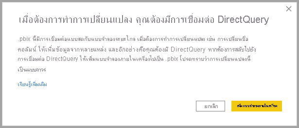
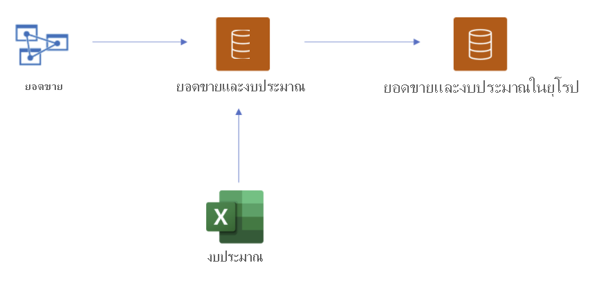
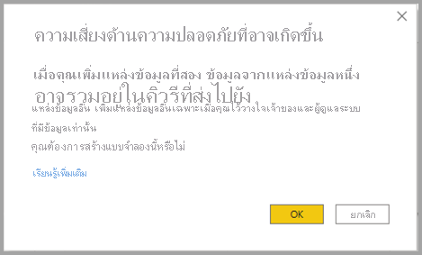
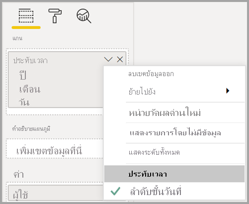

# การใช้ DirectQuery สำหรับชุดข้อมูล Power BI และ Azure Analysis Services (ตัวอย่าง)Using DirectQuery for Power BI datasets and Azure Analysis Services (preview)

ด้วย **DirectQuery สำหรับชุดข้อมูล Power BI และบริการวิเคราะห์ Azure (AAS)** คุณสามารถใช้ DirectQuery ในการเชื่อมต่อกับชุดข้อมูล AAS หรือ Power BI และถ้าคุณต้องการรวมเข้าด้วยกันกับ DirectQuery และอื่นๆ ได้With **DirectQuery for Power BI datasets and Azure Analysis Services (AAS)**, you can use DirectQuery to connect to AAS or Power BI datasets and if you want, combine it with other DirectQuery and imported data. ผู้เขียนรายงานที่ต้องการรวมข้อมูลจากแบบจำลองเชิงความหมายขององค์กรกับข้อมูลอื่นที่พวกเขาเป็นเจ้าของเช่นสเปรดชีต Excel หรือต้องการปรับแต่งหรือเพิ่มข้อมูลเมตาจากแบบจำลองความหมายขององค์กร จะพบว่าฟีเจอร์นี้มีประโยชน์อย่างยิ่งReport authors who want to combine the data from their enterprise semantic model with other data they own, such as an Excel spreadsheet, or want to personalize or enrich the metadata from their enterprise semantic model, will find this feature especially useful.

## เปิดใช้งานคุณลักษณะตัวอย่างEnable the preview feature

เนื่องจากฟังก์ชันนี้อยู่ในการแสดงตัวอย่าง คุณต้องเปิดใช้งานก่อนSince the functionality is currently in preview, you must first enable it. ในการดำเนินการดังกล่าวใน Power BI Desktop ให้ไปที่ **ไฟล์ > ตัวเลือกและการตั้งค่า > ตัวเลือก** และในส่วน **ฟีเจอร์การแสดงตัวอย่าง** ให้เลือกช่องทำเครื่องหมาย **DirectQuery สำหรับชุดข้อมูลและบริการวิเคราะห์ของ Power BI** เพื่อเปิดใช้งานฟีเจอร์การแสดงตัวอย่างนี้To do so, in Power BI Desktop go to **File > Options and settings > Options**, and in the **Preview features** section, select the **DirectQuery for Power BI datasets and Analysis Services** checkbox to enable this preview feature. คุณอาจจำเป็นต้องรีสตาร์ท Power BI Desktop เพื่อดำเนินการเปลี่ยนแปลงนี้You may need to restart Power BI Desktop for the change to take effect.

## การใช้ DirectQuery สำหรับการเชื่อมต่อสดUsing DirectQuery for live connections

การใช้ DirectQuery สำหรับชุดข้อมูล Power BI และบริการวิเคราะห์ Azure (ตัวอย่าง)Using DirectQuery for Power BI datasets and Azure Analysis Services requires  your report to have a local model. คุณสามารถเริ่มต้นจากการเชื่อมต่อสดและเพิ่มหรืออัปเกรดเป็นแบบจำลองภายในเครื่อง หรือเริ่มต้นด้วยการเชื่อมต่อ DirectQuery หรือข้อมูลที่นำเข้าซึ่งจะสร้างแบบจำลองภายในเครื่องในรายงานของคุณโดยอัตโนมัติYou can start from a live connection and add or upgrade to a local model, or start with a DirectQuery connection or imported data, which  automatically creates a local model in your report.

หากต้องการดูว่ามีการใช้การเชื่อมต่อใดในแบบจำลองของคุณ ให้ตรวจสอบแถบสถานะที่มุมล่างขวาของ Power BI DesktopTo see which connections are being used in your model, check the status bar in the bottom right corner of Power BI Desktop. ถ้าคุณเชื่อมต่อกับแหล่งบริการวิเคราะห์ Azure  เท่านั้น คุณจะเห็นข้อความดังภาพต่อไปนี้:If you're only connected to an Azure Analysis Services source, you see a message like the following image:

ถ้าคุณเชื่อมต่อกับชุดข้อมูล Power BI คุณจะเห็นข้อความที่บอกให้คุณทราบว่าชุดข้อมูล Power BI ใดที่คุณกำลังเชื่อมต่อดังนี้:If you're connected to a Power BI dataset, you see a message telling you which Power BI dataset you're connected to:

ถ้าคุณต้องการกำหนดค่าเมตาดาต้าของเขตข้อมูลในชุดข้อมูลที่เชื่อมต่อสด ให้เลือก **ทำการเปลี่ยนแปลงในแบบจำลองนี้** ในแถบสถานะIf you want to customize the metadata of fields in your live connected dataset, select **Make changes to this model** in the status bar. อีกวิธีหนึ่งคือคุณสามารถคลิกที่ปุ่ม **ทำการเปลี่ยนแปลงในแบบจำลองนี้** ใน ribbon ดังที่แสดงในรูปภาพต่อไปนี้Alternatively, you can click the **Make changes to this model** button in the ribbon, as shown in the following image. ใน **มุมมองรายงาน** ปุ่ม **ทำการเปลี่ยนแปลงในแบบจำลองนี้** อยู่ในแท็บ **การสร้างโมเดล** ในมุมมองแบบจำลอง ปุ่มจะอยู่ใน แท็บ **หน้าแรก**In **Report View** the **Make changes to this model** button in the **Modeling** tab. In Model View, the button is in the **Home** tab.

การเลือกปุ่มจะแสดงกล่องโต้ตอบที่ยืนยันการเพิ่มแบบจำลองภายในเครื่องSelecting the button displays a dialog confirming addition of a local model. เลือก **เพิ่มแบบจำลองภายในเครื่อง** เพื่อเปิดใช้งานการสร้างคอลัมน์ใหม่หรือปรับเปลี่ยนเมตาดาต้าสำหรับเขตข้อมูลจากชุดข้อมูล Power BI หรือบริการวิเคราะห์ AzureSelect **Add a local model** to enable creating new columns or modifying the metadata, for fields from Power BI datasets or Azure Analysis Services. รูปภาพต่อไปนี้แสดงกล่องโต้ตอบที่แสดงขึ้นมาThe following image shows the dialog that's displayed. 

เมื่อคุณเชื่อมต่อสดไปยังแหล่งข้อมูลของบริการวิเคราะห์ จะไม่มีแบบจำลองภายในเครื่องWhen you're connected live to an Analysis Services source, there is no local model. หากต้องการใช้ DirectQuery สำหรับแหล่งข้อมูลที่เชื่อมต่อสด เช่น ชุดข้อมูล Power BI และบริการวิเคราะห์ Azure คุณต้องเพิ่มแบบจำลองภายในเครื่องลงในรายงานของคุณTo use DirectQuery for live connected sources, such as Power BI datasets and Azure Analysis Services, you must add a local model to your report. เมื่อคุณเผยแพร่รายงานด้วยแบบจำลองภายในเครื่องไปยังบริการของ Power BI ชุดข้อมูลสำหรับแบบจำลองภายในเครื่องนั้นได้รับการเผยแพร่เป็นอย่างดีWhen you publish a report with a local model to the Power BI service, a dataset for that local model is published a well.

## การเกี่ยวโยงChaining

ชุดข้อมูล และชุดข้อมูลและแบบจำลองที่ยึดตามในรูปแบบ *เกี่ยวโยง*Datasets, and the datasets and models they are based, on form a *chain*. กระบวนการนี้เรียกว่า **การเกี่ยวโยง** ช่วยให้คุณสามารถเผยแพร่รายงานและชุดข้อมูลที่ยึดตาม Power BI อื่นๆ ซึ่งเป็นฟีเจอร์ที่ไม่สามารถใช้งานได้ก่อนหน้านี้This process, called **chaining** lets you publish a report and dataset based on other Power BI datasets, a feature that previously was not possible.

ตัวอย่างเช่น สมมติว่าเพื่อนร่วมงานของคุณเผยแพร่ชุดข้อมูล Power BI ที่เรียกว่า *ยอดขายและงบประมาณ* ที่ยึดตามแบบจำลองบริการวิเคราะห์ Azure ที่เรียกว่า *ยอดขาย* และรวมเข้ากับแผ่นงาน Excel ที่เรียกว่า *งบประมาณ*For example, imagine your colleague publishes a Power BI dataset called *Sales and Budget* that's based on an Azure Analysis Services model called *Sales*, and combines it with an Excel sheet called *Budget*.

เมื่อคุณเผยแพร่รายงานใหม่ (และชุดข้อมูล) ที่เรียกว่า *ยอดขายและงบประมาณของยุโรป* ที่ยึดตามชุดข้อมูล *ยอดขายและงบประมาณ* Power BI ที่เผยแพร่โดยเพื่อนร่วมงานของคุณ การทำการปรับเปลี่ยนหรือส่วนขยายเพิ่มเติม ในขณะที่คุณทำเช่นนั้นคุณจะเพิ่มรายงานและชุดข้อมูลลงในการเกี่ยวโยงของความยาวสามระดับ ซึ่งเริ่มต้นด้วย *ยอดขาย* แบบจำลองบริการวิเคราะห์ Azure และสิ้นสุดด้วยชุดข้อมูล Power BI *ยอดขายและงบประมาณของยุโรป* ของคุณWhen you publish a new report (and dataset) called *Sales and Budget Europe* that's based on the *Sales and Budget* Power BI dataset published by your colleague, making some further modifications or extensions as you do so, you're effectively adding a report and dataset to a chain of length three, which started with the *Sales* Azure Analysis Services model, and ends with your *Sales and Budget Europe* Power BI dataset. รูปภาพต่อไปนี้แสดงให้เห็นถึงกระบวนการเกี่ยวโยงนี้The following image visualizes this chaining process.

การเกี่ยวโยงในรูปภาพก่อนหน้านี้มีความยาวสามระดับซึ่งเป็นความยาวสูงสุดในช่วงระยะเวลาการแสดงตัวอย่างนี้The chain in the previous image is of length three, which is the maximum length during this preview period. การขยายเกินความยาวการเกี่ยวโยงสามระดับไม่ได้รับการรองรับและส่งผลให้เกิดข้อผิดพลาดExtending beyond a chain length of three is  not supported and results in errors.

## คำเตือนด้านความปลอดภัยSecurity warning

การใช้ฟีเจอร์ **DirectQuery สำหรับชุดข้อมูล Power BI และบริการวิเคราะห์ Azure (AAS)** จะแสดงให้คุณเห็นกล่องโต้ตอบคำเตือนเกี่ยวกับความปลอดภัยที่แสดงในรูปภาพต่อไปนี้Using the **DirectQuery for Power BI datasets and Azure Analysis Services (AAS)** feature will present you with a security warning dialog, shown in the following image.

อาจมีการส่งข้อมูลจากแหล่งข้อมูลหนึ่งไปยังอีกแหล่ง ซึ่งเป็นคำเตือนการรักษาความปลอดภัยเดียวกันสำหรับการรวม DirectQuery และนำเข้าแหล่งข้อมูลในรูปแบบแบบจำลองข้อมูลData may be pushed from one data source to another, which is the same security warning for combining DirectQuery and import sources in a data model. หากต้องการเรียนรู้เพิ่มเติมเกี่ยวฟีเจอร์การทำงานนี้ โปรดดู[การใช้โมเดลแบบรวมใน Power BI Desktop](../transform-model/desktop-composite-models.md)To learn more about this behavior, please see [using composite models in Power BI Desktop](../transform-model/desktop-composite-models.md).

## ฟีเจอร์และสถานการณ์สมมติสำหรับทดลองFeatures and scenarios to try

รายการต่อไปนี้จะให้คำแนะนำเกี่ยวกับวิธีที่คุณสามารถสำรวจ **DirectQuery สำหรับชุดข้อมูล Power BI และบริการวิเคราะห์ Azure (AAS)** สำหรับตัวคุณเอง:The following list provides suggestions on how you can explore **DirectQuery for Power BI datasets and Azure Analysis Services (AAS)** for yourself:

- การเชื่อมต่อกับข้อมูลจากแหล่งต่างๆ: นำเข้า (เช่นไฟล์), ชุดข้อมูล Power BI, บริการวิเคราะห์ AzureConnecting to data from various sources: Import (such as files), Power BI datasets, Azure Analysis Services
- การสร้างความสัมพันธ์ระหว่างแหล่งข้อมูลที่แตกต่างกันCreating relationships between different data sources
- การเขียนหน่วยวัดที่ใช้เขตข้อมูลจากแหล่งข้อมูลที่แตกต่างกันWriting measures that use fields from different data sources
- การสร้างคอลัมน์ใหม่สำหรับตารางจากชุดข้อมูล Power BI ของบริการวิเคราะห์ AzureCreating new columns for tables from Power BI datasets of Azure Analysis Services
- การเขียนหน่วยวัดที่ใช้เขตข้อมูลจากแหล่งข้อมูลที่แตกต่างกันCreating visuals that use columns from different data sources

## ข้อควรพิจารณาและข้อจำกัดConsiderations and limitations

มีข้อควรพิจารณา **ข้อควรพิจารณา** บางอย่าง ให้ทราบเมื่อใช้ **DirectQuery สำหรับชุดข้อมูล Power BI และบริการวิเคราะห์ Azure  (AAS)** ดังนี้:There are a few **considerations** to keep in mind when using **DirectQuery for Power BI datasets and Azure Analysis Services (AAS)**:

- ถ้าคุณรีเฟรชแหล่งข้อมูลของคุณและมีข้อผิดพลาดกับเขตข้อมูลที่ขัดแย้งกันหรือชื่อตาราง Power BI จะช่วยแก้ไขข้อผิดพลาดให้กับคุณIf you refresh your data sources, and there are errors with conflicting field or table names, Power BI resolves the errors for you.

- หากต้องการสร้างรายงานในบริการของ Power BI ในแบบจำลองรวมที่ยึดตามชุดข้อมูลอื่น ข้อมูลประจำตัวทั้งหมดจะต้องได้รับการตั้งค่าTo build reports in the Power BI service on a composite model that's based on another dataset, all credentials must be set. ในหน้าการตั้งค่าข้อมูลประจำตัวรีเฟรช สำหรับแหล่งบริการวิเคราะห์ Azure ข้อผิดพลาดต่อไปนี้จะปรากฏขึ้นแม้ว่าข้อมูลประจำตัวได้รับการตั้งค่าแล้ว:On the refresh credential settings page, for Azure Analysis Services sources, the following error will appear, even though the credentials have been set:
    
    
- เนื่องจากนี่คือความสับสนและไม่ถูกต้อง นี่คือสิ่งที่เราจะดูแลแก้ไขในเร็วๆ นี้As this is confusing and incorrect, this is something we will take care of soon.

- กฎ RLS จะถูกนำไปใช้กับแหล่งข้อมูลซึ่งมีการกำหนดไว้แต่จะไม่ถูกนำไปใช้กับชุดข้อมูลอื่นๆ ในแบบจำลองRLS rules will be applied on the source on which they are defined, but will not be applied to any other datasets in the model. RLS ที่กำหนดในรายงานจะไม่ถูกนำไปใช้กับแหล่งข้อมูลระยะไกลและ RLS ที่ตั้งค่าไว้ในแหล่งข้อมูลระยะไกลจะไม่ถูกนำไปใช้กับแหล่งข้อมูลอื่นๆRLS defined in the report will not be applied to remote sources, and RLS set on remote sources will not be applied to other data sources.

- แสดงโฟลเดอร์ Kpi, ตารางวันที่, ระดับแถวการรักษาความปลอดภัย และการแปลจะไม่ถูกนำเข้าจากแหล่งข้อมูลในการเผยแพร่ตัวอย่างนี้Display folders, KPIs, date tables, row level security, and translations will not be imported from the source in this preview release. คุณยังสามารถสร้างโฟลเดอร์การแสดงผลในแบบจำลองภายในเครื่องได้You can still create display folders in the local model.

- คุณอาจเห็นพฤติกรรมการทำงานที่ไม่คาดคิดเมื่อใช้ลำดับชั้นวันที่You may see some unexpected behavior when using a date hierarchy. เมื่อต้องการแก้ไขปัญหานี้ให้ใช้คอลัมน์วันที่แทนTo resolve this issue, use a date column instead. หลังจากเพิ่มลำดับชั้นวันที่ไปยังภาพ คุณสามารถสลับไปยังคอลัมน์วันที่ได้โดยการคลิกที่ลูกศรลงในชื่อเขตข้อมูลและจากนั้นคลิกที่ชื่อเขตข้อมูลนั้นแทนการใช้ *ลำดับชั้นวันที่*:After adding a date hierarchy to a visual, you can switch to a date column by clicking on the down arrow in the field name, and then clicking on the name of that field instead of using *Date Hierarchy*:

    

    โปรดเยี่ยมชมบทความนี้สำหรับข้อมูลเพิ่มเติมเกี่ยวกับการใช้คอลัมน์วันที่เทียบกับลำดับชั้นวันที่For more information on using date columns versus date hierarchies, visit this article.

- คุณอาจเห็นข้อความข้อผิดพลาดที่ไม่เป็นประโยชน์เมื่อใช้ฟีเจอร์ AI ด้วยแบบจำลองที่มีการเชื่อมต่อ DirectQuery ไปยังบริการวิเคราะห์ AzureYou may see unuseful error messages when using AI features with a model that has a DirectQuery connection to Azure Analysis Services. 

- การใช้ ALLSELECTED กับผลลัพธ์แหล่งข้อมูล DirectQuery ในผลลัพธ์ที่ไม่สมบูรณ์Using ALLSELECTED with a DirectQuery source results in incomplete results.

- ตัวกรองและความสัมพันธ์:Filters and relationships:
    - สามารถตั้งค่าตัวกรองที่ใช้จากแหล่งข้อมูลไปยังตารางจากแหล่งข้อมูล DirectQuery อื่นได้เฉพาะในคอลัมน์เดียวเท่านั้นA filter applied from a data source to a table from another DirectQuery source can only be set on a single column

    - การกรองข้ามสองตารางในแหล่งข้อมูล DirectQuery โดยการกรองด้วยตารางภายนอกแหล่งข้อมูลไม่ใช่การออกแบบที่แนะนำ และไม่ได้รับการรองรับCross-filtering two tables in a DirectQuery source by filtering them with a table outside of the source is not a recommended design, and is not supported.

    - ตัวกรองสามารถแตะตารางได้เพียงครั้งเดียวเท่านั้นA filter can only touch a table once. การใช้ตัวกรองเดียวกันกับตารางสองครั้ง ผ่านหนึ่งในตารางเพิ่มเติมภายนอกของแหล่งข้อมูล DirectQuery ไม่ได้รับการสรองรับApplying the same filter to a table twice, through one of more tables outside of the DirectQuery source, is not supported.

- ในระหว่างการแสดงตัวอย่าง ความยาวสูงสุดของการเกี่ยวโยงแบบจำลองคือสามDuring preview, the maximum length of a chain of models is three. การขยายเกินความยาวการเกี่ยวโยงสามระดับไม่ได้รับการรองรับและส่งผลให้เกิดข้อผิดพลาดExtending beyond the chain length of three is not supported and results in errors. 

- การใช้เครื่องมือของบุคคลที่สามสามารถตั้งค่าสถานะ *กีดกันการเกี่ยวโยง* บนแบบจำลองเพื่อป้องกันไม่ให้มีการสร้างหรือขยายการเกี่ยวโยงได้Using third party tools, a *discourage chaining* flag can be set on a model to prevent a chain from being created or extended. หากต้องการตั้งค่านี้ ให้ค้นหาคุณสมบัติ *DiscourageCompositeModels* บนแบบจำลองTo set it, look for the *DiscourageCompositeModels* property on a model. 

นอกจากนี้ยังมี **ข้อจำกัด** บางอย่างที่คุณจำเป็นต้องทราบดังนี้:There are also a few **limitations** you need to keep in mind:

- พารามิเตอร์สำหรับฐานข้อมูลและชื่อเซิร์ฟเวอร์ถูกปิดใช้งานในขณะนี้Parameters for database and server names are currently disabled. 

- การกำหนด RLS บนตารางจากแหล่งข้อมูลระยะไกลไม่ได้รับการรองรับDefining RLS on tables from a remote source is not supported.

- การใช้บริการวิเคราะห์ Azure ของเซิร์ฟเวอร์ SQL (SSAS) เป็นแหล่งข้อมูล DirectQuery ไม่ได้รับการรองรับในขณะนี้Using SQL Server Analysis Services (SSAS) as a DirectQuery source is not currently supported. 

- การใช้ DirectQuery บนชุดข้อมูลจาก "พื้นที่ทำงานของฉัน" ไม่ได้รับรองรับในขณะนี้Using DirectQuery on datasets from “My workspace” is not currently supported. 

- การลบการเชื่อมต่อไปยังแหล่งข้อมูลระยะไกลที่ใช้ DirectQuery ไม่ได้รับการรองรับในขณะนี้Deleting connections to remote sources that use DirectQuery is not currently supported.

- การใช้ Power BI แบบฝังตัวกับชุดข้อมูลที่มีการเชื่อมต่อ DirectQuery ไปยังชุดข้อมูล Power BI หรือแบบจำลองบริการวิเคราะห์ Azure ไม่ได้รับการรองรับในขณะนี้Using Power BI Embedded with datasets that include a DirectQuery connection to a Power BI datasets or Azure Analysis Services model is not currently supported.

- สตริงรูปแบบบนคอลัมน์และหน่วยวัดจากแหล่งข้อมูลระยะไกลจะไม่ถูกนำเข้าไปยังแบบจำลองแบบรวมFormat strings on columns and measures from a remote source are not imported to the composite model.

- กลุ่มการคำนวณบนแหล่งข้อมูลระยะไกลที่มีผลลัพธ์คิวรีที่ไม่ได้กำหนดไว้ไม่ได้รับการรองรับCalculation groups on remote sources are not supported, with undefined query results.

- บางคิวรีอาจส่งกลับผลลัพธ์ที่ไม่ถูกต้องเมื่อมีความสัมพันธ์ระหว่างตารางและตารางที่มีการคำนวณในแหล่งข้อมูลระยะไกลSome queries may return wrong results when there's a relationship between calculated tables and table(s) in a remote source. การสร้างตารางที่มีการคำนวณบนชุดข้อมูลระยะไกลไม่ได้รับการรองรับแม้ว่าจะไม่มีการบล็อกในอินเทอร์เฟซอยู่ในขณะนี้Creating calculated tables over a remote dataset isn't supported, although it isn't currently blocked in the interface.

- ไม่รองรับการเรียงลำดับตามคอลัมน์ในขณะนี้Sort by column isn't supported at this time.

- การรีเฟรชหน้าอัตโนมัติ (APR) ได้รับการรองรับเฉพาะสำหรับบางสถานการณ์โดยขึ้นอยู่กับชนิดแหล่งข้อมูลเท่านั้นAutomatic page refresh (APR) is only supported for some scenarios, depending on the data source type. ดูบทความ[การรีเฟรชหน้าอัตโนมัติใน Power BI](../create-reports/desktop-automatic-page-refresh.md) สำหรับข้อมูลเพิ่มเติมSee the article [Automatic page refresh in Power BI](../create-reports/desktop-automatic-page-refresh.md) for more information.

## ขั้นตอนถัดไปNext steps

สำหรับข้อมูลเพิ่มเติมเกี่ยวกับ DirectQuery โปรดดูที่ทรัพยากรดังต่อไปนี้:For more information about DirectQuery, check out the following resources:

- [ใช้ DirectQuery ใน Power BI DesktopUse DirectQuery in Power BI Desktop](desktop-use-directquery.md)
- [แบบจำลอง DirectQuery ใน Power BI DesktopDirectQuery models in Power BI Desktop](desktop-directquery-about.md)
- [คำแนะนำแบบจำลอง DirectQuery ใน Power BI DesktopDirectQuery model guidance in Power BI Desktop](../guidance/directquery-model-guidance.md)
- มีคำถามหรือไม่Questions? [ลองถามชุมชน Power BITry asking the Power BI Community](https://community.powerbi.com/)
