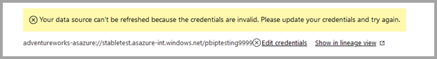

# การใช้ DirectQuery สำหรับชุดข้อมูล Power BI และ Azure Analysis Services (ตัวอย่าง)

ด้วย **DirectQuery สำหรับชุดข้อมูล Power BI และบริการวิเคราะห์ Azure (AAS)** คุณสามารถใช้ DirectQuery ในการเชื่อมต่อกับชุดข้อมูล AAS หรือ Power BI และถ้าคุณต้องการรวมเข้าด้วยกันกับ DirectQuery และอื่นๆ ได้ ผู้เขียนรายงานที่ต้องการรวมข้อมูลจากแบบจำลองเชิงความหมายขององค์กรกับข้อมูลอื่นที่พวกเขาเป็นเจ้าของเช่นสเปรดชีต Excel หรือต้องการปรับแต่งหรือเพิ่มข้อมูลเมตาจากแบบจำลองความหมายขององค์กร จะพบว่าฟีเจอร์นี้มีประโยชน์อย่างยิ่ง

## เปิดใช้งานคุณลักษณะตัวอย่าง

เนื่องจากฟังก์ชันนี้อยู่ในการแสดงตัวอย่าง คุณต้องเปิดใช้งานก่อน ในการดำเนินการดังกล่าวใน Power BI Desktop ให้ไปที่ **ไฟล์ > ตัวเลือกและการตั้งค่า > ตัวเลือก** และในส่วน **ฟีเจอร์การแสดงตัวอย่าง** ให้เลือกช่องทำเครื่องหมาย **DirectQuery สำหรับชุดข้อมูลและบริการวิเคราะห์ของ Power BI** เพื่อเปิดใช้งานฟีเจอร์การแสดงตัวอย่างนี้ คุณอาจจำเป็นต้องรีสตาร์ท Power BI Desktop เพื่อดำเนินการเปลี่ยนแปลงนี้

## การใช้ DirectQuery สำหรับการเชื่อมต่อสด

การใช้ DirectQuery สำหรับชุดข้อมูล Power BI และบริการวิเคราะห์ Azure (ตัวอย่าง) คุณสามารถเริ่มต้นจากการเชื่อมต่อสดและเพิ่มหรืออัปเกรดเป็นแบบจำลองภายในเครื่อง หรือเริ่มต้นด้วยการเชื่อมต่อ DirectQuery หรือข้อมูลที่นำเข้าซึ่งจะสร้างแบบจำลองภายในเครื่องในรายงานของคุณโดยอัตโนมัติ

หากต้องการดูว่ามีการใช้การเชื่อมต่อใดในแบบจำลองของคุณ ให้ตรวจสอบแถบสถานะที่มุมล่างขวาของ Power BI Desktop ถ้าคุณเชื่อมต่อกับแหล่งบริการวิเคราะห์ Azure  เท่านั้น คุณจะเห็นข้อความดังภาพต่อไปนี้:

ถ้าคุณเชื่อมต่อกับชุดข้อมูล Power BI คุณจะเห็นข้อความที่บอกให้คุณทราบว่าชุดข้อมูล Power BI ใดที่คุณกำลังเชื่อมต่อดังนี้:

ถ้าคุณต้องการกำหนดค่าเมตาดาต้าของเขตข้อมูลในชุดข้อมูลที่เชื่อมต่อสด ให้เลือก **ทำการเปลี่ยนแปลงในแบบจำลองนี้** ในแถบสถานะ อีกวิธีหนึ่งคือคุณสามารถคลิกที่ปุ่ม **ทำการเปลี่ยนแปลงในแบบจำลองนี้** ใน ribbon ดังที่แสดงในรูปภาพต่อไปนี้ ใน **มุมมองรายงาน** ปุ่ม **ทำการเปลี่ยนแปลงในแบบจำลองนี้** อยู่ในแท็บ **การสร้างโมเดล** ในมุมมองแบบจำลอง ปุ่มจะอยู่ใน แท็บ **หน้าแรก**

การเลือกปุ่มจะแสดงกล่องโต้ตอบที่ยืนยันการเพิ่มแบบจำลองภายในเครื่อง เลือก **เพิ่มแบบจำลองภายในเครื่อง** เพื่อเปิดใช้งานการสร้างคอลัมน์ใหม่หรือปรับเปลี่ยนเมตาดาต้าสำหรับเขตข้อมูลจากชุดข้อมูล Power BI หรือบริการวิเคราะห์ Azure รูปภาพต่อไปนี้แสดงกล่องโต้ตอบที่แสดงขึ้นมา 

เมื่อคุณเชื่อมต่อสดไปยังแหล่งข้อมูลของบริการวิเคราะห์ จะไม่มีแบบจำลองภายในเครื่อง หากต้องการใช้ DirectQuery สำหรับแหล่งข้อมูลที่เชื่อมต่อสด เช่น ชุดข้อมูล Power BI และบริการวิเคราะห์ Azure คุณต้องเพิ่มแบบจำลองภายในเครื่องลงในรายงานของคุณ เมื่อคุณเผยแพร่รายงานด้วยแบบจำลองภายในเครื่องไปยังบริการของ Power BI ชุดข้อมูลสำหรับแบบจำลองภายในเครื่องนั้นได้รับการเผยแพร่เป็นอย่างดี

## การเกี่ยวโยง

ชุดข้อมูล และชุดข้อมูลและแบบจำลองที่ยึดตามในรูปแบบ *เกี่ยวโยง* กระบวนการนี้เรียกว่า **การเกี่ยวโยง** ช่วยให้คุณสามารถเผยแพร่รายงานและชุดข้อมูลที่ยึดตาม Power BI อื่นๆ ซึ่งเป็นฟีเจอร์ที่ไม่สามารถใช้งานได้ก่อนหน้านี้

ตัวอย่างเช่น สมมติว่าเพื่อนร่วมงานของคุณเผยแพร่ชุดข้อมูล Power BI ที่เรียกว่า *ยอดขายและงบประมาณ* ที่ยึดตามแบบจำลองบริการวิเคราะห์ Azure ที่เรียกว่า *ยอดขาย* และรวมเข้ากับแผ่นงาน Excel ที่เรียกว่า *งบประมาณ*

เมื่อคุณเผยแพร่รายงานใหม่ (และชุดข้อมูล) ที่เรียกว่า *ยอดขายและงบประมาณของยุโรป* ที่ยึดตามชุดข้อมูล *ยอดขายและงบประมาณ* Power BI ที่เผยแพร่โดยเพื่อนร่วมงานของคุณ การทำการปรับเปลี่ยนหรือส่วนขยายเพิ่มเติม ในขณะที่คุณทำเช่นนั้นคุณจะเพิ่มรายงานและชุดข้อมูลลงในการเกี่ยวโยงของความยาวสามระดับ ซึ่งเริ่มต้นด้วย *ยอดขาย* แบบจำลองบริการวิเคราะห์ Azure และสิ้นสุดด้วยชุดข้อมูล Power BI *ยอดขายและงบประมาณของยุโรป* ของคุณ รูปภาพต่อไปนี้แสดงให้เห็นถึงกระบวนการเกี่ยวโยงนี้

การเกี่ยวโยงในรูปภาพก่อนหน้านี้มีความยาวสามระดับซึ่งเป็นความยาวสูงสุดในช่วงระยะเวลาการแสดงตัวอย่างนี้ การขยายเกินความยาวการเกี่ยวโยงสามระดับไม่ได้รับการรองรับและส่งผลให้เกิดข้อผิดพลาด

## คำเตือนด้านความปลอดภัย

การใช้ฟีเจอร์ **DirectQuery สำหรับชุดข้อมูล Power BI และบริการวิเคราะห์ Azure (AAS)** จะแสดงให้คุณเห็นกล่องโต้ตอบคำเตือนเกี่ยวกับความปลอดภัยที่แสดงในรูปภาพต่อไปนี้

อาจมีการส่งข้อมูลจากแหล่งข้อมูลหนึ่งไปยังอีกแหล่ง ซึ่งเป็นคำเตือนการรักษาความปลอดภัยเดียวกันสำหรับการรวม DirectQuery และนำเข้าแหล่งข้อมูลในรูปแบบแบบจำลองข้อมูล หากต้องการเรียนรู้เพิ่มเติมเกี่ยวฟีเจอร์การทำงานนี้ โปรดดู[การใช้โมเดลแบบรวมใน Power BI Desktop](../transform-model/desktop-composite-models.md)

## ฟีเจอร์และสถานการณ์สมมติสำหรับทดลอง

รายการต่อไปนี้จะให้คำแนะนำเกี่ยวกับวิธีที่คุณสามารถสำรวจ **DirectQuery สำหรับชุดข้อมูล Power BI และบริการวิเคราะห์ Azure (AAS)** สำหรับตัวคุณเอง:

- การเชื่อมต่อกับข้อมูลจากแหล่งต่างๆ: นำเข้า (เช่นไฟล์), ชุดข้อมูล Power BI, บริการวิเคราะห์ Azure
- การสร้างความสัมพันธ์ระหว่างแหล่งข้อมูลที่แตกต่างกัน
- การเขียนหน่วยวัดที่ใช้เขตข้อมูลจากแหล่งข้อมูลที่แตกต่างกัน
- การสร้างคอลัมน์ใหม่สำหรับตารางจากชุดข้อมูล Power BI ของบริการวิเคราะห์ Azure
- การเขียนหน่วยวัดที่ใช้เขตข้อมูลจากแหล่งข้อมูลที่แตกต่างกัน

## ข้อควรพิจารณาและข้อจำกัด

มีข้อควรพิจารณา **ข้อควรพิจารณา** บางอย่าง ให้ทราบเมื่อใช้ **DirectQuery สำหรับชุดข้อมูล Power BI และบริการวิเคราะห์ Azure  (AAS)** ดังนี้:

- ถ้าคุณรีเฟรชแหล่งข้อมูลของคุณและมีข้อผิดพลาดกับเขตข้อมูลที่ขัดแย้งกันหรือชื่อตาราง Power BI จะช่วยแก้ไขข้อผิดพลาดให้กับคุณ

- หากต้องการสร้างรายงานในบริการของ Power BI ในแบบจำลองรวมที่ยึดตามชุดข้อมูลอื่น ข้อมูลประจำตัวทั้งหมดจะต้องได้รับการตั้งค่า ในหน้าการตั้งค่าข้อมูลประจำตัวรีเฟรช สำหรับแหล่งบริการวิเคราะห์ Azure ข้อผิดพลาดต่อไปนี้จะปรากฏขึ้นแม้ว่าข้อมูลประจำตัวได้รับการตั้งค่าแล้ว:
    
    
- เนื่องจากนี่คือความสับสนและไม่ถูกต้อง นี่คือสิ่งที่เราจะดูแลแก้ไขในเร็วๆ นี้

- กฎ RLS จะถูกนำไปใช้กับแหล่งข้อมูลซึ่งมีการกำหนดไว้แต่จะไม่ถูกนำไปใช้กับชุดข้อมูลอื่นๆ ในแบบจำลอง RLS ที่กำหนดในรายงานจะไม่ถูกนำไปใช้กับแหล่งข้อมูลระยะไกลและ RLS ที่ตั้งค่าไว้ในแหล่งข้อมูลระยะไกลจะไม่ถูกนำไปใช้กับแหล่งข้อมูลอื่นๆ

- แสดงโฟลเดอร์ Kpi, ตารางวันที่, ระดับแถวการรักษาความปลอดภัย และการแปลจะไม่ถูกนำเข้าจากแหล่งข้อมูลในการเผยแพร่ตัวอย่างนี้ คุณยังสามารถสร้างโฟลเดอร์การแสดงผลในแบบจำลองภายในเครื่องได้

- คุณอาจเห็นพฤติกรรมการทำงานที่ไม่คาดคิดเมื่อใช้ลำดับชั้นวันที่ เมื่อต้องการแก้ไขปัญหานี้ให้ใช้คอลัมน์วันที่แทน หลังจากเพิ่มลำดับชั้นวันที่ไปยังภาพ คุณสามารถสลับไปยังคอลัมน์วันที่ได้โดยการคลิกที่ลูกศรลงในชื่อเขตข้อมูลและจากนั้นคลิกที่ชื่อเขตข้อมูลนั้นแทนการใช้ *ลำดับชั้นวันที่*:

    

    โปรดเยี่ยมชมบทความนี้สำหรับข้อมูลเพิ่มเติมเกี่ยวกับการใช้คอลัมน์วันที่เทียบกับลำดับชั้นวันที่

- คุณอาจเห็นข้อความข้อผิดพลาดที่ไม่เป็นประโยชน์เมื่อใช้ฟีเจอร์ AI ด้วยแบบจำลองที่มีการเชื่อมต่อ DirectQuery ไปยังบริการวิเคราะห์ Azure 

- การใช้ ALLSELECTED กับผลลัพธ์แหล่งข้อมูล DirectQuery ในผลลัพธ์ที่ไม่สมบูรณ์

- ตัวกรองและความสัมพันธ์:
    - สามารถตั้งค่าตัวกรองที่ใช้จากแหล่งข้อมูลไปยังตารางจากแหล่งข้อมูล DirectQuery อื่นได้เฉพาะในคอลัมน์เดียวเท่านั้น

    - การกรองข้ามสองตารางในแหล่งข้อมูล DirectQuery โดยการกรองด้วยตารางภายนอกแหล่งข้อมูลไม่ใช่การออกแบบที่แนะนำ และไม่ได้รับการรองรับ

    - ตัวกรองสามารถแตะตารางได้เพียงครั้งเดียวเท่านั้น การใช้ตัวกรองเดียวกันกับตารางสองครั้ง ผ่านหนึ่งในตารางเพิ่มเติมภายนอกของแหล่งข้อมูล DirectQuery ไม่ได้รับการสรองรับ

- ในระหว่างการแสดงตัวอย่าง ความยาวสูงสุดของการเกี่ยวโยงแบบจำลองคือสาม การขยายเกินความยาวการเกี่ยวโยงสามระดับไม่ได้รับการรองรับและส่งผลให้เกิดข้อผิดพลาด 

- การใช้เครื่องมือของบุคคลที่สามสามารถตั้งค่าสถานะ *กีดกันการเกี่ยวโยง* บนแบบจำลองเพื่อป้องกันไม่ให้มีการสร้างหรือขยายการเกี่ยวโยงได้ หากต้องการตั้งค่านี้ ให้ค้นหาคุณสมบัติ *DiscourageCompositeModels* บนแบบจำลอง 

นอกจากนี้ยังมี **ข้อจำกัด** บางอย่างที่คุณจำเป็นต้องทราบดังนี้:

- พารามิเตอร์สำหรับฐานข้อมูลและชื่อเซิร์ฟเวอร์ถูกปิดใช้งานในขณะนี้ 

- การกำหนด RLS บนตารางจากแหล่งข้อมูลระยะไกลไม่ได้รับการรองรับ

- การใช้บริการวิเคราะห์ Azure ของเซิร์ฟเวอร์ SQL (SSAS) เป็นแหล่งข้อมูล DirectQuery ไม่ได้รับการรองรับในขณะนี้ 

- การใช้ DirectQuery บนชุดข้อมูลจาก "พื้นที่ทำงานของฉัน" ไม่ได้รับรองรับในขณะนี้ 

- การลบการเชื่อมต่อไปยังแหล่งข้อมูลระยะไกลที่ใช้ DirectQuery ไม่ได้รับการรองรับในขณะนี้

- การใช้ Power BI แบบฝังตัวกับชุดข้อมูลที่มีการเชื่อมต่อ DirectQuery ไปยังชุดข้อมูล Power BI หรือแบบจำลองบริการวิเคราะห์ Azure ไม่ได้รับการรองรับในขณะนี้

- สตริงรูปแบบบนคอลัมน์และหน่วยวัดจากแหล่งข้อมูลระยะไกลจะไม่ถูกนำเข้าไปยังแบบจำลองแบบรวม

- กลุ่มการคำนวณบนแหล่งข้อมูลระยะไกลที่มีผลลัพธ์คิวรีที่ไม่ได้กำหนดไว้ไม่ได้รับการรองรับ

- บางคิวรีอาจส่งกลับผลลัพธ์ที่ไม่ถูกต้องเมื่อมีความสัมพันธ์ระหว่างตารางและตารางที่มีการคำนวณในแหล่งข้อมูลระยะไกล การสร้างตารางที่มีการคำนวณบนชุดข้อมูลระยะไกลไม่ได้รับการรองรับแม้ว่าจะไม่มีการบล็อกในอินเทอร์เฟซอยู่ในขณะนี้

- ไม่รองรับการเรียงลำดับตามคอลัมน์ในขณะนี้

- การรีเฟรชหน้าอัตโนมัติ (APR) ได้รับการรองรับเฉพาะสำหรับบางสถานการณ์โดยขึ้นอยู่กับชนิดแหล่งข้อมูลเท่านั้น ดูบทความ[การรีเฟรชหน้าอัตโนมัติใน Power BI](../create-reports/desktop-automatic-page-refresh.md) สำหรับข้อมูลเพิ่มเติม

## ขั้นตอนถัดไป

สำหรับข้อมูลเพิ่มเติมเกี่ยวกับ DirectQuery โปรดดูที่ทรัพยากรดังต่อไปนี้:

- [ใช้ DirectQuery ใน Power BI Desktop](desktop-use-directquery.md)
- [แบบจำลอง DirectQuery ใน Power BI Desktop](desktop-directquery-about.md)
- [คำแนะนำแบบจำลอง DirectQuery ใน Power BI Desktop](../guidance/directquery-model-guidance.md)
- มีคำถามหรือไม่ [ลองถามชุมชน Power BI](https://community.powerbi.com/)
