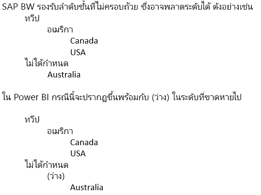

# เชื่อมต่อกับ SAP Business Warehouse โดยใช้ DirectQuery ใน Power BIConnect to SAP Business Warehouse by using DirectQuery in Power BI
คุณสามารถเชื่อมต่อกับแหล่งข้อมูล **SAP Business Warehouse (BW)** ได้โดยตรงโดยใช้ **DirectQuery**You can connect to **SAP Business Warehouse (BW)** data sources directly using **DirectQuery**. เนื่องจากลักษณะแบบ OLAP/หลายมิติของ SAP BW ซึ่งมีความแตกต่างกันมากกว่าระหว่าง DirectQuery กับ SAP BW เมื่อเทียบกับแหล่งข้อมูลเชิงสัมพันธ์เช่น SQL ServerGiven the OLAP/multidimensional nature of SAP BW, there are many important differences between DirectQuery over SAP BW versus relational sources like SQL Server. ความแตกต่างเหล่านี้จะสรุปได้ดังนี้These differences are summarized as follows:

* เมืื่อเทียบ **DirectQuery** กับแหล่งข้อมูลเชิงสัมพันธ์ มีชุดของคิวรี่ (ตามที่กำหนดไว้ในการ **รับข้อมูล** หรือกล่องโต้ตอบ **ตัวแก้ไขคิวรี**) ที่กำหนดข้อมูลที่ใช้งานในรายการเขตข้อมูลIn **DirectQuery** over relational sources there are a set of queries (as defined in the **Get Data** or **Query Editor** dialog) that logically define the data that is available in the field list. นี่ *ไมใช่่* กรณีเมื่อเชื่อมต่อกับแหล่งข้อมูล OLAP เช่น SAP BWThis is *not* the case when connecting to an OLAP source such as SAP BW. แทนที่จะทำอย่างนั้น เมื่อเชื่อมต่อกับ SAP server โดยใช้ **รับข้อมูล** เพียงแค่ Infocube หรือคิวรี่ BEx ถูกเลือกไว้Instead, when connecting to the SAP server using **Get Data**, just the Infocube or BEx Query is selected. จากนั้น ตัวเลขคีย์และขนาดของคิวรี่ Infocube/BEx ที่เลือกทั้งหมดจะไม่มีอยู่ในรายการเขตข้อมูลThen all the Key Figures and dimensions of the selected Infocube/BEx Query will be available in the field list.   
* ในทำนองเดียวกัน ไม่มี **ตัวแก้ไขคิวรี** เมื่อเชื่อมต่อกับ SAP BWSimilarly, there is no **Query Editor** when connecting to SAP BW. สามารถเปลี่ยนการตั้งค่าแหล่งข้อมูล (ตัวอย่างเช่น ชื่อเซิร์ฟเวอร์) โดยการเลือก **แก้ไขแบบสอบถาม > ตั้งค่าแหล่งข้อมูล** ได้The data source settings (for example, server name) can be changed by selecting **Edit Queries > Data source settings**. สามารถเปลี่ยนการตั้งค่าสำหรับพารามิเตอร์ใด ๆ โดยการเลือก **แก้ไขคิวรี่ > จัดการพารามิเตอร์** ได้The settings for any Parameters can be changed by selecting **Edit Queries > Manage Parameters**.
* ด้วยลักษณะเฉพาะของแหล่งข้อมูล OLAP มีข้อจำกัดเพิ่มเติม (สำหรับทั้งการสร้างโมเดลและแสดงภาพ) ที่นำไปใช้ นอกเหนือจากข้อจำกัดปกติที่กำหนดสำหรับ DirectQueryGiven the unique nature of OLAP sources, there are additional restrictions (for both modeling and visualizations) that apply, in addition to the normal restrictions imposed for DirectQuery. ข้อจำกัดเหล่านี้จะอธิบายไว้ในบทความนี้ในภายหลังThese restrictions are described later in this article.

นอกจากนี้ จึงเป็น *สิ่งสำคัญ* ที่จะทำความเข้าใจว่า มีฟีเจอร์มากมายของ SAP BW ที่ Power BI ไม่รับรอง และเนื่องจากลักษณะของอินเทอร์เฟซสาธารณะกับ SAP BW มีกรณีสำคัญซึ่งผลลัพธ์ถูกมองเห็นผ่าน Power BI จะไม่ตรงกับการมองเห็นเมื่อใช้เครื่องมือ SAPIn addition, it is *extremely important* to understand that there are many features of SAP BW that are not supported in Power BI, and that because of the nature of the public interface to SAP BW, there are important cases where the results seen through Power BI will not match those seen when using an SAP tool. ข้อจำกัดเหล่านี้จะอธิบายไว้ในบทความนี้ในภายหลังThese limitations are described later in this article. ข้อจำกัดและลักษณะการทำงานที่แตกต่างเหล่านี้ควรจะตรวจทานแบบระมัดระวัง เพื่อให้แน่ใจว่า ผลลัพธ์นั้นมองเห็นผ่านทาง Power BI ตามที่ส่งกลับผ่านอินเทอร์เฟซสาธารณะของ SAP ถูกแปลความอย่างถูกต้องThese limitations and behavior differences should be carefully reviewed, to ensure that the results seen through Power BI, as returned by the SAP public interface, are interpreted correctly.  

> [!NOTE]
> ความสามารถในการใช้ DirectQuery แทน SAP BW ได้ถูกแสดงตัวอย่างจนถึงเดือนมีนาคม 2018 เพื่ออัปเดต Power BI DesktopThe ability to use DirectQuery over SAP BW was in preview until the March 2018 update to Power BI Desktop. ในระหว่างการแสดงตัวอย่าง คำติชมและการปรับปรุงที่ถูกแนะนำได้แสดงการเปลี่ยนแปลงที่มีผลกับรายงาน ที่ถูกสร้างขึ้นโดยใช้การแสดงตัวอย่างเวอร์ชันDuring the preview, feedback and suggested improvements prompted a change that impacts reports that were created using that preview version. ขณะนี้ความพร้อมใช้โดยทั่วไป (GA) ของ DirectQuery เทียบกับ SAP BW ได้ออกมา คุณ *ต้อง* ทิ้งรายงาน(ตามตัวอย่าง)ใดๆ ซึ่งใช้ DirectQuery เทียบกับ SAP BW ที่ถูกสร้างด้วยเวอร์ชัน pre-GANow that General Availability (GA) of DirectQuery over SAP BW has released, you *must* discard any existing (preview-based) reports using DirectQuery over SAP BW that were created with the pre-GA version. ในรายงานที่ถูกสร้างขึ้น ด้วย DirectQuery pre-GA แทน SAP BW ข้อผิดพลาดจะเกิดขึ้นกับรายงาน pre-GA เมื่อเรียกใช้การรีเฟรช เนื่องจากการพยายามรีเฟรชเมตาดาต้าที มีการเปลี่ยนแปลงใด ๆ ไปยังต้นแบบ SAP BW cubeIn reports created with the pre-GA version of DirectQuery over SAP BW, errors will occur with those pre-GA reports upon invoking Refresh, as a result of attempting to refresh the metadata with any changes to the underlying SAP BW cube. โปรดสร้างรายงานเหล่านั้นจากรายงานว่างเปล่า โดยใช้ DirectQuery เวอร์ชัน GA แทน SAP BWPlease re-create those reports from a blank report, using the GA version of DirectQuery over SAP BW. 

## ข้อจำกัดเกี่ยวกับแบบจำลองเพิ่มเติมAdditional Modeling Restrictions
ข้อจำกัดหลักเกี่ยวกับแบบจำลองเพิ่มเติมเมื่อเชื่อมต่อกับ SAP BW โดยใช้ DirectQuery ใน Power BI มีดังนี้The primary additional modeling restrictions when connecting to SAP BW using DirectQuery in Power BI are the following:

* **ไม่รองรับคอลัมน์จากการคำนวณ:** ความสามารถในการสร้างคอลัมน์จากการคำนวณถูกปิดใช้งาน**No support for calculated columns:** The ability to create calculated columns is disabled. นอกจากนี้ ก็ยังหมายความอีกด้วยว่า การจัดกลุ่มและการจัดคลัสเตอร์ซึ่งสร้างคอลัมน์จากการคำนวณยังไม่พร้อมใช้งานThis also means that Grouping and Clustering, which create calculated columns, are not available.
* **ข้อจำกัดเพิ่มเติมสำหรับหน่วยวัด:** มีข้อจำกัดเพิ่มเติมที่กำหนดบนนิพจน์ DAX ซึ่งสามารถใช้ในหน่วยวัดเพื่อแสดงระดับการสนับสนุนที่เสนอโดย SAP BW**Additional limitations for measures:** There are additional limitations imposed on the DAX expressions that can be used in measures, to reflect the level of support offered by SAP BW.
* **ไม่รองรับการกำหนดความสัมพันธ์:** ความสัมพันธ์จะสิลทอดในแหล่งข้อมูล SAP ภายนอก และไม่สามารถกำหนดความสัมพันธ์เพิ่มเติมในแบบจำลอง**No support for defining relationships:** The relationships are inherent in the external SAP source, and additional relationships cannot be defined in the model.
* **ไม่มีมุมมองข้อมูล:** **มุมมองข้อมูล** ที่แสดงข้อมูลระดับรายละเอียดในตารางได้ตามปกติ**No Data View:** The **Data View** normally displays the detail level data in the tables. ด้วยลักษณะของแหล่งข้อมูล OLAP เช่น SAP BW มุมมองนี้ไมสามารถใช้งานผ่าน SAP BWGiven the nature of OLAP sources like SAP BW, this view is not available over SAP BW.
* **มีการแก้ไขรายละเอียดคอลัมน์และหน่วยวัด:** มีการแก้ไขรายการของคอลัมน์และหน่วยวัดที่เห็นในรายการเขตข้อมูลโดยแหล่งข้อมูลพื้นฐานและไม่สามารถปรับเปลี่ยนได้**Column and measure details are fixed:** The list of columns and measures seen in the field list are fixed by the underlying source, and cannot be modified. ตัวอย่างเช่น จะไม่สามารถลบคอลัมน์หรือเปลี่ยนแปลง datatype (อย่างไรก็ตาม สามารถเปลี่ยนชื่อได้)For example, it is not possible to delete a column, nor change its datatype (it can, however, be renamed).
* **ข้อจำกัดเพิ่มเติมใน DAX:** มีข้อจำกัดเพิ่มเติมเกี่ยวกับ DAX ที่สามารถใช้ในการกำหนดหน่วยวัดเพื่อสะท้อนถึงขีดจำกัดในแหล่งข้อมูล**Additional limitations in DAX:** There are additional limitations on the DAX that can be used in measure definitions, to reflect limitations in the source. ตัวอย่างเช่น ไม่สามารถใช้ฟังก์ชันรวมกับตารางได้For example, it is not possible to use an aggregate function over a table.

## ข้อจำกัดในการการจัดรูปแบบการแสดงข้อมูลเพิ่มเติมAdditional Visualization Restrictions
ข้อจำกัดเพิ่มเติมหลักในการแสดงภาพเมื่อเชื่อมต่อกับ SAP BW ที่ใช้ DirectQuery ใน Power BI มีดังนี้The primary additional restrictions in visualizations when connecting to SAP BW using DirectQuery in Power BI are the following:

* **ไม่มีการรวมคอลัมน์:** ไม่สามารถเปลี่ยนแปลงการรวมสำหรับคอลัมนในการแสดงผลด้วยภาพ และ *อย่ารวม* ตลอด**No aggregation of columns:** It is not possible to change the aggregation for a column on a visual; it is always *Do Not Summarize*
* **หน่วยวัดการกรองถูกปิดใช้งาน:** หน่วยวัดการกรองถูกปิดเพื่อแสดงถึงการสนับสนุนที่เสนอโดย SAP BW**Measure filtering is disabled:** Measure filtering is disabled to reflect the support offered by SAP BW.
* **เลือกหลายค่าและรวม/แยก:** ความสามารถในการเลือกจุดข้อมูลได้หลายจุดบนภาพถูกปิด ถ้าจุดจะแสดงค่าจากคอลัมน์มากกว่าหนึ่งคอลัมน์**Multi-select and include/exclude:** The ability to multi-select data points on a visual is disabled if the points represent values from more than one column. ตัวอย่างเช่น กำหนดแผนภูมิแท่งที่แสดงยอดขายตามประเทศ โดยมีประเภทในคำอธิบายแผนภูมิ มันควรเป็นไปไม่ได้เมื่อเลือกจุด (สหรัฐอเมริกา จักรยาน) และ (ฝรั่งเศส เสื้อผ้า)For example, given a bar chart showing Sales by Country, with Category on the Legend, it would not be possible to select the point for (USA, Bikes) and (France, Clothes). ในทำนองเดียวกัน จะไม่สามารถเลือกจุดสำหรับ (สหรัฐอเมริกา จักรยาน) และแยกออกจากภาพSimilarly, it would not be possible to select the point for (USA, Bikes) and exclude it from the visual. ข้อจำกัดทั้งสองจะถูกกำหนดเพื่อแสดงถึงการรองรับโดย SAP BWBoth limitations are imposed to reflect the support offered by SAP BW.

## รองรับฟีเจอร์ SAP BWSupport for SAP BW features
ตารางต่อไปนี้แสดงรายการฟีเจอร์ SAP BW ของคุณซึ่ง่ไมรองรับทั้งหมด หรือจะทำงานต่างกันเมื่อใช้ Power BIThe following table lists all SAP BW features that are not fully supported, or will behave differently when using Power BI.   

| ฟีเจอร์Feature | คำอธิบายDescription |
| --- | --- |
| คำนวณภายในเครื่องLocal calculations |คำนวณในเครื่องที่กำหนดในคิวรี่ BEx จะเปลี่ยนแปลงตัวเลขตามที่แสดงผ่านเครื่องมือเช่นตัววิเคราะห์ BExLocal calculations defined in a BEx Query will change the numbers as displayed through tools like BEx Analyzer. อย่างไรก็ตาม จะไม่มีผลในตัวเลขที่ส่งกลับจาก SAP ผ่านอินเทอร์เฟซสาธารณะ MDXHowever, they are not reflected in the numbers returned from SAP, through the public MDX interface.     **ลักษณะดังกล่าว หมายเลขที่เห็นได้ในรูปภาพ Power BI จะไม่จำเป็นต้องตรงกับสำหรับรูปภาพที่สอดคล้องกันในเครื่องมือ SAP****As such, the numbers seen in a Power BI visual will not necessarily match those for a corresponding visual in an SAP tool.**     ตัวอย่างเช่น เมื่อเชื่อมต่อไปยังคิวรี่คิวบ์จากคิวรี่ BEx ที่ตั้งค่าการรวมแบบเพิ่มเรื่อยๆ (เช่น การเรียกผลรวม) Power BI จะได้รับตัวเลขกลับมา โดยไม่คำนึงถึงการตั้งค่านั้นFor example, when connecting to a query cube from a BEx query that sets the aggregation to be Cumulated (i.e. running sum), Power BI would get back the base numbers, ignoring that setting.  ผู้วิเคราะห์สามารถใช้การคำนวณผลรวมที่ทำอยู่ภายในเครื่องใน Power BI แต่จะต้องระมัดระวังในวิธีการแปลความหมายเลขถ้าไม่ทำสิ่งนี้ได้An analyst could certainly then apply a running sum calculation locally in Power BI, but would need to exercise caution in how the numbers are interpreted if this is not done. |
| การรวมAggregations |ในบางกรณี (โดยเฉพาะอย่างยิ่งเมื่อทำงานกับหลายสกุลเงิน) ตัวเลขรวมที่ส่งกลับโดยอินเทอร์เฟซสาธารณะ SAP จะไม่ตรงกับค่าที่แสดงด้วยเครื่องมือ SAPIn some cases (particularly when dealing with multiple currencies), the aggregate numbers returned by the SAP public interface do not match those shown by SAP tools.     **ลักษณะดังกล่าว หมายเลขที่เห็นได้ในรูปภาพ Power BI จะไม่จำเป็นต้องตรงกับสำหรับรูปภาพที่สอดคล้องกันในเครื่องมือ SAP****As such, the numbers seen in a Power BI visual will not necessarily match those for a corresponding visual in an SAP tool.**     ตัวอย่างเช่น ผลรวมสกุลเงินอื่นจะแสดงเป็น "\*" ในตัววิเคราะห์ BEx แต่ผลรวมจะเริ่มส่งกลับ โดยอินเทอร์เฟซสาธารณะ SAP  โดยไม่มีข้อมูลใด ๆ การรวมตัวเลขดังกล่าวนั้นไม่มีความหมายFor example, totals over different currencies would show as  "\*" in BEx Analyzer, but the total would get returned by the SAP public interface, without any information that such an aggregate number is meaningless. ดังนั้น หมายเลข (aggregating, say, $, EUR, และ AUD) จะเริ่มแสดง โดย Power BIThus the number (aggregating, say, $, EUR, and AUD) would get displayed by Power BI. |
| จัดรูปแบบสกุลเงินCurrency formatting |การจัดรูปแบบสกุลเงิน (ตัวอย่างเช่น $2,300 หรือ 4000 AUD) จะไม่มีผลใดๆ ใน Power BIAny currency formatting (for example, $2,300 or 4000 AUD) is not reflected in Power BI. |
| หน่วยวัดUnits of measure |หน่วยวัด (ตัวอย่างเช่น 230 กก.) จะไม่มีผลใน Power BIUnits of measure (for example, 230 KG) are not reflected in Power BI. |
| คีย์เทียบกับข้อความ (short, medium, long)Key versus text (short, medium, long) |สำหรับลักษณะ SAP BW เช่น CostCenter รายการเขตข้อมูลจะแสดงคอลัมน์เดียว Cost CenterFor an SAP BW characteristic like CostCenter, the field list will show a single column Cost Center.  โดยใช้คอลัมน์นั้นจะแสดงข้อความเริ่มต้นUsing that column will display the default text.  โดยการแสดงเขตข้อมูลที่ซ่อน ซึ่งจะยังสามารถเห็นคอลัมนที่ช่ื่อไม่ซ้ำกัน (ซึ่งจะส่งกลับชื่อไม่ซ้ำกันที่กำหนดให้โดยแ SAP BW และเป็นพื้นฐานของการไม่ซ้ำกัน)By showing hidden fields, it will also be possible to see the unique name column (that returns the unique name assigned by SAP BW, and is the basis of uniqueness).     คีย์และเขตข้อมูลข้อความอื่นๆ นั้นไม่พร้อมใช้งานThe key and other text fields are not available. |
| ความหลายลำดับชั้นเป็นลักษณะMultiple hierarchies of a characteristic |ใน **SAP** เป็นลักษณะที่สามารถมีหลายลำดับชั้นได้In **SAP**, a characteristic can have multiple hierarchies. จากนั้น ในเครื่องมือเช่นตัววิเคราะห์ BEx เมื่อเป็นลักษณะนั้นถูกรวมอยู่ในคิวรี่หนึ่ง ผู้ใชจะ้สามารถเลือกลำดับชั้นที่จะใช้ได้Then in tools like BEx Analyzer, when a characteristic is included in a query, the user can select the hierarchy to use.     ใน **Power BI** ลำดับชั้นต่าง ๆ สามารถดูรายการเขตข้อมูลเป็นลำดับชั้นที่แตกต่างกันในมิติเดียวกันได้In **Power BI**, the various hierarchies can be seen in the field list as different hierarchies on the same dimension.  อย่างไรก็ตาม การเลือกหลายระดับจากลำดับชั้นที่แตกต่างกันสองขั้นในมิติเดียวกัน จะส่งผลให้ข้อมูลว่างเปล่า ที่ถูกส่งกลับ โดย SAPHowever, selecting multiple levels from two different hierarchies on the same dimension will result in empty data being returned by SAP. |
| จัดการลำดับชั้นที่ไม่ตรงกันTreatment of ragged hierarchies | |
| พิกัดอัตรา/กลับการลงนามScaling factor/reverse sign |ใน SAP ตัวเลขคีย์สามารถมีสัดส่วนมาตรา(ตัวอย่าง 1000) ซึ่งถูกกำหนดให้เป็นตัวเลือกการจัดรูปแบบ ซึ่งหมายความว่าการแสดงทั้งหมดจะถูกปรับลดลงตามสัดส่วนนั้นIn SAP, a key figure can have a scaling factor (for example, 1000) defined as a formatting option, meaning that all display will be scaled by that factor.     ในทำนองเดียวกันดังกล่าวอาจมีชุดคุณสมบัติที่ย้อนกลับเครื่องหมายIt can similarly have a property set that reverses the sign. ให้ใช้เลขคีย์เหล่านั้น Power BI (ในรูปภาพ หรือเป็นส่วนหนึ่งของการคำนวณ) จะส่งผลให้หมายเลขที่ไม่มีสเกลกำลังถูกใช้ (และสัญลักษณ์ไม่มีการย้อนกลับ)Use of such a key figure in Power BI (in a visual, or as part of a calculation) will result in the unscaled number being used (and the sign is not reversed). ไม่สามารถใช้ปัจจัยการกำหนดขนาดอ้างอิงได้The underlying scaling factor is not available. ในภาพ Power BI คุณสามารถควบคุมหน่วยสเกลที่แสดงบนแกน (K, M, B) ในฐานะส่วนหนึ่งของการจัดรูปแบบรูปภาพIn Power BI visuals, the scale units shown on the axis (K,M,B) can be controlled as part of the visual formatting. |
| ลำดับชั้นที่ระดับปรากฏ/หายไปแบบไดนามิกHierarchies where levels appear/disappear dynamically |เริ่มต้นเมื่อเชื่อมต่อกับ SAP BW ข้อมูลที่เกี่ยวกับระดับของลำดับชั้นถูกเรียกใช้ ซึ่งทำให้ได้ชุดของเขตข้อมูลในรายการเขตข้อมูลInitially when connecting to SAP BW, the information on the levels of a hierarchy will be retrieved, resulting in a set of fields in the field list. นี้สิ่งนี้ถูกแคช และถ้าชุดของระดับนั้นเปลี่ยนแปลง แล้วชุดของเขตข้อมูลจะไม่เปลี่ยนแปลงจนกว่ารีเฟรชจะถูกเรียกใช้This is cached, and if the set of levels changes, then the set of fields do not change until Refresh is invoked.     ใช้ได้ใน **Power BI Desktop** เท่านั้นThis is only possible in **Power BI Desktop**. รีเฟรชดังกล่าวนั้นเพื่อแสดงการเปลี่ยนแปลงไปยังระดับไม่สามารถเรียกใช้ใน Power BI service หลังจากเผยแพร่แล้วSuch Refresh to reflect changes to the levels cannot be invoked in the Power BI service after Publish. |
| ตัวกรองเริ่มต้นDefault filter |คิวรี BEx สามารถใส่ตัวกรองเริ่มต้น ซึ่งตัววิเคราะห์ BEx SAP จะนำไปใช้โดยอัตโนมัติA BEx query can include Default Filters, which will be applied automatically by SAP BEx Analyzer. สิ่งเหล่านี้จะไม่ถูกแสดง และค่าโดยปริยายจะไม่ทำให้การใช้งานที่เทียบเท่าใน Power BI ใช้ตัวกรองเดียวกันนีThese are not exposed, and hence the equivalent usage in Power BI will not apply the same filters by default. |
| ตัวเลขคีย์ที่ซ่อนอยู่Hidden Key figures |คิวรี BEx สามารถควบคุมการมองเห็นตัวเลขคีย์ และตัวเลขคีย์ที่ซ่อนอยู่จะไม่ปรากฏในตัววิเคราะห์ BEx SAPA BEx query can control visibility of Key Figures, and those that are hidden will not appear in SAP BEx Analyzer. ซึ่งจะไม่มีผลทาง API สาธารณะ และดังนั้น ตัวเลขคีย์ที่ซ่อนอยู่จะยังคงปรากฏอยู่ในรายการเขตข้อมูลThis is not reflected through the public API, and hence such hidden key figures will still appear in the field list. อย่างไรก็ตาม สามารถซ่อนตัวเลขคีย์ภายใน Power BIHowever, they can then be hidden within Power BI. |
| การจัดรูปแบบตัวเลขNumeric formatting |การจัดรูปแบบตัวเลข (จำนวนตำแหน่งทศนิยม จุดทศนิยม และอื่นๆ) จะไม่เกิดขึ้น่โดยอัตโนมัติใน Power BIAny numeric formatting (number of decimal positions, decimal point, etc.) will not automatically be reflected in Power BI. อย่างไรก็ตาม คุณจะสามารถควบคุมการจัดรูปแบบดังกล่าวภายใน Power BIHowever, it is possible to then control such formatting within Power BI. |
| การกำหนดรุ่นลำดับชั้นHierarchy versioning |แบนด์วิดท์ SAP BW รักษาเวอร์ชันต่าง ๆ ของลำดับชั้น ตัวอย่างเช่น ลำดับชั้นศูนย์ต้นทุนในปี 2007 เทียบกับปี 2008SAP BW allows different versions of a hierarchy to be maintained, for example, the cost center hierarchy in 2007 versus 2008. เวอร์ชันล่าสุดเท่านั้นจะพร้อมใช้งานใน Power BI เนื่องจาก API แบบสาธารณะไม่แสดงข้อมูลเกี่ยวกับเวอร์ชันต่างๆOnly the latest version will be available in Power BI, as information on versions is not exposed by the public API. |
| ลำดับชั้นที่ขึ้นกับเวลาTime dependent hierarchies |เมื่อใช้ Power BI ลำดับชั้นที่ขึ้นกับเวลาจะถูกประเมิน ณ วันปัจจุบันWhen using Power BI, time dependent hierarchies are evaluated at the current date. |
| การแปลงสกุลเงินCurrency conversion |แบนด์วิดท์ SAP BW สนับสนุนการแปลงสกุลเงินตามอัตราที่ถูกเก็บไว้ในคิวบ์SAP BW supports currency conversion, based on rates held in the cube. แต่ API สาธารณะ ไม่ได้รับความสามารถดังกล่าวและดังนั้นการแปลงสกุลเงินจึงไม่พร้อมใช้งานใน Power BISuch capabilities are not exposed by the public API, and are therefore not available in Power BI. |
| ลำดับการจัดเรียงSort Order |ลำดับการจัดเรียง (ด้วยข้อความ หรือ ด้วยคีย์) สำหรับลักษณะสามารถถูกกำหนดได้ใน SAPThe sort order (by Text, or by Key) for a characteristic can be defined in SAP. ลำดับการจัดเรียงนี้จะไม่มีผลปรากฎใน Power BIThis sort order is not reflected in Power BI. ตัวอย่างเช่น เดือนอาจปรากฏเป็น "เมษายน "ส.ค." และอื่น ๆFor example, months might appear as “April”, “Aug”, and so on.     ไม่สามารถเปลี่ยนลำดับการจัดเรียงนี้ใน Power BIIt is not possible to change this sort order in Power BI. |
| ชื่อทางเทคนิคTechnical names |ใน **รับข้อมูล** คุณจะเห็นทั้งลักษณะ/ชื่อหน่วยวัด (คำอธิบาย) และชื่อทางเทคนิคIn **Get Data**, the characteristic/measure names (descriptions) and technical names can both be seen. รายการเขตข้อมูลจะประกอบด้วยลักษณะ/ชื่อหน่วยวัดชื่อ (คำอธิบาย)เท่านั้นThe field list will contain just the characteristic/measure names (descriptions). |
| แอตทริบิวต์Attributes |ไม่สามารถเข้าถึงแอตทริบิวต์ของลักษณะภายใน Power BIIt is not possible to access the attributes of a characteristic within Power BI. |
| การตั้งค่าภาษาของผู้ใช้ปลายทางEnd user language setting |ตำแหน่งที่ตั้งที่เชื่อมต่อกับ SAP BW ซึ่งถูกตั้งค่าเป็นส่วนหนึ่งของรายละเอียดการเชื่อมต่อ และไม่แสดงตำแหน่งที่ตั้งของผู้บริโภครายงานขั้นสุดท้ายThe locale used to connect to SAP BW is set as part of the connection details, and does not reflect the locale of the final report consumer. |
| ตัวแปรข้อความText Variables |SAP BW ทำให้ชื่อเขตข้อมูลประกอบด้วยพื้นที่สำหรับตัวแปร(ตัวอย่างเช่น "$YEAR$ Actuals") ที่จะถูกแทนที่ด้วยค่าที่เลือกไว้SAP BW allows field names to contain placeholders for variables (for example, "$YEAR$ Actuals") that would then get replaced by the selected value. ตัวอย่างเช่น เขตข้อมูลปรากฏเป็น "รายการจริงปี 2016" ในเครื่องมือ BEx ถ้าปี 2016 ที่ถูกเลือกสำหรับตัวแปรFor example, the field appears as "2016 Actuals" in BEx tools, if the year 2016 were selected for the variable.     คูณจะไม่สามารถเปลี่ยนชื่อคอลัมน์ใน Power BI ทั้งนี้ขึ้นอยู่กับค่าของตัวแปร และดังนั้น ชื่อคอลัมน์จะปรากฏเป็น "$YEAR$ Actuals"The column name in Power BI will not be changed depending on the variable value, and therefore would appear as "$YEAR$ Actuals".  อย่างไรก็ตาม คุณสามารถเปลี่ยนชื่อคอลัมน์ใน Power BIHowever, the column name can then be changed in Power BI. |
| ตัวแปรจบการทำงานของลูกค้าCustomer Exit Variables | API สาธารณะ ไม่ได้รับความสามารถด้านตัวแปรจบการทำงานของลูกค้า และดังนั้นตัวแปรนี้จึงไม่พร้อมใช้งานใน Power BICustomer Exit variables are not exposed by the public API, and are therefore not supported by Power BI. |
| โครงสร้างของคุณลักษณะCharacteristic Structures | โครงสร้างลักษณะใดๆ ในแหล่งข้อมูลแบนด์วิดท์ SAP BW พื้นฐานจะส่งผลให้หน่วยวัดที่แสดงใน Power BI 'กระจาย'Any Characteristic structures in the underlying SAP BW source will result in an ‘explosion’ of measures being exposed in Power BI. ตัวอย่างเช่น มีหน่วยวัดสองตัว คือ ยอดขายและต้นทุน และโครงสร้างลักษณะที่ี่ประกอบด้วยงบประมาณและรายการจริง หน่วยวัด 4 ตัวดังกล่าวจะแสดงเป็น: ยอดขายงบประมาณ ยอดขายรายการจริง ต้นทุนยอดขาย ต้นทุนรายการจริงFor example, with two measures Sales and Costs, and a characteristic structure containing Budget and Actual, four measures will be exposed: Sales.Budget, Sales.Actual, Costs.Budget, Costs.Actual. |

## ขั้นตอนถัดไปNext steps
สำหรับข้อมูลเพิ่มเติมเกี่ยวกับ DirectQuery โปรดดูที่ทรัพยากรดังต่อไปนี้:For more information about DirectQuery, check out the following resources:

* [DirectQuery ใน Power BIDirectQuery in Power BI](desktop-directquery-about.md)
* [แหล่งข้อมูลที่สนับสนุนโดย DirectQueryData Sources supported by DirectQuery](power-bi-data-sources.md)
* [DirectQuery และ SAP HANADirectQuery and SAP HANA](desktop-directquery-sap-hana.md)
