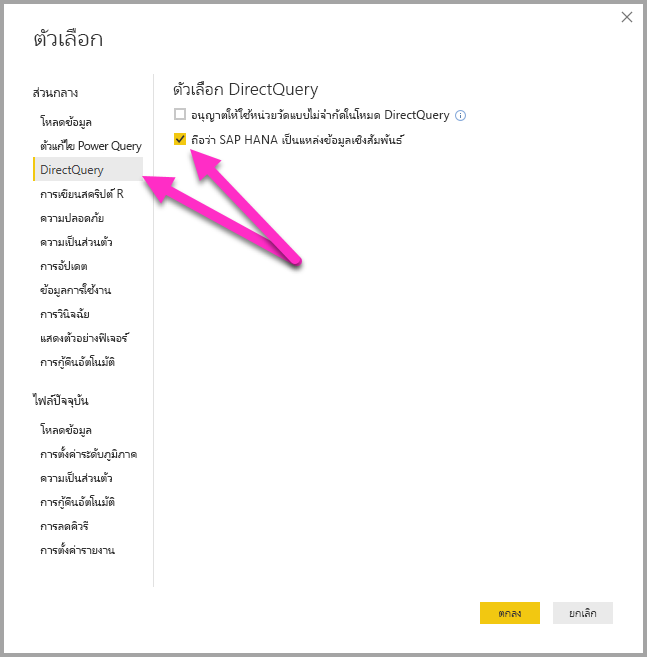
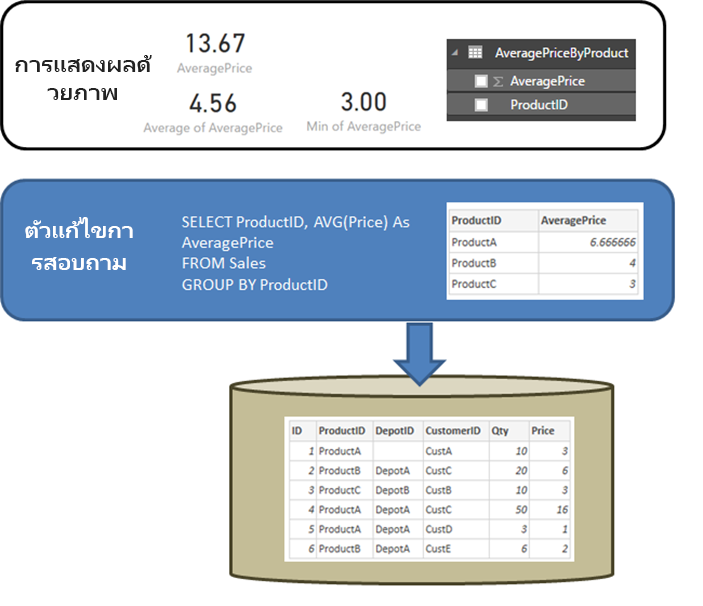

# เชื่อมต่อกับแหล่งข้อมูล SAP HANA ได้โดยตรงโดยใช้ DirectQuery ใน Power BIConnect to SAP HANA data sources by using DirectQuery in Power BI
คุณสามารถเชื่อมต่อกับแหล่งข้อมูล **SAP HANA** ได้โดยตรงโดยใช้ **DirectQuery**‎You can connect to **SAP HANA** data sources directly using **DirectQuery**. มีตัวเลือกสองตัวเลือกในการเชื่อมต่อกับ SAP HANA:There are two options when connecting to SAP HANA:

* **ถือว่า SAP HANA เป็นแหล่งข้อมูลหลายมิติ (ค่าเริ่มต้น):**  ในกรณีนี้ ลักษณะการทำงานจะคล้ายกับกรณีที่ Power BI ่เชื่อมต่อกับแหล่งข้อมูลหลายมิติอื่นๆ เช่น SAP Business Warehouse หรือ Analysis Services**Treat SAP HANA as a multi-dimensional source (default):**  In this case, the behavior will be similar to when Power BI connects to other multi-dimensional sources like SAP Business Warehouse, or Analysis Services. เมื่อเชื่อมต่อกับ SAP HANA ที่ใช้การตั้งค่านี้ มุมมองการวิเคราะห์หรือการคำนวณเดียวจะถูกเลือก และหน่วยวัด ลำดับชั้นและแอตทริบิวต์ทั้งหมดของมุมมองนั้นจะพร้อมใช้งานในรายการเขตข้อมูลWhen connecting to SAP HANA using this setting, a single analytic or calculation view is selected and all the measures, hierarchies and attributes of that view will be available in the field list. เมื่อสร้างการแสดงผลด้วยภาพแล้ว ข้อมูลรวมจะถูกเรียกใช้จาก SAP HANA เสมอAs visuals are created, the aggregate data will always be retrieved from SAP HANA. วิธีนี้เป็นวิธีที่แนะนำ และเป็นค่าเริ่มต้นสำหรับรายงาน DirectQuery ใหม่ผ่าน SAP HANAThis is the recommended approach, and is the default for new DirectQuery reports over SAP HANA.

* **ถือว่า SAP HANA เป็นแหล่งข้อมูลเชิงสัมพันธ์:** ในกรณีนี้ Power BI จะถือว่า SAP HANA เป็นแหล่งข้อมูลเชิงสัมพันธ์**Treat SAP HANA as a relational source:** In this case, Power BI treats SAP HANA as a relational source. ซึ่งทำให้มีความยืดหยุ่นมากขึ้นThis offers greater flexibility. แต่ต้องใช้ความระมัดระวังเพื่อให้แน่ใจว่ามีการรวมหน่วยวัดตามที่คาดไว้ และเพื่อเป็นการหลีกเลี่ยงปัญหาด้านประสิทธิภาพการทำงานCare must be taken with this approach to ensure that measures are aggregated as expected, and to avoid performance issues.

วิธีที่ใช้เพื่อเชื่อมต่อจะถูกกำหนดโดยตัวเลือกเครื่องมือส่วนกลางซึ่งตั้งค่าโดยการเลือก **ไฟล์ > ตัวเลือกและการตั้งค่า** แล้วเลือก **ตัวเลือก > DirectQuery** จากนั้นเลือกตัวเลือก  **ถือว่า SAP HANA เป็นแหล่งข้อมูลเชิงสัมพันธ์** ดังที่แสดงในภาพดังต่อไปนี้The connection approach is determined by a global tool option, which is set by selecting **File > Options and settings** and then **Options > DirectQuery**, then selecting the option **Treat SAP HANA as a relational source**, as shown in the following image. 

ตัวเลือกที่ถือว่า SAP HANA เป็นแหล่งข้อมูลเชิงสัมพันธ์จะควบคุมวิธีที่ใช้สำหรับรายงาน *ใหม่* ใดๆ โดยใช้ DirectQuery ผ่าน SAP HANAThe option to treat SAP HANA as a relational source controls the approach used for any *new* report using DirectQuery over SAP HANA. ซึ่งไม่มีผลต่อการเชื่อมต่อ SAP HANA ใด ๆ ที่มีอยู่ในรายงานปัจจุบัน และไม่มีผลต่อการเชื่อมต่อในรายงานอื่นใดที่เปิดอยู่ด้วยIt has no effect on any existing SAP HANA connections in the current report, nor on connections in any other reports that are opened. ดังนั้น ถ้าในขณะนี้ยังไม่ได้เลือกตัวเลือก เมื่อมีการเพิ่มการเชื่อมต่อใหม่กับ SAP HANA ก็จะใช้ **รับข้อมูล** ซึ่งสามารถสร้างการเชื่อมต่อโดยถือ SAP HANA เป็นแหล่งข้อมูลหลายมิติได้So if the option is currently unchecked, then upon adding a new connection to SAP HANA using **Get Data**, that connection will be made treating SAP HANA as a multi-dimensional source. อย่างไรก็ตามถ้ามีการเปิดรายงานที่แตกต่างกันที่เชื่อมต่อกับ SAP Hana จากนั้นรายงานดังกล่าวจะยังคงทำงานตามตัวเลือกที่ถูกตั้งค่า *ในเวลาที่สร้างขึ้น* ซึ่งหมายความว่ารายงานใดๆ ที่เชื่อมต่อกับ SAP Hana ที่ได้ สร้างก่อนเดือนกุมภาพันธ์ 2018 จะยังคงรักษา SAP Hana เป็นแหล่งข้อมูลเชิงสัมพันธ์However, if a different report is opened that also connects to SAP HANA, then that report will continue to behave according to the option that was set *at the time it was created*, which means that any reports connecting to SAP HANA that were created prior to February 2018 will continue to treat SAP HANA as a relational source. 

ทั้งสองวิธีดังกล่าวประกอบไปด้วยลักษณะการทำงานที่แตกต่างกัน และไม่สามารถสลับรายงานที่มีอยู่จากวิธีการหนึ่งไปเป็นอีกวิธีหนึ่งได้The two approaches constitute different behavior, and it's not possible to switch an existing report from one approach to the other. 

มาดูรายละเอียดเพิ่มเติมเกี่ยวกับสองวิธีเหล่านี้แต่ละวิธีตามลำดับLet's look at more detail about each of these two approaches, in turn.

## ถือว่า SAP HANA เป็นแหล่งข้อมูลหลายมิติ (ค่าเริ่มต้น)Treat SAP HANA as a multi-dimensional source (default)

การเชื่อมต่อกับ SAP HANA ใหม่ทั้งหมดจะใช้วิธีการเชื่อมต่อนี้ตามค่าเริ่มต้นโดยถือ SAP HANA เป็นแหล่งข้อมูลหลายมิติAll new connections to SAP HANA use this connection method by default, treating SAP HANA as a multi-dimensional source. ในการที่จะถือว่าการเชื่อมต่อกับ SAP HANA เป็นแหล่งข้อมูลเชิงสัมพันธ์ คุณต้องเลือก **ไฟล์ > ตัวเลือกและการตั้งค่า > ตัวเลือก** แล้วเลือกกล่องภายใต้ **Direct Query > ถือว่า SAP HANA เป็นแหล่งข้อมูลเชิงสัมพันธ์**In order to treat a connection to SAP HANA as a relational source, you must select **File > Options and settings > Options**, then check the box under **Direct Query > Treat SAP HANA as a relational source**. ในขณะที่คุณลักษณะนี้อยู่ใน **ตัวอย่าง** รายงานที่สร้างขึ้นโดยใช้วิธีแบบหลายมิติ *ไม่สามารถ* สามารถเผยแพร่ไปยังบริการ Power BI และการทำเช่นนั้นจะทำให้เกิดข้อผิดพลาดเมื่อเปิดรายงานภายใน บริการ Power BIWhile this feature is in **Preview**, reports created using the multi-dimensional approach *cannot* be published to the Power BI service, and doing so will result in errors when the report is opened within the Power BI service.  

เมื่อเชื่อมต่อกับ SAP HANA เป็นแหล่งข้อมูลหลายมิติ จะมีการพิจารณานำไปใช้ดังนี้:When connecting to SAP HANA as a multi-dimensional source, the following considerations apply:

* ใน **รับตัวนำทางข้อมูล** จะสามารถเลือกมุมมอง SAP HANA เดียวได้In the **Get Data Navigator**, a single SAP HANA view can be selected. ไม่สามารถเลือกหน่วยวัดหรือแอตทริบิวต์ทีละรายการได้It is not possible to select individual measures or attributes. ไม่มีแบบสอบถามที่กำหนดไว้ในเวลาที่มีการเชื่อมต่อซึ่งจะแตกต่าง จากการนำเข้าข้อมูลหรือในกรณีที่ใช้ DirectQuery ในขณะที่ถือ SAP HANA เป็นแหล่งข้อมูลเชิงสัมพันธ์There is no query defined at the time of connecting, which is different from importing data or when using DirectQuery while treating SAP HANA as a relational source. นอกจากนี้ ยังหมายความว่า ไม่สามารถใช้แบบสอบถาม SAP HANA SQL ได้โดยตรงเมื่อเลือกวิธีการเชื่อมต่อนี้This also means that it's not possible to directly use an SAP HANA SQL query when selecting this connection method.

* หน่วยวัด ลำดับชั้น และแอตทริบิวต์ทั้้งหมดของมุมมองที่เลือกไว้จะแสดงในรายการเขตข้อมูลAll the measures, hierarchies, and attributes of the selected view will be displayed in the field list. 

* ขณะที่ใช้หน่วยวัดการแสดงผลด้วยภาพ SAP HANA จะสอบถามเพื่อเรียกใช้ข้อมูลค่าหน่วยวัดที่ระดับการรวมที่จำเป็นสำหรับการแสดงผลด้วยภาพAs a measure is used in a visual, SAP HANA will be queried to retrieve the measure value at the level of aggregation necessary for the visual. ดังนั้น เมื่อจัดการกับหน่วยวัดที่ไม่ใช่แบบเพิ่ม (ตัวนับ อัตราส่วนและอื่น ๆ) การรวมทั้งหมดก็จะดำเนินการโดย SAP HANA และไม่มีการดำเนินการรวมเพิ่มเติมโดย Power BI อีกSo when dealing with non-additive measures (counters, ratios, and so on) all aggregations are performed by SAP HANA, and no further aggregation is performed by Power BI. 

* เพื่อให้แน่ใจว่า จะได้ค่ารวมที่ถูกต้องเสมอสจาก SAP HANA จึงต้องกำหนดข้อจำกัดบางประการTo ensure the correct aggregate values can always be obtained from SAP HANA, certain restrictions must be imposed. ตัวอย่างเช่น ไม่สามารถเพิ่มคอลัมน์จากการคำนวณหรือผสมรวมข้อมูลจากมุมมอง SAP HANA หลายมุมมองภายในรายงานเดียวกันได้For example, it's not possible to add calculated columns, or to combine data from multiple SAP HANA views within the same report. 

การถือว่า SAP HANA เป็นแหล่งข้อมูลหลายมิตินั้นไม่ได้ทำให้มีความยืดหยุ่นมากขึ้นโดยใช้วิธี *เชิงสัมพันธ์* แบบทางเลือก แต่ก็เป็นวิธีที่ง่ายกว่า และทำให้แน่ใจได้ว่า มีค่ารวมที่ถูกต้องเมื่อจัดการกับหน่วยวัด SAP HANA ที่ซับซ้อนมากยิ่งขึ้น และโดยทั่วไปแล้วจะส่งผลให้เกิดประสิทธิภาพที่สูงขึ้นTreating SAP HANA as a multi-dimensional source does not offer the greater flexibility provided by the alternative *relational* approach, but it is simpler, and ensures correct aggregate values when dealing with more complex SAP HANA measures, and generally results in higher performance. 

รายการ **เขตข้อมูล** จะประกอบด้วยหน่วยวัด แอตทริบิวต์ และลำดับชั้นทั้งหมดจากมุมมอง SAP HANAThe **Field** list will include all measures, attributes, and hierarchies from the SAP HANA view. โปรดทราบว่า จะมีลักษณะการทำงานดังต่อไปนี้้เมื่อใช้วิธีการเชื่อมต่อนี้:Note the following behaviors that apply when using this connection method:

* แอตทริบิวต์ใด ๆ ที่รวมอยู่ในลำดับชั้นอย่างน้อยหนึ่งลำดับจะถูกซ่อนตามค่าเริ่มต้นAny attribute that is included in at least one hierarchy will be hidden by default. อย่างไรก็ตาม สามารถดูแอตทริบิวต์เหล่านี้ได้ถ้าจำเป็นโดยการเลือก **มุมมองที่ซ่อนไว้** จากเมนูบริบทบนรายการเขตข้อมูลHowever, they can be seen if required by selecting **View hidden** from the context menu on the field list. จากเมนูบริบทเดียวกัน สามารถมองเห็นแอตทริบิวต์เหล่านี้ได้ถ้าจำเป็นFrom the same context menu they can be made visible, if required.

* ใน SAP HANA สามารถกำหนดแอตทริบิวต์เพื่อใช้แอตทริบิวต์อื่นเป็นป้ายชื่อได้In SAP HANA, an attribute can be defined to use another attribute as its label. ตัวอย่างเช่น **Product** (ที่มีค่า 1,2,3 และอื่น ๆ) สามารถใช้ **ProductName** (ที่มีค่า Bike,Shirt,Gloves และอื่น ๆ) เป็นป้ายชื่อได้For example, **Product** (with values 1,2,3, and so on) could use **ProductName** (with values Bike, Shirt, Gloves, and so on) as its label. ในกรณีนี้ เขตข้อมูล **Product** เดียวจะแสดงในรายการเขตข้อมูลซึ่งค่าจะเป็นป้ายชื่อ Bike,Shirt,Gloves และอื่น ๆ แต่เรียงลำดับตามและกำหนดแบบไม่ซ้ำกันโดยค่าคีย์ 1,2,3In this case, a single field **Product** will be shown in the field list, whose values will be the labels Bike, Shirt, Gloves, and so on, but which will be sorted by, and with uniqueness determined by, the key values 1,2,3. คอลัมน์ **Product.Key** แบบซ่อนก็จะถูกสร้างขึ้นด้วยโดยมีการอนุญาตให้เข้าถึงค่าคีย์พื้นฐานถ้าจำเป็นA hidden column **Product.Key** is also created, allowing access to the underlying key values if required. 

ตัวแปรใด ๆ ที่กำหนดไว้ในมุมมอง SAP HANA พื้นฐานจะแสดงไว้ในขณะที่มีการเชื่อมต่อ และสามารถป้อนค่าที่จำเป็นได้Any variables defined in the underlying SAP HANA view will be displayed at the time of connecting, and the necessary values can be entered. สามารถเปลี่ยนแปลงค่าเหล่านั้นได้ในภายหลังโดยเลือก **แก้ไขแบบสอบถาม** จาก ribbon แล้วจึง **จัดการพารามิเตอร์** จากเมนูดรอปดาวน์ที่แสดงไว้Those values can subsequently be changed by selecting **Edit Queries** from the ribbon, and then **Manage Parameters** from the drop-down menu displayed. 

ปฏิบัติการสร้างโมเดลที่ได้รับอนุญาตจะจำกัดเข้มงวดมากกว่ากรณีทั่วไปและปัญหาเมื่อใช้ DirectQuery ที่ระบุความจำเป็นเพื่อให้แน่ใจว่า สามารถได้รับข้อมูลรวมที่ถูกต้องจาก SAP HANA เสมอThe modeling operations allowed are more restrictive than in the general case when using DirectQuery, given the need to ensure that correct aggregate data can always be obtained from SAP HANA. อย่างไรก็ตาม ยังคงสามารถทำการเพิ่มเติมและการเปลี่ยนแปลงต่างๆ รวมถึงการกำหนดหน่วยวัด การเปลี่ยนชื่อและการซ่อนเขตข้อมูล และกำหนดรูปแบบการแสดงผลได้However, it's still possible to make many additions and changes, including defining measures, renaming and hiding fields, and defining display formats. การเปลี่ยนแปลงดังกล่าวทั้งหมดจะถูกเก็บรักษาไว้ในการรีเฟรช และจะมีการใช้การเปลี่ยนแปลงที่ไม่ขัดแย้งกันใดๆ กับมุมมอง SAP HANAAll such changes will be preserved on refresh, and any non-conflicting changes made to the SAP HANA view will be applied. 

### ข้อจำกัดเกี่ยวกับแบบจำลองเพิ่มเติมAdditional modeling restrictions

ข้อจำกัดเกี่ยวกับแบบจำลองเพิ่มเติมหลักเมื่อเชื่อมต่อกับ SAP HANA โดยใช้ DirectQuery (ถือเป็นแหล่งข้อมูลหลายมิติ) มีดังนี้:The primary additional modeling restrictions when connecting to SAP HANA using DirectQuery (treat as multi-dimensional source) are the following: 

* **ไม่สนับสนุนสำหรับคอลัมน์จากการคำนวณ:**  ความสามารถในการสร้างคอลัมน์จากการคำนวณถูกปิดใช้งาน**No support for calculated columns:** The ability to create calculated columns is disabled. นอกจากนี้ ก็ยังหมายความอีกด้วยว่า การจัดกลุ่มและการจัดคลัสเตอร์ซึ่งสร้างคอลัมน์จากการคำนวณยังไม่พร้อมใช้งานThis also means that Grouping and Clustering, which create calculated columns, are not available.
* **ข้อจำกัดเพิ่มเติมสำหรับหน่วยวัด:** มีข้อจำกัดเพิ่มเติมที่กำหนดบนนิพจน์ DAX ซึ่งสามารถใช้ในหน่วยวัดเพื่อแสดงระดับการสนับสนุนที่เสนอโดย SAP HANA**Additional limitations for measures:** There are additional limitations imposed on the DAX expressions that can be used in measures, to reflect the level of support offered by SAP HANA.
* **ไม่รองรับการกำหนดความสัมพันธ์:** สามารถสอบถามได้เพียงมุมมองเดียวภายในรายงาน และเมื่อเป็นเช่นนั้น ก็จะไม่มีการสนับสนุนสำหรับการกำหนดความสัมพันธ์**No support for defining relationships:** Only a single view can be queried within a report, and as such, there's no support for defining relationships.
* **ไม่มีมุมมองข้อมูล:** **มุมมองข้อมูล** ที่แสดงข้อมูลระดับรายละเอียดในตารางได้ตามปกติ**No Data View:** The **Data View** normally displays the detail level data in the tables. โดยกำหนดลักษณะของแหล่งข้อมูล OLAP เช่น SAP HANA มุมมองนี้ไม่พร้อมใช้งานผ่าน SAP HANAGiven the nature of OLAP sources such as SAP HANA, this view is not available over SAP HANA.
* **มีการแก้ไขรายละเอียดคอลัมน์และหน่วยวัด:** มีการแก้ไขรายการของคอลัมน์และหน่วยวัดที่เห็นในรายการเขตข้อมูลโดยแหล่งข้อมูลพื้นฐานและไม่สามารถปรับเปลี่ยนได้**Column and measure details are fixed:** The list of columns and measures seen in the field list are fixed by the underlying source, and cannot be modified. ตัวอย่างเช่น จะไม่สามารถลบคอลัมน์และ่เปลี่ยนแปลง datatype (อย่างไรก็ตาม สามารถเปลี่ยนชื่อได้)For example, it's not possible to delete a column, nor change its datatype (it can, however, be renamed).
* **ข้อจำกัดเพิ่มเติมใน DAX:** มีข้อจำกัดเพิ่มเติมเกี่ยวกับ DAX ที่สามารถใช้ในการกำหนดหน่วยวัดเพื่อสะท้อนถึงขีดจำกัดในแหล่งข้อมูล**Additional limitations in DAX:** There are additional limitations on the DAX that can be used in measure definitions, to reflect limitations in the source. ตัวอย่างเช่น ไม่สามารถใช้ฟังก์ชันรวมผ่านตารางได้For example, it's not possible to use an aggregate function over a table.

### ข้อจำกัดในการการจัดรูปแบบการแสดงข้อมูลเพิ่มเติมAdditional visualization restrictions

มีข้อจำกัดในภาพเมื่อเชื่อมต่อกับ SAP HANA ใช้ DirectQuery (ถือเป็นแหล่งข้อมูลหลายมิติ):There are restrictions in visuals when connecting to SAP HANA using DirectQuery (treat as multi-dimensional source): 
* **ไม่มีการรวมคอลัมน์:** ไม่สามารถเปลี่ยนแปลงการรวมสำหรับคอลัมน์ในการแสดงผลด้วยภาพ และไม่ว่าจะยังไง *อย่าสรุปรวม***No aggregation of columns:** It's not possible to change the aggregation for a column on a visual, and it is always *Do Not Summarize*.

## ถือว่า SAP HANA เป็นแหล่งข้อมูลเชิงสัมพันธ์Treat SAP HANA as a relational source 

เมื่อเลือกการเชื่อมต่อกับ SAP HANA เป็นแหล่งข้อมูลเชิงสัมพันธ์ ความยืดหยุ่นเพิ่มเติมบางระดับก็จะพร้อมใช้งานWhen choosing to connect to SAP HANA as a relational source, some additional flexibility becomes available. ตัวอย่างเช่น คุณสามารถสร้างคอลัมน์จากการคำนวณ รวมข้อมูลจากมุมมอง SAP HANA หลายมุมมอง และสร้างความสัมพันธ์ระหว่างตารางที่เป็นผลลัพธ์ได้For example, you can create calculated columns, include data from multiple SAP HANA views, and create relationships between the resulting tables. อย่างไรก็ตาม เมื่อใช้ SAP HANA ในลักษณะนี้ เป็นสิ่งสำคัญที่จะต้องทำความเข้าใจบางแง่มุมที่ว่า จะถือว่าการเชื่อมต่ออยู่ในลักษณะใดเพื่อให้แน่ใจเกี่ยวกับสิ่งต่อไปนี้:However, when using SAP HANA in this manner, it's important to understand certain aspects of how connections are treated, to ensure the following: 

* ผลลัพธ์จะเป็นไปตามที่คาดไว้เมื่อมุมมอง SAP HANA ประกอบด้วยหน่วยวัดที่ไม่ใช่แบบเพิ่ม (ตัเช่น จำนวนนับหรือค่าเฉลี่ยที่แตกต่างกันชัดเจนแทนผลรวมอย่างง่าย)The results are as expected, when the SAP HANA view contains non-additive measures (for example, distinct counts, or averages, rather than simple sums).
* แบบสอบถามที่ได้จะมีประสิทธิภาพยิ่งขึ้นThe resulting queries are efficient

ซึ่งเป็นประโยชน์ที่จะเริ่มโดยทำให้ลักษณะการทำงานของแหล่งข้อมูลเชิงสัมพันธ์ เช่น SQL Server มีความชัดเจนเมื่อแบบสอบถามที่กำหนดไว้ใน **รับข้อมูล** หรือ **ตัวแก้ไขแบบสอบถาม** ดำเนินการรวมIt's useful to start by clarifying the behavior of a relational source such as SQL Server, when the query defined in **Get Data** or **Query Editor** performs an aggregation. ในตัวอย่างต่อไปนี้ แบบสอบถามที่กำหนดไว้ใน **ตัวแก้ไขแบบสอบถามจะ** ส่งกลับราคาเฉลี่ยตาม *ProductID*In the example that follows, a query defined in **Query Editor** returns the average price by *ProductID*.  

ถ้ามีการนำข้อมูลเข้าไปใน Power BI (เทียบกับการใช้ DirectQuery) ก็จะส่งผลดังนี้:If the data is being imported into Power BI (versus using DirectQuery), the following would result:

* จะนำเข้าข้อมูลในระดับการรวมที่กำหนดโดยแบบสอบถามที่สร้างขึ้น ใน **ตัวแก้ไขแบบสอบถาม**The data is imported at the level of aggregation defined by the query created in **Query Editor**. ตัวอย่างเช่น ราคาเฉลี่ยตามผลิตภัณฑ์For example, average price by product. ซึ่งส่งผลให้ตารางมีสองคอลัมน์ ได้แก่ *ProductID* และ *AveragePrice* ที่สามารถใช้ได้ในการแสดงผลด้วยภาพThis results in a table with the two columns *ProductID* and *AveragePrice* that can be used in visuals.
* ในการแสดงผลด้วยภาพ การรวมในภายหลังใด ๆ (เช่น *Sum*, *Average*, *Min* และอื่นๆ) จะดำเนินการผ่านข้อมูลที่นำเข้ามานั้นIn a visual, any subsequent aggregation (such as *Sum*, *Average*, *Min*, others) is performed over that imported data. ตัวอย่างเช่น *AveragePrice* ในการแสดงผลด้วยภาพจะใช้ *Sum* รวมตามค่าเริ่มต้น และจะส่งกลับผลรวมผ่าน *AveragePrice* สำหรับแต่ละ  *ProductID* ซึ่งในกรณีตัวอย่างนี้น่าจะเป็น 13.67For example, including *AveragePrice* on a visual will use the *Sum* aggregate by default, and would return the sum over the *AveragePrice* for each *ProductID* – which in this example case would be 13.67. ลักษณะเดียวกันนี้จะใชได้้กับฟังก์ชันการรวมที่เป็นทางเลือกใด ๆ (เช่น *Min*, *Average* และอื่น ๆ) ซึ่งใชในการแสดงผลด้วยภาพThe same applies to any alternative aggregate function (such as *Min*, *Average*, so on) used on the visual. ตัวอย่างเช่น *Average* ของ *AveragePrice* จะส่งกลับค่าเฉลี่ยของ 6.66, 4 และ 3 ซึ่งเท่ากับ 4.56 และไม่ส่งกลับค่าเฉลี่ยของ *ราคา* บนระเบียน 6 ระเบียนในตารางพื้นฐานซึ่งเป็น 5.17For example, *Average* of *AveragePrice* returns the average of 6.66, 4 and 3, which equates to 4.56, and not the average of *Price* on the six records in the underlying table, which is 5.17.
  
ถ้าใช้ **DirectQuery** (ผ่านแหล่งเชิงสัมพันธ์เดียวกันนั้น) แทนการนำเข้า ความหมายเดียวกันนี้ก็นำไปใชได้้ และผลลัพธ์ก็น่าจะเหมือนกันทุกประการ:If **DirectQuery** (over that same relational source) is being used instead of Import, the same semantics apply and the results would be exactly the same:  

* กำหนดแบบสอบถามเดียวกันโดยแสดงข้อมูลที่เหมือนกันทุกประการในเชิงตรรกะในชั้นรายงาน – แม้ว่าจริง ๆ แล้วจะไม่สามารถทำการนำเข้าข้อมูลได้ก็ตามGiven the same query, logically exactly the same data is presented to the reporting layer – even though the data is not actually imported.

* ในการแสดงผลด้วยภาพ การรวมในภายหลังใด ๆ (เช่น *Sum*, *Average*, *Min* และอื่นๆ) จะดำเนินการอีกครั้งผ่านตารางตรรกะจากแบบสอบถามIn a visual, any subsequent aggregation (*Sum*, *Average*, *Min*, others) is again performed over that logical table from the query. และอีกครั้ง การแสดงผลด้วยภาพที่ประกอบด้วย *Average* ของ *AveragePrice* จะส่งกลับค่า 4.56 เดียวกันAnd again, a visual containing *Average* of *AveragePrice* returns the same 4.56.
  
ตอนนี้มาพิจารณาถึง SAP HANA เมื่อถือว่าการเชื่อมต่อเป็นแหล่งข้อมูลเชิงสัมพันธ์Now let's consider SAP HANA, when the connection is treated as a relational source. Power BI สามารถทำงานกับทั้ง *มุมมองการวิเคราะห์* และ *มุมมองคำนวณ* ใน SAP HANA ซึ่งทั้งสองมุมมองสามารถประกอบด้วยหน่วยวัดPower BI can work with both *Analytic Views* and *Calculation Views* in SAP HANA, both of which can contain measures. แม้กระทั่งวันนี้ วิธีสำหรับ SAP HANA ก็ยังเป็นไปตามหลักการเดียวกันตามที่อธิบายไว้ก่อนหน้านี้ในส่วนนี้: แบบสอบถามที่กำหนดไว้ใน **รับข้อมูล** หรือ **ตัวแก้ไขแบบสอบถาม** จะกำหนดข้อมูลที่พร้อมใช้งาน จากนั้น การรวมในภายหลังใด ๆ ในการแสดงผลด้วยภาพก็จะเป็นไปตามข้อมูลนั้น และนำไปใช้กับทั้งการนำเข้าและ DirectQuery ได้เช่นเดียวกันYet today the approach for SAP HANA follows the same principles as described previously in this section: the query defined in **Get Data** or **Query Editor** will determine the data available, and then any subsequent aggregation in a visual is over that data, and the same applies for both Import and DirectQuery.  
อย่างไรก็ตาม โดยการกำหนดลักษณะของ SAP HANA แบบสอบถามที่กำหนดไว้ในกล่องโต้ตอบ **รับข้อมูล** เริ่มแรกหรือ **ตัวแก้ไขแบบสอบถาม** มักเป็นแบบสอบถามรวม และโดยทั่วไปแล้วจะมีหน่วยวัดซึ่งการรวมจริงที่จะถูกใช้นั้นจะถูกกำหนดโดยมุมมอง SAP HANAHowever, given the nature of SAP HANA, the query defined in the initial **Get Data** dialog or **Query Editor** is always an aggregate query, and generally will include measures where the actual aggregation that will be used is defined by the SAP HANA view.

ในตัวอย่าง SQL Server ที่เทียบเท่าข้างต้น จะมีมุมมอง SAP HANA ที่ประกอบด้วย *ID*, *ProductID*, *DepotID* และหน่วยวัดซึ่งรวมถึง  *AveragePrice* ที่กำหนดในมุมมองเป็น *Average of Price*The equivalent of the SQL Server example above is that there is a SAP HANA view containing *ID*, *ProductID*, *DepotID*, and measures including *AveragePrice*, defined in the view as *Average of Price*.  
    
ถ้าในประสบการณ์ **รับข้อมูล** การเลือกกระทำสำหรับหน่วยวัด **ProductID** และ **AveragePrice** ก็จะกำหนดแบบสอบถามผ่านมุมมองซึ่งเป็นการร้องขอข้อมูลรวมนั้น (ในตัวอย่างก่อนหน้า เพื่อความง่าย จะมีการใช้ SQL เทียมที่ไม่ตรงกับไวยากรณ์ของ SQL SAP HANA ทุกประการ)If in the **Get Data** experience, the selections made were for **ProductID** and the **AveragePrice** measure, then that is defining a query over the view, requesting that aggregate data (in the earlier example, for simplicity pseudo-SQL is used that doesn’t match the exact syntax of SAP HANA SQL). จากนั้น การรวมเพิ่มเติมใด ๆ ที่กำหนดไว้ในการแสดงผลด้วยภาพก็จะรวมผลลัพธ์ของแบบสอบถามดังกล่าวเพิ่มเติมThen any further aggregations defined in a visual are further aggregating the results of such a query. กล่าวอีกครั้งก็คือ ตามที่อธิบายไวข้างต้นสำหรับ SQL Server การดำเนินการนี้จะใช้ได้สำหรับทั้งกรณีการนำเข้าและ DirectQueryAgain, as described above for SQL Server, this applies both for the Import and DirectQuery case. ในกรณี DirectQuery แบบสอบถามจาก **รับข้อมูล** หรือ **ตัวแก้ไขแบบสอบถาม** จะถูกใช้ในการเลือกย่อยภายในแบบสอบถามเดียวที่ส่งไปยัง SAP HANA และดังนั้น จึงไม่ใช่กรณีที่แท้จริงที่ว่า ข้อมูลทั้งหมดจะถูกอ่านก่อนที่จะทำการรวมเพิ่มเติมIn the DirectQuery case, the query from **Get Data** or **Query Editor** will be used in a subselect within a single query sent to SAP HANA, and thus it is not actually the case that all the data would be read in, prior to aggregating further.  

ข้อควรพิจารณาและลักษณะการทำงานเหล่านี้ทั้งหมดทำให้จำเป็นต้องมีข้อควรพิจารณาสำคัญดังต่อไปนี้เมื่อใช้ DirectQuery ผ่าน SAP HANA:All of these considerations and behaviors necessitate the following important considerations when using DirectQuery over SAP HANA:  

* ควรให้ความสนใจในการรวมเพิ่มเติมใด ๆ ที่ดำเนินการในการแสดงผลด้วยภาพเมื่อใดก็ตามที่หน่วยวัดใน SAP HANA ที่ไม่ใช่แบบเพิ่ม (เช่น ไม่ใช่ *Sum*, *Min* หรือ *Max* อย่างง่าย)Attention must be paid to any further aggregation performed in visuals, whenever the measure in SAP HANA is non-additive (for example, not a simple *Sum*, *Min*, or *Max*).

* ใน **รับข้อมูล** หรือ **ตัวแก้ไขแบบสอบถาม** เฉพาะคอลัมน์ที่จำเป็นควรจะรวมอยู่ในการเรียกใช้ข้อมูลที่จำเป็นซึ่งสะท้อนถึงข้อเท็จจริงที่ว่า ผลลัพธ์จะเป็นแบบสอบถามที่ต้องเป็นแบบสอบถามที่สมเหตุสมผลซึ่ง่สามารถส่งไปยัง SAP HANA ได้In **Get Data** or **Query Editor**, only the required columns should be included to retrieve the necessary data, reflecting the fact that the result will be a query, that must be a reasonable query that can be sent to SAP HANA. ตัวอย่างเช่น ถ้าคอลัมน์จำนวนมากถูกเลือก ด้วยความคิดที่ว่า อาจจำเป็นต้องมในการแสดงผลด้วยภาพในภายหลัง แม้กระทั่งสำหรับ DirectQuery การแสดงผลด้วยภาพอย่างง่ายก็จะหมายถึง แบบสอบถามรวมที่ใช้ในการเลือกย่อย ก็จะประกอบด้วยคอลัมน์จำนวนมากเหล่านั้นซึ่งโดยทั่วไปแล้วจะดำเนินการได้ไม่ดีเลยFor example, if dozens of columns were selected, with the thought that they might be needed on subsequent visuals, then even for DirectQuery a simple visual will mean the aggregate query used in the subselect will contain those dozens of columns, which will generally perform poorly.
  
มาลองดูตัวอย่างกันLet's look at an example. ในตัวอย่างต่อไปนี้ การเลือกห้าคอลัมน์ (**CalendarQuarter**, **Color**, **LastName**, **ProductLine**,  **SalesOrderNumber**) ในกล่องโต้ตอบ **รับข้อมูล** พร้อมกับหน่วยวัด *OrderQuantity* จะหมายความว่า การสร้างการแสดงผลด้วยภาพอย่างง่ายในภายหลังซึ่งประกอบด้วย Min OrderQuantity จะส่งผลลัพธ์ในแบบสอบถาม SQL ต่อไปนี้กับ SAP HANAIn the following example, selecting five columns (**CalendarQuarter**, **Color**, **LastName**, **ProductLine**, **SalesOrderNumber**) in the **Get Data** dialog, along with the measure *OrderQuantity*, will mean that later creating a simple visual containing the Min OrderQuantity will result in the following SQL query to SAP HANA. ส่วนที่แรเงาจะเป็นการเลือกย่อยที่ประกอบด้วยแบบสอบถามจาก **รับข้อมูล** / **ตัวแก้ไขแบบสอบถาม**The shaded is the subselect, containing the query from **Get Data** / **Query Editor**. ถ้าการเลือกย่อยนี้ให้ผลลัพธ์เป็นจำนวนนับสูง ประสิทธิภาพการทำงานของ SAP HANA ที่ได้ก็มีแนวโน้มว่าจะอยู่ในเกณฑ์ไม่ดีIf this subselect gives a high cardinality result, then the resulting SAP HANA performance will likely be poor.  

   
เนื่องด้วยลักษณะการทำงานนี้ เราจึงขอแนะนำรายการที่เลือกใน **รับข้อมูล** หรือ **ตัวแก้ไขแบบสอบถาม** ว่าควรจำกัดอยู่ที่รายการที่จำเป็นเหล่านั้นในขณะที่ยังคงได้ผลลัพธ์เป็นแบบสอบถามที่เหมาะสมสำหรับ SAP HANABecause of this behavior, we recommend the items selected in **Get Data** or **Query Editor** be limited to those items that are needed, while still resulting in a reasonable query for SAP HANA.  

## แนวทางปฏิบัติที่ดีที่สุดBest practices 

สำหรับทั้งสองวิธีการเชื่อมต่อกับ SAP HANA คำแนะนำสำหรับการใช้ DirectQuery ยังนำไปใช้ได้กับ SAP HANA โดยเฉพาะอย่างยิ่ง คำแนะนำเหล่านั้นที่เกี่ยวข้องกับการทำให้แน่ใจว่ามีประสิทธิภาพการทำงานที่ดีFor both approaches to connecting to SAP HANA, recommendations for using DirectQuery also apply to SAP HANA, particularly those related to ensuring good performance. คำแนะนำเหล่านี้จะอธิบายไว้ในรายละเอียดในบทความ [การใช้ DirectQuery ใน Power BI](desktop-directquery-about.md)These recommendations are described in detail in the article [using DirectQuery in Power BI](desktop-directquery-about.md).
   
## ข้อจำกัดLimitations

รายการต่อไปนี้อธิบายถึงคุณลักษณะ SAP HANA ทั้งหมดที่ไม่มีการรองรับเต็มที่หรือคุณลักษณะที่มีลักษณะการทำงานแตกต่างกันเมื่อใช้ Power BIThe following list describes all SAP HANA features that are not fully supported, or features that behave differently when using Power BI. 

* **ลำดับชั้นหลัก-ลูก**  - ลำดับชั้นหลัก-ลูกจะไม่สามารถมองเห็นได้ใน Power BI**Parent Child Hierarchies** - Parent child hierarchies will not be visible in Power BI.
ทั้งนี้ เนื่องจาก Power BI จะเข้าถึง SAP HANA โดยใช้ส่วนติดต่อ SQL และลำดับชั้นหลัก-ลูกจะไม่สามารถเข้าถึงได้ทั้งหมดผ่าน SQLThis is because Power BI accesses SAP HANA using the SQL interface, and parent child hierarchies cannot be fully accessed via SQL.
* **เมตาดาต้าลำดับชั้นอื่น ๆ** - โครงสร้างพื้นฐานของลำดับชันจะแสดงใน Power BI อย่างไรก็ตาม เมตาดาต้าลำดับชั้นบางชุด (เช่นการควบคุมลักษณะการทำงานของลำดับชั้นที่ไม่ตรงกัน) จะไม่มีผลใดๆ**Other hierarchy metadata** - The basic structure of hierarchies is displayed in Power BI, however some hierarchy metadata (such as controlling the behavior of ragged hierarchies) will have no effect.
กล่าวอีกครั้งก็คือ มีสาเหตุเนื่องมาจากข้อจำกัดที่กำหนดโดยส่วนติดต่อ SQLAgain, this is due to the limitations imposed by the SQL interface.
* **การเชื่อมต่อโดยใช้ SSL** คุณสามารถเชื่อมต่อโดยใช้การนำเข้าและหลายมิติด้วย SSL ซื้อไม่สามารถเชื่อมต่อกับอินสแตนซ์ SAP Hana กำหนดค่าให้ใช้ SSL สำหรับตัวเชื่อมต่อเชิงสัมพันธ์ได้**Connection using SSL** - You can connect using Import and multi-dimensional with SSL, buy cannot connect to SAP HANA instances configured to use SSL for the relational connector.
* **การสนับสนุนสำหรับมุมมองแอตทริบิวต์** - Power BI สามารถเชื่อมต่อกับมุมมองการวิเคราะห์และการคำนวณได้ แต่ไม่สามารถเชื่อมต่อกับมุมมองแอตทริบิวต์ได้โดยตรง**Support for Attribute views** - Power BI can connect to Analytic and Calculation views, but cannot connect directly to Attribute views.
* **การสนับสนุนสำหรับวัตถุแค็ตตาล็อก** - Power BI จะไม่สามารถเชื่อมต่อกับวัตถุแค็ตตาล็อกได้**Support for Catalog objects** - Power BI cannot connect to Catalog objects.
* **การเปลี่ยนแปลงของตัวแปรหลังจากเผยแพร่** - คุณไม่สามารถเปลี่ยนแปลงค่าสำหรับตัวแปร SAP HANA ใด ๆ ได้โดยตรงในบริการ Power BI หลังจากที่มีการเผยแพร่รายงาน**Change to Variables after publish** - You cannot change the values for any SAP HANA variables directly in the Power BI service, after the report is published. 
 
## รับทราบปัญหาแล้วKnown issues 
รายการต่อไปนี้จะอธิบายถึงปัญหาที่ทราบแล้วทั้งหมดเมื่อเชื่อมต่อกับ SAP HANA (DirectQuery) โดยใช้ Power BIThe following list describes all known issues when connecting to SAP HANA (DirectQuery) using Power BI. 

* **ปัญหา SAP HANA ในกรณีแบบสอบถามสำหรับตัวนับและหน่วยวัดอื่น ๆ** - ข้อมูลที่ไม่ถูกต้องจะถูกส่งกลับจาก SAP HANA ถ้าเชื่อมต่อกับมุมมองการวิเคราะห์ และหน่วยวัดตัวนับและหน่วยวัดอัตราส่วนอื่น ๆ รวมอยู่ในการแสดงผลด้วยภาพเดียวกัน**SAP HANA issue when query for Counters, and other measures** - Incorrect data is returned from SAP HANA if connecting to an Analytical View, and a Counter measure and some other ratio measure, are included in the same visual. ซึ่งจะครอบคลุมโดย SAP Note 2128928 (ผลลัพธ์ที่ไม่คาดคิดในกรณีที่สอบถามคอลัมน์จากคำนวณและตัวนับ)This is covered by SAP Note  2128928 (Unexpected results when query a Calculated Column and a Counter). หน่วยวัดอัตราส่วนจะไม่ถูกต้องในกรณีนี้The ratio measure will be incorrect in this case. 

* **คอลัมน์ Power BI หลายคอลัมน์จากคอลัมน์ SAP HANA เดียว** - สำหรับมุมมองคำนวณบางมุมมองในกรณีที่คอลัมน์ SAP HANA ถูกใช้ในลำดับชั้นมากกว่าหนึ่งรายการ SAP HANA จะแสดงสิ่งนี้เป็นสองแอตทริบิวต์แยกต่างหาก**Multiple Power BI columns from single SAP HANA column** - For some calculation views, where a SAP HANA column is used in more than one hierarchy, SAP HANA exposes this as two separate attributes. ซึ่งส่งผลใหได้สองคอลัมน์ที่สร้างขึ้นใน Power BIThis results in two columns being created in Power BI.  อย่างไรก็ตาม คอลัมน์เหล่านั้นจะถูกซ่อนอยู่ตามค่าเริ่มต้น และแบบสอบถามทั้งหมดที่เกี่ยวข้องกับลำดับชั้น หรือคอลัมน์โดยตรงจะทำงานอย่างถูกต้องThose columns are hidden by default, however, and all queries involving the hierarchies, or the columns directly, behave correctly. 
 
## ขั้นตอนถัดไปNext steps

สำหรับข้อมูลเพิ่มเติมเกี่ยวกับ DirectQuery โปรดดูที่ทรัพยากรดังต่อไปนี้:For more information about DirectQuery, check out the following resources:

* [DirectQuery ใน Power BIDirectQuery in Power BI](desktop-directquery-about.md)
* [แหล่งข้อมูลที่สนับสนุนโดย DirectQueryData sources supported by DirectQuery](power-bi-data-sources.md)
* [DirectQuery และ SAP BWDirectQuery and SAP BW](desktop-directquery-sap-bw.md)
* [On-premises data gateway (เกตเวย์ข้อมูลภายในองค์กร)On-premises data gateway](service-gateway-onprem.md)
