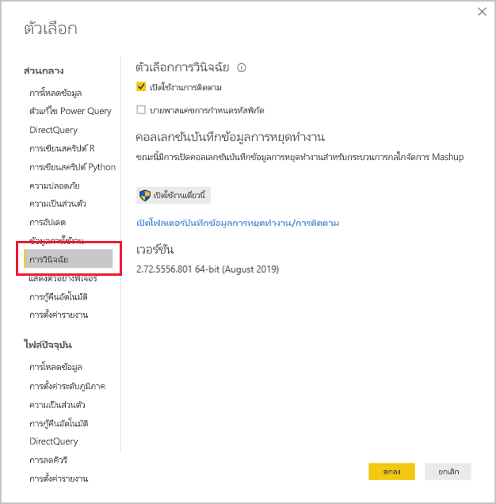
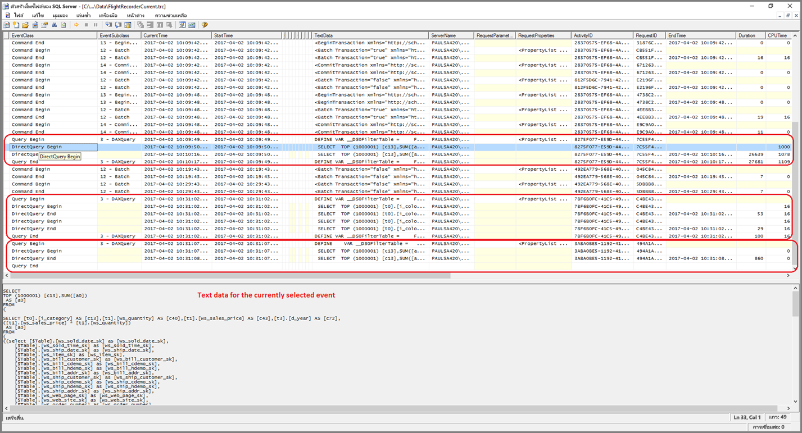
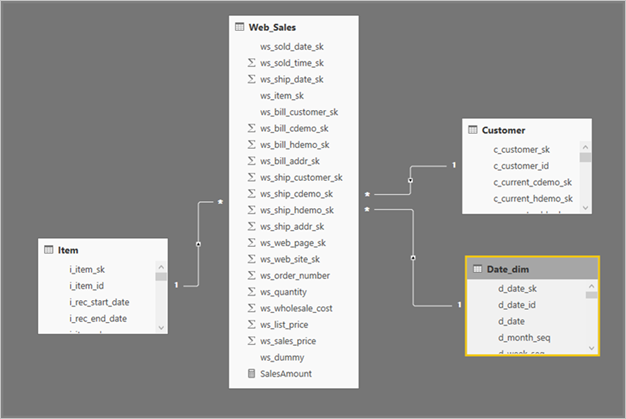
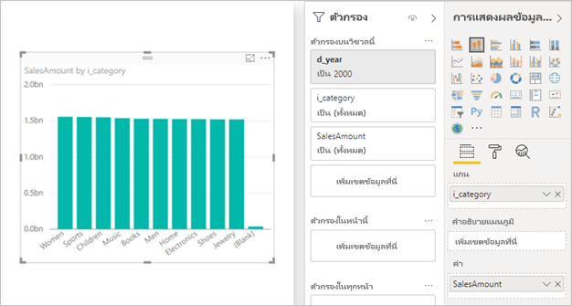
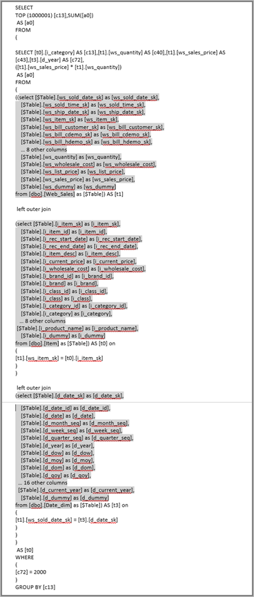

# <a name="troubleshoot-developing-directquery-models-in-power-bi-desktop"></a><span data-ttu-id="494ee-103">แก้ไขปัญหาการพัฒนาแบบจำลอง DirectQuery ใน Power BI Desktop</span><span class="sxs-lookup"><span data-stu-id="494ee-103">Troubleshoot developing DirectQuery models in Power BI Desktop</span></span>

<span data-ttu-id="494ee-104">บทความนี้มีเป้าหมายสำหรับผู้สร้างแบบจำลองข้อมูลที่กำลังพัฒนาแบบจำลอง Power BI DirectQuery ซึ่งพัฒนาโดยใช้ Power BI Desktop หรือบริการของ Power BI</span><span class="sxs-lookup"><span data-stu-id="494ee-104">This article targets data modelers developing Power BI DirectQuery models, developed by using either Power BI Desktop or the Power BI service.</span></span> <span data-ttu-id="494ee-105">ซึ่งจะอธิบายวิธีการวินิจฉัยปัญหาด้านประสิทธิภาพการทำงานและวิธีการรับข้อมูลรายละเอียดเพิ่มเติมเพื่ออนุญาตให้มีการปรับให้เหมาะสมกับรายงาน</span><span class="sxs-lookup"><span data-stu-id="494ee-105">It describes how to diagnose performance issues, and how to get more detailed information to allow reports to be optimized.</span></span>

## <a name="performance-analyzer"></a><span data-ttu-id="494ee-106">ตัววิเคราะห์ประสิทธิภาพ</span><span class="sxs-lookup"><span data-stu-id="494ee-106">Performance Analyzer</span></span>

<span data-ttu-id="494ee-107">เราขอแนะนำอย่างยิ่งว่าการวินิจฉัยใด ๆ ของปัญหาด้านประสิทธิภาพการทำงานเริ่มต้นใน Power BI Desktop แทนที่จะเป็นใน Power BI (บริการหรือเซิร์ฟเวอร์รายงาน Power BI)</span><span class="sxs-lookup"><span data-stu-id="494ee-107">It's strongly recommended that any diagnosis of performance issues starts in Power BI Desktop, rather than in Power BI (the service or Power BI Report Server).</span></span> <span data-ttu-id="494ee-108">โดยปกติแล้ว ปัญหาด้านประสิทธิภาพการทำงานจะขึ้นอยู่กับระดับประสิทธิภาพของแหล่งข้อมูลต้นแบบ และการวินิจฉัยเหล่านี้จะได้รับการระบุและวินิจฉัยได้ง่ายขึ้นในสภาพแวดล้อมที่แยกตัวมากขึ้นของ Power BI Desktop และจะกำจัดคอมโพเนนต์บางอย่างในช่วงแรก (เช่น เกตเวย์ Power BI)</span><span class="sxs-lookup"><span data-stu-id="494ee-108">It's commonly the case that performance issues are simply based on the level of performance of the underlying data source, and these are more easily identified and diagnosed in the much more isolated environment of Power BI Desktop, and initially eliminates certain components (such as the Power BI gateway).</span></span> <span data-ttu-id="494ee-109">เฉพาะในกรณีที่พบว่าไม่มีปัญหาด้านประสิทธิภาพการทำงานอยู่ใน Power BI Desktop ควรให้ความสำคัญกับการตรวจสอบข้อมูลเฉพาะของรายงานใน Power BI</span><span class="sxs-lookup"><span data-stu-id="494ee-109">Only if the performance issues are found to not be present with Power BI Desktop should investigation focus on the specifics of the report in Power BI.</span></span> <span data-ttu-id="494ee-110">[ตัววิเคราะห์ประสิทธิภาพ](../create-reports/desktop-performance-analyzer.md)เป็นเครื่องมือที่มีประโยชน์สำหรับการระบุปัญหาตลอดกระบวนการนี้</span><span class="sxs-lookup"><span data-stu-id="494ee-110">The [Performance Analyzer](../create-reports/desktop-performance-analyzer.md) is a useful tool for identifying issues throughout this process.</span></span>

<span data-ttu-id="494ee-111">ในทำนองเดียวกัน เราขอแนะนำให้ก่อนอื่นลองแยกปัญหาต่าง ๆ ให้กับแต่ละวิชวล แทนการแยกให้กับหลายวิชวลในหน้าเดียว</span><span class="sxs-lookup"><span data-stu-id="494ee-111">Similarly, it is recommended to first try to isolate any issues to an individual visual, rather than many visuals on a page.</span></span>

<span data-ttu-id="494ee-112">สมมติว่าขั้นตอนเหล่านั้น (ในย่อหน้าก่อนหน้าของหัวข้อส่วนนี้) ดำเนินการเรียบร้อยแล้ว ตอนนี้เราจะมีวิชวลเดียวบนหน้าใน Power BI Desktop ที่อาจยังคงช้าอยู่</span><span class="sxs-lookup"><span data-stu-id="494ee-112">Let's say those steps (in the previous paragraphs of this topic) have been taken—we now have a single visual on a page in Power BI Desktop that is still sluggish.</span></span> <span data-ttu-id="494ee-113">หากต้องการกำหนดคิวรีที่จะส่งไปยังแหล่งข้อมูลต้นแบบโดย Power BI Desktop คุณสามารถใช้ตัววิเคราะห์ประสิทธิภาพ</span><span class="sxs-lookup"><span data-stu-id="494ee-113">To determine what queries are being sent to the underlying source by Power BI Desktop, you can use the Performance Analyzer.</span></span> <span data-ttu-id="494ee-114">นอกจากนี้ยังสามารถดูการติดตาม/ข้อมูลการวินิจฉัยที่อาจมีการออกโดยแหล่งข้อมูลเบื้องต้น</span><span class="sxs-lookup"><span data-stu-id="494ee-114">It's also possible to view traces/diagnostic information that might be emitted by the underlying data source.</span></span> <span data-ttu-id="494ee-115">การติดตามดังกล่าวอาจมีข้อมูลที่เป็นประโยชน์เกี่ยวกับรายละเอียดของวิธีดำเนินการคิวรี และวิธีการปรับปรุงคิวรี</span><span class="sxs-lookup"><span data-stu-id="494ee-115">Such traces might also contain useful information about the details of how the query was executed, and how it can be improved.</span></span>

<span data-ttu-id="494ee-116">นอกจากนี้ แม้ในกรณีที่ไม่มีร่องรอยดังกล่าวจากแหล่งที่มา คุณสามารถดคิวรีที่ส่งโดย Power BI พร้อมกับเวลาในการดำเนินการ ตามที่อธิบายไว้ต่อจะจากนี้</span><span class="sxs-lookup"><span data-stu-id="494ee-116">Further, even in the absence of such traces from the source, it's possible to view the queries sent by Power BI, along with their execution times, as described next.</span></span>

## <a name="review-trace-files"></a><span data-ttu-id="494ee-117">ตรวจทานไฟล์การติดตาม</span><span class="sxs-lookup"><span data-stu-id="494ee-117">Review trace files</span></span>

<span data-ttu-id="494ee-118">ตามค่าเริ่มต้น Power BI Desktop จะบันทึกเหตุการณ์ในระหว่างเซสชันที่กำหนดไว้ไปยังไฟล์การติดตามที่ชื่อ **FlightRecorderCurrent.trc**</span><span class="sxs-lookup"><span data-stu-id="494ee-118">By default, Power BI Desktop logs events during a given session to a trace file called **FlightRecorderCurrent.trc**.</span></span>

<span data-ttu-id="494ee-119">สำหรับแหล่งข้อมูล DirectQuery บางแหล่ง ไฟล์บันทึกนี้ประกอบด้วยคิวรีทั้งหมดที่ส่งไปยังแหล่งข้อมูลต้นแบบ (แหล่งข้อมูล DirectQuery ที่เหลืออาจได้รับการสนับสนุนในอนาคต)</span><span class="sxs-lookup"><span data-stu-id="494ee-119">For some DirectQuery sources, this log includes all queries sent to the underlying data source (the remaining DirectQuery sources may be supported in the future).</span></span> <span data-ttu-id="494ee-120">แหล่งข้อมูลที่เขียนคิวรีไปยังไฟล์บันทึกมีดังนี้:</span><span class="sxs-lookup"><span data-stu-id="494ee-120">The sources that write queries to the log are the following:</span></span>

- <span data-ttu-id="494ee-121">SQL Server</span><span class="sxs-lookup"><span data-stu-id="494ee-121">SQL Server</span></span>
- <span data-ttu-id="494ee-122">Azure SQL Database</span><span class="sxs-lookup"><span data-stu-id="494ee-122">Azure SQL Database</span></span>
- <span data-ttu-id="494ee-123">คลังข้อมูล Azure SQL</span><span class="sxs-lookup"><span data-stu-id="494ee-123">Azure SQL Data warehouse</span></span>
- <span data-ttu-id="494ee-124">Oracle</span><span class="sxs-lookup"><span data-stu-id="494ee-124">Oracle</span></span>
- <span data-ttu-id="494ee-125">Teradata</span><span class="sxs-lookup"><span data-stu-id="494ee-125">Teradata</span></span>
- <span data-ttu-id="494ee-126">SAP HANA</span><span class="sxs-lookup"><span data-stu-id="494ee-126">SAP HANA</span></span>

<span data-ttu-id="494ee-127">ไฟล์การติดตามจะอยู่ในโฟลเดอร์ **AppData** สำหรับผู้ใช้ปัจจุบัน: _\\\<User>\AppData\Local\Microsoft\Power BI Desktop\AnalysisServicesWorkspaces_</span><span class="sxs-lookup"><span data-stu-id="494ee-127">The trace file can be found in the **AppData** folder for the current user: _\\\<User>\AppData\Local\Microsoft\Power BI Desktop\AnalysisServicesWorkspaces_</span></span>

<span data-ttu-id="494ee-128">ต่อไปนี้คือวิธีอย่างง่ายสำหรับเข้าถึงโฟลเดอร์นี้: ใน Power BI Desktop เลือก _ไฟล์ > ตัวเลือกและการตั้งค่า > ตัวเลือก_ แล้วเลือกหน้า **การวินิจฉัย**</span><span class="sxs-lookup"><span data-stu-id="494ee-128">Here's an easy way to get to this folder: In Power BI Desktop select _File > Options and settings > Options_, and then select the **Diagnostics** page.</span></span> <span data-ttu-id="494ee-129">หน้าต่างกล่องโต้ตอบต่อไปนี้ปรากฏขึ้น</span><span class="sxs-lookup"><span data-stu-id="494ee-129">The following dialog window appears:</span></span>



<span data-ttu-id="494ee-134">เมื่อคุณเลือกลิงก์ **เปิดโฟลเดอร์บันทึกข้อมูลหยุดทำงาน/การติดตาม** ที่อยู่ภายใต้คอลเลกชันบันทึกข้อมูลการหยุดทำงาน โฟลเดอร์ต่อไปนี้จะเปิดขึ้น: _\\\<User>\AppData\Local\Microsoft\Power BI Desktop\Traces_</span><span class="sxs-lookup"><span data-stu-id="494ee-134">When you select the **Open crash dump/traces folder** link, under Crash Dump Collection, the following folder opens: _\\\<User>\AppData\Local\Microsoft\Power BI Desktop\Traces_</span></span>

<span data-ttu-id="494ee-135">การนำทางไปยังโฟลเดอร์หลักของโฟลเดอร์นั้นจะแสดงโฟลเดอร์ที่ประกอบด้วย _AnalysisServicesWorkspaces_ ซึ่งจะประกอบด้วยโฟลเดอร์ย่อยของพื้นที่ทำงานหนึ่งสำหรับทุก ๆ อินสแตนซ์ที่เปิดของ Power BI Desktop</span><span class="sxs-lookup"><span data-stu-id="494ee-135">Navigating to that folder's parent folder displays the folder containing _AnalysisServicesWorkspaces_, which will contain one workspace subfolder for every open instance of Power BI Desktop.</span></span> <span data-ttu-id="494ee-136">โฟลเดอร์ย่อยเหล่านี้จะได้รับการตั้งชื่อคำต่อท้ายที่เป็นจำนวนเต็ม เช่น _AnalysisServicesWorkspace2058279583_</span><span class="sxs-lookup"><span data-stu-id="494ee-136">These subfolders are named with an integer suffix, such as _AnalysisServicesWorkspace2058279583_.</span></span>

<span data-ttu-id="494ee-137">ภายในโฟลเดอร์นั้นคือโฟลเดอร์ย่อย _\Data_ ที่ประกอบด้วยไฟล์การติดตาม FlightRecorderCurrent.trc สำหรับเซสชัน Power BI ปัจจุบัน</span><span class="sxs-lookup"><span data-stu-id="494ee-137">Inside that folder is a _\Data_ subfolder that contains the trace file FlightRecorderCurrent.trc for the current Power BI session.</span></span> <span data-ttu-id="494ee-138">โฟลเดอร์พื้นที่ทำงานที่สอดคล้องกันจะถูกลบเมื่อสิ้นสุดเซสชัน Power BI Desktop ที่เชื่อมโยง</span><span class="sxs-lookup"><span data-stu-id="494ee-138">The corresponding workspace folder is deleted when the associated Power BI Desktop session ends.</span></span>

<span data-ttu-id="494ee-139">ไฟล์การติดตามสามารถเปิดขึ้นได้โดยใช้เครื่องมือตัวสร้างโพรไฟล์ของ SQL Server ซึ่งสามารถดาวน์โหลดได้ฟรีเนื่องจากส่วนหนึ่งของ SQL Server Management Studio</span><span class="sxs-lookup"><span data-stu-id="494ee-139">The trace files can be opened by using the SQL Server Profiler tool, which is available as a free download as part of SQL Server Management Studio.</span></span> <span data-ttu-id="494ee-140">คุณสามารถรับเครื่องมือได้จาก[ตำแหน่งที่ตั้งนี้](/sql/ssms/download-sql-server-management-studio-ssms?view=sql-server-2017)</span><span class="sxs-lookup"><span data-stu-id="494ee-140">You can get that from [this location](/sql/ssms/download-sql-server-management-studio-ssms?view=sql-server-2017).</span></span>

<span data-ttu-id="494ee-141">เมื่อคุณดาวน์โหลด และติดตั้งSQL Server Management Studio ให้เรียกใช้ ตัวสร้างโพรไฟล์ของ SQL Server</span><span class="sxs-lookup"><span data-stu-id="494ee-141">Once you download and install SQL Server Management Studio, run SQL Server Profiler.</span></span>



<span data-ttu-id="494ee-144">เมื่อต้องเปิดไฟล์การติดตาม ทำตามขั้นตอนต่อไปนี้</span><span class="sxs-lookup"><span data-stu-id="494ee-144">To open the trace file, take the following steps:</span></span>

1. <span data-ttu-id="494ee-145">ในตัวสร้างโพรไฟล์ของ SQL Server เลือก _ไฟล์ > เปิด > ไฟล์การติดตาม_</span><span class="sxs-lookup"><span data-stu-id="494ee-145">In SQL Server Profiler, select _File > Open > Trace_ file</span></span>
2. <span data-ttu-id="494ee-146">ระบุเส้นทางไปยังไฟล์การติดตามสำหรับเซสชัน Power BI ที่เปิดอยู่ในขณะนี้เช่น: _\\\<User>\AppData\Local\Microsoft\Power BI Desktop\AnalysisServicesWorkspaces\AnalysisServicesWorkspace2058279583\Data_</span><span class="sxs-lookup"><span data-stu-id="494ee-146">Enter the path to the trace file for the currently open Power BI session, such as: _\\\<User>\AppData\Local\Microsoft\Power BI Desktop\AnalysisServicesWorkspaces\AnalysisServicesWorkspace2058279583\Data_</span></span>
3. <span data-ttu-id="494ee-147">เปิด _FlightRecorderCurrent.trc_</span><span class="sxs-lookup"><span data-stu-id="494ee-147">Open _FlightRecorderCurrent.trc_</span></span>

<span data-ttu-id="494ee-148">เหตุการณ์ทั้งหมดจากเซสชันปัจจุบันจะปรากฏขึ้น</span><span class="sxs-lookup"><span data-stu-id="494ee-148">All events from the current session are displayed.</span></span> <span data-ttu-id="494ee-149">ตัวอย่างที่มีคำอธิบายประกอบจะแสดงด้านล่าง ซึ่งเน้นกลุ่มของเหตุการณ์</span><span class="sxs-lookup"><span data-stu-id="494ee-149">An annotated example is shown below, which highlights groups of events.</span></span> <span data-ttu-id="494ee-150">แต่ละกลุ่มมีดังต่อไปนี้</span><span class="sxs-lookup"><span data-stu-id="494ee-150">Each group has the following:</span></span>

- <span data-ttu-id="494ee-151">เหตุการณ์ _คิวรีเริ่มต้น_ และ _คิวรีสิ้นสุด_ ซึ่งแสดงจุดเริ่มต้นและสิ้นสุดของคิวรี DAX ที่สร้างขึ้น โดย UI (ตัวอย่างเช่น จากวิชวลแบบ หรือ จากการเติมข้อมูลรายการของค่าในตัวกรอง UI)</span><span class="sxs-lookup"><span data-stu-id="494ee-151">A _Query Begin_ and _Query End_ event, which represent the start and end of a DAX query generated by the UI (for example, from a visual, or from populating a list of values in the filter UI)</span></span>
- <span data-ttu-id="494ee-152">เหตุการณ์ _DirectQuery เริ่มต้น_ และ _DirectQuery สิ้นสุด_ อย่างน้อยหนึ่งคู่ ซึ่งแสดงคิวรีที่ถูกส่งไปยังแหล่งข้อมูลต้นแบบ เป็นส่วนหนึ่งของการประเมินผลคิวรี DAX</span><span class="sxs-lookup"><span data-stu-id="494ee-152">One or more pairs of _DirectQuery Begin_ and _DirectQuery End_ events, which represent a query sent to the underlying data source, as part of evaluating the DAX query</span></span>

<span data-ttu-id="494ee-153">โปรดทราบว่าคิวรี DAX หลายรายการสามารถดำเนินการในแบบขนานได้ ดังนั้นเหตุการณ์จากกลุ่มที่แตกต่างกันสามารถสอดแทรกกันได้</span><span class="sxs-lookup"><span data-stu-id="494ee-153">Note that multiple DAX queries can be executed in parallel, so events from different groups can be interleaved.</span></span> <span data-ttu-id="494ee-154">ค่าของ ActivityID สามารถใช้เพื่อกำหนดว่าเหตุการณ์ใดที่อยู่ในกลุ่มเดียวกัน</span><span class="sxs-lookup"><span data-stu-id="494ee-154">The value of the ActivityID can be used to determine which events belong to the same group.</span></span>


<span data-ttu-id="494ee-157">คอลัมน์อื่น ๆ ที่สนใจมีดังนี้:</span><span class="sxs-lookup"><span data-stu-id="494ee-157">Other columns of interest are as follows:</span></span>

- <span data-ttu-id="494ee-158">**ข้อมูลข้อความ:** รายละเอียดข้อความของเหตุการณ์</span><span class="sxs-lookup"><span data-stu-id="494ee-158">**TextData:** The textual detail of the event.</span></span> <span data-ttu-id="494ee-159">สำหรับเหตุการณ์ _คิวรีเริ่มต้น/สิ้นสุด_ จะเป็นคิวรี DAX</span><span class="sxs-lookup"><span data-stu-id="494ee-159">For _Query Begin/End_ events this will be the DAX query.</span></span> <span data-ttu-id="494ee-160">สำหรับเหตุการณ์ _DirectQuery เริ่มต้น/สิ้นสุด_ จะเป็นคิวรี SQL ที่ส่งไปยังแหล่งข้อมูลต้นแบบ</span><span class="sxs-lookup"><span data-stu-id="494ee-160">For _DirectQuery Begin/End_ events, this will be the SQL query sent to the underlying source.</span></span> <span data-ttu-id="494ee-161">ค่า _TextData_ สำหรับเหตุการณ์ที่เลือกในปัจจุบันจะแสดงในบริเวณที่ด้านล่าง</span><span class="sxs-lookup"><span data-stu-id="494ee-161">The _TextData_ value for the currently selected event is also displayed in the region at the bottom.</span></span>
- <span data-ttu-id="494ee-162">**เวลาสิ้นสุด:** เมื่อเหตุการณ์เสร็จสมบูรณ์</span><span class="sxs-lookup"><span data-stu-id="494ee-162">**EndTime:** When the event completed.</span></span>
- <span data-ttu-id="494ee-163">**ระยะเวลา:** ระยะเวลาที่ใช้ในการดำเนินการคิวรี DAX หรือ SQL ในหน่วยมิลลิวินาที</span><span class="sxs-lookup"><span data-stu-id="494ee-163">**Duration:** The duration, in milliseconds, taken to execute the DAX or SQL query.</span></span>
- <span data-ttu-id="494ee-164">**ข้อผิดพลาด:** บ่งชี้ว่ามีข้อผิดพลาดเกิดขึ้นหรือไม่ ในกรณีนี้เหตุการณ์ที่แสดงจะเป็นสีแดง</span><span class="sxs-lookup"><span data-stu-id="494ee-164">**Error:** Indicates if an error occurred, in which case the event is also displayed in red.</span></span>

<span data-ttu-id="494ee-165">โปรดทราบว่าในภาพด้านบน คอลัมน์ที่ดูไม่น่าสนใจบางส่วนได้รับการจำกัดให้แคบลง เพื่อให้สามารถมองเห็นได้คอลัมน์ที่น่าสนใจง่ายขึ้น</span><span class="sxs-lookup"><span data-stu-id="494ee-165">In the image above, some of the less interesting columns have been narrowed, to allow the interesting columns to be seen more easily.</span></span>

<span data-ttu-id="494ee-166">วิธีแนะนำสำหรับการจับภาพการติดตามเพื่อช่วยในการวินิจฉัยปัญหาด้านประสิทธิภาพการทำงานอาจเกิดขึ้นมีดังนี้</span><span class="sxs-lookup"><span data-stu-id="494ee-166">The recommended approach to capturing a trace to help diagnose a potential performance issue is the following:</span></span>

- <span data-ttu-id="494ee-167">เปิดเซสชัน Power BI Desktop เดียว (เพื่อหลีกเลี่ยงความสับสนของโฟลเดอร์พื้นที่ทำงานหลายรายการ)</span><span class="sxs-lookup"><span data-stu-id="494ee-167">Open a single Power BI Desktop session (to avoid the confusion of multiple workspace folders)</span></span>
- <span data-ttu-id="494ee-168">ใช้ชุดการดำเนินการที่น่าสนใจใน Power BI Desktop</span><span class="sxs-lookup"><span data-stu-id="494ee-168">Perform the set of actions of interest in Power BI Desktop.</span></span> <span data-ttu-id="494ee-169">รวมถึงการดำเนินการเพิ่มเติมบางอย่างนอกเหนือจากนั้น เพื่อให้แน่ใจว่าเหตุการณ์ที่น่าสนใจจะถูกใส่ลงในไฟล์การติดตาม</span><span class="sxs-lookup"><span data-stu-id="494ee-169">Include a few additional actions beyond that, to ensure that the events of interest are flushed into the trace file.</span></span>
- <span data-ttu-id="494ee-170">เปิดตัวสร้างโพรไฟล์ของ SQL Server และตรวจสอบการติดตาม ตามที่อธิบายไว้ก่อนหน้านี้</span><span class="sxs-lookup"><span data-stu-id="494ee-170">Open SQL Server Profiler and examine the trace, as described earlier.</span></span> <span data-ttu-id="494ee-171">โปรดทราบว่าไฟล์การติดตามจะถูกลบเมื่อปิด Power BI Desktop</span><span class="sxs-lookup"><span data-stu-id="494ee-171">Remember that the trace file will be deleted upon closing Power BI Desktop.</span></span> <span data-ttu-id="494ee-172">นอกจากนี้ การดำเนินการเพิ่มเติมใน Power BI Desktop จะไม่ปรากฏทันที ควรจะปิดไฟล์การติดตามและเปิดใหม่อีกครั้งเพื่อดูเหตุการณ์ใหม่</span><span class="sxs-lookup"><span data-stu-id="494ee-172">Also, further actions in Power BI Desktop will not immediately appear—the trace file should be closed and reopened to see the new events.</span></span>
- <span data-ttu-id="494ee-173">เก็บแต่ละเซสชันให้มีขนาดค่อนขนาดเล็ก (สิบวินาทีของการดำเนินการ ไม่ใช่หลายร้อย) เพื่อทำให้ง่ายต่อการแปลไฟล์การติดตาม (และเนื่องจากมีขีดจำกัดเกี่ยวกับขนาดของไฟล์การติดตาม ดังนั้นสำหรับเซสชันที่มีความยาวมาก จึงมีโอกาสที่เหตุการณ์ในช่วงแรกจะถูกทิ้งไป)</span><span class="sxs-lookup"><span data-stu-id="494ee-173">Keep individual sessions reasonably small (10 seconds of actions, not hundreds) to make it easier to interpret the trace file (and because there is a limit on the size of the trace file, thus for long sessions there is a chance of early events being dropped).</span></span>

## <a name="understand-queries-sent-to-the-source"></a><span data-ttu-id="494ee-174">ทำความเข้าใจแบบสอบถามที่ส่งไปยังแหล่งข้อมูล</span><span class="sxs-lookup"><span data-stu-id="494ee-174">Understand queries sent to the source</span></span>

<span data-ttu-id="494ee-175">รูปแบบทั่วไปของคิวรีที่สร้างและส่งโดย Power BI Desktop จะใช้การคิวรีย่อยสำหรับแต่ละตารางแบบจำลองที่อ้างอิง โดยที่การคิวรีย่อยจะถูกกำหนดขึ้นโดยคิวรี Power Query</span><span class="sxs-lookup"><span data-stu-id="494ee-175">The general format of queries generated and sent by Power BI Desktop use subqueries for each of the model tables referenced, where the subquery is defined by the Power Query query.</span></span> <span data-ttu-id="494ee-176">ตัวอย่างเช่น สมมติว่าตาราง TPC DS ต่อไปนี้อยู่ในฐานข้อมูลเชิงสัมพันธ์ของ SQL Server</span><span class="sxs-lookup"><span data-stu-id="494ee-176">For example, assume the following TPC-DS tables in a SQL Server relational database:</span></span>



<span data-ttu-id="494ee-179">พิจารณาวิชวลต่อไปนี้และการกำหนดค่าโดยการสังเกตหน่วยวัด **SalesAmount** ที่กำหนดด้วยนิพจน์ดังต่อไปนี้:</span><span class="sxs-lookup"><span data-stu-id="494ee-179">Consider the following visual and its configuration, noting that the **SalesAmount** measure is defined with the following expression:</span></span>

```dax

SalesAmount = SUMX(Web_Sales, [ws_sales_price] * [ws_quantity])

```



<span data-ttu-id="494ee-182">การรีเฟรชวิชวลนั้นจะส่งผลในคิวรี SQL ที่แสดงอยู่ด้านล่างของย่อหน้าถัดไป</span><span class="sxs-lookup"><span data-stu-id="494ee-182">Refreshing that visual will result in the T-SQL query shown below the next paragraph.</span></span> <span data-ttu-id="494ee-183">ตอนนี้คุณสามารถบอกได้ว่าการคิวรีย่อยสามแบบสำหรับตารางแบบจำลองได้แก่ **Web_Sales**,**Item** และ **Date_dim**</span><span class="sxs-lookup"><span data-stu-id="494ee-183">As you can tell, there are three subqueries for the **Web_Sales**, **Item**, and **Date_dim** model tables.</span></span> <span data-ttu-id="494ee-184">แต่ละตารางเหล่านี้ส่งกลับคอลัมน์ตารางแบบจำลองทั้งหมดแม้ว่าจะมีเพียงสี่คอลัมน์ที่ถูกอ้างอิงโดยวิชวลเท่านั้น</span><span class="sxs-lookup"><span data-stu-id="494ee-184">Each of these tables returns all the model table columns, even though only four columns are actually referenced by the visual.</span></span> <span data-ttu-id="494ee-185">การคิวรีย่อยเหล่านี้ (แรเงา) เป็นข้อกำหนดของคิวรี Power Query อย่างแน่นอน</span><span class="sxs-lookup"><span data-stu-id="494ee-185">These subqueries (they're shaded) are exactly the definition of the Power Query queries.</span></span> <span data-ttu-id="494ee-186">ไม่พบว่าการใช้การคิวรีในลักษณะนี้มีผลกระทบต่อประสิทธิภาพการทำงาน สำหรับแหล่งข้อมูลที่ได้รับการสนับสนุนสำหรับ DirectQuery</span><span class="sxs-lookup"><span data-stu-id="494ee-186">Use of subqueries in this manner has not been found to impact performance, for the data sources so far supported for DirectQuery.</span></span> <span data-ttu-id="494ee-187">แหล่งข้อมูล เช่น SQL Server จะปรับการอ้างอิงไปยังคอลัมน์ที่ไม่ได้ใช้งานให้เหมาะสม</span><span class="sxs-lookup"><span data-stu-id="494ee-187">Data sources like SQL Server optimize away the references to unused columns.</span></span>

<span data-ttu-id="494ee-188">เหตุผลหนึ่งที่ทำให้ Power BI ใช้รูปแบบนี้เนื่องจากคุณสามารถกำหนดคิวรี Power Query เพื่อใช้คำสั่งคิวรีที่เฉพาะเจาะจง</span><span class="sxs-lookup"><span data-stu-id="494ee-188">One reason Power BI employs this pattern is because you can define a Power Query query to use a specific query statement.</span></span> <span data-ttu-id="494ee-189">ดังนั้นจึงใช้ "ตามที่ระบุ" โดยไม่ต้องพยายามเขียนใหม่</span><span class="sxs-lookup"><span data-stu-id="494ee-189">So, it's used "as provided", without an attempt to rewrite it.</span></span> <span data-ttu-id="494ee-190">โปรดทราบว่ารูปแบบนี้จำกัดการใช้คำสั่งคิวรีที่ใช้ Common Table Expressions (CTEs) และ Stored Procedure</span><span class="sxs-lookup"><span data-stu-id="494ee-190">Note that this patterns restricts using query statements that use Common Table Expressions (CTEs) and stored procedures.</span></span> <span data-ttu-id="494ee-191">ไม่สามารถใช้คำสั่งเหล่านี้ในการคิวรีย่อย</span><span class="sxs-lookup"><span data-stu-id="494ee-191">These statements cannot be used in subqueries.</span></span>



## <a name="gateway-performance"></a><span data-ttu-id="494ee-193">ประสิทธิภาพของเกตเวย์</span><span class="sxs-lookup"><span data-stu-id="494ee-193">Gateway performance</span></span>

<span data-ttu-id="494ee-194">สำหรับข้อมูลเกี่ยวกับการแก้ไขปัญหาประสิทธิภาพการทำงานของเกตเวย์ ให้อ่านบทความ [แก้ไขปัญหาเกตเวย์-Power BI](service-gateway-onprem-tshoot.md)</span><span class="sxs-lookup"><span data-stu-id="494ee-194">For information about troubleshooting gateway performance, read the [Troubleshoot gateways - Power BI](service-gateway-onprem-tshoot.md) article.</span></span>

## <a name="next-steps"></a><span data-ttu-id="494ee-195">ขั้นตอนถัดไป</span><span class="sxs-lookup"><span data-stu-id="494ee-195">Next steps</span></span>

<span data-ttu-id="494ee-196">สำหรับข้อมูลเพิ่มเติมเกี่ยวกับ DirectQuery โปรดดูที่ทรัพยากรดังต่อไปนี้:</span><span class="sxs-lookup"><span data-stu-id="494ee-196">For more information about DirectQuery, check out the following resources:</span></span>

- [<span data-ttu-id="494ee-197">ใช้ DirectQuery ใน Power BI Desktop</span><span class="sxs-lookup"><span data-stu-id="494ee-197">Use DirectQuery in Power BI Desktop</span></span>](desktop-use-directquery.md)
- [<span data-ttu-id="494ee-198">แบบจำลอง DirectQuery ใน Power BI Desktop</span><span class="sxs-lookup"><span data-stu-id="494ee-198">DirectQuery models in Power BI Desktop</span></span>](desktop-directquery-about.md)
- [<span data-ttu-id="494ee-199">คำแนะนำแบบจำลอง DirectQuery ใน Power BI Desktop</span><span class="sxs-lookup"><span data-stu-id="494ee-199">DirectQuery model guidance in Power BI Desktop</span></span>](../guidance/directquery-model-guidance.md)
- <span data-ttu-id="494ee-200">มีคำถามหรือไม่</span><span class="sxs-lookup"><span data-stu-id="494ee-200">Questions?</span></span> [<span data-ttu-id="494ee-201">ลองถามชุมชน Power BI</span><span class="sxs-lookup"><span data-stu-id="494ee-201">Try asking the Power BI Community</span></span>](https://community.powerbi.com/)
