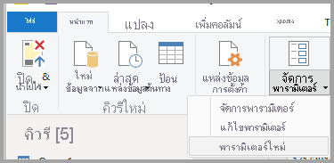
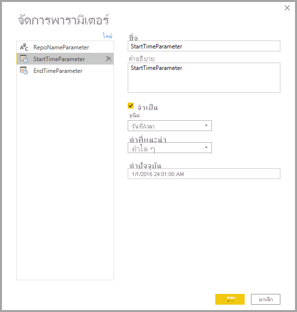
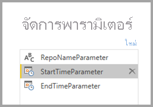
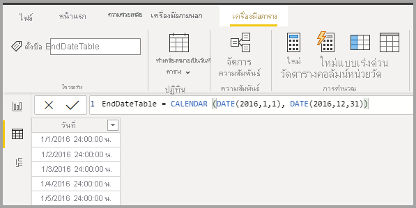
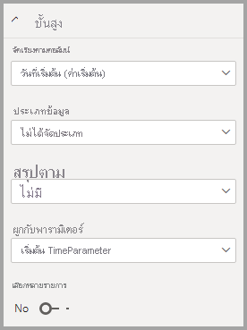
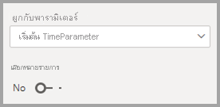
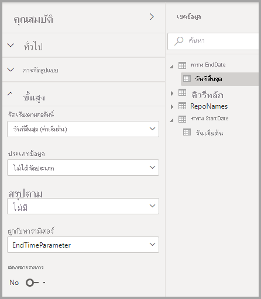

# <a name="dynamic-m-query-parameters-in-power-bi-desktop-preview"></a><span data-ttu-id="204c6-103">พารามิเตอร์คิวรี M แบบไดนามิกใน Power BI Desktop (ตัวอย่าง)</span><span class="sxs-lookup"><span data-stu-id="204c6-103">Dynamic M query parameters in Power BI Desktop (preview)</span></span>

<span data-ttu-id="204c6-104">ด้วย **พารามิเตอร์คิวรี M แบบไดนามิก** ผู้สร้างแบบจำลองสามารถให้ **ผู้ชมรายงาน** ใช้ตัวกรองหรือแบ่งส่วนข้อมูลเพื่อตั้งค่าสำหรับ [พารามิเตอร์คิวรี M](/power-query/power-query-query-parameters) ซึ่งจะเป็นประโยชน์อย่างยิ่งสำหรับการปรับแต่งประสิทธิภาพการทำงานของคิวรี</span><span class="sxs-lookup"><span data-stu-id="204c6-104">With **Dynamic M Query Parameters**, model authors can let **report viewers** to use filters or slicers to set the value(s) for an [M Query Parameter](/power-query/power-query-query-parameters), which can be especially useful for query performance optimizations.</span></span> <span data-ttu-id="204c6-105">ด้วยพารามิเตอร์คิวรี M แบบไดนามิกผู้สร้างแบบจำลองสามารถควบคุมเพิ่มวิธีการเลือกตัวกรองเพื่อรับการรวมเข้ากับคิวรีต้นทาง DirectQuery</span><span class="sxs-lookup"><span data-stu-id="204c6-105">With Dynamic M Query Parameters, model authors have additional control over how filter selections get incorporated into DirectQuery source queries.</span></span> 

<span data-ttu-id="204c6-106">เมื่อผู้สร้างแบบจำลองเข้าใจตรรกะที่ตั้งใจไว้ของตัวกรอง พวกเขาก็จะทราบวิธีการเขียนคิวรีที่มีประสิทธิภาพกับแหล่งข้อมูลของพวกเขาและสามารถทำให้แน่ใจว่าการเลือกตัวกรองได้รับการรวมเข้ากับคิวรีแหล่งที่มาที่จุดที่เหมาะสมเพื่อให้ได้ผลลัพธ์ที่มีประสิทธิภาพที่ดีขึ้น</span><span class="sxs-lookup"><span data-stu-id="204c6-106">When model authors understand the intended semantics of their filters, they often know how to write efficient queries against their data source, and can thus ensure filter selections get incorporated into source queries at the right point to achieve their intended results with improved performance.</span></span>

## <a name="enabling-dynamic-m-query-parameters"></a><span data-ttu-id="204c6-107">การเปิดใช้งานพารามิเตอร์คิวรี M แบบไดนามิก</span><span class="sxs-lookup"><span data-stu-id="204c6-107">Enabling Dynamic M query parameters</span></span>

<span data-ttu-id="204c6-108">**พารามิเตอร์คิวรี M แบบไดนามิก** ขณะนี้อยู่ในการแสดงตัวอย่างและต้องเปิดใช้งานเพื่อใช้</span><span class="sxs-lookup"><span data-stu-id="204c6-108">**Dynamic M Query Parameters** are currently in preview, and must be enabled to be used.</span></span> <span data-ttu-id="204c6-109">เลือก **ไฟล์ > ตัวเลือกและการตั้งค่า > ตัวเลือก** แล้วเลือก **แสดงตัวอย่างคุณลักษณะ** ในบานหน้าต่างด้านซ้าย</span><span class="sxs-lookup"><span data-stu-id="204c6-109">Select **File > Options and settings > Options** and then select **Preview features** from the left pane.</span></span> <span data-ttu-id="204c6-110">จากที่นั่นตรวจสอบให้แน่ใจว่ามีการเลือกกล่องกาเครื่องหมาย **แบบไดนามิก M พารามิเตอร์**</span><span class="sxs-lookup"><span data-stu-id="204c6-110">From there, make sure the **Dynamic M Query Parameters** checkbox is selected.</span></span> <span data-ttu-id="204c6-111">คุณอาจจำเป็นต้องรีสตาร์ท Power BI Desktop เพื่อให้สามารถเปิดใช้งานการเปลี่ยนแปลงได้</span><span class="sxs-lookup"><span data-stu-id="204c6-111">You may need to restart Power BI Desktop for the change to be enabled.</span></span>


<span data-ttu-id="204c6-113">ในฐานะที่เป็นข้อกำหนดเบื้องต้นสำหรับคุณลักษณะนี้คุณจะต้องสร้าง[พารามิเตอร์คิวรี M](/power-query/power-query-query-parameters) ที่ถูกต้อง และอ้างอิงในตารางคิวรีโดยตรงหนึ่งรายการหรือมากกว่า</span><span class="sxs-lookup"><span data-stu-id="204c6-113">As a prerequisite for this feature, you must have a valid [M Query Parameter](/power-query/power-query-query-parameters) created and referred in one or more Direct Query tables.</span></span> 

> [!NOTE]
> <span data-ttu-id="204c6-114">ตรวจสอบให้แน่ใจว่า ได้เลือกส่วน [ข้อควรพิจารณาและขีดจำกัด](#considerations-and-limitations) ในบทความนี้ เนื่องจากไม่ได้สนับสนุนแหล่งข้อมูล DirectQuery ทั้งหมดที่มีคุณลักษณะนี้</span><span class="sxs-lookup"><span data-stu-id="204c6-114">Be sure to check the [Considerations and limitations](#considerations-and-limitations) section in this article, since not all DirectQuery sources are supported with this feature.</span></span>

<span data-ttu-id="204c6-115">มาดำเนินการผ่านตัวอย่างสำหรับการส่งผ่าน **ค่าเดี่ยว** เป็นพารามิเตอร์แบบไดนามิก:</span><span class="sxs-lookup"><span data-stu-id="204c6-115">Let's step through an example for passing a **single value** to a parameter dynamically:</span></span>

1. <span data-ttu-id="204c6-116">ใน Power BI Desktop เปิดใช้ **Power Query** จากแท็บ **ข้อมูล** และเลือก **พารามิเตอร์ใหม่** ภายใต้ปุ่ม **จัดการพารามิเตอร์** ใน ribbon</span><span class="sxs-lookup"><span data-stu-id="204c6-116">In Power BI Desktop, launch **Power Query** from the **Data** tab, and select **New Parameters** under the **Manage Parameters** button in the ribbon.</span></span>

    

2. <span data-ttu-id="204c6-118">จากนั้นกรอกข้อมูลต่อไปนี้เกี่ยวกับพารามิเตอร์</span><span class="sxs-lookup"><span data-stu-id="204c6-118">Then fill out the following information about the Parameter.</span></span>

    

3. <span data-ttu-id="204c6-120">คลิก **ใหม่** อีกครั้งถ้าคุณมีพารามิเตอร์เพิ่มเติมที่จะเพิ่ม</span><span class="sxs-lookup"><span data-stu-id="204c6-120">Click **New** again if you have more parameters to add.</span></span>

    

4. <span data-ttu-id="204c6-122">หลังจากที่คุณได้สร้างพารามิเตอร์แล้ว คุณสามารถอ้างอิงข้อมูลเหล่านั้นในคิวรี M ได้</span><span class="sxs-lookup"><span data-stu-id="204c6-122">Once you've created the parameters, you can reference them in the M query.</span></span> <span data-ttu-id="204c6-123">หากต้องการปรับเปลี่ยนคิวรี M ให้เปิดตัวแก้ไขขั้นสูงในขณะที่คุณมีคิวรีที่คุณต้องการปรับเปลี่ยนเลือก:</span><span class="sxs-lookup"><span data-stu-id="204c6-123">To modify the M Query, open the Advanced editor while you have the Query that you want to modify selected:</span></span>

    

5. <span data-ttu-id="204c6-125">ถัดไป อ้างอิงพารามิเตอร์ในคิวรี M ซึ่งเน้นเป็นสีเหลืองในรูปต่อไปนี้</span><span class="sxs-lookup"><span data-stu-id="204c6-125">Next, reference the parameters in the M Query, highlighted in yellow in the following image.</span></span> 

    

6. <span data-ttu-id="204c6-127">หลังจากที่คุณได้สร้างพารามิเตอร์และอ้างอิงในคิวรี M ถัดไปคุณจะต้องสร้างตารางพร้อมคอลัมน์ที่มีค่าที่เป็นไปได้สำหรับพารามิเตอร์นั้น</span><span class="sxs-lookup"><span data-stu-id="204c6-127">Now that you have created the parameters and referenced them in the M Query, next, you will need to create a table with a column that provides the possible values available for that parameter.</span></span> <span data-ttu-id="204c6-128">การดำเนินการนี้จะอนุญาตให้พารามิเตอร์ดังกล่าวได้รับการตั้งค่าแบบไดนามิกตามการเลือกตัวกรอง</span><span class="sxs-lookup"><span data-stu-id="204c6-128">This will allow it such that the parameters are dynamically set based on filter selection.</span></span> <span data-ttu-id="204c6-129">ในตัวอย่างนี้ เราต้องการ *StartTime* พารามิเตอร์ของเราและ พารามิเตอร์ของ *EndTime* เป็นแบบไดนามิก</span><span class="sxs-lookup"><span data-stu-id="204c6-129">In this example, we want our *StartTime* Parameter and *EndTime* Parameter to be dynamic.</span></span> <span data-ttu-id="204c6-130">เนื่องจากพารามิเตอร์เหล่านี้ต้องใช้พารามิเตอร์วันที่/เวลา ฉันต้องการสร้างการป้อนข้อมูลวันที่ที่สามารถใช้ในการตั้งค่าวันที่สำหรับพารามิเตอร์ได้</span><span class="sxs-lookup"><span data-stu-id="204c6-130">Since these parameters are requiring a Date/Time parameter, I want to generate date inputs that can be used to set the date for the parameter.</span></span> <span data-ttu-id="204c6-131">ในการเริ่มต้น เราสร้างตารางใหม่:</span><span class="sxs-lookup"><span data-stu-id="204c6-131">To start, we create a new table:</span></span>

    

7. <span data-ttu-id="204c6-133">นี่คือตารางแรกที่ฉันสร้างขึ้นสำหรับค่าสำหรับพารามิเตอร์ *StartTime*:</span><span class="sxs-lookup"><span data-stu-id="204c6-133">Here's the first table I created for the values for *StartTime* Parameter:</span></span>

    ```StartDateTable = CALENDAR (DATE(2016,1,1), DATE(2016,12,31))```

    

8. <span data-ttu-id="204c6-135">นี่คือตารางที่สองที่ฉันสร้างขึ้นสำหรับค่าสำหรับพารามิเตอร์ EndTime:</span><span class="sxs-lookup"><span data-stu-id="204c6-135">Here's the second table I created for the values for EndTime Parameter:</span></span>

    ```EndDateTable = CALENDAR (DATE(2016,1,1), DATE(2016,12,31))```

    

    > [!NOTE]
    > <span data-ttu-id="204c6-137">เราขอแนะนำให้ใช้ชื่อคอลัมน์อื่นที่ไม่ได้อยู่ในตารางจริง</span><span class="sxs-lookup"><span data-stu-id="204c6-137">We recommend using a different column name that is not in an actual table.</span></span> <span data-ttu-id="204c6-138">ถ้าเป็นชื่อเดียวกันค่าที่เลือกจะถูกนำไปใช้เป็นตัวกรองไปยังคิวรีจริง</span><span class="sxs-lookup"><span data-stu-id="204c6-138">If they are same name, the selected value will be applied as a filter to the actual query.</span></span>

9. <span data-ttu-id="204c6-139">หลังจากที่มีการสร้างตารางที่มีเขตข้อมูล *วันที่* แล้ว เราสามารถผูกเขตข้อมูลแต่ละรายการกับพารามิเตอร์ได้</span><span class="sxs-lookup"><span data-stu-id="204c6-139">Now that the tables with the *Date* field have been created, we can bind each field to a parameter.</span></span> <span data-ttu-id="204c6-140">การผูกเขตข้อมูลกับพารามิเตอร์หลักๆ หมายความว่าเป็นค่าที่เลือกสำหรับเขตข้อมูลเปลี่ยนแปลง ค่าจะได้รับการส่งผ่านไปยังพารามิเตอร์และปรับปรุงคิวรีที่มีการอ้างอิงพารามิเตอร์</span><span class="sxs-lookup"><span data-stu-id="204c6-140">Binding the field to a parameter essentially means that as the selected value for the field changes, the value will get passed to the parameter and update the query where the parameter is referenced.</span></span> <span data-ttu-id="204c6-141">ดังนั้นเมื่อต้องการผูกเขตข้อมูล ไปยังแท็บ **การสร้างรูปแบบ** เลือกเขตข้อมูลที่สร้างขึ้นใหม่ และจากนั้นไปยังคุณสมบัติ **ขั้นสูง**:</span><span class="sxs-lookup"><span data-stu-id="204c6-141">So to bind field, go to the **Modeling** tab, select the newly created field, and then go to the **Advanced** properties:</span></span>

    > [!NOTE]
    > <span data-ttu-id="204c6-142">ชนิดข้อมูลคอลัมน์ควรตรงกับชนิดพารามิเตอร์ M</span><span class="sxs-lookup"><span data-stu-id="204c6-142">Column Data type should match with M parameter type.</span></span>

    

10. <span data-ttu-id="204c6-144">เลือกรายการแบบดรอปดาวน์ภายใต้ **ผูกกับพารามิเตอร์** และเลือกพารามิเตอร์ที่คุณต้องการผูกกับเขตข้อมูล:</span><span class="sxs-lookup"><span data-stu-id="204c6-144">Select the dropdown under **Bind to parameter** and select the Parameter that you want to bind to the field:</span></span>

    

    <span data-ttu-id="204c6-146">เนื่องจากตัวอย่างนี้มีไว้สำหรับค่าที่เลือกเพียงครั้งเดียว (การตั้งค่าพารามิเตอร์เป็นค่าเดียว) คุณต้องการเก็บการตั้งค่า **หลายรายการ** เป็น **ไม่** ซึ่งเป็นค่าเริ่มต้น:</span><span class="sxs-lookup"><span data-stu-id="204c6-146">Since this example is for a single-select value (setting the parameter to a single value), you'll want to keep **Multi-select** set to **No**, which is the default:</span></span>

    

    <span data-ttu-id="204c6-148">ถ้ากรณีการใช้งานของคุณจำเป็นต้องมีการเลือกหลายรายการ (ผ่านหลายค่าไปยังพารามิเตอร์เดียว) คุณต้องสลับสวิตช์เป็น **ใช่** และตรวจสอบให้แน่ใจว่าคิวรี M ของคุณถูกตั้งค่าอย่างถูกต้องเพื่อยอมรับหลายค่าในคิวรี M</span><span class="sxs-lookup"><span data-stu-id="204c6-148">If your use cases require multi-selection (passing multi-values to a single parameter), you must toggle the switch to **Yes** and ensure that your M query is set up properly to accept multiple values in the M query.</span></span> <span data-ttu-id="204c6-149">ต่อไปนี้เป็นตัวอย่างสำหรับ *RepoNameParameter* ซึ่งอนุญาตให้ใช้หลายค่า:</span><span class="sxs-lookup"><span data-stu-id="204c6-149">Here's an example for *RepoNameParameter*, which allows for multiple values:</span></span>

    

11. <span data-ttu-id="204c6-151">คุณสามารถทำซ้ำขั้นตอนเหล่านี้ถ้าคุณมีเขตข้อมูลอื่นๆที่จะผูกกับพารามิเตอร์อื่นๆ:</span><span class="sxs-lookup"><span data-stu-id="204c6-151">You can repeat these steps if you have other fields to bind to other parameters:</span></span>

    

12. <span data-ttu-id="204c6-153">ในตอนท้ายคุณสามารถอ้างอิงเขตข้อมูลนี้ในตัวแบ่งส่วนหรือเป็นตัวกรอง:</span><span class="sxs-lookup"><span data-stu-id="204c6-153">Finally, you can reference this field in a slicer or as a filter:</span></span>

    

<span data-ttu-id="204c6-155">ถ้ามีการตั้งค่าคอลัมน์ที่มีการแมปเป็น **ไม่** สำหรับการเลือกหลายรายการ คุณต้องใช้หนึ่งโหมดเลือกในตัวแบ่งส่วนข้อมูลหรือจำเป็นต้องเลือกเพียงครั้งเดียวในการ์ดตัวกรอง</span><span class="sxs-lookup"><span data-stu-id="204c6-155">If the mapped column is set to **No** for Multi-select, you must use either a single select mode in the slicer, or require single select in the filter card.</span></span>

## <a name="potential-security-risk"></a><span data-ttu-id="204c6-156">การรักษาความปลอดภัยที่อาจเกิดขึ้น</span><span class="sxs-lookup"><span data-stu-id="204c6-156">Potential security risk</span></span>

<span data-ttu-id="204c6-157">เมื่อคุณอนุญาตให้ผู้อ่านรายงานสามารถตั้งค่าสำหรับพารามิเตอร์คิวรี M แบบไดนามิกพวกเขาอาจสามารถเข้าถึงข้อมูลเพิ่มเติมหรือทริกเกอร์การปรับเปลี่ยนไปยังระบบต้นทางโดยใช้ **การโจมตีการการฉีด** ได้โดยขึ้นอยู่กับวิธีที่พารามิเตอร์ถูกอ้างอิงในคิวรี M และค่าใดที่จะถูกส่งผ่านไปยังพารามิเตอร์นั้น</span><span class="sxs-lookup"><span data-stu-id="204c6-157">When you allow report readers to dynamically set the values for the M Query parameters, they may be able to access additional data or trigger modifications to the source system using **injection attacks**, depending how the parameters are referenced in the M Query and what values are passed to that parameter.</span></span>

<span data-ttu-id="204c6-158">ตัวอย่างเช่นสมมติว่าคุณมีคิวรี Kusto ที่มีการกำหนดพารามิเตอร์ที่สร้างขึ้นดังต่อไปนี้:</span><span class="sxs-lookup"><span data-stu-id="204c6-158">For example, let's say you have a parameterized Kusto query constructed like the following:</span></span>

```
Products
| where Category == [Parameter inserted here] & HasReleased == 'True'
 | project ReleaseDate, Name, Category, Region```
```

<span data-ttu-id="204c6-159">คุณอาจไม่มีปัญหากับผู้ใช้ที่เป็นมิตรซึ่งส่งผ่านค่าที่เหมาะสมสำหรับพารามิเตอร์ตัวอย่างเช่น *เกม*:</span><span class="sxs-lookup"><span data-stu-id="204c6-159">You may have no issues with a friendly user who passes an appropriate value for the parameter, for example, *Games*:</span></span>

```
| where Category == 'Games' & HasReleased == 'True'
```

<span data-ttu-id="204c6-160">อย่างไรก็ตามผู้โจมตีอาจสามารถส่งผ่านค่าที่ปรับเปลี่ยนแบบสอบถามเพื่อรับการเข้าถึงข้อมูลเพิ่มเติมตัวอย่างเช่น *' เกม '//* :</span><span class="sxs-lookup"><span data-stu-id="204c6-160">However, an attacker may be able to pass a value that modifies the query to get access to more data, for example, *'Games' //*:</span></span>

```
Products
| where Category == 'Games'// & HasReleased == 'True'
| project ReleaseDate, Name, Category, Region
```

<span data-ttu-id="204c6-161">ในตัวอย่างนี้ผู้โจมตีสามารถเข้าถึงข้อมูลในเกมที่ยังไม่ได้เผยแพร่ได้โดยการเปลี่ยนแปลงส่วนของแบบสอบถามลงในข้อคิดเห็น</span><span class="sxs-lookup"><span data-stu-id="204c6-161">In this example, the attacker can get access to information on games that have not been released yet by changing part of the query into a comment.</span></span>

<span data-ttu-id="204c6-162">**วิธีการบรรเทาความเสี่ยง**</span><span class="sxs-lookup"><span data-stu-id="204c6-162">**How to mitigate the risk**</span></span>

<span data-ttu-id="204c6-163">หากต้องการบรรเทาความเสี่ยงด้านความปลอดภัยจะดีที่สุดในการหลีกเลี่ยงการเรียงต่อกันของค่าพารามิเตอร์ M ในแบบสอบถาม</span><span class="sxs-lookup"><span data-stu-id="204c6-163">To mitigate the security risk, it's best to avoid string concatenation of M parameter values within the query.</span></span>  <span data-ttu-id="204c6-164">แทนที่จะใช้ค่าพารามิเตอร์เหล่านั้นในการดำเนินงาน M ที่พับไปยังคิวรีต้นฉบับเพื่อให้เครื่องยนต์ M และตัวเชื่อมต่อสร้างแบบสอบถามขั้นสุดท้าย</span><span class="sxs-lookup"><span data-stu-id="204c6-164">Instead, consume those parameter values in M operations that fold to the source query, so that the M engine and connector construct the final query.</span></span> <span data-ttu-id="204c6-165">อีกวิธีหนึ่งคือถ้าพร้อมใช้งานทำให้ใช้กลไกการส่งผ่านพารามิเตอร์ที่มีอยู่แล้วภายในไปยังภาษาและตัวเชื่อมต่อแบบสอบถามต้นทาง</span><span class="sxs-lookup"><span data-stu-id="204c6-165">Alternatively, if available, make use of a parameter passing mechanism built-in to the source query language and connectors.</span></span> <span data-ttu-id="204c6-166">ตัวอย่างเช่น [Azure Data Explorer](/azure/data-explorer/kusto/query/queryparametersstatement?pivots=azuredataexplorer) มีความสามารถของพารามิเตอร์แบบสอบถามที่มีอยู่ภายในซึ่งได้รับการออกแบบมาเพื่อป้องกันการโจมตีการฉีด</span><span class="sxs-lookup"><span data-stu-id="204c6-166">For example, [Azure Data Explorer](/azure/data-explorer/kusto/query/queryparametersstatement?pivots=azuredataexplorer) has built-in query parameter capabilities that are designed to protect against injection attacks.</span></span>

<span data-ttu-id="204c6-167">นี่คือตัวอย่างบางรายการ:</span><span class="sxs-lookup"><span data-stu-id="204c6-167">Here are some examples:</span></span>

* <span data-ttu-id="204c6-168">ตัวอย่างโดยใช้การดำเนินการกรองของแบบสอบถาม M:</span><span class="sxs-lookup"><span data-stu-id="204c6-168">Example using M query's filtering operations:</span></span>
    ```
    Table.SelectRows(Source, (r) =\&gt; r[Columns] = Parameter)
    ```

* <span data-ttu-id="204c6-169">ตัวอย่างจะประกาศพารามิเตอร์ในแบบสอบถามต้นทาง (หรือส่งผ่านค่าพารามิเตอร์เป็นข้อมูลป้อนเข้าไปยังฟังก์ชัน query ของแหล่งข้อมูล):</span><span class="sxs-lookup"><span data-stu-id="204c6-169">Example declaring the parameter in the source query (or passing the parameter value as an input to a source query function):</span></span>
    ```
    declare query\_parameters (Name of Parameter : Type of Parameter);
    ```

## <a name="considerations-and-limitations"></a><span data-ttu-id="204c6-170">ข้อควรพิจารณาและข้อจำกัด</span><span class="sxs-lookup"><span data-stu-id="204c6-170">Considerations and limitations</span></span>

<span data-ttu-id="204c6-171">มีข้อควรพิจารณาและขีดจำกัดบางอย่างที่ต้องพิจารณาเมื่อใช้พารามิเตอร์แบบสอบถาม M แบบไดนามิก:</span><span class="sxs-lookup"><span data-stu-id="204c6-171">There are some considerations and limitations to consider when using dynamic M query parameters:</span></span>

* <span data-ttu-id="204c6-172">พารามิเตอร์เดียวไม่สามารถผูกกับหลายเขตข้อมูลหรือกลับกันได้</span><span class="sxs-lookup"><span data-stu-id="204c6-172">A single parameter cannot be bound to multiple fields nor vice-versa.</span></span>
* <span data-ttu-id="204c6-173">คุณลักษณะนี้ได้รับการสนับสนุนสำหรับแหล่งข้อมูล M เท่านั้น</span><span class="sxs-lookup"><span data-stu-id="204c6-173">The feature is only supported for M based data sources.</span></span> <span data-ttu-id="204c6-174">แหล่งที่มาของ DirectQuery ต่อไปนี้ไม่ได้รับการสนับสนุน:</span><span class="sxs-lookup"><span data-stu-id="204c6-174">The following DirectQuery sources are not supported:</span></span>
    * <span data-ttu-id="204c6-175">แหล่งข้อมูลที่ใช้ T-SQL: SQL Server, Azure SQL Database, พูล Synapse SQL (หรือคลังข้อมูล Azure SQL Data) และพูล Synapse SQL OnDemand</span><span class="sxs-lookup"><span data-stu-id="204c6-175">T-SQL based data sources: SQL Server, Azure SQL Database, Synapse SQL pools (aka Azure SQL Data Warehouse), and Synapse SQL OnDemand pools</span></span>
    * <span data-ttu-id="204c6-176">เชื่อมต่อกับแหล่งข้อมูลแบบสด: Azure Analysis Services, SQL Server Analysis Services, ชุดข้อมูล Power BI</span><span class="sxs-lookup"><span data-stu-id="204c6-176">Live connect data sources: Azure Analysis Services, SQL Server Analysis Services, Power BI Datasets</span></span>
    * <span data-ttu-id="204c6-177">แหล่งข้อมูลที่ไม่สนับสนุนอื่น ๆ: Oracle, Teradata และ SAP Hana เชิงสัมพันธ์</span><span class="sxs-lookup"><span data-stu-id="204c6-177">Other unsupported data sources: Oracle, Teradata and Relational SAP Hana</span></span>
    * <span data-ttu-id="204c6-178">ได้รับการสนับสนุนบางส่วนผ่านความสามารถในการโปรแกรมจุดสิ้นสุด XMLA / TOM: SAP Business Warehouse และ SAP Hana</span><span class="sxs-lookup"><span data-stu-id="204c6-178">Partially supported through XMLA / TOM endpoint programmability: SAP BW and SAP Hana</span></span> 


* <span data-ttu-id="204c6-179">ชนิดพารามิเตอร์ที่ไม่ได้รับการสนับสนุนในกล่องมีดังต่อไปนี้:</span><span class="sxs-lookup"><span data-stu-id="204c6-179">Unsupported out-of-box parameter types are the following:</span></span>
  * <span data-ttu-id="204c6-180">ใดก็ตาม</span><span class="sxs-lookup"><span data-stu-id="204c6-180">Any</span></span>
  * <span data-ttu-id="204c6-181">ระยะเวลา</span><span class="sxs-lookup"><span data-stu-id="204c6-181">Duration</span></span>
  * <span data-ttu-id="204c6-182">จริง/เท็จ</span><span class="sxs-lookup"><span data-stu-id="204c6-182">True/False</span></span>
  * <span data-ttu-id="204c6-183">ข้อมูลไบนารี</span><span class="sxs-lookup"><span data-stu-id="204c6-183">Binary</span></span>

* <span data-ttu-id="204c6-184">ตัวกรองที่ไม่สนับสนุน:</span><span class="sxs-lookup"><span data-stu-id="204c6-184">Unsupported filters:</span></span>
  * <span data-ttu-id="204c6-185">ตัวแบ่งส่วนข้อมูลเวลาที่สัมพันธ์กัน</span><span class="sxs-lookup"><span data-stu-id="204c6-185">Relative time slicer or filter</span></span>
  * <span data-ttu-id="204c6-186">วันที่สัมพัทธ์</span><span class="sxs-lookup"><span data-stu-id="204c6-186">Relative date</span></span>
  * <span data-ttu-id="204c6-187">ตัวแบ่งส่วนข้อมูลลำดับชั้น</span><span class="sxs-lookup"><span data-stu-id="204c6-187">Hierarchy slicer</span></span>
  * <span data-ttu-id="204c6-188">หลายเขตข้อมูลรวมตัวกรอง</span><span class="sxs-lookup"><span data-stu-id="204c6-188">Multi-field include filter</span></span>
  * <span data-ttu-id="204c6-189">ไม่รวมตัวกรอง/ไม่มีตัวกรอง</span><span class="sxs-lookup"><span data-stu-id="204c6-189">Exclude filter / Not filters</span></span>
  * <span data-ttu-id="204c6-190">ไฮไลต์เชื่อมโยง</span><span class="sxs-lookup"><span data-stu-id="204c6-190">Cross-highlighting</span></span>
  * <span data-ttu-id="204c6-191">ตัวกรองการดูรายละเอียดแนวลึก</span><span class="sxs-lookup"><span data-stu-id="204c6-191">Drill down filter</span></span>
  * <span data-ttu-id="204c6-192">ตัวกรองการเจาะข้าม</span><span class="sxs-lookup"><span data-stu-id="204c6-192">Cross drill filter</span></span>
  * <span data-ttu-id="204c6-193">ตัวกรอง N ยอดนิยม</span><span class="sxs-lookup"><span data-stu-id="204c6-193">Top N filter</span></span>
* <span data-ttu-id="204c6-194">การดำเนินการที่ไม่สนับสนุน:</span><span class="sxs-lookup"><span data-stu-id="204c6-194">Unsupported operations:</span></span>
  * <span data-ttu-id="204c6-195">And</span><span class="sxs-lookup"><span data-stu-id="204c6-195">And</span></span>
  * <span data-ttu-id="204c6-196">ประกอบด้วย</span><span class="sxs-lookup"><span data-stu-id="204c6-196">Contains</span></span>
  * <span data-ttu-id="204c6-197">น้อยกว่า</span><span class="sxs-lookup"><span data-stu-id="204c6-197">Less than</span></span>
  * <span data-ttu-id="204c6-198">มากกว่า</span><span class="sxs-lookup"><span data-stu-id="204c6-198">Greater than</span></span>
  * <span data-ttu-id="204c6-199">เริ่มต้นด้วย</span><span class="sxs-lookup"><span data-stu-id="204c6-199">Starts with</span></span>
  * <span data-ttu-id="204c6-200">ไม่ได้เริ่มต้นด้วย</span><span class="sxs-lookup"><span data-stu-id="204c6-200">Does not start with</span></span>
  * <span data-ttu-id="204c6-201">ไม่ใช่</span><span class="sxs-lookup"><span data-stu-id="204c6-201">Is not</span></span>
  * <span data-ttu-id="204c6-202">ไม่มี</span><span class="sxs-lookup"><span data-stu-id="204c6-202">Does not contains</span></span>
  * <span data-ttu-id="204c6-203">เลือกทั้งหมด</span><span class="sxs-lookup"><span data-stu-id="204c6-203">Select all</span></span>
  * <span data-ttu-id="204c6-204">ว่างเปล่า</span><span class="sxs-lookup"><span data-stu-id="204c6-204">Is blank</span></span>
  * <span data-ttu-id="204c6-205">ไม่เว้นว่าง</span><span class="sxs-lookup"><span data-stu-id="204c6-205">Is not blank</span></span>


## <a name="next-steps"></a><span data-ttu-id="204c6-206">ขั้นตอนถัดไป</span><span class="sxs-lookup"><span data-stu-id="204c6-206">Next steps</span></span>

<span data-ttu-id="204c6-207">คุณสามารถทำการเรียงลำดับของของต่างๆ ด้วย Power BI Desktop</span><span class="sxs-lookup"><span data-stu-id="204c6-207">You can do all sorts of things with Power BI Desktop.</span></span> <span data-ttu-id="204c6-208">สำหรับข้อมูลเพิ่มเติมเกี่ยวกับขีดความสามารถ กรุณาดูแหล่งทรัพยากรต่อไปนี้:</span><span class="sxs-lookup"><span data-stu-id="204c6-208">For more information on its capabilities, check out the following resources:</span></span>

* [<span data-ttu-id="204c6-209">เกี่ยวกับการใช้ DirectQuery ใน Power BI</span><span class="sxs-lookup"><span data-stu-id="204c6-209">About using DirectQuery in Power BI</span></span>](desktop-directquery-about.md)
* [<span data-ttu-id="204c6-210">Power BI Desktop คืออะไร</span><span class="sxs-lookup"><span data-stu-id="204c6-210">What is Power BI Desktop?</span></span>](../fundamentals/desktop-what-is-desktop.md)
* [<span data-ttu-id="204c6-211">ภาพรวมคำถามด้วย Power BI Desktop</span><span class="sxs-lookup"><span data-stu-id="204c6-211">Query overview with Power BI Desktop</span></span>](../transform-model/desktop-query-overview.md)
* [<span data-ttu-id="204c6-212">ชนิดข้อมูลใน Power BI Desktop</span><span class="sxs-lookup"><span data-stu-id="204c6-212">Data types in Power BI Desktop</span></span>](desktop-data-types.md)
* [<span data-ttu-id="204c6-213">จัดรูปร่างและรวมข้อมูลด้วย Power BI Desktop</span><span class="sxs-lookup"><span data-stu-id="204c6-213">Shape and combine data with Power BI Desktop</span></span>](desktop-shape-and-combine-data.md)
* [<span data-ttu-id="204c6-214">งานแบบสอบถามทั่วไปใน Power BI Desktop</span><span class="sxs-lookup"><span data-stu-id="204c6-214">Common query tasks in Power BI Desktop</span></span>](../transform-model/desktop-common-query-tasks.md)