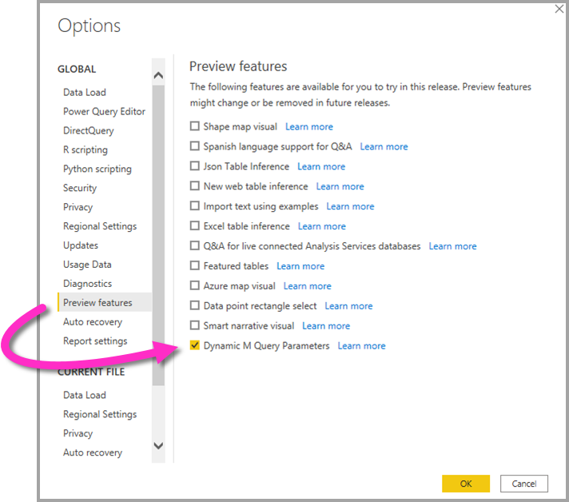

# <a name="dynamic-m-query-parameters-in-power-bi-desktop-preview"></a>พารามิเตอร์คิวรี M แบบไดนามิกใน Power BI Desktop (ตัวอย่าง)

ด้วย **พารามิเตอร์คิวรี M แบบไดนามิก** ผู้สร้างแบบจำลองสามารถให้ **ผู้ชมรายงาน** ใช้ตัวกรองหรือแบ่งส่วนข้อมูลเพื่อตั้งค่าสำหรับ [พารามิเตอร์คิวรี M](/power-query/power-query-query-parameters) ซึ่งจะเป็นประโยชน์อย่างยิ่งสำหรับการปรับแต่งประสิทธิภาพการทำงานของคิวรี ด้วยพารามิเตอร์คิวรี M แบบไดนามิกผู้สร้างแบบจำลองสามารถควบคุมเพิ่มวิธีการเลือกตัวกรองเพื่อรับการรวมเข้ากับคิวรีต้นทาง DirectQuery 

เมื่อผู้สร้างแบบจำลองเข้าใจตรรกะที่ตั้งใจไว้ของตัวกรอง พวกเขาก็จะทราบวิธีการเขียนคิวรีที่มีประสิทธิภาพกับแหล่งข้อมูลของพวกเขาและสามารถทำให้แน่ใจว่าการเลือกตัวกรองได้รับการรวมเข้ากับคิวรีแหล่งที่มาที่จุดที่เหมาะสมเพื่อให้ได้ผลลัพธ์ที่มีประสิทธิภาพที่ดีขึ้น

## <a name="enabling-dynamic-m-query-parameters"></a>การเปิดใช้งานพารามิเตอร์คิวรี M แบบไดนามิก

**พารามิเตอร์คิวรี M แบบไดนามิก** ขณะนี้อยู่ในการแสดงตัวอย่างและต้องเปิดใช้งานเพื่อใช้ เลือก **ไฟล์ > ตัวเลือกและการตั้งค่า > ตัวเลือก** แล้วเลือก **แสดงตัวอย่างคุณลักษณะ** ในบานหน้าต่างด้านซ้าย จากที่นั่นตรวจสอบให้แน่ใจว่ามีการเลือกกล่องกาเครื่องหมาย **แบบไดนามิก M พารามิเตอร์** คุณอาจจำเป็นต้องรีสตาร์ท Power BI Desktop เพื่อให้สามารถเปิดใช้งานการเปลี่ยนแปลงได้



ในฐานะที่เป็นข้อกำหนดเบื้องต้นสำหรับคุณลักษณะนี้คุณจะต้องสร้าง[พารามิเตอร์คิวรี M](/power-query/power-query-query-parameters) ที่ถูกต้อง และอ้างอิงในตารางคิวรีโดยตรงหนึ่งรายการหรือมากกว่า 

> [!NOTE]
> ตรวจสอบให้แน่ใจว่า ได้เลือกส่วน [ข้อควรพิจารณาและขีดจำกัด](#considerations-and-limitations) ในบทความนี้ เนื่องจากไม่ได้สนับสนุนแหล่งข้อมูล DirectQuery ทั้งหมดที่มีคุณลักษณะนี้

มาดำเนินการผ่านตัวอย่างสำหรับการส่งผ่าน **ค่าเดี่ยว** เป็นพารามิเตอร์แบบไดนามิก:

1. ใน Power BI Desktop เปิดใช้ **Power Query** จากแท็บ **ข้อมูล** และเลือก **พารามิเตอร์ใหม่** ภายใต้ปุ่ม **จัดการพารามิเตอร์** ใน ribbon

    

2. จากนั้นกรอกข้อมูลต่อไปนี้เกี่ยวกับพารามิเตอร์

    

3. คลิก **ใหม่** อีกครั้งถ้าคุณมีพารามิเตอร์เพิ่มเติมที่จะเพิ่ม

    

4. หลังจากที่คุณได้สร้างพารามิเตอร์แล้ว คุณสามารถอ้างอิงข้อมูลเหล่านั้นในคิวรี M ได้ หากต้องการปรับเปลี่ยนคิวรี M ให้เปิดตัวแก้ไขขั้นสูงในขณะที่คุณมีคิวรีที่คุณต้องการปรับเปลี่ยนเลือก:

    

5. ถัดไป อ้างอิงพารามิเตอร์ในคิวรี M ซึ่งเน้นเป็นสีเหลืองในรูปต่อไปนี้ 

    

6. หลังจากที่คุณได้สร้างพารามิเตอร์และอ้างอิงในคิวรี M ถัดไปคุณจะต้องสร้างตารางพร้อมคอลัมน์ที่มีค่าที่เป็นไปได้สำหรับพารามิเตอร์นั้น การดำเนินการนี้จะอนุญาตให้พารามิเตอร์ดังกล่าวได้รับการตั้งค่าแบบไดนามิกตามการเลือกตัวกรอง ในตัวอย่างนี้ เราต้องการ *StartTime* พารามิเตอร์ของเราและ พารามิเตอร์ของ *EndTime* เป็นแบบไดนามิก เนื่องจากพารามิเตอร์เหล่านี้ต้องใช้พารามิเตอร์วันที่/เวลา ฉันต้องการสร้างการป้อนข้อมูลวันที่ที่สามารถใช้ในการตั้งค่าวันที่สำหรับพารามิเตอร์ได้ ในการเริ่มต้น เราสร้างตารางใหม่:

    

7. นี่คือตารางแรกที่ฉันสร้างขึ้นสำหรับค่าสำหรับพารามิเตอร์ *StartTime*:

    ```StartDateTable = CALENDAR (DATE(2016,1,1), DATE(2016,12,31))```

    

8. นี่คือตารางที่สองที่ฉันสร้างขึ้นสำหรับค่าสำหรับพารามิเตอร์ EndTime:

    ```EndDateTable = CALENDAR (DATE(2016,1,1), DATE(2016,12,31))```

    

    > [!NOTE]
    > เราขอแนะนำให้ใช้ชื่อคอลัมน์อื่นที่ไม่ได้อยู่ในตารางจริง ถ้าเป็นชื่อเดียวกันค่าที่เลือกจะถูกนำไปใช้เป็นตัวกรองไปยังคิวรีจริง

9. หลังจากที่มีการสร้างตารางที่มีเขตข้อมูล *วันที่* แล้ว เราสามารถผูกเขตข้อมูลแต่ละรายการกับพารามิเตอร์ได้ การผูกเขตข้อมูลกับพารามิเตอร์หลักๆ หมายความว่าเป็นค่าที่เลือกสำหรับเขตข้อมูลเปลี่ยนแปลง ค่าจะได้รับการส่งผ่านไปยังพารามิเตอร์และปรับปรุงคิวรีที่มีการอ้างอิงพารามิเตอร์ ดังนั้นเมื่อต้องการผูกเขตข้อมูล ไปยังแท็บ **การสร้างรูปแบบ** เลือกเขตข้อมูลที่สร้างขึ้นใหม่ และจากนั้นไปยังคุณสมบัติ **ขั้นสูง**:

    > [!NOTE]
    > ชนิดข้อมูลคอลัมน์ควรตรงกับชนิดพารามิเตอร์ M

    

10. เลือกรายการแบบดรอปดาวน์ภายใต้ **ผูกกับพารามิเตอร์** และเลือกพารามิเตอร์ที่คุณต้องการผูกกับเขตข้อมูล:

    

    เนื่องจากตัวอย่างนี้มีไว้สำหรับค่าที่เลือกเพียงครั้งเดียว (การตั้งค่าพารามิเตอร์เป็นค่าเดียว) คุณต้องการเก็บการตั้งค่า **หลายรายการ** เป็น **ไม่** ซึ่งเป็นค่าเริ่มต้น:

    

    ถ้ากรณีการใช้งานของคุณจำเป็นต้องมีการเลือกหลายรายการ (ผ่านหลายค่าไปยังพารามิเตอร์เดียว) คุณต้องสลับสวิตช์เป็น **ใช่** และตรวจสอบให้แน่ใจว่าคิวรี M ของคุณถูกตั้งค่าอย่างถูกต้องเพื่อยอมรับหลายค่าในคิวรี M ต่อไปนี้เป็นตัวอย่างสำหรับ *RepoNameParameter* ซึ่งอนุญาตให้ใช้หลายค่า:

    

11. คุณสามารถทำซ้ำขั้นตอนเหล่านี้ถ้าคุณมีเขตข้อมูลอื่นๆที่จะผูกกับพารามิเตอร์อื่นๆ:

    

12. ในตอนท้ายคุณสามารถอ้างอิงเขตข้อมูลนี้ในตัวแบ่งส่วนหรือเป็นตัวกรอง:

    

ถ้ามีการตั้งค่าคอลัมน์ที่มีการแมปเป็น **ไม่** สำหรับการเลือกหลายรายการ คุณต้องใช้หนึ่งโหมดเลือกในตัวแบ่งส่วนข้อมูลหรือจำเป็นต้องเลือกเพียงครั้งเดียวในการ์ดตัวกรอง

## <a name="potential-security-risk"></a>การรักษาความปลอดภัยที่อาจเกิดขึ้น

เมื่อคุณอนุญาตให้ผู้อ่านรายงานสามารถตั้งค่าสำหรับพารามิเตอร์คิวรี M แบบไดนามิกพวกเขาอาจสามารถเข้าถึงข้อมูลเพิ่มเติมหรือทริกเกอร์การปรับเปลี่ยนไปยังระบบต้นทางโดยใช้ **การโจมตีการการฉีด** ได้โดยขึ้นอยู่กับวิธีที่พารามิเตอร์ถูกอ้างอิงในคิวรี M และค่าใดที่จะถูกส่งผ่านไปยังพารามิเตอร์นั้น

ตัวอย่างเช่นสมมติว่าคุณมีคิวรี Kusto ที่มีการกำหนดพารามิเตอร์ที่สร้างขึ้นดังต่อไปนี้:

```
Products
| where Category == [Parameter inserted here] & HasReleased == 'True'
 | project ReleaseDate, Name, Category, Region```
```

คุณอาจไม่มีปัญหากับผู้ใช้ที่เป็นมิตรซึ่งส่งผ่านค่าที่เหมาะสมสำหรับพารามิเตอร์ตัวอย่างเช่น *เกม*:

```
| where Category == 'Games' & HasReleased == 'True'
```

อย่างไรก็ตามผู้โจมตีอาจสามารถส่งผ่านค่าที่ปรับเปลี่ยนแบบสอบถามเพื่อรับการเข้าถึงข้อมูลเพิ่มเติมตัวอย่างเช่น *' เกม '//* :

```
Products
| where Category == 'Games'// & HasReleased == 'True'
| project ReleaseDate, Name, Category, Region
```

ในตัวอย่างนี้ผู้โจมตีสามารถเข้าถึงข้อมูลในเกมที่ยังไม่ได้เผยแพร่ได้โดยการเปลี่ยนแปลงส่วนของแบบสอบถามลงในข้อคิดเห็น

**วิธีการบรรเทาความเสี่ยง**

หากต้องการบรรเทาความเสี่ยงด้านความปลอดภัยจะดีที่สุดในการหลีกเลี่ยงการเรียงต่อกันของค่าพารามิเตอร์ M ในแบบสอบถาม  แทนที่จะใช้ค่าพารามิเตอร์เหล่านั้นในการดำเนินงาน M ที่พับไปยังคิวรีต้นฉบับเพื่อให้เครื่องยนต์ M และตัวเชื่อมต่อสร้างแบบสอบถามขั้นสุดท้าย อีกวิธีหนึ่งคือถ้าพร้อมใช้งานทำให้ใช้กลไกการส่งผ่านพารามิเตอร์ที่มีอยู่แล้วภายในไปยังภาษาและตัวเชื่อมต่อแบบสอบถามต้นทาง ตัวอย่างเช่น [Azure Data Explorer](/azure/data-explorer/kusto/query/queryparametersstatement?pivots=azuredataexplorer) มีความสามารถของพารามิเตอร์แบบสอบถามที่มีอยู่ภายในซึ่งได้รับการออกแบบมาเพื่อป้องกันการโจมตีการฉีด

นี่คือตัวอย่างบางรายการ:

* ตัวอย่างโดยใช้การดำเนินการกรองของแบบสอบถาม M:
    ```
    Table.SelectRows(Source, (r) =\&gt; r[Columns] = Parameter)
    ```

* ตัวอย่างจะประกาศพารามิเตอร์ในแบบสอบถามต้นทาง (หรือส่งผ่านค่าพารามิเตอร์เป็นข้อมูลป้อนเข้าไปยังฟังก์ชัน query ของแหล่งข้อมูล):
    ```
    declare query\_parameters (Name of Parameter : Type of Parameter);
    ```

## <a name="considerations-and-limitations"></a>ข้อควรพิจารณาและข้อจำกัด

มีข้อควรพิจารณาและขีดจำกัดบางอย่างที่ต้องพิจารณาเมื่อใช้พารามิเตอร์แบบสอบถาม M แบบไดนามิก:

* พารามิเตอร์เดียวไม่สามารถผูกกับหลายเขตข้อมูลหรือกลับกันได้
* คุณลักษณะนี้ได้รับการสนับสนุนสำหรับแหล่งข้อมูล M เท่านั้น แหล่งที่มาของ DirectQuery ต่อไปนี้ไม่ได้รับการสนับสนุน:
    * แหล่งข้อมูลที่ใช้ T-SQL: SQL Server, Azure SQL Database, พูล Synapse SQL (หรือคลังข้อมูล Azure SQL Data) และพูล Synapse SQL OnDemand
    * เชื่อมต่อกับแหล่งข้อมูลแบบสด: Azure Analysis Services, SQL Server Analysis Services, ชุดข้อมูล Power BI
    * แหล่งข้อมูลที่ไม่สนับสนุนอื่น ๆ: Oracle, Teradata และ SAP Hana เชิงสัมพันธ์
    * ได้รับการสนับสนุนบางส่วนผ่านความสามารถในการโปรแกรมจุดสิ้นสุด XMLA / TOM: SAP Business Warehouse และ SAP Hana 


* ชนิดพารามิเตอร์ที่ไม่ได้รับการสนับสนุนในกล่องมีดังต่อไปนี้:
  * ใดก็ตาม
  * ระยะเวลา
  * จริง/เท็จ
  * ข้อมูลไบนารี

* ตัวกรองที่ไม่สนับสนุน:
  * ตัวแบ่งส่วนข้อมูลเวลาที่สัมพันธ์กัน
  * วันที่สัมพัทธ์
  * ตัวแบ่งส่วนข้อมูลลำดับชั้น
  * หลายเขตข้อมูลรวมตัวกรอง
  * ไม่รวมตัวกรอง/ไม่มีตัวกรอง
  * ไฮไลต์เชื่อมโยง
  * ตัวกรองการดูรายละเอียดแนวลึก
  * ตัวกรองการเจาะข้าม
  * ตัวกรอง N ยอดนิยม
* การดำเนินการที่ไม่สนับสนุน:
  * And
  * ประกอบด้วย
  * น้อยกว่า
  * มากกว่า
  * เริ่มต้นด้วย
  * ไม่ได้เริ่มต้นด้วย
  * ไม่ใช่
  * ไม่มี
  * เลือกทั้งหมด
  * ว่างเปล่า
  * ไม่เว้นว่าง


## <a name="next-steps"></a>ขั้นตอนถัดไป

คุณสามารถทำการเรียงลำดับของของต่างๆ ด้วย Power BI Desktop สำหรับข้อมูลเพิ่มเติมเกี่ยวกับขีดความสามารถ กรุณาดูแหล่งทรัพยากรต่อไปนี้:

* [เกี่ยวกับการใช้ DirectQuery ใน Power BI](desktop-directquery-about.md)
* [Power BI Desktop คืออะไร](../fundamentals/desktop-what-is-desktop.md)
* [ภาพรวมคำถามด้วย Power BI Desktop](../transform-model/desktop-query-overview.md)
* [ชนิดข้อมูลใน Power BI Desktop](desktop-data-types.md)
* [จัดรูปร่างและรวมข้อมูลด้วย Power BI Desktop](desktop-shape-and-combine-data.md)
* [งานแบบสอบถามทั่วไปใน Power BI Desktop](../transform-model/desktop-common-query-tasks.md)