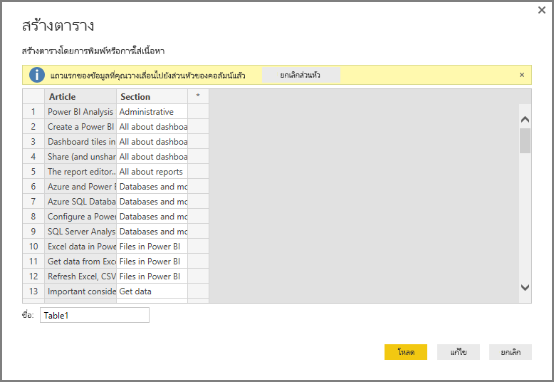
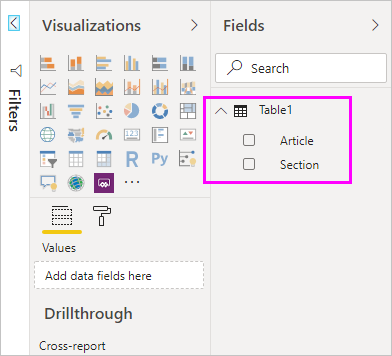

# ใส่ข้อมูลโดยตรงลงใน Power BI DesktopEnter data directly into Power BI Desktop

ด้วย Power BI Desktop คุณก็สามารถใส่ข้อมูลได้โดยตรง และใช้ข้อมูลนั้นในรายงานและการแสดงภาพของคุณWith Power BI Desktop, you can enter data directly and use that data in your reports and visualizations. ตัวอย่างเช่น คุณสามารถคัดลอกเวิร์กบุ๊กหรือเว็บเพจบางส่วน จากนั้นวางลงใน Power BI DesktopFor example, you can copy portions of a workbook or web page, then paste it into Power BI Desktop.

เมื่อต้องการใส่ข้อมูลลงใน Power BI Desktop โดยตรงในรูปแบบของตารางใหม่ให้ **เลือกป้อนข้อมูล** จาก ribbon **หน้าแรก**To enter data directly into Power BI Desktop in the form of a new table, select **Enter Data** from the **Home** ribbon.

Power BI Desktop อาจพยายามทำการเปลี่ยนแปลงข้อมูลเพียงเล็กน้อยตามความเหมาะสม ในลักษณะเดียวกับที่ดำเนินการ เมื่อคุณโหลดข้อมูลจากแหล่งข้อมูลต่างๆPower BI Desktop may attempt to make minor transformations on the data, if appropriate, just like it does when you load data from any source. ตัวอย่างเช่น ในกรณีต่อไปนี้ จะมีการเลื่อนระดับแถวแรกของข้อมูลในหัวกระดาษFor example, in the following case it promoted the first row of data to headers.

หากคุณต้องการทำให้ข้อมูลเป็นรูปร่างให้คุณป้อนหรือวาง เลือก **แก้ไข** เพื่อเปิด **ตัวแก้ไขแบบสอบถาม**.If you want to shape the data you entered or pasted, select **Edit** to open **Query Editor**. คุณสามารถทำให้เป็นรูปร่างและเปลี่ยนรูปข้อมูลก่อนนำเข้าไปสู่ Power BI DesktopYou can shape and transform the data before bringing it into Power BI Desktop. เลือก **โหลด** เพื่อนำเข้าข้อมูลที่ปรากฏSelect **Load** to import the data as it appears.

เมื่อคุณเลือก **โหลด** Power BI Desktop จะสร้างตารางใหม่จากข้อมูลของคุณ และทำให้ตาารางพร้อมใช้งานในบานหน้าต่าง **เขตข้อมูล**When you select **Load**, Power BI Desktop creates a new table from your data, and makes it available in the **Fields** pane. ในรูปต่อไปนี้ Power BI Desktop จะแสดงตารางใหม่ของฉัน ซึ่งเรียกว่า *ตารางที่ 1* และเขตข้อมูลสองรายการภายในตารางดังกล่าวที่สร้างขึ้นIn the following image, Power BI Desktop shows my new table, called *Table1*, and the two fields within that table that were created.

เท่านี้ก็เรียบร้อย!And that’s it. เพียงเท่านี้เองในการป้อนข้อมูลเข้าไปใน Power BI DesktopIt's that easy to enter data into Power BI Desktop.

ตอนนี้คุณพร้อมใช้ข้อมูลใน Power BI Desktop แล้วYou're now ready to use the data in Power BI Desktop. คุณสามารถสร้างวิชวล รายงาน หรือโต้ตอบกับข้อมูลอื่น ๆ ที่คุณอาจต้องการเชื่อมต่อและนำเข้า เช่น เวิร์กบุ๊ก Excel, ฐานข้อมูล หรือแหล่งข้อมูลอื่นYou can create visuals, reports, or interact with any other data you might want to connect with and import, such as Excel workbooks, databases, or any other data source.

## ขั้นตอนถัดไปNext steps

มีข้อมูลหลากหลายประเภทที่คุณสามารถเชื่อมต่อโดยใช้ Power BI DesktopThere are all sorts of data you can connect to using Power BI Desktop. สำหรับข้อมูลเพิ่มเติมเกี่ยวกับแหล่งข้อมูล โปรดดูทรัพยากรต่อไปนี้:For more information on data sources, check out the following resources:

* [Power BI Desktop คืออะไรWhat is Power BI Desktop?](../fundamentals/desktop-what-is-desktop.md)
* [แหล่งข้อมูลใน Power BI DesktopData sources in Power BI Desktop](desktop-data-sources.md)
* [จัดรูปร่างและรวมข้อมูลด้วย Power BI DesktopShape and combine data with Power BI Desktop](desktop-shape-and-combine-data.md)
* [เชื่อมต่อกับเวิร์กบุ๊ก Excel ใน Power BI DesktopConnect to Excel workbooks in Power BI Desktop](desktop-connect-excel.md)
* [เชื่อมต่อกับไฟล์ CSV ใน Power BI DesktopConnect to CSV files in Power BI Desktop](desktop-connect-csv.md)
