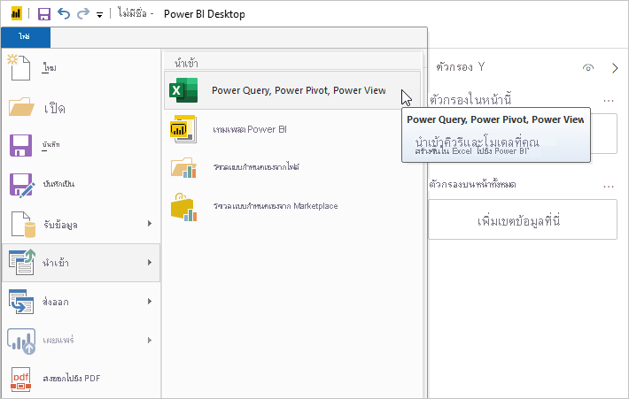
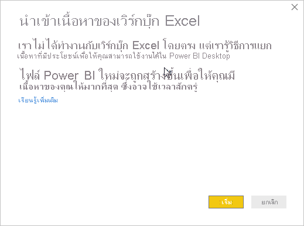
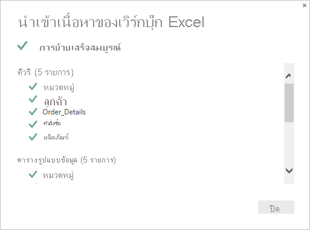
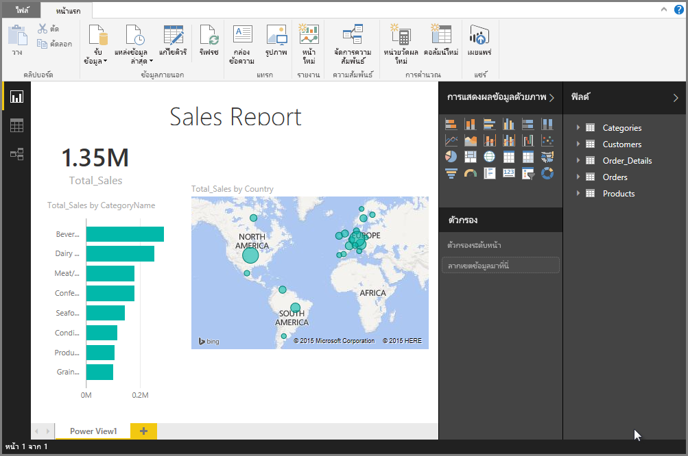

# นำเข้าสมุดงาน Excel ลงใน Power BI DesktopImport Excel workbooks into Power BI Desktop
ด้วย Power BI Desktop คุณจะสามารถนำเข้าเวิร์กบุ๊กของ Excel ที่มีคิวรีของ Power Query แบบจำลอง Power Pivot แผ่นงานของ Power View ลงใน Power BI Desktop ได้อย่างง่ายดายWith Power BI Desktop, you can easily import Excel workbooks that contain Power Query queries, Power Pivot models, and Power View worksheets into Power BI Desktop. Power BI Desktop จะสร้างรายงานและการจัดรูปแบบการแสดงข้อมูลโดยอัตโนมัติโดยยึดตามเวิร์กบุ๊ก ExcelPower BI Desktop automatically creates reports and visualizations based on the Excel workbook. หลังจากนำเข้าแล้ว คุณสามารถปรับปรุงรายงานเหล่านั้นต่อด้วย Power BI Desktop โดยใช้คุณลักษณะที่มีอยู่และคุณลักษณะใหม่ที่เผยแพร่ในอัปเดตประจำเดือนของ Power BI DesktopOnce imported, you can continue to improve and refine those reports with Power BI Desktop, using the existing features and new features released with each Power BI Desktop monthly update.

## ฉันนำเข้าเวิร์กบุ๊ก Excel ได้อย่างไร?How do I import an Excel workbook?
1. หากต้องการนำเข้าเวิร์กบุ๊ก Excel ลงใน Power BI Desktop เลือก **ไฟล์** > **นำเข้า** > **Power Query, Power Pivot, Power View**To import an Excel workbook into Power BI Desktop, select **File** > **Import** > **Power Query, Power Pivot, Power View**.

   

2. จากหน้าต่าง **เปิด** เลือกเวิร์กบุ๊ก Excel ที่จะนำเข้าFrom the **Open** window, select an Excel workbook to import. 

   ขณะนี้ ยังไม่มีการจำกัดขนาดหรือจำนวนของวัตถุในเวิร์กบุ๊ก แต่เวิร์กบุ๊กขนาดใหญ่ทำให้ Power BI Desktop ใช้เวลานานในการวิเคราะห์ และนำเข้าAlthough there's currently no limitation on the size or number of objects in the workbook, larger workbooks take longer for Power BI Desktop to analyze and import.

   > [!NOTE]
   > หากต้องการโหลด หรือนำเข้าไฟล์ Excel จากโฟลเดอร์ OneDrive for Business ที่แชร์ หรือจากโฟลเดอร์ Microsoft 365 Group ให้ใช้ URL ของไฟล์ Excel และการป้อนข้อมูลลงในแหล่งข้อมูลในเว็บ Power BI DesktopTo load or import Excel files from shared OneDrive for Business folders or from Microsoft 365 group folders, use the URL of the Excel file, and input it into the Web data source in Power BI Desktop. มีสองสามขั้นตอนที่คุณจำเป็นต้องทำตาม เพื่อจัดรูปแบบ URL ของ OneDrive for Business ให้ถูกต้อง สำหรับข้อมูลและชุดขั้นตอนที่ถูกต้อง ดู [ใช้การเชื่อมโยง OneDrive for Business ใน Power BI Desktop](desktop-use-onedrive-business-links.md)There are a few steps you need to follow to properly format the OneDrive for Business URL; for information and the correct series of steps, see [Use OneDrive for Business links in Power BI Desktop](desktop-use-onedrive-business-links.md).
   > 
   > 

3. จากกล่องโต้ตอบนำเข้าที่ปรากฏขึ้น เลือก **เริ่ม**From the import dialog box that appears, select **Start**.

   

   Power BI Desktop จะวิเคราะห์เวิร์กบุ๊ก และแปลงเป็นไฟล์ Power BI Desktop (.pbix)Power BI Desktop analyzes the workbook and converts it into a Power BI Desktop file (.pbix). การดำเนินการนี้ เป็นเหตุการณ์แบบครั้งเดียว เมื่อไฟล์ Power BI Desktop ถูกสร้างด้วยขั้นตอนเหล่านี้แล้ว ไฟล์ Power BI Desktop จะไม่ขึ้นกับเวิร์กบุ๊ก Excel เดิมอีกต่อไป และสามารถปรับเปลี่ยน บันทึก และแชร์โดยไม่มีผลต่อเวิร์กบุ๊กเดิมThis action is a one-time event; once the Power BI Desktop file is created with these steps, the Power BI Desktop file has no dependence on the original Excel workbook, and can be modified, saved, and shared without affecting the original workbook.

   เมื่อการนำเข้าเสร็จสมบูรณ์ หน้าสรุปจะแสดงรายการที่ถูกแปลง และรายการที่ไม่สามารถนำเข้าได้After the import is finished, a summary page appears that describes the items that were converted, and also lists any items that couldn't be imported.

   

4. เลือก **ปิด**Select **Close**. 

   Power BI Desktop นำเข้าเวิร์กบุ๊ก Excel และโหลดรายงานที่ยึดตามเนื้อหาของเวิร์กบุ๊กPower BI Desktop imports the Excel workbook and loads a report based on the workbook contents.

   

หลังจากนำเข้าเวิร์กบุ๊กแล้ว คุณจะสามารถทำงานบนรายงานดังกล่าวต่อAfter the workbook is imported, you can continue working on the report. คุณสามารถสร้างการแสดงภาพใหม่ เพิ่มข้อมูล หรือสร้างหน้ารายงานใหม่โดยการใช้คุณลักษณะหรือความสามารถใดๆ ที่รวมอยู่ใน Power BI DesktopYou can create new visualizations, add data, or create new report pages by using any of the features and capabilities included in Power BI Desktop.

## องค์ประกอบไหนของเวิร์กบุ๊กที่ถูกนำเข้า?Which workbook elements are imported?
Power BI Desktop สามารถนำเข้าองค์ประกอบต่อไปนี้ ซึ่งมักเรียกว่า *วัตถุ* ใน ExcelPower BI Desktop can import the following elements, commonly referred to as *objects*, in Excel.

| วัตถุในเวิร์กบุ๊กของ ExcelObject in Excel workbook | ผลลัพธ์สุดท้ายในไฟล์ Power BI DesktopFinal result in Power BI Desktop file |
| --- | --- |
| คิวรี Power QueryPower Query queries |คิวรี Power Query ทั้งหมดจาก Excel จะถูกแปลงเป็นคิวรีใน Power BI DesktopAll Power Query queries from Excel are converted to queries in Power BI Desktop. หากมีกลุ่มคิวรีกำหนดไว้ในเวิร์กบุ๊ก Excel จะการทำสำเนาโครงสร้างดังกล่าวใน Power BI DesktopIf there are query groups defined in the Excel Workbook, the same organization is replicated in Power BI Desktop. คิวรีทั้งหมดจะถูกโหลด เว้นแต่ว่าจะถูกตั้งค่าเป็น **สร้างเฉพาะการเชื่อมต่อเท่านั้น** ในกล่องโต้ตอบของ Excel **นำเข้าข้อมูล**All queries are loaded unless they're set to **Only Create Connection** in the **Import Data** Excel dialog box. รูปแบบการโหลดสามารถกำหนดเองโดยการเลือก **คุณสมบัติ** จากแท็บ **หน้าแรก** ของตัวแก้ไข Power Query ใน Power BI Desktop ได้The load behavior is customized by selecting **Properties** from the **Home** tab of Power Query Editor in Power BI Desktop. |
| การเชื่อมต่อข้อมูลภายนอกของ Power PivotPower Pivot external data connections |การเชื่อมต่อข้อมูลภายนอกของ Power Pivot ทั้งหมดถูกแปลงเป็นคิวรีใน Power BI DesktopAll Power Pivot external data connections are converted to queries in Power BI Desktop. |
| ตารางที่เชื่อมโยงหรือตารางเวิร์กบุ๊กปัจจุบันLinked tables or current workbook tables |หากมีตารางแผ่นงานใน Excel ที่เชื่อมโยงกับแบบจำลองข้อมูล หรือเชื่อมโยงกับคิวรี (โดยใช้ฟังก์ชัน *จากตาราง* หรือ *Excel.CurrentWorkbook()* ใน M) ตัวเลือกต่อไปนี้จะปรากฏขึ้น:If there's a worksheet table in Excel linked to the data model, or linked to a query (by using *From Table* or the *Excel.CurrentWorkbook()* function in M), the following options are presented: <ol><li><b>นำเข้าตารางไปยังไฟล์ของ Power BI Desktop</b><b>Import the table to the Power BI Desktop file</b>. ตารางนี้เป็นสแนปช็อตครั้งเดียวของข้อมูล หลังจากที่ข้อมูลเป็นแบบอ่านอย่างเดียวในตารางใน Power BI DesktopThis table is a one-time snapshot of the data, after which the data is read-only in the table in Power BI Desktop. มีข้อจำกัดขนาดที่ 1 ล้านตัวอักษร (รวมส่วนหัวของคอลัมน์และเซลล์ทั้งหมด) สำหรับตารางที่สร้างขึ้นโดยใช้ตัวเลือกนี้There's a size limitation of 1 million characters (total, combining all column headers and cells) for tables created using this option.</li><li><b>คงการเชื่อมต่อไปยังเวิร์กบุ๊กเดิม</b><b>Keep a connection to the original workbook</b>. อีกทางเลือกหนึ่งคือ คุณสามารถคงการเชื่อมต่อไปยังเวิร์กบุ๊ก Excel เดิม และ Power BI Desktop จะดึงข้อมูลล่าสุดในตารางนี้ในการรีเฟรชแต่ละครั้ง เช่นเดียวกับคิวรีอื่นใด ๆ ที่สร้างขึ้นจากเวิร์กบุ๊ก Excel ใน Power BI DesktopAlternatively, you can keep a connection to the original Excel Workbook and Power BI Desktop retrieves the latest content in this table with each refresh, just like any other query created against an Excel workbook in Power BI Desktop.</li></ul> |
| คอลัมน์จากการคำนวณ, หน่วยวัด, KPI, ประเภทข้อมูล และความสัมพันธ์ของรูปแบบข้อมูลData model calculated columns, measures, KPIs, data categories, and relationships |วัตถุรูปแบบข้อมูลเหล่านี้จะถูกแปลงเป็นวัตถุเทียบเท่าใน Power BI DesktopThese data model objects are converted to the equivalent objects in Power BI Desktop. สังเกตว่า มีบางประเภทข้อมูลที่ยังไม่มีใน Power BI Desktop เช่น รูปภาพNote there are certain data categories that aren't available in Power BI Desktop, such as Image. ในกรณีเหล่านี้ ข้อมูลของประเภทข้อมูลจะถูกล้างค่าสำหรับคอลัมน์ดังกล่าวIn these cases, the data category information is reset for the columns in question. |
| แผ่นงาน Power ViewPower View worksheets |หน้ารายงานใหม่จะถูกสร้างขึ้นสำหรับแต่ละแผ่นงาน Power View ใน ExcelA new report page is created for each Power View worksheet in Excel. ชื่อและลำดับของหน้ารายงานเหล่านี้จะตรงกับเวิร์กบุ๊ก Excel เดิมThe name and order of these report pages match the original Excel workbook. |

## มีข้อจำกัดในการนำเข้าเวิร์กบุ๊กหรือไม่?Are there any limitations to importing a workbook?
มีข้อจำกัดบางอย่างเมื่อต้องการนำเข้าเวิร์กบุ๊กไปยัง Power BI Desktop:There are a few limitations to importing a workbook into Power BI Desktop:

* **การเชื่อมต่อภายนอกไปยังรูปแบบตาราง SQL Server Analysis Services:** ใน Excel 2013 สามารถสร้างการเชื่อมต่อกับรูปแบบตารางของ SQL Server Analysis Services ได้แล้ว และสร้างรายงาน Power View ไว้ด้านบนรูปแบบเหล่านี้ได้โดยไม่จำเป็นต้องนำเข้าข้อมูล**External connections to SQL Server Analysis Services tabular models:** In Excel 2013, it's possible to create a connection to SQL Server Analysis Services tabular models and create Power View reports on top of these models without the need to import the data. การเชื่อมต่อชนิดนี้ ในขณะนี้ยังไม่รองรับให้เป็นส่วนหนึ่งของการนำเข้าเวิร์กบุ๊ก Excel ลงใน Power BI DesktopThis type of connection is currently not supported as part of importing Excel workbooks into Power BI Desktop. ในระหว่างนี้ คุณต้องสร้างการเชื่อมต่อภายนอกเหล่านี้ใน Power BI Desktop ใหม่As a workaround, you must recreate these external connections in Power BI Desktop.
* **ลำดับชั้น:** ในขณะนี้ ยังไม่มีการรองรับวัตถุรูปแบบข้อมูลดังกล่าวใน Power BI Desktop**Hierarchies:** This type of data model object is currently not supported in Power BI Desktop. ดังนั้น ลำดับชั้นจะถูกข้ามไปตอนนำเข้าเวิร์กบุ๊ก Excel ลงใน Power BI DesktopAs such, hierarchies are skipped as part of importing an Excel workbook into Power BI Desktop.
* **คอลัมน์ข้อมูลไบนารี:** ในขณะนี้ ยังไม่มีการรองรับคอลัมน์รูปแบบข้อมูลดังกล่าวใน Power BI Desktop**Binary data columns:** This type of data model column is currently not supported in Power BI Desktop. คอลัมน์ข้อมูลไบนารีจะถูกเอาออกจากตารางผลลัพธ์ใน Power BI DesktopBinary data columns are removed from the resulting table in Power BI Desktop.
* **องค์ประกอบ Power View ที่ยังไม่มีการรองรับ:** ยังมีบางคุณลักษณะใน Power View ที่ไม่มีการรองรับใน Power BI Desktop เช่น ธีม หรือการแสดงภาพบางชนิด (แผนภูมิกระจายที่มีแกนเคลื่อนไหว ลักษณะการดูรายละเอียดแนวลึก ฯลฯ)**Unsupported Power View elements:** There are a few features in Power View that aren't available in Power BI Desktop, such as themes or certain types of visualizations (scatter chart with play axis, drill-down behaviors, and so on). แสดงภาพเหล่านี้ จะแสดงเป็นข้อความ *ไม่สนับสนุนการแสดงภาพ* บนตำแหน่งของวิชวลในการรายงาน Power BI Desktop ซึ่งคุณสามารถลบ หรือกำหนดค่าใหม่ตามความจำเป็นThese unsupported visualizations result in *Unsupported Visualization* messages on their corresponding locations in the Power BI Desktop report, which you can delete or reconfigure as needed.
* **การใช้ระยะที่ตั้งชื่อ** **_จากตาราง_ *_ _* ใน Power Query หรือใช้** **_Excel.CurrentWorkbook_ *_ _* ใน M:** การนำเข้าข้อมูลในระยะที่ตั้งชื่อนี้ยังไม่มีการรองรับใน Power BI Desktop แต่มีแผนที่จะรองรับในการอัปเดต**Named Ranges using** **_From Table_*_ _\* in Power Query, or using*\* **_Excel.CurrentWorkbook_*_ _\* in M:*\* Importing this named range data into Power BI Desktop isn't currently supported, but it's a planned update. ในปัจจุบัน ระยะที่ตั้งชื่อเหล่านี้จะโหลดลงใน Power BI Desktop เป็นรูปการเชื่อมต่อไปยังเวิร์กบุ๊ก Excel ภายนอกแทนCurrently, these named ranges are loaded into Power BI Desktop as a connection to the external Excel workbook.
* **PowerPivot ไป SSRS:** การเชื่อมต่อภายนอกของ PowerPivot กับ SQL Server Reporting Services (SSRS) ยังไม่ได้รับการสนับสนุน เนื่องจากแหล่งข้อมูลนั้นยังไม่มีใน Power BI Desktop**PowerPivot to SSRS:** PowerPivot external connections to SQL Server Reporting Services (SSRS) aren't currently supported, because that data source isn't currently available in Power BI Desktop.

