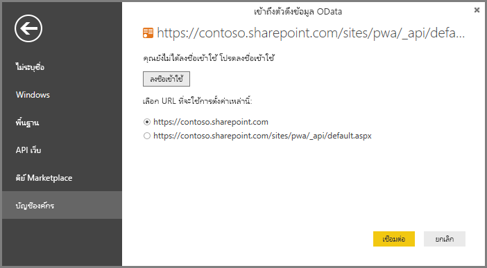

# เชื่อมต่อกับข้อมูล Project Online ผ่าน Power BI DesktopConnect to Project Online data through Power BI Desktop
คุณสามารถเชื่อมต่อไปยังข้อมูลใน Project Online ผ่านทาง Power BI DesktopYou can connect to data in Project Online through Power BI Desktop.

## ขั้นตอนที่ 1: ดาวน์โหลด Power BI DesktopStep 1: Download Power BI Desktop
1. [ดาวน์โหลด Power BI Desktop](https://go.microsoft.com/fwlink/?LinkID=521662) แล้วเรียกใช้ตัวติดตั้งเพื่อรับ **Power BI Desktop** บนคอมพิวเตอร์ของคุณ[Download Power BI Desktop](https://go.microsoft.com/fwlink/?LinkID=521662), then run the installer to get **Power BI Desktop** on your computer.

## ขั้นตอนที่ 2: เชื่อมต่อกับ Project Online ด้วย ODataStep 2: Connect to Project Online with OData
1. เปิด **Power BI Desktop**Open **Power BI Desktop**.
2. บนหน้าจอ *ยินดีต้อนรับ* เลือก **รับข้อมูล**On the *Welcome* screen, select **Get Data**.
3. เลือก **ตัวดึงข้อมูล OData** และเลือก **เชื่อมต่อ**Choose **OData feed** and select **Connect**.
4. ใส่ที่อยู่ของตัวดึงข้อมูล OData ของคุณในกล่อง URL แล้ว คลิกตกลงEnter the address for your OData feed in the URL box, and then click OK.
   
   หากที่อยู่สำหรับไซต์ Project Web App ของคุณเป็นรูปแบบ *https://\<tenantname\>.sharepoint.com/sites/pwa* จากนั้นที่อยู่ที่คุณจะป้อนใส่สำหรับฟีด OData ของคุณคือ *https://\<tenantname\>.sharepoint.com/sites/pwa/\_api/Projectdata*If the address for your Project Web App site resembles *https://\<tenantname\>.sharepoint.com/sites/pwa*, then the address you’ll enter for your OData Feed is *https://\<tenantname\>.sharepoint.com/sites/pwa/\_api/Projectdata*.
   
   สำหรับตัวอย่าง เรากำลังใช้:For our example, we’re using:

    `https://contoso.sharepoint.com/sites/pwa/default.aspx`

5. Power BI Desktop จะพร้อมท์ให้คุณรับรองสิทธิ์กับบัญชีที่ทำงานหรือบัญชีโรงเรียนของคุณPower BI Desktop will prompt you to authenticate with your work or school account. เลือกบัญชีผู้ใช้ขององค์กร แล้วใส่ข้อมูลประจำตัวของคุณSelect Organizational account and then enter your credentials.
   
   

บัญชีที่คุณใช้เพื่อเชื่อมต่อกับตัวดึงข้อมูล OData อย่างน้อยต้องมีตัวแสดงพอร์ตโครงการเพื่อข้าถึงไซต์ Project Web AppThe account you use to connect to the OData feed must have at least Portfolio Viewer access to the Project Web App site. 

จากที่นี่ คุณสามารถเลือกตารางที่คุณต้องการจะเชื่อมต่อและสร้างแบบสอบถามFrom here, you can choose which tables you would like to connect to and build a query.  อยากทราบวิธีการเริ่มต้นใช้งานใช่หรือไม่Want an idea of how to get started?  โพสต์ในบล็อกต่อไปนี้จะแสดงวิธีการสร้างแผนภูมิการวัดความก้าวหน้าจากข้อมูล Project Online ของคุณThe following blog post shows how to build a burn down chart from your Project Online data.  โพสต์ในบล็อกจะอ้างอิงเกี่ยวกับการใช้ Power Query เพื่อเชื่อมต่อกับ Project Online แต่ยังสามารถใช้กับ Power BI Desktop ได้เช่นกันThe blog post refers to using Power Query to connect to Project Online, but this applies to Power BI Desktop as well.

[สร้างแผนภูมิการวัดความก้าวหน้าสำหรับโครงการโดยใช้ Power Pivot และ Power QueryCreating burn down charts for Project using Power Pivot and Power Query](https://blogs.office.com/2014/03/24/creating-burndown-charts-for-project-using-power-pivot-and-power-query/)

