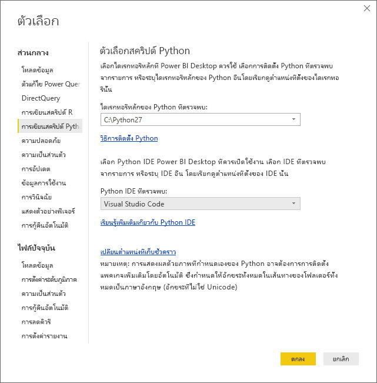

# ใช้ Python IDE ภายนอกกับ Power BIUse an external Python IDE with Power BI
ด้วย **Power BI Desktop** คุณสามารถใช้ Python IDE ภายนอกของคุณ (สภาพแวดล้อมรวมเพื่อการพัฒนา) เพื่อสร้าง และปรับปรุงสคริปต์ Python แล้วจะใช้สคริปต์เหล่านั้นใน Power BI ได้With **Power BI Desktop**, you can use your external Python IDE (Integrated Development Environment) to create and refine Python scripts, then use those scripts in Power BI.

## เปิดใช้งานการ Python IDE ภายนอกEnable an external Python IDE
คุณสามารถเปิดใช้ของคุณ Python IDE ภายนอกจาก **Power BI Desktop** และจะนำเข้าข้อมูลของคุณโดยอัตโนมัติ และแสดงใน Python IDEYou can launch your external Python IDE from **Power BI Desktop** and have your data automatically imported and displayed in the Python IDE. จากที่นั่น คุณสามารถปรับเปลี่ยนสคริปต์ใน Python IDE ภายนอก จากนั้นวางกลับลงใน **Power BI Desktop** เพื่อสร้างวิชวลและรายงาน Power BI ได้From there, you can modify the script in that external Python IDE, then paste it back into **Power BI Desktop** to create Power BI visuals and reports.

คุณสามารถระบุว่าต้องการใช้ Python IDE แบบใดและเปิดใช้งานได้โดยอัตโนมัติภายใน **Power BI Desktop** หรือไม่You can specify which Python IDE you would like to use, and have it launch automatically from within **Power BI Desktop**.

### ข้อกำหนดRequirements
เมื่อต้องใช้คุณลักษณะนี้ คุณจำเป็นต้องติดตั้ง **Python IDE** บนเครื่องคอมพิวเตอร์ของคุณTo use this feature, you need to install a **Python IDE** on your local computer. **Power BI Desktop** ไม่รวมการนำเข้าใช้หรือการติดตั้ง Python engine ดังนั้นคุณต้องติดตั้ง **Python** แบบบนเครื่องคอมพิวเตอร์ของคุณแบบแยกต่างหาก**Power BI Desktop** does not include, deploy, or install the Python engine, so you must separately install **Python** on your local computer. คุณสามารถเลือก Python IDE ที่จะใช้ ด้วยตัวเลือกต่อไปนี้:You can choose which Python IDE to use, with the following options:

* คุณสามารถติดตั้ง Python IDE ตัวโปรดของคุณ ซึ่งมีจำนวนมากที่ใช้งานฟรี เช่น [หน้าดาวน์โหลด Visual Studio Code](https://code.visualstudio.com/download/)You can install your favorite Python IDE, many of which are available for free, such as the [Visual Studio Code download page](https://code.visualstudio.com/download/).
* **Power BI Desktop** ยังรองรับ **Visual Studio** อีกด้วย**Power BI Desktop** also supports **Visual Studio**.
* นอกจากนี้คุณยังสามารถติดตั้ง Python IDE ที่แตกต่างกันและมี **Power BI Desktop** ซึ่งเปิดใช้งานที่ **Python IDE** โดยทำอย่างใดอย่างหนึ่งต่อไปนี้ได้อีกด้วย:You can also install a different Python IDE and have **Power BI Desktop** launch that **Python IDE** by doing one of the following:
  
  * คุณสามารถเชื่อมโยงไฟล์ **.PY** จาก IDE ภายนอกที่คุณต้องการเปิดใช้งาน **Power BI Desktop**You can associate **.PY** files with the external IDE you want **Power BI Desktop** to launch.
  * คุณสามารถระบุไฟล์ .exe ที่ **Power BI Desktop** ควรเปิดใช้งานโดยเลือก *อื่น ๆ* จากส่วน **ตัวเลือกสคริปต์ Python** ในกล่องโต้ตอบ **ตัวเลือก**You can specify the .exe that **Power BI Desktop** should launch by selecting *Other* from the **Python Script Options** section of the **Options** dialog. คุณสามารถนำกล่องโต้ตอบ **ตัวเลือก** โดยไปที่ **ไฟล์ > ตัวเลือกและการตั้งค่า > ตัวเลือก**You can bring up the **Options** dialog by going to **File > Options and settings > Options**.
    
    

ถ้าคุณติดตั้ง Python IDE หลายตัว คุณสามารถระบุได้ว่าจะเปิดตัวใด โดยการเลือกเมนูดรอปดาวน์ *Python IDE ที่ตรวจพบ* ในกล่องโต้ตอบ **ตัวเลือก**If you have multiple Python IDEs installed, you can specify which will be launched by selecting it from the *Detected Python IDEs* drop-down in the **Options** dialog.

โดยค่าเริ่มต้น **Power BI Desktop** จะเรียกใช้งาน **Visual Studio Code** เป็น IDE ภายนอกของ Python หากมีการติดตั้งไว้ในเครื่องคอมพิวเตอร์ของคุณ ถ้าไม่ได้มีการติดตั้ง **Visual Studio Code** และคุณมี **Visual Studio** โปรแกรมนี้จะเริ่มทำงานแทนBy default, **Power BI Desktop** will launch **Visual Studio Code** as the external Python IDE if it's installed on your local computer; if **Visual Studio Code** is not installed and you have **Visual Studio**, that will be launched instead. ถ้าไม่มีการติดตั้ง Python IDE อยู่เลย แอปพลิเคชันที่เชื่อมโยงกับไฟล์  **.PY** จะถูกเปิดใช้งานIf neither of those Python IDEs is installed, the application associated with **.PY** files is launched.

และถ้าหากไม่มีความสัมพันธ์ของไฟล์ **.PY** อาจเป็นไปได้ที่จะต้องระบุเส้นทางไปยัง IDE แบบกำหนดเอง ใน *เรียกดู Python IDE ที่คุณต้องการ* ส่วนของ **กล่องโต้ตอบ** ตัวเลือกAnd if no **.PY** file association exists, it's possible to specify a path to a custom IDE in the *Browse to your preferred Python IDE* section of the **Options** dialog. คุณยังสามารถเปิดใช้ Python IDE อื่น โดยการเลือกไอคอนรูปเฟืองด้านข้าง **ตั้งค่า** **เปิดใช้ไอคอนลูกศรของ Python IDE** ใน **Power BI Desktop**You can also launch a different Python IDE by selecting the **Settings** gear icon beside the **Launch Python IDE** arrow icon, in **Power BI Desktop**.

## เปิดใช้งาน Python IDE จาก Power BI DesktopLaunch a Python IDE from Power BI Desktop
เมื่อต้องการเปิดใช้งาน Python IDE จาก **Power BI Desktop** ให้ทำตามขั้นตอนต่อไปนี้:To launch a Python IDE from **Power BI Desktop**, take the following steps:

1. โหลดข้อมูลลงใน **Power BI Desktop**Load data into **Power BI Desktop**.
2. เลือกเขตข้อมูลบางอย่างจากบานหน้าต่าง **เขตข้อมูล** ที่คุณต้องการใช้งานSelect some fields from the **Fields** pane that you want to work with. ถ้าคุณยังไม่ได้เปิดใช้งานรูปของสคริปต์ คุณจะได้ถูกถามให้ทำเช่นนั้นIf you haven't enabled script visuals yet, you'll be prompted to do so.
   
   
3. เมื่อเปิดใช้งานวิชวลของสคริปต์ คุณจะสามารถเลือกรูป Python จากบานหน้าต่าง **การแสดงวิชวล** ซึ่งสร้างวิชวล Python แบบว่างที่พร้อมที่จะแสดงผลลัพธ์ของสคริปต์ของคุณWhen script visuals are enabled, you can select a Python visual from the **Visualizations** pane, which creates a blank Python visual that's ready to display the results of your script. บานหน้าต่าง **ตัวแก้ไขสคริปต์ Python** จะปรากฏขึ้นThe **Python script editor** pane also appears.
   
   
4. ตอนนี้ คุณสามารถเลือกเขตข้อมูลที่คุณต้องการใช้ในสคริปต์ Python ได้Now you can select the fields you want to use in your Python script. เมื่อคุณเลือกเขตข้อมูล เขตข้อมูล **ตัวแก้ไขสคริปต์ Python** จะถูกสร้างขึ้นแบบอัตโนมัติโดยเป็นไปตามเขตข้อมูลที่คุณเลือกWhen you select a field, the **Python script editor** field automatically creates script code based on the field or fields you select. คุณสามารถสร้าง (หรือวาง) สคริปต์ Python ของคุณโดยตรงในบานหน้าต่าง **ตัวแก้ไขสคริปต์ Python** หรือคุณสามารถปล่อยให้ว่างเปล่าก็ได้You can either create (or paste) your Python script directly in the **Python script editor** pane, or you can leave it empty.
   
   
   
   > [!NOTE]
   > ชนิดการรวมเริ่มต้นสำหรับวิชวล Python คือ *ไม่ต้องทำการสรุป*The default aggregation type for Python visuals is *do not summarize*.
   > 
   > 
5. ขณะนี้คุณสามารถเปิดใช้ Python IDE ของคุณได้โดยตรงจาก **Power BI Desktop**You can now launch your Python IDE directly from **Power BI Desktop**. เลือกปุ่ม **เปิดใช้ Python IDE** ที่พบบนด้านขวาของแถบชื่อ **ตัวแก้ไขสคริปต์ Python** ตามที่แสดงด้านล่างSelect the **Launch Python IDE** button, found on the right side of the **Python script editor** title bar, as shown below.
   
   
6. Power BI Desktop เรียกใช้งาน Python IDE ที่ระบุของคุณ ดังที่แสดงในรูปต่อไปนี้ (ในภาพนี้ **Visual Studio Code** เป็น Python IDE ค่าเริ่มต้น)Your specified Python IDE is launched by Power BI Desktop, as shown in the following image (in this image, **Visual Studio Code** is the default Python IDE).
   
   
   
   > [!NOTE]
   > **Power BI Desktop** เพิ่มสามบรรทัดแรกของสคริปต์ แล้วจึงค่อยสามารถนำเข้าข้อมูลของคุณจาก **Power BI Desktop** เมื่อคุณเรียกใช้สคริปต์**Power BI Desktop** adds the first three lines of the script so it can import your data from **Power BI Desktop** once you run the script.
   > 
   > 
7. สคริปต์ใด ๆ ที่คุณสร้างขึ้นใน **บานหน้าต่างตัวแก้ไขสคริปต์ Python** ของ **Power BI Desktop** จะปรากฏเริ่มต้นในบรรทัดที่ 4 ใน Python IDE ของคุณAny script you created in the **Python script editor pane** of **Power BI Desktop** appears starting in line 4 in your Python IDE. ในตอนนี้ คุณสามารถสร้างสคริปต์ Python ของคุณใน Python IDE ได้At this point, you can create your Python script in the Python IDE. เมื่อคุณสร้างสคริปต์ Python เสร็จสมบูรณ์แล้วใน Python IDE ของคุณ คุณจำเป็นต้องคัดลอกและวางสคริปต์กลับเข้าไปยังบานหน้าต่าง **ตัวแก้ไขสคริปต์ Python** ใน \**Power BI Desktop\*\*\*ยกเว้น* สามบรรทัดแรกของตัวสคริปต์ที่ **Power BI Desktop** สร้างขึ้นโดยอัตโนมัติOnce your Python script is complete in your Python IDE, you need to copy and paste it back into the **Python script editor** pane in **Power BI Desktop**, *excluding* the first three lines of the script that **Power BI Desktop** automatically generated. ห้ามคัดลอกสามบรรทัดแรกของสคริปต์กลับเข้าไปใน **Power BI Desktop** ซึ่งบรรทัดเหล่านั้นถูกใช้เพื่อนำเข้าข้อมูลของคุณไปยัง Python IDE ของคุณเท่านั้นจาก **Power BI Desktop**Do not copy the first three lines of script back into **Power BI Desktop**, those lines were only used to import your data to your Python IDE from **Power BI Desktop**.

### ข้อจำกัดที่ทราบKnown limitations
การเปิดใช้งาน Python IDE โดยตรงจาก Power BI Desktop มีข้อจำกัดบางอย่าง:Launching a Python IDE directly from Power BI Desktop has a few limitations:

* ระบบยังไม่รองรับการส่งออกสคริปต์จาก Python IDE ของคุณไปยัง **Power BI Desktop** โดยอัตโนมัติAutomatically exporting your script from your Python IDE into **Power BI Desktop** is not supported.

## ขั้นตอนถัดไปNext steps
ดูข้อมูลเพิ่มเติมเกี่ยวกับ Python ใน Power BI ต่อไปนี้Take a look at the following additional information about Python in Power BI.

* [การเรียกใช้สคริปต์ Python ใน Power BI DesktopRunning Python Scripts in Power BI Desktop](desktop-python-scripts.md)
* [สร้างวิชวลของ Power BI โดยใช้ PythonCreate Power BI visuals using Python](desktop-python-visuals.md)

