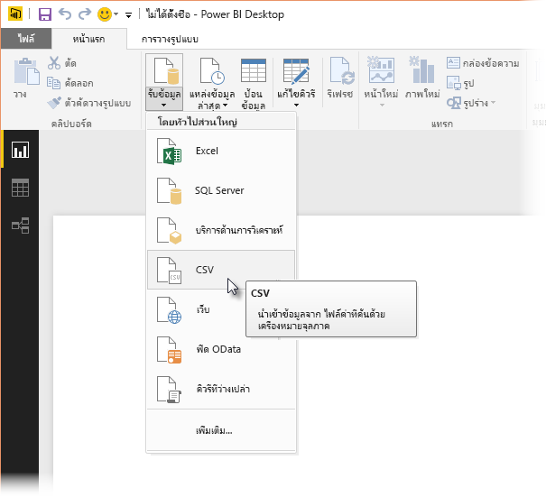
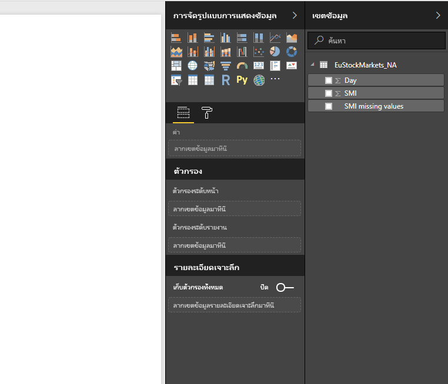
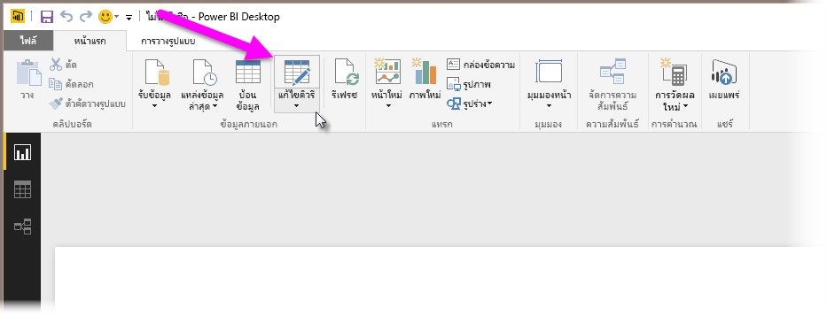
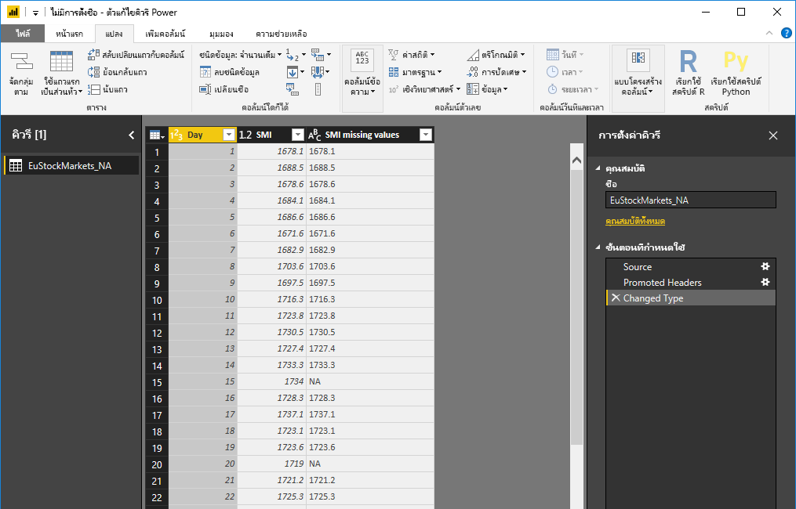
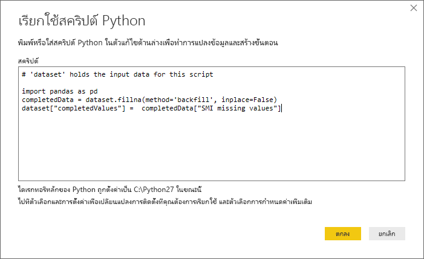
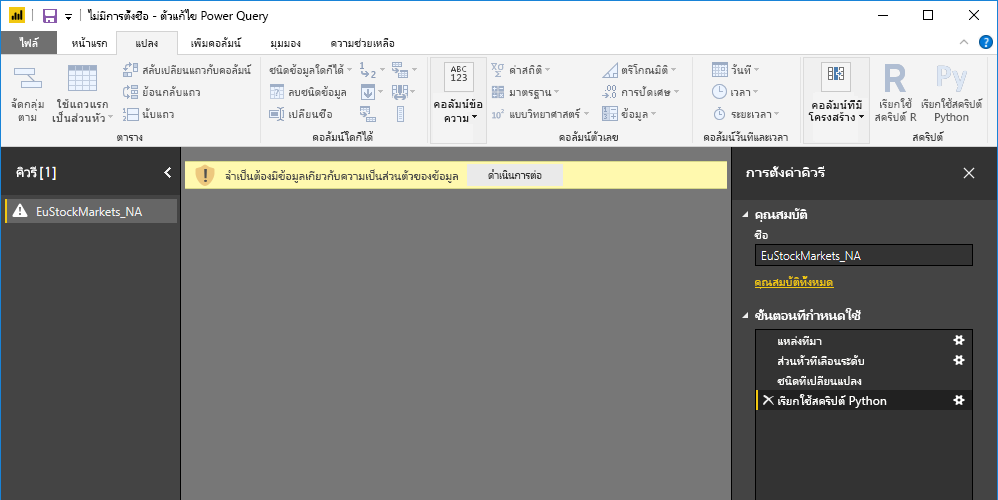

# <a name="use-python-in-query-editor"></a><span data-ttu-id="ab592-103">ใช้ Python ในตัวแก้ไขคิวรี</span><span class="sxs-lookup"><span data-stu-id="ab592-103">Use Python in Query Editor</span></span>
<span data-ttu-id="ab592-104">คุณสามารถใช้ **Python** ซึ่งเป็นภาษาการเขียนโปรแกรมที่นักสถิติ นักวิทยาศาสตร์ข้อมูล และนักวิเคราะห์ข้อมูลใช้กันอย่างกว้างขวางใน **ตัวแก้ไขคิวรีของ** Power BI Desktop</span><span class="sxs-lookup"><span data-stu-id="ab592-104">You can use **Python**, a programming language widely used by statisticians, data scientists, and data analysts, in the Power BI Desktop **Query Editor**.</span></span> <span data-ttu-id="ab592-105">การรวม Python ใน **ตัวแก้ไขคิวรี** ช่วยให้คุณดำเนินการทำความสะอาดข้อมูลโดยใช้ Python  และดำเนินการวิเคราะห์และการจัดรูปทรงข้อมูลขั้นสูงในชุดข้อมูล รวมทั้งการเติมเต็มข้อมูลที่คาดหาย การคาดการณ์ และการทำคลัสเตอร์ และอื่นๆ</span><span class="sxs-lookup"><span data-stu-id="ab592-105">This integration of Python into **Query Editor** lets you perform data cleansing using Python, and perform advanced data shaping and analytics in datasets, including completion of missing data, predictions, and clustering, just to name a few.</span></span> <span data-ttu-id="ab592-106">**Python** เป็นภาษาที่มีประสิทธิภาพ และสามารถใช้ได้ใน **ตัวแก้ไขคิวรี** เพื่อเตรียมแบบจำลองข้อมูลของคุณ และสร้างรายงาน</span><span class="sxs-lookup"><span data-stu-id="ab592-106">**Python** is a powerful language, and can be used in **Query Editor** to prepare your data model and create reports.</span></span>

## <a name="installing-python"></a><span data-ttu-id="ab592-107">ติดตั้ง Python</span><span class="sxs-lookup"><span data-stu-id="ab592-107">Installing Python</span></span>
<span data-ttu-id="ab592-108">เมื่อต้องใช้ **Python** ใน **ตัวแก้ไขคิวรี** ของ Power BI Desktop คุณจำเป็นต้องติดตั้ง **Python** บนเครื่องคอมพิวเตอร์ของคุณ</span><span class="sxs-lookup"><span data-stu-id="ab592-108">To use **Python** in Power BI Desktop's **Query Editor**, you need to install **Python** on your local machine.</span></span> <span data-ttu-id="ab592-109">คุณสามารถดาวน์โหลดและติดตั้ง **Python** ได้ฟรีจากตำแหน่งที่ตั้งต่าง ๆ ซึ่งรวมถึง [หน้าดาวน์โหลด Official Python](https://www.python.org/) และ [Anaconda](https://anaconda.org/anaconda/python/)</span><span class="sxs-lookup"><span data-stu-id="ab592-109">You can download and install **Python** for free from many locations, including the [Official Python download page](https://www.python.org/), and the [Anaconda](https://anaconda.org/anaconda/python/).</span></span>

## <a name="using-python-in-query-editor"></a><span data-ttu-id="ab592-110">การใช้ Python ใน Query Editor</span><span class="sxs-lookup"><span data-stu-id="ab592-110">Using Python in Query Editor</span></span>
<span data-ttu-id="ab592-111">เพื่อแสดงวิธีการใช้ **Python** ใน **ตัวแก้ไขคิวรี** ลองใช้ตัวอย่างนี้จากชุดข้อมูลตลาดโดยพิจารณาจากไฟล์ CSV ที่คุณสามารถ [ดาวน์โหลดได้จากที่นี่](https://download.microsoft.com/download/F/8/A/F8AA9DC9-8545-4AAE-9305-27AD1D01DC03/EuStockMarkets_NA.csv)และทำตามขั้นตอน</span><span class="sxs-lookup"><span data-stu-id="ab592-111">To show how to use **Python** in **Query Editor**, take this example from a stock market dataset, based on a .CSV file that you can [download from here](https://download.microsoft.com/download/F/8/A/F8AA9DC9-8545-4AAE-9305-27AD1D01DC03/EuStockMarkets_NA.csv) and follow along.</span></span> <span data-ttu-id="ab592-112">ขั้นตอนสำหรับตัวอย่างนี้มีดังนี้:</span><span class="sxs-lookup"><span data-stu-id="ab592-112">The steps for this example are the following:</span></span>

1. <span data-ttu-id="ab592-113">ก่อนอื่น โหลดข้อมูลของคุณลงใน **Power BI Desktop**</span><span class="sxs-lookup"><span data-stu-id="ab592-113">First, load your data into **Power BI Desktop**.</span></span> <span data-ttu-id="ab592-114">ในตัวอย่างนี้ โหลดไฟล์ *EuStockMarkets_NA.csv* และเลือก **รับข้อมูล > CSV** จาก ribbon ของ **Home** ใน **Power BI Desktop**</span><span class="sxs-lookup"><span data-stu-id="ab592-114">In this example, load the *EuStockMarkets_NA.csv* file and select **Get Data > CSV** from the **Home** ribbon in **Power BI Desktop**.</span></span>
   
   
2. <span data-ttu-id="ab592-116">เลือกไฟล์ แล้วเลือก **เปิด** และ CSV จะแสดงในกล่องโต้ตอบ **ไฟล์ CSV**</span><span class="sxs-lookup"><span data-stu-id="ab592-116">Select the file and select **Open**, and the CSV is displayed in the **CSV file** dialog.</span></span>
   
   
3. <span data-ttu-id="ab592-118">เมื่อข้อมูลถูกโหลด คุณจะเห็นข้อมูลในบานหน้าต่าง **เขตข้อมูล** ใน Power BI Desktop</span><span class="sxs-lookup"><span data-stu-id="ab592-118">Once the data is loaded, you'll see it in the **Fields** pane in Power BI Desktop.</span></span>
   
   
4. <span data-ttu-id="ab592-120">เปิด **ตัวแก้ไขคิวรี** โดยเลือก **แก้ไขคิวรี** จากแท็บ **Home** ใน **Power BI Desktop**</span><span class="sxs-lookup"><span data-stu-id="ab592-120">Open **Query Editor** by selecting **Edit Queries** from the **Home** tab in **Power BI Desktop**.</span></span>
   
   
5. <span data-ttu-id="ab592-122">ในแท็บ **แปลง** เลือก **เรียกใช้สคริปต์ R** และตัวแก้ไข **เรียกใช้สคริปต์ Python** จะปรากฏขึ้น (แสดงอยู่ในขั้นตอนถัดไป)</span><span class="sxs-lookup"><span data-stu-id="ab592-122">In the **Transform** tab, select **Run Python Script** and the **Run Python Script** editor appears (shown in the next step).</span></span> <span data-ttu-id="ab592-123">โปรดสังเกตว่า แถว 15 และ 20 ไม่มีข้อมูลบางอย่าง และแถวอื่นๆ ก็ขาดข้อมูลบางอย่างที่คุณไม่สามารถมองเห็นในรูปต่อไปนี้</span><span class="sxs-lookup"><span data-stu-id="ab592-123">Notice that rows 15 and 20 suffer from missing data, as do other rows you can't see in the following image.</span></span> <span data-ttu-id="ab592-124">ขั้นตอนด้านล่างแสดงวิธีที่ Python สามารถ (และจะ) ใส่ข้อมูลในแถวเหล่านั้นให้สมบูรณ์</span><span class="sxs-lookup"><span data-stu-id="ab592-124">The steps below show how Python can (and will) complete those rows for you.</span></span>
   
   
6. <span data-ttu-id="ab592-126">สำหรับตัวอย่างนี้ ใส่รหัสสคริปต์ต่อไปนี้:</span><span class="sxs-lookup"><span data-stu-id="ab592-126">For this example, enter the following script code:</span></span>
   
    ```python
       import pandas as pd
       completedData = dataset.fillna(method='backfill', inplace=False)
       dataset["completedValues"] =  completedData["SMI missing values"]
   ```

   > [!NOTE]
   > <span data-ttu-id="ab592-127">คุณจะต้องมีไลบรารี *pandas* ติดตั้งอยู่ในสภาพแวดล้อม Python เพื่อให้รหัสสคริปต์ก่อนหน้าทำงานอย่างถูกต้อง</span><span class="sxs-lookup"><span data-stu-id="ab592-127">You'll need to have the *pandas* library installed in your Python environment for the previous script code to work properly.</span></span> <span data-ttu-id="ab592-128">หากต้องการติดตั้ง andas ให้เรียกใช้คำสั่งต่อไปนี้ในการติดตั้ง Python:  |      > pip install pandas</span><span class="sxs-lookup"><span data-stu-id="ab592-128">To install pandas, run the following command in your Python installation: |      > pip install pandas</span></span>
   > 
   > 
   
   <span data-ttu-id="ab592-129">เมื่อวางรหัสลงในกล่องโต้ตอบ **เรียกใช้สคริปต์ Python** รหัสจะมีลักษณะดังต่อไปนี้:</span><span class="sxs-lookup"><span data-stu-id="ab592-129">When put into the **Run Python Script** dialog, the code looks like the following:</span></span>
   
   
7. <span data-ttu-id="ab592-131">หลังจากเลือก **ตกลง**, **ตัวแก้ไขคิวรี** จะแสดงคำเตือนเกี่ยวกับความเป็นส่วนตัวของข้อมูล</span><span class="sxs-lookup"><span data-stu-id="ab592-131">After selecting **OK**, **Query Editor** displays a warning about data privacy.</span></span>
   
   
8. <span data-ttu-id="ab592-133">เพื่อให้สคริปต์ Python ทำงานอย่างถูกต้องในบริการของ Power BI คุณจำเป็นต้องตั้งค่าแหล่งข้อมูลทั้งหมดเป็น *สาธารณะ*</span><span class="sxs-lookup"><span data-stu-id="ab592-133">For the Python scripts to work properly in the Power BI service, all data sources need to be set to *public*.</span></span> <span data-ttu-id="ab592-134">สำหรับข้อมูลเพิ่มเติมเกี่ยวกับการตั้งค่าความเป็นส่วนตัวและผลกระทบของการตั้งค่า ดู[ระดับความเป็นส่วนตัว](../admin/desktop-privacy-levels.md)</span><span class="sxs-lookup"><span data-stu-id="ab592-134">For more information about privacy settings and their implications, see [Privacy Levels](../admin/desktop-privacy-levels.md).</span></span>
   
   
   
   <span data-ttu-id="ab592-136">โปรดสังเกตคอลัมน์ใหม่ในบานหน้าต่าง **เขตข้อมูล** ที่เรียกว่า *completedValues*</span><span class="sxs-lookup"><span data-stu-id="ab592-136">Notice a new column in the **Fields** pane called *completedValues*.</span></span> <span data-ttu-id="ab592-137">โปรดสังเกตว่า มีองค์ประกอบข้อมูลบางอย่างหายไป เช่น ในแถวที่ 15 และ 18</span><span class="sxs-lookup"><span data-stu-id="ab592-137">Notice there are a few missing data elements, such as on row 15 and 18.</span></span> <span data-ttu-id="ab592-138">โปรดดูในส่วน วิธีการที่ Python จัดการเรื่องเหล่านั้นในหัวข้อถัดไป</span><span class="sxs-lookup"><span data-stu-id="ab592-138">Take a look at how Python handles that in the next section.</span></span>
   

<span data-ttu-id="ab592-139">ด้วยสคริปต์ Python เพียงห้าบรรทัด **ตัวแก้ไขคิวรี** จะกรอกค่าที่หายไปด้วยแบบจำลองสำหรับการพยากรณ์</span><span class="sxs-lookup"><span data-stu-id="ab592-139">With just five lines of Python script, **Query Editor** filled in the missing values with a predictive model.</span></span>

## <a name="creating-visuals-from-python-script-data"></a><span data-ttu-id="ab592-140">สร้างวิชวลจากข้อมูลสคริปต์ Python</span><span class="sxs-lookup"><span data-stu-id="ab592-140">Creating visuals from Python script data</span></span>
<span data-ttu-id="ab592-141">ในตอนนี้ เราสามารถสร้างวิชวลเพื่อดูวิธีที่สคริปต์ Python ทำงานด้วยการใช้ไลบรารี *pandas* เติมค่าที่หายไป ดังที่แสดงในรูปต่อไปนี้:</span><span class="sxs-lookup"><span data-stu-id="ab592-141">Now we can create a visual to see how the Python script code using the *pandas* library completed the missing values, as shown in the following image:</span></span>


<span data-ttu-id="ab592-143">เมื่อวิชวลดังกล่าวเสร็จสมบูรณ์ และภาพอื่นๆ ที่คุณอาจต้องการสร้างโดยใช้ **Power BI Desktop** คุณสามารถบันทึกไฟล์ของ **Power BI Desktop** (ซึ่งจะบันทึกเป็นไฟล์ .pbix) และจากนั้น ใช้แบบจำลองข้อมูลที่รวมถึงสคริปต์ Python ที่เป็นส่วนหนึ่งของแบบจำลองนั้นในบริการของ Power BI</span><span class="sxs-lookup"><span data-stu-id="ab592-143">Once that visual is complete, and any other visuals you might want to create using **Power BI Desktop**, you can save the **Power BI Desktop** file (which saves as a .pbix file) and then use the data model, including the Python scripts that are part of it, in the Power BI service.</span></span>

> [!NOTE]
> <span data-ttu-id="ab592-144">ต้องการดูไฟล์ .pbix ที่เสร็จสมบูรณ์ด้วยขั้นตอนเหล่านี้หรือไม่</span><span class="sxs-lookup"><span data-stu-id="ab592-144">Want to see a completed .pbix file with these steps completed?</span></span> <span data-ttu-id="ab592-145">คุณโชคดี - คุณสามารถดาวน์โหลดไฟล์ของ **Power BI Desktop** ที่เสร็จสมบูรณ์ในตัวอย่างเหล่านี้ [ที่นี่](https://download.microsoft.com/download/A/B/C/ABCF5589-B88F-49D4-ADEB-4A623589FC09/Complete%20Values%20with%20Python%20in%20PQ.pbix)</span><span class="sxs-lookup"><span data-stu-id="ab592-145">You're in luck - you can download the completed **Power BI Desktop** file used in these examples [right here](https://download.microsoft.com/download/A/B/C/ABCF5589-B88F-49D4-ADEB-4A623589FC09/Complete%20Values%20with%20Python%20in%20PQ.pbix).</span></span>

<span data-ttu-id="ab592-146">เมื่อคุณอัปโหลดไฟล์ .pbix ไปยังบริการของ Power BI จำเป็นต้องทำขั้นตอนเพิ่มเติมเพื่อให้สามารถรีเฟรชข้อมูล (ในบริการ) และเพื่อให้ปรับปรุงภาพที่แสดงข้อมูลในบริการได้ (ข้อมูลต้องเข้าถึง Python เพื่อปรับปรุงการแสดงผลด้วยภาพ)</span><span class="sxs-lookup"><span data-stu-id="ab592-146">Once you've uploaded the .pbix file to the Power BI service, a couple more steps are necessary to enable data refresh (in the service) and to enable visuals to be updated in the service (the data needs access to Python for visuals to be updated).</span></span> <span data-ttu-id="ab592-147">ขั้นตอนเพิ่มเติมมีดังนี้:</span><span class="sxs-lookup"><span data-stu-id="ab592-147">The additional steps are the following:</span></span>

* <span data-ttu-id="ab592-148">**เปิดใช้งานรีเฟรชชุดข้อมูลตามกำหนดการ** - จะทำให้สคริปต์ Python รีเฟรชสมุดงานที่ประกอบด้วยชุดข้อมูลของคุณตามกำหนดการ ดู [ตั้งค่าการรีเฟรชตามกำหนดการ](refresh-scheduled-refresh.md)ซึ่งยังรวมถึงข้อมูลเกี่ยวกับ **เกตเวย์ส่วนบุคคล**</span><span class="sxs-lookup"><span data-stu-id="ab592-148">**Enable scheduled refresh for the dataset** - to enable scheduled refresh for the workbook that contains your dataset with Python scripts, see [Configuring scheduled refresh](refresh-scheduled-refresh.md), which also includes information about **Personal Gateway**.</span></span>
* <span data-ttu-id="ab592-149">**ติดตั้งเกตเวย์ส่วนบุคคล** - คุณจำเป็นต้องติดตั้ง **เกตเวย์ส่วนบุคคล** บนเครื่องที่มีไฟล์อยู่ และซึ่งมีการติดตั้ง Python บริการของ Power BI ต้องเข้าถึงสมุดงานนั้นและแสดงภาพที่ได้รับการปรับปรุงแล้ว</span><span class="sxs-lookup"><span data-stu-id="ab592-149">**Install the Personal Gateway** - you need a **Personal Gateway** installed on the machine where the file is located, and where Python is installed; the Power BI service must access that workbook and re-render any updated visuals.</span></span> <span data-ttu-id="ab592-150">คุณสามารถหาข้อมูลเพิ่มเติมเกี่ยวกับวิธีการ[ติดตั้งและกำหนดค่าเกตเวย์ส่วนบุคคล](service-gateway-personal-mode.md)ได้</span><span class="sxs-lookup"><span data-stu-id="ab592-150">You can get more information on how to [install and configure Personal Gateway](service-gateway-personal-mode.md).</span></span>

## <a name="limitations"></a><span data-ttu-id="ab592-151">ข้อจำกัด</span><span class="sxs-lookup"><span data-stu-id="ab592-151">Limitations</span></span>
<span data-ttu-id="ab592-152">มีข้อจำกัดบางอย่างของการคิวรีและสคริปต์ Python ที่ถูกสร้างขึ้นใน **ตัวแก้ไขคิวรี**:</span><span class="sxs-lookup"><span data-stu-id="ab592-152">There are some limitations to queries that include Python scripts created in **Query Editor**:</span></span>

* <span data-ttu-id="ab592-153">ต้องตั้งค่าแหล่งข้อมูล Python ทั้งหมดเป็น *สาธารณะ* และขั้นตอนอื่นๆ ทั้งหมดในคิวรีที่ถูกสร้างขึ้นใน **ตัวแก้ไขคิวรี** ต้องเป็นสาธารณะด้วย</span><span class="sxs-lookup"><span data-stu-id="ab592-153">All Python data source settings must be set to *Public*, and all other steps in a query created in **Query Editor** must also be public.</span></span> <span data-ttu-id="ab592-154">เมื่อต้องเข้าตั้งค่าแหล่งข้อมูล ใน **Power BI Desktop** เลือก **ไฟล์ > ตัวเลือกและการตั้งค่า > การตั้งค่าแหล่งข้อมูล**</span><span class="sxs-lookup"><span data-stu-id="ab592-154">To get to data source settings, in **Power BI Desktop** select **File > Options and settings > Data source settings**.</span></span>
  
  
  
  <span data-ttu-id="ab592-156">จากกล่องโต้ตอบ **การตั้งค่าแหล่งข้อมูล** เลือกแหล่งข้อมูล และจากนั้น เลือก **แก้ไขสิทธิ์...** และกำหนดให้ **ระดับความเป็นส่วนตัว** ถูกตั้งค่าเป็น *สาธารณะ*</span><span class="sxs-lookup"><span data-stu-id="ab592-156">From the **Data Source Settings** dialog, select the data source(s) and then select **Edit Permissions...** and ensure that the **Privacy Level** is set to *Public*.</span></span>
  
      
* <span data-ttu-id="ab592-158">เมื่อต้องการรีเฟรชการแสดงผลด้วยวิชวล Python หรือชุดข้อมูลของคุณตามกำหนดการ คุณจำเป็นต้องเปิดใช้งาน **รีเฟรชตามกำหนดการ** และมี **เกตเวย์ส่วนบุคคล** ที่ติดตั้งบนคอมพิวเตอร์ที่บรรจุสมุดงานและมีการติดตั้ง Python</span><span class="sxs-lookup"><span data-stu-id="ab592-158">To enable scheduled refresh of your Python visuals or dataset, you need to enable **Scheduled refresh** and have a **Personal Gateway** installed on the computer that houses the workbook and the Python installation.</span></span> <span data-ttu-id="ab592-159">สำหรับข้อมูลเพิ่มเติมในทั้งสองเรื่อง ดูหัวข้อก่อนหน้าในบทความนี้ ซึ่งมีลิงก์เพื่อเรียนรู้เพิ่มเติมเกี่ยวกับเรื่องนี้แต่ละเรื่อง</span><span class="sxs-lookup"><span data-stu-id="ab592-159">For more information on both, see the previous section in this article, which provides links to learn more about each.</span></span>
* <span data-ttu-id="ab592-160">ในขณะนี้ไม่รองรับตารางที่ซ้อนกัน (ตารางของตาราง)</span><span class="sxs-lookup"><span data-stu-id="ab592-160">Nested tables (table of tables) are currently not supported</span></span> 

<span data-ttu-id="ab592-161">มีวิธีการต่างๆ ที่คุณสามารถทำได้ด้วย Python และคิวรีแบบกำหนดเอง ดังนั้น คุณควรสำรวจและจัดรูปแบบข้อมูลของคุณอย่างที่คุณต้องการให้ปรากฏ</span><span class="sxs-lookup"><span data-stu-id="ab592-161">There are all sorts of things you can do with Python and custom queries, so explore and shape your data just the way you want it to appear.</span></span>
