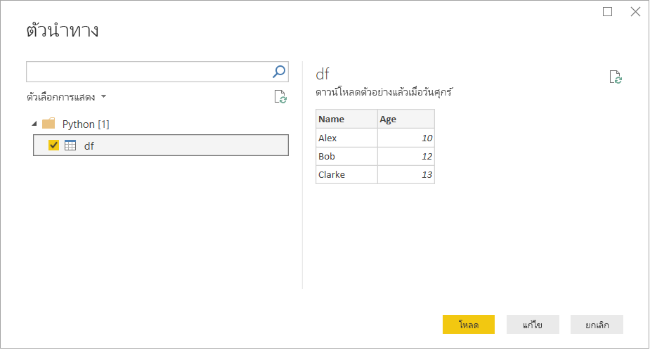

# <a name="run-python-scripts-in-power-bi-desktop"></a><span data-ttu-id="d8afd-103">เรียกใช้สคริปต์ Python ใน Power BI Desktop</span><span class="sxs-lookup"><span data-stu-id="d8afd-103">Run Python scripts in Power BI Desktop</span></span>

<span data-ttu-id="d8afd-104">คุณสามารถเรียกใช้สคริปต์ Python โดยตรงใน Power BI Desktop และนำเข้าชุดข้อมูลผลลัพธ์ลงในแบบจำลองข้อมูล Power BI Desktop ได้</span><span class="sxs-lookup"><span data-stu-id="d8afd-104">You can run Python scripts directly in Power BI Desktop and import the resulting datasets into a Power BI Desktop data model.</span></span>

## <a name="install-python"></a><span data-ttu-id="d8afd-105">ติดตั้ง Python</span><span class="sxs-lookup"><span data-stu-id="d8afd-105">Install Python</span></span>

<span data-ttu-id="d8afd-106">เพื่อเรียกใช้สคริปต์ Python ใน Power BI Desktop คุณจำเป็นต้องติดตั้ง Python บนเครื่องคอมพิวเตอร์ของคุณ</span><span class="sxs-lookup"><span data-stu-id="d8afd-106">To run Python scripts in Power BI Desktop, you need to install Python on your local machine.</span></span> <span data-ttu-id="d8afd-107">คุณสามารถดาวน์โหลด Python ได้จาก [เว็บไซต์ Python](https://www.python.org/)</span><span class="sxs-lookup"><span data-stu-id="d8afd-107">You can download Python from the [Python website](https://www.python.org/).</span></span> <span data-ttu-id="d8afd-108">การเผยแพร่การเขียนสคริปต์ภาษา Python ในปัจจุบันสนับสนุนอักขระ Unicode และช่องว่างในเส้นทางการติดตั้ง</span><span class="sxs-lookup"><span data-stu-id="d8afd-108">The current Python scripting release supports Unicode characters and spaces in the installation path.</span></span>

### <a name="install-required-python-packages"></a><span data-ttu-id="d8afd-109">ติดตั้งแพคเกจ Python ที่จำเป็น</span><span class="sxs-lookup"><span data-stu-id="d8afd-109">Install required Python packages</span></span>

<span data-ttu-id="d8afd-110">การรวม Power BI Python จำเป็นต้องติดตั้งแพ็กเกจ Python สองแพ็กเกจ:</span><span class="sxs-lookup"><span data-stu-id="d8afd-110">The Power BI Python integration requires the installation of two Python packages:</span></span>

* <span data-ttu-id="d8afd-111">[Pandas](https://pandas.pydata.org/)</span><span class="sxs-lookup"><span data-stu-id="d8afd-111">[Pandas](https://pandas.pydata.org/).</span></span> <span data-ttu-id="d8afd-112">ไลบรารีซอฟต์แวร์สำหรับการจัดการข้อมูลและการวิเคราะห์</span><span class="sxs-lookup"><span data-stu-id="d8afd-112">A software library for data manipulation and analysis.</span></span> <span data-ttu-id="d8afd-113">ซึ่งมีโครงสร้างข้อมูลและการดำเนินงานสำหรับการจัดการตาราง ตัวเลข และชุดข้อมูลเวลา</span><span class="sxs-lookup"><span data-stu-id="d8afd-113">It offers data structures and operations for manipulating numerical tables and time series.</span></span> <span data-ttu-id="d8afd-114">ข้อมูลที่นำเข้าของคุณต้องอยู่ใน [ดาต้าเฟรมของ pandas](https://www.tutorialspoint.com/python_pandas/python_pandas_dataframe.htm)</span><span class="sxs-lookup"><span data-stu-id="d8afd-114">Your imported data must be in a [pandas data frame](https://www.tutorialspoint.com/python_pandas/python_pandas_dataframe.htm).</span></span> <span data-ttu-id="d8afd-115">ดาต้าเฟรมเป็นโครงสร้างข้อมูลสองมิติ</span><span class="sxs-lookup"><span data-stu-id="d8afd-115">A data frame is a two-dimensional data structure.</span></span> <span data-ttu-id="d8afd-116">ตัวอย่างเช่น ข้อมูลถูกจัดแนวในแบบตารางที่มีแถวและคอลัมน์</span><span class="sxs-lookup"><span data-stu-id="d8afd-116">For example, data is aligned in a tabular fashion in rows and columns.</span></span>
* <span data-ttu-id="d8afd-117">[Matplotlib](https://matplotlib.org/)</span><span class="sxs-lookup"><span data-stu-id="d8afd-117">[Matplotlib](https://matplotlib.org/).</span></span> <span data-ttu-id="d8afd-118">ไลบรารีการลงจุดสำหรับ Python และส่วนขยายทางคณิตศาสตร์เชิงตัวเลข [NumPy](https://www.numpy.org/)</span><span class="sxs-lookup"><span data-stu-id="d8afd-118">A plotting library for Python and its numerical mathematics extension [NumPy](https://www.numpy.org/).</span></span> <span data-ttu-id="d8afd-119">ซึ่งมี API เชิงวัตถุสำหรับการฝังจุดลงในแอปพลิเคชันโดยใช้ชุดเครื่องมือ GUI อเนกประสงค์ (เช่น Tkinter wxPython Qt หรือ GTK+)</span><span class="sxs-lookup"><span data-stu-id="d8afd-119">It provides an object-oriented API for embedding plots into applications using general-purpose GUI toolkits, such as Tkinter, wxPython, Qt, or GTK+.</span></span>

<span data-ttu-id="d8afd-120">ในคอนโซลหรือเชลล์ ให้ใช้เครื่องมือประเภทคอมมานด์ไลน์ [pip](https://pip.pypa.io/en/stable/) เพื่อติดตั้งทั้งสองแพ็กเกจ</span><span class="sxs-lookup"><span data-stu-id="d8afd-120">In a console or shell, use the [pip](https://pip.pypa.io/en/stable/) command-line tool to install the two packages.</span></span> <span data-ttu-id="d8afd-121">เครื่องมือ pip เป็นแพ็กเกจที่ประกอบด้วย Python เวอร์ชันใหม่ล่าสุด</span><span class="sxs-lookup"><span data-stu-id="d8afd-121">The pip tool is packaged with more recent Python versions.</span></span>

```CMD
pip install pandas
pip install matplotlib
```

## <a name="enable-python-scripting"></a><span data-ttu-id="d8afd-122">เปิดใช้งานการเขียนสคริปต์ภาษา Python</span><span class="sxs-lookup"><span data-stu-id="d8afd-122">Enable Python scripting</span></span>

<span data-ttu-id="d8afd-123">เพื่อเปิดใช้งานการเขียนสคริปต์ภาษา Python:</span><span class="sxs-lookup"><span data-stu-id="d8afd-123">To enable Python scripting:</span></span>

1. <span data-ttu-id="d8afd-124">ใน Power BI Desktop ให้เลือกตัวเลือก **ไฟล์** > **และ** > **ตัวเลือกการตั้งค่า** > **การเขียนสคริปต์ภาษา Python**</span><span class="sxs-lookup"><span data-stu-id="d8afd-124">In Power BI Desktop, select **File** > **Options and settings** > **Options** > **Python scripting**.</span></span> <span data-ttu-id="d8afd-125">หน้า **ตัวเลือกสคริปต์ภาษา Python** ปรากฏขึ้น</span><span class="sxs-lookup"><span data-stu-id="d8afd-125">The **Python script options** page appears.</span></span>

   

1. <span data-ttu-id="d8afd-127">หากจำเป็น ให้ระบุเส้นทางการติดตั้ง Python บนเครื่องของคุณใน **ไดเรกทอรีหลักของ Pythonที่ตรวจพบ**</span><span class="sxs-lookup"><span data-stu-id="d8afd-127">If necessary, specify your local Python installation path in **Detected Python home directories**.</span></span>

   <span data-ttu-id="d8afd-128">ในรูปภาพด้านบน เส้นทางการติดตั้ง Python บนเครื่องคือ *C:\Python*</span><span class="sxs-lookup"><span data-stu-id="d8afd-128">In the above image, the Python's installation local path is *C:\Python*.</span></span> <span data-ttu-id="d8afd-129">ตรวจสอบให้แน่ใจว่าเส้นทางสำหรับการติดตั้ง Python บนเครื่องเป็นอันที่คุณต้องการใช้กับ Power BI Desktop</span><span class="sxs-lookup"><span data-stu-id="d8afd-129">Make sure the path is for the local Python installation you want Power BI Desktop to use.</span></span>

1. <span data-ttu-id="d8afd-130">เลือก **ตกลง**</span><span class="sxs-lookup"><span data-stu-id="d8afd-130">Select **OK**.</span></span>

<span data-ttu-id="d8afd-131">เมื่อคุณระบุการติดตั้ง Python ของคุณ คุณก็พร้อมที่จะเริ่มต้นใช้งานสคริปต์ Python ใน Power BI Desktop แล้ว</span><span class="sxs-lookup"><span data-stu-id="d8afd-131">Once you specify your Python installation, you’re ready to begin running Python scripts in Power BI Desktop.</span></span>

## <a name="run-python-scripts"></a><span data-ttu-id="d8afd-132">เรียกใช้สคริปต์ Python</span><span class="sxs-lookup"><span data-stu-id="d8afd-132">Run Python scripts</span></span>

<span data-ttu-id="d8afd-133">คุณสามารถเรียกใช้สคริปต์ Python และสร้างแบบจำลองข้อมูลได้ภายในไม่กี่ขั้นตอน</span><span class="sxs-lookup"><span data-stu-id="d8afd-133">In just a few steps, you can run Python scripts and create a data model.</span></span> <span data-ttu-id="d8afd-134">จากแบบจำลองนี้คุณสามารถสร้างรายงานและแชร์ในบริการ Power BI ได้</span><span class="sxs-lookup"><span data-stu-id="d8afd-134">From this model, you can create reports and share them on the Power BI service.</span></span>

### <a name="prepare-a-python-script"></a><span data-ttu-id="d8afd-135">เตรียมสคริปต์ Python</span><span class="sxs-lookup"><span data-stu-id="d8afd-135">Prepare a Python script</span></span>

<span data-ttu-id="d8afd-136">ประการแรก ให้สร้างสคริปต์ Python ของคุณในสภาพแวดล้อมการพัฒนา และตรวจสอบให้แน่ใจว่าการเรียกใช้สำเร็จ</span><span class="sxs-lookup"><span data-stu-id="d8afd-136">First, create a script in your local Python development environment and make sure it runs successfully.</span></span> <span data-ttu-id="d8afd-137">ตัวอย่างเช่น ต่อไปนี้เป็นสคริปต์ Python แบบง่ายที่นำเข้า pandas และใช้ดาต้าเฟรม:</span><span class="sxs-lookup"><span data-stu-id="d8afd-137">For example, here's a simple Python script that imports pandas and uses a data frame:</span></span>

```python
import pandas as pd
data = [['Alex',10],['Bob',12],['Clarke',13]]
df = pd.DataFrame(data,columns=['Name','Age'],dtype=float)
print (df)
```

<span data-ttu-id="d8afd-138">เมื่อมีการเรียกใช้ สคริปต์นี้จะย้อนกลับ</span><span class="sxs-lookup"><span data-stu-id="d8afd-138">When run, this script returns:</span></span>

```python
     Name   Age
0    Alex  10.0
1     Bob  12.0
2  Clarke  13.0
```

<span data-ttu-id="d8afd-139">เมื่อเตรียมและเรียกใช้สคริปต์ Python ใน Power BI Desktop จะมีข้อจำกัดบางอย่าง:</span><span class="sxs-lookup"><span data-stu-id="d8afd-139">When preparing and running a Python script in Power BI Desktop, there are a few limitations:</span></span>

* <span data-ttu-id="d8afd-140">นำเข้าเฉพาะดาต้าเฟรมของ Pandas เท่านั้น ดังนั้นตรวจสอบให้แน่ใจว่าข้อมูลที่คุณต้องการนำเข้าสู่ Power BI นั้นมีอยู่ในดาต้าเฟรม</span><span class="sxs-lookup"><span data-stu-id="d8afd-140">Only pandas data frames are imported, so make sure the data you want to import to Power BI is represented in a data frame</span></span>
* <span data-ttu-id="d8afd-141">สคริปต์ Python ใด ๆ ที่ทำงานนานกว่า 30 นาทีจะหมดเวลา</span><span class="sxs-lookup"><span data-stu-id="d8afd-141">Any Python script that runs longer than 30 minutes times out</span></span>
* <span data-ttu-id="d8afd-142">การเรียกแบบโต้ตอบในสคริปต์ Python เช่น รอให้ผู้ใช้ป้อนข้อมูล จะหยุดการทำงานการของสคริปต์</span><span class="sxs-lookup"><span data-stu-id="d8afd-142">Interactive calls in the Python script, such as waiting for user input, halts the script’s execution</span></span>
* <span data-ttu-id="d8afd-143">เมื่อตั้งค่าไดเรกทอรีการทำงานภายในสคริปต์ Python คุณ *ต้อง* กำหนดเส้นทางแบบเต็มไปยังไดเรกทอรีการทำงาน แทนที่จะเป็นเส้นทางสัมพัทธ์</span><span class="sxs-lookup"><span data-stu-id="d8afd-143">When setting the working directory within the Python script, you *must* define a full path to the working directory, rather than a relative path</span></span>
* <span data-ttu-id="d8afd-144">ในขณะนี้ไม่รองรับตารางแบบซ้อนกัน</span><span class="sxs-lookup"><span data-stu-id="d8afd-144">Nested tables are currently not supported</span></span>

### <a name="run-your-python-script-and-import-data"></a><span data-ttu-id="d8afd-145">เรียกใช้สคริปต์ Python ของคุณ และนำเข้าข้อมูล</span><span class="sxs-lookup"><span data-stu-id="d8afd-145">Run your Python script and import data</span></span>

<span data-ttu-id="d8afd-146">เพื่อเรียกใช้สคริปต์ Python ใน Power BI Desktop:</span><span class="sxs-lookup"><span data-stu-id="d8afd-146">To run your Python Script in Power BI Desktop:</span></span>

1. <span data-ttu-id="d8afd-147">ในริบบอนหน้าหลัก เลือก **รับข้อมูล** >  **อื่น**</span><span class="sxs-lookup"><span data-stu-id="d8afd-147">In the Home ribbon, select **Get Data** > **Other**.</span></span>

1. <span data-ttu-id="d8afd-148">เลือก **สคริปต์** >  **Python อื่น** ดังที่แสดงในรูปภาพต่อไปนี้:</span><span class="sxs-lookup"><span data-stu-id="d8afd-148">Select **Other** > **Python script** as shown in the following image:</span></span>

   

1. <span data-ttu-id="d8afd-150">เลือก **เชื่อมต่อ**</span><span class="sxs-lookup"><span data-stu-id="d8afd-150">Select **Connect**.</span></span> <span data-ttu-id="d8afd-151">เวอร์ชันของ Python ที่ติดตั้งล่าสุดบนเครื่องคอมพิวเตอร์ของคุณจะถูกเลือกเป็นกลไก Python ของคุณ</span><span class="sxs-lookup"><span data-stu-id="d8afd-151">Your local latest installed Python version is selected as your Python engine.</span></span> <span data-ttu-id="d8afd-152">คัดลอกสคริปต์ของคุณลงในกล่องโต้ตอบ **สคริปต์ Python** ที่ปรากฏขึ้น</span><span class="sxs-lookup"><span data-stu-id="d8afd-152">Copy your script into the **Python script** dialog box that appears.</span></span> <span data-ttu-id="d8afd-153">ที่นี่เราป้อนสคริปต์ Python ที่แสดงก่อนหน้านี้</span><span class="sxs-lookup"><span data-stu-id="d8afd-153">Here, we enter the simple Python script shown before.</span></span>

   

1. <span data-ttu-id="d8afd-155">เลือก **ตกลง**</span><span class="sxs-lookup"><span data-stu-id="d8afd-155">Select **OK**.</span></span> <span data-ttu-id="d8afd-156">หากสคริปต์ทำงานได้สำเร็จแล้ว **ตัวนำทาง** จะปรากฏขึ้นและคุณสามารถโหลดข้อมูลและใช้งานได้</span><span class="sxs-lookup"><span data-stu-id="d8afd-156">If the script runs successfully, the **Navigator** appears and you can load the data and use it.</span></span> <span data-ttu-id="d8afd-157">ตัวอย่างเช่น เลือก **df** ดังที่แสดงในรูปภาพจากนั้นเลือก **โหลด**</span><span class="sxs-lookup"><span data-stu-id="d8afd-157">For the example, select **df**, as shown in the image, then **Load**.</span></span>

    

### <a name="troubleshooting"></a><span data-ttu-id="d8afd-159">การแก้ไขปัญหา</span><span class="sxs-lookup"><span data-stu-id="d8afd-159">Troubleshooting</span></span>

<span data-ttu-id="d8afd-160">หากไม่มีการติดตั้งหรือระบุ Python คำเตือนจะปรากฏขึ้น</span><span class="sxs-lookup"><span data-stu-id="d8afd-160">If Python isn't installed or identified, a warning displays.</span></span> <span data-ttu-id="d8afd-161">คุณยังสามารถเห็นคำเตือนหากคุณมีการติดตั้งภายในเครื่องหลายเครื่อง</span><span class="sxs-lookup"><span data-stu-id="d8afd-161">You can also see a warning if you have multiple local machine installations.</span></span> <span data-ttu-id="d8afd-162">เยี่ยมชมและทบทวนส่วนการติดตั้ง Python และเปิดใช้งานการเขียนสคริปต์ภาษา Python ก่อนหน้า</span><span class="sxs-lookup"><span data-stu-id="d8afd-162">Revisit and review the previous Install Python and Enable Python scripting sections.</span></span>


#### <a name="using-custom-python-distributions"></a><span data-ttu-id="d8afd-164">ใช้ Python distribution แบบกำหนดเอง</span><span class="sxs-lookup"><span data-stu-id="d8afd-164">Using custom Python distributions</span></span>

<span data-ttu-id="d8afd-165">Power BI เรียกใช้งานสคริปต์โดยตรงโดยใช้ python.exe ที่สามารถเรียกทำงานได้จากไดเรกทอรีที่ผู้ใช้จัดหา (มีอยู่ผ่านหน้าการตั้งค่า)</span><span class="sxs-lookup"><span data-stu-id="d8afd-165">Power BI executes scripts directly by using the python.exe executable from a user-provided directory (provided through the settings page).</span></span> <span data-ttu-id="d8afd-166">Distribution ที่ต้องใช้ขั้นตอนพิเศษในการเตรียมสภาพแวดล้อม (ตัวอย่างเช่น Conda) อาจพบปัญหาที่การดำเนินการล้มเหลว</span><span class="sxs-lookup"><span data-stu-id="d8afd-166">Distributions that require an extra step to prepare the environment (for example, Conda) might encounter an issue where their execution fails.</span></span>

<span data-ttu-id="d8afd-167">เราขอแนะนำให้ใช้ Python distribution อย่างเป็นทางการจาก https://www.python.org/ เพื่อหลีกเลี่ยงปัญหาที่เกี่ยวข้อง</span><span class="sxs-lookup"><span data-stu-id="d8afd-167">We recommend using the official Python distribution from https://www.python.org/ to avoid related issues.</span></span>

<span data-ttu-id="d8afd-168">ในฐานะที่อาจเป็นโซลูชัน คุณสามารถเริ่มต้น Power BI Desktop จากพร้อมท์สภาพแวดล้อม Python ที่กำหนดเอง</span><span class="sxs-lookup"><span data-stu-id="d8afd-168">As a possible solution, you can start Power BI Desktop from your custom Python environment prompt.</span></span>

### <a name="refresh"></a><span data-ttu-id="d8afd-169">รีเฟรช</span><span class="sxs-lookup"><span data-stu-id="d8afd-169">Refresh</span></span>

<span data-ttu-id="d8afd-170">คุณสามารถรีเฟรชสคริปต์ Python ใน Power BI Desktop</span><span class="sxs-lookup"><span data-stu-id="d8afd-170">You can refresh a Python script in Power BI Desktop.</span></span> <span data-ttu-id="d8afd-171">หากต้องการรีเฟรช ให้ไปที่ริบบอน **หน้าหลัก** และเลือก **รีเฟรช**</span><span class="sxs-lookup"><span data-stu-id="d8afd-171">To refresh, go to the **Home** ribbon and select **Refresh**.</span></span> <span data-ttu-id="d8afd-172">เมื่อคุณรีเฟรชสคริปต์ Python แล้ว Power BI Desktop จะเรียกใช้สคริปต์ Python อีกครั้ง</span><span class="sxs-lookup"><span data-stu-id="d8afd-172">When you refresh a Python script, Power BI Desktop runs the Python script again.</span></span>

## <a name="known-limitations"></a><span data-ttu-id="d8afd-173">ข้อจำกัดที่ทราบ</span><span class="sxs-lookup"><span data-stu-id="d8afd-173">Known Limitations</span></span>

<span data-ttu-id="d8afd-174">ในปัจจุบันคุณจะไม่สามารถใช้สคริปต์ Python ในรายงานที่สร้างโดยเปิดใช้งานคุณลักษณะ **เมตาดาต้าขั้นสูง (ดูตัวอย่าง)**</span><span class="sxs-lookup"><span data-stu-id="d8afd-174">Currently you won't be able to use Python scripts in reports created with **Enhanced Metadata (Preview)** feature enabled.</span></span> <span data-ttu-id="d8afd-175">รายงานที่มีอยู่จะยังคงทำงานต่อไป</span><span class="sxs-lookup"><span data-stu-id="d8afd-175">Existing reports will continue to work.</span></span> <span data-ttu-id="d8afd-176">สำหรับข้อมูลเพิ่มเติม ให้ตรวจสอบ [การใช้เมตาดาต้าชุดข้อมูลขั้นสูง (ตัวอย่าง)](desktop-enhanced-dataset-metadata.md)</span><span class="sxs-lookup"><span data-stu-id="d8afd-176">For more information check out [Using enhanced dataset metadata (preview)](desktop-enhanced-dataset-metadata.md).</span></span> 

## <a name="next-steps"></a><span data-ttu-id="d8afd-177">ขั้นตอนถัดไป</span><span class="sxs-lookup"><span data-stu-id="d8afd-177">Next steps</span></span>

<span data-ttu-id="d8afd-178">ดูข้อมูลเพิ่มเติมเกี่ยวกับ Python ใน Power BI ต่อไปนี้</span><span class="sxs-lookup"><span data-stu-id="d8afd-178">Take a look at the following additional information about Python in Power BI.</span></span>

* [<span data-ttu-id="d8afd-179">สร้างวิชวล Python ใน Power BI Desktop</span><span class="sxs-lookup"><span data-stu-id="d8afd-179">Create Python Visuals in Power BI Desktop</span></span>](desktop-python-visuals.md)
* [<span data-ttu-id="d8afd-180">ใช้ Python IDE ภายนอกกับ Power BI</span><span class="sxs-lookup"><span data-stu-id="d8afd-180">Use an external Python IDE with Power BI</span></span>](desktop-python-ide.md)
