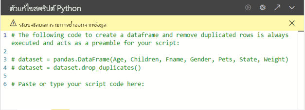

# <a name="create-power-bi-visuals-by-using-python"></a><span data-ttu-id="52264-103">สร้างภาพของ Power BI โดยใช้ Python</span><span class="sxs-lookup"><span data-stu-id="52264-103">Create Power BI visuals by using Python</span></span>

<span data-ttu-id="52264-104">ด้วย *Power BI Desktop* คุณสามารถใช้ Python เพื่อแสดงภาพข้อมูลของคุณได้</span><span class="sxs-lookup"><span data-stu-id="52264-104">With *Power BI Desktop*, you can use Python to visualize your data.</span></span>

## <a name="prerequisites"></a><span data-ttu-id="52264-105">ข้อกำหนดเบื้องต้น</span><span class="sxs-lookup"><span data-stu-id="52264-105">Prerequisites</span></span>

<span data-ttu-id="52264-106">ปฏิบัติตามบทช่วยสอน [เรียกใช้สคริปต์ Python ใน Power BI Desktop](desktop-python-scripts.md) โดยใช้สคริปต์ Python ต่อไปนี้:</span><span class="sxs-lookup"><span data-stu-id="52264-106">Work through the [Run Python scripts in Power BI Desktop](desktop-python-scripts.md) tutorial using the following Python script:</span></span>

```python
import pandas as pd 
df = pd.DataFrame({ 
    'Fname':['Harry','Sally','Paul','Abe','June','Mike','Tom'], 
    'Age':[21,34,42,18,24,80,22], 
    'Weight': [180, 130, 200, 140, 176, 142, 210], 
    'Gender':['M','F','M','M','F','M','M'], 
    'State':['Washington','Oregon','California','Washington','Nevada','Texas','Nevada'],
    'Children':[4,1,2,3,0,2,0],
    'Pets':[3,2,2,5,0,1,5] 
}) 
print (df) 
```

<span data-ttu-id="52264-107">บทความ [การเรียกใช้สคริปต์ Python ใน Power BI Desktop](desktop-python-scripts.md) จะแสดงให้คุณเห็นถึงวิธีการติดตั้ง Python บนเครื่องของคุณและการเปิดใช้งานการเขียนสคริปต์ Python ใน Power BI Desktop</span><span class="sxs-lookup"><span data-stu-id="52264-107">The [Run Python scripts in Power BI Desktop](desktop-python-scripts.md) article shows you how to install Python on your local machine and enable it for Python scripting in Power BI Desktop.</span></span> <span data-ttu-id="52264-108">บทช่วยสอนนี้ใช้ข้อมูลจากสคริปต์ด้านบนเพื่อแสดงตัวอย่างการสร้างวิชวล Python</span><span class="sxs-lookup"><span data-stu-id="52264-108">This tutorial uses data from the above script to illustrate creating Python visuals.</span></span>

## <a name="create-python-visuals-in-power-bi-desktop"></a><span data-ttu-id="52264-109">สร้างวิชวล Python ใน Power BI Desktop</span><span class="sxs-lookup"><span data-stu-id="52264-109">Create Python visuals in Power BI Desktop</span></span>

1. <span data-ttu-id="52264-110">เลือกไอคอน **วิชวล Python** ในบานหน้าต่าง **การแสดงผลข้อมูลด้วยภาพ**</span><span class="sxs-lookup"><span data-stu-id="52264-110">Select the **Python visual** icon in the **Visualizations** pane.</span></span>

   

1. <span data-ttu-id="52264-112">ในกล่องโต้ตอบ **เปิดใช้งานวิชวลสคริปต์** ที่ปรากฏขึ้นจากนั้นเลือก **เปิดใช้งาน**</span><span class="sxs-lookup"><span data-stu-id="52264-112">In the **Enable script visuals** dialog box that appears, select **Enable**.</span></span>

    <span data-ttu-id="52264-113">เมื่อคุณเพิ่มวิชวล Python ลงในรายงาน Power BI Desktop จะดำเนินการต่อไปนี้:</span><span class="sxs-lookup"><span data-stu-id="52264-113">When you add a Python visual to a report, Power BI Desktop takes the following actions:</span></span>

    - <span data-ttu-id="52264-114">รูปภาพวิชวล Python ของพื้นที่ที่สำรองไว้ปรากฏบนพื้นที่ทำงานของรายงาน</span><span class="sxs-lookup"><span data-stu-id="52264-114">A placeholder Python visual image appears on the report canvas.</span></span>

    - <span data-ttu-id="52264-115">**ตัวแก้ไขสคริปต์ Python** ปรากฏขึ้นทางด้านล่างของบานหน้าต่างกลาง</span><span class="sxs-lookup"><span data-stu-id="52264-115">The **Python script editor** appears along the bottom of the center pane.</span></span>

    

1. <span data-ttu-id="52264-117">จากนั้น ลากเขตข้อมูล **อายุ** **เด็ก** **Fname** **เพศ** **สัตว์เลี้ยง** **รัฐ** และ **น้ำหนัก** ไปยังส่วน **ค่า** ที่มีการระบุว่า **เพิ่มเขตข้อมูลที่นี่**</span><span class="sxs-lookup"><span data-stu-id="52264-117">Next, drag the **Age**, **Children**, **Fname**, **Gender**, **Pets**, **State**, and **Weight** fields to the **Values** section where it says **Add data fields here**.</span></span>

    

   <span data-ttu-id="52264-119">สคริปต์ Python ของคุณสามารถใช้เขตข้อมูลที่เพิ่มในส่วน **ค่า** แล้วเท่านั้น</span><span class="sxs-lookup"><span data-stu-id="52264-119">Your Python script can only use fields added to the **Values** section.</span></span> <span data-ttu-id="52264-120">คุณสามารถเพิ่มหรือลบเขตข้อมูลจากส่วน **ค่า** ขณะทำงานกับสคริปต์ Python ของคุณได้</span><span class="sxs-lookup"><span data-stu-id="52264-120">You can add or remove fields from the **Values** section while working on your Python script.</span></span> <span data-ttu-id="52264-121">Power BI Desktop ตรวจหาการเปลี่ยนแปลงเขตข้อมูลได้โดยอัตโนมัติ</span><span class="sxs-lookup"><span data-stu-id="52264-121">Power BI Desktop automatically detects field changes.</span></span>

   > [!NOTE]
   > <span data-ttu-id="52264-122">ชนิดการรวมเริ่มต้นสำหรับวิชวล Python คือ *ไม่ต้องทำการสรุป*</span><span class="sxs-lookup"><span data-stu-id="52264-122">The default aggregation type for Python visuals is *do not summarize*.</span></span>
   > 
   > 

1. <span data-ttu-id="52264-123">ขณะนี้คุณสามารถใช้ข้อมูลที่คุณเลือกเพื่อสร้างการลงจุด</span><span class="sxs-lookup"><span data-stu-id="52264-123">Now you can use the data you selected to create a plot.</span></span>

    <span data-ttu-id="52264-124">ขณะที่คุณเลือกหรือลบเขตข้อมูลออก โค้ดที่รองรับในตัวแก้ไขสคริปต์ Python จะถูกสร้างขึ้นหรือถูกนำออกโดยอัตโนมัติ</span><span class="sxs-lookup"><span data-stu-id="52264-124">As you select or remove fields, supporting code in the Python script editor is automatically generated or removed.</span></span> 

    <span data-ttu-id="52264-125">ตัวแก้ไขสคริปต์ Python จะสร้างโค้ดผูกข้อมูล โดยอ้างอิงจากการเลือกของคุณ</span><span class="sxs-lookup"><span data-stu-id="52264-125">Based on your selections, the Python script editor generates the following binding code.</span></span>

    - <span data-ttu-id="52264-126">ตัวแก้ไขสร้างดาต้าเฟรม *ชุดข้อมูล* พร้อมเขตข้อมูลที่คุณเพิ่มเข้าไป</span><span class="sxs-lookup"><span data-stu-id="52264-126">The editor created a *dataset* dataframe, with the fields you added.</span></span>
    - <span data-ttu-id="52264-127">การรวมเริ่มต้นคือ *ไม่สรุป*</span><span class="sxs-lookup"><span data-stu-id="52264-127">The default aggregation is: *do not summarize*.</span></span>
    - <span data-ttu-id="52264-128">คล้ายกับวิชวลตาราง เขตข้อมูลจะถูกจัดกลุ่ม และทำซ้ำแถวที่ปรากฏเพียงครั้งเดียว</span><span class="sxs-lookup"><span data-stu-id="52264-128">Similar to table visuals, fields are grouped and duplicate rows appear only once.</span></span>

    

     > [!TIP]
     > <span data-ttu-id="52264-130">ในบางกรณี คุณอาจไม่ต้องการให้จัดกลุ่มโดยอัตโนมัติ หรือคุณอาจต้องการให้แถวทั้งหมดปรากฏขึ้น รวมถึงรายการที่ซ้ำกัน</span><span class="sxs-lookup"><span data-stu-id="52264-130">In certain cases, you might not want automatic grouping to occur, or you'll want all rows to appear, including duplicates.</span></span> <span data-ttu-id="52264-131">ถ้าเป็นเช่นนั้น คุณสามารถเพิ่มเขตข้อมูลดัชนีไปยังชุดข้อมูลของคุณ ซึ่งจะทำให้แถวทั้งหมดถูกพิจารณาว่าไม่ซ้ำกัน ซึ่งป้องกันการถูกจัดกลุ่ม</span><span class="sxs-lookup"><span data-stu-id="52264-131">If so, you can add an index field to your dataset that causes all rows to be considered unique and which prevents grouping.</span></span>

   <span data-ttu-id="52264-132">คุณสามารถเข้าถึงคอลัมน์ในชุดข้อมูลโดยใช้ชื่อที่เกี่ยวข้อง</span><span class="sxs-lookup"><span data-stu-id="52264-132">You can access columns in the dataset using their respective names.</span></span> <span data-ttu-id="52264-133">ตัวอย่างเช่น คุณสามารถโค้ด `dataset["Age"]` ในสคริปต์ Python ของคุณได้เพื่อเข้าถึงเขตข้อมูลอายุ</span><span class="sxs-lookup"><span data-stu-id="52264-133">For example, you can code `dataset["Age"]` in your Python script to access the age field.</span></span>

1. <span data-ttu-id="52264-134">ด้วยดาต้าเฟรมที่สร้างขึ้นอัตโนมัติโดยเขตข้อมูลที่คุณเลือก คุณก็พร้อมที่จะเขียนสคริปต์ Python ที่จะลงจุดไปยังอุปกรณ์เริ่มต้นของ Python ได้</span><span class="sxs-lookup"><span data-stu-id="52264-134">With the dataframe automatically generated by the fields you selected, you're ready to write a Python script that results in plotting to the Python default device.</span></span> <span data-ttu-id="52264-135">เมื่อสคริปต์สมบูรณ์แล้ว ให้เลือก **เรียกใช้** จากแถบชื่อ **ตัวแก้ไขสคริปต์ Python**</span><span class="sxs-lookup"><span data-stu-id="52264-135">When the script is complete, select **Run** from the **Python script editor** title bar.</span></span>

   <span data-ttu-id="52264-136">Power BI Desktop จะลงจุดให้วิชวลใหม่อีกครั้ง หากเกิดเหตุการณ์ดังต่อไปนี้:</span><span class="sxs-lookup"><span data-stu-id="52264-136">Power BI Desktop replots the visual if any of the following events occur:</span></span>

   - <span data-ttu-id="52264-137">เมื่อคุณเลือก **เรียกใช้** จากแถบชื่อเรื่อง **ตัวแก้ไขสคริปต์ Python**</span><span class="sxs-lookup"><span data-stu-id="52264-137">When you select **Run** from the **Python script editor** title bar</span></span>
   - <span data-ttu-id="52264-138">เมื่อใดก็ตามที่เกิดการเปลี่ยนแปลงข้อมูล เนื่องจากการรีเฟรชข้อมูล การกรอง หรือการเน้น</span><span class="sxs-lookup"><span data-stu-id="52264-138">Whenever a data change occurs, due to data refresh, filtering, or highlighting</span></span>

   <span data-ttu-id="52264-139">เมื่อเรียกใช้สคริปต์ Python ที่เกิดข้อผิดพลาด จะไม่มีการลงจุดบนวิชวล Python และข้อความแสดงข้อผิดพลาดของพื้นที่ทำงานจะปรากฏขึ้น</span><span class="sxs-lookup"><span data-stu-id="52264-139">When you run a Python script that results in an error, the Python visual isn't plotted and a canvas error message appears.</span></span> <span data-ttu-id="52264-140">สำหรับรายละเอียดข้อผิดพลาด ให้เลือก **ดูรายละเอียด** จากข้อความ</span><span class="sxs-lookup"><span data-stu-id="52264-140">For error details, select **See details** from the message.</span></span>

   <span data-ttu-id="52264-141">เพื่อให้ได้มุมมองของการแสดงภาพที่มีขนาดใหญ่ขึ้น คุณสามารถย่อ **ตัวแก้ไขสคริปต์ Python** ได้</span><span class="sxs-lookup"><span data-stu-id="52264-141">To get a larger view of the visualizations, you can minimize the **Python script editor**.</span></span>

<span data-ttu-id="52264-142">ตกลง มาสร้างวิชวลบางอย่างกันเถอะ</span><span class="sxs-lookup"><span data-stu-id="52264-142">Ok, let's create some visuals.</span></span>

## <a name="create-a-scatter-plot"></a><span data-ttu-id="52264-143">สร้างแผนภูมิกระจาย</span><span class="sxs-lookup"><span data-stu-id="52264-143">Create a scatter plot</span></span>

<span data-ttu-id="52264-144">ลองสร้างแผนภูมิกระจายเพื่อดูว่าอายุและน้ำหนักมีความสัมพันธ์กันหรือไม่</span><span class="sxs-lookup"><span data-stu-id="52264-144">Let's create a scatter plot to see if there's a correlation between age and weight.</span></span>

1. <span data-ttu-id="52264-145">ในส่วน **วางหรือพิมพ์โค้ดสคริปต์ของคุณที่นี่** ให้ป้อนโค้ดนี้:</span><span class="sxs-lookup"><span data-stu-id="52264-145">Under **Paste or type your script code here**, enter this code:</span></span>

   ```python
   import matplotlib.pyplot as plt 
   dataset.plot(kind='scatter', x='Age', y='Weight', color='red')
   plt.show() 
   ```  

   <span data-ttu-id="52264-146">บานหน้าต่างตัวแก้ไขสคริปต์ Python ของคุณควรมีลักษณะดังนี้:</span><span class="sxs-lookup"><span data-stu-id="52264-146">Your Python script editor pane should now look like this:</span></span>

   

   <span data-ttu-id="52264-148">มีการนำเข้าไลบรารี **matplotlib** เพื่อลงจุดและสร้างวิชวลของเรา</span><span class="sxs-lookup"><span data-stu-id="52264-148">The **matplotlib** library is imported to plot and create our visuals.</span></span>

1. <span data-ttu-id="52264-149">เมื่อคุณเลือกปุ่ม **เรียกใช้** สคริปต์ แผนภูมิกระจายต่อไปนี้จะถูกสร้างขึ้นในรูปภาพวิชวล Python ของข้อความตัวอย่าง</span><span class="sxs-lookup"><span data-stu-id="52264-149">When you select the **Run** script button, the following scatter plot generates in the placeholder Python visual image.</span></span>

   

## <a name="create-a-line-plot-with-multiple-columns"></a><span data-ttu-id="52264-151">สร้างแผนภูมิเส้นที่มีหลายคอลัมน์</span><span class="sxs-lookup"><span data-stu-id="52264-151">Create a line plot with multiple columns</span></span>

 <span data-ttu-id="52264-152">มาสร้างแผนภูมิเส้นสำหรับแต่ละคนที่แสดงจำนวนบุตรและสัตว์เลี้ยงของพวกเขากันเถอะ</span><span class="sxs-lookup"><span data-stu-id="52264-152">Let's create a line plot for each person showing their number of children and pets.</span></span> <span data-ttu-id="52264-153">ลบหรือแสดงความคิดเห็นบนโค้ดภายใต้ **วางหรือพิมพ์โค้ดสคริปต์ของคุณที่นี่** และป้อนโค้ด Python นี้:</span><span class="sxs-lookup"><span data-stu-id="52264-153">Remove or comment the code under **Paste or type your script code here** and enter this Python code:</span></span>

 ```python
 import matplotlib.pyplot as plt 
ax = plt.gca() 
dataset.plot(kind='line',x='Fname',y='Children',ax=ax) 
dataset.plot(kind='line',x='Fname',y='Pets', color='red', ax=ax) 
plt.show() 
```

<span data-ttu-id="52264-154">เมื่อคุณเลือกปุ่ม **เรียกใช้** สคริปต์ แผนภูมิเส้นที่มีหลายคอลัมน์ต่อไปนี้จะถูกสร้างขึ้น</span><span class="sxs-lookup"><span data-stu-id="52264-154">When you select the **Run** script button, the following line plot with multiple columns generates.</span></span>


## <a name="create-a-bar-plot"></a><span data-ttu-id="52264-156">สร้างแผนภูมิแท่ง</span><span class="sxs-lookup"><span data-stu-id="52264-156">Create a bar plot</span></span>

<span data-ttu-id="52264-157">มาสร้างแผนภูมิแท่งสำหรับอายุของแต่ละคนกันเถอะ</span><span class="sxs-lookup"><span data-stu-id="52264-157">Let's create a bar plot for each person's age.</span></span> <span data-ttu-id="52264-158">ลบหรือแสดงความคิดเห็นบนโค้ดภายใต้ **วางหรือพิมพ์โค้ดสคริปต์ของคุณที่นี่** และป้อนโค้ด Python นี้:</span><span class="sxs-lookup"><span data-stu-id="52264-158">Remove or comment the code under **Paste or type your script code here** and enter this Python code:</span></span>

```python
import matplotlib.pyplot as plt 
dataset.plot(kind='bar',x='Fname',y='Age') 
plt.show() 
```

<span data-ttu-id="52264-159">เมื่อคุณเลือกปุ่ม **เรียกใช้** สคริปต์ แผนภูมิแท่งต่อไปนี้จะถูกสร้างขึ้น</span><span class="sxs-lookup"><span data-stu-id="52264-159">When you select the **Run** script button, the following bar plot generates:</span></span>

 

## <a name="security"></a><span data-ttu-id="52264-161">ความปลอดภัย</span><span class="sxs-lookup"><span data-stu-id="52264-161">Security</span></span>

> [!IMPORTANT] 
> <span data-ttu-id="52264-162">**ความปลอดภัยของสคริปต์ Python:** ภาพ Python ถูกสร้างขึ้นจากสคริปต์ Python ซึ่งประกอบด้วยโค้ดที่มีความเสี่ยงต่อความปลอดภัยหรือความเป็นส่วนตัว</span><span class="sxs-lookup"><span data-stu-id="52264-162">**Python scripts security:** Python visuals are created from Python scripts, which could contain code with security or privacy risks.</span></span> <span data-ttu-id="52264-163">เมื่อพยายามที่จะดูหรือโต้ตอบกับวิชวล Python เป็นครั้งแรก ผู้ใช้จะได้รับข้อความเตือนเรื่องความปลอดภัย</span><span class="sxs-lookup"><span data-stu-id="52264-163">When attempting to view or interact with an Python visual for the first time, a user is presented with a security warning message.</span></span> <span data-ttu-id="52264-164">เปิดใช้งานวิชวล Python ในกรณีที่คุณเชื่อถือผู้เขียนและแหล่งที่มาเท่านั้น หรือหลังจากที่คุณตรวจทานและทำความเข้าใจสคริปต์ Python แล้ว</span><span class="sxs-lookup"><span data-stu-id="52264-164">Only enable Python visuals if you trust the author and source, or after you review and understand the Python script.</span></span>
>  

## <a name="more-information-about-plotting-with-matplotlib-pandas-and-python"></a><span data-ttu-id="52264-165">ข้อมูลเพิ่มเติมเกี่ยวกับการลงจุดด้วย Matplotlib, Pandas และ Python</span><span class="sxs-lookup"><span data-stu-id="52264-165">More information about plotting with Matplotlib, Pandas, and Python</span></span>

<span data-ttu-id="52264-166">บทช่วยสอนนี้ได้รับการออกแบบมาเพื่อช่วยให้คุณเริ่มต้นสร้างวิชวล Python ใน Power BI Desktop</span><span class="sxs-lookup"><span data-stu-id="52264-166">This tutorial is designed to help you get started creating visuals with Python in Power BI Desktop.</span></span> <span data-ttu-id="52264-167">ซึ่งแทบจะไม่ต้องรู้หรือเข้าใจเกี่ยวกับตัวเลือกและความสามารถที่มีมากมายสำหรับการสร้างรายงานวิชวลเลย โดยใช้ไลบรารี Python, Pandas และ Matplotlib</span><span class="sxs-lookup"><span data-stu-id="52264-167">It barely scratches the surface about the many options and capabilities for creating visual reports using Python, Pandas, and the Matplotlib library.</span></span> <span data-ttu-id="52264-168">ยังมีข้อมูลให้ค้นหาอีกมากมาย และนี่เป็นลิงก์เพียงสองถึงสามลิงก์เพื่อให้คุณเริ่มต้นใช้งานได้</span><span class="sxs-lookup"><span data-stu-id="52264-168">There's a lot more information out there, and here are a few links to get you started.</span></span>

- <span data-ttu-id="52264-169">เเอกสารประกอบที่เว็บไซต์ [Matplotlib](https://matplotlib.org/)</span><span class="sxs-lookup"><span data-stu-id="52264-169">Documentation at the [Matplotlib](https://matplotlib.org/) website.</span></span> 
- [<span data-ttu-id="52264-170">บทช่วยสอน Matplotlib: คำแนะนำพื้นฐานในการใช้ Matplotlib ด้วยภาษา Python</span><span class="sxs-lookup"><span data-stu-id="52264-170">Matplotlib Tutorial : A Basic Guide to Use Matplotlib with Python</span></span>](https://www.datasciencelearner.com/matplotlib-tutorial-complete-guide-to-use-matplotlib-with-python/) 
- [<span data-ttu-id="52264-171">บทช่วยสอน Matplotlib – ไลบรารี Matplotlib ของภาษา Python พร้อมตัวอย่าง</span><span class="sxs-lookup"><span data-stu-id="52264-171">Matplotlib Tutorial – Python Matplotlib Library with Examples</span></span>](https://www.edureka.co/blog/python-matplotlib-tutorial/) 
- [<span data-ttu-id="52264-172">การอ้างอิง API ของ Pandas</span><span class="sxs-lookup"><span data-stu-id="52264-172">Pandas API Reference</span></span>](https://pandas.pydata.org/pandas-docs/stable/reference/index.html) 
- [<span data-ttu-id="52264-173">การแสดงผลข้อมูลด้วยภาพด้วยภาษา Python ในบริการ Power BI</span><span class="sxs-lookup"><span data-stu-id="52264-173">Python visualizations in Power BI Service</span></span>](https://powerbi.microsoft.com/blog/python-visualizations-in-power-bi-service/) 
- [<span data-ttu-id="52264-174">การใช้วิชวล Python ใน Power BI</span><span class="sxs-lookup"><span data-stu-id="52264-174">Using Python Visuals in Power BI </span></span>](https://www.absentdata.com/how-to-user-python-and-power-bi/)

## <a name="known-limitations"></a><span data-ttu-id="52264-175">ข้อจำกัดที่ทราบ</span><span class="sxs-lookup"><span data-stu-id="52264-175">Known limitations</span></span>

<span data-ttu-id="52264-176">วิชวล Python ใน Power BI Desktop มีข้อจำกัดบางประการ:</span><span class="sxs-lookup"><span data-stu-id="52264-176">Python visuals in Power BI Desktop have a few limitations:</span></span>

- <span data-ttu-id="52264-177">ข้อจำกัดของขนาดข้อมูล</span><span class="sxs-lookup"><span data-stu-id="52264-177">Data size limitations.</span></span> <span data-ttu-id="52264-178">ข้อมูลที่ใช้โดยวิชวล Python สำหรับการลงจุดจะถูกจำกัดไว้ที่ 150,000 แถว</span><span class="sxs-lookup"><span data-stu-id="52264-178">Data used by the Python visual for plotting is limited to 150,000 rows.</span></span> <span data-ttu-id="52264-179">ถ้าเลือกมากกว่า 150,000 แถว จะมีการใช้งานเฉพาะ 150,000 แถวบนสุด และข้อความจะแสดงบนรูปภาพ</span><span class="sxs-lookup"><span data-stu-id="52264-179">If more than 150,000 rows are selected, only the top 150,000 rows are used and a message is displayed on the image.</span></span> <span data-ttu-id="52264-180">นอกจากนี้ ข้อมูลป้อนเข้าจะมีขีดจำกัดที่ 250 MB</span><span class="sxs-lookup"><span data-stu-id="52264-180">Additionally, the input data has a limit of 250 MB.</span></span> 
- <span data-ttu-id="52264-181">ความละเอียด</span><span class="sxs-lookup"><span data-stu-id="52264-181">Resolution.</span></span> <span data-ttu-id="52264-182">วิชวล Python ทั้งหมดจะแสดงที่ 72 DPI</span><span class="sxs-lookup"><span data-stu-id="52264-182">All Python visuals are displayed at 72 DPI.</span></span>
- <span data-ttu-id="52264-183">ข้อจำกัดเวลาการคำนวณ</span><span class="sxs-lookup"><span data-stu-id="52264-183">Calculation time limitation.</span></span> <span data-ttu-id="52264-184">ถ้าการคำนวณวิชวล Python ใช้เวลาเกินห้านาที จะหมดเวลาการดำเนินการซึ่งส่งผลให้เกิดข้อผิดพลาด</span><span class="sxs-lookup"><span data-stu-id="52264-184">If a Python visual calculation exceeds five minutes the execution times out which results in an error.</span></span>
- <span data-ttu-id="52264-185">ความสัมพันธ์</span><span class="sxs-lookup"><span data-stu-id="52264-185">Relationships.</span></span> <span data-ttu-id="52264-186">เช่นเดียวกับวิชวลอื่น ๆ ของ Power BI Desktop ถ้ามีการเลือกเขตข้อมูลจากตารางต่าง ๆ โดยไม่มีความสัมพันธ์ที่กำหนดระหว่างกัน จะเกิดข้อผิดพลาดขึ้น</span><span class="sxs-lookup"><span data-stu-id="52264-186">As with other Power BI Desktop visuals, if data fields from different tables with no defined relationship between them are selected, an error occurs.</span></span>
- <span data-ttu-id="52264-187">วิชวล Python จะถูกรีเฟรชเมื่อมีการปรับปรุงข้อมูล การกรอง และการทำไฮไลท์</span><span class="sxs-lookup"><span data-stu-id="52264-187">Python visuals are refreshed upon data updates, filtering, and highlighting.</span></span> <span data-ttu-id="52264-188">อย่างไรก็ตาม รูปภาพนั้นไม่ได้มีการโต้ตอบและไม่สามารถแหล่งที่มาของการกรองข้ามได้</span><span class="sxs-lookup"><span data-stu-id="52264-188">However, the image itself isn't interactive and can't be the source of cross-filtering.</span></span>
- <span data-ttu-id="52264-189">วิชวล Python ตอบสนองต่อการทำไฮไลท์วิชวลอื่น ๆ แต่คุณไม่สามารถคลิกที่องค์ประกอบในวิชวล Python เพื่อกรองข้ามองค์ประกอบอื่น ๆ ได้</span><span class="sxs-lookup"><span data-stu-id="52264-189">Python visuals respond to highlighting other visuals, but you can't click on elements in the Python visual to cross filter other elements.</span></span>
- <span data-ttu-id="52264-190">เฉพาะการลงจุดที่ถูกลงจุดไปยังอุปกรณ์แสดงผลเริ่มต้น Python เท่านั้นจะแสดงผลอย่างถูกต้องบนพื้นที่ทำงาน</span><span class="sxs-lookup"><span data-stu-id="52264-190">Only plots that are plotted to the Python default display device are displayed correctly on the canvas.</span></span> <span data-ttu-id="52264-191">หลีกเลี่ยงการใช้อุปกรณ์แสดงผล Python ที่แตกต่างกันอย่างชัดเจน</span><span class="sxs-lookup"><span data-stu-id="52264-191">Avoid explicitly using a different Python display device.</span></span>
- <span data-ttu-id="52264-192">การแสดงผลด้วยภาพของ Python ไมรองรับการเปลี่ยนชื่อคอลัมน์ช่องป้อนข้อมูล</span><span class="sxs-lookup"><span data-stu-id="52264-192">Python visuals do not support renaming input columns.</span></span> <span data-ttu-id="52264-193">คอลัมน์จะถูกอ้างอิงโดยใช้ชื่อเดิมของคอลัมน์นั้นในระหว่างการประมวลผลสคริปต์</span><span class="sxs-lookup"><span data-stu-id="52264-193">Columns will be referred to by their original name during script execution.</span></span>

## <a name="next-steps"></a><span data-ttu-id="52264-194">ขั้นตอนถัดไป</span><span class="sxs-lookup"><span data-stu-id="52264-194">Next steps</span></span>

<span data-ttu-id="52264-195">ดูข้อมูลเพิ่มเติมเกี่ยวกับ Python ใน Power BI ต่อไปนี้</span><span class="sxs-lookup"><span data-stu-id="52264-195">Take a look at the following additional information about Python in Power BI.</span></span>

- [<span data-ttu-id="52264-196">เรียกใช้สคริปต์ Python ใน Power BI Desktop</span><span class="sxs-lookup"><span data-stu-id="52264-196">Run Python Scripts in Power BI Desktop</span></span>](desktop-python-scripts.md)
- [<span data-ttu-id="52264-197">ใช้ Python IDE ภายนอกกับ Power BI</span><span class="sxs-lookup"><span data-stu-id="52264-197">Use an external Python IDE with Power BI</span></span>](desktop-python-ide.md)

