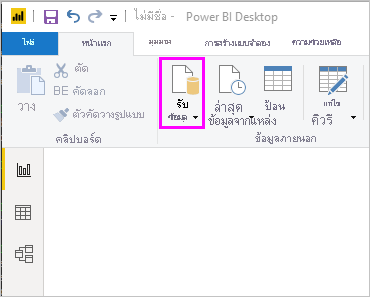

# เริ่มต้นใช้งานด่วน: เชื่อมต่อกับข้อมูลใน Power BI DesktopQuickstart: Connect to data in Power BI Desktop

ในเริ่มต้นใช้งานด่วนนี้ คุณเชื่อมต่อกับข้อมูลโดยใช้ Power BI Desktop ซึ่งเป็นขั้นตอนแรกในการสร้างรูปแบบข้อมูล และสร้างรายงานIn this quickstart, you connect to data using Power BI Desktop, which is the first step in building data models and creating reports.

ถ้าคุณไม่ได้ลงทะเบียน Power BI ให้[ลงทะเบียนรุ่นทดลองใช้ฟรี](https://app.powerbi.com/signupredirect?pbi_source=web)ก่อนที่คุณจะเริ่มต้นใช้งานIf you're not signed up for Power BI, [sign up for a free trial](https://app.powerbi.com/signupredirect?pbi_source=web) before you begin.

## ข้อกำหนดเบื้องต้นPrerequisites

เพื่อทำตามขั้นตอนในบทความนี้ คุณจำเป็นต้องมีทรัพยากรต่อไปนี้:To complete the steps in this article, you need the following resources:

* ดาวน์โหลด และติดตั้ง Power BI Desktop ซึ่งเป็นโปรแกรมประยุกต์ฟรีที่ทำงานบนคอมพิวเตอร์ของคุณDownload and install Power BI Desktop, which is a free application that runs on your local computer. คุณสามารถ[ดาวน์โหลด Power BI Desktop](https://powerbi.microsoft.com/desktop) ได้โดยตรง หรือคุณสามารถดาวน์โหลดได้จาก [Microsoft Store](https://aka.ms/pbidesktopstore) ได้You can [download Power BI Desktop](https://powerbi.microsoft.com/desktop) directly, or you can get it from [the Microsoft Store](https://aka.ms/pbidesktopstore).
* [ดาวน์โหลดเวิร์กบุ๊ก Excel ตัวอย่างนี้](https://go.microsoft.com/fwlink/?LinkID=521962) และสร้างโฟลเดอร์ที่ชื่อว่า *C:\PBID-qs* ซึ่งคุณสามารถเก็บไฟล์ Excel[Download this sample Excel workbook](https://go.microsoft.com/fwlink/?LinkID=521962), and create a folder called *C:\PBID-qs* where you can store the Excel file. ขั้นตอนต่อ ๆ ไปในเริ่มต้นใช้งานด่วนนี้ ถือว่า นั่นคือตำแหน่งที่ตั้งไฟล์สำหรับเวิร์กบุ๊ก Excel ที่ดาวน์โหลดLater steps in this quickstart assume that is the file location for the downloaded Excel workbook.
* สำหรับตัวเชื่อมต่อข้อมูลจำนวนมากใน Power BI Desktop จำเป็นต้องใช้ Internet Explorer 10 (หรือใหม่กว่า) สำหรับการรับรองความถูกต้องFor many data connectors in Power BI Desktop, Internet Explorer 10 (or newer) is required for authentication.

## เปิดใช้ Power BI DesktopLaunch Power BI Desktop

เมื่อคุณติดตั้ง Power BI Desktop แล้ว เปิดใช้แอปพลิเคชันเพื่อให้ทำงานบนคอมพิวเตอร์ของคุณOnce you install Power BI Desktop, launch the application so it's running on your local computer. คุณจะเห็นบทช่วยสอน Power BIYou're presented with a Power BI tutorial. ทำตามบทช่วยสอนหรือปิดกล่องโต้ตอบเพื่อเริ่มต้นด้วยพื้นที่ทำงานว่างเปล่าFollow the tutorial or close the dialog to start with a blank canvas. พื้นที่ทำงานคือพื้นที่ที่คุณสามารถสร้างวิชวลและรายงานต่าง ๆ จากข้อมูลของคุณได้The canvas is where you create visuals and reports from your data.

## เชื่อมต่อกับข้อมูลConnect to data

ด้วย Power BI Desktop คุณสามารถเชื่อมต่อกับข้อมูลประเภทต่าง ๆ มากมายWith Power BI Desktop, you can connect to many different types of data. แหล่งข้อมูลเหล่านี้ หมายรวมถึงแหล่งข้อมูลพื้นฐาน เช่น ไฟล์ Microsoft ExcelThese sources include basic data sources, such as a Microsoft Excel file. คุณสามารถเชื่อมต่อกับบริการออนไลน์ที่ประกอบด้วยข้อมูลทุกประเภท เช่น Salesforce, Microsoft Dynamics, Azure Blob Storage และอื่น ๆ อีกมากมายYou can connect to online services that contain all sorts of data, such as Salesforce, Microsoft Dynamics, Azure Blob Storage, and many more.

เพื่อเชื่อมต่อกับข้อมูล ไปที่ ribbon **หน้าแรก** และเลือก **รับข้อมูล**To connect to data, from the **Home** ribbon select **Get Data**.

หน้าต่าง **รับข้อมูล** จะปรากฏขึ้นThe **Get Data** window appears. คุณสามารถเลือกได้จากแหล่งข้อมูลหลายประเภทมามกมายที่ Power BI Desktop สามารถเชื่อมต่อด้วยได้You can choose from the many different data sources to which Power BI Desktop can connect. ในเริ่มต้นใช้งานด่วนนี้ ให้ใชเวิร์กบุ๊ก Excel ที่คุณดาวน์โหลดใน [ข้อกำหนดเบื้องต้น](#prerequisites)In this quickstart, use the Excel workbook that you downloaded in [Prerequisites](#prerequisites).

เนื่องจากแหล่งข้อมูลนี้เป็นไฟล์ Excel ให้เลือก **Excel** จากหน้าต่าง **รับข้อมูล** จากนั้น เลือกปุ่ม **เชื่อมต่อ**Since this data source is an Excel file, select **Excel** from the **Get Data** window, then select the **Connect** button.

Power BI จะแจ้งให้คุณระบุตำแหน่งที่ตั้งของไฟล์ Excel ที่ต้องการเชื่อมต่อPower BI prompts you to provide the location of the Excel file to which to connect. ไฟล์ที่ดาวน์โหลดจะเรียกว่า *ตัวอย่างทางการเงิน*The downloaded file is called *Financial Sample*. เลือกไฟล์ดังกล่าว จากนั้น เลือก **เปิด**Select that file, and then select **Open**.

จากนั้น Power BI Desktop จะโหลดเวิร์กบุ๊กและอ่านเนื้อหาของตนเอง และแสดงข้อมูลที่มีอยู่ในไฟล์โดยใช้หน้าต่าง **ตัวนำทาง**Power BI Desktop then loads the workbook and reads its contents, and shows you the available data in the file using the **Navigator** window. ในหน้าต่างดังกล่าว คุณสามารถเลือกข้อมูลที่คุณต้องการโหลดไปยัง Power BI DesktopIn that window, you can choose which data you would like to load into Power BI Desktop. เลือกตารางดังกล่าวโดยกาที่กล่องกาเครื่องหมายข้างแต่ละตารางที่คุณต้องการนำเข้าSelect the tables by marking the checkboxes beside each table you want to import. นำเข้าตารางที่พร้อมใช้งานทั้งคู่Import both available tables.

เมื่อคุณเลือกเสร็จแล้ว เลือก **โหลด** เพื่อนำเข้าข้อมูลลงใน Power BI DesktopOnce you've made your selections, select **Load** to import the data into Power BI Desktop.

## ดูข้อมูลในบานหน้าต่างเขตข้อมูลView data in the Fields pane

เมื่อคุณโหลดตารางเสร็จ บานหน้าต่าง **เขตข้อมูล** จะแสดงข้อมูลให้คุณOnce you've loaded the tables, the **Fields** pane shows you the data. คุณสามารถขยายแต่ละตารางโดยเลือกที่ลูกศรข้างชื่อYou can expand each table by selecting the arrow beside its name. ในรูปต่อไปนี้ ตาราง *financials* ถูกขยาย แสดงแต่ละเขตข้อมูลของตารางนั้นIn the following image, the *financials* table is expanded, showing each of its fields.

เท่านี้ก็เรียบร้อย!And that's it! คุณได้เชื่อมต่อกับข้อมูลใน Power BI Desktop โหลดข้อมูลนั้น และตอนนี้ คุณเห็นเขตข้อมูลทั้งหมดที่มีในตารางเหล่านั้นYou've connected to data in Power BI Desktop, loaded that data, and now you can see all the available fields within those tables.

## ขั้นตอนถัดไปNext steps

คุณสามารถทำอะไรได้มากมายด้วย Power BI Desktop เมื่อคุณเชื่อมต่อกับข้อมูลแล้วThere are all sorts of things you can do with Power BI Desktop once you've connected to data. เช่น การสร้างวิชวลและรายงานYou can create visuals and reports. ลองดูที่ทรัพยากรต่อไปนี้เพื่อช่วยคุณเริ่มต้น:Take a look at the following resource to get you going:

* [เริ่มต้นใช้งาน Power BI DesktopGet started with Power BI Desktop](../fundamentals/desktop-getting-started.md)
