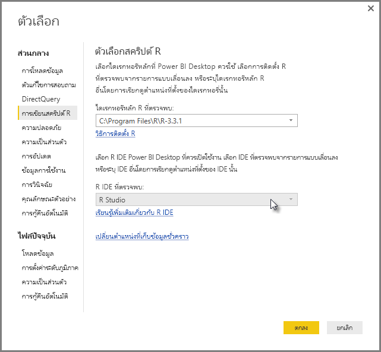
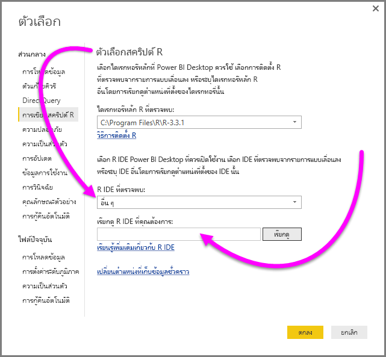
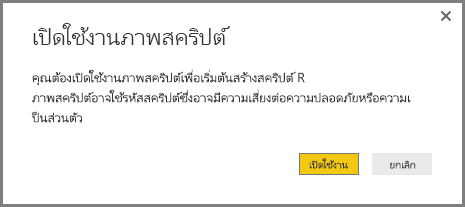
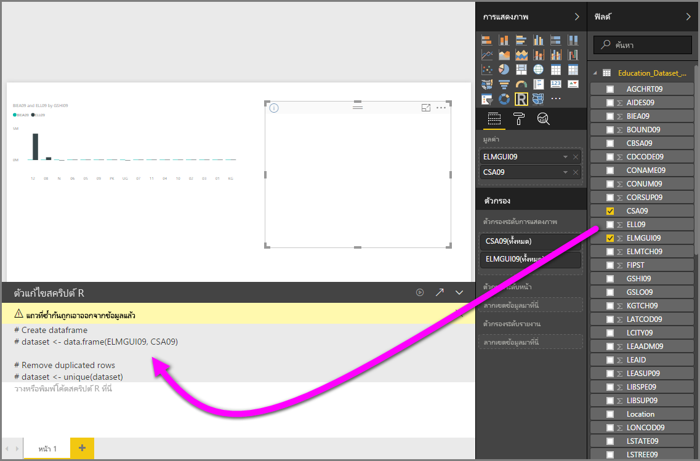
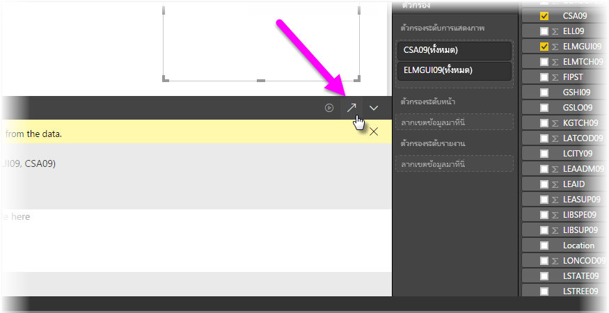
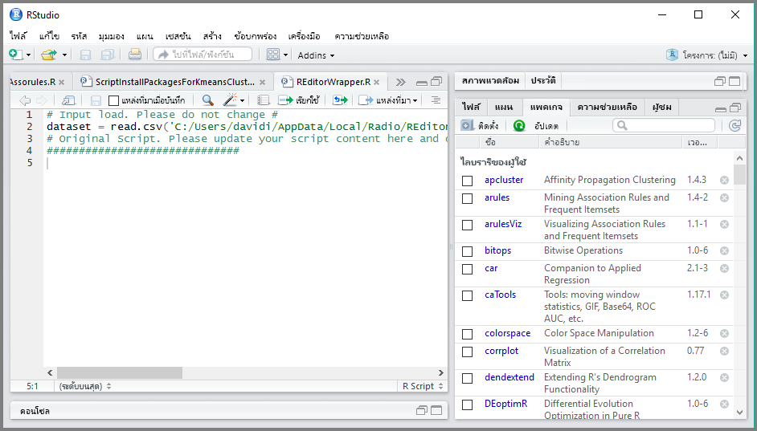

# ใช้ R IDE ภายนอกกับ Power BIUse an external R IDE with Power BI
ด้วย **Power BI Desktop** คุณสามารถใช้ R IDE ภายนอกของคุณ (สภาพแวดล้อมรวมเพื่อการพัฒนา) เพื่อสร้าง และปรับปรุงสคริปต์ R จาก แล้วจะใช้สคริปต์เหล่านั้นใน Power BI ได้With **Power BI Desktop**, you can use your external R IDE (Integrated Development Environment) to create and refine R scripts, then use those scripts in Power BI.

## เปิดใช้งานการ R IDE ภายนอกEnable an external R IDE
ก่อนหน้านี้ คุณจะต้องใช้ตัวแก้ไขสคริปต์ R ใน **Power BI Desktop** เพื่อสร้าง และเรียกใช้สคริปต์ RPreviously, you had to use the R script editor in **Power BI Desktop** to create and run R scripts. กับการเผยแพร่นี้ คุณสามารถเปิดใช้ของคุณ R IDE ภายนอกจาก **Power BI Desktop** และจะนำเข้าข้อมูลของคุณโดยอัตโนมัติ และแสดงใน R IDEWith this release, you can launch your external R IDE from **Power BI Desktop** and have your data automatically imported and displayed in the R IDE. จากที่นั่น คุณสามารถปรับเปลี่ยนสคริปต์ใน R IDE ภายนอก จากนั้นวางกลับลงใน **Power BI Desktop** เพื่อสร้างรูปภาพ Power BI และรายงานได้From there, you can modify the script in that external R IDE, then paste it back into **Power BI Desktop** to create Power BI visuals and reports.

ตั้งแต่ **Power BI Desktop** ที่วางจำหน่ายในเดือนกันยายน 2016(รุ่น 2.39.4526.362) คุณสามารถระบุ R IDE ที่คุณต้องการใช้ และได้เปิดใช้งานโดยอัตโนมัติจากภายใน **Power BI Desktop**Beginning with the September 2016 release of **Power BI Desktop** (version 2.39.4526.362), you can specify which R IDE you would like to use, and have it launch automatically from within **Power BI Desktop**.

### ข้อกำหนดRequirements
เมื่อต้องใช้คุณลักษณะนี้ คุณจำเป็นต้องติดตั้ง **R IDE** บนเครื่องคอมพิวเตอร์ของคุณTo use this feature, you need to install an **R IDE** on your local computer. **Power BI Desktop** ไม่รวมการนำเข้าใช้หรือการติดตั้ง R engine ดังนั้นคุณต้องติดตั้ง **R** แบบบนเครื่องคอมพิวเตอร์ของคุณแบบแยกต่างหาก**Power BI Desktop** does not include, deploy, or install the R engine, so you must separately install **R** on your local computer. คุณสามารถเลือก R IDE ที่จะใช้ ด้วยตัวเลือกต่อไปนี้You can choose which R IDE to use, with the following options:

* คุณสามารถติดตั้ง R IDE ตัวโปรดของคุณ ซึ่งมีจำนวนมากที่ใช้งานฟรี เช่น[Revolution Open download page](https://mran.revolutionanalytics.com/download/)และ[CRAN Repository](https://cran.r-project.org/bin/windows/base/) ได้You can install your favorite R IDE, many of which are available for free, such as the [Revolution Open download page](https://mran.revolutionanalytics.com/download/), and the [CRAN Repository](https://cran.r-project.org/bin/windows/base/).
* **Power BI Desktop** ยัง สนับสนุน [R Studio](https://www.rstudio.com/)และ **Visual Studio 2015** กับ [*เครื่องมือ R สำหรับ Visual Studio*](/visualstudio/rtvs)editor**Power BI Desktop** also supports [R Studio](https://www.rstudio.com/) and **Visual Studio 2015** with [*R Tools for Visual Studio*](/visualstudio/rtvs) editors.
* นอกจากนี้คุณสามารถติดตั้ง R IDE ที่แตกต่างกัน และมี **Power BI Desktop** เปิดใช้งานที่ **R IDE** โดยทำอย่างใดอย่างหนึ่งต่อไปนี้You can also install a different R IDE and have **Power BI Desktop** launch that **R IDE** by doing one of the following:
  
  * คุณสามารถเชื่อมโยงไฟล์ **.R** จาก IDE ภายนอกที่คุณต้องการให้ **Power BI Desktop** เพื่อเปิดใช้งานYou can associate **.R** files with the external IDE you want **Power BI Desktop** to launch.
  * คุณสามารถระบุ.exe ที่ **Power BI Desktop** สามารถใช้งาน โดยเลือก *อื่น ๆ* จากการ **ตัวเลือก R Script** ส่วนของ **ตัวเลือก** แบบโต้ตอบYou can specify the .exe that **Power BI Desktop** should launch by selecting *Other* from the **R Script Options** section of the **Options** dialog. คุณสามารถนำกล่องโต้ตอบ **ตัวเลือก** โดยไปที่ **ไฟล์ > ตัวเลือกและการตั้งค่า > ตัวเลือก**You can bring up the **Options** dialog by going to **File > Options and settings > Options**.
    
    

ถ้าคุณมี R IDE หลายตัวติดตั้อยู่ง คุณสามารถระบุได้ว่าจะเปิดตัวใด โดยการเลือก *R IDE ที่ตรวจพบ* การดรอปดาวน์ในกล่องโต้ตอบ **ตัวเลือก**If you have multiple R IDEs installed, you can specify which will be launched by selecting it from the *Detected R IDEs* drop-down in the **Options** dialog.

ตามค่าเริ่มต้น ถ้ามีการติดตั้งบนคอมพิวเตอร์ของคุณภาย **Power BI Desktop** จะเปิด **R Studio** เป็นแบบ R IDE ภายนอก ถ้า **R Studio** ไม่ได้ติดตั้งและคุณมี **Visual Studio 2015** กับ **R Tools สำหรับ Visual Studio** มันจะเปิดใช้แทนBy default, **Power BI Desktop** will launch **R Studio** as the external R IDE if it's installed on your local computer; if **R Studio** is not installed and you have **Visual Studio 2015** with **R Tools for Visual Studio**, that will be launched instead. ถ้าไม่มี R IDE ใดเลยติดตั้งอยู่ แอปพลิเคชันที่เชื่อมโยงกับไฟล์ **R** จะถูกเปิดใช้งานIf neither of those R IDEs is installed, the application associated with **.R** files is launched.

และถ้าหากไม่มีความสัมพันธ์ของไฟล์ **.R** อาจเป็นไปได้ที่จะต้องระบุเส้นทางไปยัง IDE แบบกำหนดเอง ใน *เรียกดู R IDE ที่คุณต้องการ* ส่วนของ **กล่องโต้ตอบ** ตัวเลือกAnd if no **.R** file association exists, it's possible to specify a path to a custom IDE in the *Browse to your preferred R IDE* section of the **Options** dialog. คุณยังสามารถเปิดใช้ R IDE อื่น โดยการเลือกตัว **ตั้งค่า** ไอคอนรูปเฟืองด้านข้าง **เปิดใช้ R IDE** ไอคอนลูกศร ใน **Power BI Desktop**You can also launch a different R IDE by selecting the **Settings** gear icon beside the **Launch R IDE** arrow icon, in **Power BI Desktop**.

## เปิดใช้การ R IDE จาก Power BI DesktopLaunch an R IDE from Power BI Desktop
เมื่อต้องการเปิดใช้การ R IDE จาก **Power BI Desktop** ให้ทำตามขั้นตอนต่อไปนี้To launch an R IDE from **Power BI Desktop**, take the following steps:

1. โหลดข้อมูลลงใน **Power BI Desktop**Load data into **Power BI Desktop**.
2. เลือกเขตข้อมูลบางอย่างจากบานหน้าต่าง **เขตข้อมูล** ที่คุณต้องการใช้งานSelect some fields from the **Fields** pane that you want to work with. ถ้าคุณยังไม่ได้เปิดใช้งานรูปของสคริปต์ คุณจะได้ถูกถามให้ทำเช่นนั้นIf you haven't enabled script visuals yet, you'll be prompted to do so.
   
   
3. เมื่อเปิดใช้งานรูปของสคริปต์ คุณจะสามารถเลือกรูป R จากบานหน้าต่าง **แสดงภาพ** ซึ่งสร้างภาพ R แบบว่างที่พร้อมที่จะแสดงผลลัพธ์ของสคริปต์ของคุณWhen script visuals are enabled, you can select an R visual from the **Visualizations** pane, which creates a blank R visual that's ready to display the results of your script. บานหน้าต่าง **ตัวแก้ไขสคริปต์ R** จะปรากฏขึ้นThe **R script editor** pane also appears.
   
   
4. ตอนนี้ คุณสามารถเลือกเขตข้อมูลคุณต้องการใช้ในสคริปต์ R ของคุณNow you can select the fields you want to use in your R script. เมื่อคุณเลือกเขตข้อมูล เขตข้อมูล **ตัวแก้ไขสคริปต์ R** จะถูกสร้างขึ้นแบบอัตโนมัติโดยเป็นไปตามเขตข้อมูลที่คุณเลือกWhen you select a field, the **R script editor** field automatically creates script code based on the field or fields you select. คุณสามารถสร้าง (หรือวาง) สคริปต์ R ของคุณโดยตรงในบานหน้าต่าง **ตัวแก้ไขสคริปต์ R** หรือคุณสามารถปล่อยให้ว่างเปล่าก็ได้You can either create (or paste) your R script directly in the **R script editor** pane, or you can leave it empty.
   
   
   
   > [!NOTE]
   > ชนิดการรวมเริ่มต้นสำหรับวิชวล R คือ *ไม่ต้องทำการสรุป*The default aggregation type for R visuals is *do not summarize*.
   > 
   > 
5. ขณะนี้คุณสามารถเปิดใช้ R IDE ของคุณได้โดยตรงจาก **Power BI Desktop**You can now launch your R IDE directly from **Power BI Desktop**. เลือกปุ่ม **เปิดใช้ R IDE** พบบนด้านขวาของแถบชื่อ **R script editor** ตามที่แสดงด้านล่างSelect the **Launch R IDE** button, found on the right side of the **R script editor** title bar, as shown below.
   
   
6. R IDE ของคุณระบุจะเริ่มทำงาน โดย Power BI Desktop ดังที่แสดงในรูปต่อไปนี้ (ในรูปภาพนี้ **RStudio** เป็น R IDE เริ่มต้น)Your specified R IDE is launched by Power BI Desktop, as shown in the following image (in this image, **RStudio** is the default R IDE).
   
   
   
   > [!NOTE]
   > **Power BI Desktop** เพิ่มสามบรรทัดแรกของสคริปต์ แล้วจึงค่อยสามารถนำเข้าข้อมูลของคุณจาก **Power BI Desktop** เมื่อคุณเรียกใช้สคริปต์**Power BI Desktop** adds the first three lines of the script so it can import your data from **Power BI Desktop** once you run the script.
   > 
   > 
7. สคริปต์ใด ๆ ที่คุณสร้างขึ้นใน **บานหน้าต่างตัวแก้ไขสคริปต์ R** ของ **Power BI Desktop** จะปรากฏเริ่มต้นในบรรทัดที่ 4 ใน R IDE ของคุณAny script you created in the **R script editor pane** of **Power BI Desktop** appears starting in line 4 in your R IDE. ในตอนนี้ คุณสามารถสร้างสคริปต์ R ของคุณใน R IDEAt this point, you can create your R script in the R IDE. เมื่อสคริปต์ R ของคุณนั้สร้างเสร็จสมบูรณ์แล้วใน R IDE ของคุณ คุณจำเป็นต้องคัดลอก และวางไว้ **ตัวแก้ไขสคริปต์ R** บานหน้าต่างใน **Power BI Desktop** *ยกเว้น* สามบรรทัดแรกของตัว สคริปต์ที่ **Power BI Desktop** สร้างขึ้นโดยอัตโนมัติOnce your R script is complete in your R IDE, you need to copy and paste it back into the **R script editor** pane in **Power BI Desktop**, *excluding* the first three lines of the script that **Power BI Desktop** automatically generated. ห้ามคัดลอกสามบรรทัดแรกของสคริปต์กลับเข้าไปใน **Power BI Desktop** บรรทัดเหล่านั้นถูกใช้เพื่อนำเข้าข้อมูลของคุณไปยัง R IDE ของคุณจากเท่านั้น **Power BI Desktop**Do not copy the first three lines of script back into **Power BI Desktop**, those lines were only used to import your data to your R IDE from **Power BI Desktop**.

### ข้อจำกัดที่ทราบKnown limitations
เปิดใช้งาน R IDE ได้โดยตรงจาก Power BI Desktop มีข้อจำกัดบางอย่างLaunching an R IDE directly from Power BI Desktop has a few limitations:

* การส่งออกสคริปต์โดยอัตโนมัติจาก R IDE ของคุณไปยัง **Power BI Desktop** ยังทำไม่ได้Automatically exporting your script from your R IDE into **Power BI Desktop** is not supported.
* ตัวแก้ไข **ไคลเอ็นต์ R**(RGui.exe) ไม่ถูกรองรับ เนื่องจากตัวแก้ไขเองก็ไม่รองรับเปิดไฟล์**R Client** editor (RGui.exe) is not supported, because the editor itself does not support opening files.

## ขั้นตอนถัดไปNext steps
ดูข้อมูลเพิ่มเติมเกี่ยวกับ R ใน Power BITake a look at the following additional information about R in Power BI.

* [การเรียกใช้สคริปต์ R ใน Power BI DesktopRunning R Scripts in Power BI Desktop](desktop-r-scripts.md)
* [สร้างภาพ Power BI ที่ใช้ RCreate Power BI visuals using R](../create-reports/desktop-r-visuals.md)
