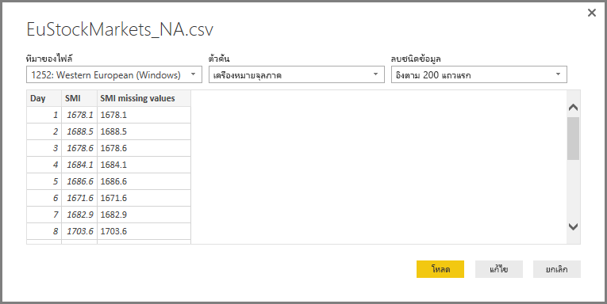

# <a name="use-r-in-power-query-editor"></a><span data-ttu-id="b7f33-103">ใช้ R ในตัวแก้ไข Power Query</span><span class="sxs-lookup"><span data-stu-id="b7f33-103">Use R in Power Query Editor</span></span>

<span data-ttu-id="b7f33-104">[ภาษา R ](https://mran.microsoft.com/documents/what-is-r) คือภาษาการเขียนโปรแกรมที่มีประสิทธิภาพที่นักสถิติ นักวิทยาศาสตร์ข้อมูล และนักวิเคราะห์ข้อมูลใช้งาน</span><span class="sxs-lookup"><span data-stu-id="b7f33-104">[The R language](https://mran.microsoft.com/documents/what-is-r) is a powerful programming language that many statisticians, data scientists, and data analysts use.</span></span> <span data-ttu-id="b7f33-105">คุณสามารถใช้ R ในในตัวแก้ไข Power Query ของ Power BI Desktop เพื่อ:</span><span class="sxs-lookup"><span data-stu-id="b7f33-105">You can use R in Power BI Desktop's Power Query Editor to:</span></span>

* <span data-ttu-id="b7f33-106">เตรียมแบบจำลองข้อมูล</span><span class="sxs-lookup"><span data-stu-id="b7f33-106">Prepare data models.</span></span>

* <span data-ttu-id="b7f33-107">สร้างรายงาน</span><span class="sxs-lookup"><span data-stu-id="b7f33-107">Create reports.</span></span>

* <span data-ttu-id="b7f33-108">ทำการล้างข้อมูล การปรับรูปแบบข้อมูลขั้นสูง และการวิเคราะห์ชุดข้อมูลซึ่งรวมถึงการขาดข้อมูลที่สมบูรณ์ การคาดการณ์ การทำคลัสเตอร์ และอื่น ๆ</span><span class="sxs-lookup"><span data-stu-id="b7f33-108">Do data cleansing, advanced data shaping, and dataset analytics, which include missing data completion, predictions, clustering, and more.</span></span>  

## <a name="install-r"></a><span data-ttu-id="b7f33-109">ติดตั้ง R</span><span class="sxs-lookup"><span data-stu-id="b7f33-109">Install R</span></span>

<span data-ttu-id="b7f33-110">คุณสามารถดาวน์โหลด R ได้ฟรีจาก[หน้าดาวน์โหลด Revolution Open](https://mran.revolutionanalytics.com/download/) และ [CRAN Repository](https://cran.r-project.org/bin/windows/base/)</span><span class="sxs-lookup"><span data-stu-id="b7f33-110">You can download R for free from the [Revolution R Open download page](https://mran.revolutionanalytics.com/download/) and the [CRAN Repository](https://cran.r-project.org/bin/windows/base/).</span></span>

## <a name="install-mice"></a><span data-ttu-id="b7f33-111">ติดตั้ง mice</span><span class="sxs-lookup"><span data-stu-id="b7f33-111">Install mice</span></span>

<span data-ttu-id="b7f33-112">ในฐานะที่เป็นข้อกำหนดเบื้องต้น คุณต้องติดตั้ง [ไลบรารี mice](https://www.rdocumentation.org/packages/mice/versions/3.5.0/topics/mice) ในสภาพแวดล้อม R ของคุณ</span><span class="sxs-lookup"><span data-stu-id="b7f33-112">As a prerequisite, you must install the [mice library](https://www.rdocumentation.org/packages/mice/versions/3.5.0/topics/mice) in your R environment.</span></span> <span data-ttu-id="b7f33-113">หากไม่มี mice โค้ดสคริปต์ตัวอย่างจะทำงานไม่ถูกต้อง</span><span class="sxs-lookup"><span data-stu-id="b7f33-113">Without mice, the sample script code won't work properly.</span></span> <span data-ttu-id="b7f33-114">แพคเกจ mice ใช้วิธีการใดวิธีการหนึ่งในการจัดการกับข้อมูลที่ขาดหายไป</span><span class="sxs-lookup"><span data-stu-id="b7f33-114">The mice package implements a method to deal with missing data.</span></span>

<span data-ttu-id="b7f33-115">หากต้องการติดตั้งไลบรารี mice:</span><span class="sxs-lookup"><span data-stu-id="b7f33-115">To install the mice library:</span></span>

1. <span data-ttu-id="b7f33-116">เปิดใช้งานโปรแกรม R.exe (ตัวอย่างเช่น C:\Program Files\Microsoft\R Open\R-3.5.3\bin\R.exe)</span><span class="sxs-lookup"><span data-stu-id="b7f33-116">Launch the R.exe program (for example, C:\Program Files\Microsoft\R Open\R-3.5.3\bin\R.exe).</span></span>  

2. <span data-ttu-id="b7f33-117">เรียกใช้คำสั่งติดตั้งจากพร้อมท์ R:</span><span class="sxs-lookup"><span data-stu-id="b7f33-117">Run the install command from the R prompt:</span></span>

   ``` 
   install.packages('mice') 
   ```

## <a name="use-r-in-power-query-editor"></a><span data-ttu-id="b7f33-118">ใช้ R ในตัวแก้ไข Power Query</span><span class="sxs-lookup"><span data-stu-id="b7f33-118">Use R in Power Query Editor</span></span>

<span data-ttu-id="b7f33-119">เพื่อสาธิตการใช้ R ในตัวแก้ไข Power Query เราจะใช้ตัวอย่างชุดข้อมูลตลาดหุ้นที่มีอยู่ในไฟล์ .csv และทำงานผ่านขั้นตอนต่อไปนี้:</span><span class="sxs-lookup"><span data-stu-id="b7f33-119">To demonstrate using R in Power Query Editor, we'll use an example stock market dataset contained in  a .csv file and work through the following steps:</span></span>

1. <span data-ttu-id="b7f33-120">[ดาวน์โหลดไฟล์ EuStockMarkets_NA.csv](https://download.microsoft.com/download/F/8/A/F8AA9DC9-8545-4AAE-9305-27AD1D01DC03/EuStockMarkets_NA.csv)</span><span class="sxs-lookup"><span data-stu-id="b7f33-120">[Download the EuStockMarkets_NA.csv file](https://download.microsoft.com/download/F/8/A/F8AA9DC9-8545-4AAE-9305-27AD1D01DC03/EuStockMarkets_NA.csv).</span></span> <span data-ttu-id="b7f33-121">จดจำตำแหน่งที่คุณบันทึกไว้</span><span class="sxs-lookup"><span data-stu-id="b7f33-121">Remember where you save it.</span></span>

1. <span data-ttu-id="b7f33-122">โหลดไฟล์ลงใน Power BI Desktop</span><span class="sxs-lookup"><span data-stu-id="b7f33-122">Load the file into Power BI Desktop.</span></span> <span data-ttu-id="b7f33-123">จากแท็บ **หน้าแรก** ให้เลือก **รับข้อมูล** > **Text/CSV**</span><span class="sxs-lookup"><span data-stu-id="b7f33-123">From the **Home** tab, select **Get Data** > **Text/CSV**.</span></span>

   

1. <span data-ttu-id="b7f33-125">เลือกไฟล์ EuStockMarkets_NA.csv จากนั้นเลือก **เปิด**</span><span class="sxs-lookup"><span data-stu-id="b7f33-125">Select the EuStockMarkets_NA.csv file, and then choose **Open**.</span></span> <span data-ttu-id="b7f33-126">ข้อมูล CSV จะแสดงในกล่องโต้ตอบ **ไฟล์ Text/CSV**</span><span class="sxs-lookup"><span data-stu-id="b7f33-126">The CSV data is displayed in the **Text/CSV file** dialog box.</span></span>

   

1. <span data-ttu-id="b7f33-128">เลือก **โหลด** เพื่อโหลดข้อมูลจากไฟล์</span><span class="sxs-lookup"><span data-stu-id="b7f33-128">Select **Load** to load the data from the file.</span></span> <span data-ttu-id="b7f33-129">หลังจากที่ Power BI ได้โหลดข้อมูลแล้ว ตารางใหม่จะปรากฏขึ้นในบานหน้าต่าง **เขตข้อมูล**</span><span class="sxs-lookup"><span data-stu-id="b7f33-129">After Power BI has loaded the data, the new table appears in the **Fields** pane.</span></span>

   

1. <span data-ttu-id="b7f33-131">หากต้องการเปิดตัวแก้ไข Power Query จากริบบอน **หน้าแรก** ให้เลือก **แก้ไขคิวรี**</span><span class="sxs-lookup"><span data-stu-id="b7f33-131">To open Power Query Editor, from the **Home** ribbon select **Edit Queries**.</span></span>

   

1. <span data-ttu-id="b7f33-133">จากแท็บ **แปลง** ให้เลือก **เรียกใช้สคริปต์ R**</span><span class="sxs-lookup"><span data-stu-id="b7f33-133">From the **Transform** tab, select **Run R script**.</span></span> <span data-ttu-id="b7f33-134">ตัวแก้ไข **เรียกใช้สคริปต์ R** จะแสดงขึ้นมา</span><span class="sxs-lookup"><span data-stu-id="b7f33-134">The **Run R script** editor appears.</span></span> <span data-ttu-id="b7f33-135">แถว 15 และ 20 มีข้อมูลที่หายไปเช่นเดียวกับแถวอื่น ๆ ที่คุณไม่สามารถดูได้ในรูป</span><span class="sxs-lookup"><span data-stu-id="b7f33-135">Rows 15 and 20 have missing data, as do other rows you can't see in the image.</span></span> <span data-ttu-id="b7f33-136">ขั้นตอนต่อไปนี้แสดงวิธีที่ R สามารถใส่ข้อมูลในแถวเหล่านั้นให้สมบูรณ์</span><span class="sxs-lookup"><span data-stu-id="b7f33-136">The following steps show how R completes those rows for you.</span></span>

   

1. <span data-ttu-id="b7f33-138">สำหรับตัวอย่างนี้ ให้ใส่โค้ดสคริปต์ต่อไปนี้ในกล่อง **สคริปต์t** ของหน้าต่าง **เรียกใช้สคริปต์ R**</span><span class="sxs-lookup"><span data-stu-id="b7f33-138">For this example, enter the following script code in the **Script** box of the **Run R script** window.</span></span> <span data-ttu-id="b7f33-139">แทนที่ *&lt;พาธไฟล์ของคุณ&gt;* ด้วยพาธไปยัง EuStockMarkets_NA.csv บนระบบไฟล์ภายในเครื่องของคุณ ตัวอย่างเช่น C:/Users/John Doe/Documents/Microsoft/EuStockMarkets_NA.csv</span><span class="sxs-lookup"><span data-stu-id="b7f33-139">Replace *&lt;Your File Path&gt;* with the path to EuStockMarkets_NA.csv on your local file system, for example, C:/Users/John Doe/Documents/Microsoft/EuStockMarkets_NA.csv.</span></span>

    ```r
       dataset <- read.csv(file="<Your File Path>/EuStockMarkets_NA.csv", header=TRUE, sep=",")
       library(mice)
       tempData <- mice(dataset,m=1,maxit=50,meth='pmm',seed=100)
       completedData <- complete(tempData,1)
       output <- dataset
       output$completedValues <- completedData$"SMI missing values"
    ```

    > [!NOTE]
    > <span data-ttu-id="b7f33-140">คุณอาจจำเป็นต้องเขียนทับตัวแปรที่ชื่อว่า *output* เพื่อสร้างชุดข้อมูลใหม่อย่างถูกต้องด้วยตัวกรองที่ใช้</span><span class="sxs-lookup"><span data-stu-id="b7f33-140">You might need to overwrite a variable named *output* to properly create the new dataset with the filters applied.</span></span>

7. <span data-ttu-id="b7f33-141">เลือก **ตกลง**</span><span class="sxs-lookup"><span data-stu-id="b7f33-141">Select **OK**.</span></span> <span data-ttu-id="b7f33-142">ตัวแก้ไข Power Query จะแสดงคำเตือนเกี่ยวกับความเป็นส่วนตัวของข้อมูล</span><span class="sxs-lookup"><span data-stu-id="b7f33-142">Power Query Editor displays a warning about data privacy.</span></span>

   
8. <span data-ttu-id="b7f33-144">ภายในข้อความเตือน ให้เลือก **ดำเนินการต่อ**</span><span class="sxs-lookup"><span data-stu-id="b7f33-144">Inside the warning message, select **Continue**.</span></span> <span data-ttu-id="b7f33-145">ในกล่องโต้ตอบ **ระดับความเป็นส่วนตัว** ที่ปรากฏขึ้น ให้ตั้งค่าแหล่งข้อมูลทั้งหมดเป็น **สาธารณะ** เพื่อให้สคริปต์ R ทำงานได้อย่างถูกต้องในบริการ Power BI</span><span class="sxs-lookup"><span data-stu-id="b7f33-145">In the **Privacy levels** dialog box that appears, set all data sources to **Public** for the R scripts to work properly in the Power BI service.</span></span> 

   

   <span data-ttu-id="b7f33-147">สำหรับข้อมูลเพิ่มเติมเกี่ยวกับการตั้งค่าความเป็นส่วนตัวและผลกระทบของการตั้งค่า โปรดดู[ระดับความเป็นส่วนตัวของ Power BI Desktop](../admin/desktop-privacy-levels.md)</span><span class="sxs-lookup"><span data-stu-id="b7f33-147">For more information about privacy settings and their implications, see [Power BI Desktop privacy levels](../admin/desktop-privacy-levels.md).</span></span>

 9. <span data-ttu-id="b7f33-148">เลือก **บันทึก** เพื่อเรียกใช้สคริปต์</span><span class="sxs-lookup"><span data-stu-id="b7f33-148">Select **Save** to run the script.</span></span> 

   <span data-ttu-id="b7f33-149">โปรดสังเกตคอลัมน์ใหม่ในบานหน้าต่าง **เขตข้อมูล** ที่เรียกว่า **completedValues**</span><span class="sxs-lookup"><span data-stu-id="b7f33-149">Notice a new column in the **Fields** pane called **completedValues**.</span></span> <span data-ttu-id="b7f33-150">คอลัมน์นี้มีองค์ประกอบข้อมูลบางอย่างหายไป เช่น ในแถวที่ 15 และ 18</span><span class="sxs-lookup"><span data-stu-id="b7f33-150">This column has a few missing data elements, such as on row 15 and 18.</span></span> <span data-ttu-id="b7f33-151">โปรดดูที่วิธี R จัดการเรื่องเหล่านั้นที่ในหัวข้อถัดไป</span><span class="sxs-lookup"><span data-stu-id="b7f33-151">Take a look at how R handles that in the next section.</span></span>

   <span data-ttu-id="b7f33-152">ด้วยสคริปต์ R เพียงห้าบรรทัด ตัวแก้ไข Power Query จะกรอกค่าหายไปด้วยแบบจำลองการคาดการณ์</span><span class="sxs-lookup"><span data-stu-id="b7f33-152">With just five lines of R script, Power Query Editor filled in the missing values with a predictive model.</span></span>

## <a name="create-visuals-from-r-script-data"></a><span data-ttu-id="b7f33-153">สร้างวิชวลจากข้อมูลสคริปต์ R</span><span class="sxs-lookup"><span data-stu-id="b7f33-153">Create visuals from R script data</span></span>

<span data-ttu-id="b7f33-154">ตอนนี้เราสามารถสร้างวิชวลเพื่อดูว่าโค้ดสคริปต์ R ที่มีไลบรารี mice ทำการเติมค่าที่ขาดหายไปเสร็จสมบูรณ์แล้วหรือยัง</span><span class="sxs-lookup"><span data-stu-id="b7f33-154">We can now create a visual to see how the R script code with the mice library completes the missing values.</span></span>


<span data-ttu-id="b7f33-156">คุณสามารถบันทึกวิชวลที่สมบูรณ์ทั้งหมดในรูปแบบไฟล์ .pbix ของ Power BI Desktop ไฟล์เดียวและใช้แบบจำลองข้อมูล รวมถึงสคริปต์ R ในบริการ Power BI</span><span class="sxs-lookup"><span data-stu-id="b7f33-156">You can save all completed visuals in one Power BI Desktop .pbix file and use the data model and its R scripts in the Power BI service.</span></span>

> [!NOTE]
> <span data-ttu-id="b7f33-157">คุณสามารถ[ดาวน์โหลดไฟล์ .pbix ](https://download.microsoft.com/download/F/8/A/F8AA9DC9-8545-4AAE-9305-27AD1D01DC03/Complete%20Values%20with%20R%20in%20PQ.pbix)ด้วยขั้นตอนที่สมบูรณ์เหล่านี้</span><span class="sxs-lookup"><span data-stu-id="b7f33-157">You can [download a .pbix file](https://download.microsoft.com/download/F/8/A/F8AA9DC9-8545-4AAE-9305-27AD1D01DC03/Complete%20Values%20with%20R%20in%20PQ.pbix) with all these steps completed.</span></span>

<span data-ttu-id="b7f33-158">หลังจากที่คุณอัปโหลดไฟล์ .pbix ไปยังบริการของ Power BI แล้ว คุณจำเป็นต้องดำเนินการขั้นตอนเพิ่มเติมเพื่อเปิดใช้งานการรีเฟรชข้อมูลบริการและวิชวลที่อัปเดต:</span><span class="sxs-lookup"><span data-stu-id="b7f33-158">After you've uploaded the .pbix file to the Power BI service, you need to take additional steps to enable service data refresh and updated visuals:</span></span>  

* <span data-ttu-id="b7f33-159">**เปิดใช้งานการรีเฟรชตามกำหนดการสำหรับชุดข้อมูล**: เมื่อต้องการเปิดใช้งานการรีเฟรชตามกำหนดการสำหรับสมุดงานที่มีชุดข้อมูลของคุณด้วยสคริปต์ R โปรดดู [การกำหนดค่าการรีเฟรชตามกำหนดการ](refresh-scheduled-refresh.md)</span><span class="sxs-lookup"><span data-stu-id="b7f33-159">**Enable scheduled refresh for the dataset**: To enable scheduled refresh for the workbook containing your dataset with R scripts, see [Configuring scheduled refresh](refresh-scheduled-refresh.md).</span></span> <span data-ttu-id="b7f33-160">บทความนี้ยังรวมถึงข้อมูลเกี่ยวกับเกตเวย์ส่วนบุคคล</span><span class="sxs-lookup"><span data-stu-id="b7f33-160">This article also includes information about personal gateways.</span></span>

* <span data-ttu-id="b7f33-161">**ติดตั้งเกตเวย์ส่วนบุคคล**: คุณต้องมีเกตเวย์ส่วนบุคคลที่ติดตั้งอยู่บนเครื่องที่มีไฟล์และ R ตั้งอยู่</span><span class="sxs-lookup"><span data-stu-id="b7f33-161">**Install a personal gateway**: You need a personal gateway installed on the machine where the file and R are located.</span></span> <span data-ttu-id="b7f33-162">บริการของ Power BI เข้าถึงสมุดงานนั้นและแสดงวิชวลที่อัปเดตแล้วอีกครั้ง</span><span class="sxs-lookup"><span data-stu-id="b7f33-162">The Power BI service accesses that workbook and re-renders any updated visuals.</span></span> <span data-ttu-id="b7f33-163">สำหรับข้อมูลเพิ่มเติม โปรดดู[ใช้เกตเวย์ส่วนบุคคลใน Power BI](service-gateway-personal-mode.md)</span><span class="sxs-lookup"><span data-stu-id="b7f33-163">For more information, see [Use personal gateways in Power BI](service-gateway-personal-mode.md).</span></span>

## <a name="limitations"></a><span data-ttu-id="b7f33-164">ข้อจำกัด</span><span class="sxs-lookup"><span data-stu-id="b7f33-164">Limitations</span></span>

<span data-ttu-id="b7f33-165">มีข้อจำกัดบางอย่างของการคิวรีและสคริปต์ R ที่ถูกสร้างขึ้นในตัวแก้ไข Power Query:</span><span class="sxs-lookup"><span data-stu-id="b7f33-165">There are some limitations to queries that include R scripts created in Power Query Editor:</span></span>

* <span data-ttu-id="b7f33-166">การตั้งค่าแหล่งข้อมูล R ทั้งหมดต้องได้รับการตั้งค่าเป็น **สาธารณะ**</span><span class="sxs-lookup"><span data-stu-id="b7f33-166">All R data source settings must be set to **Public**.</span></span> <span data-ttu-id="b7f33-167">ขั้นตอนอื่น ๆ ทั้งหมดในคิวรีของตัวแก้ไข Power Query จะต้องเป็นแบบสาธารณะเช่นกัน</span><span class="sxs-lookup"><span data-stu-id="b7f33-167">All other steps in a Power Query Editor query must also be public.</span></span> 

   <span data-ttu-id="b7f33-168">เมื่อต้องการตั้งค่าแหล่งข้อมูล ใน Power BI Desktop เลือก **ไฟล์** > **ตัวเลือกและการตั้งค่า** > **การตั้งค่าแหล่งข้อมูล**</span><span class="sxs-lookup"><span data-stu-id="b7f33-168">To get to the data source settings, in Power BI Desktop, select **File** > **Options and settings** > **Data source settings**.</span></span>

   

   <span data-ttu-id="b7f33-170">ในกล่องโต้ตอบ **การตั้งค่าแหล่งข้อมูล** ให้เลือกแหล่งข้อมูลหนึ่งแหล่งขึ้นไปจากนั้นเลือก **แก้ไขสิทธิ์**</span><span class="sxs-lookup"><span data-stu-id="b7f33-170">In the **Data source settings** dialog box, select one or more data sources, and then select **Edit Permissions**.</span></span> <span data-ttu-id="b7f33-171">ตั้งค่า **ระดับความเป็นส่วนตัว** เป็น **สาธารณะ**</span><span class="sxs-lookup"><span data-stu-id="b7f33-171">Set the **Privacy Level** to **Public**.</span></span>

     
  
* <span data-ttu-id="b7f33-173">เมื่อต้องการกำหนดเวลาการรีเฟรชของวิชวล R หรือชุดข้อมูลของคุณ ให้เปิดใช้งานการรีเฟรชตามกำหนดเวลา และติดตั้งเกตเวย์ส่วนบุคคลในคอมพิวเตอร์ที่มีสมุดงานและ R</span><span class="sxs-lookup"><span data-stu-id="b7f33-173">To schedule refresh of your R visuals or dataset, enable scheduled refresh and install a personal gateway on the computer containing the workbook and R.</span></span> 

<span data-ttu-id="b7f33-174">มีหลากหลายสิ่งที่คุณสามารถทำได้ด้วย R และคิวรีแบบกำหนดเอง</span><span class="sxs-lookup"><span data-stu-id="b7f33-174">There are all sorts of things you can do with R and custom queries.</span></span> <span data-ttu-id="b7f33-175">สำรวจและจัดรูปร่างข้อมูลของคุณตามที่คุณต้องการให้ปรากฏ</span><span class="sxs-lookup"><span data-stu-id="b7f33-175">Explore and shape your data just the way you want it to appear.</span></span>

## <a name="next-steps"></a><span data-ttu-id="b7f33-176">ขั้นตอนถัดไป</span><span class="sxs-lookup"><span data-stu-id="b7f33-176">Next Steps</span></span>

* [<span data-ttu-id="b7f33-177">บทนำเรื่อง R</span><span class="sxs-lookup"><span data-stu-id="b7f33-177">Introduction to R</span></span>](https://mran.microsoft.com/documents/what-is-r) 

* [<span data-ttu-id="b7f33-178">เรียกใช้สคริปต์ R ใน Power BI Desktop</span><span class="sxs-lookup"><span data-stu-id="b7f33-178">Run R scripts in Power BI Desktop</span></span>](desktop-r-scripts.md) 

* [<span data-ttu-id="b7f33-179">ใช้ R IDE ภายนอกกับ Power BI</span><span class="sxs-lookup"><span data-stu-id="b7f33-179">Use an external R IDE with Power BI</span></span>](desktop-r-ide.md) 

* [<span data-ttu-id="b7f33-180">สร้างวิชวลโดยใช้แพ็คเกจ R ในบริการ Power BI</span><span class="sxs-lookup"><span data-stu-id="b7f33-180">Create visuals by using R packages in the Power BI service</span></span>](service-r-packages-support.md)
