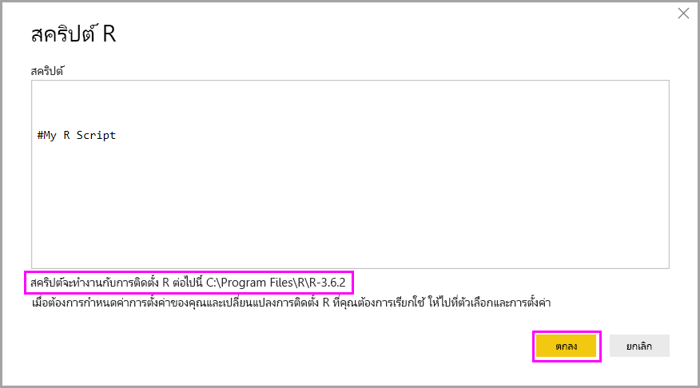

# เรียกใช้สคริปต์ R ใน Power BI DesktopRun R scripts in Power BI Desktop

คุณสามารถเรียกใช้งานสคริปต์ R ได้โดยตรงใน Power BI Desktop และนำเข้าชุดข้อมูลผลลัพธ์ไปยังแบบจำลองข้อมูล Power BI Desktop ได้You can run R scripts directly in Power BI Desktop and import the resulting datasets into a Power BI Desktop data model.

## ติดตั้ง RInstall R

เพื่อเรียกใช้สคริปต์ R ใน  Power BI Desktop คุณต้องทำการติดตั้ง R ลงบนเครื่องของคุณก่อนTo run R scripts in Power BI Desktop, you need to install R on your local machine. คุณสามารถดาวน์โหลดและติดตั้ง R ได้ฟรีจากหลายตำแหน่ง ประกอบด้วย [Microsoft R Application Network](https://mran.revolutionanalytics.com/download/) และ [CRAN Repository](https://cran.r-project.org/bin/windows/base/)You can download and install R for free from many locations, including the [Microsoft R Application Network](https://mran.revolutionanalytics.com/download/) and the [CRAN Repository](https://cran.r-project.org/bin/windows/base/). การเผยแพร่ในปัจจุบันสนับสนุนอักขระ Unicode และช่องว่าง (อักขระว่าง) ในเส้นทางการติดตั้งThe current release supports Unicode characters and spaces (empty characters) in the installation path.

## เรียกใช้สคริปต์ RRun R scripts

เพียงไม่กี่ขั้นตอนใน Power BI Desktop คุณก็สามารถเรียกใช้งานสคริปต์ R และสร้างแบบจำลองข้อมูลได้Using just a few steps in Power BI Desktop, you can run R scripts and create a data model. ด้วยแบบจำลองข้อมูลนั้น คุณสามารถสร้างรายงานและแชร์ไปยังบริการของ Power BI ได้With the data model, you can create reports and share them on the Power BI service. สคริปต์ R ใน Power BI Desktop ตอนนี้สนับสนุนรูปแบบตัวเลขที่มีจุดทศนิยม (.) และเครื่องหมายจุลภาค (,)R scripting in Power BI Desktop now supports number formats that contain decimals (.) and commas (,).

### เตรียมสคริปต์ RPrepare an R script

เพื่อเรียกใช้สคริปต์ R ใน Power BI Desktop สร้างสคริปต์ R ของคุณในสภาพแวดล้อมการพัฒนา และการตรวจสอบให้แน่ใจว่าการเรียกใช้สำเร็จTo run an R script in Power BI Desktop, create the script in your local R development environment, and make sure it runs successfully.

เพื่อเรียกใช้สคริปต์ใน Power BI Desktop ตรวจสอบให้แน่ใจว่าสคริปต์ทำงานสำเร็จในพื้นที่ทำงานที่สร้างขึ้นใหม่และยังไม่ได้เปลี่ยนแปลงอะไรTo run the script in Power BI Desktop, make sure the script runs successfully in a new and unmodified workspace. ข้อกำหนดเบื้องต้นนี้หมายความว่า ทุกแพคเกจและสคริปต์ที่ขึ้นต่อกัน ต้องโหลดและทำงานได้อย่างชัดเจนThis prerequisite means that all packages and dependencies must be explicitly loaded and run. คุณสามารถใช้ `source()` เพื่อเรียกใช้สคริปต์ที่ขึ้นต่อกันได้You can use `source()` to run dependent scripts.

ในการเตรียมการและเรียกใช้สคริปต์ R ใน Power BI Desktop นั้น มีข้อจำกัดอยู่บางประการ:When you prepare and run an R script in Power BI Desktop, there are a few limitations:

* เฉพาะเฟรมข้อมูลเท่านั้นที่ถูกนำเข้า ดังนั้นให้ตรวจสอบแน่ใจว่าข้อมูลที่คุณต้องการนำเข้าไปยัง Power BI อยู่ในรูปเฟรมข้อมูลBecause only data frames are imported, remember to represent the data you want to import to Power BI in a data frame.
* คอลัมน์ที่มีชนิดเป็นจำนวนเชิงซ้อนและเวกเตอร์จะไม่ถูกนำเข้า และจะถูกแทนที่ด้วยค่าผิดพลาดในตารางที่สร้างใหม่Columns typed as Complex and Vector aren't imported, and they're replaced with error values in the created table.
* ค่าที่เป็น `N/A`จะถูกแปลเป็นค่า`NULL` ใน Power BI DesktopValues that are `N/A` are translated to `NULL` values in Power BI Desktop.
* ถ้าการเรียกใช้สคริปต์ R ทำงานนานกว่า 30 นาที จะหมดเวลาIf an R script runs longer than 30 minutes, it times out.
* การเรียกแบบโต้ตอบในสคริปต์ R เช่นรอให้ผู้ใช้ป้อนข้อมูล จะหยุดการทำงานของสคริปต์Interactive calls in the R script, such as waiting for user input, halts the script’s execution.
* เมื่อตั้งค่าไดเรกทอรีการทำงานภายในสคริปต์ R คุณ *ต้อง* กำหนดเส้นทางแบบเต็มไปยังไดเรกทอรีการทำงาน แทนที่จะเป็นเส้นทางสัมพัทธ์When setting the working directory within the R script, you *must* define a full path to the working directory, rather than a relative path.

### เรียกใช้สคริปต์ R ของคุณ และนำเข้าข้อมูลRun your R script and import data

ตอนนี้คุณสามารถเรียกใช้สคริปต์ R เพื่อนำเข้าข้อมูลไปยัง  Power BI Desktop ได้:Now you can run your R script to import data into Power BI Desktop:

1. ใน Power BI Desktop เลือก **รับข้อมูล** เลือก **สคริปต์ R** > **อื่นๆ**  จากนั้นเลือก **เชื่อมต่อ**:In Power BI Desktop, select **Get Data**, choose **Other** > **R script**, and then select **Connect**:

    

2. ถ้า R ได้รับการติดตั้งลงในเครื่องของคุณ เพียงแค่คัดลอกสคริปต์ของคุณไปยังหน้าต่างสคริปต์ และเลือก **ตกลง**If R is installed on your local machine, just copy your script into the script window and select **OK**. เวอร์ชันที่ติดตั้งล่าสุดจะแสดงเป็นเครื่องมือ R ของคุณThe latest installed version is displayed as your R engine.

    

3. เลือก **ตกลง** เพื่อเรียกใช้สคริปต์ RSelect **OK** to run the R Script. เมื่อสคริปต์ทำงานเสร็จเรียบร้อย คุณสามารถเลือกเฟรมข้อมูลผลลัพธ์ เพื่อเพิ่มไปยังรูปแบบ Power BIWhen the script runs successfully, you can then choose the resulting data frames to add to the Power BI model.

คุณสามารถควบคุมได้ว่าจะใช้การติดตั้ง R ใดในการเรียกใช้งานสคริปต์ข้อคุณYou can control which R installation to use to run your script. เพื่อระบุการตั้งค่าการติดตั้ง R ของคุณ เลือก **ไฟล์** > **ตัวเลือกและตั้งค่า** > **ตัวเลือก** จากนั้นเลือก **สคริปต์ R**To specify your R installation settings, choose **File** > **Options and settings** > **Options**, then select **R scripting**. ภายใต้ **ตัวเลือกของสคริปต์ R** รายการแบบดรอปดาวน์ **ไดเรกทอรีหน้าหลัก R ที่ตรวจพบ** แสดงตัวเลือกการติดตั้ง R ปัจจุบันของคุณUnder **R script options**, the **Detected R home directories** dropdown list shows your current R installation choices. ถ้าการติดตั้ง R ที่คุณต้องการไม่ได้อยู่ในรายการ ให้เลือก **อื่นๆ** จากนั้นเรียกดูหรือใส่โฟลเดอร์การติดตั้ง R ที่คุณต้องการใน **ตั้งค่าไดเรกทอรีหน้าหลัก R**If the R installation you want isn't listed, pick **Other**, and then browse to or enter your preferred R installation folder in **Set an R home directory**.

### RefreshRefresh

คุณสามารถรีเฟรชสคริปต์ R ใน Power BI DesktopYou can refresh an R script in Power BI Desktop. เมื่อคุณรีเฟรชสคริปต์ R, Power BI Desktop เรียกใช้สคริปต์ R อีกครั้งในสภาพแวดล้อมของ Power BI DesktopWhen you refresh an R script, Power BI Desktop runs the R script again in the Power BI Desktop environment.

## ขั้นตอนถัดไปNext steps

ดูข้อมูลเพิ่มเติมเกี่ยวกับ R ใน Power BITake a look at the following additional information about R in Power BI.

* [สร้างภาพ Power BI ที่ใช้ RCreate Power BI visuals using R](../create-reports/desktop-r-visuals.md)
* [ใช้ R IDE ภายนอกกับ Power BIUse an external R IDE with Power BI](desktop-r-ide.md)
