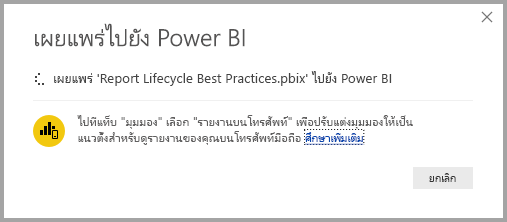
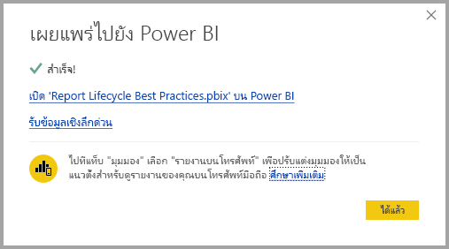

# เชื่อมต่อกับชุดข้อมูลในบริการ Power BI จาก Power BI DesktopConnect to datasets in the Power BI service from Power BI Desktop

คุณสามารถสร้างการเชื่อมต่อไปยังชุดข้อมูลที่ใช้ร่วมกันใน *บริการ Power BI* และสร้างรายงานที่แตกต่างกันที่มากมายจากชุดข้อมูลเดียวกันYou can establish a live connection to a shared dataset in the *Power BI service*, and create many different reports from the same dataset. คุณสามารถสร้างรูปแบบข้อมูลที่สมบูรณ์แบบได้ใน Power BI Desktop และเผยแพร่ไปยังบริการของ Power BIYou can create your perfect data model in Power BI Desktop and publish it to the Power BI service. จากนั้น คุณและผู้อื่นสามารถสร้างรายงานต่างๆ ได้หลายรายการ ในไฟล์ *.pbix* ที่แยกต่างหาก จากรูปแบบข้อมูลทั่วไปแบบเดียวกัน และบันทึกไปยังพื้นที่ทำงานที่แตกต่างThen you and others can create multiple different reports in separate *.pbix* files from that common data model, and save them to different workspaces. ฟีเจอร์นี้เรียกว่า *การเชื่อมต่อ Power BI แบบสด*This feature is called *Power BI service live connection*.

มีการเรียงลำดับทั้งหมดของประโยชน์ของฟีเจอร์นี้ รวมถึงการนำมาใช้ที่ดีที่สุดซึ่งเราจะอภิปรายกันในบทความนี้There are all sorts of benefits of this feature, including best practices, which we discuss during this article. เราแนะนำให้คุณตรวจสอบ [ข้อควรพิจารณาและข้อจำกัด](#limitations-and-considerations) ของฟีเจอร์นี้We recommend you review the [considerations and limitations](#limitations-and-considerations) of this feature.

## การใช้ Power BI service Live connection เพื่อการจัดการวงจรชีวิตรายงานUsing a Power BI service live connection for report lifecycle management

ความท้าทายอย่างหนึ่งในความเป็นที่นิยมของ Power BI คือ การเพิ่มจำนวนรายงาน แดชบอร์ด และโมเดลข้อมูลพื้นฐานOne challenge with the popularity of Power BI is the proliferation of reports, dashboards, and their underlying data models. มันง่ายมากในการสร้างรายงานที่บังคับใน Power BI Desktop แล้ว [เผยแพร่](../create-reports/desktop-upload-desktop-files.md) รายงานเหล่านั้นในบริการ Power BI และสร้างแดชบอร์ดที่ยิ่งใหญ่จากชุดข้อมูลเหล่านั้นIt's easy to create compelling reports in Power BI Desktop, then [publish](../create-reports/desktop-upload-desktop-files.md) those reports in the Power BI service, and to create great dashboards from those datasets. เนื่องจากผู้คนมากมายมักจะใชชุดข้อมูลเดียวกัน หรือเกือบเหมือนกัน การตระหนักว่ารายงานชิ้นไหนอยู่ในชุดข้อมูลใด และชุดข้อมูลแต่ละชุดนั้นเป็นข้อมูลใหม่ขนาดไหนกลายเป็นเรื่องที่ท้าทายSince so many people do so, often using the same or nearly the same datasets, knowing which report was based on which dataset and how fresh each dataset might be becomes a challenge. Power BI service Live connection กล่าวถึงความท้าทายนั้น และทำการสร้าง แชร์ และขยายตามรายงานชุดข้อมูลทั่วไปและแดชบอร์ดได้ง่ายขึ้น และมีความคงเส้นคงวาThe Power BI service live connection addresses that challenge, and makes creating, sharing, and expanding upon common-dataset reports and dashboards easier and consistent.

### สร้างชุดข้อมูลที่ทุกคนสามารถใช้และแชร์ต่อได้Create a dataset everyone can use, then share it

สมมติว่า Anna เป็นนักวิเคราะห์ทางธุรกิจใจทีมของคุณLet's say Anna is a business analyst is on your team. Anna มีทักษะในการสร้างรูปแบบข้อมูลที่ดี ที่เรียกว่าชุดข้อมูลAnna is skilled at creating good data models, often called datasets. แอนนาสามารถสร้างชุดข้อมูลและรายงาน และแชร์รายงานนั้นในบริการของ Power BI ได้Anna can create a dataset and report, and then share that report in the Power BI service.

ทุกคนรักรายงานและชุดข้อมูลของ AnnaEveryone loves Anna's report and dataset. และตรงนี้เป็นจุดเริ่มต้นของปัญหาThat's where the trouble would begin. ทุกคนในทีมของ Anna จะพยายามสร้าง *ชุดข้อมูลเวอร์ชั่นของตนเอง* จากชุดข้อมูลนั้น ได้แชร์รายงานของตนกับทีมEveryone on Anna's team would attempt to create *their own version* of that dataset, then share their own reports with the team. จึงทำให้มีรายงานจำนวนหลายชิ้นเกิดขึ้นมาโดยพลันจากชุดข้อมูลที่แตกต่างกันในพื้นที่ทำงานของทีมของคุณในบริการของ Power BIAll of the sudden, there would be a multitude of reports from different datasets in your team's workspace in the Power BI service. อันไหนเป็นชิ้นล่าสุดWhich was the most recent? ชุดข้อมูลทั้งหมดเหมือนกันหรือไม่ หรือว่าแค่เกือบเหมือนกันเท่านั้นWere the datasets the same, or only almost? อะไรคือความแตกต่างWhat were the differences? ด้วยฟีเจอร์การเชื่อมต่อบริการ Power BI ทุกอย่างจะเปลี่ยนแปลงไปในทางที่ดีกว่าได้With the Power BI service live connection feature, all that can change for the better. ในส่วนถัดไป เราจะได้เห็นวิธีที่ผู้อื่นสามารถใช้ชุดข้อมูลที่แอนนาเผยแพร่ไว้เพื่อรายงานของพวกเขาเอง ในพื้นที่ทำงานของพวกเขาเอง และเปิดให้ทุกคนสามารถใช้ชุดข้อมูลที่เผยแพร่อย่างเชื่อใจได้ในการสร้างรายงานที่เป็นเอกลักษณ์ของพวกเขาIn the next section, we see how others can use Anna's published dataset for their own reports, in their own workspaces, and enable everyone to use the same solid, vetted, published dataset to build their unique reports.

### เชื่อมต่อชุดข้อมูลบริการ Power BI โดยใช้การเชื่อมต่อสดConnect to a Power BI service dataset using a live connection

Anna สร้างรายงานและสร้างชุดข้อมูลตามที่กำหนดAnna creates a report and creates the dataset it's based upon. Anna ได้เผยแพร่ไปยังบริการ Power BIAnna then publishes it to the Power BI service. รายงานแสดงในพื้นที่ทำงานของทีมในบริการ Power BIThe report shows up in the team's workspace in the Power BI service. หาก Anna บันทึกไปยัง *พื้นที่ทำงานประสบการณ์ใหม่*If Anna saves it to a *new experience workspace*. แอนนาจะสามารถตั้งค่า *สิทธิ์ในการสร้าง* เพื่อให้พร้อมใช้งานสำหรับทุกคนที่เข้าและออกจากพื้นที่ทำงานของตนเพื่อดูและใช้งานAnna can set *Build permission* to make it available to everyone in and out of their workspace to see and use.

หากต้องการเรียนรู้เพิ่มเติมเกี่ยวกับพื้นที่ทำงานที่มีประสบการณ์การใช้งานใหม่ โปรดดู[พื้นที่ทำงาน](../collaborate-share/service-new-workspaces.md)To learn more about the new experience workspaces, see [workspaces](../collaborate-share/service-new-workspaces.md).

ตอนนี้สมาชิกคนอื่น ๆ ในพื้นที่ทำงานของ Anna สามารถสร้างการเชื่อมต่อสดไปยังโมเดลข้อมูลที่ Anna แชร์ไว้ ใช้ฟีเจอร์ Power BI service live connectionOther members in and out of Anna's workspace can now establish a live connection to Anna's shared data model using the Power BI service live connection feature. พวกเขาสามารถสร้างรายงานที่เป็นแบบฉบับของตนเอง จาก *ชุดข้อมูลดั้งเดิมของพวกเขา* ใน *พื้นที่ทำงานประสบการณ์ใหม่ของพวกเขาเอง* They can create their own unique reports, from *their original dataset*, in *their own new experience workspaces*.

ในรูปต่อไปนี้ คุณจะเห็นวิธีที่ Anna สร้างรายงาน Power BI Desktop และพร้อมเผยแพร่ ซึ่งรวมถึงรูปโมเดลข้อมูล ไปยังบริการ Power BIIn the following image, you see how Anna creates one Power BI Desktop report, and publishes it, which includes its data model, to the Power BI service. จากนั้นผู้อื่นสามารถเชื่อมต่อกับรูปแบบข้อมูลของ Anna โดยใช้การเชื่อมต่อสดจากบริการของ Power BI และสร้างรายงานที่เป็นแบบฉบับของตนเองในพื้นที่ทำงานของตนโดยยึดตามชุดข้อมูลของ AnnaThen others can connect to Anna's data model using the Power BI service live connection, and create their own unique reports in their own workspaces, based on Anna's dataset.

> [!NOTE]
> ถ้าคุณบันทึกชุดข้อมูลของคุณไปยัง[พื้นที่ทำงานที่แชร์แบบคลาสสิก](../collaborate-share/service-create-workspaces.md) เฉพาะสมาชิกในพื้นที่ทำงานนั้นที่สร้างรายงานบนชุดข้อมูลของคุณIf you save your dataset to a [classic shared workspace](../collaborate-share/service-create-workspaces.md), only members of that workspace build reports on your dataset. ในการติดตั้ง Power BI service live connection นั้นชุดข้อมูลที่คุณเชื่อมต่อจะต้องอยู่ในพื้นที่ทำงานที่ใช้ร่วมกันที่คุณเป็นสมาชิกอยู่To establish a Power BI service live connection, the dataset to which you connect must be in a shared workspace of which you are a member.
> 
> 

## ขั้นตอนแต่ละขั้นตอนสำหรับการใช้การเชื่อมต่อสดจากบริการของ  Power BIStep by step for using the Power BI service live connection

ในตอนนี้ให้เราทราบแล้วว่าการเชื่อมต่อสดจากบริการของ  Power BI มีประโยชน์อย่างไร และคุณจะสามารถใช้มันอย่างไรให้เกิดประโยชน์สูงสุดเพื่อรองรับการจัดการวงจรชีวิตรายงาน มาดูกันทีละขั้นตอนจากรายงานชุดข้อมูล อันเยี่ยมยอดของแอนนาไปจนถึงชุดข้อมูลที่ใช้ร่วมกันที่เพื่อนร่วมทีม Power BI ของเธอสามารถใช้ได้Now that we know how useful the Power BI service live connection is, and how you can use it as a best practice approach to report lifecycle management, let's walk through the steps that get us from Anna's great report and dataset to a shared dataset that her Power BI teammates can use.

### เผยแพร่รายงาน Power BI และชุดข้อมูลPublish a Power BI report and dataset

ขั้นตอนแรกในการจัดการวงจรชีวิตรายงานการเชื่อมต่อสดจากบริการของ Power BI คือการมีรายงานและชุดข้อมูลที่เพื่อนร่วมทีมต้องการใช้The first step in managing the report lifecycle using a Power BI service live connection is to have a report and dataset that teammates want to use. ดังนั้น สิ่งแรกที่แอนนาต้องทำคือ *เผยแพร่* รายงานจาก Power BI DesktopSo Anna must first *publish* the report from Power BI Desktop. เลือก **เผยแพร่** จากริบบิ้น **หน้าแรก** ใน Power BI DesktopSelect **Publish** from the **Home** ribbon in Power BI Desktop.

หากแอนนาไม่ได้ลงชื่อเข้าใช้บัญชีบริการของ Power BI แล้ว Power BI  จะพร้อมท์ให้แอนนาทำเช่นนั้นIf Anna isn't signed in to the Power BI service account, Power BI prompts Anna to do so.

จากที่นั่น แอนนาสามารถเลือกพื้นที่ทำงานปลายทางที่รายงานและชุดข้อมูลจะเผยแพร่ไปFrom there, Anna can choose the workspace destination to which the report and dataset will be published. อย่าลืมว่า ถ้าแอนนาบันทึกในพื้นที่ทำงานที่มีประสบการณ์การใช้งานใหม่ ทุกคนที่มีสิทธิ์ในการสร้างจะสามารถเข้าถึงชุดข้อมูลนั้นได้Remember, if Anna saves it to a new experience workspace, then anyone with Build permission can have access to that dataset. สิทธิ์ในการสร้างถูกตั้งค่าในบริการของ Power BI หลังจากการเผยแพร่Build permission is set in the Power BI service, after publishing. ถ้างานที่บันทึกลงในพื้นที่ทำงานแบบคลาสสิกเฉพาะสมาชิกทีมีสิทธิ์ในการเข้าถึงพื้นที่ทำงานที่รายงานเผยแพร่อยู่เท่านั้นที่จะสามารถเข้าถึงชุดข้อมูลของรายงานโดยใช้การเชื่อมต่อสดจากบริการของ Power BIIf work is saved to a classic workspace only members who have access to the workspace where a report is published can access its dataset using a Power BI service live connection.

กระบวนการเผยแพรเริ่มต้น และ Power BI Desktop จะแสดงความคืบหน้าThe publishing process begins, and Power BI Desktop shows the progress.

เมื่อเสร็จสมบูรณ์แล้ว Power BI Desktop จะแสดงความสำเร็จ และจะให้ลิงก์สองสามลิงก์เพื่อช่วยให้คุณสามารถเข้าไปดูรายงานในบริการ Power BI และลิงก์เพื่อรับข้อมูลเชิงลึกอย่างรวดเร็วเกี่ยวกับรายงานOnce complete, Power BI Desktop shows you success, and provides a couple links to get you to the report itself in the Power BI service, and a link to get quick insights about the report.

ตอนนี้รายงานของคุณกับชุดข้อมูลอยู่ในบริการของ Power BI แล้ว คุณยังสามารถ *เลื่อนระดับ* มันได้ Now that your report with its dataset is in the Power BI service, you can also *promote* it. การเพิ่มระดับหมายถึงคุณทำการพิสูจน์คุณภาพและความน่าเชื่อถือของมันแล้วPromotion means that you attest to its quality and reliability. คุณสามารถขอรับ *การรับรอง* จากผู้มีอำนาจส่วนกลางในผู้เช่า Power BI ของคุณได้You can even request that it be *certified* by a central authority in your Power BI tenant. ด้วยการรับรองอย่างใดอย่างหนึ่งเหล่านี้ ชุดข้อมูลของคุณจะปรากฏที่ด้านบนของรายการเมื่อบุคคลกำลังค้นหาชุดข้อมูลWith either of these endorsements, your dataset always appears at the top of the list when people are looking for datasets. สำหรับข้อมูลเพิ่มเติม ให้ดู [รับรองเนื้อหาของคุณ](../collaborate-share/service-endorse-content.md)For more information, see [Endorse your content](../collaborate-share/service-endorse-content.md).

ขั้นตอนสุดท้ายที่ตั้งค่าการอนุญาตในการสร้างสำหรับชุดข้อมูลที่รายงานใช้อ้างอิงThe last step is to set Build permission for the dataset the report is based on. สิทธิ์ในการสร้างจะกำหนดผู้ที่สามารถดูและใช้ชุดข้อมูลของคุณได้Build permission determines who can see and use your dataset. คุณสามารถตั้งค่าในพื้นที่ทำงาน หรือเมื่อคุณแชร์แอปจากพื้นที่ทำงานได้You can set it in the workspace itself, or when you share an app from the workspace. สำหรับข้อมูลเพิ่มเติม ดู [การอนุญาตในการสร้างสำหรับชุดข้อมูลที่แชร์](service-datasets-build-permissions.md)For more information, see [Build permission for shared datasets](service-datasets-build-permissions.md).

ถัดไป มาดูวิธีที่เพื่อนร่วมทีมอื่น ๆ ที่สามารถเข้าถึงพื้นที่ทำงานที่รายงานและชุดข้อมูล ถูกเผยแพร่แล้ว สามารถทำการเชื่อมต่อกับชุดข้อมูล และสร้างรายงานของพวกเขาเองได้Next, let's see how other teammates who have access to the workspace where the report and dataset were published can connect to the dataset and build their own reports.

### สร้าง Power BI service live connection ไปยังชุดข้อมูลเผยแพร่แล้วEstablish a Power BI service live connection to the published dataset

ในการที่จะติดตั้งการเชื่อมต่อไปยังรายงานที่เผยแพร่อยู่ และสร้างรายงานของคุณเองตามชุดข้อมูลที่เผยแพร่อยู่นั้น ให้เลือก **รับข้อมูล** จากริบบิ้น **หน้าแรก** ใน Power BI Desktop เลือก **Power Platform** ในบานหน้าต่างด้านซ้าย แล้วเลือก **ชุดข้อมูล Power BI**To establish a connection to the published report, and create your own report based on the published dataset, select **Get Data** from the **Home** ribbon in Power BI Desktop, select **Power Platform** in the left pane, and then select **Power BI datasets**.

หากคุไม่ได้ลงชื่อ Power BI จะพร้อมให้คุณลงชื่อIf you're not signed in, Power BI prompts you to sign in. เมื่อทำการลงชื่อ Power BI แสดงพื้นที่ทำงานที่คุณเป็นสมาชิกอยู่Once signed in, Power BI shows which workspaces you're a member of. คุณสามารถเลือกพื้นที่ทำงานใดที่มีชุดข้อมูลที่คุณต้องการสร้างการเชื่อมต่อแบบสดของบริการ Power BIYou can select which workspace contains the dataset to which you want to establish a Power BI service live connection.

ชุดข้อมูลในรายการคือชุดข้อมูลที่แชร์ทั้งหมดที่คุณมีสิทธิ์ในการสร้างในพื้นที่ทำงานใด ๆThe datasets in the list are all the shared datasets you have Build permission for, in any workspace. คุณสามารถค้นหาชุดข้อมูลที่เฉพาะ และดูชื่อ เจ้าของ พื้นที่ทำงานที่มีชุดข้อมูลและเมื่อมีการรีเฟรชล่าสุดYou can search for a specific dataset and see its name, owner, the workspace where it resides, and when it was last refreshed. คุณยังดูชุดข้อมูล **ENDORSEMENT** ที่ผ่านการรับรองหรือเลื่อนระดับที่ด้านบนของรายการYou also see **ENDORSEMENT** for datasets, either certified or promoted, at the top of the list.

เมื่อคุณเลือก **สร้าง**, คุณจะสร้างการเชื่อมต่อแบบสดไปยังชุดข้อมูลที่เลือกWhen you select **Create**, you establish a live connection to the selected dataset. Power BI Desktop โหลดเขตข้อมูลและค่าของพวกเขาที่คุณเห็นไปยัง Power BI Desktop ในเวลาจริงPower BI Desktop loads the fields and their values that you see into Power BI Desktop in real time.

ในตอนนี้ คุณและคนอื่นสามารถสร้าง และแชร์รายงานแบบกำหนดเอง จากชุดข้อมูลเดียวกันทั้งหมดNow you and others can create and share custom reports, all from the same dataset. การเข้าถึงนี้เป็นวิธีที่ดีที่สุดในการมีความรู้ของคนหนึ่งคนในการสร้างรูปแบบชุดข้อมูลที่ดี ดังเช่นที่ Anna สร้างThis approach is a great way to have one knowledgeable person create a well-formed dataset, such as what Anna does. เพื่อร่วมทีมหลายคนสามารถใช้ชุดข้อมูลที่แขร์และสร้างรายงานด้วยตัวของพวกเขาMany teammates can use that shared dataset to create their own reports.

## ข้อจำกัดและข้อควรพิจารณาLimitations and considerations

เมื่อใช้การเชื่อมต่อแบบสดของบริการของ Power BI จะมีข้อจำกัดและข้อควรพิจารณาถึงบางประการWhen using the Power BI service live connection, there are a few limitations and considerations to keep in mind.

* เฉพาะผู้ใช้ที่มีสิทธิ์ในการสร้างสำหรับชุดข้อมูลเท่านั้นที่สามารถเชื่อมต่อกับชุดข้อมูลที่เผยแพร่แล้วโดยใช้การเชื่อมต่อแบบสดของบริการของ Power BI ได้Only users with Build permission for a dataset can connect to a published dataset using the Power BI service live connection.
* เฉพาะผู้ใช้ฟรีเท่านั้นที่เห็นชุดข้อมูลจาก **พื้นที่ทำงานของฉัน** และในพื้นที่ทำงานแบบพรีเมียมFree users only see datasets in their **My Workspace** and in Premium-based workspaces.
* ตั้งแต่การเชื่อมต่อนี้คือการเชื่อมต่อแบบสด การนำทางด้านซ้ายและการทำรูปแบบที่ไม่สามารถใช้ได้Since this connection is a live connection, left-navigation and modeling are disabled. คุณสามารถเพียงเชื่อมต่อไปยังชุดข้อมูลของแต่ละรายงานYou can only connect to one dataset in each report. ลักษณะพฤติกรรมนี้คล้ายคลึงกับพฤติกรรมเมื่อเชื่อมต่อไปยัง *SQL Server Analysis Services*This behavior is similar to the behavior when connected to *SQL Server Analysis Services*. อย่างไรก็ตาม บทความต่อไปนี้อธิบายวิธีการที่ฟีเจอร์ใหม่ใน Power BI ในขณะนี้ทำได้ดังนี้: ดูการ[ใช้ DirectQuery สำหรับชุดข้อมูลบริการวิเคราะห์ Power BI และ Azure (ตัวอย่าง)](../connect-data/desktop-directquery-datasets-azure-analysis-services.md)However, the following article describes how a new feature in Power BI now makes this possible: see [using DirectQuery for Power BI datasets and Azure Analysis Services (preview)](../connect-data/desktop-directquery-datasets-azure-analysis-services.md)
* ตั้งแต่การเชื่อมต่อนี้คือการเชื่อมต่อแบบสด รักษาความปลอดภัยระดับแถว (RLS) และการเชื่อมต่ออื่นๆ เช่นลักษณะพฤติกรรมของการเชื่อมต่อที่ถูกบังคับSince this connection is a live connection, row-level security (RLS) and other such connection behaviors are enforced. นี่คือแบบเดียวกับเมื่อเชื่อมต่อกับ SQL Server Analysis ServicesThis is the same as when connected to SQL Server Analysis Services.
* ถ้าเจ้าของปรับเปลี่ยนไฟล์ *.pbix* ต้นฉบับที่ใช้ร่วมกัน ชุดข้อมูลและรายงานที่ใช้ร่วมกันในบริการ Power BI จะถูกเขียนทับIf the owner modifies the original shared *.pbix* file, the dataset and report that is shared in the Power BI service is overwritten. รายงานตามชุดข้อมูลดังกล่าวจะไม่ถูกเขียนทับ แต่เปลี่ยนแปลงใด ๆ กับชุดข้อมูลจะมีผลในรายงานReports based on that dataset aren't overwritten, but any changes to the dataset are reflected in the report.
* สมาชิกของพื้นที่ทำงานไม่สามารถเปลี่ยนทับรายงานต้นฉบับที่ใช้ร่วมกันMembers of a workspace can't replace the originally shared report. หากมีการพยายามที่จะเปลี่ยนทับรายงานต้นฉบับ จะมีข้อความเตือนขึ้นมาให้คุณเปลี่ยนชื่อไฟล์ และเผยแพร่Attempts to do so result in a warning that prompts you to rename the file, and publish.
* ถ้าคุณลบชุดข้อมูลที่แชร์ในบริการของ Power BI แล้วรายงานอื่นๆ ตามชุดข้อมูลนั้นจะทำงานได้ไม่ถูกต้อง หรือแสดงวิชวลขึ้นมาIf you delete the shared dataset in the Power BI service, then other reports based on that dataset will no longer work properly or display their visuals.
* สำหรับชุดเนื้อหา คุณต้องสร้างสำเนาชุดเนื้อหาก่อนที่ใช้เป็นพื้นฐานสำหรับการแชรรายงาน *.pbix* และชุดข้อมูลไปยังบริการ Power BIFor Content Packs, you must first create a copy of a content pack before using it as a basis for sharing a *.pbix* report and dataset to the Power BI service.
* สำหรับชุดเนื้อหาจาก *องค์กรของฉัน* เมื่อทำการคัดลอกแล้ว คุณจะไม่สามารถแทนรายงานที่สร้างบนบริการและ/หรือรายงานที่สร้างขึ้นเป็นส่วนหนึ่งของการคัดลอก Content Pack ด้วยการเชื่อมต่อสดได้For Content Packs from *My Organization*, once copied, you can't replace the report created on the service or a report created as part of copying a Content Pack with a live connection. หากมีการพยายามที่จะเปลี่ยนทับรายงานต้นฉบับ จะมีข้อความเตือนขึ้นมาให้คุณเปลี่ยนชื่อไฟล์ และเผยแพร่Attempts to do so result in a warning that prompts you to rename the file, and publish. ในสถานการณ์นี้ คุณสามารถแทนรายงานเชื่อมต่อสดที่เผยแพร่แล้วเท่านั้นIn this situation, you can only replace published live connected reports.
* การลบชุดข้อมูลที่แชร์ในบริการของ Power BI หมายความว่าไม่มีใครสามารถเข้าถึงชุดข้อมูลนั้นได้จาก Power BI DesktopDeleting a shared dataset in the Power BI service means no one can access that dataset any longer from Power BI Desktop.
* รายงานที่แชร์ชุดข้อมูลร่วมกันบนบริการของ Power BI ไม่สนับสนุนการปรับใช้โดยอัตโนมัติโดยใช้ Power BI REST APIReports that share a dataset on the Power BI service don't support automated deployments using the Power BI REST API.

## ขั้นตอนถัดไปNext steps
สำหรับข้อมูลเพิ่มเติมเกี่ยวกับ DirectQuery และฟีเจอร์การเชื่อมต่อข้อมูล Power BI อื่นๆ โปรดดูที่ทรัพยากรดังต่อไปนี้:For more information on DirectQuery and other Power BI data connection features, check out the following resources:

- [การใช้ DirectQuery ใน Power BIUsing DirectQuery in Power BI](desktop-directquery-about.md)
- [แหล่งข้อมูลที่สนับสนุนโดย DirectQueryData sources supported by DirectQuery](power-bi-data-sources.md)
- [การใช้ DirectQuery สำหรับชุดข้อมูล Power BI และ Azure Analysis Services (ตัวอย่าง)Using DirectQuery for Power BI datasets and Azure Analysis Services (preview)](../connect-data/desktop-directquery-datasets-azure-analysis-services.md)

ต่อไปนี้คือลิงก์เพิ่มเติมสำหรับข้อมูลเพิ่มเติมเกี่ยวกับ Power BI:Here are some additional links for more information about Power BI:

* [Power BI Desktop คืออะไรWhat is Power BI Desktop?](../fundamentals/desktop-what-is-desktop.md)
* [ภาพรวมคำถามด้วย Power BI DesktopQuery overview with Power BI Desktop](../transform-model/desktop-query-overview.md)
* [ชนิดข้อมูลใน Power BI DesktopData types in Power BI Desktop](desktop-data-types.md)
* [จัดรูปร่างและรวมข้อมูลด้วย Power BI DesktopShape and combine data with Power BI Desktop](desktop-shape-and-combine-data.md)
* [งานแบบสอบถามทั่วไปใน Power BI DesktopCommon query tasks in Power BI Desktop](../transform-model/desktop-common-query-tasks.md)
