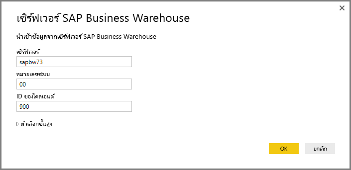
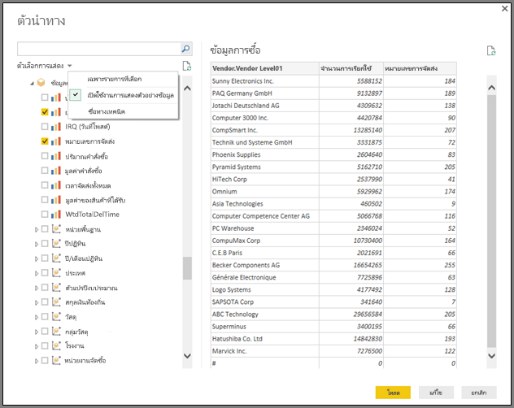

# <a name="use-the-sap-business-warehouse-connector-in-power-bi-desktop"></a><span data-ttu-id="f8317-103">ใช้ตัวเชื่อมต่อ SAP Business Warehouse (BW) ใน Power BI Desktop</span><span class="sxs-lookup"><span data-stu-id="f8317-103">Use the SAP Business Warehouse connector in Power BI Desktop</span></span>

<span data-ttu-id="f8317-104">ด้วย Power BI Desktop คุณสามารถเข้าถึงข้อมูล *SAP Business Warehouse (BW)* ได้</span><span class="sxs-lookup"><span data-stu-id="f8317-104">With Power BI Desktop, you can access *SAP Business Warehouse (BW)* data.</span></span>

<span data-ttu-id="f8317-105">สำหรับข้อมูลเกี่ยวกับว่าลูกค้า SAP จะได้ประโยชน์จากการเชื่อมต่อ Power BI กับระบบ SAP BW อย่างไร ดูที่[เอกสารทางเทคนิค Power BI และ SAP BW](https://aka.ms/powerbiandsapbw)</span><span class="sxs-lookup"><span data-stu-id="f8317-105">For information about how SAP customers can benefit from connecting Power BI to their existing SAP BW systems, see the [Power BI and SAP BW whitepaper](https://aka.ms/powerbiandsapbw).</span></span> <span data-ttu-id="f8317-106">สำหรับรายละเอียดเกี่ยวกับการใช้ DirectQuery ด้วย SAP BW ดู [DirectQuery และ SAP Business Warehouse (BW)](desktop-directquery-sap-bw.md)</span><span class="sxs-lookup"><span data-stu-id="f8317-106">For details about using DirectQuery with SAP BW, see [DirectQuery and SAP Business Warehouse (BW)](desktop-directquery-sap-bw.md).</span></span>

<span data-ttu-id="f8317-107">เริ่มด้วยการเผยแพร่ Power BI Desktop ในเดือนมิถุนายน 2018 และโดยทั่วไปจะมีที่เผยแพร่ในเดือนตุลาคม 2018 คุณสามารถใช้ *ตัวเชื่อมต่อ SAP BW* กับการใช้งานที่มีการปรับปรุงประสิทธิภาพและความสามารถที่มากมาย</span><span class="sxs-lookup"><span data-stu-id="f8317-107">Starting with the June 2018 release of Power BI Desktop and generally available in October 2018, you can use the *SAP BW connector* with an implementation that has significant improvements in performance and capabilities.</span></span> <span data-ttu-id="f8317-108">Microsoft ทำการปรับปรุงตัวเชื่อมต่อ SAP BW *การอิมพลีเมนต์ 2.0*</span><span class="sxs-lookup"><span data-stu-id="f8317-108">Microsoft developed SAP BW connector *Implementation 2.0*.</span></span> <span data-ttu-id="f8317-109">เลือกเวอร์ชั่น 1 ของตัวเชื่อมต่อ SAP BW หรือตัวเชื่อมต่อ การอิมพลีเมนต์ 2.0 SAP ได้</span><span class="sxs-lookup"><span data-stu-id="f8317-109">Select either version 1 of the SAP BW Connector, or the Implementation 2.0 SAP Connector.</span></span> <span data-ttu-id="f8317-110">ส่วนต่อไปนี้จะอธิบายการติดตั้งแต่ละเวอร์ชันตามลำดับ</span><span class="sxs-lookup"><span data-stu-id="f8317-110">The following sections describe the installation of each version, in turn.</span></span> <span data-ttu-id="f8317-111">คุณสามารถเลือกตัวเชื่อมต่อตัวใดตัวหนึ่ง เพื่อเชื่อมต่อกับ SAP BW จาก Power BI Desktop ได้</span><span class="sxs-lookup"><span data-stu-id="f8317-111">You can choose one or the other connector when connecting to SAP BW from Power BI Desktop.</span></span>

<span data-ttu-id="f8317-112">เราแนะนำให้คุณใช้ตัวเชื่อมต่อ SAP การอิมพลีเมนต์ 2.0 ถ้าเป็นไปได้</span><span class="sxs-lookup"><span data-stu-id="f8317-112">We suggest you use the Implementation 2.0 SAP Connector whenever possible.</span></span>

## <a name="installation-of-version-1-of-the-sap-bw-connector"></a><span data-ttu-id="f8317-113">การติดตั้งเวอร์ชั่น 1 ของตัวเชื่อมต่อ SAP BW</span><span class="sxs-lookup"><span data-stu-id="f8317-113">Installation of version 1 of the SAP BW Connector</span></span>

<span data-ttu-id="f8317-114">เราแนะนำให้คุณใช้ตัวเชื่อมต่อ SAP การอิมพลีเมนต์ 2.0 ถ้าเป็นไปได้</span><span class="sxs-lookup"><span data-stu-id="f8317-114">We recommend using the Implementation 2.0 SAP Connector whenever possible.</span></span> <span data-ttu-id="f8317-115">ในส่วนนี้อธิบายการติดตั้งเวอร์ชั่น 1 ของตัวเชื่อมต่อ SAP BW</span><span class="sxs-lookup"><span data-stu-id="f8317-115">This section describes installation of version 1 of the SAP BW Connector.</span></span>

1. <span data-ttu-id="f8317-116">ติดตั้งไลบรารี *SAP NetWeaver* บนเครื่องคอมพิวเตอร์ของคุณ</span><span class="sxs-lookup"><span data-stu-id="f8317-116">Install the *SAP NetWeaver* library on your local computer.</span></span> <span data-ttu-id="f8317-117">คุณสามารถเรียกดูไลบรารี SAP Netweaver จากผู้ดูแลระบบ SAP ของคุณ หรือดูได้โดยตรงจาก [ศูนย์ดาวน์โหลดซอฟต์แวร์ SAP](https://support.sap.com/swdc)</span><span class="sxs-lookup"><span data-stu-id="f8317-117">You can get the SAP NetWeaver library from your SAP administrator or directly from the [SAP Software Download Center](https://support.sap.com/swdc).</span></span> <span data-ttu-id="f8317-118">เนื่องจากศูนย์ดาวน์โหลดซอฟต์แวร์ SAP นั้นมีการเปลี่ยนแปลงโครงสร้างบ่อยครั้ง คำแนะนำการนำทางที่เฉพาะเจาะจงมากกว่านี้ในเว็บไซต์ดังกล่าวจึงไม่พร้อมใช้งาน</span><span class="sxs-lookup"><span data-stu-id="f8317-118">Since the SAP Software Download Center changes its structure frequently, more specific guidance for navigating that site isn't available.</span></span> <span data-ttu-id="f8317-119">ไลบรารี SAP NetWeaver จะรวมอยู่ในการติดตั้งเครื่องมือลูกค้า SAP ด้วย</span><span class="sxs-lookup"><span data-stu-id="f8317-119">The SAP NetWeaver library is usually included in the SAP Client Tools installation.</span></span>

   <span data-ttu-id="f8317-120">คุณอาจสามารถค้นหา *บันทึกย่อ SAP #1025361* เพื่อให้ได้ตำแหน่งการดาวน์โหลดสำหรับเวอร์ชันล่าสุดได้</span><span class="sxs-lookup"><span data-stu-id="f8317-120">You can search for *SAP Note #1025361* to get the download location for the most recent version.</span></span> <span data-ttu-id="f8317-121">ให้แน่ใจว่าระบบโครงสร้างสำหรับไลบรารี SAP NetWeaver (32-bit หรือ 64-bit) ตรงกับการติดตั้ง Power BI Desktop ของคุณ</span><span class="sxs-lookup"><span data-stu-id="f8317-121">Make sure the architecture for the SAP NetWeaver library (32-bit or 64-bit) matches your Power BI Desktop installation.</span></span> <span data-ttu-id="f8317-122">ติดตั้งไฟล์ทั้งหมดรวมเข้สใน *SAP NetWeaver RFC SDK* ตามบันทึกย่อ SAP</span><span class="sxs-lookup"><span data-stu-id="f8317-122">Install all files included in the *SAP NetWeaver RFC SDK* according to the SAP Note.</span></span>
2. <span data-ttu-id="f8317-123">ใน Power BI Desktop เลือก **รับข้อมูล**</span><span class="sxs-lookup"><span data-stu-id="f8317-123">In Power BI Desktop, select **Get Data**.</span></span> <span data-ttu-id="f8317-124">ตัวเลือก **ชุดข้อมูล** รวมกับ *เซิร์ฟเวอร์แอปพลิเคชันของ SAP Business Warehouse* และ *เซิร์ฟเวอร์ข้อความ SAP Business Warehouse*</span><span class="sxs-lookup"><span data-stu-id="f8317-124">The **Database** options include *SAP Business Warehouse Application Server* and *SAP Business Warehouse Message Server*.</span></span>

   

## <a name="installation-of-implementation-20-sap-connector"></a><span data-ttu-id="f8317-126">การติดตั้งของตัวเชื่อมต่อ SAP Implementation 2.0</span><span class="sxs-lookup"><span data-stu-id="f8317-126">Installation of Implementation 2.0 SAP Connector</span></span>

<span data-ttu-id="f8317-127">การอิมพลีเมนต์ 2.0 ของตัวเชื่อม SAP Connector ต้องการตัวเชื่อม 3.0 ของ SAP .NET</span><span class="sxs-lookup"><span data-stu-id="f8317-127">Implementation 2.0 of the SAP Connector requires the SAP .NET Connector 3.0.</span></span> <span data-ttu-id="f8317-128">การเข้าถึงการดาวน์โหลดจำเป็นต้องมี S-user ที่ถูกต้อง</span><span class="sxs-lookup"><span data-stu-id="f8317-128">Access to the download requires a valid S-user.</span></span> <span data-ttu-id="f8317-129">เชื่อมต่อทีม SAP หลักของคุณ  เพื่อรับ ตัวเชื่อม 3.0 ของ SAP .NET</span><span class="sxs-lookup"><span data-stu-id="f8317-129">Contact your SAP Basis team to get the SAP .NET Connector 3.0.</span></span>

<span data-ttu-id="f8317-130">คุณสามารถดาวน์โหลด [ตัวเชื่อม 3.0 ของ SAP .NET](https://support.sap.com/en/product/connectors/msnet.html) จาก SAP</span><span class="sxs-lookup"><span data-stu-id="f8317-130">You can download the [SAP .NET Connector 3.0](https://support.sap.com/en/product/connectors/msnet.html) from SAP.</span></span>

<span data-ttu-id="f8317-131">ตัวเชื่อมจะมาในเวอร์ชั่น 32-bit และ 64-bit </span><span class="sxs-lookup"><span data-stu-id="f8317-131">The connector comes in 32-bit and 64-bit versions.</span></span> <span data-ttu-id="f8317-132">เลือกเวอร์ชั่นที่ตรงกับการติดตั้ง Power BI Desktop ของคุณ </span><span class="sxs-lookup"><span data-stu-id="f8317-132">Choose the version that matches your Power BI Desktop installation.</span></span> <span data-ttu-id="f8317-133">ขณะนี้ เว็ปไซต์ได้ทำรายการสองเวอร์ชั่นสำหรับเฟรมเวอร์ค .NET 4.0:</span><span class="sxs-lookup"><span data-stu-id="f8317-133">Currently, the website lists two versions for .NET 4.0 framework:</span></span>

* <span data-ttu-id="f8317-134">ตัวเชื่อม SAP สำหรับ Microsoft .NET 3.0.22.0 สำหรับ Windows 32-bit (x86) เป็นซิปไฟล์ (6.896 KB) วันที่ 1 มิถุนายน 2019</span><span class="sxs-lookup"><span data-stu-id="f8317-134">SAP Connector for Microsoft .NET 3.0.22.0 for Windows 32-bit (x86) as zip file (6.896 KB), June 1, 2019</span></span>
* <span data-ttu-id="f8317-135">ตัวเชื่อม SAP สำหรับ Microsoft .NET 3.0.22.0 สำหรับ Windows 64-bit (x64) เป็นซิปไฟล์ (7.180 KB) วันที่ 1 มิถุนายน 2019</span><span class="sxs-lookup"><span data-stu-id="f8317-135">SAP Connector for Microsoft .NET 3.0.22.0 for Windows 64-bit (x64) as zip file (7.180 KB), June 1, 2019</span></span>

<span data-ttu-id="f8317-136">เมื่อคุณทำการติดตั้ง **ขั้นตอนการตั้งค่าทางเลือก** ให้มั่นใจว่าคุณเลือก *ติดตั้งการประกอบไปยัง GAC*</span><span class="sxs-lookup"><span data-stu-id="f8317-136">When you install, in **Optional setup steps**, make sure you select *Install assemblies to GAC*.</span></span>


> [!NOTE]
> <span data-ttu-id="f8317-138">เวอร์ชั่นแรกของการอิมพลีเมนต์ SAP BW ต้องการ NetWeaver DLLs</span><span class="sxs-lookup"><span data-stu-id="f8317-138">The first version of SAP BW implementation required NetWeaver DLLs.</span></span> <span data-ttu-id="f8317-139">หากคุณกำลังใช้การอิมพลีเมนต์ 2.0 ของตัวเชื่อมต่อ SAP และไม่ได้ใช้เวอร์ชั่นแรกที่ NetWeaver DLLs ไม่ได้ต้องการ</span><span class="sxs-lookup"><span data-stu-id="f8317-139">If you're using Implementation 2.0 of the SAP Connector, and not using the first version, the NetWeaver DLLs are not required.</span></span>

## <a name="version-1-sap-bw-connector-features"></a><span data-ttu-id="f8317-140">คุณลักษณะของเวอร์ชั่น 1 ของตัวเชื่อมต่อ SAP BW</span><span class="sxs-lookup"><span data-stu-id="f8317-140">Version 1 SAP BW Connector features</span></span>

<span data-ttu-id="f8317-141">เวอร์ชั่น 1 ของ SAP BW ใน Power BI Desktop ที่ให้คุณนำเข้าข้อมูลจาก *SAP Business Warehouse Server* ของคุณโดยทำลูกบาศก์หรือใช้ DirectQuery</span><span class="sxs-lookup"><span data-stu-id="f8317-141">The version 1 SAP BW Connector in Power BI Desktop lets you import data from your *SAP Business Warehouse Server* cubes or use DirectQuery.</span></span>

<span data-ttu-id="f8317-142">ในการเรียนรู้เกี่ยวกับตัวเชื่อม SAP BW และวิธีใช้มันด้วย DirectQuery ให้ดู [DirectQuery and SAP Business Warehouse (BW)](desktop-directquery-sap-bw.md)</span><span class="sxs-lookup"><span data-stu-id="f8317-142">To learn more about the SAP BW Connector and how to use it with DirectQuery, see [DirectQuery and SAP Business Warehouse (BW)](desktop-directquery-sap-bw.md).</span></span>

<span data-ttu-id="f8317-143">เมื่อคุณเชื่อมต่อ ให้ระบุ **เซิร์ฟเวอร์** **เลขระบบ** และ **ID ลูกค้า** เพื่อสร้างการเชื่อมต่อ</span><span class="sxs-lookup"><span data-stu-id="f8317-143">When you connect, specify a **Server**, **System Number**, and **Client ID** to establish the connection.</span></span>



<span data-ttu-id="f8317-145">คุณยังสามารถระบุ **ตัวเลือกขั้นสูง** เพิ่มเติมได้อีกสองตัว: **โค้ดภาษา** และคำสั่ง **MDX ที่กำหนดเอง** ในการทำงานเหนือเซิร์ฟเวอร์ที่ระบุ</span><span class="sxs-lookup"><span data-stu-id="f8317-145">You can also specify two additional **Advanced options**: **Language code**, and a custom **MDX statement** to run against the specified server.</span></span>


<span data-ttu-id="f8317-147">หากคุณไม่ได้ระบุคำสั่ง MDX การตั้งค่าการเชื่อมต่อจะแสดงรายการของลูกบาศก์ที่มีอยู่ในเซิร์ฟเวอร์</span><span class="sxs-lookup"><span data-stu-id="f8317-147">If you don't specify an MDX statement, the connection setting displays the list of cubes available in the server.</span></span> <span data-ttu-id="f8317-148">คุณสามารถเจาะลงไปและเลือกรายการจากลูกบาศก์ที่มีอยู่ รวมทั้งขนาดและหน่วยวัด</span><span class="sxs-lookup"><span data-stu-id="f8317-148">You can drill down and select items from the available cubes, including dimensions and measures.</span></span> <span data-ttu-id="f8317-149">Power BI ทำการเปิดแบบสอบถามและการเปิดลูกบาศก์โดบ[เปิด Analysis Interfaces](https://help.sap.com/saphelp_nw70/helpdata/en/d9/ed8c3c59021315e10000000a114084/content.htm)</span><span class="sxs-lookup"><span data-stu-id="f8317-149">Power BI exposes queries and cubes exposed by the [Open Analysis Interfaces](https://help.sap.com/saphelp_nw70/helpdata/en/d9/ed8c3c59021315e10000000a114084/content.htm).</span></span>

<span data-ttu-id="f8317-150">เมื่อคุณเลือกหนึ่งรายการหรือมากกว่านั้นจากเซิร์ฟเวอร์ คำโต้ตอบตัวนำทางจำสร้างการแสดงของตารางข้อมูลที่ได้</span><span class="sxs-lookup"><span data-stu-id="f8317-150">When you select one or more items from the server, the Navigator dialog creates a preview of the output table.</span></span>


<span data-ttu-id="f8317-152">คำโต้ตอบ **ตัวนำทาง** จะให้ตัวเลือกการแสดง:</span><span class="sxs-lookup"><span data-stu-id="f8317-152">The **Navigator** dialog also provides display options:</span></span>

* <span data-ttu-id="f8317-153">**แสดงเฉพาะรายการที่เลือก**</span><span class="sxs-lookup"><span data-stu-id="f8317-153">**Display Only selected items**.</span></span> <span data-ttu-id="f8317-154">โดยค่าเริ่มต้น **ตัวนำทาง** จะแสดงทุกรายการ</span><span class="sxs-lookup"><span data-stu-id="f8317-154">By default, **Navigator** displays all items.</span></span>  <span data-ttu-id="f8317-155">ตัวเลือกนี้จะมีประโยชน์สำหรับการตรวจสอบรายการที่เลือกชุดสุดท้าย</span><span class="sxs-lookup"><span data-stu-id="f8317-155">This option is useful for verifying the final set of items selected.</span></span> <span data-ttu-id="f8317-156">การเข้าถึงแบบเลือกในการดูรายการที่เลือกไว้คือการเลือกชื่อแถวในพื้นที่ที่แสดง</span><span class="sxs-lookup"><span data-stu-id="f8317-156">An alternative approach to viewing selected items is to select the column names in the preview area.</span></span>
* <span data-ttu-id="f8317-157">**ใช้งานการแสดงข้อมูล**.</span><span class="sxs-lookup"><span data-stu-id="f8317-157">**Enable data previews**.</span></span> <span data-ttu-id="f8317-158">ค่านี้คือค่าเริ่มต้น</span><span class="sxs-lookup"><span data-stu-id="f8317-158">This value is the default.</span></span> <span data-ttu-id="f8317-159">แสดงการแสดงข้อมูล</span><span class="sxs-lookup"><span data-stu-id="f8317-159">Displays data previews.</span></span> <span data-ttu-id="f8317-160">การหยุดใช้งานการแสดงข้อมูลจะลดตัวเลขของการโทรของเซิร์ฟเวอร์ ตั้งแต่ที่ไม่มีการร้องขอข้อมูลสำหรับการแสดง</span><span class="sxs-lookup"><span data-stu-id="f8317-160">Disabling data previews reduces the number of server calls, since it no longer requests data for the previews.</span></span>
* <span data-ttu-id="f8317-161">**ชื่อทางเทคนิค**</span><span class="sxs-lookup"><span data-stu-id="f8317-161">**Technical names**.</span></span> <span data-ttu-id="f8317-162">SAP BW รองรับแนวคิดของ *ชื่อทางเทคนิค* สำหรับออบเจ็กต์ภายในคิวบ์</span><span class="sxs-lookup"><span data-stu-id="f8317-162">SAP BW supports the notion of *technical names* for objects within a cube.</span></span> <span data-ttu-id="f8317-163">ชื่อทางเทคนิคอนุญาตให้เจ้าของลูกบาศก์เปิด *ชื่อแบบเป็นมิตร* สำหรับวัตถุลูกบาศก์ เช่นเดียวกับที่ไม่ยอมรับเพียง *ชื่อทางกายภาพ* สำหรับวัตถุเหล่านั้นในลูกบาศก์</span><span class="sxs-lookup"><span data-stu-id="f8317-163">Technical names allow a cube owner to expose *friendly names* for cube objects, as opposed to only exposing the *physical names* for those objects in the cube.</span></span>



<span data-ttu-id="f8317-165">หลังจากเลือกวัตถุที่จำเป็นทั้งหมดแล้ว คุณสามารถพิจารณาว่าจะทำอะไรต่อโดยการเลือกหนึ่งในตัวเลือกดังต่อไปนี้:</span><span class="sxs-lookup"><span data-stu-id="f8317-165">After selecting all necessary objects, you can decide what to do next by selecting one of the following options:</span></span>

* <span data-ttu-id="f8317-166">เลือก **โหลด** ไปยังโหลดชุดทั้งหมดของแถวสำหรับตารางข้อมูลที่ได้เข้าไปในรูปแบบข้อมูลของ Power BI Desktop</span><span class="sxs-lookup"><span data-stu-id="f8317-166">Select **Load** to load the entire set of rows for the output table into the Power BI Desktop data model.</span></span> <span data-ttu-id="f8317-167">การดู **รายงาน** เปิด</span><span class="sxs-lookup"><span data-stu-id="f8317-167">The **Report** view opens.</span></span> <span data-ttu-id="f8317-168">คุณสามารถเริ่มการแสดงผลด้วยภาพของข้อมูลหรือทำการแก้ไขต่อไปโดยการใช้ **ข้อมูบ** หรือการดู **ความสัมพันธ์**</span><span class="sxs-lookup"><span data-stu-id="f8317-168">You can begin visualizing the data or making further modifications using the **Data** or **Relationships** views.</span></span>
* <span data-ttu-id="f8317-169">เลือก **แก้ไข** เพื่อเปิด **ตัวแก้ไขแบบสอบถาม**</span><span class="sxs-lookup"><span data-stu-id="f8317-169">Select **Edit** to open **Query Editor**.</span></span> <span data-ttu-id="f8317-170">ระบุการเปลี่ยนแปลงข้อมูลเพิ่มเติมและขั้นตอนการกรองก่อนชุดทั้งหมดของแถวจะถูกนำไปยังรูปแบบข้อมูล Power BI Desktop</span><span class="sxs-lookup"><span data-stu-id="f8317-170">Specify additional data transformation and filtering steps before the entire set of rows is brought into the Power BI Desktop data model.</span></span>

<span data-ttu-id="f8317-171">รวมทั้งการนำเข้าข้อมูลจากลูกบาศก์ SAP BW คุณยังสามารถนำเข้าข้อมูลจากแหล่งข้อมูลอื่นๆ มากมาย ใน Power BI Desktop และคุณยังสามารถรวมสิ่งเหล่านั้นเข้าด้วยกันเป็นหนึ่งรายงาน</span><span class="sxs-lookup"><span data-stu-id="f8317-171">In addition to importing data from SAP BW cubes, you can also import data from a wide range of other data sources in Power BI Desktop, and then you can combine them into a single report.</span></span> <span data-ttu-id="f8317-172">ความสามารถนี้แสดงการจัดเรียงทั้งหมดของเหตุการณ์ที่น่าสนใจสำหรับการรายงานและการิเคราะห์บนจุดสูงสุดของข้อมูล SAP BW</span><span class="sxs-lookup"><span data-stu-id="f8317-172">This ability presents all sorts of interesting scenarios for reporting and analytics on top of SAP BW data.</span></span>

## <a name="using-implementation-20-sap-bw-connector"></a><span data-ttu-id="f8317-173">การใช้ตัวเชื่อมต่อ SAP BW Implementation 2.0</span><span class="sxs-lookup"><span data-stu-id="f8317-173">Using Implementation 2.0 SAP BW Connector</span></span>

<span data-ttu-id="f8317-174">สร้างการเชื่อมต่อใหม่เพื่อใช้การอิมพลีเมนต์ 2.0 ของตัวเชื่อม SAP BW</span><span class="sxs-lookup"><span data-stu-id="f8317-174">Create a new connection to use Implementation 2.0 of the SAP BW Connector.</span></span> <span data-ttu-id="f8317-175">เพื่อสร้างการเชื่อมต่อใหม่ ทำตามขั้นตอนต่อไปนี้</span><span class="sxs-lookup"><span data-stu-id="f8317-175">To create a new connection, take the following steps.</span></span>

1. <span data-ttu-id="f8317-176">เลือก **รับข้อมูล**</span><span class="sxs-lookup"><span data-stu-id="f8317-176">Select **Get Data**.</span></span> <span data-ttu-id="f8317-177">เลือก  **SAP Business Warehouse Application Server** หรือ **SAP Business Warehouse Message Server** แล้วทำการเชื่อมต่อ</span><span class="sxs-lookup"><span data-stu-id="f8317-177">Select either **SAP Business Warehouse Application Server** or **SAP Business Warehouse Message Server**, and then connect.</span></span>

2. <span data-ttu-id="f8317-178">ในการโต้ตอบการเชื่อมต่อใหม่ ให้เลือกการอิมพลีเมนต์</span><span class="sxs-lookup"><span data-stu-id="f8317-178">In the new connection dialog, select the implementation.</span></span> <span data-ttu-id="f8317-179">การเลือก **2.0** สำหรับ **การอิมพลีเมนต์** ที่แสดงในรูปต่อไป ให้ใช้งาน **โหมดกระทำการ** **ขนาดชุด** และ **เปิดใช้งานโครงสร้างลักษณะเฉพาะ**</span><span class="sxs-lookup"><span data-stu-id="f8317-179">Selecting **2.0** for **Implementation**, as shown in the following image, enables **Execution mode**, **Batch size** and **Enable characteristic structures**.</span></span>

    

3. <span data-ttu-id="f8317-181">เลือก **ตกลง**</span><span class="sxs-lookup"><span data-stu-id="f8317-181">Select **OK**.</span></span> <span data-ttu-id="f8317-182">หลังจากนี้ ประสบการณ์จะเป็นเหมือนกับที่อธิบายใน [ฟีเจอร์ตัวเชื่อมต่อ Version 1 SAP BW](#version-1-sap-bw-connector-features) สำหรับเวอร์ชั่น 1 ของตัวเชื่อม SAP BW Connector</span><span class="sxs-lookup"><span data-stu-id="f8317-182">After this point, experience is the same as described in [Version 1 SAP BW Connector features](#version-1-sap-bw-connector-features) for the version 1 SAP BW Connector.</span></span>

### <a name="new-options-for-implementation-20"></a><span data-ttu-id="f8317-183">ตัวเลือกใหม่สำหรับ Implementation 2.0</span><span class="sxs-lookup"><span data-stu-id="f8317-183">New options for Implementation 2.0</span></span>

<span data-ttu-id="f8317-184">Implementation 2.0 สนับสนุนตัวเลือกต่อไปนี้:</span><span class="sxs-lookup"><span data-stu-id="f8317-184">Implementation 2.0 supports the following options:</span></span>

* <span data-ttu-id="f8317-185">*ฌหมดกระทำการ* ระบุส่วนต่อประสาน MDX ที่ใช้ในการดำเนินการแบบสอบถามในเซิร์ฟเวอร์</span><span class="sxs-lookup"><span data-stu-id="f8317-185">*ExecutionMode* specifies the MDX interface used to execute queries on the server.</span></span> <span data-ttu-id="f8317-186">ตัวเลือกต่อไปนี้ใช้ได้:</span><span class="sxs-lookup"><span data-stu-id="f8317-186">The following options are valid:</span></span>

  * `SapBusinessWarehouseExecutionMode.BasXml`
  * `SapBusinessWarehouseExecutionMode.BasXmlGzip`
  * `SapBusinessWarehouseExecutionMode.DataStream`

    <span data-ttu-id="f8317-187">ค่าเริ่มต้นคือ `SapBusinessWarehouseExecutionMode.BasXmlGzip`</span><span class="sxs-lookup"><span data-stu-id="f8317-187">The default value is `SapBusinessWarehouseExecutionMode.BasXmlGzip`.</span></span>

    <span data-ttu-id="f8317-188">การใช้ `SapBusinessWarehouseExecutionMode.BasXmlGzip` อาจจะพัฒนาประสิทธิภาพเมื่อประสบการณ์เวลาแฝงสูงสำหรับชุดข้อมูลที่ใหญ่</span><span class="sxs-lookup"><span data-stu-id="f8317-188">Using `SapBusinessWarehouseExecutionMode.BasXmlGzip` may improve performance when experiencing high latency for large datasets.</span></span>

* <span data-ttu-id="f8317-189">*ขนาดชุด* ระบุเลขสูงสุดของแถวที่ดึงข้อมูลในเวลานั้นเมื่อดำเนินการคำสั่ง MDX</span><span class="sxs-lookup"><span data-stu-id="f8317-189">*BatchSize* specifies the maximum number of rows to retrieve at a time when executing an MDX statement.</span></span> <span data-ttu-id="f8317-190">ตัวเลขเล็กแปลเป็นการเรียกสายที่มากกว่าไปยังเซิร์ฟเวอร์ที่กำลังดึงชุดข้อมูลที่มีขนาดใหญ่</span><span class="sxs-lookup"><span data-stu-id="f8317-190">A small number translates into more calls to the server while retrieving a large dataset.</span></span> <span data-ttu-id="f8317-191">จำนวนแถวที่มีขนาดใหญ่อาจปรับปรุงประสิทธิภาพการทำงาน แต่อาจก่อให้เกิดปัญหาหน่วยความจำบนเซิร์ฟเวอร์ SAP BW</span><span class="sxs-lookup"><span data-stu-id="f8317-191">A large number of rows may improve performance, but could cause memory issues on the SAP BW server.</span></span> <span data-ttu-id="f8317-192">ค่าเริ่มต้นคือ 50000 แถว</span><span class="sxs-lookup"><span data-stu-id="f8317-192">The default value is 50000 rows.</span></span>

* <span data-ttu-id="f8317-193">*เปิดใช้งานโครงสร้าง* ที่แสดงโครงสร้างลักษณะเฉพาะที่รู้จัก</span><span class="sxs-lookup"><span data-stu-id="f8317-193">*EnableStructures* indicates whether characteristic structures are recognized.</span></span> <span data-ttu-id="f8317-194">ค่าเริ่มต้นสำหรับตัวเลือกนี้เป็นเท็จ</span><span class="sxs-lookup"><span data-stu-id="f8317-194">The default value for this option is false.</span></span> <span data-ttu-id="f8317-195">มีผลต่อรายการของวัตถุที่มีให้เลือก</span><span class="sxs-lookup"><span data-stu-id="f8317-195">Affects the list of objects available for selection.</span></span> <span data-ttu-id="f8317-196">ไม่สนับสนุนในโหมดคิวรีในระบบ</span><span class="sxs-lookup"><span data-stu-id="f8317-196">Not supported in Native query mode.</span></span>

<span data-ttu-id="f8317-197">ตัวเลือก *ScaleMeasures* ไม่สนับสนุนในการใช้งานนี้</span><span class="sxs-lookup"><span data-stu-id="f8317-197">The *ScaleMeasures* option has been deprecated in this implementation.</span></span> <span data-ttu-id="f8317-198">พฤติกรรมที่เป็นแบบเดียวกับการตั้งค่า *การวัดขนาด* ที่ผิด จะแสดงค่าที่ไม่สามารถวัดได้ตลอด</span><span class="sxs-lookup"><span data-stu-id="f8317-198">The behavior is now the same as setting *ScaleMeasures* to false, always showing unscaled values.</span></span>

### <a name="additional-improvements-for-implementation-20"></a><span data-ttu-id="f8317-199">การปรับปรุงเพิ่มเติมสำหรับ Implementation 2.0</span><span class="sxs-lookup"><span data-stu-id="f8317-199">Additional improvements for Implementation 2.0</span></span>

<span data-ttu-id="f8317-200">รายการต่อไปนี้อธิบายการปรับปรุงเพิ่มเติมบางอย่างที่มากับการอิมพลีเมนต์ใหม่</span><span class="sxs-lookup"><span data-stu-id="f8317-200">The following list describes some of the additional improvements that come with the new implementation:</span></span>

* <span data-ttu-id="f8317-201"> สมรรถภาพปรับปรุงแล้ว</span><span class="sxs-lookup"><span data-stu-id="f8317-201">Improved performance.</span></span>
* <span data-ttu-id="f8317-202">ความสามารถในการดึงข้อมูลหลายล้านแถวของข้อมูล และการปรับให้ดีผ่านพารามิเตอร์ขนาดชุด</span><span class="sxs-lookup"><span data-stu-id="f8317-202">Ability to retrieve several million rows of data, and fine-tuning through the batch size parameter.</span></span>
* <span data-ttu-id="f8317-203">ความสามารถในการสลับโหมดการดำเนินการ</span><span class="sxs-lookup"><span data-stu-id="f8317-203">Ability to switch execution modes.</span></span>
* <span data-ttu-id="f8317-204">สนับสนุนโหมดการบีบอัด</span><span class="sxs-lookup"><span data-stu-id="f8317-204">Support for compressed mode.</span></span> <span data-ttu-id="f8317-205">ซึ่งประโยชน์สำหรับการเชื่อมต่อที่มีเวลาแฝงสูง หรือชุดข้อมูลขนาดใหญ่</span><span class="sxs-lookup"><span data-stu-id="f8317-205">Especially beneficial for high latency connections or large datasets.</span></span>
* <span data-ttu-id="f8317-206">การตรวจหาที่ปรับปรุงแล้วของตัวแปร `Date`</span><span class="sxs-lookup"><span data-stu-id="f8317-206">Improved detection of `Date` variables.</span></span>
* <span data-ttu-id="f8317-207">[การทดลอง] เปิดขนาด `Date` (ABAP ประเภท DATS) and `Time` (ABAP ประเภท TIMS) ตามวันที่และเวลาตามลำดับ แทนที่ค่าของข้อความ</span><span class="sxs-lookup"><span data-stu-id="f8317-207">[Experimental] Expose `Date` (ABAP type DATS) and `Time` (ABAP type TIMS) dimensions as dates and times respectively, instead of text values.</span></span>
* <span data-ttu-id="f8317-208">จัดการข้อยกเว้นได้ดียิ่งขึ้น</span><span class="sxs-lookup"><span data-stu-id="f8317-208">Better exception handling.</span></span> <span data-ttu-id="f8317-209">ข้อผิดพลาดที่เกิดขึ้นในการเรียก BAPI จะปรากฏขึ้นขณะนี้</span><span class="sxs-lookup"><span data-stu-id="f8317-209">Errors that occur in BAPI calls are now surfaced.</span></span>
* <span data-ttu-id="f8317-210">การพับคอลัมน์ในโหมด BasXml และ BasXmlGzip</span><span class="sxs-lookup"><span data-stu-id="f8317-210">Column folding in BasXml and BasXmlGzip modes.</span></span> <span data-ttu-id="f8317-211">ตัวอย่างเช่น ถ้าคิวรี MDX ที่สร้างขึ้นดึงข้อมูล 40 คอลัมน์ แต่ส่วนที่เลือกปัจจุบันต้องการเพียง 10 คอลัมน์ คำขอนี้จะถูกส่งผ่านไปยังเซิร์ฟเวอร์เพื่อดึงชุดข้อมูลที่มีขนาดเล็กลง</span><span class="sxs-lookup"><span data-stu-id="f8317-211">For example, if the generated MDX query retrieves 40 columns but the current selection only needs 10, this request will be passed onto the server to retrieve a smaller dataset.</span></span>

### <a name="changing-existing-reports-to-use-implementation-20"></a><span data-ttu-id="f8317-212">การเปลี่ยนรายงานที่มีอยู่ให้ใช้ Implementation 2.0</span><span class="sxs-lookup"><span data-stu-id="f8317-212">Changing existing reports to use Implementation 2.0</span></span>

<span data-ttu-id="f8317-213">การเปลี่ยนรายงานที่ปรากฏอยู่เพื่อใช้การอิมพลีเมนต์ 2.0 จะเป็นไปได้เพียงโหมดการนำเข้า</span><span class="sxs-lookup"><span data-stu-id="f8317-213">Changing existing reports to use Implementation 2.0 is only possible in import mode.</span></span> <span data-ttu-id="f8317-214">ทำตามขั้นตอนเหล่านี้:</span><span class="sxs-lookup"><span data-stu-id="f8317-214">Follow these steps:</span></span>

1. <span data-ttu-id="f8317-215">เปิดรายงานที่ปรากฏอยู่ เลือก **แก้ไขแบบสอบถาม** ในริบบิ้น แล้วเลือกแบบสอบถาม SAP Business Warehouse เพื่ออัปเดต</span><span class="sxs-lookup"><span data-stu-id="f8317-215">Open an existing report, select **Edit Queries** in the ribbon, and then select the SAP Business Warehouse query to update.</span></span>

1. <span data-ttu-id="f8317-216">คลิกขวาที่คิวรีแล้วเลือก **เครื่องมือแก้ไขขั้นสูง**</span><span class="sxs-lookup"><span data-stu-id="f8317-216">Right-click the query and select **Advanced Editor**.</span></span>

1. <span data-ttu-id="f8317-217">ใน **ตัวแก้ไขขั้นสูง** เปลี่ยน `SapBusinessWarehouse.Cubes` การเรียกใช้ดังต่อไปนี้:</span><span class="sxs-lookup"><span data-stu-id="f8317-217">In the **Advanced Editor**, change the `SapBusinessWarehouse.Cubes` call as follows:</span></span>

    <span data-ttu-id="f8317-218">กำหนดแบบสอบถามที่พร้อมมีการบันทึกตัวเลือก เช่น ตัวอย่างต่อไปนี้:</span><span class="sxs-lookup"><span data-stu-id="f8317-218">Determine whether the query already contains an option record, such as the following example:</span></span>

    

    <span data-ttu-id="f8317-220">หากเป็นเช่นนั้น ให้เพิ่ม `Implementation`ตัวเลือก 2.0 และย้ายตัวเลือก `ScaleMeasures` หากปรากฏตามที่แสดงไว้:</span><span class="sxs-lookup"><span data-stu-id="f8317-220">If so, add the `Implementation` 2.0 option, and remove the `ScaleMeasures` option, if present, as shown:</span></span>

    

    <span data-ttu-id="f8317-222">หากแบบสอบถามไม่พร้อมใช้งานรวมถึงการบันทึกแบบสอบถาม แค่เพิ่มเข้าไป</span><span class="sxs-lookup"><span data-stu-id="f8317-222">If the query doesn't already include an options record, just add it.</span></span> <span data-ttu-id="f8317-223">สำหรับตัวเลือกต่อไปนี้:</span><span class="sxs-lookup"><span data-stu-id="f8317-223">For the following option:</span></span>

    

    <span data-ttu-id="f8317-225">เพียงแค่เปลี่ยนเป็น:</span><span class="sxs-lookup"><span data-stu-id="f8317-225">Just change it to:</span></span>

    

<span data-ttu-id="f8317-227">ทุกความพยายามได้ถูกสร้างเพื่อสร้างการอิมพลีเมนต์ 2.0 ของตัวเชื่อม SAP BW ที่ทำงานร่วมกันได้กับเวอร์ชั่น 1</span><span class="sxs-lookup"><span data-stu-id="f8317-227">Every effort has been made to make Implementation 2.0 of the SAP BW Connector compatible with version 1.</span></span> <span data-ttu-id="f8317-228">อย่างไรก็ตาม อาจมีความแตกต่างเพราะโหมดการดำเนินการ SAP BW MDX ที่แตกต่างจะถูกใช้</span><span class="sxs-lookup"><span data-stu-id="f8317-228">However, there may be some differences because of the different SAP BW MDX execution modes being used.</span></span> <span data-ttu-id="f8317-229">เพื่อแก้ไขปัญหาที่เกิดจากความแตกต่าง ลองสลับโหมดการดำเนินการดู</span><span class="sxs-lookup"><span data-stu-id="f8317-229">To resolve any discrepancies, try switching between execution modes.</span></span>

## <a name="troubleshooting"></a><span data-ttu-id="f8317-230">การแก้ไขปัญหา</span><span class="sxs-lookup"><span data-stu-id="f8317-230">Troubleshooting</span></span>

<span data-ttu-id="f8317-231">ในส่วนนี้จะให้สถานการณ์การแก้ปัญหา (และวิธีแก้ปัญหา) สำหรับการทำงานด้วยตัวเชื่อม SAP BW</span><span class="sxs-lookup"><span data-stu-id="f8317-231">This section provides troubleshooting situations (and solutions) for working with the SAP BW connector.</span></span>

1. <span data-ttu-id="f8317-232">ข้อมูลตัวเลขจาก SAP BW กลับสู่จุดเลขทศนิยมของเครื่องหมายคอมม่า</span><span class="sxs-lookup"><span data-stu-id="f8317-232">Numeric data from SAP BW returns decimal points instead of commas.</span></span> <span data-ttu-id="f8317-233">ตัวอย่างเช่น 1000000 ถูกส่งกลับเป็น 1.000.000</span><span class="sxs-lookup"><span data-stu-id="f8317-233">For example, 1,000,000 is returned as 1.000.000.</span></span>

   <span data-ttu-id="f8317-234">SAP BW กลับสู่ข้อมูลเลขทศนิยม `,` (เครื่องหมายคอมม่า) หรือ`.` (จุด) เช่นเดียวกับตัวแยกเลขทศนิยม</span><span class="sxs-lookup"><span data-stu-id="f8317-234">SAP BW returns decimal data with either a `,` (comma) or a `.` (dot) as the decimal separator.</span></span> <span data-ttu-id="f8317-235">ในการระบุ SAP BW นั้นควรใช้ตัวแยกเลขทศนิยม ไดร์ฟเวอร์ที่ใช้โดย Power BI Desktop ทำการเรียกสายไปยัง `BAPI_USER_GET_DETAIL`</span><span class="sxs-lookup"><span data-stu-id="f8317-235">To specify which of those SAP BW should use for the decimal separator, the driver used by Power BI Desktop makes a call to `BAPI_USER_GET_DETAIL`.</span></span> <span data-ttu-id="f8317-236">สายเรียกนี้กลับไปสู่โครงสร้างสายเรียก `DEFAULTS` ที่มีเขตข้อมูลการเรียก `DCPFM` ที่จัดเก็บในแบบ *เครื่องหมายรูปแบบทศนิยม*.</span><span class="sxs-lookup"><span data-stu-id="f8317-236">This call returns a structure called `DEFAULTS`, which has a field called `DCPFM` that stores *Decimal Format Notation*.</span></span> <span data-ttu-id="f8317-237">ขอบเขตข้อมูลจะใช้หนึ่งในค่าดังต่อไปนี้:</span><span class="sxs-lookup"><span data-stu-id="f8317-237">The field takes one of the following values:</span></span>

   * <span data-ttu-id="f8317-238">' ' (ช่องว่าง) = จุดทศนิยมเป็นจุลภาค: N.NNN,NN</span><span class="sxs-lookup"><span data-stu-id="f8317-238">' ' (space) = Decimal point is comma: N.NNN,NN</span></span>
   * <span data-ttu-id="f8317-239">' X ' = จุดทศนิยมคือช่วงเวลา: N,NNN.NN</span><span class="sxs-lookup"><span data-stu-id="f8317-239">'X' = Decimal point is period: N,NNN.NN</span></span>
   * <span data-ttu-id="f8317-240">' Y ' = จุดทศนิยมคือ N NNN NNN, NN</span><span class="sxs-lookup"><span data-stu-id="f8317-240">'Y' = Decimal point is N NNN NNN,NN</span></span>

   <span data-ttu-id="f8317-241">ลูกค้าที่รายงานปัญหานี้ที่พบว่าการเรียก`BAPI_USER_GET_DETAIL` ล้มเหลวสำหรับผู้ใช้บางรายที่แสดงข้อมูลไม่ถูกต้อง และมีข้อความข้อผิดพลาดที่คล้ายกับข้อความต่อไปนี้:</span><span class="sxs-lookup"><span data-stu-id="f8317-241">Customers who have reported this issue found that the call to `BAPI_USER_GET_DETAIL` is failing for a particular user, who is showing the incorrect data, with an error message similar to the following message:</span></span>

   ```xml
    You are not authorized to display users in group TI:
        <item>
            <TYPE>E</TYPE>
            <ID>01</ID>
            <NUMBER>512</NUMBER>
            <MESSAGE>You are not authorized to display users in group TI</MESSAGE>
            <LOG_NO/>
            <LOG_MSG_NO>000000</LOG_MSG_NO>
            <MESSAGE_V1>TI</MESSAGE_V1>
            <MESSAGE_V2/>
            <MESSAGE_V3/>
            <MESSAGE_V4/>
            <PARAMETER/>
            <ROW>0</ROW>
            <FIELD>BNAME</FIELD>
            <SYSTEM>CLNTPW1400</SYSTEM>
        </item>
   ```

   <span data-ttu-id="f8317-242">เมื่อต้องแก้ไขข้อผิดพลาดนี้ ผู้ใช้ต้องขอให้ผู้ดูแลระบบ SAP อนุญาตให้ผู้ใช้ SAP BW ที่ถูกใช้ใน Power BI มีสิทธิ์ในการดำเนินการ`BAPI_USER_GET_DETAIL`</span><span class="sxs-lookup"><span data-stu-id="f8317-242">To solve this error, users must ask their SAP admin to grant the SAPBW user being used in Power BI the right to execute `BAPI_USER_GET_DETAIL`.</span></span> <span data-ttu-id="f8317-243">มันคุ้มค่าในการตรวจสอบว่าผู้ใช้นั้นเป็นตามค่า `DCPFM` ที่กำหนด ตามที่อธิบายไว้ก่อนหน้านี้ในแนวทางการแก้ไขปัญหา</span><span class="sxs-lookup"><span data-stu-id="f8317-243">It’s also worth verifying that the user has the required `DCPFM` value, as described earlier in this troubleshooting solution.</span></span>

2. <span data-ttu-id="f8317-244">การเชื่อมต่อสำหรับแบบสอบถาม SAP BEx</span><span class="sxs-lookup"><span data-stu-id="f8317-244">Connectivity for SAP BEx queries</span></span>
   
   <span data-ttu-id="f8317-245">คุณสามารถดำเนินการแบบสอบถาม SAP BEx ใน Power BI Desktop โดยเปิดใช้งานคุณสมบัติเฉพาะ ดังที่แสดงในรูปต่อไปนี้</span><span class="sxs-lookup"><span data-stu-id="f8317-245">You can perform BEx queries in Power BI Desktop by enabling a specific property, as shown in the following image:</span></span>
   
   
   
3. <span data-ttu-id="f8317-247">หน้าต่าง **ตัวนำทาง** ไม่แสดงการแสดงข้อมูลและแทนที่ด้วยการให้ *การอ้างอิงวัตถุที่ไม่ได้ตั้งค่าตัวอย่างของข้อความที่ผิดพลาดของวัตถุ*</span><span class="sxs-lookup"><span data-stu-id="f8317-247">The **Navigator** window doesn't display a data preview and instead provides an *object reference not set to an instance of an object* error message.</span></span>
   
   <span data-ttu-id="f8317-248">ผู้ใช้ SAP ต้องระบุฟังก์ชันโมดูล BAPI ก่อนถึงจะได้รับเมตาดาต้า และสามารถรับข้อมูลจากผู้ให้บริการข้อมูลของ SAP BW's ได้</span><span class="sxs-lookup"><span data-stu-id="f8317-248">SAP users need access to specific BAPI function modules to get metadata and retrieve data from SAP BW's InfoProviders.</span></span> <span data-ttu-id="f8317-249">โมดูลเหล่านี้รวมถึง:</span><span class="sxs-lookup"><span data-stu-id="f8317-249">These modules include:</span></span>

   * <span data-ttu-id="f8317-250">BAPI_MDPROVIDER_GET_CATALOGS</span><span class="sxs-lookup"><span data-stu-id="f8317-250">BAPI_MDPROVIDER_GET_CATALOGS</span></span>
   * <span data-ttu-id="f8317-251">BAPI_MDPROVIDER_GET_CUBES</span><span class="sxs-lookup"><span data-stu-id="f8317-251">BAPI_MDPROVIDER_GET_CUBES</span></span>
   * <span data-ttu-id="f8317-252">BAPI_MDPROVIDER_GET_DIMENSIONS</span><span class="sxs-lookup"><span data-stu-id="f8317-252">BAPI_MDPROVIDER_GET_DIMENSIONS</span></span>
   * <span data-ttu-id="f8317-253">BAPI_MDPROVIDER_GET_HIERARCHYS</span><span class="sxs-lookup"><span data-stu-id="f8317-253">BAPI_MDPROVIDER_GET_HIERARCHYS</span></span>
   * <span data-ttu-id="f8317-254">BAPI_MDPROVIDER_GET_LEVELS</span><span class="sxs-lookup"><span data-stu-id="f8317-254">BAPI_MDPROVIDER_GET_LEVELS</span></span>
   * <span data-ttu-id="f8317-255">BAPI_MDPROVIDER_GET_MEASURES</span><span class="sxs-lookup"><span data-stu-id="f8317-255">BAPI_MDPROVIDER_GET_MEASURES</span></span>
   * <span data-ttu-id="f8317-256">BAPI_MDPROVIDER_GET_MEMBERS</span><span class="sxs-lookup"><span data-stu-id="f8317-256">BAPI_MDPROVIDER_GET_MEMBERS</span></span>
   * <span data-ttu-id="f8317-257">BAPI_MDPROVIDER_GET_VARIABLES</span><span class="sxs-lookup"><span data-stu-id="f8317-257">BAPI_MDPROVIDER_GET_VARIABLES</span></span>
   * <span data-ttu-id="f8317-258">BAPI_IOBJ_GETDETAIL</span><span class="sxs-lookup"><span data-stu-id="f8317-258">BAPI_IOBJ_GETDETAIL</span></span>

   <span data-ttu-id="f8317-259">ในการแก้ไขปัญหานี้ ตรวจสอบว่าผู้ใช้ได้เข้าไปยังโมดูล MDPROVIDER ที่หลากหลายและ `BAPI_IOBJ_GETDETAIL`</span><span class="sxs-lookup"><span data-stu-id="f8317-259">To solve this issue, verify that the user has access to the various MDPROVIDER modules and `BAPI_IOBJ_GETDETAIL`.</span></span> <span data-ttu-id="f8317-260">ในการแก้ปัญหาต่อไปของปัญหานี้หรือปัญหาที่คล้ายกัน คุณสามารถเปิดใช้งานการบันทึกอัตโนมัติ</span><span class="sxs-lookup"><span data-stu-id="f8317-260">To further troubleshoot this or similar issues, you can enable tracing.</span></span> <span data-ttu-id="f8317-261">**เลือกไฟล์** > **ตัวเลือกและการตั้งค่า** > **ตัวเลือก**</span><span class="sxs-lookup"><span data-stu-id="f8317-261">**Select File** > **Options and settings** > **Options**.</span></span> <span data-ttu-id="f8317-262">ใน **ตัวเลือก** เลือก **การวินิฉัย** จากนั้นเลือก **เปิดใช้งานการบันทึกอัตโนมัติ**</span><span class="sxs-lookup"><span data-stu-id="f8317-262">In **Options**, select **Diagnostics**, then select **Enable tracing**.</span></span> <span data-ttu-id="f8317-263">พยายามรับข้อมูลจาก SAP BW ในขณะที่เปิดใช้งานการติดตามไปด้วย และตรวจสอบร่อยรอยของไฟล์เพื่อให้ทราบรายละเอียดเพิ่มเติม</span><span class="sxs-lookup"><span data-stu-id="f8317-263">Attempt to retrieve data from SAP BW while tracing is active, and examine the trace file for more detail.</span></span>

## <a name="sap-bw-connection-support"></a><span data-ttu-id="f8317-264">ฝ่ายสนับสนุนการเชื่อมต่อ SAP BW</span><span class="sxs-lookup"><span data-stu-id="f8317-264">SAP BW Connection support</span></span>

<span data-ttu-id="f8317-265">ตารางต่อไปนี้แสดงรายละเอียดการสนับสนุนปัจจุบันสำหรับ SAP BW</span><span class="sxs-lookup"><span data-stu-id="f8317-265">The following table details the current support for SAP BW.</span></span>

|<span data-ttu-id="f8317-266">ผลิตภัณฑ์</span><span class="sxs-lookup"><span data-stu-id="f8317-266">Product</span></span>  |<span data-ttu-id="f8317-267">โหมด</span><span class="sxs-lookup"><span data-stu-id="f8317-267">Mode</span></span>  |<span data-ttu-id="f8317-268">การรับรองความถูกต้อง</span><span class="sxs-lookup"><span data-stu-id="f8317-268">Authentication</span></span>  |<span data-ttu-id="f8317-269">ตัวเชื่อมต่อ</span><span class="sxs-lookup"><span data-stu-id="f8317-269">Connector</span></span>  |<span data-ttu-id="f8317-270">SNC ไลบรารี</span><span class="sxs-lookup"><span data-stu-id="f8317-270">SNC Library</span></span>  |<span data-ttu-id="f8317-271">สนับสนุน</span><span class="sxs-lookup"><span data-stu-id="f8317-271">Supported</span></span>  |
|---------|---------|---------|---------|---------|---------|
|<span data-ttu-id="f8317-272">Power BI Desktop</span><span class="sxs-lookup"><span data-stu-id="f8317-272">Power BI Desktop</span></span>     |<span data-ttu-id="f8317-273">ใดก็ตาม</span><span class="sxs-lookup"><span data-stu-id="f8317-273">Any</span></span>         | <span data-ttu-id="f8317-274">ผู้ใช้งาน / รหัสผ่าน</span><span class="sxs-lookup"><span data-stu-id="f8317-274">User / password</span></span>  | <span data-ttu-id="f8317-275">เซิร์ฟเวอร์ของแอปพลิเคชัน</span><span class="sxs-lookup"><span data-stu-id="f8317-275">Application Server</span></span> | <span data-ttu-id="f8317-276">N/A</span><span class="sxs-lookup"><span data-stu-id="f8317-276">N/A</span></span>  | <span data-ttu-id="f8317-277">ใช่</span><span class="sxs-lookup"><span data-stu-id="f8317-277">Yes</span></span>  |
|<span data-ttu-id="f8317-278">Power BI Desktop</span><span class="sxs-lookup"><span data-stu-id="f8317-278">Power BI Desktop</span></span>     |<span data-ttu-id="f8317-279">ใดก็ตาม</span><span class="sxs-lookup"><span data-stu-id="f8317-279">Any</span></span>         | <span data-ttu-id="f8317-280">Windows</span><span class="sxs-lookup"><span data-stu-id="f8317-280">Windows</span></span>          | <span data-ttu-id="f8317-281">เซิร์ฟเวอร์ของแอปพลิเคชัน</span><span class="sxs-lookup"><span data-stu-id="f8317-281">Application Server</span></span> | <span data-ttu-id="f8317-282">sapcrypto + gsskrb5/gx64krb5</span><span class="sxs-lookup"><span data-stu-id="f8317-282">sapcrypto + gsskrb5/gx64krb5</span></span>  | <span data-ttu-id="f8317-283">ใช่</span><span class="sxs-lookup"><span data-stu-id="f8317-283">Yes</span></span>  |
|<span data-ttu-id="f8317-284">Power BI Desktop</span><span class="sxs-lookup"><span data-stu-id="f8317-284">Power BI Desktop</span></span>     |<span data-ttu-id="f8317-285">ใดก็ตาม</span><span class="sxs-lookup"><span data-stu-id="f8317-285">Any</span></span>         | <span data-ttu-id="f8317-286">Windows ผ่านทางการเลียนแบบ</span><span class="sxs-lookup"><span data-stu-id="f8317-286">Windows via impersonation</span></span> | <span data-ttu-id="f8317-287">เซิร์ฟเวอร์ของแอปพลิเคชัน</span><span class="sxs-lookup"><span data-stu-id="f8317-287">Application Server</span></span> | <span data-ttu-id="f8317-288">sapcrypto + gsskrb5/gx64krb5</span><span class="sxs-lookup"><span data-stu-id="f8317-288">sapcrypto + gsskrb5/gx64krb5</span></span>  | <span data-ttu-id="f8317-289">ใช่</span><span class="sxs-lookup"><span data-stu-id="f8317-289">Yes</span></span>  |
|<span data-ttu-id="f8317-290">Power BI Desktop</span><span class="sxs-lookup"><span data-stu-id="f8317-290">Power BI Desktop</span></span>     |<span data-ttu-id="f8317-291">ใดก็ตาม</span><span class="sxs-lookup"><span data-stu-id="f8317-291">Any</span></span>         | <span data-ttu-id="f8317-292">ผู้ใช้งาน / รหัสผ่าน</span><span class="sxs-lookup"><span data-stu-id="f8317-292">User / password</span></span>        | <span data-ttu-id="f8317-293">เซิร์ฟเวอร์ข้อความ</span><span class="sxs-lookup"><span data-stu-id="f8317-293">Message Server</span></span> | <span data-ttu-id="f8317-294">N/A</span><span class="sxs-lookup"><span data-stu-id="f8317-294">N/A</span></span>  | <span data-ttu-id="f8317-295">ใช่</span><span class="sxs-lookup"><span data-stu-id="f8317-295">Yes</span></span>  |
|<span data-ttu-id="f8317-296">Power BI Desktop</span><span class="sxs-lookup"><span data-stu-id="f8317-296">Power BI Desktop</span></span>     |<span data-ttu-id="f8317-297">ใดก็ตาม</span><span class="sxs-lookup"><span data-stu-id="f8317-297">Any</span></span>         | <span data-ttu-id="f8317-298">Windows</span><span class="sxs-lookup"><span data-stu-id="f8317-298">Windows</span></span>        | <span data-ttu-id="f8317-299">เซิร์ฟเวอร์ข้อความ</span><span class="sxs-lookup"><span data-stu-id="f8317-299">Message Server</span></span> | <span data-ttu-id="f8317-300">sapcrypto + gsskrb5/gx64krb5</span><span class="sxs-lookup"><span data-stu-id="f8317-300">sapcrypto + gsskrb5/gx64krb5</span></span>  | <span data-ttu-id="f8317-301">ใช่</span><span class="sxs-lookup"><span data-stu-id="f8317-301">Yes</span></span>  |
|<span data-ttu-id="f8317-302">Power BI Desktop</span><span class="sxs-lookup"><span data-stu-id="f8317-302">Power BI Desktop</span></span>     |<span data-ttu-id="f8317-303">ใดก็ตาม</span><span class="sxs-lookup"><span data-stu-id="f8317-303">Any</span></span>         | <span data-ttu-id="f8317-304">Windows ผ่านทางการเลียนแบบ</span><span class="sxs-lookup"><span data-stu-id="f8317-304">Windows via impersonation</span></span> | <span data-ttu-id="f8317-305">เซิร์ฟเวอร์ข้อความ</span><span class="sxs-lookup"><span data-stu-id="f8317-305">Message Server</span></span> | <span data-ttu-id="f8317-306">sapcrypto + gsskrb5/gx64krb5</span><span class="sxs-lookup"><span data-stu-id="f8317-306">sapcrypto + gsskrb5/gx64krb5</span></span>  | <span data-ttu-id="f8317-307">ใช่</span><span class="sxs-lookup"><span data-stu-id="f8317-307">Yes</span></span>  |
|<span data-ttu-id="f8317-308">เกตเวย์ Power BI</span><span class="sxs-lookup"><span data-stu-id="f8317-308">Power BI Gateway</span></span>     |<span data-ttu-id="f8317-309">นำเข้า</span><span class="sxs-lookup"><span data-stu-id="f8317-309">Import</span></span>      | <span data-ttu-id="f8317-310">เหมือนกับ Power BI Desktop</span><span class="sxs-lookup"><span data-stu-id="f8317-310">Same as Power BI Desktop</span></span> |         |   |   |
|<span data-ttu-id="f8317-311">เกตเวย์ Power BI</span><span class="sxs-lookup"><span data-stu-id="f8317-311">Power BI Gateway</span></span>     |<span data-ttu-id="f8317-312">DirectQuery</span><span class="sxs-lookup"><span data-stu-id="f8317-312">DirectQuery</span></span> | <span data-ttu-id="f8317-313">ผู้ใช้งาน / รหัสผ่าน</span><span class="sxs-lookup"><span data-stu-id="f8317-313">User / password</span></span>        | <span data-ttu-id="f8317-314">เซิร์ฟเวอร์ของแอปพลิเคชัน</span><span class="sxs-lookup"><span data-stu-id="f8317-314">Application Server</span></span> | <span data-ttu-id="f8317-315">N/A</span><span class="sxs-lookup"><span data-stu-id="f8317-315">N/A</span></span>  | <span data-ttu-id="f8317-316">ใช่</span><span class="sxs-lookup"><span data-stu-id="f8317-316">Yes</span></span>  |
|<span data-ttu-id="f8317-317">เกตเวย์ Power BI</span><span class="sxs-lookup"><span data-stu-id="f8317-317">Power BI Gateway</span></span>     |<span data-ttu-id="f8317-318">DirectQuery</span><span class="sxs-lookup"><span data-stu-id="f8317-318">DirectQuery</span></span> | <span data-ttu-id="f8317-319">Windows ผ่านทางการเลียนแบบ (กำหนดผู้ใชงาน้ ไม่มี SSO)</span><span class="sxs-lookup"><span data-stu-id="f8317-319">Windows via impersonation (fixed user, no SSO)</span></span> | <span data-ttu-id="f8317-320">เซิร์ฟเวอร์ของแอปพลิเคชัน</span><span class="sxs-lookup"><span data-stu-id="f8317-320">Application Server</span></span> | <span data-ttu-id="f8317-321">sapcrypto + gsskrb5/gx64krb5</span><span class="sxs-lookup"><span data-stu-id="f8317-321">sapcrypto + gsskrb5/gx64krb5</span></span>  | <span data-ttu-id="f8317-322">ใช่</span><span class="sxs-lookup"><span data-stu-id="f8317-322">Yes</span></span>  |
|<span data-ttu-id="f8317-323">เกตเวย์ Power BI</span><span class="sxs-lookup"><span data-stu-id="f8317-323">Power BI Gateway</span></span>     |<span data-ttu-id="f8317-324">DirectQuery</span><span class="sxs-lookup"><span data-stu-id="f8317-324">DirectQuery</span></span> | <span data-ttu-id="f8317-325">ใช้ SSO ผ่านทาง Kerberos สำหรับตัวเลือกคิวรี DirectQuery</span><span class="sxs-lookup"><span data-stu-id="f8317-325">Use SSO via Kerberos for DirectQuery queries option</span></span> | <span data-ttu-id="f8317-326">เซิร์ฟเวอร์ของแอปพลิเคชัน</span><span class="sxs-lookup"><span data-stu-id="f8317-326">Application Server</span></span> | <span data-ttu-id="f8317-327">sapcrypto + gsskrb5/gx64krb5</span><span class="sxs-lookup"><span data-stu-id="f8317-327">sapcrypto + gsskrb5/gx64krb5</span></span>   | <span data-ttu-id="f8317-328">ใช่</span><span class="sxs-lookup"><span data-stu-id="f8317-328">Yes</span></span>  |
|<span data-ttu-id="f8317-329">เกตเวย์ Power BI</span><span class="sxs-lookup"><span data-stu-id="f8317-329">Power BI Gateway</span></span>     |<span data-ttu-id="f8317-330">DirectQuery</span><span class="sxs-lookup"><span data-stu-id="f8317-330">DirectQuery</span></span> | <span data-ttu-id="f8317-331">ผู้ใช้งาน / รหัสผ่าน</span><span class="sxs-lookup"><span data-stu-id="f8317-331">User / password</span></span>        | <span data-ttu-id="f8317-332">เซิร์ฟเวอร์ข้อความ</span><span class="sxs-lookup"><span data-stu-id="f8317-332">Message Server</span></span> | <span data-ttu-id="f8317-333">N/A</span><span class="sxs-lookup"><span data-stu-id="f8317-333">N/A</span></span>  | <span data-ttu-id="f8317-334">ใช่</span><span class="sxs-lookup"><span data-stu-id="f8317-334">Yes</span></span>  |
|<span data-ttu-id="f8317-335">เกตเวย์ Power BI</span><span class="sxs-lookup"><span data-stu-id="f8317-335">Power BI Gateway</span></span>     |<span data-ttu-id="f8317-336">DirectQuery</span><span class="sxs-lookup"><span data-stu-id="f8317-336">DirectQuery</span></span> | <span data-ttu-id="f8317-337">Windows ผ่านทางการเลียนแบบ (กำหนดผู้ใชงาน้ ไม่มี SSO)</span><span class="sxs-lookup"><span data-stu-id="f8317-337">Windows via impersonation (fixed user, no SSO)</span></span> | <span data-ttu-id="f8317-338">เซิร์ฟเวอร์ข้อความ</span><span class="sxs-lookup"><span data-stu-id="f8317-338">Message Server</span></span> | <span data-ttu-id="f8317-339">sapcrypto + gsskrb5/gx64krb5</span><span class="sxs-lookup"><span data-stu-id="f8317-339">sapcrypto + gsskrb5/gx64krb5</span></span>  | <span data-ttu-id="f8317-340">ใช่</span><span class="sxs-lookup"><span data-stu-id="f8317-340">Yes</span></span>  |
|<span data-ttu-id="f8317-341">เกตเวย์ Power BI</span><span class="sxs-lookup"><span data-stu-id="f8317-341">Power BI Gateway</span></span>     |<span data-ttu-id="f8317-342">DirectQuery</span><span class="sxs-lookup"><span data-stu-id="f8317-342">DirectQuery</span></span> | <span data-ttu-id="f8317-343">ใช้ SSO ผ่านทาง Kerberos สำหรับตัวเลือกคิวรี DirectQuery</span><span class="sxs-lookup"><span data-stu-id="f8317-343">Use SSO via Kerberos for DirectQuery queries option</span></span> | <span data-ttu-id="f8317-344">เซิร์ฟเวอร์ข้อความ</span><span class="sxs-lookup"><span data-stu-id="f8317-344">Message Server</span></span> | <span data-ttu-id="f8317-345">gsskrb5/gx64krb5</span><span class="sxs-lookup"><span data-stu-id="f8317-345">gsskrb5/gx64krb5</span></span>  | <span data-ttu-id="f8317-346">ไม่ใช่</span><span class="sxs-lookup"><span data-stu-id="f8317-346">No</span></span>  |
|<span data-ttu-id="f8317-347">เกตเวย์ Power BI</span><span class="sxs-lookup"><span data-stu-id="f8317-347">Power BI Gateway</span></span>     |<span data-ttu-id="f8317-348">DirectQuery</span><span class="sxs-lookup"><span data-stu-id="f8317-348">DirectQuery</span></span> | <span data-ttu-id="f8317-349">ใช้ SSO ผ่านทาง Kerberos สำหรับตัวเลือกคิวรี DirectQuery</span><span class="sxs-lookup"><span data-stu-id="f8317-349">Use SSO via Kerberos for DirectQuery queries option</span></span> | <span data-ttu-id="f8317-350">เซิร์ฟเวอร์ข้อความ</span><span class="sxs-lookup"><span data-stu-id="f8317-350">Message Server</span></span> | <span data-ttu-id="f8317-351">sapcrypto</span><span class="sxs-lookup"><span data-stu-id="f8317-351">sapcrypto</span></span>  | <span data-ttu-id="f8317-352">ใช่</span><span class="sxs-lookup"><span data-stu-id="f8317-352">Yes</span></span>  |

## <a name="next-steps"></a><span data-ttu-id="f8317-353">ขั้นตอนถัดไป</span><span class="sxs-lookup"><span data-stu-id="f8317-353">Next steps</span></span>

<span data-ttu-id="f8317-354">สำหรับข้อมูลเพิ่มเติมเกี่ยวกับ SAP และ DirectQuery ลองดูทรัพยากรต่อไปนี้:</span><span class="sxs-lookup"><span data-stu-id="f8317-354">For more information about SAP and DirectQuery, check out the following resources:</span></span>

* [<span data-ttu-id="f8317-355">DirectQuery และ SAP HANA</span><span class="sxs-lookup"><span data-stu-id="f8317-355">DirectQuery and SAP HANA</span></span>](desktop-directquery-sap-hana.md)
* [<span data-ttu-id="f8317-356">DirectQuery และ SAP Business Warehouse (BW)</span><span class="sxs-lookup"><span data-stu-id="f8317-356">DirectQuery and SAP Business Warehouse (BW)</span></span>](desktop-directquery-sap-bw.md)
* [<span data-ttu-id="f8317-357">การใช้ DirectQuery ใน Power BI</span><span class="sxs-lookup"><span data-stu-id="f8317-357">Using DirectQuery in Power BI</span></span>](desktop-directquery-about.md)
* [<span data-ttu-id="f8317-358">แหล่งข้อมูล Power BI</span><span class="sxs-lookup"><span data-stu-id="f8317-358">Power BI data sources</span></span>](power-bi-data-sources.md)
* [<span data-ttu-id="f8317-359">เอกสารทางเทคนิค Power BI และ SAP BW</span><span class="sxs-lookup"><span data-stu-id="f8317-359">Power BI and SAP BW whitepaper</span></span>](https://aka.ms/powerbiandsapbw)
