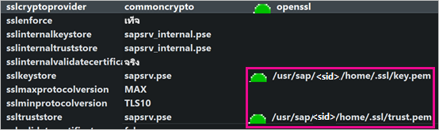
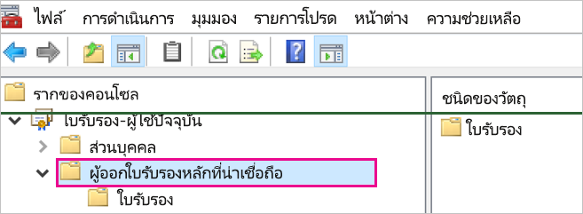
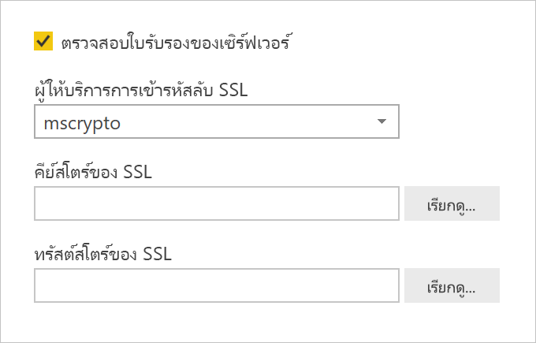
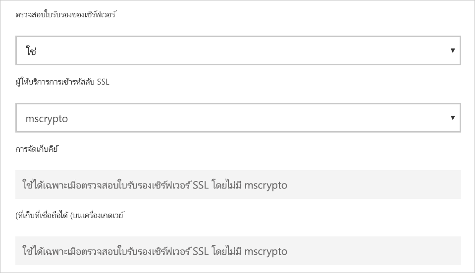

# <a name="enable-encryption-for-sap-hana"></a><span data-ttu-id="dbdca-103">เปิดใช้งานการเข้ารหัสลับสำหรับ SAP HANA</span><span class="sxs-lookup"><span data-stu-id="dbdca-103">Enable encryption for SAP HANA</span></span>

<span data-ttu-id="dbdca-104">เราขอแนะนำให้คุณเข้ารหัสการเชื่อมต่อไปยังเซิร์ฟเวอร์ SAP HANA จาก Power BI Desktop และบริการของ Power BI</span><span class="sxs-lookup"><span data-stu-id="dbdca-104">We recommend that you encrypt connections to an SAP HANA server from Power BI Desktop and the Power BI service.</span></span> <span data-ttu-id="dbdca-105">คุณสามารถเปิดใช้งานการเข้ารหัส HANA โดยใช้ไลบรารี CommonCryptoLib ของ SAP (เดิมเรียกว่า sapcrypto)</span><span class="sxs-lookup"><span data-stu-id="dbdca-105">You can enable HANA encryption using SAP's proprietary CommonCryptoLib (formerly known as sapcrypto) library.</span></span> <span data-ttu-id="dbdca-106">SAP แนะนำให้ใช้ CommonCryptoLib</span><span class="sxs-lookup"><span data-stu-id="dbdca-106">SAP recommends using CommonCryptoLib.</span></span>

> [!IMPORTANT]
> <span data-ttu-id="dbdca-107">SAP ไม่รองรับ OpenSSL อีกต่อไปและด้วยเหตุนี้ Microsoft จึงยุติการสนับสนุนด้วยเช่นกัน</span><span class="sxs-lookup"><span data-stu-id="dbdca-107">SAP no longer supports the OpenSSL, and as a result, Microsoft also has discontinued its support.</span></span> <span data-ttu-id="dbdca-108">การเชื่อมต่อที่มีอยู่และใหม่จะยังคงทำงานได้อย่างถูกต้องจนถึงสิ้นปี 2020 แต่จะไม่สามารถใช้งานได้ตั้งแต่วันที่ 1 มกราคม 2021 เป็นต้นไป</span><span class="sxs-lookup"><span data-stu-id="dbdca-108">Existing and new connections will continue to work properly until the end of 2020, but will not work from January 1, 2021 onwards.</span></span> <span data-ttu-id="dbdca-109">ใช้ CommonCryptoLib แทน</span><span class="sxs-lookup"><span data-stu-id="dbdca-109">Use CommonCryptoLib instead.</span></span>

<span data-ttu-id="dbdca-110">บทความนี้แสดงภาพรวมของการเปิดใช้งานการเข้ารหัสด้วย OpenSSL และอ้างอิงบางพื้นที่เฉพาะของเอกสารประกอบ SAP</span><span class="sxs-lookup"><span data-stu-id="dbdca-110">This article provides an overview of enabling encryption using OpenSSL and references some specific areas of the SAP documentation.</span></span> <span data-ttu-id="dbdca-111">เรามีการปรับปรุงเนื้อหาและลิงก์เป็นระยะ ๆ แต่สำหรับคำแนะนำและการสนับสนุนที่ครอบคลุม ให้อ้างอิงถึงเอกสารประกอบ SAP อย่างเป็นทางการเสมอ</span><span class="sxs-lookup"><span data-stu-id="dbdca-111">We update content and links periodically, but for comprehensive instructions and support, always refer to the official SAP documentation.</span></span> <span data-ttu-id="dbdca-112">หากคุณต้องการตั้งค่าการเข้ารหัสโดยใช้ CommonCryptoLib แทน OpenSSL ให้ดู [วิธีการกำหนดค่า TLS/SSL ใน SAP HANA 2.0](https://blogs.sap.com/2018/11/13/how-to-configure-tlsssl-in-sap-hana-2.0/) สำหรับขั้นตอนต่าง ๆ เกี่ยวกับวิธีการโยกย้ายจาก OpenSSL ไปยัง CommonCryptoLib ให้ดูที่ [SAP Note 2093286](https://launchpad.support.sap.com/#/notes/2093286) (ต้องมีผู้ใช้ s)</span><span class="sxs-lookup"><span data-stu-id="dbdca-112">If you want to set up encryption using CommonCryptoLib instead of OpenSSL, see [How to Configure TLS/SSL in SAP HANA 2.0](https://blogs.sap.com/2018/11/13/how-to-configure-tlsssl-in-sap-hana-2.0/) For steps on how to migrate from OpenSSL to CommonCryptoLib, see [SAP Note 2093286](https://launchpad.support.sap.com/#/notes/2093286) (s-user required).</span></span>

> [!NOTE]
> <span data-ttu-id="dbdca-113">ขั้นตอนการตั้งค่าสำหรับการเข้ารหัสลับโดยละเอียดในบทความนี้ทับซ้อนกับขั้นตอนการตั้งค่าและการกำหนดค่าสำหรับ SAML SSO</span><span class="sxs-lookup"><span data-stu-id="dbdca-113">The setup steps for encryption detailed in this article overlap with the setup and configuration steps for SAML SSO.</span></span> <span data-ttu-id="dbdca-114">ไม่ว่าคุณจะเลือก OpenSSL หรือ CommonCryptoLib เป็นผู้ให้บริการการเข้ารหัสลับของเซิร์ฟเวอร์ HANA ตรวจสอบให้แน่ใจว่าตัวเลือกของคุณมีความสอดคล้องกันในการกำหนดค่า SAML และการเข้ารหัสลับ</span><span class="sxs-lookup"><span data-stu-id="dbdca-114">Whether you choose OpenSSL or CommonCryptoLib as your HANA server's encryption provider, make sure that your choice is consistent across SAML and encryption configurations.</span></span>

<span data-ttu-id="dbdca-115">มีสี่ขั้นตอนในการเปิดใช้งานการเข้ารหัสลับสำหรับ SAP HANA โดยใช้ OpenSSL</span><span class="sxs-lookup"><span data-stu-id="dbdca-115">There are four phases to enabling encryption for SAP HANA using OpenSSL.</span></span> <span data-ttu-id="dbdca-116">เราจะอธิบายถึงขั้นตอนเหล่านี้ต่อไป</span><span class="sxs-lookup"><span data-stu-id="dbdca-116">We cover these phases next.</span></span>  <span data-ttu-id="dbdca-117">สำหรับข้อมูลเพิ่มเติม ให้ดู [การรักษาความปลอดภัยการสื่อสารระหว่าง SAP HANA Studio และ SAP HANA Server ผ่าน SSL](https://blogs.sap.com/2015/09/28/securing-the-communication-between-sap-hana-studio-and-sap-hana-server-through-ssl/)</span><span class="sxs-lookup"><span data-stu-id="dbdca-117">For more information, see [Securing the Communication between SAP HANA Studio and SAP HANA Server through SSL](https://blogs.sap.com/2015/09/28/securing-the-communication-between-sap-hana-studio-and-sap-hana-server-through-ssl/).</span></span>

## <a name="use-openssl"></a><span data-ttu-id="dbdca-118">ใช้ OpenSSL</span><span class="sxs-lookup"><span data-stu-id="dbdca-118">Use OpenSSL</span></span>

<span data-ttu-id="dbdca-119">ตรวจสอบให้แน่ใจว่าเซิร์ฟเวอร์ HANA ของคุณได้รับการกำหนดค่าให้ใช้ OpenSSL เป็นผู้ให้บริการการเข้ารหัสลับ</span><span class="sxs-lookup"><span data-stu-id="dbdca-119">Ensure your HANA server is configured to use OpenSSL as its cryptographic provider.</span></span> <span data-ttu-id="dbdca-120">แทนที่ข้อมูลพาธที่หายไปด้านล่างด้วย ID เซิร์ฟเวอร์ (sid) ของเซิร์ฟเวอร์ HANA ของคุณ</span><span class="sxs-lookup"><span data-stu-id="dbdca-120">Replace the missing path information below with the server ID (sid) of your HANA server.</span></span>



## <a name="create-a-certificate-signing-request"></a><span data-ttu-id="dbdca-122">สร้างคำขอการรับรองใบรับรอง</span><span class="sxs-lookup"><span data-stu-id="dbdca-122">Create a certificate signing request</span></span>

<span data-ttu-id="dbdca-123">สร้างคำขอการรับรองใบรับรอง X509 สำหรับเซิร์ฟเวอร์ HANA</span><span class="sxs-lookup"><span data-stu-id="dbdca-123">Create an X509 certificate signing request for the HANA server.</span></span>

1. <span data-ttu-id="dbdca-124">การใช้ SSH จะเชื่อมต่อกับเครื่อง Linux ที่เซิร์ฟเวอร์ HANA ทำงานเป็น \<sid\>adm</span><span class="sxs-lookup"><span data-stu-id="dbdca-124">Using SSH, connect to the Linux machine that the HANA server runs on as \<sid\>adm.</span></span>

1. <span data-ttu-id="dbdca-125">ไปยังหน้าหลัก directory _/_ _usr/sap/\<sid\>/home_</span><span class="sxs-lookup"><span data-stu-id="dbdca-125">Go to the Home directory _/_ _usr/sap/\<sid\>/home_.</span></span>

1. <span data-ttu-id="dbdca-126">สร้างไดเรกทอรีที่ซ่อนอยู่ด้วยชื่อ _ __ssl_ถ้าไม่มีอยู่</span><span class="sxs-lookup"><span data-stu-id="dbdca-126">Create a hidden directory with the name _.__ssl_if one does not already exist.</span></span>

1. <span data-ttu-id="dbdca-127">ใช้คำสั่งต่อไปนี้:</span><span class="sxs-lookup"><span data-stu-id="dbdca-127">Execute the following command:</span></span>

    ```
    openssl req -newkey rsa:2048 -days 365 -sha256 -keyout Server\_Key.pem -out Server\_Req.pem -nodes
    ```

<span data-ttu-id="dbdca-128">คำสั่งนี้จะสร้างคำขอการรับรองใบรับรองและคีย์ส่วนตัว</span><span class="sxs-lookup"><span data-stu-id="dbdca-128">This command creates a certificate signing request and private key.</span></span> <span data-ttu-id="dbdca-129">เมื่อมีการรับรองแล้ว ใบรับรองจะมีผลบังคับใช้เป็นเวลาหนึ่งปี (ดูพารามิเตอร์-วัน)</span><span class="sxs-lookup"><span data-stu-id="dbdca-129">Once signed, the certificate is valid for a year (see the -days parameter).</span></span> <span data-ttu-id="dbdca-130">เมื่อได้รับพร้อมท์สำหรับชื่อทั่วไป (CN) ใส่ชื่อโดเมนที่มีคุณสมบัติครบถ้วน (FQDN) ของคอมพิวเตอร์ที่มีการติดตั้งเซิร์ฟเวอร์ HANA</span><span class="sxs-lookup"><span data-stu-id="dbdca-130">When prompted for the common name (CN), enter the fully qualified domain name (FQDN) of the computer the HANA server is installed on.</span></span>

## <a name="get-the-certificate-signed"></a><span data-ttu-id="dbdca-131">รับใบรับรองทีได้รับการรับรองแล้ว</span><span class="sxs-lookup"><span data-stu-id="dbdca-131">Get the certificate signed</span></span>

<span data-ttu-id="dbdca-132">รับใบรับรองที่รับรองโดยผู้ให้บริการออกใบรับรอง (CA) ที่เชื่อถือได้โดยไคลเอ็นต์ที่คุณจะใช้เพื่อเชื่อมต่อกับเซิร์ฟเวอร์ HANA</span><span class="sxs-lookup"><span data-stu-id="dbdca-132">Get the certificate signed by a certificate authority (CA) that is trusted by the client(s) you'll use to connect to the HANA server.</span></span>

1. <span data-ttu-id="dbdca-133">ถ้าคุณมี CA ของบริษัทที่เชื่อถือได้ (แทนด้วย CA\_Cert.pem and CA\_Key.pem ในตัวอย่างต่อไปนี้) ให้รับรองคำขอใบรับรองโดยการเรียกใช้คำสั่งต่อไปนี้:</span><span class="sxs-lookup"><span data-stu-id="dbdca-133">If you already have a trusted company CA (represented by CA\_Cert.pem and CA\_Key.pem in the following example), sign the certificate request by running the following command:</span></span>

    ```
    openssl x509 -req -days 365 -in Server\_Req.pem -sha256 -extfile /etc/ssl/openssl.cnf -extensions usr\_cert -CA CA\_Cert.pem -CAkey CA\_Key.pem -CAcreateserial -out Server\_Cert.pem
    ```

    <span data-ttu-id="dbdca-134">หากคุณยังไม่มี CA ที่คุณสามารถใช้ได้ คุณสามารถสร้าง CA ระดับสูงด้วยตัวเองโดยทำตามขั้นตอนที่อธิบายไว้ใน [การรักษาความปลอดภัยการสื่อสารระหว่าง SAP HANA Studio และ SAP HANA Server ผ่าน SSL](https://blogs.sap.com/2015/09/28/securing-the-communication-between-sap-hana-studio-and-sap-hana-server-through-ssl/)</span><span class="sxs-lookup"><span data-stu-id="dbdca-134">If you don't already have a CA you can use, you can create a root CA yourself by following the steps outlined in [Securing the Communication between SAP HANA Studio and SAP HANA Server through SSL](https://blogs.sap.com/2015/09/28/securing-the-communication-between-sap-hana-studio-and-sap-hana-server-through-ssl/).</span></span>

1. <span data-ttu-id="dbdca-135">สร้างห่วงโซ่ใบรับรองเซิร์ฟเวอร์ HANA โดยรวมใบรับรองเซิร์ฟเวอร์ คีย์ และใบรับรองของ CA (ชื่อ key.pem เป็นแบบแผนสำหรับ SAP HANA):</span><span class="sxs-lookup"><span data-stu-id="dbdca-135">Create the HANA server certificate chain by combining the server certificate, key, and the CA's certificate (the key.pem name is the convention for SAP HANA):</span></span>

    ```
    cat Server\_Cert.pem Server\_Key.pem CA\_Cert.pem \> key.pem
    ```

1. <span data-ttu-id="dbdca-136">สร้างสำเนาของ CA\_Cert.pem ชื่อ trust.pem (ชื่อ trust.pem เป็นแบบแผนสำหรับ SAP HANA):</span><span class="sxs-lookup"><span data-stu-id="dbdca-136">Create a copy of CA\_Cert.pem named trust.pem (the trust.pem name is the convention for SAP HANA):</span></span>

    ```
    cp CA\_Cert.pem trust.pem
    ```

1. <span data-ttu-id="dbdca-137">รีสตาร์ทเซิร์ฟเวอร์ HANA</span><span class="sxs-lookup"><span data-stu-id="dbdca-137">Restart the HANA server.</span></span>

1. <span data-ttu-id="dbdca-138">ตรวจสอบความสัมพันธ์ที่เชื่อถือได้ระหว่างไคลเอนต์และ CA ที่คุณใช้ในการรับรองใบรับรองของเซิร์ฟเวอร์ SAP HANA</span><span class="sxs-lookup"><span data-stu-id="dbdca-138">Verify the trust relationship between a client and the CA you used to sign the SAP HANA server's certificate.</span></span>

    <span data-ttu-id="dbdca-139">ไคลเอนต์ต้องเชื่อถือ CA ที่ใช้ในการรับรองใบรับรอง X509 ของเซิร์ฟเวอร์ HANA ก่อนที่สามารถทำการเชื่อมต่อแบบเข้ารหัสกับเซิร์ฟเวอร์ HANA จากเครื่องของไคลเอ็นต์</span><span class="sxs-lookup"><span data-stu-id="dbdca-139">The client must trust the CA used to sign the HANA server's X509 certificate before an encrypted connection can be made to the HANA server from the client's machine.</span></span>

    <span data-ttu-id="dbdca-140">มีหลายวิธีในการตรวจสอบให้แน่ใจว่าความสัมพันธ์ที่น่าเชื่อถือนี้มีอยู่โดยใช้ Microsoft Management Console (mmc) หรือบรรทัดคำสั่ง</span><span class="sxs-lookup"><span data-stu-id="dbdca-140">There are various ways to ensure this trust relationship exists using Microsoft Management Console (mmc) or the command line.</span></span> <span data-ttu-id="dbdca-141">คุณสามารถนำเข้าใบรับรอง X509 ของ CA (trust.pem) ไปยังโฟลเดอร์ **Trusted Root Certification Authorities** สำหรับผู้ใช้ที่จะสร้างการเชื่อมต่อ หรือไปยังในโฟลเดอร์เดียวกันสำหรับเครื่องไคลเอนต์เองหากเป็นที่ต้องการ</span><span class="sxs-lookup"><span data-stu-id="dbdca-141">You can import the CA's X509 certificate (trust.pem) into the **Trusted Root Certification Authorities** folder for the user that will establish the connection, or into the same folder for the client machine itself, if that is desirable.</span></span>

    

    <span data-ttu-id="dbdca-143">ก่อนอื่นคุณต้องแปลง trust.pem เป็นไฟล์. crt ก่อนที่คุณจะสามารถนำเข้าใบรับรองไปยังโฟลเดอร์ Trusted Root Certificate Authorities ตัวอย่างเช่น โดยการเรียกใช้คำสั่ง OpenSSL ต่อไปนี้:</span><span class="sxs-lookup"><span data-stu-id="dbdca-143">You must first convert trust.pem into a .crt file before you can import the certificate into the Trusted Root Certification Authorities folder, for example by executing the following OpenSSL command:</span></span>

    ```
    openssl x509 -outform der -in your-cert.pem -out your-cert.crt
    ```
    
    <span data-ttu-id="dbdca-144">สำหรับข้อมูลเกี่ยวกับการใช้ OpenSSL สำหรับการแปลง โปรดดู [เอกสารประกอบ OpenSSL](https://www.openssl.org/docs/man1.0.2/man3/x509.html)</span><span class="sxs-lookup"><span data-stu-id="dbdca-144">For information about using OpenSSL for the conversion, see the [OpenSSL documentation](https://www.openssl.org/docs/man1.0.2/man3/x509.html).</span></span>

## <a name="test-the-connection"></a><span data-ttu-id="dbdca-145">ทดสอบการเชื่อมต่อ</span><span class="sxs-lookup"><span data-stu-id="dbdca-145">Test the connection</span></span>

<span data-ttu-id="dbdca-146">ทดสอบการเชื่อมต่อใน Power BI Desktop หรือบริการของ Power BI</span><span class="sxs-lookup"><span data-stu-id="dbdca-146">Test the connection in Power BI Desktop or the Power BI service.</span></span>

1. <span data-ttu-id="dbdca-147">ใน Power BI Desktop หรือในหน้า **จัดการเกตเวย์** ของบริการของ Power BI ตรวจสอบให้แน่ใจว่ามีการเปิดใช้งาน **ตรวจสอบใบรับรองเซิร์ฟเวอร์** ก่อนที่จะพยายามสร้างการเชื่อมต่อไปยังเซิร์ฟเวอร์ SAP HANA ของคุณ</span><span class="sxs-lookup"><span data-stu-id="dbdca-147">In Power BI Desktop or in the **Manage gateways** page of the Power BI service, ensure that **Validate server certificate** is enabled before attempting to establish a connection to your SAP HANA server.</span></span> <span data-ttu-id="dbdca-148">สำหรับ **ผู้ให้บริการการเข้ารหัส SSL** ให้เลือก mscrypto ถ้าคุณได้ทำตามขั้นตอนการตั้งค่า OpenSSL และ commoncrypto ถ้าคุณได้กำหนดค่าไลบรารีนั้นเป็นผู้ให้บริการการเข้ารหัสลับของคุณ</span><span class="sxs-lookup"><span data-stu-id="dbdca-148">For **SSL crypto provider**, select mscrypto if you've followed the OpenSSL setup steps and commoncrypto if you've configured that library as your crypto provider.</span></span> <span data-ttu-id="dbdca-149">ปล่อยเขตข้อมูลคีย์สโตร์ของ SSL และทรัสต์สโตร์ของ SSL ว่างไว้</span><span class="sxs-lookup"><span data-stu-id="dbdca-149">Leave the SSL key store and SSL trust store fields blank.</span></span>

    - <span data-ttu-id="dbdca-150">Power BI Desktop</span><span class="sxs-lookup"><span data-stu-id="dbdca-150">Power BI Desktop</span></span>

        

    - <span data-ttu-id="dbdca-152">บริการ Power BI</span><span class="sxs-lookup"><span data-stu-id="dbdca-152">Power BI service</span></span>

        

1. <span data-ttu-id="dbdca-154">ตรวจสอบว่าคุณสามารถสร้างการเชื่อมต่อแบบเข้ารหัสไปยังเซิร์ฟเวอร์ได้สำเร็จโดยเปิดใช้งานตัวเลือก **ตรวจสอบใบรับรองเซิร์ฟเวอร์**  โดยการโหลดข้อมูลใน Power BI Desktop หรือการรีเฟรชรายงานที่เผยแพร่ในบริการของ Power BI</span><span class="sxs-lookup"><span data-stu-id="dbdca-154">Verify that you can successfully establish an encrypted connection to the server with the **Validate server certificate** option enabled, by loading data in Power BI Desktop or refreshing a published report in Power BI service.</span></span>
