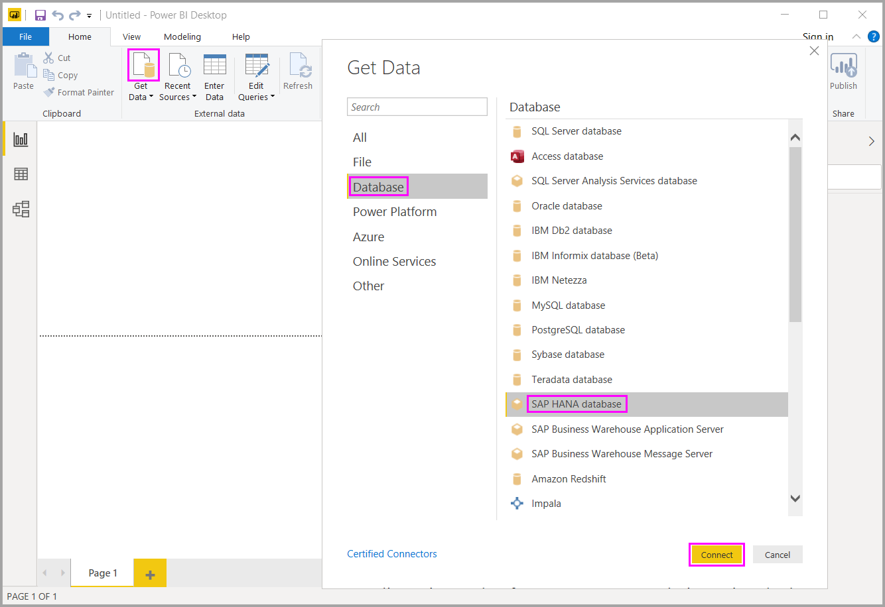

# เชื่อมต่อกับฐานข้อมูลของ SAP HANA ใน Power BIConnect to SAP HANA databases in Power BI

ตอนนี้คุณสามารถเข้าถึงฐานข้อมูล *SAP HANA* ได้ด้วย Power BI DesktopWith Power BI Desktop, you can now access *SAP HANA* databases. ในการใช้ SAP HANA คุณต้องมีไดรเวอร์ SAP HANA ODBC ติดตั้งอยู่ในคอมพิวเตอร์ไคลเอนต์ในพื้นที่เพื่อให้การเชื่อมต่อข้อมูล SAP HANA ของ Power BI Desktop ทำงานได้อย่างถูกต้องTo use SAP HANA, you must have the SAP HANA ODBC driver installed on the local client computer for the Power BI Desktop's SAP HANA data connection to work properly. คุณสามารถดาวน์โหลดเครื่องมือ SAP HANA Client ได้จาก [เครื่องมือการพัฒนาของ SAP](https://tools.hana.ondemand.com/#hanatools) ซึ่งมีโปรแกรมควบคุม ODBC ที่จำเป็นYou can download the SAP HANA Client tools from [SAP Development Tools](https://tools.hana.ondemand.com/#hanatools), which contains the necessary ODBC driver. หรือ คุณสามารถรับได้จาก [ศูนย์ดาวน์โหลดซอฟต์แวร์ SAP](https://support.sap.com/en/my-support/software-downloads.html)Or you can get it from the [SAP Software Download Center](https://support.sap.com/en/my-support/software-downloads.html). ในพอร์ทัลซอฟต์แวร์ ให้ค้นหา *SAP HANA CLIENT* สำหรับคอมพิวเตอร์ที่ใช้ WindowsIn the Software portal, search for the *SAP HANA CLIENT* for Windows computers. เนื่องจากศูนย์ดาวน์โหลดซอฟต์แวร์ SAP นั้นมีการเปลี่ยนแปลงโครงสร้างบ่อยครั้ง คำแนะนำการนำทางที่เฉพาะเจาะจงมากกว่านี้ในเว็บไซต์ดังกล่าวจึงไม่พร้อมใช้งานSince the SAP Software Download Center changes its structure frequently, more specific guidance for navigating that site isn't available.

ในการเชื่อมต่อกับฐานข้อมูล SAP HANA ให้เลือก **รับข้อมูล** เลือก **ฐานข้อมูล** > **ฐานข้อมูล SAP HANA** จากนั้นเลือก **เชื่อมต่อ**:To connect to a SAP HANA database, select **Get Data**, choose **Database** > **SAP HANA Database**, and then select **Connect**:

เมื่อคุณเชื่อมต่อกับฐานข้อมูล SAP HANA ให้ระบุชื่อเซิร์ฟเวอร์When you connect to a SAP HANA database, specify the server name. จากนั้นจากดรอปดาวน์และกล่องป้อนข้อมูล ให้ระบุพอร์ตThen from the dropdown and input box, specify the port.

สำหรับรุ่นเผยแพร่นี้ SAP HANA ในโหมด [DirectQuery](desktop-directquery-sap-hana.md) ได้รับการสนับสนุนใน Power BI Desktop และบริการ Power BIIn this release, SAP HANA in [DirectQuery](desktop-directquery-sap-hana.md) mode is supported in Power BI Desktop and the Power BI service. คุณสามารถเผยแพร่และอัปโหลดรายงานที่ใช้ SAP HANA ในโหมด DirectQuery ไปยังบริการ Power BIYou can publish and upload reports that use SAP HANA in DirectQuery mode to the Power BI service. คุณยังสามารถเผยแพร่และอัปโหลดรายงานไปยังบริการ Power BI เมื่อไม่ได้ใช้ SAP HANA ในโหมด DirectQuery ได้อีกด้วยYou can also publish and upload reports to the Power BI Service when not using SAP HANA in DirectQuery mode.

## ฟีเจอร์ที่ได้รับการสนับสนุนสำหรับ SAP HANASupported features for SAP HANA

รุ่นนี้มีความสามารถสำหรับ SAP HANA มากมาย ดังที่แสดงในรายการต่อไปนี้:This release has many capabilities for SAP HANA, as shown in the following list:

* ตัวเชื่อมต่อ Power BI ของ SAP HANA ใช้ไดร์ฟเวอร์ SAP ODBC เพื่อประสบการณ์การใช้งานที่ดีที่สุดของผู้ใช้The Power BI connector for SAP HANA uses the SAP ODBC driver to provide the best user experience.

* SAP HANA สนับสนุนทั้งโหมด DirectQuery และตัวเลือกการนำเข้าข้อมูลต่าง ๆSAP HANA supports both DirectQuery and Import options.

* Power BI สนับสนุนโมเดลข้อมูล HANA เช่น มุมมองการวิเคราะห์และการคำนวณ และมีตัวนำทางที่มีประสิทธิภาพมากที่สุดPower BI supports HANA information models, such as Analytic and Calculation Views, and has optimized navigation.

* ด้วย SAP HANA คุณยังสามารถใช้ฟีเจอร์ SQL โดยตรงเพื่อเชื่อมต่อตารางแถวและคอลัมน์With SAP HANA, you can also use the direct SQL feature to connect to Row and Column Tables.

* Power BI ประกอบด้วยการนำทางที่มีประสิทธิภาพสูงสุดสำหรับโมเดล HANAPower BI includes Optimized Navigation for HANA Models.

* Power BI สนับสนุนตัวแปรต่าง ๆ ของ SAP HANA และพารามิเตอร์ที่นำเข้ามาPower BI supports SAP HANA Variables and Input parameters.

* Power BI สนับสนุนมุมมองการคำนวณตามคอนเทนเนอร์ HDIPower BI supports HDI-container-based Calculation Views.

  * การสนับสนุนมุมมองการคำนวณตามคอนเทนเนอร์ HDI ในตัวอย่างสาธารณะในการเปิดตัว Power BI Desktop เมื่อเดือนสิงหาคม 2019Support for HDI-container-based Calculation Views is in public preview in the August 2019 release of Power BI Desktop. หากต้องการเข้าถึงมุมมองการคำนวณตามคอนเนทเนอร์ HDI ใน Power BI ของคุณ คุณต้องตรวจสอบให้แน่ใจว่าผู้ใช้ฐานข้อมูล HANA ที่คุณใช้งานกับ Power BI มีสิทธิ์ในการเข้าถึงคอนเทนเนอร์รันไทม์ HDI ที่บันทึกมุมมองที่คุณต้องการเข้าถึงTo access your HDI-container-based Calculation Views in Power BI, ensure that the HANA database users you use with Power BI have permission to access the HDI runtime container that stores the views you want to access. เพื่อให้สิทธิ์การเข้าถึงนี้ ให้สร้างบทบาทที่อนุญาตให้เข้าถึงคอนเทนเนอร์ HDI ของคุณTo grant this access, create a Role that allows access to your HDI container. จากนั้นมอบหมายบทบาทให้กับผู้ใช้ฐานข้อมูล HANA ที่คุณจะใช้กับ Power BIThen assign the role to the HANA database user you'll use with Power BI. (ผู้ใช้รายนี้ต้องมีสิทธิ์ในการอ่านจากตารางของระบบในสคีมา \_SYS\_BI ตามปกติ) ดูคำแนะนำต่าง ๆ เกี่ยวกับวิธีการสร้างและกำหนดบทบาทฐานข้อมูลอย่างละเอียดในเอกสาร SAP ทางการ(This user must also have permission to read from the system tables in the \_SYS\_BI schema, as usual.) Consult the official SAP documentation for detailed instructions on how to create and assign database roles. [บล็อกโพสต์](https://blogs.sap.com/2018/01/24/the-easy-way-to-make-your-hdi-container-accessible-to-a-classic-database-user/)ใน SAP นี้อาจเป็นจุดเริ่มต้นที่ดี[This SAP blog post](https://blogs.sap.com/2018/01/24/the-easy-way-to-make-your-hdi-container-accessible-to-a-classic-database-user/) may be a good place to start.

  * มีข้อจำกัดบางอย่างในปัจจุบันนี้สำหรับตัวแปร HANA ที่ติดตั้งมากับมุมมองการคำนวณตาม HDIThere are currently some limitations for HANA variables attached to HDI-based Calculation Views. ข้อจำกัดเหล่านี้เป็นเพราะข้อผิดพลาดในด้าน HANAThese limitations are because of errors on the HANA side.
  
    ข้อจำกัดแรกคือเป็นไปไม่ได้ที่จะใช้ตัวแปร HANA กับคอลัมน์ที่แชร์จากมุมมองการคำนวณตามคอนเทนเนอร์ HDI ได้First, it isn't possible to apply a HANA variable to a shared column of an HDI-container-based Calculation View. เพื่อแก้ไขข้อจำกัดนี้ ให้อัปเกรดเป็น HANA 2 เวอร์ชัน 37.02 ขึ้นไป หรือ HANA 2 เวอร์ชัน 42 ขึ้นไปTo fix this limitation, upgrade to HANA 2 version 37.02 and onwards or to HANA 2 version 42 and onwards. ข้อจำกัดที่สองคือค่าเริ่มต้นหลายรายการสำหรับตัวแปรและพารามิเตอร์ปัจจุบันไม่สามารถแสดงใน Power BI UI ได้Second, multi-entry default values for variables and parameters currently don't show up in the Power BI UI. ข้อผิดพลาดใน SAP HANA ทำให้เกิดข้อจำกัดนี้ แต่ SAP ยังไม่ได้ประกาศการแก้ไขAn error in SAP HANA causes this limitation, but SAP hasn't announced a fix yet.

## ขีดจำกัดของ SAP HANALimitations of SAP HANA

ในการใช้ SAP HANA นั้นมีข้อจำกัดบางประการตามที่แสดงไว้ด้านล่าง:There are also a few limitations to using SAP HANA, shown below:

* สตริง NVARCHAR จะถูกตัดทอนให้อยู่ที่ความยาวสูงสุด 4000 ตัวอักขระ UnicodeNVARCHAR strings are truncated to a maximum length of 4000 Unicode characters.
* ไม่สนับสนุน SMALLDECIMALSMALLDECIMAL isn't supported.
* ไม่สนับสนุน VARBINARYVARBINARY isn't supported.
* วันที่ใช้งานได้อยู่ระหว่าง 1899/12/30 และ 9999/12/31Valid Dates are between 1899/12/30 and 9999/12/31.
* ในขณะนี้ระบบไม่รองรับการรีเฟรช SAP Hana ด้วย SSO สำหรับสมุดงาน Excel ที่รีเฟรชในเวลาปัจจุบันSAP HANA refresh with SSO is currently not supported for Excel workbook refreshes at the current time. หากต้องการรีเฟรชข้อมูลใน Power BI คุณสามารถใช้รายงาน Power BI กับ SAP Hana SSO ได้To refresh the data in Power BI, you can use a Power BI report with SAP HANA SSO.

## ขั้นตอนถัดไปNext steps

สำหรับข้อมูลเพิ่มเติมเกี่ยวกับ DirectQuery และ SAP HANA กรุณาดูที่แหล่งข้อมูลต่อไปนี้:For more information about DirectQuery and SAP HANA, see the following resources:

* [DirectQuery และ SAP HANADirectQuery and SAP HANA](desktop-directquery-sap-hana.md)
* [ใช้ DirectQuery ใน Power BIUse DirectQuery in Power BI](desktop-directquery-about.md)
* [แหล่งข้อมูล Power BIPower BI data sources](power-bi-data-sources.md)
* [เปิดใช้งานการเข้ารหัสลับสำหรับ SAP HANAEnable encryption for SAP HANA](desktop-sap-hana-encryption.md)
