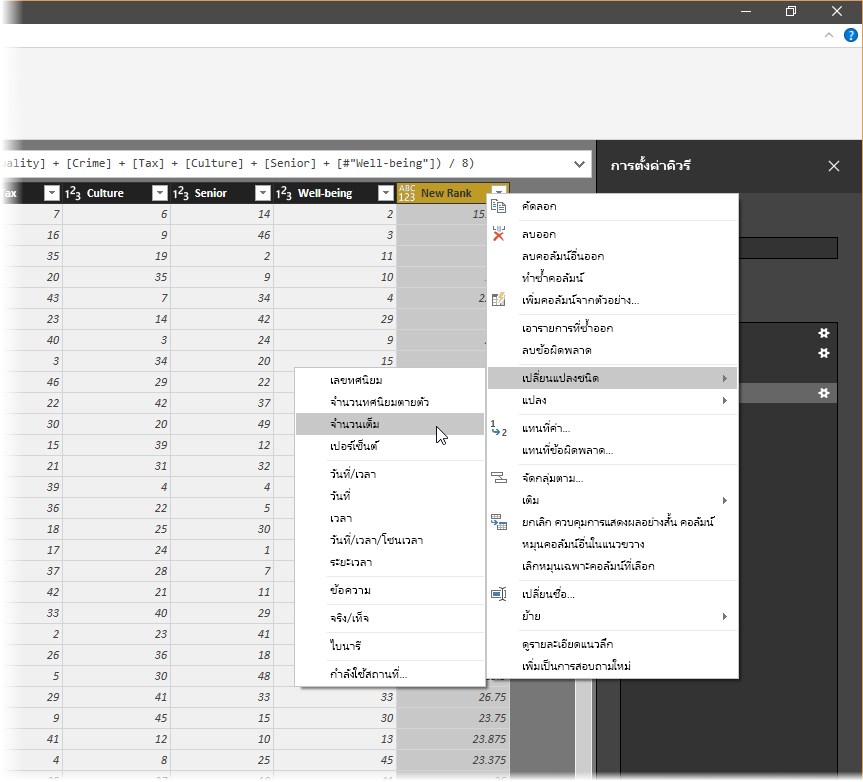
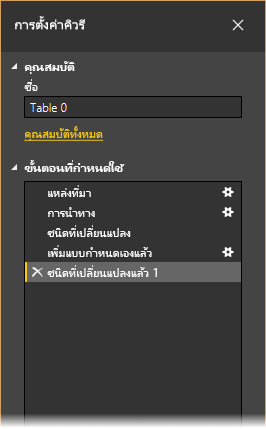
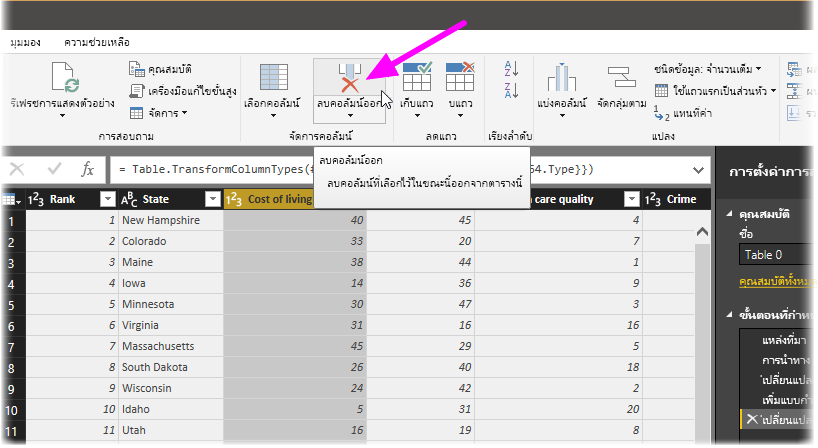
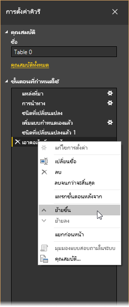
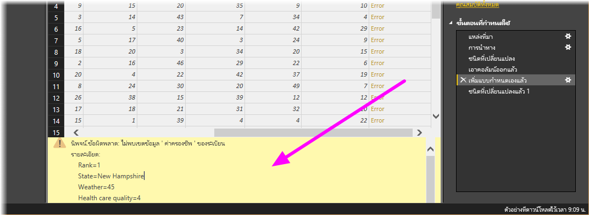
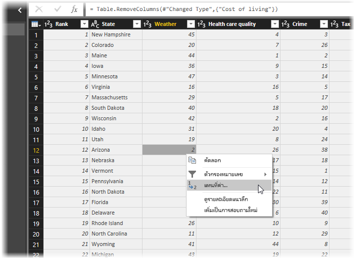
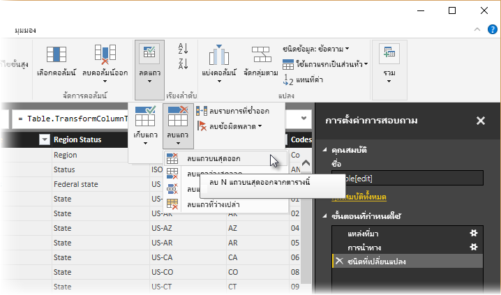
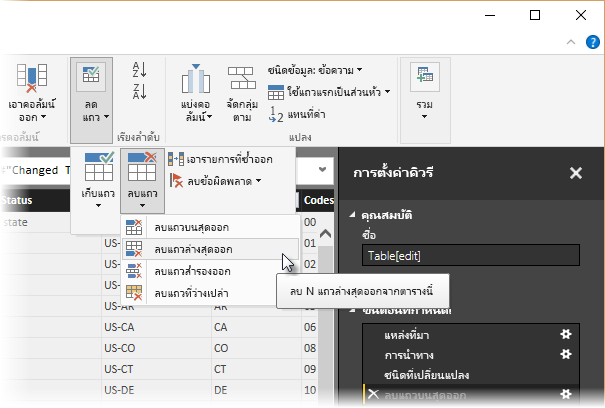
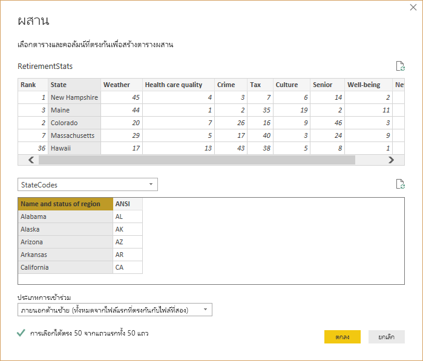
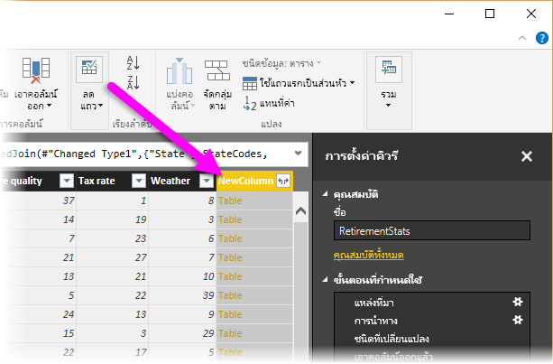

# <a name="tutorial-shape-and-combine-data-in-power-bi-desktop"></a><span data-ttu-id="dcbf3-103">บทช่วยสอน: จัดรูปร่างและรวมข้อมูลใน Power BI Desktop</span><span class="sxs-lookup"><span data-stu-id="dcbf3-103">Tutorial: Shape and combine data in Power BI Desktop</span></span>

<span data-ttu-id="dcbf3-104">ด้วย Power BI Desktop คุณสามารถเชื่อมต่อกับแหล่งข้อมูลหลายชนิด จากนั้นจัดรูปข้อมูลตามความต้องการของคุณ ช่วยให้คุณสามารถสร้างรายงานวิชวลที่คุณสามารถแชร์ให้กับผู้อื่นได้</span><span class="sxs-lookup"><span data-stu-id="dcbf3-104">With Power BI Desktop, you can connect to many different types of data sources, then shape the data to meet your needs, enabling you to create visual reports to share with others.</span></span> <span data-ttu-id="dcbf3-105">*การจัดรูป* ข้อมูลหมายถึงการแปลงข้อมูลได้แก่ การเปลี่ยนชื่อคอลัมน์หรือตาราง การเปลี่ยนแปลงข้อความเป็นตัวเลข ลบแถว การตั้งค่าแถวแรกเป็นหัวเรื่อง และอื่น ๆ</span><span class="sxs-lookup"><span data-stu-id="dcbf3-105">*Shaping* data means transforming the data: renaming columns or tables, changing text to numbers, removing rows, setting the first row as headers, and so on.</span></span> <span data-ttu-id="dcbf3-106">*การรวม* ข้อมูลหมายถึงการเชื่อมข้อมูลสองแหล่งข้อมูลหรือมากกว่า และจัดรูปร่างตามความจำเป็น จากนั้นจึงรวมเป็นคิวรีที่มีประโยชน์</span><span class="sxs-lookup"><span data-stu-id="dcbf3-106">*Combining* data means connecting to two or more data sources, shaping them as needed, then consolidating them into a useful query.</span></span>

<span data-ttu-id="dcbf3-107">ในบทช่วยสอนนี้ คุณจะเรียนรู้วิธีการ:</span><span class="sxs-lookup"><span data-stu-id="dcbf3-107">In this tutorial, you'll learn how to:</span></span>

* <span data-ttu-id="dcbf3-108">จัดรูปร่างข้อมูลโดยใช้ตัวแก้ไขคิวรี</span><span class="sxs-lookup"><span data-stu-id="dcbf3-108">Shape data by using Query Editor.</span></span>
* <span data-ttu-id="dcbf3-109">เชื่อมต่อกับแหล่งข้อมูลที่แตกต่างกัน</span><span class="sxs-lookup"><span data-stu-id="dcbf3-109">Connect to different data sources.</span></span>
* <span data-ttu-id="dcbf3-110">รวมแหล่งข้อมูลเหล่านั้น และสร้างแบบจำลองข้อมูลเพื่อใช้ในรายงาน</span><span class="sxs-lookup"><span data-stu-id="dcbf3-110">Combine those data sources, and create a data model to use in reports.</span></span>

<span data-ttu-id="dcbf3-111">บทช่วยสอนนี้สาธิตวิธีการจัดรูปร่างคิวรีโดยใช้ Power BI Desktop โดยเน้นที่งานที่ใช้บ่อย</span><span class="sxs-lookup"><span data-stu-id="dcbf3-111">This tutorial demonstrates how to shape a query by using Power BI Desktop, highlighting the most common tasks.</span></span> <span data-ttu-id="dcbf3-112">คิวรี่ที่ใช้นั้นได้ถูกอธิบายในรายละเอียด รวมทั้งมีวิธีการสร้างคิวรี่ตั้งแต่เริ่มต้น ที่[เริ่มต้นใช้งาน Power BI Desktop](../fundamentals/desktop-getting-started.md)</span><span class="sxs-lookup"><span data-stu-id="dcbf3-112">The query used here is described in more detail, including how to create the query from scratch, in [Getting Started with Power BI Desktop](../fundamentals/desktop-getting-started.md).</span></span>

<span data-ttu-id="dcbf3-113">ตัวแก้ไขคิวรีใน Power BI Desktop สามารถใช้ได้โดยการคลิกขวาและใช้ Ribbon **แปลงข้อมูล**</span><span class="sxs-lookup"><span data-stu-id="dcbf3-113">Query Editor in Power BI Desktop makes ample use of right-click menus, as well as the **Transform** ribbon.</span></span> <span data-ttu-id="dcbf3-114">สิ่งที่คุณสามารถเลือกได้ส่วนใหญ่ใน Ribbon สามารถใช้งานได้โดยการคลิกขวาบนรายการเช่น คอลัมน์ แล้วเลือกเมนูที่ปรากฏขึ้น</span><span class="sxs-lookup"><span data-stu-id="dcbf3-114">Most of what you can select in the ribbon is also available by right-clicking an item, such as a column, and choosing from the menu that appears.</span></span>

## <a name="shape-data"></a><span data-ttu-id="dcbf3-115">จัดรูปร่างข้อมูล</span><span class="sxs-lookup"><span data-stu-id="dcbf3-115">Shape data</span></span>
<span data-ttu-id="dcbf3-116">เมื่อคุณจัดรูปร่างข้อมูลในตัวแก้ไขคิวรี คุณจะให้คำแนะนำทีละขั้นตอนสำหรับตัวแก้ไขคิวรีเพื่อดำเนินการแทนคุณในการปรับปรุงข้อมูลขณะที่โหลดและนำเสนอ</span><span class="sxs-lookup"><span data-stu-id="dcbf3-116">When you shape data in Query Editor, you provide step-by-step instructions for Query Editor to carry out for you to adjust the data as it loads and presents it.</span></span> <span data-ttu-id="dcbf3-117">แหล่งข้อมูลต้นฉบับจะไม่ได้รับผลกระทบ ระบบจะปรับปรุงเฉพาะมุมมองของข้อมูลที่ถูกปรับเปลี่ยนหรือ *ได้รับการจัดรูปร่าง* นี้เท่านั้น</span><span class="sxs-lookup"><span data-stu-id="dcbf3-117">The original data source isn't affected; only this particular view of the data is adjusted, or *shaped*.</span></span>

<span data-ttu-id="dcbf3-118">ขั้นตอนที่คุณระบุ (เช่น เปลี่ยนชื่อตาราง แปลงชนิดข้อมูล หรือลบคอลัมน์) จะถูกบันทึกโดยตัวแก้ไขคิวรี</span><span class="sxs-lookup"><span data-stu-id="dcbf3-118">The steps you specify (such as rename a table, transform a data type, or delete a column) are recorded by Query Editor.</span></span> <span data-ttu-id="dcbf3-119">แต่ละครั้งที่คิวรีนี้เชื่อมต่อกับแหล่งข้อมูล ตัวแก้ไขคิวรีจะดำเนินการตามขั้นตอนเหล่านั้นเพื่อจัดรูปร่างข้อมูลในรูปแบบที่คุณระบุเสมอ</span><span class="sxs-lookup"><span data-stu-id="dcbf3-119">Each time this query connects to the data source, Query Editor carries out those steps so that the data is always shaped the way you specify.</span></span> <span data-ttu-id="dcbf3-120">กระบวนการนี้เกิดขึ้นเมื่อใดก็ตามที่คุณใช้ตัวแก้ไขคิวรีของ Power BI Desktop หรือสำหรับใครก็ตามที่ใช้คิวรีที่ใช้ร่วมกันของคุณเช่น ในบริการของ Power BI</span><span class="sxs-lookup"><span data-stu-id="dcbf3-120">This process occurs whenever you use Query Editor, or for anyone who uses your shared query, such as on the Power BI service.</span></span> <span data-ttu-id="dcbf3-121">ขั้นตอนเหล่านั้นถูกบันทึก ตามลำดับ ในช่อง **การตั้งค่าคิวรี** ภายใต้ **ขั้นตอนที่ใช้**</span><span class="sxs-lookup"><span data-stu-id="dcbf3-121">Those steps are captured, sequentially, in the **Query Settings** pane, under **Applied Steps**.</span></span> <span data-ttu-id="dcbf3-122">เราจะไปยังขั้นตอนเหล่านั้นแต่ละขั้นตอนในสองสามย่อหน้าถัดไป</span><span class="sxs-lookup"><span data-stu-id="dcbf3-122">We’ll go through each of those steps in the next few paragraphs.</span></span>


<span data-ttu-id="dcbf3-124">จาก[การเริ่มต้นใช้งาน Power BI Desktop](../fundamentals/desktop-getting-started.md) เราสามารถใช้ข้อมูลที่ตัดจำหน่าย ซึ่งเราเจอด้วยการเชื่อมต่อกับแหล่งข้อมูลเว็บ เราต้องจัดรูปร่างข้อมูลดังกล่าวให้สอดคล้องกับความต้องการของเรา</span><span class="sxs-lookup"><span data-stu-id="dcbf3-124">From [Getting Started with Power BI Desktop](../fundamentals/desktop-getting-started.md), let's use the retirement data, which we found by connecting to a web data source, to shape that data to fit our needs.</span></span> <span data-ttu-id="dcbf3-125">เราจะเพิ่มคอลัมน์แบบกำหนดเองเพื่อคำนวณการจัดอันดับโดยที่ว่าข้อมูลทั้งหมดเท่ากับปัจจัยต่าง ๆ และเปรียบเทียบคอลัมน์นี้กับคอลัมน์ที่มีอยู่ **การจัดอันดับ**</span><span class="sxs-lookup"><span data-stu-id="dcbf3-125">We'll add a custom column to calculate rank based on all data being equal factors, and compare this column to the existing column, **Rank**.</span></span>  

1. <span data-ttu-id="dcbf3-126">จาก Ribbon **เพิ่มคอลัมน์** เลือก **คอลัมน์แบบกำหนดเอง** ซึ่งช่วยให้คุณสามารถเพิ่มคอลัมน์แบบกำหนดเองได้</span><span class="sxs-lookup"><span data-stu-id="dcbf3-126">From the **Add Column** ribbon, select **Custom Column**, which lets you add a custom column.</span></span>

    

1. <span data-ttu-id="dcbf3-128">ในหน้าต่าง **คอลัมน์แบบกำหนดเอง** ใน **ชื่อคอลัมน์ใหม่** ให้ป้อน _การจัดอันดับใหม่_</span><span class="sxs-lookup"><span data-stu-id="dcbf3-128">In the **Custom Column** window, in **New column name**, enter _New Rank_.</span></span> <span data-ttu-id="dcbf3-129">ใน **สูตรคอลัมน์แบบกำหนดเอง** ให้ใส่ข้อมูลต่อไปนี้:</span><span class="sxs-lookup"><span data-stu-id="dcbf3-129">In **Custom column formula**, enter the following data:</span></span>

    ```
    ([Cost of living] + [Weather] + [Health care quality] + [Crime] + [Tax] + [Culture] + [Senior] + [#"Well-being"]) / 8
    ```
 
1. <span data-ttu-id="dcbf3-130">ตรวจสอบให้แน่ใจว่าข้อความสถานะคือ *ไม่มีข้อผิดพลาดทางไวยากรณ์ที่ตรวจพบ* และเลือก **ตกลง**</span><span class="sxs-lookup"><span data-stu-id="dcbf3-130">Make sure the status message is *No syntax errors have been detected*, and select **OK**.</span></span>

    

1. <span data-ttu-id="dcbf3-132">หากต้องการให้ข้อมูลคอลัมน์สอดคล้องกัน ให้แปลงค่าของคอลัมน์ใหม่เป็นจำนวนเต็ม</span><span class="sxs-lookup"><span data-stu-id="dcbf3-132">To keep column data consistent, transform the new column values to whole numbers.</span></span> <span data-ttu-id="dcbf3-133">หากต้องการเปลี่ยน ให้คลิกขวาที่ส่วนหัวของคอลัมน์ และเลือก **เปลี่ยนชนิด\>จำนวนเต็ม**</span><span class="sxs-lookup"><span data-stu-id="dcbf3-133">To change them, right-click the column header, and then select **Change Type \> Whole Number**.</span></span> 

    <span data-ttu-id="dcbf3-134">หากต้องการเลือกมากกว่าหนึ่งคอลัมน์ ให้เลือกคอลัมน์ แล้วกดค้างที่ปุ่ม **SHIFT** เลือกคอลัมน์ที่อยู่ติดกันเพิ่มเติม และจากนั้นคลิกขวาที่ส่วนหัวของคอลัมน์</span><span class="sxs-lookup"><span data-stu-id="dcbf3-134">If you need to choose more than one column, select a column, hold down **SHIFT**, select additional adjacent columns, and then right-click a column header.</span></span> <span data-ttu-id="dcbf3-135">คุณยังสามารถใชคีย์ **CTRL** เมื่อต้องเลือกคอลัมน์ที่ไม่อยู่ติดกันได้</span><span class="sxs-lookup"><span data-stu-id="dcbf3-135">You can also use the **CTRL** key to choose non-adjacent columns.</span></span>

    

1. <span data-ttu-id="dcbf3-137">หากต้องการ *แปลง* ชนิดข้อมูลของคอลัมน์ ที่ซึ่งคุณแปลงชนิดข้อมูลปัจจุบันให้เป็นอย่างอื่น ให้เลือก **ข้อความชนิดข้อมูล** จาก Ribbon **แปลง**</span><span class="sxs-lookup"><span data-stu-id="dcbf3-137">To *transform* column data types, in which you transform the current data type to another, select **Data Type Text** from the **Transform** ribbon.</span></span> 

   

1. <span data-ttu-id="dcbf3-139">ใน **การตั้งค่าคิวรี** รายการ **ขั้นตอนที่ใช้** แสดงให้เห็นถึงขั้นตอนการจัดรูปร่างที่ใช้กับข้อมูลนี้</span><span class="sxs-lookup"><span data-stu-id="dcbf3-139">In **Query Settings**, the **Applied Steps** list reflects any shaping steps applied to the data.</span></span> <span data-ttu-id="dcbf3-140">หากต้องการลบขั้นตอนออกจากกระบวนการจัดรูปร่าง ให้เลือก **X** ทางด้านซ้ายของขั้นตอน</span><span class="sxs-lookup"><span data-stu-id="dcbf3-140">To remove a step from the shaping process, select the **X** to the left of the step.</span></span> 

    <span data-ttu-id="dcbf3-141">ในรูปต่อไปนี้ **ขั้นตอนที่ใช้** แสดงให้เห็นถึงขั้นตอนที่เพิ่มเข้าไปแล้ว:</span><span class="sxs-lookup"><span data-stu-id="dcbf3-141">In the following image, the **Applied Steps** list reflects the added steps so far:</span></span> 
     - <span data-ttu-id="dcbf3-142">**แหล่งข้อมูล**: การเชื่อมต่อไปยังเว็บไซต์</span><span class="sxs-lookup"><span data-stu-id="dcbf3-142">**Source**: Connecting to the website.</span></span>
     - <span data-ttu-id="dcbf3-143">**การนำทาง**: การเลือกตาราง</span><span class="sxs-lookup"><span data-stu-id="dcbf3-143">**Navigation**: Selecting the table.</span></span> 
     - <span data-ttu-id="dcbf3-144">**ชนิดที่เปลี่ยนแปลง**: การเปลี่ยนแปลงคอลัมน์ตัวเลขที่ใช้ข้อความจาก *ข้อความ* *จำนวนเต็ม*.</span><span class="sxs-lookup"><span data-stu-id="dcbf3-144">**Changed Type**: Changing text-based number columns from *Text* to *Whole Number*.</span></span> 
     - <span data-ttu-id="dcbf3-145">**เพิ่มแบบกำหนดเองแล้ว**: การเพิ่มคอลัมน์แบบกำหนดเอง</span><span class="sxs-lookup"><span data-stu-id="dcbf3-145">**Added Custom**: Adding a custom column.</span></span>
     - <span data-ttu-id="dcbf3-146">**ชนิดที่เปลี่ยนแปลง 1**: ขั้นตอนที่ใช้ล่าสุด</span><span class="sxs-lookup"><span data-stu-id="dcbf3-146">**Changed Type1**: The last applied step.</span></span>

       

## <a name="adjust-data"></a><span data-ttu-id="dcbf3-148">ปรับข้อมูล</span><span class="sxs-lookup"><span data-stu-id="dcbf3-148">Adjust data</span></span>

<span data-ttu-id="dcbf3-149">ก่อนที่เราจะสามารถทำงานกับคิวรีนี้ เราต้องทำการเปลี่ยนแปลงเล็กน้อยเพื่อปรับข้อมูล:</span><span class="sxs-lookup"><span data-stu-id="dcbf3-149">Before we can work with this query, we need to make a few changes to adjust its data:</span></span>

   - <span data-ttu-id="dcbf3-150">ปรับการจัดอันดับโดยการลบคอลัมน์ออก</span><span class="sxs-lookup"><span data-stu-id="dcbf3-150">Adjust the rankings by removing a column.</span></span>

       <span data-ttu-id="dcbf3-151">เราได้กำหนดว่า **ค่าครองชีพ** เป็นค่าที่ไม่ใช่ปัจจัยในผลลัพธ์ของเรา</span><span class="sxs-lookup"><span data-stu-id="dcbf3-151">We've decided **Cost of living** is a non-factor in our results.</span></span> <span data-ttu-id="dcbf3-152">หลังจากลบคอลัมน์นี้แล้ว เราพบว่าข้อมูลยังคงไม่เปลี่ยนแปลง</span><span class="sxs-lookup"><span data-stu-id="dcbf3-152">After removing this column, we find that the data remains unchanged.</span></span> 

   - <span data-ttu-id="dcbf3-153">แก้ไขข้อผิดพลาดบางอย่าง</span><span class="sxs-lookup"><span data-stu-id="dcbf3-153">Fix a few errors.</span></span>

       <span data-ttu-id="dcbf3-154">เนื่องจากเราลบคอลัมน์ เราจำเป็นต้องปรับการคำนวณในคอลัมน์ **การจัดอันดับใหม่** ซึ่งเกี่ยวข้องกับการเปลี่ยนแปลงสูตร</span><span class="sxs-lookup"><span data-stu-id="dcbf3-154">Because we removed a column, we need to readjust our calculations in the **New Rank** column, which involves changing a formula.</span></span>

   - <span data-ttu-id="dcbf3-155">เรียงลำดับข้อมูล</span><span class="sxs-lookup"><span data-stu-id="dcbf3-155">Sort the data.</span></span>

       <span data-ttu-id="dcbf3-156">เรียงลำดับข้อมูลโดยยึดตามคอลัมน์ **การจัดอันดับใหม่** และ **การจัดอันดับ**</span><span class="sxs-lookup"><span data-stu-id="dcbf3-156">Sort the data based on the **New Rank** and **Rank** columns.</span></span>
 
   - <span data-ttu-id="dcbf3-157">แทนที่ข้อมูล</span><span class="sxs-lookup"><span data-stu-id="dcbf3-157">Replace the data.</span></span>

       <span data-ttu-id="dcbf3-158">เราจะเน้นวิธีการแทนที่ค่าเฉพาะและความจำเป็นของการแทรก **ขั้นตอนที่ใช้**</span><span class="sxs-lookup"><span data-stu-id="dcbf3-158">We'll highlight how to replace a specific value and the need of inserting an **Applied Step**.</span></span>

   - <span data-ttu-id="dcbf3-159">เปลี่ยนชื่อตาราง</span><span class="sxs-lookup"><span data-stu-id="dcbf3-159">Change the table name.</span></span> 

       <span data-ttu-id="dcbf3-160">เนื่องจาก **ตาราง 0** ไม่ใช่ตัวอธิบายที่มีประโยชน์สำหรับตารางเราจะเปลี่ยนชื่อของตาราง</span><span class="sxs-lookup"><span data-stu-id="dcbf3-160">Because **Table 0** isn't a useful descriptor for the table, we'll change its name.</span></span>

1. <span data-ttu-id="dcbf3-161">เมื่อต้องการลบคอลัมน์ **ค่าครองชีพ** ให้เลือกคอลัมน์ แล้วเลือกแท็บ **หน้าแรก** จาก Ribbon แล้วเลือก **ลบคอลัมน์**</span><span class="sxs-lookup"><span data-stu-id="dcbf3-161">To remove the **Cost of living** column, select the column, choose the **Home** tab from the ribbon, and then select **Remove Columns**.</span></span>

    

   <span data-ttu-id="dcbf3-163">โปรดทราบว่าค่า **การจัดอันดับใหม่** ไม่มีการเปลี่ยนค่าเนื่องจากเป็นไปตามลำดับของขั้นตอน</span><span class="sxs-lookup"><span data-stu-id="dcbf3-163">Notice the **New Rank** values haven't changed, due to the ordering of the steps.</span></span> <span data-ttu-id="dcbf3-164">เนื่องจากตัวแก้ไขคิวรีจะบันทึกขั้นตอนตามลำดับอย่างอิสระ คุณสามารถย้าย **ขั้นตอนทีใช้** แต่ละตัวขึ้นหรือลงตามลำดับ</span><span class="sxs-lookup"><span data-stu-id="dcbf3-164">Because Query Editor records the steps sequentially, yet independently, of each other, you can move each **Applied Step** up or down in the sequence.</span></span> 

1. <span data-ttu-id="dcbf3-165">คลิกขวาที่ขั้นตอน</span><span class="sxs-lookup"><span data-stu-id="dcbf3-165">Right-click a step.</span></span> <span data-ttu-id="dcbf3-166">ตัวแก้ไขคิวรีมีเมนูที่ช่วยให้คุณทำงานต่อไปนี้ได้:</span><span class="sxs-lookup"><span data-stu-id="dcbf3-166">Query Editor provides a menu that lets you do the following tasks:</span></span> 
   - <span data-ttu-id="dcbf3-167">**เปลี่ยนชื่อ** เปลี่ยนชื่อขั้นตอน</span><span class="sxs-lookup"><span data-stu-id="dcbf3-167">**Rename**; Rename the step.</span></span>
   - <span data-ttu-id="dcbf3-168">**ลบ**: ลบขั้นตอน</span><span class="sxs-lookup"><span data-stu-id="dcbf3-168">**Delete**: Delete the step.</span></span>
   - <span data-ttu-id="dcbf3-169">**ลบ** **จนกว่าจะสิ้นสุด**: ลบขั้นตอนปัจจุบันและขั้นตอนที่ตามมาทั้งหมด</span><span class="sxs-lookup"><span data-stu-id="dcbf3-169">**Delete** **Until End**: Remove the current step, and all subsequent steps.</span></span>
   - <span data-ttu-id="dcbf3-170">**ย้ายขึ้น**: ย้ายขั้นตอนขึ้นในรายการ</span><span class="sxs-lookup"><span data-stu-id="dcbf3-170">**Move Up**: Move the step up in the list.</span></span>
   - <span data-ttu-id="dcbf3-171">**ย้ายลง**: ย้ายขั้นตอนลงในรายการ</span><span class="sxs-lookup"><span data-stu-id="dcbf3-171">**Move Down**: Move the step down in the list.</span></span>

1. <span data-ttu-id="dcbf3-172">ย้ายขั้นตอนสุดท้ายขึ้น **ลบคอลัมน์** ให้อยู่เหนือขั้นตอน **แบบกำหนดเองที่ถูกเพิ่ม**</span><span class="sxs-lookup"><span data-stu-id="dcbf3-172">Move up the last step, **Removed Columns**, to just above the **Added Custom** step.</span></span>

   

1. <span data-ttu-id="dcbf3-174">เลือกขั้นตอน **แบบกำหนดเองที่ถูกเพิ่ม**</span><span class="sxs-lookup"><span data-stu-id="dcbf3-174">Select the **Added Custom** step.</span></span> 

   <span data-ttu-id="dcbf3-175">โปรดทราบว่าข้อมูลขณะนี้แสดง _ข้อผิดพลาด_ ซึ่งเราจะต้องแก้ไข</span><span class="sxs-lookup"><span data-stu-id="dcbf3-175">Notice the data now shows _Error_, which we'll need to address.</span></span>

   

   <span data-ttu-id="dcbf3-177">มีสองสามวิธีเพื่อรับข้อมูลเพิ่มเติมเกี่ยวกับข้อผิดพลาดแต่ละรายการ</span><span class="sxs-lookup"><span data-stu-id="dcbf3-177">There are a few ways to get more information about each error.</span></span> <span data-ttu-id="dcbf3-178">ถ้าคุณเลือกเซลล์โดยไม่ได้คลิกโดยตรงบนคำ *ข้อผิดพลาด* ตัวแก้ไขคิวรีจะแสดงข้อมูลข้อผิดพลาดทางด้านล่างของหน้าต่าง</span><span class="sxs-lookup"><span data-stu-id="dcbf3-178">If you select the cell without clicking on the word *Error*, Query Editor displays the error information on the bottom of the window.</span></span>

   

   <span data-ttu-id="dcbf3-180">ถ้าคุณคลิกที่คำ *ข้อผิดพลาด* โดยตรง คิวรีจะสร้าง **ขั้นตอนใช้** ในบานหน้าต่าง **การตั้งค่าคิวรี** และแสดงข้อมูลที่เกี่ยวกับข้อผิดพลาด</span><span class="sxs-lookup"><span data-stu-id="dcbf3-180">If you select the word *Error* directly, Query Editor creates an **Applied Step** in the **Query Settings** pane and displays information about the error.</span></span> 

1. <span data-ttu-id="dcbf3-181">เนื่องจากเราไม่จำเป็นต้องแสดงข้อมูลเกี่ยวกับข้อผิดพลาด ให้เลือก **ยกเลิก**</span><span class="sxs-lookup"><span data-stu-id="dcbf3-181">Because we don't need to display information about the errors, select **Cancel**.</span></span>

1. <span data-ttu-id="dcbf3-182">หากต้องการแก้ไขข้อผิดพลาดให้เลือกคอลัมน์ **การจัดอันดับใหม่** จากนั้นแสดงสูตรข้อมูลของคอลัมน์โดยการเลือกกล่องกาเครื่องหมาย **แถบสูตร** จากแท็บ **มุมมอง**</span><span class="sxs-lookup"><span data-stu-id="dcbf3-182">To fix the errors, select the **New Rank** column, then display the column's data formula by selecting the **Formula Bar** checkbox from the **View** tab.</span></span> 

   

1. <span data-ttu-id="dcbf3-184">ลบพารามิเตอร์ _ค่าครองชีพ_ และลดค่าตัวหาร โดยการเปลี่ยนสูตรดังต่อไปนี้:</span><span class="sxs-lookup"><span data-stu-id="dcbf3-184">Remove the _Cost of living_ parameter and decrement the divisor, by changing the formula as follows:</span></span> 
   ```
    Table.AddColumn(#"Removed Columns", "New Rank", each ([Weather] + [Health care quality] + [Crime] + [Tax] + [Culture] + [Senior] + [#"Well-being"]) / 7)
   ```

1. <span data-ttu-id="dcbf3-185">เลือกเครื่องหมายถูกสีเขียวทางด้านซ้ายของกล่องสูตรหรือกด **Enter**</span><span class="sxs-lookup"><span data-stu-id="dcbf3-185">Select the green checkmark to the left of the formula box or press **Enter**.</span></span>

  <span data-ttu-id="dcbf3-186">ตัวแก้ไขคิวรีจะแทนที่ข้อมูลด้วยค่าที่แก้ไขแล้วและขั้นตอน **แบบกำหนดเองที่ถูกเพิ่ม** จะเสร็จสมบูรณ์โดยไม่มีข้อผิดพลาด</span><span class="sxs-lookup"><span data-stu-id="dcbf3-186">Query Editor replaces the data with the revised values and the **Added Custom** step completes with no errors.</span></span>

   > [!NOTE]
   > <span data-ttu-id="dcbf3-187">คุณยังสามารถ **ลบข้อผิดพลาด** โดยใช้ Ribbon หรือเมนูคลิกขวา ซึ่งจะลบแถวที่มีข้อผิดพลาด</span><span class="sxs-lookup"><span data-stu-id="dcbf3-187">You can also select **Remove Errors**, by using the ribbon or the right-click menu, which removes any rows that have errors.</span></span> <span data-ttu-id="dcbf3-188">อย่างไรก็ตาม เราไม่ต้องการทำเช่นนั้นในบทช่วยสอนนี้เนื่องจากเราต้องการรักษาข้อมูลในตาราง</span><span class="sxs-lookup"><span data-stu-id="dcbf3-188">However, we didn't want to do so in this tutorial because we wanted to preserve the data in the table.</span></span>

1. <span data-ttu-id="dcbf3-189">เรียงลำดับข้อมูลโดยยึดตามคอลัมน์ **การจัดอันดับใหม**</span><span class="sxs-lookup"><span data-stu-id="dcbf3-189">Sort the data based on the **New Rank** column.</span></span> <span data-ttu-id="dcbf3-190">ก่อนอื่น ให้เลือกขั้นตอนสุดท้ายที่ใช้ **ชนิดที่เปลี่ยนแปลง 1** เพื่อแสดงข้อมูลล่าสุด</span><span class="sxs-lookup"><span data-stu-id="dcbf3-190">First, select the last applied step, **Changed Type1** to display the most recent data.</span></span> <span data-ttu-id="dcbf3-191">จากนั้นเลือกรายการเลือกแบบดรอปดาวน์ซึ่งอยู่ถัดจากส่วนหัวของคอลัมน์ **การจัดอันดับใหม่** และเลือก **เรียงลำดับจากน้อยไปหา**</span><span class="sxs-lookup"><span data-stu-id="dcbf3-191">Then, select the drop-down located next to the **New Rank** column header and select **Sort Ascending**.</span></span>

   

   <span data-ttu-id="dcbf3-193">ขณะนี้มีการเรียงลำดับข้อมูลตาม **การจัดอันดับใหม่**</span><span class="sxs-lookup"><span data-stu-id="dcbf3-193">The data is now sorted according to **New Rank**.</span></span> <span data-ttu-id="dcbf3-194">อย่างไรก็ตาม ถ้าคุณดูคอลัมน์ **การจัดอันดับ** คุณจะสังเกตเห็นว่าข้อมูลไม่ได้ถูกเรียงลำดับอย่างถูกต้องในกรณีที่ค่า **การจัดอันดับใหม่** เป็นการเชื่อมโยง</span><span class="sxs-lookup"><span data-stu-id="dcbf3-194">However, if you look at the **Rank** column, you'll notice the data isn't sorted properly in cases where the **New Rank** value is a tie.</span></span> <span data-ttu-id="dcbf3-195">เราจะแก้ไขปัญหานี้ในขั้นตอนถัดไป</span><span class="sxs-lookup"><span data-stu-id="dcbf3-195">We'll fix it in the next step.</span></span>

1. <span data-ttu-id="dcbf3-196">หากต้องการแก้ไขปัญหาการเรียงลำดับข้อมูล ให้เลือกคอลัมน์ **การจัดอันดับใหม่** และเปลี่ยนสูตรใน **แถบสูตร** เป็นสูตรต่อไปนี้:</span><span class="sxs-lookup"><span data-stu-id="dcbf3-196">To fix the data sorting issue, select the **New Rank** column and change the formula in the **Formula Bar** to the following formula:</span></span>

   ```
    = Table.Sort(#"Changed Type1",{{"New Rank", Order.Ascending},{"Rank", Order.Ascending}})
   ```

1. <span data-ttu-id="dcbf3-197">เลือกเครื่องหมายถูกสีเขียวทางด้านซ้ายของกล่องสูตรหรือกด **Enter**</span><span class="sxs-lookup"><span data-stu-id="dcbf3-197">Select the green checkmark to the left of the formula box or press **Enter**.</span></span> 

   <span data-ttu-id="dcbf3-198">ในตอนนี้แถวได้รับการเรียงลำดับตาม **การจัดอันดับใหม่** และ **การจัดอันดับ**.</span><span class="sxs-lookup"><span data-stu-id="dcbf3-198">The rows are now ordered in accordance with both **New Rank** and **Rank**.</span></span> <span data-ttu-id="dcbf3-199">นอกจากนี้ คุณสามารถเลือก **ขั้นตอนที่ใช้** ที่ใดก็ได้ในรายการ และจะทำการจัดรูปทรงข้อมูลตอนตามลำดับต่อไปได้</span><span class="sxs-lookup"><span data-stu-id="dcbf3-199">In addition, you can select an **Applied Step** anywhere in the list, and continue shaping the data at that point in the sequence.</span></span> <span data-ttu-id="dcbf3-200">ตัวแก้ไขคิวรีจะแทรกขั้นตอนใหม่โดยอัตโนมัติหลังจาก **ขั้นตอนที่ใช้** ที่เลือกไว้ในขณะนี้</span><span class="sxs-lookup"><span data-stu-id="dcbf3-200">Query Editor automatically inserts a new step directly after the currently selected **Applied Step**.</span></span> 

1. <span data-ttu-id="dcbf3-201">ใน **ขั้นตอนที่ใช้** ให้เลือกขั้นตอนก่อนคอลัมน์แบบกำหนดเองซึ่งเป็นขั้นตอน **ลบคอลัมน์**.</span><span class="sxs-lookup"><span data-stu-id="dcbf3-201">In **Applied Step**, select the step preceding the custom column, which is the **Removed Columns** step.</span></span> <span data-ttu-id="dcbf3-202">ต่อไปนี้ เราจะแทนค่าของการจัดอันดับของ **สภาพอากาศ** ในแอริโซนา</span><span class="sxs-lookup"><span data-stu-id="dcbf3-202">Here we'll replace the value of the **Weather** ranking in Arizona.</span></span> <span data-ttu-id="dcbf3-203">คลิกขวาบนเซลล์ที่เหมาะสมที่มีการจัดอันดับ **สภาพอากาศ** ของแอริโซนา และเลือก **แทนค่า**</span><span class="sxs-lookup"><span data-stu-id="dcbf3-203">Right-click the appropriate cell that contains Arizona's **Weather** ranking, and then select **Replace Values**.</span></span> <span data-ttu-id="dcbf3-204">โปรดทราบว่ามีการเลือก **ขั้นตอนที่ใช้** แล้วอยู่ในขณะนี้</span><span class="sxs-lookup"><span data-stu-id="dcbf3-204">Note which **Applied Step** is currently selected.</span></span>

   

1. <span data-ttu-id="dcbf3-206">เลือก **แทรก**</span><span class="sxs-lookup"><span data-stu-id="dcbf3-206">Select **Insert**.</span></span>

    <span data-ttu-id="dcbf3-207">เนื่องจากเรากำลังแทรกขั้นตอน ตัวแก้ไขคิวรีจะเตือนเราเกี่ยวกับสิ่งที่ควรระวังของการดำเนินการดังกล่าว ขั้นตอนที่ตามมาอาจทำให้คิวรีใช้การไม่ได้</span><span class="sxs-lookup"><span data-stu-id="dcbf3-207">Because we're inserting a step, Query Editor warns us about the danger of doing so; subsequent steps could cause the query to break.</span></span> 

    

1. <span data-ttu-id="dcbf3-209">เปลี่ยนค่าข้อมูลเป็น _51_</span><span class="sxs-lookup"><span data-stu-id="dcbf3-209">Change the data value to _51_.</span></span> 

   <span data-ttu-id="dcbf3-210">ตัวแก้ไขคิวรีจะแทนที่ข้อมูลสำหรับแอริโซนา</span><span class="sxs-lookup"><span data-stu-id="dcbf3-210">Query Editor replaces the data for Arizona.</span></span> <span data-ttu-id="dcbf3-211">เมื่อคุณสร้าง **ขั้นตอนที่ใช้** ใหม่ ตัวแก้ไขคิวรีจะตั้งชื่อตามการดำเนินการ ในกรณีนี้คือ **ค่าที่ถูกแทนที่**</span><span class="sxs-lookup"><span data-stu-id="dcbf3-211">When you create a new **Applied Step**, Query Editor names it based on the action; in this case, **Replaced Value**.</span></span> <span data-ttu-id="dcbf3-212">ถ้าคุณมีมากกว่าหนึ่งขั้นตอนที่มีชื่อเดียวกันในคิวรีของคุณ ตัวแก้ไขคิวรีเพิ่มตัวเลข (ในลำดับ) ไปยังแต่ละ **ขั้นตอนที่ใช้** ที่ตามมา เพื่อแยกความแตกต่างระหว่างกัน</span><span class="sxs-lookup"><span data-stu-id="dcbf3-212">If you have more than one step with the same name in your query, Query Editor adds a number (in sequence) to each subsequent **Applied Step** to differentiate between them.</span></span>

1. <span data-ttu-id="dcbf3-213">เลือก **ขั้นตอนที่ใช้** ล่าสุด **แถวที่เรียงลำดับ**.</span><span class="sxs-lookup"><span data-stu-id="dcbf3-213">Select the last **Applied Step**, **Sorted Rows**.</span></span> 

   <span data-ttu-id="dcbf3-214">โปรดทราบว่าข้อมูลมีการเปลี่ยนแปลงเกี่ยวกับการจัดอันดับใหม่ของแอริโซนา</span><span class="sxs-lookup"><span data-stu-id="dcbf3-214">Notice the data has changed regarding Arizona's new ranking.</span></span> <span data-ttu-id="dcbf3-215">การเปลี่ยนแปลงนี้เกิดขึ้นเนื่องจากเราได้แทรกขั้นตอน **ค่าที่ถูกแทนที่** ในตำแหน่งที่ตั้งที่ถูกต้องก่อนขั้นตอน **แบบกำหนดเองที่ถูกเพิ่ม**</span><span class="sxs-lookup"><span data-stu-id="dcbf3-215">This change occurs because we inserted the **Replaced Value** step in the correct location, before the **Added Custom** step.</span></span>

1. <span data-ttu-id="dcbf3-216">สุดท้ายนี้ เราต้องการเปลี่ยนชื่อของตารางนั้นให้สื่อความหมาย</span><span class="sxs-lookup"><span data-stu-id="dcbf3-216">Lastly, we want to change the name of that table to something descriptive.</span></span> <span data-ttu-id="dcbf3-217">ในบานหน้าต่าง **การตั้งค่าคิวรี** ภายใต้ **คุณสมบัติ** ให้ใส่ชื่อใหม่ของตารางแล้วเลือก **Enter**.</span><span class="sxs-lookup"><span data-stu-id="dcbf3-217">In the **Query Settings** pane, under **Properties**, enter the new name of the table, and then select **Enter**.</span></span> <span data-ttu-id="dcbf3-218">ตั้งชื่อตารางนี้ *RetirementStats*</span><span class="sxs-lookup"><span data-stu-id="dcbf3-218">Name this table *RetirementStats*.</span></span>

   

   <span data-ttu-id="dcbf3-220">เมื่อเราเริ่มสร้างรายงาน ชื่อตารางที่สื่อความหมายนั้นจะมีประโยชน์อย่างยิ่ง โดยเฉพาะเมื่อเราเชื่อมต่อกับแหล่งข้อมูลหลายแหล่ง ซึ่งจะเรียงเป็นรายการในบานหน้าต่าง **เขตข้อมูล** ของมุมมองของ **รายงาน**</span><span class="sxs-lookup"><span data-stu-id="dcbf3-220">When we start creating reports, it’s useful to have descriptive table names, especially when we connect to multiple data sources, which are listed in the **Fields** pane of the **Report** view.</span></span>

   <span data-ttu-id="dcbf3-221">ขณะนี้เราได้จัดรูปร่างข้อมูลของเราให้อยู่ในขอบเขตที่เราต้องการ</span><span class="sxs-lookup"><span data-stu-id="dcbf3-221">We’ve now shaped our data to the extent we need to.</span></span> <span data-ttu-id="dcbf3-222">ถัดไป ให้เชื่อมต่อกับแหล่งข้อมูลอื่น และรวมข้อมูล</span><span class="sxs-lookup"><span data-stu-id="dcbf3-222">Next let’s connect to another data source, and combine data.</span></span>

## <a name="combine-data"></a><span data-ttu-id="dcbf3-223">รวมข้อมูล</span><span class="sxs-lookup"><span data-stu-id="dcbf3-223">Combine data</span></span>
<span data-ttu-id="dcbf3-224">ข้อมูลเกี่ยวกับรัฐต่าง ๆ นั้นน่าสนใจ และจะเป็นประโยชน์สำหรับการสร้างการวิเคราะห์และการคิวรีเพิ่มเติม</span><span class="sxs-lookup"><span data-stu-id="dcbf3-224">The data about various states is interesting, and will be useful for building additional analysis efforts and queries.</span></span> <span data-ttu-id="dcbf3-225">แต่มีปัญหาหนึ่ง: ข้อมูลส่วนใหญ่นั้นใช้ตัวอักษรย่อสองตัวสำหรับรหัสรัฐ ไม่ได้ใช่ชื่อเต็มของรัฐ</span><span class="sxs-lookup"><span data-stu-id="dcbf3-225">But there’s one problem: most data out there uses a two-letter abbreviation for state codes, not the full name of the state.</span></span> <span data-ttu-id="dcbf3-226">เราจำเป็นต้องมีวิธีในการเชื่อมโยงชื่อรัฐกับตัวย่อของรัฐ</span><span class="sxs-lookup"><span data-stu-id="dcbf3-226">We need a way to associate state names with their abbreviations.</span></span>

<span data-ttu-id="dcbf3-227">เราโชคดี มีแหล่งข้อมูลสาธารณะอื่นที่ทำเช่นนั้น แต่ต้องการจำนวนรูปร่างที่เหมาะสมก่อนที่เราจะสามารถเชื่อมต่อกับตารางข้อมูลที่ตัดจำหน่ายของเรา</span><span class="sxs-lookup"><span data-stu-id="dcbf3-227">We’re in luck; there’s another public data source that does just that, but it needs a fair amount of shaping before we can connect it to our retirement table.</span></span> <span data-ttu-id="dcbf3-228">เมื่อต้องการจัดรูปร่างข้อมูล ให้ทำตามขั้นตอนเหล่านี้:</span><span class="sxs-lookup"><span data-stu-id="dcbf3-228">TO shape the data, follow these steps:</span></span>

1. <span data-ttu-id="dcbf3-229">จาก Ribbon **หน้าแรก** ในตัวแก้ไขคิวรี เลือก **แหล่งข้อมูลใหม่ \> เว็บ**</span><span class="sxs-lookup"><span data-stu-id="dcbf3-229">From the **Home** ribbon in Query Editor, select **New Source \> Web**.</span></span> 

2. <span data-ttu-id="dcbf3-230">ใส่ที่อยู่ของเว็บไซต์สำหรับตัวย่อของรัฐ *https://en.wikipedia.org/wiki/List_of_U.S._state_abbreviations* จากนั้นเลือก **เชื่อมต่อ**</span><span class="sxs-lookup"><span data-stu-id="dcbf3-230">Enter the address of the website for state abbreviations, *https://en.wikipedia.org/wiki/List_of_U.S._state_abbreviations*, and then select **Connect**.</span></span>

   <span data-ttu-id="dcbf3-231">ตัวนำทางจะแสดงเนื้อหาของเว็บไซต์</span><span class="sxs-lookup"><span data-stu-id="dcbf3-231">The Navigator displays the content of the website.</span></span>

    

1. <span data-ttu-id="dcbf3-233">เลือก **รหัสและตัวย่อ**.</span><span class="sxs-lookup"><span data-stu-id="dcbf3-233">Select **Codes and abbreviations**.</span></span> 

   > [!TIP]
   > <span data-ttu-id="dcbf3-234">ซึ่งจะต้องใช้เวลาสักหน่อยในการปรับข้อมูลของตารางนี้ให้ตรงกับสิ่งที่เราต้องการ</span><span class="sxs-lookup"><span data-stu-id="dcbf3-234">It will take quite a bit of shaping to pare this table’s data down to what we want.</span></span> <span data-ttu-id="dcbf3-235">มีวิธีง่ายหรือเร็วกว่าในการทำขั้นตอนด้านล่างหรือไม่</span><span class="sxs-lookup"><span data-stu-id="dcbf3-235">Is there a faster or easier way to accomplish the steps below?</span></span> <span data-ttu-id="dcbf3-236">ใช่ เราสามารถสร้างการ *ความสัมพันธ์* ระหว่างตารางสองตาราง และปรับรูปร่างข้อมูลตามความสัมพันธ์ได้</span><span class="sxs-lookup"><span data-stu-id="dcbf3-236">Yes, we could create a *relationship* between the two tables, and shape the data based on that relationship.</span></span> <span data-ttu-id="dcbf3-237">ขั้นตอนต่อไปนี้ยังคงเหมาะสมที่จะเรียนรู้สำหรับการทำงานกับตาราง อย่างไรก็ตาม ความสัมพันธ์สามารถช่วยให้คุณใช้ข้อมูลจากหลายตารางได้อย่างรวดเร็ว</span><span class="sxs-lookup"><span data-stu-id="dcbf3-237">The following steps are still good to learn for working with tables; however, relationships can help you quickly use data from multiple tables.</span></span>
> 
> 

<span data-ttu-id="dcbf3-238">ในการทำให้ข้อมูลเป็นรูปร่าง ให้ทำตามขั้นตอนเหล่านี้:</span><span class="sxs-lookup"><span data-stu-id="dcbf3-238">To get the data into shape, follow these steps:</span></span>

1. <span data-ttu-id="dcbf3-239">ลบแถวด้านบน</span><span class="sxs-lookup"><span data-stu-id="dcbf3-239">Remove the top row.</span></span> <span data-ttu-id="dcbf3-240">เนื่องจากเป็นผลมาจากวิธีการสร้างตารางของเว็บเพจ เราไม่จำเป็นต้องใช้</span><span class="sxs-lookup"><span data-stu-id="dcbf3-240">Because it's a result of the way that the web page’s table was created, we don’t need it.</span></span> <span data-ttu-id="dcbf3-241">จากริบบอน **หน้าแรก** เลือก **ลดแถว\>ลบแถว\>ลบแถวด้านบน**</span><span class="sxs-lookup"><span data-stu-id="dcbf3-241">From the **Home** ribbon, select **Reduce Rows \> Remove Rows \> Remove Top Rows**.</span></span>

    

    <span data-ttu-id="dcbf3-243">หน้าต่าง **ลบแถวด้านบน** ปรากฏขึ้น เพื่อแจ้งให้คุณระบุจำนวนแถวที่คุณต้องการลบ</span><span class="sxs-lookup"><span data-stu-id="dcbf3-243">The **Remove Top Rows** window appears, letting you specify how many rows you want to remove.</span></span>

    > [!NOTE]
    > <span data-ttu-id="dcbf3-244">ถ้า Power BI นำส่วนหัวของตารางมาเป็นแถวในตารางข้อมูลของคุณโดยไม่ได้ตั้งใจ คุณสามารถเลือก **ใช้แถวแรกเป็นส่วนหัวของตาราง** จากแท็บ **หน้าแรก** หรือจากการแท็บ **แปลง** ในริบบอน เพื่อแก้ไขตารางของคุณ</span><span class="sxs-lookup"><span data-stu-id="dcbf3-244">If Power BI accidentally imports the table headers as a row in your data table, you can select **Use First Row As Headers** from the **Home** tab, or from the **Transform** tab in the ribbon, to fix your table.</span></span>

1. <span data-ttu-id="dcbf3-245">ลบ 26 แถวด้านล่าง</span><span class="sxs-lookup"><span data-stu-id="dcbf3-245">Remove the bottom 26 rows.</span></span> <span data-ttu-id="dcbf3-246">แถวเหล่านี้เป็นเขตแดนของสหรัฐฯ ซึ่งเราไม่จำเป็นต้องมี</span><span class="sxs-lookup"><span data-stu-id="dcbf3-246">These rows are U.S. territories, which we don’t need to include.</span></span> <span data-ttu-id="dcbf3-247">จากริบบอน **หน้าแรก** เลือก **ลดแถว\>ลบแถว\>ลบแถวด้านล่าง**</span><span class="sxs-lookup"><span data-stu-id="dcbf3-247">From the **Home** ribbon, select **Reduce Rows \> Remove Rows \> Remove Bottom Rows**.</span></span>

    

1. <span data-ttu-id="dcbf3-249">เนื่องจากตาราง RetirementStats ไม่มีข้อมูลสำหรับกรุงวอชิงตัน ดี.ซี. เราจำเป็นต้องกรองข้อมูลจากรายการของเรา</span><span class="sxs-lookup"><span data-stu-id="dcbf3-249">Because the RetirementStats table doesn't have information for Washington DC, we need to filter it from our list.</span></span> <span data-ttu-id="dcbf3-250">เลือกรายการดรอปดาวน์ **สถานะภูมิภาค** แล้ว ล้างกล่องกาเครื่องหมายข้าง **เขตของรัฐกลาง**</span><span class="sxs-lookup"><span data-stu-id="dcbf3-250">Select the **Region Status** drop-down, then clear the checkbox beside **Federal district**.</span></span>

    

1. <span data-ttu-id="dcbf3-252">ลบคอลัมน์ที่ไม่ต้องการสองสามรายการ</span><span class="sxs-lookup"><span data-stu-id="dcbf3-252">Remove a few unneeded columns.</span></span> <span data-ttu-id="dcbf3-253">เนื่องจากเราต้องการแมปรัฐเข้ากับตัวอักษรย่อสองตัวที่เป็นทางการเท่านั้น ดังนั้นเราสามารถลบคอลัมน์ดังต่อไปนี้ได้: **Column1**, **Column3**, **Column4** และจากนั้น **Column6** ไปจนถึง **Column11**</span><span class="sxs-lookup"><span data-stu-id="dcbf3-253">Because we need only the mapping of each state to its official two-letter abbreviation, we can remove the following columns: **Column1**, **Column3**, **Column4**, and **Column6** through **Column11**.</span></span> <span data-ttu-id="dcbf3-254">ก่อนอื่น ให้เลือก **Column1** แล้ว กดคีย์ **CTRL** ค้างไว้ และเลือกคอลัมน์อื่นเพื่อที่จะลบออก</span><span class="sxs-lookup"><span data-stu-id="dcbf3-254">First select **Column1**, then hold down the **CTRL** key and select each of the other columns to be removed.</span></span> <span data-ttu-id="dcbf3-255">จากแท็บ **หน้าแรก** บน Ribbon เลือก **ลบคอลัมน์\> ลบคอลัมน์**</span><span class="sxs-lookup"><span data-stu-id="dcbf3-255">From the **Home** tab on the ribbon, select **Remove Columns \> Remove Columns**.</span></span>

   

   > [!NOTE]
   > <span data-ttu-id="dcbf3-257">นี่คือเวลาดีที่จะใส่ใจ *ลำดับ* ของขั้นตอนที่ใช้ในตัวแก้ไขคิวรี่ว่าเป็นสิ่งสำคัญ และอาจส่งผลต่อวิธีการจัดรูปข้อมูล</span><span class="sxs-lookup"><span data-stu-id="dcbf3-257">This is a good time to point out that the *sequence* of applied steps in Query Editor is important, and can affect how the data is shaped.</span></span> <span data-ttu-id="dcbf3-258">เป็นสิ่งสำคัญเช่นกันที่ต้องพิจารณาว่าขั้นตอนหนึ่งอาจจะส่งผลกระทบต่อขั้นตอนถัดไปอย่างไร ถ้าคุณลบขั้นตอนจากขั้นตอนที่ใช้ ขั้นตอนต่อไปอาจจะไม่ทำงานแบบที่ตั้งใจไว้แต่แรก เนื่องจากผลกระทบของลำดับขั้นตอนของคิวรี่</span><span class="sxs-lookup"><span data-stu-id="dcbf3-258">It’s also important to consider how one step may impact another subsequent step; if you remove a step from the Applied Steps, subsequent steps may not behave as originally intended, because of the impact of the query’s sequence of steps.</span></span>

   > [!NOTE]
   > <span data-ttu-id="dcbf3-259">เมื่อคุณปรับขนาดหน้าต่างตัวแก้ไขคิวรี่ให้เล็กลง บางไอเท็มของริบบอน ถูกบีบเพื่อทำให้การใช้ที่ดีที่สุดของพื้นที่ที่สามารถมองเห็นได้</span><span class="sxs-lookup"><span data-stu-id="dcbf3-259">When you resize the Query Editor window to make the width smaller, some ribbon items are condensed to make the best use of visible space.</span></span> <span data-ttu-id="dcbf3-260">เมื่อคุณเพิ่มความกว้างของหน้าต่างของตัวแก้ไขคิวรี่ ไอเท็มของริบบอน ขยายเพื่อให้การใช้ส่วนใหญ่ของพื้นที่ของริบบอนที่เพิ่มขึ้น</span><span class="sxs-lookup"><span data-stu-id="dcbf3-260">When you increase the width of the Query Editor window, the ribbon items expand to make the most use of the increased ribbon area.</span></span>

1. <span data-ttu-id="dcbf3-261">เปลี่ยนชื่อคอลัมน์และตาราง</span><span class="sxs-lookup"><span data-stu-id="dcbf3-261">Rename the columns and the table.</span></span> <span data-ttu-id="dcbf3-262">มีสองสามวิธีในการเปลี่ยนชื่อคอลัมน์: ก่อนอื่น ให้เลือกคอลัมน์จากนั้นเลือก **เปลี่ยนชื่อ** จากแท็บ **แปลง** บน Ribbon หรือคลิกขวาและเลือก **เปลี่ยนชื่อ**.</span><span class="sxs-lookup"><span data-stu-id="dcbf3-262">There are a few ways to rename a column: First, select the column, then either select **Rename** from the **Transform** tab on the ribbon, or right-click and select **Rename**.</span></span> <span data-ttu-id="dcbf3-263">รูปต่อไปนี้มีลูกศรที่ชี้ไปยังตัวเลือกทั้งสอง คุณต้องเลือกหนึ่งในนั้น</span><span class="sxs-lookup"><span data-stu-id="dcbf3-263">The following image has arrows pointing to both options; you only need to choose one.</span></span>

   

1. <span data-ttu-id="dcbf3-265">เปลี่ยนชื่อคอลัมน์เป็น *ชื่อรัฐ* และ *รหัสรัฐ*</span><span class="sxs-lookup"><span data-stu-id="dcbf3-265">Rename the columns to *State Name* and *State Code*.</span></span> <span data-ttu-id="dcbf3-266">เมื่อต้องการเปลี่ยนชื่อตาราง ให้ใส่ **ชื่อ** ในบานหน้าต่าง **การตั้งค่าคิวรี**</span><span class="sxs-lookup"><span data-stu-id="dcbf3-266">To rename the table, enter the **Name** in the **Query Settings** pane.</span></span> <span data-ttu-id="dcbf3-267">ตั้งชื่อตารางนี้ *StateCodes*</span><span class="sxs-lookup"><span data-stu-id="dcbf3-267">Name this table *StateCodes*.</span></span>

## <a name="combine-queries"></a><span data-ttu-id="dcbf3-268">รวมคิวรี</span><span class="sxs-lookup"><span data-stu-id="dcbf3-268">Combine queries</span></span>

<span data-ttu-id="dcbf3-269">หลังจากที่เราได้จัดรูปร่างตาราง StateCodes ในรูปแบบที่เราต้องการแล้ว ให้รวมตารางสองตารางหรือคิวรีเหล่านี้เป็นรายการเดียว</span><span class="sxs-lookup"><span data-stu-id="dcbf3-269">Now that we’ve shaped the StateCodes table the way we want, let’s combine these two tables, or queries, into one.</span></span> <span data-ttu-id="dcbf3-270">เนื่องจากตารางที่เรามีอยู่ในขณะนี้เป็นผลมาจากการคิวรีที่เรานำไปใช้กับข้อมูล ตารางเหล่านี้จึงมักจะถูกเรียกว่า *คิวรี*</span><span class="sxs-lookup"><span data-stu-id="dcbf3-270">Because the tables we now have are a result of the queries we applied to the data, they’re often referred to as *queries*.</span></span>

<span data-ttu-id="dcbf3-271">มีสองวิธีหลักของการรวมคิวรีได้แก่ *ผสาน* และ *ผนวก*</span><span class="sxs-lookup"><span data-stu-id="dcbf3-271">There are two primary ways of combining queries: *merging* and *appending*.</span></span>

- <span data-ttu-id="dcbf3-272">เมื่อคุณมีหนึ่งหรือสองคอลัมน์ที่คุณต้องการเพิ่มลงในคิวรี่อื่น คุณทำการ *ผสาน* คิวรี่</span><span class="sxs-lookup"><span data-stu-id="dcbf3-272">When you have one or more columns that you’d like to add to another query, you *merge* the queries.</span></span> 
- <span data-ttu-id="dcbf3-273">เมื่อคุณมีแถวของข้อมูลเพิ่มเติมที่คุณต้องการเพิ่มลงในคิวรี่ที่มีอยู่ คุณทำการ *ผนวก* คิวรี่</span><span class="sxs-lookup"><span data-stu-id="dcbf3-273">When you have additional rows of data that you’d like to add to an existing query, you *append* the query.</span></span>

<span data-ttu-id="dcbf3-274">ในกรณีนี้ เราต้องการผสานคิวรี</span><span class="sxs-lookup"><span data-stu-id="dcbf3-274">In this case, we want to merge the queries.</span></span> <span data-ttu-id="dcbf3-275">โดยทำตามขั้นตอนเหล่านี้:</span><span class="sxs-lookup"><span data-stu-id="dcbf3-275">To do so, follow these steps:</span></span>
 
1. <span data-ttu-id="dcbf3-276">จากบานหน้าต่างด้านซ้ายของตัวแก้ไขคิวรี ให้เลือกคิวรี *ที่* คุณต้องการผสานกับคิวรีอื่น</span><span class="sxs-lookup"><span data-stu-id="dcbf3-276">From the left pane of Query Editor, select the query *into which* you want the other query to merge.</span></span> <span data-ttu-id="dcbf3-277">ในกรณีนี้ จะเป็น **RetirementStats**</span><span class="sxs-lookup"><span data-stu-id="dcbf3-277">In this case, it's **RetirementStats**.</span></span> 

1. <span data-ttu-id="dcbf3-278">เลือก **รวม\>ผสานคิวรี** จากแท็บ **หน้าแรก** บน Ribbon</span><span class="sxs-lookup"><span data-stu-id="dcbf3-278">Select **Combine \> Merge Queries** from the **Home** tab on the ribbon.</span></span>

   

   <span data-ttu-id="dcbf3-280">คุณอาจได้รับการแจ้งเตือนให้ตั้งค่าระดับความเป็นส่วนตัว เพื่อให้แน่ใจว่าข้อมูลจะถูกรวมไว้โดยไม่รวมหรือถ่ายโอนข้อมูลที่คุณไม่ต้องการให้โอน</span><span class="sxs-lookup"><span data-stu-id="dcbf3-280">You may be prompted to set the privacy levels, to ensure the data is combined without including or transferring data you don't want transferred.</span></span>

   <span data-ttu-id="dcbf3-281">หน้าต่าง **ผสาน** จะปรากฏขึ้น</span><span class="sxs-lookup"><span data-stu-id="dcbf3-281">The **Merge** window appears.</span></span> <span data-ttu-id="dcbf3-282">ซึ่งจะแจ้งเตือนให้คุณเลือกตารางที่คุณต้องการผสานเข้ากับตารางที่เลือก และคอลัมน์ที่ตรงกันเพื่อใช้สำหรับการผสาน</span><span class="sxs-lookup"><span data-stu-id="dcbf3-282">It prompts you to select which table you'd like merged into the selected table, and the matching columns to use for the merge.</span></span> 

1. <span data-ttu-id="dcbf3-283">เลือก **รัฐ** จากตาราง RetirementStats จากนั้นเลือกคิวรี **StateCodes**</span><span class="sxs-lookup"><span data-stu-id="dcbf3-283">Select **State** from the RetirementStats table, then select the **StateCodes** query.</span></span> 

   <span data-ttu-id="dcbf3-284">เมื่อคุณเลือกคอลัมน์ที่ตรงกันที่ถูกต้อง ปุ่ม **ตกลง** จะถูกเปิดใช้งาน</span><span class="sxs-lookup"><span data-stu-id="dcbf3-284">When you select the correct matching columns, the **OK** button is enabled.</span></span>

   

1. <span data-ttu-id="dcbf3-286">เลือก **ตกลง**</span><span class="sxs-lookup"><span data-stu-id="dcbf3-286">Select **OK**.</span></span>

   <span data-ttu-id="dcbf3-287">ตัวแก้ไขคิวรีจะสร้างคอลัมน์ **NewColumn** ที่ส่วนท้ายของคิวรี ซึ่งเป็นเนื้อหาของตาราง (คิวรี) ที่ถูกผสานเข้ากับคิวรีที่มีอยู่</span><span class="sxs-lookup"><span data-stu-id="dcbf3-287">Query Editor creates a **NewColumn** column at the end of the query, which contains the contents of the table (query) that was merged with the existing query.</span></span> <span data-ttu-id="dcbf3-288">คอลัมน์ทั้งหมดจากคิวรีที่ผสานนั้นจะย่อลงเป็นคอลัมน์ **NewColumn** แต่คุณสามารถเลือกเพื่อ **ขยาย** ตารางได้ และรวมคอลัมน์ใดก็ตามที่คุณต้องการ</span><span class="sxs-lookup"><span data-stu-id="dcbf3-288">All columns from the merged query are condensed into the **NewColumn** column, but you can **Expand** the table and include whichever columns you want.</span></span>

   

1. <span data-ttu-id="dcbf3-290">เมื่อต้องการขยายตารางที่ผสานแล้ว และเลือกคอลัมน์ที่จะรวม เลือกไอคอนขยาย (</span><span class="sxs-lookup"><span data-stu-id="dcbf3-290">To expand the merged table, and select which columns to include, select the expand icon (</span></span><span data-ttu-id="dcbf3-292">)</span><span class="sxs-lookup"><span data-stu-id="dcbf3-292">).</span></span> 

   <span data-ttu-id="dcbf3-293">หน้าต่าง **ขยาย** ปรากฏขึ้น</span><span class="sxs-lookup"><span data-stu-id="dcbf3-293">The **Expand** window appears.</span></span>

   

1. <span data-ttu-id="dcbf3-295">ในกรณีนี้ เราต้องการเฉพาะคอลัมน์ **รหัสรัฐ**</span><span class="sxs-lookup"><span data-stu-id="dcbf3-295">In this case, we want only the **State Code** column.</span></span> <span data-ttu-id="dcbf3-296">เลือกคอลัมน์นั้น ล้างข้อมูล **ใช้ชื่อคอลัมน์เดิมเป็นคำนำหน้า** จากนั้นเลือก **ตกลง**.</span><span class="sxs-lookup"><span data-stu-id="dcbf3-296">Select that column, clear **Use original column name as prefix**, and then select **OK**.</span></span>

   <span data-ttu-id="dcbf3-297">ถ้าเราได้เว้นว่างกล่องกาเครื่องหมายที่เลือกสำหรับ **ใช้ชื่อคอลัมน์เดิมเป็นคำนำหน้า** ได้ คอลัมน์ที่ผสานจะถูกตั้งชื่อ **ewColumn.State Code**</span><span class="sxs-lookup"><span data-stu-id="dcbf3-297">If we had left the checkbox selected for **Use original column name as prefix**, the merged column would be named **NewColumn.State Code**.</span></span>

   > [!NOTE]
   > <span data-ttu-id="dcbf3-298">ต้องการสำรวจวิธีการแสดงในตาราง NewColumn หรือไม่</span><span class="sxs-lookup"><span data-stu-id="dcbf3-298">Want to explore how to bring in the NewColumn table?</span></span> <span data-ttu-id="dcbf3-299">คุณสามารถลองใช้ดูสักเล็กน้อย และถ้าคุณไม่ชอบผลลัพธ์ ก็แค่ลบขั้นตอนนั้นจากรายการ **ขั้นตอนที่ใช้** ซึ่งอยู่ในช่อง **การตั้งค่าคิวร่ี่** คิวรี่ของคุณจะกลับไปยังรัฐก่อนที่จะมีการใช้ขั้นตอน **ขยาย** นั้น</span><span class="sxs-lookup"><span data-stu-id="dcbf3-299">You can experiment a bit, and if you don’t like the results, just delete that step from the **Applied Steps** list in the **Query Settings** pane; your query returns to the state prior to applying that **Expand** step.</span></span> <span data-ttu-id="dcbf3-300">คุณสามารถทำได้หลายครั้ง ตามที่คุณต้องการจนกว่ากระบวนการขยายจะมีลักษณะตามที่คุณต้องการ</span><span class="sxs-lookup"><span data-stu-id="dcbf3-300">You can do this as many times as you like until the expand process looks the way you want it.</span></span>

   <span data-ttu-id="dcbf3-301">ในตอนนี้เรามีคิวรี (ตาราง) เดียว ที่รวมแหล่งข้อมูลสองแหล่ง ซึ่งแต่ละแหล่งถูกจัดรูปร่างให้ตรงตามความต้องการของเรา</span><span class="sxs-lookup"><span data-stu-id="dcbf3-301">We now have a single query (table) that combines two data sources, each of which has been shaped to meet our needs.</span></span> <span data-ttu-id="dcbf3-302">คิวรี่นี้สามารถทำหน้าที่เป็นพื้นฐานสำหรับการเชื่อมต่อข้อมูลเพิ่มเติมและน่าสนใจเป็นจำนวนมาก เช่น สถิติค่าใช้จ่ายในครัวเรือน ข้อมูลประชากร หรือโอกาสการทำงานในทุก ๆ รัฐ</span><span class="sxs-lookup"><span data-stu-id="dcbf3-302">This query can serve as a basis for many additional and interesting data connections, such as housing cost statistics, demographics, or job opportunities in any state.</span></span>

1. <span data-ttu-id="dcbf3-303">หากต้องการใช้การเปลี่ยนแปลงและปิดตัวแก้ไขคิวรี่ ให้เลือก **ปิดและใช้** จากแท็บ **หน้าแรก** บน Ribbon</span><span class="sxs-lookup"><span data-stu-id="dcbf3-303">To apply your changes and close Query Editor, select **Close & Apply** from the **Home** ribbon tab.</span></span> 

   <span data-ttu-id="dcbf3-304">การแปลงชุดข้อมูลที่ปรากฏใน Power BI Desktop นั้นพร้อมที่จะใช้สร้างรายงาน</span><span class="sxs-lookup"><span data-stu-id="dcbf3-304">The transformed dataset appears in Power BI Desktop, ready to be used for creating reports.</span></span>

   

## <a name="next-steps"></a><span data-ttu-id="dcbf3-306">ขั้นตอนถัดไป</span><span class="sxs-lookup"><span data-stu-id="dcbf3-306">Next steps</span></span>
<span data-ttu-id="dcbf3-307">สำหรับข้อมูลเพิ่มเติมเกี่ยวกับ Power BI Desktop และความสามารถ ให้ดูแหล่งข้อมูลต่อไปนี้:</span><span class="sxs-lookup"><span data-stu-id="dcbf3-307">For more information on Power BI Desktop and its capabilities, see the following resources:</span></span>

* [<span data-ttu-id="dcbf3-308">Power BI Desktop คืออะไร</span><span class="sxs-lookup"><span data-stu-id="dcbf3-308">What is Power BI Desktop?</span></span>](../fundamentals/desktop-what-is-desktop.md)
* [<span data-ttu-id="dcbf3-309">ภาพรวมคิวรีใน Power BI Desktop</span><span class="sxs-lookup"><span data-stu-id="dcbf3-309">Query overview in Power BI Desktop</span></span>](../transform-model/desktop-query-overview.md)
* [<span data-ttu-id="dcbf3-310">แหล่งข้อมูลใน Power BI Desktop</span><span class="sxs-lookup"><span data-stu-id="dcbf3-310">Data sources in Power BI Desktop</span></span>](desktop-data-sources.md)
* [<span data-ttu-id="dcbf3-311">เชื่อมต่อกับข้อมูลใน Power BI Desktop</span><span class="sxs-lookup"><span data-stu-id="dcbf3-311">Connect to data in Power BI Desktop</span></span>](desktop-connect-to-data.md)
* [<span data-ttu-id="dcbf3-312">งานแบบสอบถามทั่วไปใน Power BI Desktop</span><span class="sxs-lookup"><span data-stu-id="dcbf3-312">Common query tasks in Power BI Desktop</span></span>](../transform-model/desktop-common-query-tasks.md)   
