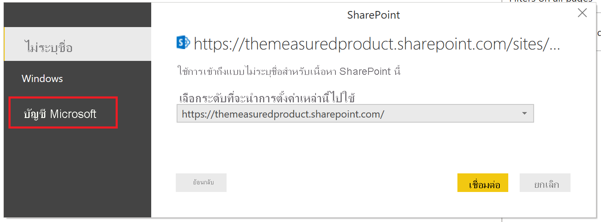
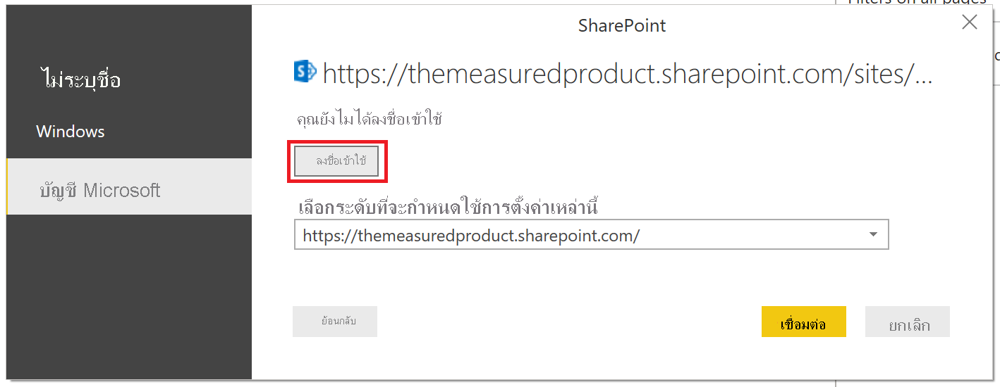

# สร้างรายงานบนรายการ SharePointCreate a report on a SharePoint List

ทีมและองค์กรจำนวนมากใช้รายการใน SharePoint Online เพื่อจัดเก็บข้อมูลเนื่องจากง่ายต่อการตั้งค่าและทำให้ผู้ใช้สามารถอัปเดตได้อย่างง่ายดายMany teams and organizations use Lists in SharePoint Online to store data because it's easy to set up and easy for users to update.  บางครั้งการใช้แผนภูมิเป็นแนวทางที่ง่ายกว่ามากสำหรับผู้ใช้เพื่อทำความเข้าใจข้อมูลอย่างรวดเร็วแทนที่จะดูตัวรายการเองSometimes a chart is a much easier way for users to quickly understand the data rather than looking at the list itself. ในบทช่วยสอนนี้ เราจะแสดงวิธีการแปลงข้อมูลในรายการ SharePoint ของคุณลงในรายงาน Power BIIn this tutorial, we show how to transform your SharePoint List data into a Power BI report.

ดูวิดีโอบทช่วยสอนห้านาทีนี้ หรือเลื่อนลงเพื่อดูคำแนะนำทีละขั้นตอนWatch this five-minute tutorial video, or scroll down for step-by-step instructions.

<iframe width="400" height="450" src="https://www.youtube.com/embed/OZO3x2NF8Ak" frameborder="0" allowfullscreen></iframe>

## ส่วนที่ 1: เชื่อมต่อไปยังรายการ SharePoint ของคุณPart 1: Connect to your SharePoint List

1. หากคุณยังไม่มี ให้ดาวน์โหลดและติดตั้ง [Power BI Desktop](https://powerbi.microsoft.com/desktop/)If you don't have it already, download and install [Power BI Desktop](https://powerbi.microsoft.com/desktop/).
2. เปิด Power BI Desktop และในแท็บหน้าแรกของริบบอน ให้เลือก **รับข้อมูล** > **เพิ่มเติม**Open Power BI Desktop and in the Home tab of the ribbon, select **Get Data** > **More**.
3. เลือก **บริการออนไลน์** จากนั้นเลือก **รายการ SharePoint Online**Select **Online Services**, then select **SharePoint Online List**.  

    

4. เลือก **เชื่อมต่อ**Select **Connect**.
4. ค้นหาที่อยู่ (หรือที่เรียกว่า URL) ของเว็บไซต์ SharePoint Online ที่มีรายการของคุณFind the address (also known as a URL) of your SharePoint Online site that contains your list.  จากหน้าเพจหนึ่งใน SharePoint Online โดยทั่วไปคุณสามารถรับที่อยู่ของไซต์ได้จากการเลือก **หน้าหลัก** ในบานหน้าต่างนำทาง หรือไอคอนสำหรับไซต์ที่ด้านบน จากนั้นคัดลอกที่อยู่จากแถบที่อยู่ของเว็บเบราว์เซอร์From a page in SharePoint Online, you can usually get the site address by selecting **Home** in the navigation pane, or the icon for the site at the top, then copying the address from your web browser's address bar.

   ดูวิดีโอของขั้นตอนนี้:Watch a video of this step:
   <iframe width="400" height="300" src="https://www.youtube.com/embed/OZO3x2NF8Ak?start=48&end=90" frameborder="0" allowfullscreen></iframe>

5. ใน Power BI Desktop ให้วางที่อยู่ลงในเขตข้อมูล **URL ของไซต์** ในกล่องโต้ตอบ open (เปิด)In Power BI Desktop, paste the address into the **Site URL** field in the open dialog box.

6. คุณอาจหรืออาจไม่เห็นหน้าจอการเข้าถึง SharePoint เหมือนรูปภาพต่อไปนี้You may or may not see a SharePoint access screen like the following image.  หากคุณไม่เห็น ให้ข้ามไปยังขั้นตอนที่ 10If you don't see it, skip to step 10.  หากคุณเห็น ให้เลือก **บัญชี Microsoft** ทางด้านซ้ายของหน้าIf you do see it, select **Microsoft Account** on the left side of the page.

    

7. เลือก **ลงชื่อเข้าใช้** และป้อนชื่อผู้ใช้และรหัสผ่านที่คุณใช้ในการลงชื่อเข้าใช้ Microsoft 365Select **Sign In** and enter the user name and password you use to sign in to Microsoft 365.

    

8. เมื่อคุณเสร็จสิ้นการลงชื่อเข้าใช้ ให้เลือก **เชื่อมต่อ**When you finish signing in, select **Connect**.

9. ที่ด้านซ้ายของตัวนำทาง ให้เลือกกล่องกาเครื่องหมายข้างรายการ SharePoint ที่คุณต้องการเชื่อมต่อOn the left side of the Navigator, select the checkbox beside the SharePoint list you want to connect to.

    

10. เลือก **โหลด**Select **Load**.  Power BI โหลดข้อมูลรายการของคุณลงในรายงานใหม่Power BI loads your list data into a new report.

## ส่วนที่ 2: สร้างรายงานPart 2: Create a report

1. ทางด้านซ้าย ให้เลือกไอคอน **ข้อมูล** เพื่อดูว่ามีการโหลดข้อมูลรายการ SharePoint ของคุณแล้วOn the left side, select the **Data** icon to see that your SharePoint list data was loaded.

2. ตรวจสอบให้แน่ใจว่าคอลัมน์รายการที่มีตัวเลขแสดงไอคอน Sum หรือ Sigma ใน **บานหน้าต่างเขตข้อมูล** ทางด้านขวาMake sure your list columns with numbers show the Sum, or Sigma, icon in the **Fields pane** on the right.  หากไม่มีสิ่งใด ให้เลือกส่วนหัวของคอลัมน์ในมุมมองตาราง จากนั้นเลือกแท็บ **การสร้างแบบจำลอง** จากนั้นเปลี่ยน **ชนิดข้อมูล** เป็น **จำนวนทศนิยม** หรือ **จำนวนเต็ม** ทั้งนี้ขึ้นอยู่กับข้อมูลของคุณFor any that don't, select the column header in the table view, select the **Modeling** tab, then change the **Data type** to **Decimal Number** or **Whole Number**, depending on the data.  ถ้าได้รับพร้อมท์ให้ยืนยันการเปลี่ยนแปลงของคุณ ให้เลือก **ใช่**If prompted to confirm your change, select **Yes**.  ถ้าตัวเลขของคุณเป็นรูปแบบพิเศษ เช่น สกุลเงิน คุณยังสามารถเลือกได้จากการตั้งค่า **รูปแบบ**If your number is a special format, like currency, you can also choose that by setting the **Format**.

   ดูวิดีโอของขั้นตอนนี้:Watch a video of this step:
   <iframe width="400" height="300" src="https://www.youtube.com/embed/OZO3x2NF8Ak?start=147&end=204" frameborder="0" allowfullscreen></iframe>

3. ทางด้านซ้าย ให้เลือกไอคอน **รายงาน**On the left side, select the **Report** icon.
4. เลือกคอลัมน์ที่คุณต้องการแสดงภาพโดยการเลือกกล่องกาเครื่องหมายด้านข้างบานหน้าต่าง **เขตข้อมูล** ทางด้านขวาSelect columns you want to visualize by selecting the checkbox beside them in the **Fields** pane on the right.

   ดูวิดีโอของขั้นตอนนี้:Watch a video of this step:
   <iframe width="400" height="300" src="https://www.youtube.com/embed/OZO3x2NF8Ak?start=215&end=252" frameborder="0" allowfullscreen></iframe>

5. เปลี่ยนชนิดของวิชวล ถ้าคุณต้องการChange the visual type if you need to.
6. คุณสามารถสร้างการแสดงผลข้อมูลด้วยภาพหลายรายการในรายงานเดียวกันได้โดยการกดโดยยกเลิกการเลือกวิชวลที่มีอยู่ แล้วเลือกกล่องกาเครื่องหมายสำหรับคอลัมน์อื่นในบานหน้าต่าง **เขตข้อมูล**You can create multiple visualizations in the same report by unselecting the existing visual then selecting checkboxes for other columns in the **Fields** pane.
7. เลือก **บันทึก** เพื่อบันทึกรายงานของคุณSelect **Save** to save your report.
