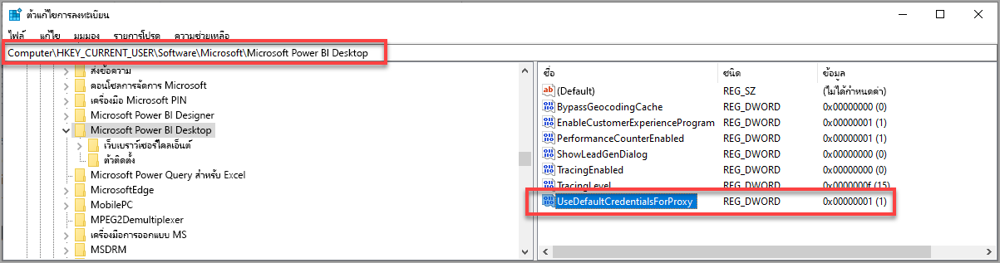

# การแก้ไขปัญหาการลงชื่อเข้าใช้ใน Power BI DesktopTroubleshooting sign-in for Power BI Desktop
อาจมีเวลาเมื่อคุณพยายามลงชื่อเข้าใช้ **Power BI Desktop** แต่ต้องเผชิญกับพบข้อผิดพลาดThere may be times when you attempt to sign in to **Power BI Desktop** but run into errors. มีสาเหตุหลักสองข้อสำหรับปัญหาในการลงชื่อเข้าใช้: **ข้อผิดพลาดการรับรองความถูกต้องพร็อกซี** และ **ข้อผิดพลาดในการเปลี่ยนเส้นทางไม่ใช่ HTTPS URL**There are two primary reasons for sign-in trouble: **Proxy Authentication errors** and **Non-HTTPS URL redirect errors**. 

เมื่อต้องการตรวจสอบปัญหาที่เป็นสาเหตุของปัญหาของคุณลงชื่อเข้าใช้ ขั้นแรกคือ การติดต่อผู้ดูแลระบบของคุณ และส่งข้อมูลการวินิจฉัย เพื่อให้พวกเขาสามารถระบุสาเหตุของปัญหาได้To determine which problem is causing your sign-in issue, the first step is to contact your administrator and provide diagnostic information so that they can determine the cause of the issue. จากการติดตามปัญหาที่เกี่ยวข้องกับการลงชื่อเข้าใช้ขอบคุณ ผู้ดูแลระบบสามารถตรวจสอบข้อผิดพลาดที่เกิดขึ้นกับคุณได้By tracing issues associated with your sign-in problem, administrators can determine which of the following errors apply to you. 

มาดูที่ปัญหาแต่ละอย่างเหล่านั้นตามลำดับกันLet's take a look at each of those issues in turn. ส่วนท้ายของบทความนี้มีการอภิปรายเกี่ยวกับวิธีการตรวจจับ *การติดตาม* ใน Power BI Desktop ซึ่งจะช่วยคุณติดตามการแก้ไขปัญหาได้At the end of this article is a discussion on how to capture a *trace* in Power BI Desktop, which can help track down troubleshooting issues.

## ข้อผิดพลาดที่จำเป็นต้องมีการรับรองความถูกต้องของพร็อกซีProxy Authentication Required error

หน้าจอต่อไปนี้แสดงตัวอย่างของข้อผิดพลาด  *ที่จำเป็นต้องมีการรับรองความถูกต้องของพร็อกซี*The following screen shows an example of the *Proxy Authentication Required* error.

ข้อยกเว้นในไฟล์การติดตามของ *Power BI Desktop* ต่อไปนี้จะเกี่ยวข้องกับข้อผิดพลาดนี้:The following exceptions in *Power BI Desktop* trace files are associated with this error:

* *Microsoft.PowerBI.Client.Windows.Services.PowerBIWebException**Microsoft.PowerBI.Client.Windows.Services.PowerBIWebException*
* *HttpStatusCode: ProxyAuthenticationRequired**HttpStatusCode: ProxyAuthenticationRequired*

เมื่อมีข้อผิดพลาดนี้เกิดขึ้น สาเหตุส่วนใหญ่น่าจะเกิดจากเซิร์ฟเวอร์ที่รับรองความถูกต้องของพร็อกซีบนเครือข่ายของคุณบล็อกการร้องขอจากเว็บที่ออกโดย **Power BI Desktop**When this error occurs, the most likely reason is that a proxy authentication server on your network is blocking the web requests issued by **Power BI Desktop**. 

ถ้าเครือข่ายของคุณใช้เซิร์ฟเวอร์ที่รับรองความถูกต้องของพร็อกซี ผู้ดูแลระบบของคุณสามารถแก้ไขปัญหานี้ โดยเพิ่มโดเมนต่อไปนี้ในรายการอนุญาตบนเซิร์ฟเวอร์ที่รับรองความถูกต้องของพร็อกซี:If your network uses a proxy authentication server, your administrator can fix this issue by adding the following domains to the allow list on the proxy authentication server:

* app.powerbi.comapp.powerbi.com
* api.powerbi.comapi.powerbi.com
* โดเมนใน \*.analysis.windows.net namespacedomains in the \*.analysis.windows.net namespace

สำหรับลูกค้าที่เป็นส่วนหนึ่งของระบบคลาวด์สำหรับส่วนราชการ การแก้ไขปัญหานี้สามารถทำได้โดยเพิ่มโดเมนต่อไปนี้ไปยังรายการอนุญาตบนเซิร์ฟเวอร์ที่รับรองความถูกต้องของพร็อกซี:For customers who are part of a government cloud, fixing this issue can be done by adding the following domains to the allow list on the proxy authentication server:

* app.powerbigov.usapp.powerbigov.us
* api.powerbigov.usapi.powerbigov.us
* โดเมนใน\*.analysis.usgovcloudapi.net namespacedomains in the \*.analysis.usgovcloudapi.net namespace

## ข้อผิดพลาดการเปลี่ยนเส้นทางที่ไม่ใช่ HTTPS URL ไม่ให้การสนับสนุนNon-HTTPS URL redirect not supported error

**Power BI Desktop** เวอร์ชันปัจจุบันใช้ไลบรารีการรับรองความถูกต้องของ Active Directory (ADAL) เวอร์ชั่นปัจจุบัน ซึ่งไม่อนุญาตให้มีการเปลี่ยนเส้นทางไปยัง URL (ที่ไม่ใช่ HTTPS) ที่ไม่มีความปลอดภัยCurrent versions of **Power BI Desktop** use the current version of the Active Directory Authentication Library (ADAL), which does not allow a redirect to non-secured (non-HTTPS) URLs. 

ข้อยกเว้นในไฟล์การติดตามของ *Power BI Desktop* ต่อไปนี้จะเกี่ยวข้องกับข้อผิดพลาดนี้:The following exceptions in *Power BI Desktop* trace files are associated with this error:

* *Microsoft.IdentityModel.Clients.ActiveDirectory.AdalServiceException: ไม่รองรับข้อผิดพลาดการเปลี่ยนเส้นทางที่ไม่ใช่ HTTPS URL ใน webview**Microsoft.IdentityModel.Clients.ActiveDirectory.AdalServiceException: Non-HTTPS url redirect is not supported in webview*
* *รหัสข้อผิดพลาด: non_https_redirect_failed**ErrorCode: non_https_redirect_failed*

ถ้ามี *รหัสข้อผิดพลาด: non_https_redirect_failed* เกิดขึ้น หมายความว่า หน้าเปลี่ยนเส้นทางหรือผู้ให้บริการในสายการเปลี่ยนเส้นทางอย่างน้อยหนึ่งรายหรือมากกว่าไม่ใช่ปลายทาง HTTPS ที่ได้รับการคุ้มครอง หรือผู้ออกใบรับรองการเปลี่ยนเส้นทางอย่างน้อยหนึ่งเส้นทางหรือมากกว่าไม่ได้อยู่ระหว่างคำ รากที่เชื่อถือได้ของอุปกรณ์If the *ErrorCode: non_https_redirect_failed* occurs, it means that one or more redirect pages or providers in the redirect chain is not an HTTPS protected endpoint, or that a certificate issuer of one or more redirects is not among the device's trusted roots. ผู้ให้บริการทั้งหมดในสายการเปลี่ยนเส้นทางใดๆก็ตามต้องมีการเข้าสู่ระบบต้องใช้ HTTPS URLAll providers in any sign-in redirect chain must use an HTTPS URL. เมื่อต้องการแก้ไขปัญหานี้ ติดต่อผู้ดูแลระบบของคุณและขอให้ใช้ URL ที่มีความปลอดภัยสำหรับไซต์ที่รับรองความถูกต้องของพวกเขาTo resolve this issue, contact your administrator and request that secured URLs be used for their authentication sites. 

## วิธีการรวบรวมการติดตามใน Power BI DesktopHow to collect a trace in Power BI Desktop

เมื่อต้องการรวบรวมการติดตามใน **Power BI Desktop** ให้ทำตามขั้นตอนต่อไปนี้:To collect a trace in **Power BI Desktop**, follow these steps:

1. เปิดใช้งานการติดตามใน **Power BI Desktop** โดยไปที่ **ไฟล์ > ตัวเลือกและการตั้งค่า > ตัวเลือก** แล้วเลือก **การวินิจฉัย** จากตัวเลือกในบานหน้าต่างด้านซ้ายEnable tracing in **Power BI Desktop** by going to **File > Options and settings > Options** and then select **Diagnostics** from the options in the left pane. ในบานหน้าต่างที่ปรากฏขึ้น เลือกที่กล่องที่อยู่ถัดจาก **เปิดใช้งานการติดตาม** ดังที่แสดงในรูปต่อไปนี้In the pane that appears, check the box next to **Enable tracing**, as shown in the following image. คุณอาจจำเป็นต้องรีสตาร์ต **Power BI Desktop**You may be required to restart **Power BI Desktop**.
   
   

2. แล้วทำตามขั้นตอนที่ทำให้เกิดข้อผิดพลาดอีกครั้งThen follow the steps that reproduce the error. เมื่อเกิดกรณีเช่นนี้ **Power BI Desktop** จะเพิ่มเหตุการณ์ลงในบันทึกการติดตาม ที่ถูกเก็บอยู่บนคอมพิวเตอร์ภายในWhen that occurs, **Power BI Desktop** adds events to the tracing log, which is kept on the local computer.

3. นำทางไปยังโฟลเดอร์ติดตามบนเครื่องคอมพิวเตอร์ของคุณNavigate to the Traces folder on your local computer. คุณสามารถค้นหาโฟลเดอร์นั้นได้ โดยเลือกลิงก์ใน **การวินิจฉัย** ที่คุณเปิดใช้งานการติดตาม โดยให้แสดงเป็น *โฟลเดอร์บันทึกข้อมูลความล้มเหลว/การติดตาม*  ในภาพก่อนหน้าได้You can find that folder by selecting the link in the **Diagnostics** where you enabled tracing, shown as *Open crash dump/traces folder* in the previous image. บ่อยครั้งที่โฟลเดอร์นี้อาจถูกพบในตำแหน่งที่ตั้งต่อไปนี้ในคอมพิวเตอร์:Often this is found on the local computer in the following location:

    `C:\Users/<user name>/AppData/Local/Microsoft/Power BI Desktop/Traces`

อาจมีไฟล์การติดตามจำนวนมากในโฟลเดอร์นั้นThere may be many trace files in that folder. ตรวจสอบให้แน่ใจว่าคุณส่งเฉพาะไฟล์ล่าสุดให้แก่ผู้ดูแลของคุณ เพื่อให้ง่ายต่อการระบุข้อผิดพลาดได้อย่างรวดเร็วMake sure you only send the recent files to your administrator to facilitate quickly identifying the error. 

## การใช้ข้อมูลประจำตัวของระบบเริ่มต้นสำหรับเว็บพร็อกซีUsing default system credentials for web proxy

คำขอทางเว็บที่ออกโดย Power BI Desktop ไม่ได้ใช้ข้อมูลประจำตัวของเว็บพร็อกซีWeb requests issued by Power BI Desktop do not use web proxy credentials. ในเครือข่ายที่ใช้พร็อกซีเซิร์ฟเวอร์ Power BI Desktop อาจไม่สามารถทำการร้องขอทางเว็บได้สำเร็จIn networks that use a proxy server, Power BI Desktop may not be able to successfully make web requests. 

เริ่มต้นด้วยการเผยแพร่ Power BI Desktop เดือนมีนาคม 2020 ผู้ดูแลระบบหรือผู้ดูแลเครือข่ายสามารถอนุญาตให้ใช้ข้อมูลประจำตัวของระบบค่าเริ่มต้นสำหรับการรับรองความถูกต้องของเว็บพร็อกซีStarting with the March 2020 Power BI Desktop release, system or network administrators can allow the use of default system credentials for web proxy authentication. ผู้ดูแลระบบสามารถสร้างรายการการลงทะเบียนที่เรียกว่า **UseDefaultCredentialsForProxy** และตั้งค่าเป็นหนึ่ง (1) เพื่อเปิดใช้งานการใช้ข้อมูลประจำตัวของระบบตามค่าเริ่มต้นสำหรับการรับรองความถูกต้องของเว็บพร็อกซีAdministrators can create a registry entry called **UseDefaultCredentialsForProxy**, and set the value to one (1) to enable the use of default system credentials for web proxy authentication.

รายการการลงทะเบียนสามารถวางไว้ในตำแหน่งต่อไปนี้:The registry entry can be placed in either of the following locations:

`[HKEY_LOCAL_MACHINE\SOFTWARE\WOW6432Node\Microsoft\Microsoft Power BI Desktop]`
`[HKEY_LOCAL_MACHINE\SOFTWARE\Microsoft\Microsoft Power BI Desktop]`

ไม่จำเป็นต้องมีรายการการลงทะเบียนในทั้งสองตำแหน่งIt is not necessary to have the registry entry in both locations.

เมื่อมีการสร้างรายการการลงทะเบียน (อาจจำเป็นต้องรีบูต) ระบบจะใช้การตั้งค่าพร็อกซีที่ระบุไว้ใน Internet Explorer เมื่อ Power BI Desktop สร้างการร้องขอเว็บOnce the registry entry is created (a reboot may be necessary) the proxy settings defined in Internet Explorer are used when Power BI Desktop makes web requests. 

เช่นเดียวกับการเปลี่ยนแปลงใด ๆ กับพร็อกซีหรือการตั้งค่าข้อมูลประจำตัว มีผลกระทบด้านความปลอดภัยในการสร้างรายการการลงทะเบียนนี้ ดังนั้นผู้ดูแลระบบต้องตรวจสอบให้แน่ใจว่าตนเองได้กำหนดค่าพร็อกซี Internet Explorer อย่างถูกต้องแล้วก่อนที่จะเปิดใช้งานคุณลักษณะนี้As with any change to proxy or credential settings, there are security implications to creating this registry entry, so administrators must make sure they have configured the Internet Explorer proxies correctly before enabling this feature.         

### ขีดจำกัดและข้อควรพิจารณาสำหรับการใช้ข้อมูลประจำตัวของระบบตามค่าเริ่มต้นLimitations and considerations for using default system credentials

มีชุดของผลกระทบด้านความปลอดภัยที่ผู้ดูแลระบบควรพิจารณาก่อนเปิดใช้งานความสามารถนี้There are a collection of security implications that administrators should consider before enabling this capability. 

ควรทำตามคำแนะนำต่อไปนี้เมื่อใดก็ตามที่เปิดใช้งานคุณลักษณะนี้สำหรับไคลเอ็นต์:The following recommendations should be followed whenever enabling this feature for clients:

* ใช้ **การเจรจาต่อรอง** เป็นแบบแผนในการตรวจสอบความถูกต้องบนพร็อกซีเซิร์ฟเวอร์เท่านั้น เพื่อให้แน่ใจว่าไคลเอ็นต์ใช้งานเฉพาะพร็อกซีเซิร์ฟเวอร์ที่เข้าร่วมกับเครือข่าย Active DirectoryOnly use **Negotiation** as the authentication scheme on the for the proxy server, to ensure only proxy servers that are joined to the Active Directory network are used by the client. 
* อย่าใช้ **การแสดงแทน NTLM** บนไคลเอ็นต์ที่ใช้คุณลักษณะนี้Do not use **NTLM fallback** on clients that use this feature.
* หากผู้ใช้ไม่ได้อยู่ในเครือข่ายที่มีพร็อกซีเมื่อเปิดใช้งานและกำหนดค่าคุณลักษณะนี้ตามที่แนะนำในส่วนนี้ จะไม่มีการใช้งานกระบวนการติดต่อพร็อกซีเซิร์ฟเวอร์และการใช้ข้อมูลประจำตัวของระบบตามค่าเริ่มต้นIf users are not on a network with a proxy when this feature is enabled and configured as recommended in this section, the process of attempting to contact the proxy server and using default system credentials is not used.

[การใช้ข้อมูลประจำตัวของระบบตามค่าเริ่มต้นสำหรับเว็บพร็อกซีUsing default system credentials for web proxy](#using-default-system-credentials-for-web-proxy)

