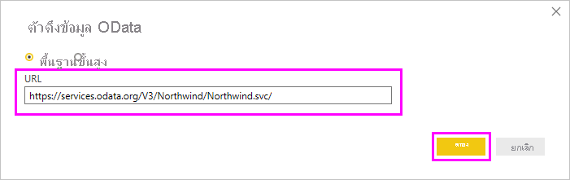
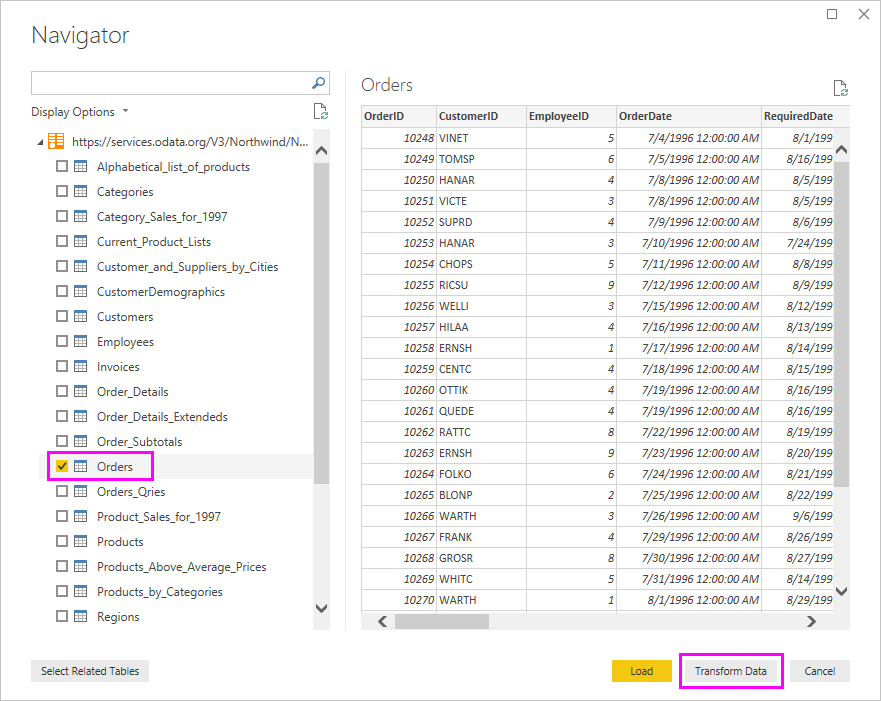
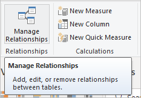

# บทช่วยสอน: วิเคราะห์ข้อมูลยอดขายจาก Excel และตัวดึงข้อมูล ODataTutorial: Analyze sales data from Excel and an OData feed

ซึ่งถือเป็นเรื่องปกติที่มีข้อมูลในแหล่งข้อมูลหลายแหล่งIt's common to have data in multiple data sources. ตัวอย่างเช่น คุณสามารถมีสองฐานข้อมูล ฐานข้อมูลหนึ่งสำหรับข้อมูลผลิตภัณฑ์ และอีกหนึ่งสำหรับข้อมูลการขายFor example, you could have two databases, one for product information, and another for sales information. ด้วย *Power BI Desktop* คุณสามารถรวมข้อมูลจากแหล่งข้อมูลที่แตกต่างกัน เพื่อสร้างการวิเคราะห์ข้อมูลและการแสดงภาพที่น่าสนใจ และน่าดึงดูดใจได้With *Power BI Desktop*, you can combine data from different sources to create interesting, compelling data analyses and visualizations.

ในบทช่วยสอนนี้ คุณสามารถรวมข้อมูลจากแหล่งข้อมูลสองแหล่ง:In this tutorial, you combine data from two data sources:

* สมุดงาน Excel ที่มีข้อมูลผลิตภัณฑ์An Excel workbook with product information
* ตัวดึงข้อมูล OData ประกอบด้วยข้อมูลคำสั่งซื้อAn OData feed containing orders data

คุณกำลังจะนำเข้าแต่ละชุดข้อมูล และดำเนินการแปลงและรวมYou're going to import each dataset and do transformation and aggregation operations. จากนั้น คุณจะใช้ข้อมูลของสองแหล่งเพื่อสร้างรายงานการวิเคราะห์การขายพร้อมการแสดงภาพแบบโต้ตอบThen, you'll use the two source's data to produce a sales analysis report with interactive visualizations. ต่อมา คุณสามารถใช้เทคนิคเหล่านี้กับคิวรี SQL Server ไฟล์ CSV และแหล่งข้อมูลอื่น ๆ ใน Power BI DesktopLater, you can apply these techniques to SQL Server queries, CSV files, and other data sources in Power BI Desktop.

>[!NOTE]
>ใน Power BI Desktop งานหนึ่งงานมักทำได้หลายวิธีIn Power BI Desktop, there are often a few ways to accomplish a task. ตัวอย่างเช่น คุณสามารถคลิกขวา หรือใช้เมนู **ตัวเลือกเพิ่มเติม** บนคอลัมน์หรือเซลล์เพื่อดูการเลือกริบบิ้นเพิ่มเติมได้For example, you can right-click or use a **More options** menu on a column or cell to see additional ribbon selections. วิธีทางเลือกหลายวิธีจะอธิบายในขั้นตอนด้านล่างนี้Several alternate methods are described in the steps below.

## นำเข้าข้อมูลผลิตภัณฑ์ ExcelImport Excel product data

ก่อนอื่น นำเข้าข้อมูลผลิตภัณฑ์จากสมุดงาน Excel *Products.xlsx* ลงใน Power BI DesktopFirst, import product data from the *Products.xlsx* Excel workbook into Power BI Desktop.

1. [ดาวน์โหลดเวิร์กบุ๊ก Excel Products.xlsx](https://download.microsoft.com/download/1/4/E/14EDED28-6C58-4055-A65C-23B4DA81C4DE/Products.xlsx) และบันทึกเป็น *Products.xlsx*[Download the Products.xlsx Excel workbook](https://download.microsoft.com/download/1/4/E/14EDED28-6C58-4055-A65C-23B4DA81C4DE/Products.xlsx) and save it as *Products.xlsx*.

1. เลือกลูกศรที่อยู่ถัดจาก **รับข้อมูล** ในแท็บ **หน้าแรก** ของริบบอน Power BI Desktop แล้วเลือก **Excel** จากเมนู **ส่วนใหญ่โดยทั่วไป**Select the arrow next to **Get Data** in the Power BI Desktop ribbon's **Home** tab, and then select **Excel** from the **Most Common** menu.

   

   >[!NOTE]
   >คุณยังสามารถเลือกรายการ **รับข้อมูล** โดยตรง หรือเลือก **รับข้อมูล** จากกล่องโต้ตอบ **การเริ่มต้นใช้งาน** Power BI แล้วเลือก **Excel** หรือ **ไฟล์** > **Excel** ในกล่องโต้ตอบ **รับข้อมูล** จากนั้นเลือก **เชื่อมต่อ**You can also select the **Get Data** item itself, or select **Get Data** from the Power BI **Get started** dialog box, then select **Excel** or **File** > **Excel** in the **Get Data** dialog box, and then select **Connect**.

1. ในกล่องโต้ตอบ **เปิด** นำทางไปยังและเลือกไฟล์ **Products.xlsx** แล้ว ลือก **เปิด**In the **Open** dialog box, navigate to and select the **Products.xlsx** file, and then select **Open**.

1. ใน **ตัวนำทาง** ให้เลือกแบบตาราง **ผลิตภัณฑ์** จากนั้น เลือก **แปลงข้อมูล**In the **Navigator**, select the **Products** table and then select **Transform Data**.

   

การแสดงตัวอย่างของตารางเปิดขึ้นใน Power Query Editor ที่คุณสามารถใช้การแปลงเพื่อล้างข้อมูลA table preview opens in the Power Query Editor, where you can apply transformations to clean up the data.

>[!NOTE]
>คุณยังสามารถเปิด Power Query Editor โดยการเลือก **แก้ไขคิวรี** > **แก้ไขคิวรี** จากริบบอน **หน้าแรก** ใน Power BI Desktop โดยคลิกขวา หรือเลือก **ตัวเลือกเพิ่มเติม** ถัดจากคิวรีใดก็ตามใน **มุมมองรายงาน** และเลือก **แก้ไขคิวรี**You can also open the Power Query Editor by selecting **Edit Queries** > **Edit Queries** from the **Home** ribbon in Power BI Desktop, or by right-clicking or choosing **More options** next to any query in the **Report** view, and selecting **Edit Query**.

## ล้างคอลัมน์ผลิตภัณฑ์Clean up the products columns

รายงานรวมของคุณจะใช้คอลัมน์ **ProductID**, **ProductName**, **QuantityPerUnit** และ **UnitsInStock** จากเวิร์กบุ๊ก ExcelYour combined report will use the Excel workbook's  **ProductID**, **ProductName**, **QuantityPerUnit**, and **UnitsInStock** columns. คุณสามารถเอาคอลัมน์อื่น ๆ ออกได้You can remove the other columns.

1. ใน Power Query Editor ให้เลือกคอลัมน์ **ProductID**, **ProductName**, **QuantityPerUnit** และ **UnitsInStock**In Power Query Editor, select the **ProductID**, **ProductName**, **QuantityPerUnit**, and **UnitsInStock** columns. คุณสามารถใช้ Ctrl เพื่อเลือกมากกว่าหนึ่งคอลัมน์ หรือ Shift เพื่อเลือกคอลัมน์ที่อยู่ติดกันYou can use Ctrl to select more than one column, or Shift to select columns next to each other.

1. คลิกขวาที่ส่วนหัวใด ๆ ที่เลือกRight-click any of the selected headers. เลือก **เอาคอลัมน์อื่นออก** จากเมนูแบบดรอปดาวน์Select **Remove Other Columns** from the drop-down menu.
   คุณยังสามารถเลือก **เอาคอลัมน์ออก** > **เอาคอลัมน์อื่นออก** จากในกลุ่ม **จัดการคอลัมน์** ในแท็บ ribbon **หน้าแรก**You can also select **Remove Columns** > **Remove Other Columns** from the **Manage Columns** group in the **Home** ribbon tab.

   

## นำเข้าข้อมูลคำสั่งซื้อของตัวดึงข้อมูล ODataImport the OData feed's order data

ถัดไป นำเข้าข้อมูลคำสั่งซื้อจากตัวดึงข้อมูล OData ตัวอย่างระบบการขายของ NorthwindNext, import the order data from the sample Northwind sales system OData feed.

1. ใน Power Query Editor เลือก **แหล่งข้อมูลใหม่** แล้วจากรายการแบบดรอปดาวน์ **ส่วนใหญ่โดยทั่วไป** เลือก **ตัวดึงข้อมูล OData**In Power Query Editor, select **New Source** and then, from the **Most Common** menu, select **OData feed**.

   

1. ในกล่องโต้ตอบ **ตัวดึงข้อมูล OData** วาง URL ตัวดึงข้อมูล Northwind OData`https://services.odata.org/V3/Northwind/Northwind.svc/`In the **OData feed** dialog box, paste the Northwind OData feed URL, `https://services.odata.org/V3/Northwind/Northwind.svc/`. เลือก **ตกลง**Select **OK**.

   

1. ในบานหน้าต่าง **ตัวนำทาง** เลือกตาราง **Orders** จากนั้นเลือก **แปลงข้อมูล** เพื่อโหลดข้อมูลลงใน Power Query EditorIn **Navigator**, select the **Orders** table, and then select **Transform Data** to load the data into Power Query Editor.

   

   >[!NOTE]
   >ใน **ตัวนำทาง** คุณสามารถเลือกที่ชื่อตารางใด ๆ โดยต้องไม่เลือกกล่องกาเครื่องหมาย เพื่อดูตัวอย่างได้In **Navigator**, you can select any table name, without selecting the checkbox, to see a preview.

## ขยายข้อมูลคำสั่งซื้อExpand the order data

คุณสามารถใช้การอ้างอิงตารางเพื่อสร้างคิวรีเมื่อเชื่อมต่อกับแหล่งข้อมูลที่มีหลายตารางได้ เช่น ฐานข้อมูลเชิงสัมพันธ์หรือตัวดึงข้อมูล Northwind ODataYou can use table references to build queries when connecting to data sources with multiple tables, such as relational databases or the Northwind OData feed. ตาราง **Orders** ประกอบด้วยการอ้างอิงไปยังตารางที่เกี่ยวข้องหลายตารางThe **Orders** table contains references to several related tables. คุณสามารถเพิ่มการดำเนินการขยายเพื่อเพิ่มคอลัมน์ **ProductID**, **UnitPrice** และ **Quantity** จากตาราง **Order_Details** ที่เกี่ยวข้องลงในตารางชื่อ (**Orders**)You can use the expand operation to add the **ProductID**, **UnitPrice**, and **Quantity** columns from the related **Order_Details** table into the subject (**Orders**) table.

1. เลื่อนไปทางขวาในตาราง **Orders** จนกว่าคุณจะเห็นคอลัมน์ **Order_Details**Scroll to the right in the **Orders** table until you see the **Order_Details** column. คอลัมน์ประกอบด้วยการอ้างอิงไปยังตารางอื่นและไม่ใช่ข้อมูลIt contains references to another table and not data.

   

1. เลือกไอคอน **ขยาย** () ในส่วนหัวของคอลัมน์ **Order_Details**Select the **Expand** icon () in the **Order_Details** column header.

1. ในเมนูดรอปดาวน์:In the drop-down menu:

   1. เลือก **(เลือกคอลัมน์ทั้งหมด)** เพื่อล้างคอลัมน์ทั้งหมดSelect **(Select All Columns)** to clear all columns.

   1. เลือก **ProductID**, **UnitPrice** และ **Quantity** แล้วเลือก **ตกลง**Select **ProductID**, **UnitPrice**, and **Quantity**, and then select **OK**.

      

หลังจากที่คุณขยายตาราง **Order_Details** คอลัมน์ตารางที่ซ้อนกันใหม่สามคอลัมน์จะแทนที่คอลัมน์ **Order_Details**After you expand the **Order_Details** table, three new nested table columns replace the **Order_Details** column. มีแถวใหม่ในตารางสำหรับข้อมูลที่เพิ่มเติมของแต่ละคำสั่งซื้อThere are new rows in the table for each order's added data.

## สร้างคอลัมน์จากการคำนวณแบบกำหนดเองCreate a custom calculated column

ตัวแก้ไข Power Query ให้คุณสามารถสร้างการคำนวณและเขตข้อมูลแบบกำหนดเองเพื่อเติมแต่งข้อมูลของคุณPower Query Editor lets you create calculations and custom fields to enrich your data. คุณจะสร้างคอลัมน์แบบกำหนดเองที่คูณราคาต่อหน่วยกับปริมาณของรายการเพื่อคำนวณราคารวมสำหรับแต่ละรายการของคำสั่งซื้อYou'll create a custom column that multiplies the unit price by item quantity to calculate the total price for each order's line item.

1. ในแท็บริบบิ้น **เพิ่มคอลัมน์** ของตัวแก้ไข Power Query เลือก **คอลัมน์แบบกำหนดเอง**In the Power Query Editor's **Add Column** ribbon tab, select **Custom Column**.

   

1. ในกล่องโต้ตอบ **คอลัมน์แบบกำหนดเอง** พิมพ์ **LineTotal** ในเขตข้อมูล **ชื่อคอลัมน์ใหม่**In the **Custom Column** dialog box, type **LineTotal** in the **New column name** field.

1. ในเขตข้อมูล **สูตรคอลัมน์แบบกำหนดเอง** หลังจาก **=** ใส่ **[Order_Details.UnitPrice]** \* **[Order_Details.Quantity]**In the **Custom column formula** field after the **=**, enter **[Order_Details.UnitPrice]** \* **[Order_Details.Quantity]**. คุณยังสามารถเลือกชื่อเขตข้อมูลจากกล่องเลื่อน **คอลัมน์ที่มีให้เลือกใช้งาน** และเลือก **<< แทรก** แทนที่จะพิมพ์ลงไปYou can also select the field names from the **Available columns** scroll box and select **<< Insert**, instead of typing them.

1. เลือก **ตกลง**Select **OK**.

   

   เขตข้อมูล **LineTotal** ใหม่จะปรากฏเป็นคอลัมน์สุดท้ายในตาราง **Orders**The new **LineTotal** field appears as the last column in the **Orders** table.

## ตั้งค่าชนิดข้อมูลสำหรับเขตข้อมูลใหม่Set the new field's data type

เมื่อตัวแก้ไข Power Query เชื่อมต่อกับข้อมูลจะสามารถคาดเดาได้ดีที่สุดว่าเป็นชนิดข้อมูลของแต่ละเขตข้อมูลสำหรับวัตถุประสงค์ในการแสดงผลWhen Power Query Editor connects to data, it makes a best guess as to each field's data type for display purposes. ไอคอนส่วนหัวระบุชนิดข้อมูลที่กำหนดของแต่ละเขตข้อมูลA header icon indicates each field's assigned data type. นอกจากนี้ คุณสามารถดูภายใต้ **ชนิดข้อมูล** ในกลุ่ม **แปลง** ของแท็บริบบิ้น **หน้าหลัก** ได้อีกด้วยYou can also look under **Data Type** in the **Home** ribbon tab's **Transform** group.

คอลัมน์ **LineTotal** ใหม่ของคุณมีชนิดข้อมูล **ใด ๆ** แต่มีค่าสกุลเงินYour new **LineTotal** column has an **Any** data type, but it has currency values. เพื่อกำหนดชนิดข้อมูล คลิกขวาที่ส่วนหัวของคอลัมน์ **LineTotal** เลือก **เปลี่ยนชนิดข้อมูล** จากเมนูแบบดรอปดาวน์ แล้วเลือก **จำนวนทศนิยมตายตัว**To assign a data type, right-click the **LineTotal** column header, select **Change Type** from the drop-down menu, and then select **Fixed decimal number**.

>[!NOTE]
>คุณยังสามารถเลือกคอลัมน์ **LineTotal** แล้วเลือกลูกศรถัดจาก **ชนิดข้อมูล** ในพื้นที่ **แปลง** ของแท็บริบบอน **หน้าแรก** จากนั้นเลือก **จำนวนทศนิยมตายตัว**You can also select the **LineTotal** column, then select the arrow next to **Data Type** in the **Transform** area of the **Home** ribbon tab, and then select **Fixed decimal number**.

## ล้างคอลัมน์คำสั่งซื้อClean up the orders columns

เพื่อทำให้แบบจำลองของคุณง่ายต่อการทำงานในรายงาน คุณสามารถลบ เปลี่ยนชื่อ และเรียงลำดับคอลัมน์บางคอลัมน์ใหม่ได้To make your model easier to work with in reports, you can delete, rename, and reorder some columns.

รายงานของคุณจะใช้คอลัมน์ต่อไปนี้:Your report is going to use the following columns:

* **OrderDate****OrderDate**
* **ShipCity****ShipCity**
* **ShipCountry****ShipCountry**
* **Order_Details.ProductID****Order_Details.ProductID**
* **Order_Details.UnitPrice****Order_Details.UnitPrice**
* **Order_Details.Quantity****Order_Details.Quantity**
* **LineTotal****LineTotal**

เลือกคอลัมน์เหล่านี้ และใช้ **เอาคอลัมน์อื่นออก** เหมือนที่คุณดำเนินการกับข้อมูล ExcelSelect these columns and use **Remove Other Columns** as you did with the Excel data. หรือคุณสามารถเลือกคอลัมน์ที่ไม่ได้อยู่ในรายการ โดยคลิกขวาบนหนึ่งในคอลัมน์ แล้วเลือก **เอาคอลัมน์ออก** ได้Or, you can select the non-listed columns, right-click on one of them, and select **Remove Columns**.

คุณสามารถตั้งชื่อคอลัมน์ที่ขึ้นต้นด้วย "**Order_Details**" ใหม่ได้You can rename the columns prefixed with "**Order_Details.**" เพื่อให้อ่านได้ง่ายขึ้น:to make them easier to read:

1. ดับเบิลคลิก หรือแตะค้างไว้ที่ส่วนหัวของแต่ละคอลัมน์ หรือคลิกขวาที่ส่วนหัวของคอลัมน์ และเลือก **ตั้งชื่อใหม่** จากเมนูแบบดรอปดาวน์Double-click or tap and hold each column header, or right-click the column header, and select **Rename** from the drop-down menu.

1. ลบ **Order_Details.**Delete the **Order_Details.** คำนำหน้าจากแต่ละชื่อprefix from each name.

สุดท้าย เพื่อทำให้คอลัมน์ **LineTotal** ง่ายต่อการเข้าถึง ลาก และวางลงไปด้านซ้าย ตรงด้านขวาของคอลัมน์ **ShipCountry**Finally, to make the **LineTotal** column easier to access, drag and drop it to the left, just to the right of the **ShipCountry** column.

## ตรวจทานขั้นตอนคิวรีReview the query steps

จะมีการบันทึกแอคชันตัวแก้ไข Power Query เพื่อทำให้เป็นรูปแบบและแปลงข้อมูลYour Power Query Editor actions to shape and transform data are recorded. แต่ละแอคชันที่ปรากฏขึ้นทางด้านขวามือในบานหน้าต่าง **การตั้งค่าคิวรี** ภายใต้ **ขั้นตอนที่กำหนดใช้**Each action appears on the right in the **Query Settings** pane under **Applied Steps**. คุณสามารถย้อนกลับผ่าน **ขั้นตอนที่กำหนดใช้** เพื่อตรวจสอบขั้นตอนของคุณ และแก้ไข ลบ หรือจัดเรียงใหม่ได้ถ้าจำเป็นYou can step back through the **Applied Steps** to review your steps, and edit, delete, or rearrange them if necessary. อย่างไรก็ตาม ขั้นตอนก่อนหน้าที่เปลี่ยนแปลงจะมีความเสี่ยงเนื่องจากสามารถทำให้ขั้นตอนลำดับถัดไปเสียหายได้However, changing preceding steps is risky as that can break later steps.

เลือกแต่ละคิวรีของคุณในรายการ **คิวรี** ทางด้านซ้ายของตัวแก้ไข Power Query และตรวจทาน **ขั้นตอนที่กำหนดใช้** ใน **การตั้งค่าแบบสอบถาม**Select each of your queries in the **Queries** list on the left side of Power Query Editor, and review the **Applied Steps** in **Query Settings**. หลังจากที่นำการเปลี่ยนแปลงข้อมูลก่อนหน้าไปใช้ **ขั้นตอนที่กำหนดใช้กับคิวรีทั้ง** สองของคุณควรมีลักษณะดังนี้:After applying the previous data transformations, the **Applied Steps** for your two queries should look like this:

 &nbsp;&nbsp; 

>[!TIP]
>ขั้นตอนที่กำหนดใช้โดยพื้นฐานแล้วเป็นสูตรที่เขียนใน *ภาษา Power Query* หรือที่เรียกว่า [ภาษา M](/powerquery-m/power-query-m-reference)Underlying the Applied Steps are formulas written in the *Power Query Language*, also known as the [M language](/powerquery-m/power-query-m-reference). เมื่อต้องการดูและแก้ไขสูตร เลือก **เครื่องมือแก้ไขขั้นสูง** ในกลุ่ม **คิวรี** ของแท็บ **หน้าแรก** ของริบบอนTo see and edit the formulas, select **Advanced Editor** in the **Query** group of the **Home** tab of the ribbon.

## นำเข้าคิวรีที่ถูกแปลงImport the transformed queries

เมื่อคุณพอใจกับข้อมูลของคุณที่ถูกแปลงแล้ว และพร้อมที่จะนำเข้าข้อมูลลงในมุมมอง **รายงาน** Power BI Desktop เลือก **ปิด & ใช้** > **ปิด & ใช้** ในกลุ่ม **ปิด** ของแท็บริบบอน **หน้าแรก**When you're satisfied with your transformed data and ready to import it into Power BI Desktop **Report** view, select **Close & Apply** > **Close & Apply** in the **Home** ribbon tab's **Close** group.

เมื่อข้อมูลถูกโหลดแล้ว คิวรีจะปรากฏในรายการ **เขตข้อมูล** ในมุมมอง **รายงาน** ของ Power BI DesktopOnce the data is loaded, the queries appear in the **Fields** list in the Power BI Desktop **Report** view.

## จัดการความสัมพันธ์ระหว่างชุดข้อมูลManage the relationship between the datasets

Power BI Desktop ไม่จำเป็นต้องเรียกร้องให้รวมคิวรี่เป็นรายงานPower BI Desktop doesn't require you to combine queries to report on them. อย่างไรก็ตาม คุณสามารถใช้ความสัมพันธ์ระหว่างชุดข้อมูล ตามเขตข้อมูลที่มีร่วมกัน เพื่อขยายและเติมแต่งรายงานของคุณHowever, you can use the relationships between datasets, based on common fields, to extend, and enrich your reports. Power BI Desktop อาจตรวจพบความสัมพันธ์โดยอัตโนมัติ หรือคุณสามารถสร้างได้ในกล่องโต้ตอบ **จัดการความสัมพันธ์** ใน Power BI DesktopPower BI Desktop may detect relationships automatically, or you can create them in the Power BI Desktop **Manage Relationships** dialog box. สำหรับข้อมูลเพิ่มเติม ดู[สร้างและจัดการความสัมพันธ์ใน Power BI Desktop](../transform-model/desktop-create-and-manage-relationships.md)For more information, see [Create and manage relationships in Power BI Desktop](../transform-model/desktop-create-and-manage-relationships.md).

เขตข้อมูล `ProductID` ที่มีการแชร์จะสร้างความสัมพันธ์ระหว่างชุดข้อมูล `Orders` และ `Products` ของบทช่วยสอนนี้The shared `ProductID` field creates a relationship between this tutorial's `Orders` and `Products` datasets.

1. ในมุมมอง **รายงาน** Power BI Desktop เลือก **จัดการความสัมพันธ์** ในพื้นที่ **ความสัมพันธ์** ของแท็บริบบอน **หน้าแรก**In Power BI Desktop **Report** view, select **Manage Relationships** in the **Home** ribbon tab's **Relationships** area.

   

1. ในกล่องโต้ตอบ **จัดการความสัมพันธ์** คุณสามารถดูว่า Power BI Desktop ตรวจพบ และแสดงความสัมพันธ์ที่ใช้งานอยู่ระหว่างตาราง **Products** และ **Orders** อยู่แล้วIn the **Manage relationships** dialog box, you can see that Power BI Desktop has already detected and listed an active relationship between the **Products** and **Orders** tables. เพื่อดูความสัมพันธ์ เลือก **แก้ไข**To view the relationship, select **Edit**.

   

   **แก้ไขความสัมพันธ์** จะเปิดขึ้น ซึ่งแสดงรายละเอียดเกี่ยวกับความสัมพันธ์**Edit Relationship** opens, showing details about the relationship.  

   

1. Power BI Desktop มีการตรวจพบความสัมพันธ์ได้อย่างถูกต้องโดยอัตโนมัติ ดังนั้นคุณสามารถเลือก **ยกเลิก** แล้วเลือก **ปิด** ได้Power BI Desktop has autodetected the relationship correctly, so you can select **Cancel** and then **Close**.

ใน Power BI Desktop ทางด้านซ้ายมือ เลือก **แบบจำลอง** เพื่อดู และจัดการความสัมพันธ์คิวรีIn Power BI Desktop, on the left side, select **Model** to view and manage query relationships. ดับเบิลคลิกที่ลูกศรบนเส้นที่เชื่อมต่อระหว่างสองคิวรีเพื่อเปิดกล่องโต้ตอบ **แก้ไขความสัมพันธ์** และดูหรือเปลี่ยนแปลงความสัมพันธ์Double-click the arrow on the line connecting the two queries to open the **Edit relationship** dialog and view or change the relationship.

เพื่อกลับไปยังมุมมอง **รายงาน** จากมุมมอง **แบบจำลอง** เลือกไอคอน **รายงาน**To get back to **Report** view from **Model** view, select the **Report** icon.

## สร้างการแสดงภาพโดยใช้ข้อมูลของคุณCreate visualizations using your data

คุณสามารถสร้างการแสดงภาพที่แตกต่างกันในมุมมองการตรวจสอบ Power BI Desktop เพื่อรับข้อมูลเชิงลึกYou can create different visualizations in Power BI Desktop Review View to gain data insights. คุณสามารถมีหลายหน้า และแต่ละหน้าสามารถมีหลายวิชวลReports can have multiple pages, and each page can have multiple visuals. คุณและผู้อื่นสามารถโต้ตอบกับการแสดงภาพของคุณ เพื่อช่วยวิเคราะห์ และทำความเข้าใจข้อมูลYou and others can interact with your visualizations to help analyze and understand data. สำหรับข้อมูลเพิ่มเติม ดู [โต้ตอบกับรายงานในมุมมองการแก้ไขในบริการ Power BI](../create-reports/service-interact-with-a-report-in-editing-view.md)For more information, see [Interact with a report in Editing view in Power BI service](../create-reports/service-interact-with-a-report-in-editing-view.md).

คุณสามารถใช้ทั้งสองชุดข้อมูลของคุณ และความสัมพันธ์ระหว่างกัน เพื่อช่วยให้มองเห็นภาพ และวิเคราะห์ข้อมูลยอดขายของคุณได้You can use both of your data sets, and the relationship between them, to help visualize and analyze your sales data.

ก่อนอื่น สร้างแผนภูมิคอลัมน์แบบเรียงซ้อนที่ใช้เขตข้อมูลจากทั้งสองคิวรี เพื่อแสดงปริมาณของแต่ละผลิตภัณฑ์ที่สั่งซื้อFirst, create a stacked column chart that uses fields from both queries to show the quantity of each product ordered.

1. เลือกเขตข้อมูล **Quantity** จาก **Orders** ในบานหน้าต่าง **เขตข้อมูล** ด้านขวา หรือลากไปที่ว่างบนพื้นที่ทำงานSelect the **Quantity** field from **Orders** in the **Fields** pane at the right, or drag it onto a blank space on the canvas. จะมีการสร้างแผนภูมิคอลัมน์แบบเรียงซ้อน ที่แสดงจำนวนรวมของผลิตภัณฑ์ทั้งหมดที่สั่งซื้อA stacked column chart is created showing the total quantity of all products ordered.

1. เลือก **ProductName** จาก **Products** ในบานหน้าต่าง **เขตข้อมูล** หรือลากลงบนแผนภูมิ เพื่อแสดงปริมาณของแต่ละผลิตภัณฑ์ที่สั่งซื้อTo show the quantity of each product ordered, select **ProductName** from **Products** in the **Fields** pane, or drag it onto the chart.

1. เลือก **ตัวเลือกเพิ่มเติม** ที่จุดไข่ปลา ( **...** ) ที่มุมบนขวาของการแสดงภาพ จากนั้นเลือก **เรียงลำดับตามปริมาณ** เพื่อเรียงลำดับผลิตภัณฑ์ ตามการสั่งซื้อมากที่สุดไปหาน้อยที่สุดTo sort the products by most to least ordered, select the **More options** ellipsis (**...**) at the visualization's upper right, and then select **Sort By Quantity**.

1. ใช้จุดจับที่มุมของแผนภูมิเพื่อขยายให้มองเห็นชื่อผลิตภัณฑ์เพิ่มเติมUse the handles at the corners of the chart to enlarge it so more product names are visible.

   

ถัดไป สร้างแผนภูมิที่แสดงยอดเงินดอลลาร์ของคำสั่งซื้อ (**LineTotal**) ตามเวลา (**OrderDate**)Next, create a chart showing order dollar amounts (**LineTotal**) over time (**OrderDate**).

1. โดยไม่ได้เลือกอะไรบนพื้นที่ทำงาน เลือก **LineTotal** จาก **Orders** ในบานหน้าต่าง **เขตข้อมูล** หรือลากไปยังที่ว่างบนพื้นที่ทำงานWith nothing selected on the canvas, select **LineTotal** from **Orders** in the **Fields** pane, or drag it to a blank space on the canvas. แผนภูมิคอลัมน์แบบเรียงซ้อน จะแสดงยอดเงินดอลลาร์ทั้งหมดของทุกคำสั่งซื้อThe stacked column chart shows the total dollar amount of all orders.

1. เลือกแผนภูมิแบบเรียงซ้อน แล้วจึงเลือก **OrderDate** จาก **Orders** หรือลากไปที่แผนภูมิSelect the stacked chart, then select **OrderDate** from **Orders**, or drag it onto the chart. แผนภูมิตอนนี้แสดงเส้น ผลรวมรายการสำหรับแต่ละวันสั่งซื้อThe chart now shows line totals for each order date.

1. ลากจุดจับมุมเพื่อปรับขนาดการแสดงภาพ และดูข้อมูลเพิ่มเติมDrag the corners to resize the visualization and see more data.

   

   >[!TIP]
   >ถ้าคุณเห็นแต่ **Years** เท่านั้นบนแผนภูมิ (มีเพียง 3 จุดข้อมูล) ดรอปดาวน์กลูกศรที่อยู่ถัดจาก **OrderDate** ในเขตข้อมูล **แกน** ของบานหน้าต่าง **การแสดงผลข้อมูลด้วยภาพ** และเลือก **OrderDate** แทน **Date Hierarchy**If you only see **Years** on the chart and only three data points, select the arrow next to **OrderDate** in the **Axis** field of the **Visualizations** pane, and select **OrderDate** instead of **Date Hierarchy**.

สุดท้าย สร้างการแสดงภาพแผนที่ ที่แสดงยอดเงินสั่งซื้อจากแต่ละประเทศFinally, create a map visualization showing order amounts from each country.

1. โดยไม่ได้เลือกอะไรบนพื้นที่ทำงาน เลือก **ShipCountry** จาก **Orders** ในบานหน้าต่าง **เขตข้อมูล** หรือลากไปยังที่ว่างบนพื้นที่ทำงานWith nothing selected on the canvas, select **ShipCountry** from **Orders** in the **Fields** pane, or drag it to a blank space on the canvas. Power BI Desktop ตรวจพบว่า ข้อมูลเป็นชื่อประเทศPower BI Desktop detects that the data is country names. จากนั้นจะสร้างการแสดงภาพแผนที่โดยอัตโนมัติ พร้อมจุดข้อมูลสำหรับแต่ละประเทศที่มีคำสั่งซื้อIt then automatically creates a map visualization, with a data point for each country with orders.

1. เมื่อต้องการทำให้ขนาดจุดข้อมูลแสดงจำนวนการสั่งซื้อของแต่ละประเทศ ลากเขตข้อมูล **LineTotal** ลงบนแผนที่To make the data point sizes reflect each country's order amounts, drag the **LineTotal** field onto the map. นอกจากนี้ คุณยังสามารถลากไปที่ **ลากเขตข้อมูลที่นี่** ภายใต้ **ขนาด** ในบานหน้าต่าง **การแสดงภาพ** ได้You can also drag it to **Drag data fields here** under **Size** in the **Visualizations** pane. ขนาดของวงกลมบนแผนที่ ตอนนี้จะสะท้อนถึงยอดเงินดอลลาร์ของคำสั่งซื้อจากแต่ละประเทศThe sizes of the circles on the map now reflect the dollar amounts of the orders from each country.

   

## โต้ตอบกับวิชวลในรายงานของคุณเพื่อวิเคราะห์เพิ่มเติมInteract with your report visuals to analyze further

ใน Power BI Desktop คุณสามารถโต้ตอบกับรูปภาพที่ไฮไลท์สลับกัน และกรองซึ่งกันและกัน เมื่อต้องการเปิดเผยแนวโน้มที่เพิ่มเติมIn Power BI Desktop, you can interact with visuals that cross-highlight and filter each other to uncover further trends. สำหรับข้อมูลเพิ่มเติม ดู[การกรอง และการไฮไลต์ในรายงาน Power BI](../create-reports/power-bi-reports-filters-and-highlighting.md)For more information, see [Filters and highlighting in Power BI reports](../create-reports/power-bi-reports-filters-and-highlighting.md).

เนื่องจากความสัมพันธ์ระหว่างคิวรีของคุณ การโต้ตอบกับการแสดงภาพหนึ่งภาพมีผลต่อการแสดงภาพอื่น ๆ ทั้งหมดบนหน้าBecause of the relationship between your queries, interactions with one visualization affect all the other visualizations on the page.

ในการแสดงภาพแผนที่ เลือกวงกลมที่ศูนย์กลางอยู่ใน **แคนาดา**On the map visualization, select the circle centered in **Canada**. การแสดงภาพอีกสองภาพ จะกรองเพื่อไฮไลต์เส้นผลรวม และปริมาณคำสั่งซื้อสำหรับแค่แคนาดาThe other two visualizations filter to highlight the Canadian line totals and order quantities.

เลือกผลิตภัณฑ์แผนภูมิ **Quantity by ProductName** เพื่อดูแผนที่และตัวกรองแผนภูมิวันที่เพื่อสะท้อนถึงข้อมูลของผลิตภัณฑ์นั้นSelect a **Quantity by ProductName** chart product to see the map and the date chart filter to reflect that product's data. เลือกวันที่ของแผนภูมิ **LineTotal by OrderDate** เพื่อดูแผนที่และตัวกรองแผนภูมิผลิตภัณฑ์เพื่อแสดงข้อมูลของวันที่ของแผนภูมินั้นSelect a **LineTotal by OrderDate** chart date to see the map and the product chart filter to show that date's data.

>[!TIP]
>เพื่อยกเลิกการเลือก เลือกอีกครั้ง หรือเลือกการแสดงภาพอื่นTo deselect a selection, select it again, or select one of the other visualizations.

## รายงานการวิเคราะห์การขายที่เสร็จสมบูรณ์Complete the sales analysis report

รายงานที่เสร็จสมบูรณ์ของคุณได้รวมข้อมูลจากไฟล์ Excel *Products.xlsx* และตัวดึงข้อมูล OData ของ Northwind ในวิชวลเพื่อช่วยคุณวิเคราะห์ข้อมูลคำสั่งซื้อสำหรับประเทศ กรอบเวลา และผลิตภัณฑ์ที่แตกต่างกันYour completed report combines data from the *Products.xlsx* Excel file and the Northwind OData feed in visuals that help you analyze different countries' order information, time frames, and products. เมื่อรายงานของคุณพร้อมแล้ว คุณสามารถ[อัปโหลดไปยังบริการของ Power BI](../create-reports/desktop-upload-desktop-files.md) เพื่อแชร์ให้กับผู้ใช้ Power BI อื่นได้When your report is ready, you can [upload it to Power BI service](../create-reports/desktop-upload-desktop-files.md) to share it with other Power BI users.

## ขั้นตอนถัดไปNext steps

* [Microsoft Learn สำหรับ Power BIMicrosoft Learn for Power BI](/learn/powerplatform/power-bi?WT.mc_id=powerbi_landingpage-docs-link)
* [ดูวิดีโอ Power BI DesktopWatch Power BI Desktop videos](../fundamentals/desktop-videos.md)
* [เยี่ยมชมกระดานสนทนา Power BIVisit the Power BI Forum](https://go.microsoft.com/fwlink/?LinkID=519326)
* [อ่านบล็อก Power BIRead the Power BI Blog](https://go.microsoft.com/fwlink/?LinkID=519327)