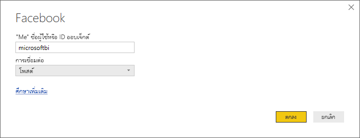
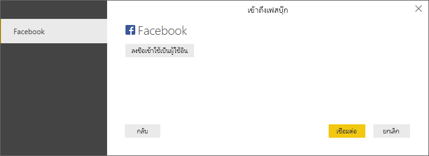
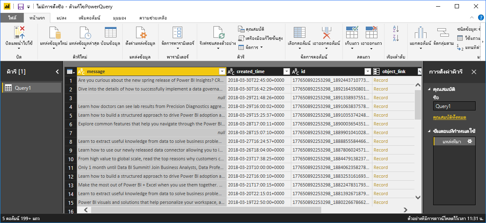
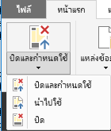
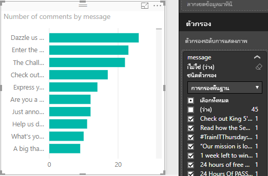

# บทช่วยสอน: วิเคราะห์ข้อมูล Facebook โดยใช้ Power BI DesktopTutorial: Analyze Facebook data by using Power BI Desktop

ในบทช่วยสอนนี้ คุณจะเรียนรู้วิธีการนำเข้าข้อมูลจาก Facebook และใช้ใน Power BI DesktopIn this tutorial, you learn how to import data from Facebook and use it in Power BI Desktop. คุณจะเชื่อมต่อและนำเข้าข้อมูลจากหน้า Facebook ของ Power BI ทำการแปลงข้อมูลนำเข้า และใช้ข้อมูลในการแสดงภาพรายงานYou'll connect and import data from the Power BI Facebook page, apply transformations to the imported data, and use the data in report visualizations.

> [!WARNING]
> เนื่องจากข้อจำกัดสิทธิ์ของแอป Facebook ความสามารถในการเชื่อมต่อที่อธิบายไว้ในบทความนี้ไม่ได้ทำงานอย่างถูกต้องในขณะนี้Due to Facebook App permission restrictions, the connector capabilities described in this article are not currently working properly. เรากำลังทำงานกับ Facebook เพื่อทำให้ฟังก์ชันการทำงานนี้สามารถใช้ได้โดยเร็วที่สุดเท่าที่เป็นไปได้We’re working with Facebook to return this functionality as soon as possible.

## เชื่อมต่อไปยังหน้า FacebookConnect to a Facebook page

บทช่วยสอนนี้ใช้ข้อมูลจาก[หน้า Facebook ของ Microsoft Power BI](https://www.facebook.com/microsoftbi)This tutorial uses data from the [Microsoft Power BI Facebook page](https://www.facebook.com/microsoftbi). คุณไม่จำเป็นใช้ข้อมูลประจำตัวใด ๆ เป็นพิเศษเพื่อเชื่อมต่อ และนำเข้าข้อมูลจากหน้านี้ ยกเว้นบัญชี Facebook ส่วนบุคคลYou don't need any special credentials to connect and import data from this page except for a personal Facebook account.

1. เปิด Power BI Desktop แล้วเลือก **รับข้อมูล** ในกล่องโต้ตอบ **เริ่มต้นใช้งาน** หรือในแท็บริบบิ้น **หน้าแรก** เลือก **รับข้อมูล** แล้วเลือก **เพิ่มเติม**Open Power BI Desktop and select **Get data** in the **Getting Started** dialog box, or in the **Home** ribbon tab, select **Get Data** and then select **More**.
   
2. ในกล่องโต้ตอบ **รับข้อมูล** เลือก **Facebook** จากกลุ่ม **บริการออนไลน์** จากนั้นเลือก **เชื่อมต่อ**In the **Get Data** dialog box, select **Facebook** from the **Online Services** group, and then select **Connect**.
   
   
   
   กล่องโต้ตอบจะปรากฏเพื่อแจ้งเตือนคุณว่า มีความเสี่ยงจากการใช้บริการของบริษัทอื่นA dialog box appears to alert you to the risks of using a third-party service.
   
   
   
3. เลือก **ดำเนินต่อ**Select **Continue**. 
   
4. ในกล่องโต้ตอบ **Facebook** ให้ป้อนชื่อหน้า **microsoftbi** เป็น **ชื่อผู้ใช้** เลือก **โพสต์** จากดรอปดาวน์ **การเชื่อมต่อ** จากนั้นเลือก **ตกลง**In the **Facebook** dialog box, enter the page name **microsoftbi** as the **user name**, select **Posts** from the **Connection** dropdown, and then select **OK**.
   
   
   
5. เมื่อได้รับพร้อมท์สำหรับข้อมูลประจำตัว ให้ลงชื่อเข้าใช้บัญชีผู้ใช้ Facebook ของคุณ และอนุญาตให้ Power BI เข้าถึงบัญชีของคุณWhen prompted for credentials, sign in to your Facebook account, and allow Power BI access to your account.
   
   

   หลังจากเชื่อมต่อไปยังหน้า Facebook ของ Power BI แล้ว คุณจะเห็นตัวอย่างของข้อมูลการโพสต์ของหน้าเพจAfter you connect to the Power BI Facebook page, you see a preview of the page's posts data. 
   
   
   
## จัดรูปทรง และแปลงข้อมูลนำเข้าShape and transform the imported data

สมมติว่าคุณต้องการเห็นและแสดงว่า โพสต์ไหนมีจำนวนความคิดเห็นมากที่สุดในแต่ละเวลา แต่คุณสังเกตเห็นในตัวอย่างข้อมูลการโพสต์ว่าข้อมูล **created_time** อ่านและเข้าใจยาก และขาดข้อมูลความคิดเห็นSuppose you want to see and show which posts have the most comments over time, but you notice in the posts data preview that the **created_time** data is hard to read and understand, and there's a lack of comments data. เมื่อต้องการดึงข้อมูลออกมาให้มากที่สุด คุณจำเป็นต้องดำเนินการจัดรูปทรง และทำความสะอาดข้อมูลTo pull the most out of it, perform some shaping and cleansing of the data. หากต้องการทำเช่นนั้น คุณสามารถใช้ตัวแก้ไข Power Queryใน Power BI Desktop เพื่อแก้ไขข้อมูล ก่อนหรือหลังการนำเข้าใน Power BI Desktop ได้To do so, use the Power BI Desktop Power Query Editor to edit the data, before or after importing it into Power BI Desktop. 

### แยกคอลัมน์ วันที่/เวลาSplit the date/time column

ก่อนอื่น แยกค่าวันที่และเวลาในคอลัมน์ **created_time** เพื่อให้อ่านได้ง่ายขึ้นFirst, separate the date and time values in the **created_time** column to be more readable. 

1. ในตัวอย่างข้อมูล Facebook เลือก **แก้ไข**In the Facebook data preview, select **Edit**. 
   
   
   
   ตัวแก้ไข Power Query ของ Power BI Desktop จะเปิดหน้าต่างใหม่ และแสดงตัวอย่างข้อมูลจากหน้า Facebook ของ Power BIThe Power BI Desktop Power Query Editor opens in a new window and displays the data preview from the Power BI Facebook page. 
   
   
   
2. เลือกคอลัมน์ **created_time**Select the **created_time** column. โปรดสังเกตว่า คอลัมน์เป็นข้อมูลชนิด **ข้อความ** ตามที่แสดงโดยไอคอน **ABC** ในส่วนหัวของคอลัมน์Notice that it's a **Text** data type, as denoted by an **ABC** icon in the column header. คลิกขวาที่ส่วนหัวและเลือก **แยกคอลัมน์** > **โดยตัวคั่น** ในรายการดรอปดาวน์Right-click the header and select **Split Column** > **By Delimiter** in the drop-down list. หรือเลือก **แยกคอลัมน์** > **โดยตัวคั่น** ภายใต้กลุ่ม **แปลง** ในแท็บ **หน้าแรก** ของริบบิ้นOr, select **Split Column** > **By Delimiter** under the **Transform** group in the **Home** tab of the ribbon.  
   
   
   
3. ในกล่องโต้ตอบ **แยกคอลัมน์ตามตัวคั่น** ให้เลือก **แบบกำหนดเอง** จากดรอปดาวน์ ใส่ **T** (ตัวอักษรที่เริ่มต้นส่วนเวลาของ **created_time**) ในเขตข้อมูลอินพุต และจากนั้นเลือก **ตกลง**In the **Split Column by Delimiter** dialog box, select **Custom** from the dropdown, enter **T** (the character that starts the time part of the **created_time** values) in the input field, and then select **OK**. 
   
   
   
   คอลัมน์จะแบ่งออกเป็นสองคอลัมน์ที่ประกอบด้วย สตริงก่อนและหลังตัวคั่น *T*The column splits into two columns that contain the strings before and after the *T* delimiter. คอลัมน์ใหม่มีชื่อว่า **created_time .1** และ **created_time 2** ตามลำดับThe new columns are named **created_time.1** and **created_time.2**, respectively. Power BI ตรวจสอบและเปลี่ยนชนิดข้อมูลเป็น **Date** สำหรับคอลัมน์แรก และ **Time** สำหรับคอลัมน์สองโดยอัตโนมัติ และจัดรูปแบบค่าวันที่และเวลาเพื่อให้อ่านง่ายขึ้นPower BI has automatically detected and changed the data types to **Date** for the first column and **Time** for the second column, and formatted the date and time values to be more readable.
   
4. เปลี่ยนชื่อสองคอลัมน์Rename the two columns. เลือกคอลัมน์ **created_time.1** จากนั้นเลือก **เปลี่ยนชื่อ** ในกลุ่ม **คอลัมน์ใดก็ได้** ของแท็บ **แปลง** ในริบบิ้นSelect the **created_time.1** column, and then select **Rename** in the **Any Column** group of the **Transform** tab in the ribbon. หรือดับเบิลคลิกที่ส่วนหัวของคอลัมน์แล้วป้อนชื่อคอลัมน์ใหม่เป็น **created_date**Or, double-click the column header and enter the new column name, **created_date**. ทำซ้ำสำหรับคอลัมน์ **created_time .2** และเปลี่ยนชื่อเป็น **created_time**Repeat for the **created_time.2** column, and rename it **created_time**.
   
   
   
### ขยายคอลัมน์ซ้อนกันExpand the nested column

ตอนนี้ข้อมูลวันที่และเวลาอยู่ในรูปแบบที่คุณต้องการแล้ว คุณสามารถเปิดเผยข้อมูลความคิดเห็นโดยการขยายคอลัมน์ที่ซ้อนกันได้Now that the date and time data are as you want them, you can expose comments data by expanding a nested column. 

1. เลือกไอคอน  ที่ด้านบนของคอลัมน์ **object_link** เพื่อเปิดกล่องโต้ตอบ **ขยาย/รวม**Select the  icon at the top of the **object_link** column to open the **Expand/Aggregate** dialog box. เลือก **connections** แล้วเลือก **ตกลง**Select **connections**, and then select **OK**. 
   
   
   
   ส่วนหัวของคอลัมน์เปลี่ยนไปเป็น **object_link.connections**The column heading changes to **object_link.connections**.
2. เลือกไอคอน  ที่ด้านบนของคอลัมน์ **object_link.connections** เลือก **ความคิดเห็น** แล้วเลือก **ตกลง**Select the  icon at the top of the **object_link.connections** column, select **comments**, and then select **OK**. ส่วนหัวของคอลัมน์เปลี่ยนไปเป็น **object_link.connections.comments**The column heading changes to **object_link.connections.comments**.
   
3. เลือกไอคอน  ที่ด้านบนของคอลัมน์ **object_link.connections.comments** และตอนนี้เลือก **รวม** แทนที่จะเป็น **ขยาย** ในกล่องโต้ตอบSelect the  icon at the top of the **object_link.connections.comments** column, and this time select **Aggregate** instead of **Expand** in the dialog box. เลือก **จำนวนของ id** แล้วเลือก **ตกลง**Select **# Count of id**, and then select **OK**. 
   
   
   
   ตอนนี้คอลัมน์แสดงจำนวนความคิดเห็นของแต่ละข้อความแล้วThe column now displays the number of comments for each message. 
   
4. เปลี่ยนชื่อคอลัมน์ **จำนวนของ object_link.connections.comments.id** เป็น **Number of comments**Rename the **Count of object_link.connections.comments.id** column to **Number of comments**.
   
5. เลือกลูกศรลงที่อยู่ถัดจากส่วนหัวของคอลัมน์ **Number of comments** และเลือก **เรียงลำดับจากมากไปน้อย** เพื่อดูโพสต์เรียงลำดับความคิดเห็น จากมากที่สุดไปน้อยที่สุดSelect the down arrow next to the **Number of comments** column header and select **Sort Descending** to see the posts sorted from most to fewest comments. 
   
   
   
### ตรวจสอบขั้นตอนคิวรีReview query steps

ขณะที่คุณจัดรูปทรงและแปลงข้อมูลใน **ตัวแก้ไข Power Query** แต่ละขั้นตอนจะถูกบันทึกไว้ในพื้นที่ของ **ขั้นตอนที่กำหนดใช้** ของบานหน้าต่าง **ตั้งค่าคิวรี** ทางด้านขวาของ ตัวแก้ไข Power QueryAs you shape and transform data in the Power Query Editor, each step is recorded in the **Applied Steps** area of the **Query Settings** pane at the right side of the **Power Query Editor** window. คุณสามารถย้อนกลับผ่าน **ขั้นตอนที่นำมาใช้** เพื่อดูการเปลี่ยนแปลงที่คุณทำ และแก้ไข ลบ หรือจัดเรียงใหม่ได้ถ้าจำเป็นYou can step back through the **Applied Steps** to see exactly what changes you made, and edit, delete, or rearrange them if necessary. ใช้ความระมัดระวังเมื่อปรับเปลี่ยนขั้นตอนเหล่านี้ เนื่องจากการเปลี่ยนแปลงขั้นตอนก่อนหน้านี้อาจทำให้ขั้นตอนในภายหลังเสียหายได้Use caution when modifying these steps, because changing preceding steps can break later steps. 

หลังจากใช้การแปลงข้อมูลจนถึงตอนนี้ **ขั้นตอนที่นำมาใช้** ของคุณควรปรากฏดังนี้:After applying the data transformations so far, your **Applied Steps** should appear as follows:
   
   
   
   >[!TIP]
   >**ขั้นตอนที่นำมาใช้** โดยพื้นฐานแล้วเป็นสูตรที่เขียนใน [ภาษาสูตร Power Query M](/powerquery-m/quick-tour-of-the-power-query-m-formula-language)Underlying the **Applied Steps** are formulas written in the [Power Query M formula language](/powerquery-m/quick-tour-of-the-power-query-m-formula-language). เมื่อต้องการดูและแก้ไขสูตร เลือก **เครื่องมือแก้ไขขั้นสูง** ในกลุ่ม **คิวรี** ของแท็บ **หน้าแรก** ของริบบอนTo see and edit the formulas, select **Advanced Editor** in the **Query** group of the **Home** tab of the ribbon. 

### นำเข้าข้อมูลที่ถูกแปลงImport the transformed data

เมื่อคุณพอใจกับข้อมูลแล้ว เลือก **ปิดและนำไปใช้** > **ปิดและนำไปใช้** ในแท็บ **หน้าแรก** ของริบบิ้นเพื่อนำเข้าไปใน Power BI DesktopWhen you're satisfied with the data, select **Close & Apply** > **Close & Apply** in the **Home** tab of the ribbon to import it into Power BI Desktop. 
   
   
   
   กล่องโต้ตอบแสดงความคืบหน้าของการโหลดข้อมูลลงในแบบจำลองข้อมูล Power BI DesktopA dialog box displays the progress of loading the data into the Power BI Desktop data model. 
   
   
   
   เมื่อโหลดข้อมูลแล้ว ข้อมูลจะปรากฏในมุมมอง **รายงาน** เป็นคิวรีใหม่ในบานหน้าต่าง **เขตข้อมูล**Once the data is loaded, it appears in the **Report** view as a new query in the **Fields** pane.
   
   
   
## ใช้ข้อมูลในการแสดงภาพรายงานUse the data in report visualizations 

ตอนนี้คุณได้นำเข้าข้อมูลจากหน้า Facebook แล้ว คุณสามารถรับข้อมูลเชิงลึกเกี่ยวกับข้อมูลคุณได้อย่างรวดเร็ว และง่ายดาย โดยใช้การแสดงภาพNow that you have imported data from the Facebook page, you can quickly and easily gain insights about your data by using visualizations. การสร้างการแสดงผลข้อมูลด้วยภาพเป็นเรื่องง่าย เพียงแค่เลือกเขตข้อมูล หรือลากจากบานหน้าต่าง **เขตข้อมูล** ลงในพื้นที่รายงานCreating a visualization is easy, just select a field or drag it from the **Fields** pane onto the report canvas.

### สร้างแผนภูมิแท่งCreate a bar chart

1. ในมุมมอง **รายงาน** Power BI Desktop ให้เลือก **ข้อความ** จากบานหน้าต่าง **เขตข้อมูล** หรือลากลงบนพื้นที่ทำงานIn Power BI Desktop **Report** view, select **message** from the **Fields** pane, or drag it onto the report canvas. ตารางแสดงโพสต์ข้อความทั้งหมดจะปรากฏบนพื้นที่ทำงานA table showing all post messages appears on the canvas. 
   
   
   
2. เมื่อเลือกตารางนั้นแล้ว ให้เลือก **จำนวนความคิดเห็น** จากบานหน้าต่าง **เขตข้อมูล** หรือลากลงในตารางWith that table selected, also select **Number of comments** from the **Fields** pane, or drag it into the table. 
   
3. เลือกไอคอน **แผนภูมิแท่งแบบเรียงซ้อน** ในบานหน้าต่าง **การแสดงผลข้อมูลด้วยภาพ**Select the **Stacked bar chart** icon in the **Visualizations** pane. ตารางจะเปลี่ยนเป็นแผนภูมิแท่ง แสดงจำนวนความคิดเห็นของแต่ละโพสต์The table changes to a bar chart showing the number of comments per post. 
   
   
   
4. เลือก **ตัวเลือกเพิ่มเติม** (...) ถัดจากการแสดงผลข้อมูลด้วยภาพ แล้วเลือก **เรียงตาม** > **จำนวนความคิดเห็น** เพื่อเรียงลำดับตารางตามจำนวนความคิดเห็น จากมากไปหาน้อยSelect **More options** (...) next to the visualization, and then select **Sort by** > **Number of comments** to sort the table by descending number of comments. 

   สังเกตว่า ความคิดเห็นจำนวนมากที่สุดถูกเชื่อมโยงกับข้อความ **(ว่าง)** (โพสต์เหล่านี้อาจเป็นเรื่องราว ลิงก์ วิดีโอ หรือเนื้อหาอื่นที่ไม่ใช่ข้อความ)Notice that the most comments were associated with **(Blank)** messages (these posts may have been stories, links, videos, or other non-text content). 
   
5. เมื่อต้องการกรองแถวที่ว่างออก เลือก **ข้อความคือ (ทั้งหมด)** จากบานหน้าต่าง **ตัวกรอง** เลือก **เลือกทั้งหมด** และจากนั้นเลือก **(ว่าง)** เพื่อยกเลิกการเลือกเฉพาะรายการนี้To filter out the blank rows, select **message is (All)** from the **Filters** pane, select **Select all**, and then select **(Blank)** to deselect it. 

   บานหน้าต่าง **ตัวกรอง** เปลี่ยนเป็น **ข้อความที่ไม่ใช่ (ว่าง)** และแถว **(ว่าง)** ได้หายไปจากการแสดงผลข้อมูลด้วยภาพแบบแผนภูมิThe **Filters** pane entry changes to **message is not (Blank)**, and the **(Blank)** row disappears from the chart visualization.
   
   
   
### จัดรูปแบบแผนภูมิFormat the chart

การแสดงภาพกำลังน่าสนใจมากขึ้น แต่คุณไม่สามารถมองเห็นข้อความส่วนใหญ่ในแผนภูมิThe visualization is getting more interesting, but you can't see much of the post text in the chart. เพื่อแสดงข้อความที่โพสต์ให้มากขึ้น:To show more of the post text:

1. ใช้การจัดการบนการแสดงผลข้อมูลด้วยภาพแบบแผนภูมิเพื่อปรับขนาดแผนภูมิให้มีขนาดใหญ่ที่สุดเท่าที่เป็นไปได้Use the handles on the chart visualization to resize the chart to be as large as possible. 
   
2. เมื่อเลือกแผนภูมิแล้ว ให้เลือกไอคอน **รูปแบบ** (ลูกกลิ้งทาสี) ในบานหน้าต่าง **การแสดงผลข้อมูลด้วยภาพ**With the chart selected, select the **Format** icon (paint roller) in the **Visualizations** pane.
   
3. เลือกลูกศรลงที่อยู่ถัดจาก **แกน Y** แล้วลากตัวเลื่อน **ขนาดสูงสุด** ไปทางด้านขวาจนสุด (**50%** )Select the down arrow next to **Y axis**, and drag the **Maximum size** slider all the way to the right (**50%**). 
4. ลด **ขนาดของข้อความ** ให้เหลือ **10 pt** เพื่อแสดงข้อความได้มากขึ้นReduce the **Text size** to **10 pt** to fit more text.
   
   
   
   แผนภูมิตอนนี้แสดงเนื้อหาของโพสต์มากขึ้นแล้วThe chart now shows more of the post content. 
   
   
   
แกน X (จำนวนความคิดเห็น) ของแผนภูมิไม่ได้แสดงค่าที่ชัดเจน และดูหลุดหายไปที่ด้านล่างของแผนภูมิThe x axis (number of comments) of the chart doesn't show exact values, and looks lost at the bottom of the chart. มาลองใช้ป้ายชื่อข้อมูลแทน:Let's use data labels instead: 

1. เลือกไอคอน **รูปแบบ** จากนั้นตั้งค่าตัวเลื่อนสำหรับ **แกน X** เป็น **ปิด**Select the **Format** icon, and then set the slider for **X axis** to **Off**. 
   
2. เลือกตัวเลื่อน **ป้ายชื่อข้อมูล** เป็น **เปิด**Select the **Data labels** slider to **On**. 

   ตอนนี้ แผนภูมิแสดงจำนวนความคิดเห็นของแต่ละโพสต์ที่ชัดเจนNow the chart shows the exact number of comments for each post.
   
   
   
### แก้ไขชนิดข้อมูลEdit the data type

นั่นดีขึ้นแล้ว แต่มีป้ายชื่อข้อมูลทั้งหมดมีจุดทศนิยม **.0** ซึ่งดูขัดตาและไม่ถูกต้อง เพราะ **จำนวนความคิดเห็น** จะต้องเป็นจำนวนเต็มThat's better, but all the data labels have a **.0** decimal place, which is distracting and misleading, because **Number of posts** must be a whole number. เพื่อแก้ไขปัญหาดังกล่าว คุณจำเป็นต้องเปลี่ยนชนิดข้อมูลของคอลัมน์ **จำนวนความคิดเห็น** ให้เป็น **จำนวนเต็ม**:To fix them, you need to change the data type of the **Number of posts** column to **Whole Number**:

1. คลิกขวา **Query1** ในบานหน้าต่าง **เขตข้อมูล** หรือวางเมาส์ไว้เหนือส่วนดังกล่าว และเลือก **ตัวเลือกเพิ่มเติม** (...)Right-click **Query1** in the **Fields** pane, or hover over it and select **More options** (...). 

2. จากเมนูบริบท ให้เลือก **แก้ไขคิวรี**From the context menu, select **Edit query**. หรือ เลือก **แก้ไขคิวรี** > **แก้ไขคิวรี** จากกลุ่ม **ข้อมูลภายนอก** ของแท็บ **หน้าแรก** ในริบบิ้นOr, select **Edit Queries** > **Edit Queries** from the **External data** group of the **Home** tab in the ribbon. 
   
3. จากหน้าต่าง **ตัวแก้ไข Power Query** ให้เลือกคอลัมน์ **จำนวนความคิดเห็น** และเปลี่ยนชนิดข้อมูลโดยทำตามหนึ่งในขั้นตอนต่อไปนี้:From the **Power Query Editor** window, select the **Number of comments** column, and change the data type by following one of these steps: 
   - เลือกไอคอน **1.2** ที่อยู่ถัดจากส่วนหัวของคอลัมน์ **Number of comments** และเลือก **จำนวนเต็ม** จากรายการดรอปดาวน์Select the **1.2** icon next to the **Number of comments** column header, and then select **Whole number** from the drop-down list
   - คลิกขวาที่ส่วนหัวของคอลัมน์ และเลือก **เปลี่ยนชนิด** > **จำนวนเต็ม**Right-click the column header, and then select **Change Type** > **Whole Number**.
   - เลือก **ชนิดข้อมูล: เลขทศนิยม** ในกลุ่ม **แปลง** ของแท็บ **หน้าแรก** หรือกลุ่ม **คอลัมน์ใดก็ตาม** ของแท็บ **แปลง** และจากนั้นเลือก **จำนวนเต็ม**Select **Data type: Decimal Number** in the **Transform** group of the **Home** tab, or in the **Any Column** group of the **Transform** tab, and then select **Whole Number**.
   
   ไอคอนในส่วนหัวของคอลัมน์เปลี่ยนไปเป็น **123** โดยแสดงถึงชนิดข้อมูล **จำนวนเต็ม**The icon in the column header changes to **123**, denoting a **Whole Number** data type.
   
   
   
3. เมื่อต้องใช้การเปลี่ยนแปลง ให้เลือก **ไฟล์** > **ปิดและนำไปใช้** หรือ **ไฟล์** > **นำไปใช้** เพื่อทำให้หน้าต่าง **ตัวแก้ไข Power Query** เปิดอยู่เสมอTo apply the changes, select **File** > **Close & Apply**, or **File** > **Apply** to keep the **Power Query Editor** window open. 

   หลังจากโหลดการเปลี่ยนแปลงแล้ว ป้ายชื่อข้อมูลบนแผนภูมิกลายเป็นจำนวนเต็มAfter the changes load, the data labels on the chart become whole numbers.
   
   
   
### สร้างตัวแบ่งส่วนข้อมูลวันที่Create a date slicer

สมมติว่าคุณต้องการแสดงภาพจำนวนความคิดเห็นบนโพสต์เทียบกับเวลาSuppose you want to visualize the number of comments on posts over time. คุณสามารถสร้างตัวแบ่งส่วนข้อมูล เพื่อกรองข้อมูลแผนภูมิที่ช่วงเวลาต่าง ๆ กันYou can create a slicer visualization to filter the chart data to different time frames. 

1. คลิกที่พื้นที่ว่างของพื้นที่ทำงาน จากนั้นเลือกไอคอน **ตัวแบ่งส่วนข้อมูล** ในบานหน้าต่าง **การแสดงผลข้อมูลด้วยภาพ**Select a blank area of the canvas, and then select the **Slicer** icon in the **Visualizations** pane. 

   ตัวแบ่งส่วนข้อมูลที่ว่างเปล่าจะปรากฏขึ้นA blank slicer visualization appears.
   
   
   
2. เลือกเขตข้อมูล **created_date** จากบานหน้าต่าง **เขตข้อมูล** หรือลากลงในตัวแบ่งส่วนข้อมูลใหม่Select the **created_date** field from the **Fields** pane, or drag it into the new slicer. 

   ตัวแบ่งส่วนข้อมูลเปลี่ยนเป็นแถบเลื่อนช่วงวันที่ โดยอิงตามชนิดข้อมูล **Date** ของเขตข้อมูลThe slicer changes to a date range slider, based on the field's **Date** data type.
   
   
   
3. ย้ายจุดจับตัวเลื่อน เพื่อเลือกช่วงวันที่แตกต่างกัน และสังเกตว่าแผนภูมิกรองข้อมูลอย่างไรMove the slider handles to select different date ranges, and note how the chart data filters accordingly. คุณยังสามารถเลือกเขตข้อมูลวันที่ในตัวแบ่งส่วนข้อมูล และพิมพ์ในวันที่ที่ต้องการ หรือเลือกจากปฏิทินที่ป็อปอัพYou can also select the date fields in the slicer and type in specific dates, or choose them from a calendar popup.
    
   
   
### จัดรูปแบบการแสดงภาพFormat the visualizations

ให้ชื่อที่สื่อความหมายและน่าดึงดูดยิ่งขึ้นแก่แผนภูมิ:Give the chart a more descriptive and attractive title: 

1. เมื่อเลือกแผนภูมิแล้ว ให้เลือกไอคอน **รูปแบบ** ในบานหน้าต่าง **การแสดงผลข้อมูลด้วยภาพ** จากนั้นเลือกลูกศรดรอปดาวน์ถัดจาก **ชื่อ** เพื่อขยายWith the chart selected, select the **Format** icon in the **Visualizations** pane, and then select the drop-down arrow next to **Title** to expand it.

2. การเปลี่ยนแปลง **ข้อความสำหรับชื่อเรื่อง** เมื่อต้องการ **จำนวนความคิดเห็นต่อโพสต์**Change the **Title text** to **Comments per post**. 

3. เลือกลูกศรดรอปดาวน์ที่อยู่ถัดจาก **สีแบบอักษร** และเลือกสีเขียวเพื่อให้ตรงกับแท่งสีเขียวของการแสดงผลข้อมูลด้วยภาพSelect the drop-down arrow next to **Font color**, and select a green color to match the green bars of the visualization.

4. เพิ่ม **ขนาดแบบอักษร** เป็น **10 pt** และเปลี่ยน **ตระกูลแบบอักษร** เป็น **Segoe (Bold)**Increase the **Text size** to **10 pt**, and change the **Font family** to **Segoe (Bold)**.

5. ทดลองตัวเลือกจัดรูปแบบและการตั้งค่าอื่น ๆ เพื่อปรับเปลี่ยนการแสดงภาพของคุณExperiment with other formatting options and settings to change the appearance of your visualizations. 

   

## สร้างการแสดงภาพเพิ่มเติมCreate more visualizations

คุณน่าจะเห็นแล้วว่า การปรับเปลี่ยนการแสดงภาพในรายงานของคุณ เพื่อนำเสนอข้อมูลในแบบที่คุณต้องการนั้น เป็นเรื่องง่ายAs you can see, it's easy to customize visualizations in your report to present the data in ways that you want. เพื่อเป็นตัวอย่าง ลองใช้ข้อมูลนำเข้าจาก Facebook เพื่อสร้างแผนภูมิเส้นที่แสดงจำนวนความคิดเห็นเทียบกับเวลาFor example, try using the imported Facebook data to create this line chart showing the number of comments over time.

Power BI Desktop ให้ประสบการณ์ที่ราบรื่น ตั้งแต่การรับข้อมูลจากแหล่งข้อมูลต่าง ๆ และจัดรูปทรงให้ตรงกับความต้องการการวิเคราะห์ของคุณ ไปจนถึงการแสดงข้อมูลนี้ในแบบที่สวยงามและโต้ตอบได้Power BI Desktop provides a seamless end-to-end experience, from getting data from a wide range of data sources and shaping it to meet your analysis needs, to visualizing this data in rich and interactive ways. เมื่อรายงานของคุณพร้อมแล้ว คุณสามารถ[อัปโหลดไปยังบริการของ Power BI](../create-reports/desktop-upload-desktop-files.md) และสร้างแดชบอร์ดจากรายงานเพื่อแชร์ให้กับผู้ใช้ Power BI อื่นได้When your report is ready, you can [upload it to the Power BI service](../create-reports/desktop-upload-desktop-files.md) and create dashboards based on it to share with other Power BI users.

## ขั้นตอนถัดไปNext steps
* [Microsoft Learn สำหรับ Power BIMicrosoft Learn for Power BI](/learn/powerplatform/power-bi?WT.mc_id=powerbi_landingpage-docs-link)
* [เยี่ยมชมกระดานสนทนา Power BIVisit the Power BI Forum](https://go.microsoft.com/fwlink/?LinkID=519326)
* [อ่านบล็อก Power BIRead the Power BI Blog](https://go.microsoft.com/fwlink/?LinkID=519327)