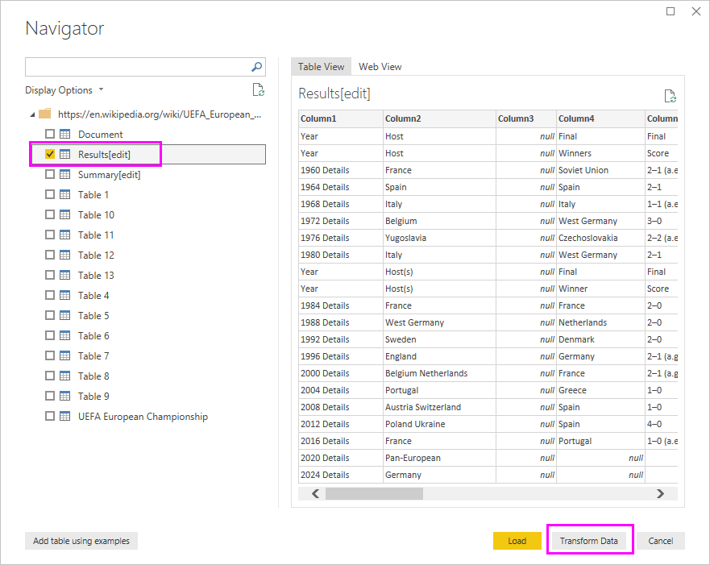
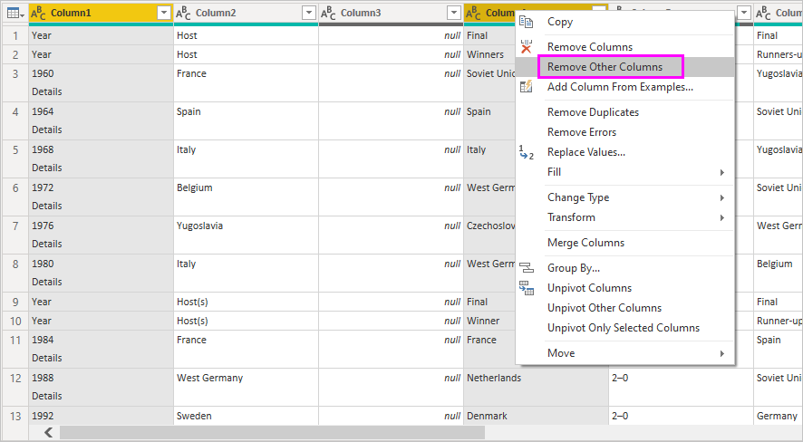
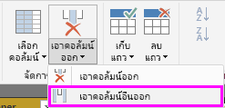
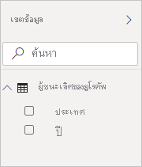
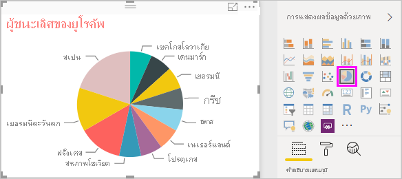

# บทช่วยสอน: วิเคราะห์ข้อมูลเว็บเพจโดยใช้ Power BI DesktopTutorial: Analyze webpage data by using Power BI Desktop

ในฐานะที่เป็นแฟนฟุตบอลมานาน คุณต้องการรายงานของแชมป์ ฟุตบอลชิงแชมป์แห่งชาติยุโรป (ถ้วยฟุตบอลยูโร) ในแต่ละปีAs a long-time soccer fan, you want to report on the UEFA European Championship (Euro Cup) winners over the years. ด้วย Power BI Desktop คุณสามารถนำเข้าข้อมูลนี้จากเว็บเพจลงในรายงาน และสร้างการแสดงภาพที่แสดงข้อมูลWith Power BI Desktop, you can import this data from a web page into a report and create visualizations that show the data. ในบทช่วยสอนนี้ คุณจะเรียนรู้วิธีการใช้ Power BI Desktop เพื่อ:In this tutorial, you learn how to use Power BI Desktop to:

- เชื่อมต่อแหล่งข้อมูลเว็ปและนำทางไปตารางที่ใช้ได้Connect to a web data source and navigate across its available tables.
- ทำรูปร่างและปรับเปลี่ยนข้อมูลใน Power Query EditorShape and transform data in the Power Query Editor.
- ตั้งชื่อแบบสอบถามและนำเข้าไปยังรายงาน Power BI DesktopName a query and import it into a Power BI Desktop report.
- สร้าง และกำหนดแผนที่และภาพแผนภูมิวงกลมCreate and customize a map and a pie chart visualization.

## เชื่อมต่อกับแหล่งข้อมูลบนเว็บConnect to a web data source

คุณสามารถรับข้อมูลแชมป์ UEFA จากตารางผลลัพธ์บนหน้า UEFA European Football Championship ของวิกิพีเดียที่ https://en.wikipedia.org/wiki/UEFA_European_Football_Championship ได้You can get the UEFA winners data from the Results table on the UEFA European Football Championship Wikipedia page at https://en.wikipedia.org/wiki/UEFA_European_Football_Championship. 

การเชื่อมต่อเว็ปเป็นการใช้สร้างเพียงการพิสูจน์ตัวตนเบื้องต้นWeb connections are only established using basic authentication. เว็บไซต์ที่จำเป็นต้องรับรองความถูกต้องอาจไม่ทำงานกับตัวเชื่อมต่อเว็บWeb sites requiring authentication may not work properly with the Web connector.

เพื่อนำเข้าข้อมูล:To import the data:

1. ใน Power BI Desktop แท็บ ribbon **หน้าแรก** ดรอปดาวน์ลูกศรที่อยู่ถัดจาก **รับข้อมูล** แล้วเลือก **เว็บ**In the Power BI Desktop **Home** ribbon tab, drop down the arrow next to **Get Data**, and then select **Web**.

    

   >[!NOTE]
   >คุณสามรถเลือกรายการ **รับข้อมูล** ด้วยตัวมันเองหรือเลือก **รับข้อมูล** จากกล่องโต้ตอบตอนเริ่ม Power BI Desktop แล้วเลือก **เว็ป** จากส่วน **ทั้งหมด** หรือ **อื่นๆ** ของการโต้ตอบ **รับข้อความ** จากนั้นเลือก **เชื่อมต่อ**You can also select the **Get Data** item itself, or select **Get Data** from the Power BI Desktop get started dialog, then select **Web** from the **All** or **Other** section of the **Get Data** dialog, and then select **Connect**.

1. ในการโต้ตอบ **จากเว็ป** ให้ใส่ URL `https://en.wikipedia.org/wiki/UEFA_European_Football_Championship` ไปในกล่องข้อความ **URL** จากนั้นเลือก **ตกลง**In the **From Web** dialog, paste the URL `https://en.wikipedia.org/wiki/UEFA_European_Football_Championship` into the **URL** text box, and then select **OK**.

    

   หลังจากการเชื่อมต่อไปยังหน้าเว็ป Wikipedi การโต้ตอบ **ตัวนำทาง** แสดงรายการของตารางที่มีอยู่ในหน้าดังกล่าวAfter connecting to the Wikipedia web page, the **Navigator** dialog shows a list of available tables on the page. คุณสามารถเลือกชื่อตารางใด ๆ เพื่อแสดงตัวอย่างของข้อมูลYou can select any of the table names to preview its data. ตาราง **ผล[แก้ไข]** มีข้อมูลที่คุณต้องการ แม้กระทั่งไม่ใช้ข้อมูลที่คุณต้องการด้วยซ้ำThe **Results[edit]** table has the data you want, although it's not exactly in the shape you want. คุณจะทำการเปลี่ยนรูปร่างและล้างข้อมูลก่อนการโหลดไปยังรายงานของคุณYou'll reshape and clean up the data before loading it into your report.

   

   >[!NOTE]
   >แผง **ตัวอย่าง** แสดงตารางที่เลือกปัจจุบันที่สุด แต่ตารางที่เลือกทั้งหมดจะโหลดไปยัง Power Query Editor เมื่อคุณเลือก **เปลี่ยนแปลงข้อมูล** หรือ **โหลด**The **Preview** pane shows the most recent table selected, but all selected tables will load into the Power Query Editor when you select **Transform Data** or **Load**.

1. เลือกตาราง **ผล[แก้ไข]** ในรายการ **ตัวนำทาง** แล้วเลือก **เปลี่ยนแปลงข้อมูล**Select the **Results[edit]** table in the **Navigator** list, and then select **Transform Data**.

   ตัวอย่างของตารางที่เปิดใน **Power Query Editor** ที่คุณจะสามารถใช้การเปลี่ยนรูปเพื่อล้างข้อมูลA preview of the table opens in **Power Query Editor**, where you can apply transformations to clean up the data.

   

## จัดรูปร่างข้อมูลในตัวแก้ไข Power QueryShape data in Power Query Editor

คุณต้องการทำให้ข้อมูลง่ายต่อการอ่าน โดยการแสดงเฉพาะปีและประเทศที่ชนะYou want to make the data easier to scan by displaying only the years and the countries that won. คุณสามารถใช้ Power Query Editorใช้ดำเนินการขั้นตอนการสร้างรูปร่างและล้างข้อมูลYou can use the Power Query Editor to perform these data shaping and cleansing steps.

สิ่งแรก ลบแถวทั้งหมดยกเว้นสองแถวจากตารางFirst, remove all the columns except for two from the table. เปลี่ยนชื่อแถวเป็น *ปี* และ *ประเทศ* ภายหลังกระบวนการRename these columns as *Year* and *Country* later in the process.

1. ในกริดของ **Power Query Editor** เลือกแถวIn the **Power Query Editor** grid, select the columns. เลือก Ctrl เพื่อเลือกหลายรายการSelect Ctrl to select multiple items.

1. คลิกขวาและเลือก **ลบแถวอื่น** หรือเลือก **ลบแถว** > **ลบแถวอื่น** จากกลุ่ม **จัดการแถว** ใน **หน้าแรก** แถบริบบิ้นเพื่อลบแถวอื่นทั้งหมดจากตารางRight-click and select **Remove Other Columns**, or select **Remove Columns** > **Remove Other Columns** from the **Manage Columns** group in the **Home** ribbon tab, to remove all other columns from the table.

   

   หรือor

   

ต่อไป ลบ *รายละเอียด* คำพิเศษจากเซลล์แถวแรกNext, remove the extra word *Details* from the first column cells.

1. เลือกแถวแรกSelect the first column.

1. คลิกขวาและเลือก **แทนที่ค่า** หรือเลืกอ **แทนที่ค่า** จากกลุ่ม **เปลี่ยนแปลง** ใน **หน้าหลัก** แถบของริบบิ้นRight-click, and select **Replace Values**, or select **Replace Values** from the **Transform** group in the **Home** tab of the ribbon. ตัวเลือกนี้ยังพบได้ในกลุ่ม **ทุกแถว** ในแถบ **เปลี่ยนแปลง**This option is also found in the **Any Column** group in the **Transform** tab.

    

   หรือor

   

1. ในการโต้ตอบ **แทนที่ค่า** ประเภท **รายละเอียด** ในกล่องข้อความของ **ค่าเพื่อการค้นหา** ออกจากกล่องข้อความ **แทนที่ด้วย** ที่ว่างเปล่า แล้วเลือก **ตกลง** เพื่อลบคำ *รายละเอียด* จากแถวIn the **Replace Values** dialog, type **Details** in the **Value To Find** text box, leave the **Replace With** text box empty, and then select **OK** to delete the word *Details* from this column.

   

บางเซลล์มีเพียงคำว่า "ปี" แทนที่ค่าปีSome cells contain only the word "Year" rather than year values. คุณสามารถกรองแถวเพื่อแสดงเพียงแถวที่ไม่มีคำว่า "ปี"You can filter the column to only display rows that don't contain the word "Year".

1. เลือกตัวกรองที่ลูกศรด้านล่างบนแถวSelect the filter drop-down arrow on the column.

1. ในเมนูด้านล่าง เลื่อนลงมาและลบกล่องเลือกข้างๆ ตัวเลือก **ปี** จากนั้นเลือก **ตกลง**In the drop-down menu, scroll down and clear the checkbox next to the **Year** option, and then select **OK**.

   

เมื่อคุณกำลังมองหาข้อมูลผู้ชนะที่สุดท้ายอยู่ตอนนี้ คุณสามารถเปลี่ยนชื่อแถวที่สองเป็น  **ประเทศ**Since you're only looking at the final winners data now, you can rename the second column to **Country**. เพื่อเปลี่ยนชื่อคอลัมน์:To rename the column:

1. คลิกสองครั้งหรือกดและค้างไว้ที่หัวข้อแถวที่สองหรือDouble-click or tap and hold in the second column header, or
   - คลิกขวามที่หัวข้อแถว และเลือก **เปลี่ยนชื่อ** หรือRight-click the column header, and select **Rename**, or
   - เลือกแถว\* และเลือก **เปลี่ยนชื่อ** จากกลุ่ม **ทุกแถว** ในแถบ **เปลี่ยนแปลง** ของริบบิ้นSelect the \*column and select **Rename** from the **Any Column** group in the **Transform** tab of the ribbon.

    
  
   หรือor

   

1. พิมพ์ **Country** ในส่วนหัวแล้วกด **Enter** เพื่อเปลี่ยนชื่อคอลัมน์Type **Country** in the header and press **Enter** to rename the column.

คุณยังต้องการกรองแถวเช่น "2020" ที่มีค่า null ในคอลัมน์ **Country**You also want to filter out rows like "2020" that have null values in the **Country** column. คุณสามารถใช้เมนูตัวกรอง เช่นเดียวกับที่คุณได้ทำกับค่า **Year** หรือคุณสามารถ:You could use the filter menu as you did with the **Year** values, or you can:

1. คลิกขวาบนเซลล์ **Country** ในแถว **2020** ซึ่งมีค่าเป็น *null*Right-click on the **Country** cell in the **2020** row, which has the value *null*.

1. เลือก **ตัวกรองข้อความ** > **ไม่เท่ากับ** ในเมนูบริบทเพื่อเอาแถวใด ๆ ที่ประกอบด้วยค่าของเซลล์ดังกล่าวออกSelect **Text Filters** > **Does not Equal** in the context menu to remove any rows that contain that cell's value.

   

## นำเข้าคิวรีลงในมุมมองรายงานImport the query into Report View

ตอนนี้คุณได้จัดรูปร่างข้อมูลตามที่คุณต้องการแล้ว คุณก็พร้อมที่จะตั้งชื่อคิวรีของคุณว่า "Euro Cup Winners" และนำเข้าข้อมูลลงในรายงานของคุณNow that you've shaped the data the way you want, you're ready to name your query "Euro Cup Winners" and import it into your report.

1. ในพื้นที่ **ตั้งค่าแบบสอบถาม** ในกล่องข้อความ **ชื่อ** ใส่ **ผู้ชนะถ้วยรางวัลยูโร**In the **Query Settings** pane, in the **Name** text box, enter **Euro Cup Winners**.

   

1. เลือก **ปิด & กำหนดใช้** > **ปิด & กำหนดใช้** จากแท็บ **หน้าแรก** ของ ribbonSelect **Close & Apply** > **Close & Apply** from the **Home** tab of the ribbon.

   

แบบสอบถามโหลดไปยังการแสดง *รายงาน* Power BI Desktop ที่คุณสามารถเห็นมันในแผง **เขตข้อมูล**The query loads into the Power BI Desktop *Report* view, where you can see it in the **Fields** pane.

   

>[!TIP]
>คุณสามารถได้รับ Power Query Editor คืนมาหรือแก้ไขและทำให้แบบสอบถามคุณดีขึ้นโดย:You can always get back to the Power Query Editor to edit and refine your query by:
>- การเลือก **ตัวเลือกที่มากกว่า** การละไว้  ( **...** ) ข้างๆ **ผู้ชนะถ้วยยุโรป** ในแผง **เขตข้อมูล** แล้วเลือก **แก้ไขแบบสอบถาม** หรือSelecting the **More options** ellipsis (**...**) next to **Euro Cup Winners** in the **Fields** pane, and selecting **Edit Query**, or
>- เลือก **แก้ไขคิวรี** > **แก้ไขคิวรี** ในกลุ่ม **ข้อมูลภายนอก** ของแท็บ ribbon **หน้าแรก** ในมุมมองรายงานSelecting **Edit Queries** > **Edit Queries** in the **External data** group of the **Home** ribbon tab in Report view. 

## สร้างการแสดงภาพCreate a visualization

เพื่อสร้างการแสดงภาพตามข้อมูลของคุณ:To create a visualization based on your data:

1. เลือกเขตข้อมูล **Country** ในบานหน้าต่าง **เขตข้อมูล** หรือลากเขตข้อมูลนี้ไปยังพื้นที่รายงานSelect the **Country** field in the **Fields** pane, or drag it to the report canvas. Power BI Desktop รู้จักข้อมูลว่าเป็นชื่อประเทศ และสร้างแสดงภาพ **แผนที่** โดยอัตโนมัติPower BI Desktop recognizes the data as country names, and automatically creates a **Map** visualization.

   

1. ขยายแผนที่ โดยการลากจุดจับที่มุมเพื่อให้ชื่อประเทศที่เป็นแชมป์ทั้งหมดมองเห็นได้Enlarge the map by dragging the handles in the corners so all the winning country names are visible.  

   

1. แผนที่แสดงจุดข้อมูลสำหรับทุกประเทศที่เคยได้แชมป์ฟุตบอลยูโรThe map shows identical data points for every country that won a Euro Cup tournament. เพื่อทำให้มีขนาดของแต่ละจุดข้อมูล แสดงจำนวนครั้งที่ประเทศได้แชมป์ ลากเขตข้อมูล **Year** ไปยัง **ลากเขตข้อมูลมาที่นี่** ภายใต้ **ขนาด** ในส่วนล่างของบานหน้าต่าง **การจัดรูปแบบการแสดงข้อมูล**To make the size of each data point reflect how often the country has won, drag the **Year** field to **Drag data fields here** under **Size** in the lower part of the **Visualizations** pane. เขตข้อมูลจะเปลี่ยนเป็นหน่วยวัด **นับจำนวน Year** โดยอัตโนมัติ และการแสดงภาพของแผนที่ตอนนี้แสดงจุดข้อมูลขนาดใหญ่ขึ้นสำหรับประเทศที่เป็นแชมป์มากกว่าThe field automatically changes to a **Count of Year** measure, and the map visualization now shows larger data points for countries that have won more tournaments.

   

## การแสดงภาพที่กำหนดด้วยตนเองCustomize the visualization

ตามที่คุณเห็น เป็นเรื่องง่ายมากที่จะสร้างการแสดงภาพจากข้อมูลของคุณAs you can see, it's very easy to create visualizations based on your data. นอกจากนี้ยังเป็นเรื่องง่ายในการกำหนดการแสดงภาพของคุณ ให้นำเสนอข้อมูลในแบบที่คุณต้องการได้ดียิ่งขึ้นIt's also easy to customize your visualizations to better present the data in ways that you want.

### จัดรูปแบบแผนที่Format the map

คุณสามารถเปลี่ยนลักษณะของการแสดงภาพโดยเลือกที่วิชวล แล้วเลือกไอคอน **รูปแบบ** (รูปลูกกลิ้งทาสี) ในบานหน้าต่าง **การจัดรูปแบบการแสดงข้อมูล** ได้You can change the appearance of a visualization by selecting it and then selecting the **Format** (paint roller) icon in the **Visualizations** pane. ตัวอย่างเช่น จุดข้อมูล "Germany" ในการแสดงภาพของคุณอาจทำให้เข้าใจผิดได้ เนื่องจากเยอรมนีตะวันตกชนะสองครั้ง และเยอรมนีชนะหนึ่งครั้ง และแผนที่แสดงเป็นจุดสองจุดซ้อนทับกัน แทนที่จะมาแยกหรือบวกเข้าด้วยกันFor example, the "Germany" data points in your visualization could be misleading, because West Germany won two tournaments and Germany won one, and the map superimposes the two points rather than separating or adding them together. คุณสามารถลงสีให้สองจุดนี้มีสีแตกต่างกันเพื่อเน้นตรงนี้You can color these two points differently to highlight this fact. คุณยังสามารถตั้งชื่อให้แผนที่ เพื่อให้สื่อความหมายและน่าสนใจมากขึ้นYou can also give the map a more descriptive and attractive title.

1. เลือกที่การแสดงภาพ แล้วเลือกไอคอน **รูปแบบ** จากนั้นเลือก **สีของข้อมูล** เพื่อขยายตัวเลือกสีของข้อมูลWith the visualization selected, select the **Format** icon, and then select **Data colors** to expand the data color options.

   

1. เปลี่ยนตัวเลือก **แสดงทั้งหมด** ให้เป็น **เปิด** จากนั้นเลือกรายการด้านล่างที่อยู่ถัดจาก **เยอรมนีตะวันตก** แล้วเลือกสีเหลืองTurn **Show all** to **On**, and then select the drop-down menu next to **West Germany** and choose a yellow color.

   

1. เลือก **ชื่อเรื่อง** เพื่อขยายตัวเลือกชื่อเรื่อง และในเขตข้อมูล **ข้อความสำหรับชื่อเรื่อง** พิมพ์ **Euro Cup Winners** แทนชื่อเรื่องปัจจุบันSelect **Title** to expand the title options, and in the **Title text** field, type **Euro Cup Winners** in place of the current title.

1. เปลี่ยน **สีแบบอักษร** เป็นสีแดง **ขนาดของข้อความ** เป็น **12** และ **ตระกูลแบบอักษร** เป็น **Segoe (Bold)**Change **Font color** to red, **Text size** to **12**, and **Font family** to **Segoe (Bold)**.

   

การแสดงภาพแผนที่ของคุณ ตอนนี้มีลักษณะดังนี้:Your map visualization now looks like this:

### การเปลี่ยนชนิดของการแสดงภาพChange the visualization type

คุณสามารถเปลี่ยนชนิดของการแสดงภาพ โดยเลือกที่ภาพดังกล่าว จากนั้น เลือกอีกไอคอนที่ด้านบนของแผง **การแสดงผลด้วยภาพ**You can change the type of a visualization by selecting it and then selecting a different icon at the top of the **Visualizations** pane. ตัวอย่างเช่น การแสดงภาพแผนที่ของคุณไม่มีข้อมูลสำหรับสหภาพโซเวียต และเชโกสโลวาเกีย เนื่องจากประเทศเหล่านั้นไม่มีอยู่บนแผนที่โลกอีกต่อไปFor example, your map visualization is missing the data for the Soviet Union and Czechoslovakia, because those countries no longer exist on the world map. การแสดงภาพอื่น เช่นแผนที่ต้นไม้ หรือแผนภูมิวงกลม อาจแม่นยำกว่าเนื่องจากจะแสดงทุกค่าAnother type of visualization like a treemap or pie chart may be more accurate, because it shows all the values.

เพื่อเปลี่ยนแผนที่ให้เป็นแผนภูมิวงกลม เลือกที่แผนที่ จากนั้นเลือกไอคอน **แผนภูมิวงกลม** ในแผง **การแสดงผลด้วยภาพ**To change the map to a pie chart, select the map and then select the **Pie chart** icon in the **Visualizations** pane.

>[!TIP]
>- คุณสามารถใช้ตัวเลือกการจัดรูปแบบ **สีข้อมูล** เพื่อทำให้ "Germany" และ "West Germany" เป็นสีเดียวกันYou can use the **Data colors** formatting options to make "Germany" and "West Germany" the same color. 
>- เพื่อจัดกลุ่มประเทศที่ได้แชมป์มากที่สุดไว้ด้วยกันบนแผนภูมิวงกลม เลือกที่การละไว้ ( **...** ) ที่มุมบนขวาของการแสดงผลด้วยภาพ จากนั้นเลือก **เรียงลำดับตามจำนวนของปี**To group the countries with the most wins together on the pie chart, select the ellipsis (**...**) at the upper right of the visualization, and then select **Sort by Count of Year**.

Power BI Desktop ให้ประสบการณ์ที่ราบรื่น ตั้งแต่การรับข้อมูลจากแหล่งข้อมูลต่าง ๆ และจัดรูปทรงให้ตรงกับความต้องการการวิเคราะห์ของคุณ ไปจนถึงการแสดงข้อมูลนี้ในแบบที่สวยงามและโต้ตอบได้Power BI Desktop provides a seamless end-to-end experience, from getting data from a wide range of data sources and shaping it to meet your analysis needs, to visualizing this data in rich and interactive ways. เมื่อรายงานของคุณพร้อมแล้ว คุณสามารถ[อัปโหลดไปยัง Power BI](../create-reports/desktop-upload-desktop-files.md)ได้ และสร้างแดชบอร์ดโดยยึดตามรายงานดังกล่าวที่คุณสามารถใช้ร่วมกันกับผู้ใช้ Power BI อื่นได้Once your report is ready, you can [upload it to Power BI](../create-reports/desktop-upload-desktop-files.md) and create dashboards based on it, which you can share with other Power BI users.

## อาจดูได้จากSee also

* [Microsoft Learn สำหรับ Power BIMicrosoft Learn for Power BI](/learn/powerplatform/power-bi?WT.mc_id=powerbi_landingpage-docs-link)
* [ดูวิดีโอ Power BI DesktopWatch Power BI Desktop videos](../fundamentals/desktop-videos.md)
* [เยี่ยมชมกระดานสนทนา Power BIVisit the Power BI Forum](https://go.microsoft.com/fwlink/?LinkID=519326)
* [อ่านบล็อก Power BIRead the Power BI Blog](https://go.microsoft.com/fwlink/?LinkID=519327)