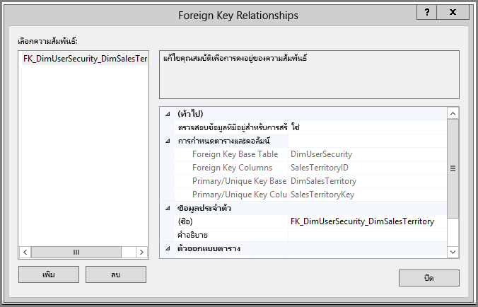
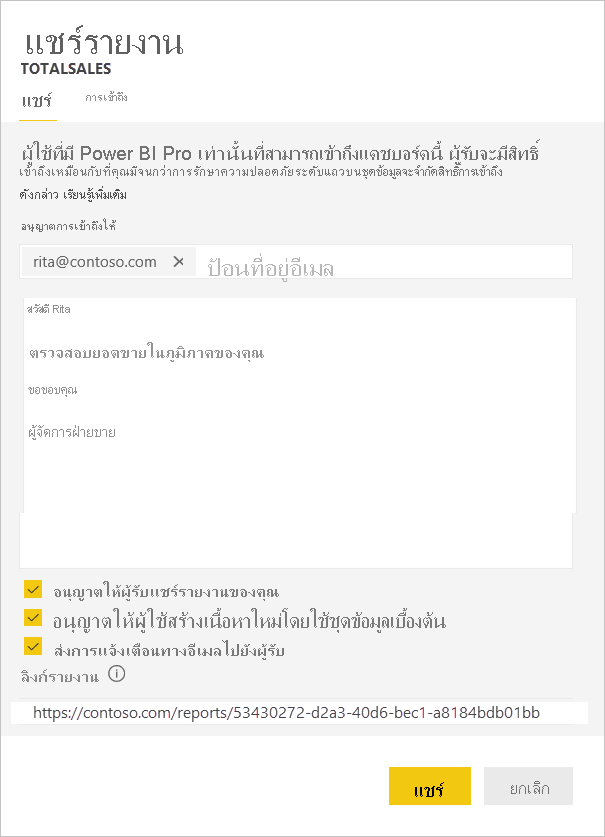

# <a name="implement-row-level-security-in-an-on-premises-analysis-services-tabular-model"></a><span data-ttu-id="293b1-103">ใช้การรักษาความปลอดภัยระดับแถวในแบบจำลองตาราง Analysis Services ภายในองค์กร</span><span class="sxs-lookup"><span data-stu-id="293b1-103">Implement row-level security in an on-premises Analysis Services tabular model</span></span>

<span data-ttu-id="293b1-104">ใช้ชุดข้อมูลตัวอย่างเพื่อทำงานผ่านขั้นตอนด้านล่าง บทช่วยสอนนี้จะแสดงวิธีใช้ [**ความปลอดภัยระดับแถว**](../admin/service-admin-rls.md)ใน *รูปแบบตาราง Analysis Services* ภายในองค์กรและใช้ในรายงาน Power BI</span><span class="sxs-lookup"><span data-stu-id="293b1-104">Using a sample dataset to work through the steps below, this tutorial shows you how to implement [**row-level security**](../admin/service-admin-rls.md) in an on-premises *Analysis Services Tabular Model* and use it in a Power BI report.</span></span>

* <span data-ttu-id="293b1-105">สร้างตารางความปลอดภัยใหม่ใน [ฐานข้อมูล AdventureworksDW2012](https://github.com/Microsoft/sql-server-samples/releases/tag/adventureworks)</span><span class="sxs-lookup"><span data-stu-id="293b1-105">Create a new security table in the [AdventureworksDW2012 database](https://github.com/Microsoft/sql-server-samples/releases/tag/adventureworks)</span></span>
* <span data-ttu-id="293b1-106">สร้างแบบจำลองแบบตารางด้วยตารางที่มีข้อเท็จจริงและมิติข้อมูลที่จำเป็น</span><span class="sxs-lookup"><span data-stu-id="293b1-106">Build the tabular model with necessary fact and dimension tables</span></span>
* <span data-ttu-id="293b1-107">กำหนดบทบาทและสิทธิ์ของผู้ใช้</span><span class="sxs-lookup"><span data-stu-id="293b1-107">Define user roles and permissions</span></span>
* <span data-ttu-id="293b1-108">ปรับใช้รูปแบบไปยังอินสแตนซ์ *ตาราง Analysis Services*</span><span class="sxs-lookup"><span data-stu-id="293b1-108">Deploy the model to an *Analysis Services tabular* instance</span></span>
* <span data-ttu-id="293b1-109">สร้างรายงาน Power BI Desktop ที่แสดงข้อมูลที่กำหนดให้เหมาะสมกับการเข้าถึงรายงานของผู้ใช้</span><span class="sxs-lookup"><span data-stu-id="293b1-109">Build a Power BI Desktop report that displays data tailored to the user accessing the report</span></span>
* <span data-ttu-id="293b1-110">ปรับใช้รายงานไปยัง *บริการของ Power BI*</span><span class="sxs-lookup"><span data-stu-id="293b1-110">Deploy the report to *Power BI service*</span></span>
* <span data-ttu-id="293b1-111">สร้างแดชบอร์ดใหม่ตามรายงาน</span><span class="sxs-lookup"><span data-stu-id="293b1-111">Create a new dashboard based on the report</span></span>
* <span data-ttu-id="293b1-112">แชร์แดชบอร์ดกับเพื่อนร่วมงานของคุณ</span><span class="sxs-lookup"><span data-stu-id="293b1-112">Share the dashboard with your coworkers</span></span>

<span data-ttu-id="293b1-113">บทช่วยสอนนี้จะต้องมี[ฐานข้อมูล AdventureworksDW2012](https://github.com/Microsoft/sql-server-samples/releases/tag/adventureworks)</span><span class="sxs-lookup"><span data-stu-id="293b1-113">This tutorial requires the [AdventureworksDW2012 database](https://github.com/Microsoft/sql-server-samples/releases/tag/adventureworks).</span></span>

## <a name="task-1-create-the-user-security-table-and-define-data-relationship"></a><span data-ttu-id="293b1-114">งานที่ 1: สร้างตารางความปลอดภัยของผู้ใช้และกำหนดความสัมพันธ์ข้อมูล</span><span class="sxs-lookup"><span data-stu-id="293b1-114">Task 1: Create the user security table and define data relationship</span></span>

<span data-ttu-id="293b1-115">คุณสามารถหาบทความมากมายที่อธิบายถึงวิธีกำหนดระดับการรักษาความปลอดภัยแบบไดนามิกระดับแถวด้วยรูปแบบ *ตาราง SQL Server Analysis Services (SSAS)*</span><span class="sxs-lookup"><span data-stu-id="293b1-115">You can find many articles describing how to define row-level dynamic security with the *SQL Server Analysis Services (SSAS) tabular* model.</span></span> <span data-ttu-id="293b1-116">สำหรับตัวอย่างของเรา เราใช้ [การใช้การรักษาความปลอดภัยแบบไดนามิกโดยใช้ตัวกรองแถว](/analysis-services/tutorial-tabular-1200/supplemental-lesson-implement-dynamic-security-by-using-row-filters)</span><span class="sxs-lookup"><span data-stu-id="293b1-116">For our sample, we use [Implement Dynamic Security by Using Row Filters](/analysis-services/tutorial-tabular-1200/supplemental-lesson-implement-dynamic-security-by-using-row-filters).</span></span>

<span data-ttu-id="293b1-117">ขั้นตอนต่าง ๆ ในส่วนนี้จะต้องใช้ฐานข้อมูลเชิงสัมพันธ์ AdventureworksDW2012</span><span class="sxs-lookup"><span data-stu-id="293b1-117">The steps here require using the AdventureworksDW2012 relational database.</span></span>

1. <span data-ttu-id="293b1-118">ใน AdventureworksDW2012 สร้างตาราง `DimUserSecurity` ตามที่แสดงด้านล่าง</span><span class="sxs-lookup"><span data-stu-id="293b1-118">In AdventureworksDW2012, create the `DimUserSecurity` table as shown below.</span></span> <span data-ttu-id="293b1-119">คุณสามารถใช้ [SQL Server Management Studio (SSMS)](/sql/ssms/download-sql-server-management-studio-ssms) เพื่อสร้างตาราง</span><span class="sxs-lookup"><span data-stu-id="293b1-119">You can use [SQL Server Management Studio (SSMS)](/sql/ssms/download-sql-server-management-studio-ssms) to create the table.</span></span>

   

1. <span data-ttu-id="293b1-121">หลังจากที่คุณสร้างและบันทึกตารางแล้ว คุณจำเป็นต้องสร้างความสัมพันธ์ระหว่างคอลัมน์ `SalesTerritoryID` ของตาราง `DimUserSecurity` และคอลัมน์ `SalesTerritoryKey` ของตาราง `DimSalesTerritory` ดังที่แสดงด้านล่าง</span><span class="sxs-lookup"><span data-stu-id="293b1-121">Once you create and save the table, you need to establish the relationship between the `DimUserSecurity` table's `SalesTerritoryID` column and the `DimSalesTerritory` table's `SalesTerritoryKey` column, as shown below.</span></span>

   <span data-ttu-id="293b1-122">ใน SSMS คลิกขวาที่ **DimUserSecurity** แล้วเลือก **การออกแบบ**</span><span class="sxs-lookup"><span data-stu-id="293b1-122">In SSMS, right-click **DimUserSecurity**, and select **Design**.</span></span> <span data-ttu-id="293b1-123">จากนั้นเลือก **ตัวออกแบบตาราง** > **ความสัมพันธ์...** เมื่อเสร็จสิ้น ให้บันทึกตาราง</span><span class="sxs-lookup"><span data-stu-id="293b1-123">Then select **Table Designer** > **Relationships...**. When done, save the table.</span></span>

   

1. <span data-ttu-id="293b1-125">เพิ่มผู้ใช้ไปที่ตาราง</span><span class="sxs-lookup"><span data-stu-id="293b1-125">Add users to the table.</span></span> <span data-ttu-id="293b1-126">คลิกขวาที่ **DimUserSecurity** และเลือก **แก้ไข 200 แถวยอดนิยม**</span><span class="sxs-lookup"><span data-stu-id="293b1-126">Right-click **DimUserSecurity** and select **Edit Top 200 Rows**.</span></span> <span data-ttu-id="293b1-127">หลังจากเพิ่มผู้ใช้แล้ว ตาราง `DimUserSecurity` ควรปรากฏในลักษณะที่คล้ายกับตัวอย่างต่อไปนี้:</span><span class="sxs-lookup"><span data-stu-id="293b1-127">Once you've added users, the `DimUserSecurity` table should appear similar to the following example:</span></span>

   

   <span data-ttu-id="293b1-129">เราจะเห็นผู้ใช้เหล่านี้ในงานที่กำลังจะเกิดขึ้น</span><span class="sxs-lookup"><span data-stu-id="293b1-129">You'll see these users in upcoming tasks.</span></span>

1. <span data-ttu-id="293b1-130">ถัดไป ดำเนินการ *การรวมภายใน* กับตาราง `DimSalesTerritory` ซึ่งจะแสดงรายละเอียดภูมิภาคที่เกี่ยวข้องกับผู้ใช้</span><span class="sxs-lookup"><span data-stu-id="293b1-130">Next, do an *inner join* with the `DimSalesTerritory` table, which shows the user associated region details.</span></span> <span data-ttu-id="293b1-131">รหัส SQL ที่นี่ใช้สำหรับการรวมภายใน และรูปภาพจะแสดงลักษณะการปรากฏของตาราง</span><span class="sxs-lookup"><span data-stu-id="293b1-131">The SQL code here does the inner join, and the image shows how the table then appears.</span></span>

    ```sql
    select b.SalesTerritoryCountry, b.SalesTerritoryRegion, a.EmployeeID, a.FirstName, a.LastName, a.UserName from [dbo].[DimUserSecurity] as a join [dbo].[DimSalesTerritory] as b on a.[SalesTerritoryID] = b.[SalesTerritoryKey]
    ```

   <span data-ttu-id="293b1-132">ตารางรวมจะแสดงบุคคลที่รับผิดชอบในแต่ละภูมิภาคการขาย ตามความสัมพันธ์ที่สร้างขึ้นในขั้นตอนที่ 2</span><span class="sxs-lookup"><span data-stu-id="293b1-132">The joined table shows who is responsible for each sales region, thanks to the relationship created in Step 2.</span></span> <span data-ttu-id="293b1-133">ตัวอย่างเช่น คุณสามารถดู *Rita Santos* ที่รับผิดชอบใน *ออสเตรเลีย* ได้</span><span class="sxs-lookup"><span data-stu-id="293b1-133">For example, you can see that *Rita Santos* is responsible for *Australia*.</span></span>

## <a name="task-2-create-the-tabular-model-with-facts-and-dimension-tables"></a><span data-ttu-id="293b1-134">งานที่ 2: สร้างแบบจำลองตารางด้วยตารางข้อเท็จจริงและมิติข้อมูล</span><span class="sxs-lookup"><span data-stu-id="293b1-134">Task 2: Create the tabular model with facts and dimension tables</span></span>

<span data-ttu-id="293b1-135">เมื่อคลังข้อมูลเชิงสัมพันธ์ของคุณเสร็จเรียบร้อยแล้ว คุณจะต้องกำหนดแบบจำลองตารางของคุณ</span><span class="sxs-lookup"><span data-stu-id="293b1-135">Once your relational data warehouse is in place, you need to define the tabular model.</span></span> <span data-ttu-id="293b1-136">คุณสามารถสร้างแบบจำลองได้โดยใช้ [SQL Server Data Tools](/sql/ssdt/sql-server-data-tools) (SSDT)</span><span class="sxs-lookup"><span data-stu-id="293b1-136">You can create the model using [SQL Server Data Tools](/sql/ssdt/sql-server-data-tools) (SSDT).</span></span> <span data-ttu-id="293b1-137">สำหรับข้อมูลเพิ่มเติม โปรดดูที่[สร้างโครงการแบบจำลองตารางใหม่](/analysis-services/tutorial-tabular-1400/as-lesson-1-create-a-new-tabular-model-project)</span><span class="sxs-lookup"><span data-stu-id="293b1-137">For more information, see [Create a New Tabular Model Project](/analysis-services/tutorial-tabular-1400/as-lesson-1-create-a-new-tabular-model-project).</span></span>

1. <span data-ttu-id="293b1-138">นำเข้าตารางที่จำเป็นทั้งหมดลงในแบบจำลอง ดังที่แสดงด้านล่าง</span><span class="sxs-lookup"><span data-stu-id="293b1-138">Import all the necessary tables into the model as shown below.</span></span>

    

1. <span data-ttu-id="293b1-140">เมื่อคุณนำเข้าตารางที่จำเป็น คุณต้องกำหนดบทบาทที่เรียกว่า *SalesTerritoryUsers* ที่มีสิทธิ์แบบอ่าน</span><span class="sxs-lookup"><span data-stu-id="293b1-140">Once you've imported the necessary tables, you need to define a role called *SalesTerritoryUsers* with Read permission.</span></span> <span data-ttu-id="293b1-141">เลือกเมนู **แบบจำลอง** ใน SQL Server Data Tools แล้วเลือก **บทบาท**</span><span class="sxs-lookup"><span data-stu-id="293b1-141">Select the **Model** menu in SQL Server Data Tools, and then select **Roles**.</span></span> <span data-ttu-id="293b1-142">ใน **ตัวจัดการบทบาท** เลือก **ใหม่**</span><span class="sxs-lookup"><span data-stu-id="293b1-142">In **Role Manager**, select **New**.</span></span>

1. <span data-ttu-id="293b1-143">ใต้ **สมาชิก** ใน **ตัวจัดการบทบาท** ให้เพิ่มผู้ใช้ที่คุณกำหนดไว้ในตาราง `DimUserSecurity` ใน [งาน 1](#task-1-create-the-user-security-table-and-define-data-relationship)</span><span class="sxs-lookup"><span data-stu-id="293b1-143">Under **Members** in the **Role Manager**, add the users that you defined in the `DimUserSecurity` table in [Task 1](#task-1-create-the-user-security-table-and-define-data-relationship).</span></span>

    

1. <span data-ttu-id="293b1-145">ถัดไป เพิ่มฟังก์ชันที่ถูกต้องสำหรับตาราง `DimSalesTerritory` และ`DimUserSecurity` ตามที่แสดงด้านล่าง ใต้แท็บ **ตัวกรองแถว**</span><span class="sxs-lookup"><span data-stu-id="293b1-145">Next, add the proper functions for both `DimSalesTerritory` and `DimUserSecurity` tables, as shown below under **Row Filters** tab.</span></span>

    

1. <span data-ttu-id="293b1-147">ฟังก์ชัน `LOOKUPVALUE` จะแสดงค่าสำหรับคอลัมน์ที่ชื่อผู้ใช้ Windows ตรงกับรายการที่ฟังก์ชัน `USERNAME` แสดงผล</span><span class="sxs-lookup"><span data-stu-id="293b1-147">The `LOOKUPVALUE` function returns values for a column in which the Windows user name matches the one the `USERNAME` function returns.</span></span> <span data-ttu-id="293b1-148">จากนั้น คุณจะสามารถจำกัดคิวรีเป็นตำแหน่งที่ค่าที่แสดง `LOOKUPVALUE` ตรงกับรายการในตารางเดียวกันหรือตารางที่เกี่ยวข้อง</span><span class="sxs-lookup"><span data-stu-id="293b1-148">You can then restrict queries to where the `LOOKUPVALUE` returned values match ones in the same or related table.</span></span> <span data-ttu-id="293b1-149">ในคอลัมน์ **ตัวกรอง DAX** ให้พิมพ์สูตรต่อไปนี้:</span><span class="sxs-lookup"><span data-stu-id="293b1-149">In the **DAX Filter** column, type the following formula:</span></span>

    ```dax
        =DimSalesTerritory[SalesTerritoryKey]=LOOKUPVALUE(DimUserSecurity[SalesTerritoryID], DimUserSecurity[UserName], USERNAME(), DimUserSecurity[SalesTerritoryID], DimSalesTerritory[SalesTerritoryKey])
    ```

    <span data-ttu-id="293b1-150">ในสูตรนี้ ฟังก์ชัน `LOOKUPVALUE` จะแสดงค่าทั้งหมดสำหรับคอลัมน์ `DimUserSecurity[SalesTerritoryID]` ที่ซึ่ง `DimUserSecurity[UserName]` ตรงกับรายการปัจจุบันที่เข้าสู่ระบบด้วยชื่อผู้ใช้ Windows และ `DimUserSecurity[SalesTerritoryID]` เหมือนกับ `DimSalesTerritory[SalesTerritoryKey]`</span><span class="sxs-lookup"><span data-stu-id="293b1-150">In this formula, the `LOOKUPVALUE` function returns all values for the `DimUserSecurity[SalesTerritoryID]` column, where the `DimUserSecurity[UserName]` is the same as the current logged on Windows user name, and `DimUserSecurity[SalesTerritoryID]` is the same as the `DimSalesTerritory[SalesTerritoryKey]`.</span></span>

    > [!IMPORTANT]
    > <span data-ttu-id="293b1-151">เมื่อใช้ความปลอดภัยระดับแถว ระบบจะไม่รองรับ [USERELATIONSHIP](/dax/userelationship-function-dax) ของฟังก์ชัน DAX</span><span class="sxs-lookup"><span data-stu-id="293b1-151">When using row-level security, the DAX function [USERELATIONSHIP](/dax/userelationship-function-dax) is not supported.</span></span>

   <span data-ttu-id="293b1-152">ชุดค่าที่ส่งกลับของยอดขาย`SalesTerritoryKey``LOOKUPVALUE`จะถูกใช้เพื่อจำกัดแถวที่แสดงใน `DimSalesTerritory`</span><span class="sxs-lookup"><span data-stu-id="293b1-152">The set of Sales `SalesTerritoryKey`'s `LOOKUPVALUE` returns is then used to restrict the rows shown in the `DimSalesTerritory`.</span></span> <span data-ttu-id="293b1-153">เฉพาะแถวที่ค่า `SalesTerritoryKey` อยู่ใน ID เท่านั้นที่ฟังก์ชัน `LOOKUPVALUE` จะแสดงผลลัพธ์</span><span class="sxs-lookup"><span data-stu-id="293b1-153">Only rows where the `SalesTerritoryKey` value is in the IDs that the `LOOKUPVALUE` function returns are displayed.</span></span>

1. <span data-ttu-id="293b1-154">สำหรับตาราง `DimUserSecurity` ในคอลัมน์ **ตัวกรอง DAX** ให้เพิ่มสูตรต่อไปนี้:</span><span class="sxs-lookup"><span data-stu-id="293b1-154">For the `DimUserSecurity` table, in the **DAX Filter** column, add the following formula:</span></span>

    ```dax
        =FALSE()
    ```

    <span data-ttu-id="293b1-155">สูตรนี้ระบุว่า คอลัมน์ทั้งหมดจะแก้ไข `false` ซึ่งหมายความว่าคอลัมน์ตาราง `DimUserSecurity` ไม่สามารถสอบถามได้</span><span class="sxs-lookup"><span data-stu-id="293b1-155">This formula specifies that all columns resolve to `false`; meaning `DimUserSecurity` table columns can't be queried.</span></span>

<span data-ttu-id="293b1-156">ตอนนี้ คุณจะต้องประมวลผลและปรับใช้แบบจำลอง</span><span class="sxs-lookup"><span data-stu-id="293b1-156">Now you need to process and deploy the model.</span></span> <span data-ttu-id="293b1-157">สำหรับข้อมูลเพิ่มเติม ดูที่ [ปรับใช้](/analysis-services/tutorial-tabular-1200/lesson-13-deploy)</span><span class="sxs-lookup"><span data-stu-id="293b1-157">For more information, see [Deploy](/analysis-services/tutorial-tabular-1200/lesson-13-deploy).</span></span>

## <a name="task-3-add-data-sources-within-your-on-premises-data-gateway"></a><span data-ttu-id="293b1-158">งานที่ 3: เพิ่มแหล่งข้อมูลภายในเกตเวย์ข้อมูลในองค์กรของคุณ</span><span class="sxs-lookup"><span data-stu-id="293b1-158">Task 3: Add Data Sources within your On-premises data gateway</span></span>

<span data-ttu-id="293b1-159">เมื่อแบบจำลองแบบตารางของคุณมีการปรับใช้ และพร้อมสำหรับการใช้ คุณต้องเพิ่มการเชื่อมต่อแหล่งข้อมูลไปยังเซิร์ฟเวอร์ Analysis Services แบบตารางในองค์กร</span><span class="sxs-lookup"><span data-stu-id="293b1-159">Once your tabular model is deployed and ready for consumption, you need to add a data source connection to your on-premises Analysis Services tabular server.</span></span>

1. <span data-ttu-id="293b1-160">เพื่อให้บริการของ Power BI สามารถเข้าถึงบริการการวิเคราะห์ของคุณในสถานที่ คุณจะต้องติดตั้ง [เกตเวย์ข้อมูลภายในองค์กร](service-gateway-onprem.md) และกำหนดค่าในสภาพแวดล้อมของคุณ</span><span class="sxs-lookup"><span data-stu-id="293b1-160">To allow the Power BI service access to your on-premises analysis service, you need an [on-premises data gateway](service-gateway-onprem.md) installed and configured in your environment.</span></span>

1. <span data-ttu-id="293b1-161">เมื่อเกตเวย์ได้รับการกำหนดค่าอย่างถูกต้อง คุณต้องสร้างการเชื่อมต่อแหล่งข้อมูลสำหรับอินสแตนซ์ของตาราง *Analysis Services* ของคุณ</span><span class="sxs-lookup"><span data-stu-id="293b1-161">Once the gateway is correctly configured, you need to create a data source connection for your *Analysis Services* tabular instance.</span></span> <span data-ttu-id="293b1-162">สำหรับข้อมูลเพิ่มเติม โปรดดูที่ [จัดการแหล่งข้อมูลของคุณ - Analysis Services](service-gateway-enterprise-manage-ssas.md)</span><span class="sxs-lookup"><span data-stu-id="293b1-162">For more information, see [Manage your data source - Analysis Services](service-gateway-enterprise-manage-ssas.md).</span></span>

   

<span data-ttu-id="293b1-164">เมื่อขั้นตอนนี้เสร็จสมบูรณ์ เกตเวย์จะถูกกำหนดค่าและพร้อมสำหรับการโต้ตอบ กับแหล่งข้อมูล Analysis Services ในองค์กรของคุณ</span><span class="sxs-lookup"><span data-stu-id="293b1-164">With this procedure complete, the gateway is configured and ready to interact with your on-premises Analysis Services data source.</span></span>

## <a name="task-4-create-report-based-on-analysis-services-tabular-model-using-power-bi-desktop"></a><span data-ttu-id="293b1-165">งานที่ 4: สร้างรายงานที่ยึดตามรูปแบบตารางข้อมูล Analysis Services โดยใช้ Power BI desktop</span><span class="sxs-lookup"><span data-stu-id="293b1-165">Task 4: Create report based on analysis services tabular model using Power BI desktop</span></span>

1. <span data-ttu-id="293b1-166">เปิดใช้งาน Power BI Desktop และเลือก **รับข้อมูล** > **ฐานข้อมูล**</span><span class="sxs-lookup"><span data-stu-id="293b1-166">Start Power BI Desktop and select **Get Data** > **Database**.</span></span>

1. <span data-ttu-id="293b1-167">จากรายการแหล่งข้อมูล ให้เลือก **ฐานข้อมูล SQL Server Analysis Services** และเลือก **เชื่อมต่อ**</span><span class="sxs-lookup"><span data-stu-id="293b1-167">From the data sources list, select the **SQL Server Analysis Services Database** and select **Connect**.</span></span>

   

1. <span data-ttu-id="293b1-169">กรอกรายละเอียดอินสแตนซ์ของ Analysis Services แบบตาราง และเลือก **เชื่อมต่อแบบไลฟ์**</span><span class="sxs-lookup"><span data-stu-id="293b1-169">Fill in your Analysis Services tabular instance details and select **Connect live**.</span></span> <span data-ttu-id="293b1-170">จากนั้นเลือก **ตกลง**</span><span class="sxs-lookup"><span data-stu-id="293b1-170">Then select **OK**.</span></span>
  
   

   <span data-ttu-id="293b1-172">ด้วย Power BI การรักษาความปลอดภัยแบบไดนามิกจะใช้ได้เฉพาะกับการเชื่อมต่อแบบไลฟ์เท่านั้น</span><span class="sxs-lookup"><span data-stu-id="293b1-172">With Power BI, dynamic security works only with a live connection.</span></span>

1. <span data-ttu-id="293b1-173">คุณสามารถมองเห็นว่าแบบจำลองที่ปรับใช้อยู่ในอินสแตนซ์ Analysis Services</span><span class="sxs-lookup"><span data-stu-id="293b1-173">You can see that the deployed model is in the Analysis Services instance.</span></span> <span data-ttu-id="293b1-174">เลือกแบบจำลองที่เกี่ยวข้อง แล้วเลือก **ตกลง**</span><span class="sxs-lookup"><span data-stu-id="293b1-174">Select the respective model and then select **OK**.</span></span>

   <span data-ttu-id="293b1-175">ขณะนี้ Power BI Desktop จะแสดงเขตข้อมูลทั้งหมดที่พร้อมใช้งาน ทางด้านขวาของพื้นที่ทำงานในบานหน้าต่าง **เขตข้อมูล**</span><span class="sxs-lookup"><span data-stu-id="293b1-175">Power BI Desktop now displays all the available fields, to the right of the canvas in the **Fields** pane.</span></span>

1. <span data-ttu-id="293b1-176">ในบานหน้าต่าง **เขตข้อมูล** ให้เลือกการวัด **SalesAmount** จากตาราง **FactInternetSales** และมิติ **SalesTerritoryRegion** จากตาราง **SalesTerritory**</span><span class="sxs-lookup"><span data-stu-id="293b1-176">In the **Fields** pane, select the **SalesAmount** measure from the **FactInternetSales** table and the **SalesTerritoryRegion** dimension from the **SalesTerritory** table.</span></span>

1. <span data-ttu-id="293b1-177">เพื่อเก็บรายงานนี้อย่างง่ายๆ เราจะไม่เพิ่มคอลัมน์ใดๆ อีกในตอนนี้</span><span class="sxs-lookup"><span data-stu-id="293b1-177">To keep this report simple, we won't add any more columns right now.</span></span> <span data-ttu-id="293b1-178">เมื่อต้องการแสดงสื่อความหมายของข้อมูลให้มากขึ้น คุณสามารถเปลี่ยนการแสดงภาพเป็น **แผนภูมิโดนัท**</span><span class="sxs-lookup"><span data-stu-id="293b1-178">To have a more meaningful data representation, change the visualization to **Donut chart**.</span></span>

   

1. <span data-ttu-id="293b1-180">เมื่อรายงานของคุณพร้อมแล้ว คุณสามารถเผยแพร่ไปยังพอร์ทัล Power BI ได้โดยตรง</span><span class="sxs-lookup"><span data-stu-id="293b1-180">Once your report is ready, you can directly publish it to the Power BI portal.</span></span> <span data-ttu-id="293b1-181">จาก Ribbon ของ **หน้าแรก** ใน Power BI Desktop ให้เลือก **เผยแพร่**</span><span class="sxs-lookup"><span data-stu-id="293b1-181">From the **Home** ribbon in Power BI Desktop, select **Publish**.</span></span>

## <a name="task-5-create-and-share-a-dashboard"></a><span data-ttu-id="293b1-182">งานที่ 5: สร้างและแชร์แดชบอร์ด</span><span class="sxs-lookup"><span data-stu-id="293b1-182">Task 5: Create and share a dashboard</span></span>

<span data-ttu-id="293b1-183">คุณได้สร้างรายงานและเผยแพร่ไปยังบริการของ **Power BI**</span><span class="sxs-lookup"><span data-stu-id="293b1-183">You've created the report and published it to the **Power BI** service.</span></span> <span data-ttu-id="293b1-184">ตอนนี้ คุณสามารถใช้ตัวอย่างที่สร้างขึ้นในขั้นตอนก่อนหน้าเพื่อสาธิตสถานการณ์ด้านการรักษาความปลอดภัยของแบบจำลอง</span><span class="sxs-lookup"><span data-stu-id="293b1-184">Now you can use the example created in previous steps to demonstrate the model security scenario.</span></span>

<span data-ttu-id="293b1-185">ในบทบาทของ *ผู้จัดการฝ่ายขาย* ผู้ใช้ เกรซสามารถดูข้อมูลได้จากทุกภูมิภาคการขาย</span><span class="sxs-lookup"><span data-stu-id="293b1-185">In the role as *Sales Manager*, the user Grace can see data from all the different sales regions.</span></span> <span data-ttu-id="293b1-186">เกรซได้สร้างรายงานและเผยแพร่ไปยังบริการของ Power BI</span><span class="sxs-lookup"><span data-stu-id="293b1-186">Grace creates this report and publishes it to the Power BI service.</span></span> <span data-ttu-id="293b1-187">รายงานนี้ถูกสร้างขึ้นในงานก่อนหน้านี้</span><span class="sxs-lookup"><span data-stu-id="293b1-187">This report was created in the previous tasks.</span></span>

<span data-ttu-id="293b1-188">เมื่อเกรซเผยแพร่รายงาน ขั้นตอนต่อไปคือการสร้างแดชบอร์ดในบริการของ Power BI ซึ่งเรียกว่า *TabularDynamicSec* โดยอิงกับรายงานนั้น</span><span class="sxs-lookup"><span data-stu-id="293b1-188">Once Grace publishes the report, the next step is to create a dashboard in the Power BI service called *TabularDynamicSec* based on that report.</span></span> <span data-ttu-id="293b1-189">ในภาพต่อไปนี้ โปรดสังเกตว่าเกรซสามารถดูข้อมูลที่เกี่ยวข้องกับภูมิภาคการขายทั้งหมดได้</span><span class="sxs-lookup"><span data-stu-id="293b1-189">In the following image, notice that Grace can see the data corresponding to all the sales region.</span></span>

   

<span data-ttu-id="293b1-191">ตอนนี้ เกรซแชร์แดชบอร์ดกับเพื่อนร่วมงาน ริต้าซึ่งเป็นผู้รับผิดชอบการขายในภูมิภาคออสเตรเลีย</span><span class="sxs-lookup"><span data-stu-id="293b1-191">Now Grace shares the dashboard with a colleague, Rita, who is responsible for the Australia region sales.</span></span>

   

<span data-ttu-id="293b1-193">เมื่อริต้าลงชื่อเข้าใช้บริการของ Power BI และดูหน้าแดชบอร์ดที่แชร์ซึ่งเกรซสร้างไว้ เธอควรเห็นเฉพาะยอดขายจากภูมิภาคออสเตรเลียเท่านั้น</span><span class="sxs-lookup"><span data-stu-id="293b1-193">When Rita logs in to the Power BI service and views the shared dashboard that Grace created, only sales from the Australia region are visible.</span></span>

<span data-ttu-id="293b1-194">ยินดีด้วย!</span><span class="sxs-lookup"><span data-stu-id="293b1-194">Congratulations!</span></span> <span data-ttu-id="293b1-195">บริการของ Power BI จะแสดงความปลอดภัยระดับแถวแบบไดนามิกแบบจำลองแบบตาราง Analysis Services ในองค์กร</span><span class="sxs-lookup"><span data-stu-id="293b1-195">The Power BI service shows the dynamic row-level security defined in the on-premises Analysis Services tabular model.</span></span> <span data-ttu-id="293b1-196">Power BI ใช้คุณสมบัติ `EffectiveUserName` เพื่อส่งข้อมูลประจำตัวผู้ใช้ Power BI ปัจจุบันไปยังแหล่งข้อมูลในองค์กรเพื่อเรียกใช้คิวรี</span><span class="sxs-lookup"><span data-stu-id="293b1-196">Power BI uses the `EffectiveUserName` property to send the current Power BI user credential to the on-premises data source to run the queries.</span></span>

## <a name="task-6-understand-what-happens-behind-the-scenes"></a><span data-ttu-id="293b1-197">งานที่ 6: ทำความเข้าใจกับสิ่งที่เกิดขึ้นเบื้องหลัง</span><span class="sxs-lookup"><span data-stu-id="293b1-197">Task 6: Understand what happens behind the scenes</span></span>

<span data-ttu-id="293b1-198">งานนี้อนุมานว่าคุณคุ้นเคยกับ [SQL Server Profiler](/sql/tools/sql-server-profiler/sql-server-profiler) เนื่องจากคุณจำเป็นต้องจับภาพการติดตาม SQL Server profiler ในอินสแตนซ์ตารางแบบ SSAS ในองค์กรของคุณ</span><span class="sxs-lookup"><span data-stu-id="293b1-198">This task assumes you're familiar with [SQL Server Profiler](/sql/tools/sql-server-profiler/sql-server-profiler), since you need to capture a SQL Server profiler trace on your on-premises SSAS tabular instance.</span></span>

<span data-ttu-id="293b1-199">เซสชันได้รับการเตรียมใช้งานทันทีที่ผู้ใช้ ซึ่งได้แก่ ริต้า เข้าถึงแดชบอร์ดในบริการของ Power BI</span><span class="sxs-lookup"><span data-stu-id="293b1-199">The session gets initialized as soon as the user, Rita, accesses the dashboard in the Power BI service.</span></span> <span data-ttu-id="293b1-200">คุณสามารถพบว่า บทบาท **salesterritoryusers** มีผลทันที โดยชื่อผู้ใช้ที่มีประสิทธิภาพมีฐานะเป็น **<EffectiveUserName>rita@contoso.com</EffectiveUserName>**</span><span class="sxs-lookup"><span data-stu-id="293b1-200">You can see that the **salesterritoryusers** role takes an immediate effect with the effective user name as **<EffectiveUserName>rita@contoso.com</EffectiveUserName>**</span></span>
```
       <PropertyList><Catalog>DefinedSalesTabular</Catalog><Timeout>600</Timeout><Content>SchemaData</Content><Format>Tabular</Format><AxisFormat>TupleFormat</AxisFormat><BeginRange>-1</BeginRange><EndRange>-1</EndRange><ShowHiddenCubes>false</ShowHiddenCubes><VisualMode>0</VisualMode><DbpropMsmdFlattened2>true</DbpropMsmdFlattened2><SspropInitAppName>PowerBI</SspropInitAppName><SecuredCellValue>0</SecuredCellValue><ImpactAnalysis>false</ImpactAnalysis><SQLQueryMode>Calculated</SQLQueryMode><ClientProcessID>6408</ClientProcessID><Cube>Model</Cube><ReturnCellProperties>true</ReturnCellProperties><CommitTimeout>0</CommitTimeout><ForceCommitTimeout>0</ForceCommitTimeout><ExecutionMode>Execute</ExecutionMode><RealTimeOlap>false</RealTimeOlap><MdxMissingMemberMode>Default</MdxMissingMemberMode><DisablePrefetchFacts>false</DisablePrefetchFacts><UpdateIsolationLevel>2</UpdateIsolationLevel><DbpropMsmdOptimizeResponse>0</DbpropMsmdOptimizeResponse><ResponseEncoding>Default</ResponseEncoding><DirectQueryMode>Default</DirectQueryMode><DbpropMsmdActivityID>4ea2a372-dd2f-4edd-a8ca-1b909b4165b5</DbpropMsmdActivityID><DbpropMsmdRequestID>2313cf77-b881-015d-e6da-eda9846d42db</DbpropMsmdRequestID><LocaleIdentifier>1033</LocaleIdentifier><EffectiveUserName>rita@contoso.com</EffectiveUserName></PropertyList>
```
<span data-ttu-id="293b1-201">ตามคำขอชื่อผู้ใช้ที่มีประสิทธิภาพ Analysis Services จะแปลงคำขอเป็นข้อมูลประจำตัว `contoso\rita` จริงหลังจากคิวรี Active Directory ในเครื่อง</span><span class="sxs-lookup"><span data-stu-id="293b1-201">Based on the effective user name request, Analysis Services converts the request to the actual `contoso\rita` credential after querying the local Active Directory.</span></span> <span data-ttu-id="293b1-202">เมื่อ Analysis Services ได้รับข้อมูลประจำตัว Analysis Services จะส่งกลับข้อมูลที่ผู้ใช้มีสิทธิ์ในการดูและเข้าถึง</span><span class="sxs-lookup"><span data-stu-id="293b1-202">Once Analysis Services gets the credential, Analysis Services returns the data the user has permission to view and access.</span></span>

<span data-ttu-id="293b1-203">หากมีกิจกรรมอื่นๆ เกิดขึ้นกับแดชบอร์ด ด้วย SQL Profiler คุณจะเห็นคิวรีเฉพาะอย่างไปยังรูปแบบตารางข้อมูล Analysis Services ในฐานะเป็นคิวรี DAX</span><span class="sxs-lookup"><span data-stu-id="293b1-203">If more activity occurs with the dashboard, with SQL Profiler you would see a specific query coming back to the Analysis Services tabular model as a DAX query.</span></span> <span data-ttu-id="293b1-204">ตัวอย่างเช่น หากริต้าไปจากแดชบอร์ดไปยังรายงานเบื้องต้น คิวรีต่อไปนี้จะเกิดขึ้น</span><span class="sxs-lookup"><span data-stu-id="293b1-204">For example, if Rita goes from the dashboard to the underlying report, the following query occurs.</span></span>

   

<span data-ttu-id="293b1-206">นอกจากนี้ คุณยังสามารถดูคิวรี DAX ที่กำลังดำเนินการเพื่อใส่ข้อมูลรายงาน</span><span class="sxs-lookup"><span data-stu-id="293b1-206">You can also see below the DAX query that is getting executed to populate report data.</span></span>
   
   ```dax
   EVALUATE
     ROW(
       "SumEmployeeKey", CALCULATE(SUM(Employee[EmployeeKey]))
     )
   
   <PropertyList xmlns="urn:schemas-microsoft-com:xml-analysis">``
             <Catalog>DefinedSalesTabular</Catalog>
             <Cube>Model</Cube>
             <SspropInitAppName>PowerBI</SspropInitAppName>
             <EffectiveUserName>rita@contoso.com</EffectiveUserName>
             <LocaleIdentifier>1033</LocaleIdentifier>
             <ClientProcessID>6408</ClientProcessID>
             <Format>Tabular</Format>
             <Content>SchemaData</Content>
             <Timeout>600</Timeout>
             <DbpropMsmdRequestID>8510d758-f07b-a025-8fb3-a0540189ff79</DbpropMsmdRequestID>
             <DbPropMsmdActivityID>f2dbe8a3-ef51-4d70-a879-5f02a502b2c3</DbPropMsmdActivityID>
             <ReturnCellProperties>true</ReturnCellProperties>
             <DbpropMsmdFlattened2>true</DbpropMsmdFlattened2>
             <DbpropMsmdActivityID>f2dbe8a3-ef51-4d70-a879-5f02a502b2c3</DbpropMsmdActivityID>
           </PropertyList>
   ```

## <a name="considerations"></a><span data-ttu-id="293b1-207">ข้อควรพิจารณา</span><span class="sxs-lookup"><span data-stu-id="293b1-207">Considerations</span></span>

* <span data-ttu-id="293b1-208">การรักษาความปลอดภัยระดับแถวในองค์กรด้วย Power BI จะใช้ได้เฉพาะกับการเชื่อมต่อแบบไลฟ์เท่านั้น</span><span class="sxs-lookup"><span data-stu-id="293b1-208">On-premises row-level security with Power BI is only available with live connection.</span></span>

* <span data-ttu-id="293b1-209">การเปลี่ยนแปลงข้อมูลหลังจากประมวลผลแบบจำลองจะพร้อมใช้งานในทันทีสำหรับผู้ใช้ที่เข้าถึงรายงานด้วยการเชื่อมต่อแบบไลฟ์ จากบริการของ Power BI</span><span class="sxs-lookup"><span data-stu-id="293b1-209">Any changes in the data after processing the model would be immediately available for the users accessing the report with live connection from the Power BI service.</span></span>
