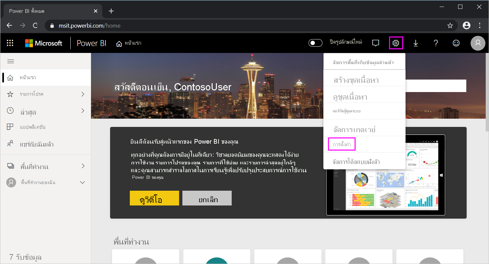

# <a name="use-directquery-in-power-bi-desktop"></a><span data-ttu-id="8d89d-103">ใช้ DirectQuery ใน Power BI Desktop</span><span class="sxs-lookup"><span data-stu-id="8d89d-103">Use DirectQuery in Power BI Desktop</span></span>
<span data-ttu-id="8d89d-104">ด้วย *Power BI Desktop* เมื่อคุณเชื่อมต่อกับแหล่งข้อมูลของคุณ คุณสามารถนำเข้าสำเนาของข้อมูลลงใน Power BI Desktop ได้</span><span class="sxs-lookup"><span data-stu-id="8d89d-104">With *Power BI Desktop*, when you connect to your data source, it's always possible to import a copy of the data into the Power BI Desktop.</span></span> <span data-ttu-id="8d89d-105">สำหรับบางแหล่งข้อมูล คุณสามารถเลือกวิธีการอื่นได้: เชื่อมต่อโดยตรงกับแหล่งข้อมูลโดยใช้ DirectQuery</span><span class="sxs-lookup"><span data-stu-id="8d89d-105">For some data sources, an alternative approach is available: connect directly to the data source using DirectQuery.</span></span>

## <a name="supported-data-sources"></a><span data-ttu-id="8d89d-106">แหล่งข้อมูลที่ได้รับการสนับสนุน</span><span class="sxs-lookup"><span data-stu-id="8d89d-106">Supported data sources</span></span>
<span data-ttu-id="8d89d-107">สำหรับรายการของแหล่งข้อมูลที่สนับสนุน DirectQuery โปรดดู[แหล่งข้อมูลที่ DirectQuery สนับสนุน](power-bi-data-sources.md)</span><span class="sxs-lookup"><span data-stu-id="8d89d-107">For a full listing of data sources that support DirectQuery, see [Data sources supported by DirectQuery](power-bi-data-sources.md).</span></span>

## <a name="how-to-connect-using-directquery"></a><span data-ttu-id="8d89d-108">วิธีการเชื่อมต่อโดยใช้ DirectQuery</span><span class="sxs-lookup"><span data-stu-id="8d89d-108">How to connect using DirectQuery</span></span>
<span data-ttu-id="8d89d-109">เมื่อคุณใช้ **รับข้อมูล** เพื่อเชื่อมต่อกับแหล่งข้อมูลที่ได้รับการสนับสนุนโดย DirectQuery กล่องโต้ตอบการเชื่อมต่อจะช่วยให้คุณสามารถเลือกวิธีที่คุณต้องการจะเชื่อมต่อ</span><span class="sxs-lookup"><span data-stu-id="8d89d-109">When you use **Get Data** to connect to a data source supported by DirectQuery, the connection dialog box lets you select how you want to connect.</span></span> <span data-ttu-id="8d89d-110">ตัวอย่างเช่นใน Power BI Desktop ภายใต้ ribbon **Home** เลือก **รับข้อมูล** > **SQL Server**</span><span class="sxs-lookup"><span data-stu-id="8d89d-110">For example, in Power BI Desktop, under the **Home** ribbon, select **Get Data** > **SQL Server**.</span></span> <span data-ttu-id="8d89d-111">ในกล่องโต้ตอบ **SQL Server Database** **โหมดการเชื่อมต่อข้อมูล** แสดงตัวเลือกของ **นำเข้า** และ **DirectQuery**:</span><span class="sxs-lookup"><span data-stu-id="8d89d-111">In the **SQL Server Database** dialog box, the **Data Connectivity mode** shows options of **Import** and **DirectQuery**:</span></span>


<span data-ttu-id="8d89d-113">ต่อไปนี้คือความแตกต่างระหว่างการเลือก **นำเข้า** และ **DirectQuery** มีดังนี้:</span><span class="sxs-lookup"><span data-stu-id="8d89d-113">Here are the differences between selecting **Import** and **DirectQuery**:</span></span>

- <span data-ttu-id="8d89d-114">**นำเข้า**: มีการนำเข้าตารางและคอลัมน์ที่เลือกลงใน Power BI Desktop</span><span class="sxs-lookup"><span data-stu-id="8d89d-114">**Import**: The selected tables and columns are imported into Power BI Desktop.</span></span> <span data-ttu-id="8d89d-115">เมื่อคุณสร้างหรือโต้ตอบกับภาพข้อมูล Power BI Desktop จะใช้ข้อมูลที่นำเข้า</span><span class="sxs-lookup"><span data-stu-id="8d89d-115">As you create or interact with a visualization, Power BI Desktop uses the imported data.</span></span> <span data-ttu-id="8d89d-116">เพื่อดูการเปลี่ยนแปลงใดๆ ที่เกิดขึ้นกับข้อมูลเบื้องต้น ตั้งแต่การนำเข้าเริ่มต้นหรือการรีเฟรชล่าสุด คุณต้องรีเฟรชข้อมูล ซึ่งจะนำเข้าชุดข้อมูลเต็มรูปแบบอีกครั้ง</span><span class="sxs-lookup"><span data-stu-id="8d89d-116">To see underlying data changes since the initial import or the most recent refresh, you must refresh the data, which imports the full dataset again.</span></span>

- <span data-ttu-id="8d89d-117">**DirectQuery**: ไม่มีการนำเข้าหรือคัดลอกข้อมูลลงใน Power BI Desktop</span><span class="sxs-lookup"><span data-stu-id="8d89d-117">**DirectQuery**: No data is imported or copied into Power BI Desktop.</span></span> <span data-ttu-id="8d89d-118">สำหรับแหล่งข้อมูลเชิงสัมพันธ์ จะปรากฏตารางและคอลัมน์ที่เลือกในรายการ **เขตข้อมูล**</span><span class="sxs-lookup"><span data-stu-id="8d89d-118">For relational sources, the selected tables and columns appear in the **Fields** list.</span></span> <span data-ttu-id="8d89d-119">สำหรับแหล่งข้อมูลหลายมิติ เช่น SAP Business Warehouse มิติและการวัดของคิวบ์ที่ถูกเลือกจะปรากฏในรายการ **เขตข้อมูล**</span><span class="sxs-lookup"><span data-stu-id="8d89d-119">For multi-dimensional sources like SAP Business Warehouse, the dimensions and measures of the selected cube appear in the **Fields** list.</span></span> <span data-ttu-id="8d89d-120">เมื่อคุณสร้างหรือโต้ตอบกับภาพข้อมูล Power BI Desktop จะคิวรีแหล่งข้อมูลเบื้องต้น ซึ่งหมายความว่า คุณกำลังดูข้อมูลที่เป็นปัจจุบันอยู่เสมอ</span><span class="sxs-lookup"><span data-stu-id="8d89d-120">As you create or interact with a visualization, Power BI Desktop queries the underlying data source, so you’re always viewing current data.</span></span>

<span data-ttu-id="8d89d-121">แบบจำลองข้อมูลและการแปลงข้อมูลจำนวนมากมีพร้อมให้บริการเมื่อใช้ DirectQuery แม้ว่าจะมีข้อจำกัดบ้าง</span><span class="sxs-lookup"><span data-stu-id="8d89d-121">Many data modeling and data transformations are available when using DirectQuery, though with some limitations.</span></span> <span data-ttu-id="8d89d-122">เมื่อคุณสร้างหรือโต้ตอบกับภาพข้อมูล คุณต้องคิวรีแหล่งข้อมูลเบื้องต้น</span><span class="sxs-lookup"><span data-stu-id="8d89d-122">When you create or interact with a visualization, you must query the underlying source.</span></span> <span data-ttu-id="8d89d-123">เวลาที่จำเป็นต้องรีเฟรชภาพข้อมูล จะขึ้นอยู่กับประสิทธิภาพของแหล่งข้อมูลเบื้องต้น</span><span class="sxs-lookup"><span data-stu-id="8d89d-123">The time that's needed to refresh the visualization depends on the performance of the underlying data source.</span></span> <span data-ttu-id="8d89d-124">เมื่อมีการร้องขอข้อมูลที่ให้บริการ Power BI Desktop ใช้ข้อมูลล่าสุดเพื่อลดเวลาที่ใช้ประมวลการแสดงภาพข้อมูล</span><span class="sxs-lookup"><span data-stu-id="8d89d-124">When the data needed to service the request has recently been requested, Power BI Desktop uses recent data to reduce the required time to show the visualization.</span></span> <span data-ttu-id="8d89d-125">หากคุณเลือก **รีเฟรช** จาก ribbon ของ **Home** จะทำให้ภาพข้อมูลทั้งหมดถูกรีเฟรชด้วยข้อมูลปัจจุบัน</span><span class="sxs-lookup"><span data-stu-id="8d89d-125">If you select **Refresh** from the **Home** ribbon, all visualizations are refreshed with current data.</span></span>

<span data-ttu-id="8d89d-126">บทความ [Power BI และ DirectQuery](desktop-directquery-about.md) อธิบายเรื่อง DirectQuery โดยละเอียด</span><span class="sxs-lookup"><span data-stu-id="8d89d-126">The [Power BI and DirectQuery](desktop-directquery-about.md) article describes DirectQuery in detail.</span></span> <span data-ttu-id="8d89d-127">สำหรับข้อมูลเพิ่มเติมเกี่ยวกับข้อดี ข้อจำกัด และข้อควรพิจารณาสำคัญเมื่อใช้ DirectQuery โปรดดูส่วนต่อไปนี้</span><span class="sxs-lookup"><span data-stu-id="8d89d-127">For more information about benefits, limitations, and important considerations when using DirectQuery, see the following sections.</span></span>

## <a name="benefits-of-using-directquery"></a><span data-ttu-id="8d89d-128">ข้อดีของการใช้ DirectQuery</span><span class="sxs-lookup"><span data-stu-id="8d89d-128">Benefits of using DirectQuery</span></span>
<span data-ttu-id="8d89d-129">ประโยชน์บางอย่างเมื่อใช้ DirectQuery:</span><span class="sxs-lookup"><span data-stu-id="8d89d-129">There are a few benefits to using DirectQuery:</span></span>

- <span data-ttu-id="8d89d-130">DirectQuery ช่วยให้คุณสามารถสร้างภาพข้อมูลจากชุดข้อมูลที่มีขนาดใหญ่มาก ซึ่งตามปกติแล้ว การนำเข้าข้อมูลขนาดใหญ่ที่มีการรวมข้อมูลไว้ก่อนในตอนแรกอาจทำได้ยาก</span><span class="sxs-lookup"><span data-stu-id="8d89d-130">DirectQuery lets you build visualizations over very large datasets, where it would otherwise be unfeasible to first import all the data with pre-aggregation.</span></span>
- <span data-ttu-id="8d89d-131">การเปลี่ยนแปลงข้อมูลเบื้องต้นอาจจำเป็นต้องมีการรีเฟรชข้อมูล</span><span class="sxs-lookup"><span data-stu-id="8d89d-131">Underlying data changes can require a refresh of data.</span></span> <span data-ttu-id="8d89d-132">สำหรับรายงานบางอย่าง การแสดงข้อมูลปัจจุบันอาจต้องมีการถ่ายโอนข้อมูลขนาดใหญ่ ซึ่งอาจทำใหไม่สามารถนำเข้าข้อมูลอีกครั้งได้</span><span class="sxs-lookup"><span data-stu-id="8d89d-132">For some reports, the need to display current data can require large data transfers, making reimporting data unfeasible.</span></span> <span data-ttu-id="8d89d-133">ในทางตรงกันข้าม รายงาน DirectQuery มักใช้ข้อมูลปัจจุบันเสมอ</span><span class="sxs-lookup"><span data-stu-id="8d89d-133">By contrast, DirectQuery reports always use current data.</span></span>
- <span data-ttu-id="8d89d-134">ข้อจำกัดของชุดข้อมูลที่ 1 GB *ไม่สามารถ* ใช้กับ DirectQuery ได้</span><span class="sxs-lookup"><span data-stu-id="8d89d-134">The 1-GB dataset limitation *doesn't* apply to DirectQuery.</span></span>

## <a name="limitations-of-directquery"></a><span data-ttu-id="8d89d-135">ขีดจำกัดของ DirectQuery</span><span class="sxs-lookup"><span data-stu-id="8d89d-135">Limitations of DirectQuery</span></span>
<span data-ttu-id="8d89d-136">ปัจจุบัน มีข้อจำกัดบางประการในการใช้ DirectQuery ดังนี้:</span><span class="sxs-lookup"><span data-stu-id="8d89d-136">There are currently a few limitations to using DirectQuery:</span></span>

- <span data-ttu-id="8d89d-137">ถ้าคิวรีของ **ตัวแก้ไขคิวรี** ซับซ้อนเกินไป จะเกิดข้อผิดพลาด</span><span class="sxs-lookup"><span data-stu-id="8d89d-137">If the **Query Editor** query is overly complex, an error occurs.</span></span> <span data-ttu-id="8d89d-138">เมื่อต้องแก้ไขข้อผิดพลาด คุณต้องลบในขั้นตอนที่มีปัญหาใน **ตัวแก้ไขคิวรี** หรือ *นำเข้า* ข้อมูลแทนที่จะใช้ DirectQuery</span><span class="sxs-lookup"><span data-stu-id="8d89d-138">To remedy the error, either delete the problematic step in **Query Editor**, or *import* the data instead of using DirectQuery.</span></span> <span data-ttu-id="8d89d-139">สำหรับแหล่งข้อมูลหลายมิติ เช่น SAP Business Warehouse ไม่มี **ตัวแก้ไขคิวรี**</span><span class="sxs-lookup"><span data-stu-id="8d89d-139">For multi-dimensional sources like SAP Business Warehouse, there's no **Query Editor**.</span></span>

- <span data-ttu-id="8d89d-140">ความสามารถด้านเวลาจะไม่พร้อมใช้งานใน DirectQuery</span><span class="sxs-lookup"><span data-stu-id="8d89d-140">Time intelligence capabilities are unavailable in DirectQuery.</span></span> <span data-ttu-id="8d89d-141">ตัวอย่างเช่น การจัดการพิเศษของคอลัมน์วันที่ (เช่น ปี ไตรมาส เดือน หรือวัน) ไม่รองรับในโหมด DirectQuery</span><span class="sxs-lookup"><span data-stu-id="8d89d-141">For example, special treatment of date columns (such as year, quarter, month, or day) isn't supported in DirectQuery mode.</span></span>

- <span data-ttu-id="8d89d-142">ตารางที่มีการคำนวณและคอลัมน์จากการคำนวณที่อ้างอิงตาราง DirectQuery จากแหล่งข้อมูลที่มีการรับรองความถูกต้องของการลงชื่อเข้าระบบครั้งเดียว (SSO) ไม่ได้รับการรองรับในบริการ Power BI</span><span class="sxs-lookup"><span data-stu-id="8d89d-142">Calculated tables and calculated columns that reference a DirectQuery table from a data source with Single Sign-on (SSO) authentication are not supported in the Power BI Service.</span></span>

- <span data-ttu-id="8d89d-143">ข้อจำกัดจะถูกใส่ไว้ในนิพจน์ DAX ที่ได้รับอนุญาตในหน่วยวัดเพื่อให้แน่ใจว่าคิวรีที่ส่งไปยังแหล่งข้อมูลเบื้องต้นมีประสิทธิภาพที่ยอมรับได้</span><span class="sxs-lookup"><span data-stu-id="8d89d-143">Limitations are placed on DAX expressions allowed in measures to ensure that queries sent to the underlying data source have acceptable performance.</span></span>

- <span data-ttu-id="8d89d-144">มีขีดจำกัดหนึ่งล้านแถวสำหรับแหล่งข้อมูลบนคลาวด์ที่มีแหล่งข้อมูลภายในองค์กรที่จำกัดไว้ในส่วนที่กำหนดประมาณ 4 MB ต่อแถว (ขึ้นอยู่กับอัลกอริทึมการบีบอัดที่เป็นกรรมสิทธิ์) หรือขนาดข้อมูล 16MB สำหรับวิชวลทั้งหมด</span><span class="sxs-lookup"><span data-stu-id="8d89d-144">There's a one-million-row limit for cloud sources, with on-premises sources limited to a defined payload of about 4 MB per row (depending on proprietary compression algorithm) or 16MB data size for the entire visual.</span></span> <span data-ttu-id="8d89d-145">อาจมีข้อจำกัดบางอย่างเกิดขึ้นเมื่อใช้ความจุ Premium</span><span class="sxs-lookup"><span data-stu-id="8d89d-145">Certain limits may be raised when using Premium capacity.</span></span> <span data-ttu-id="8d89d-146">ข้อจำกัดนี้ไม่มีผลต่อการรวมหรือการคำนวณที่ใช้ในการสร้างชุดข้อมูลที่ DirectQuery ส่งค่ากลับคืน</span><span class="sxs-lookup"><span data-stu-id="8d89d-146">The limit doesn't affect aggregations or calculations used to create the dataset returned using DirectQuery.</span></span> <span data-ttu-id="8d89d-147">เฉพาะแถวเท่านั้นที่จะถูกส่งคืน</span><span class="sxs-lookup"><span data-stu-id="8d89d-147">It only affects the rows returned.</span></span> <span data-ttu-id="8d89d-148">ความจุแบบ Premium สามารถตั้งค่าขีดจำกัดแถวสูงสุดตามที่อธิบายไว้ใน [โพสต์นี้](https://powerbi.microsoft.com/blog/five-new-power-bi-premium-capacity-settings-is-available-on-the-portal-preloaded-with-default-values-admin-can-review-and-override-the-defaults-with-their-preference-to-better-fence-their-capacity/)</span><span class="sxs-lookup"><span data-stu-id="8d89d-148">Premium capacities can set maximum row limits, as described in [this post](https://powerbi.microsoft.com/blog/five-new-power-bi-premium-capacity-settings-is-available-on-the-portal-preloaded-with-default-values-admin-can-review-and-override-the-defaults-with-their-preference-to-better-fence-their-capacity/).</span></span> 

    <span data-ttu-id="8d89d-149">ตัวอย่างเช่น คุณสามารถรวมแถว 10,000,000 แถวกับคิวรีของคุณที่เปิดใช้งานบนแหล่งข้อมูลของคุณได้</span><span class="sxs-lookup"><span data-stu-id="8d89d-149">For example, you can aggregate 10 million rows with your query that runs on the data source.</span></span> <span data-ttu-id="8d89d-150">คิวรีจะแสดงผลลัพธ์ของการรวมดังกล่าวไปยัง Power BI อย่างถูกต้องแม่นยำโดยใช้ DirectQuery หากข้อมูล Power BI ที่แสดงน้อยกว่า 1,000,000 แถว</span><span class="sxs-lookup"><span data-stu-id="8d89d-150">The query accurately returns the results of that aggregation to Power BI using DirectQuery if the returned Power BI data is less than 1 million rows.</span></span> <span data-ttu-id="8d89d-151">ถ้าแถวมากกว่าหนึ่งล้านแถวถูกส่งกลับจาก DirectQuery Power BI จะส่งกลับข้อผิดพลาด (เว้นแต่ในความจุแบบ Premium และจำนวนแถวอยู่ภายใต้ขีดจำกัดการตั้งค่าของผู้ดูแลระบบ)</span><span class="sxs-lookup"><span data-stu-id="8d89d-151">If over 1 million rows are returned from DirectQuery, Power BI returns an error (unless in Premium capacity, and the row count is under the admin-set limit).</span></span>


## <a name="important-considerations-when-using-directquery"></a><span data-ttu-id="8d89d-152">ข้อควรพิจารณาเมื่อใช้ DirectQuery</span><span class="sxs-lookup"><span data-stu-id="8d89d-152">Important considerations when using DirectQuery</span></span>
<span data-ttu-id="8d89d-153">ควรคำนึงถึงสามข้อต่อไปนี้เมื่อใช้ DirectQuery:</span><span class="sxs-lookup"><span data-stu-id="8d89d-153">The following three points should be taken into consideration when using DirectQuery:</span></span>

- <span data-ttu-id="8d89d-154">**ประสิทธิภาพและภาระ**: คำขอ DirectQuery ทั้งหมดจะถูกส่งไปยังฐานข้อมูลต้นฉบับ ดังนั้นเวลาที่ใช้รีเฟรชภาพข้อมูลจะขึ้นอยู่กับความยาวนานที่แหล่งข้อมูล back-end ใช้เพื่อตอบสนองกับผลลัพธ์จากคิวรี</span><span class="sxs-lookup"><span data-stu-id="8d89d-154">**Performance and load**: All DirectQuery requests are sent to the source database, so the required visual refresh time depends on how long that back-end source takes to respond with the results from the query (or queries).</span></span> <span data-ttu-id="8d89d-155">ห้าวินาทีหรือน้อยกว่า เป็นเวลาตอบสนองที่แนะนำ (พร้อมข้อมูลที่ร้องขอที่แสดง) สำหรับการใช้ DirectQuery สำหรับวิชวล โดยเวลาที่แนะนำสูงสุดคือ 30 วินาที</span><span class="sxs-lookup"><span data-stu-id="8d89d-155">Five seconds or less is the recommended response time (with requested data being returned) for using DirectQuery for visuals; the maximum recommended time is 30 seconds.</span></span> <span data-ttu-id="8d89d-156">ยิ่งนานเท่าไร ผู้ใช้รายงานก็จะรู้สึกไม่พอใจ</span><span class="sxs-lookup"><span data-stu-id="8d89d-156">Any longer, and the experience of a user consuming the report becomes unacceptably poor.</span></span> <span data-ttu-id="8d89d-157">หลังจากตีพิมพ์รายงานไปยังบริการของ Power BI คิวรีที่ใช้เวลานานกว่าสองสามนาทีจะหมดเวลา และผู้ใช้จะได้รับข้อผิดพลาด</span><span class="sxs-lookup"><span data-stu-id="8d89d-157">After a report is published to the Power BI service, any query that takes longer than a few minutes will time out, and the user will receive an error.</span></span>
  
    <span data-ttu-id="8d89d-158">ภาระต่อฐานข้อมูลต้นฉบับก็เป็นเรื่องที่ควรพิจารณา ทั้งนี้ขึ้นอยู่กับจำนวนผู้ใช้ Power BI ที่จะใช้รายงานที่ตีพิมพ์</span><span class="sxs-lookup"><span data-stu-id="8d89d-158">Load on the source database should also be considered, based on the number of Power BI users who will consume the published report.</span></span> <span data-ttu-id="8d89d-159">การใช้ **การรักษาความปลอดภัยระดับแถว** (RLS) อาจมีผลกระทบที่สำคัญเช่นกัน</span><span class="sxs-lookup"><span data-stu-id="8d89d-159">Using **Row Level Security** (RLS) can have a significant impact as well.</span></span> <span data-ttu-id="8d89d-160">ไทล์แดชบอร์ดที่ไม่ใช่ RLS ที่ใช้ร่วมกันโดยผู้ใช้หลายคน จะแสดงผลลัพธ์ในคิวรีเดียวไปยังฐานข้อมูล</span><span class="sxs-lookup"><span data-stu-id="8d89d-160">A non-RLS dashboard tile shared by multiple users results in a single query to the database.</span></span> <span data-ttu-id="8d89d-161">อย่างไรก็ตาม การใช้ RLS บนไทล์แดชบอร์ด หมายความว่า การรีเฟรชไทล์จำเป็นต้องมีหนึ่งคิวรี *ต่อผู้ใช้* ซึ่งจะเพิ่มโหลดอย่างมากต่อฐานข้อมูลต้นฉบับและอาจส่งผลต่อประสิทธิภาพการทำงานด้วย</span><span class="sxs-lookup"><span data-stu-id="8d89d-161">Using RLS on a dashboard tile, however, usually means the refresh of a tile requires one query *per user*, significantly increasing load on the source database and potentially impacting performance.</span></span>
  
    <span data-ttu-id="8d89d-162">Power BI สร้างคิวรีที่มีประสิทธิภาพเท่าที่เป็นไปได้</span><span class="sxs-lookup"><span data-stu-id="8d89d-162">Power BI creates queries that are as efficient as possible.</span></span> <span data-ttu-id="8d89d-163">ในบางกรณี คิวรีที่สร้างอาจไม่มีประสิทธิภาพเพียงพอและจึงอาจทำให้การรีเฟรชล้มเหลว</span><span class="sxs-lookup"><span data-stu-id="8d89d-163">Under certain situations, however, the generated query may not be efficient enough to avoid a refresh that would fail.</span></span> <span data-ttu-id="8d89d-164">ตัวอย่างหนึ่งของสถานการณ์นี้คือ เมื่อคิวรีที่สร้างขึ้นค้นคืนจำนวนแถวที่มากเกินไปจากแหล่งข้อมูล back-end</span><span class="sxs-lookup"><span data-stu-id="8d89d-164">One example of this situation is when a generated query retrieves an excessively large number of rows from the back-end data source.</span></span> <span data-ttu-id="8d89d-165">ซึ่งในกรณีดังกล่าวจะเกิดข้อผิดพลาดต่อไปนี้:</span><span class="sxs-lookup"><span data-stu-id="8d89d-165">In this case, the following error occurs:</span></span>

    ```output
    The resultset of a query to external data source has exceeded
    ```
  
    <span data-ttu-id="8d89d-166">สถานการณ์นี้อาจเกิดขึ้นได้กับแผนภูมิแบบง่ายๆ ที่มีแถวในคอลัมน์หนึ่งๆ อย่างมาก โดยมีตัวเลือกการรวมกำหนดเป็น **อย่าสรุป**</span><span class="sxs-lookup"><span data-stu-id="8d89d-166">This situation can occur with a simple chart that includes a very high cardinality column, with the aggregation option set to **Don’t Summarize**.</span></span> <span data-ttu-id="8d89d-167">ภาพจะมีคอลัมน์ที่มีแถวต่ำกว่า 1 ล้านหรือต้องมีการใช้ตัวกรองที่เหมาะสม</span><span class="sxs-lookup"><span data-stu-id="8d89d-167">The visual needs to only have columns with a cardinality below 1 million, or it must apply the appropriate filters.</span></span>

- <span data-ttu-id="8d89d-168">**ความปลอดภัย**: ตามค่าเริ่มต้น ผู้ใช้ทั้งหมดที่ใช้รายงานที่เผยแพร่จะเชื่อมต่อกับแหล่งข้อมูล back-end โดยใช้ข้อมูลประจำตัวที่ถูกป้อนหลังจากการเผยแพร่ไปยังบริการ Power BI</span><span class="sxs-lookup"><span data-stu-id="8d89d-168">**Security**: By default, all users who consume a published report connect to the back-end data source using the credentials entered after publication to the Power BI service.</span></span> <span data-ttu-id="8d89d-169">กระบวนการนี้เป็นแบบเดียวกันสำหรับข้อมูลที่นำเข้า: ผู้ใช้ทุกคนเห็นข้อมูลเดียวกันโดยไม่คำนึงถึงกฎความปลอดภัยใดๆ ที่กำหนดไว้ในแหล่งข้อมูล backend</span><span class="sxs-lookup"><span data-stu-id="8d89d-169">This process is the same for data that's imported: all users see the same data, regardless of any security rules defined in the backend source.</span></span>

    <span data-ttu-id="8d89d-170">ลูกค้าที่ต้องการนำความปลอดภัยต่อผู้ใช้ไปใช้กับแหล่งข้อมูล DirectQuery ควรใช้ RLS หรือกำหนดค่าการรับรองความถูกต้องแบบจำกัดของ Kerberos กับแหล่งข้อมูล</span><span class="sxs-lookup"><span data-stu-id="8d89d-170">Customers who want per-user security implemented with DirectQuery sources should either use RLS or configure Kerberos-constrained authentication against the source.</span></span> <span data-ttu-id="8d89d-171">Kerberos ไม่สามารถใช้ได้กับทุกแหล่งข้อมูล</span><span class="sxs-lookup"><span data-stu-id="8d89d-171">Kerberos isn't available for all sources.</span></span> <span data-ttu-id="8d89d-172">[เรียนรู้เพิ่มเติมเกี่ยวกับ RLS](../admin/service-admin-rls.md)</span><span class="sxs-lookup"><span data-stu-id="8d89d-172">[Learn more about RLS](../admin/service-admin-rls.md).</span></span> <span data-ttu-id="8d89d-173">[เรียนรู้เพิ่มเติมเกี่ยวกับ Kerberos ใน DirectQuery](service-gateway-sso-kerberos.md)</span><span class="sxs-lookup"><span data-stu-id="8d89d-173">[Learn more about Kerberos in DirectQuery](service-gateway-sso-kerberos.md).</span></span>

- <span data-ttu-id="8d89d-174">**คุณลักษณะที่ได้รับการสนับสนุน**: คุณลักษณะบางอย่างใน Power BI Desktop ไม่ได้รับการสนับสนุนในโหมด DirectQuery หรือมีข้อจำกัด</span><span class="sxs-lookup"><span data-stu-id="8d89d-174">**Supported features**: Some features in Power BI Desktop are unsupported in DirectQuery mode, or they have limitations.</span></span> <span data-ttu-id="8d89d-175">นอกจากนี้ ความสามารถบางอย่างในบริการ Power BI (เช่น *ข้อมูลเชิงลึกด่วน*) ไม่สามารถใช้งานได้สำหรับชุดข้อมูลที่ใช้ DirectQuery</span><span class="sxs-lookup"><span data-stu-id="8d89d-175">Also, some capabilities in the Power BI service (such as *Quick Insights*) aren't available for datasets using DirectQuery.</span></span> <span data-ttu-id="8d89d-176">เมื่อต้องพิจารณาว่าจะใช้ DirectQuery หรือไม่ คุณควรพิจารณาข้อจำกัดของคุณลักษณะเหล่านี้ด้วย</span><span class="sxs-lookup"><span data-stu-id="8d89d-176">When determining whether to use DirectQuery, you should consider these feature limitations.</span></span>

> [!NOTE]
> <span data-ttu-id="8d89d-177">เมื่อใช้ DirectQuery กับฐานข้อมูล Azure SQL และ ที่อยู่ IP ส่วนตัว จำเป็นต้องใช้เกตเวย์ภายในองค์กร</span><span class="sxs-lookup"><span data-stu-id="8d89d-177">When using DirectQuery with an Azure SQL Database and a private IP address, an on-premises gateway is required.</span></span> 

## <a name="publish-to-the-power-bi-service"></a><span data-ttu-id="8d89d-178">เผยแพร่ไปยังบริการ Power BI</span><span class="sxs-lookup"><span data-stu-id="8d89d-178">Publish to the Power BI service</span></span>
<span data-ttu-id="8d89d-179">รายงานที่สร้างขึ้นโดยใช้ DirectQuery สามารถเผยแพร่ไปยังบริการของ Power BI ได้</span><span class="sxs-lookup"><span data-stu-id="8d89d-179">Reports created using DirectQuery can be published to the Power BI service.</span></span>

<span data-ttu-id="8d89d-180">หากแหล่งข้อมูลที่ใช้ไม่จำเป็นต้องใช้ **เกตเวย์ข้อมูลในองค์กร** (**Azure SQL Database**, **Azure SQL Data Warehouse** หรือ **Redshift**) คุณต้องให้ข้อมูลประจำตัวก่อนที่บริการ Power BI จะแสดงรายงานที่แผยแพร่</span><span class="sxs-lookup"><span data-stu-id="8d89d-180">If the used data source doesn't need the **On-premises data gateway** (**Azure SQL Database**, **Azure SQL Data Warehouse**, or **Redshift**), you must provide credentials before the Power BI service shows the published report.</span></span> <span data-ttu-id="8d89d-181">การระบุข้อมูลประจำตัว โปรดทำตามคำแนะนำต่อไปนี้:</span><span class="sxs-lookup"><span data-stu-id="8d89d-181">Follow these instructions to provide the credentials:</span></span>

1. <span data-ttu-id="8d89d-182">ลงชื่อเข้าใช้ [Power BI](https://www.powerbi.com/)</span><span class="sxs-lookup"><span data-stu-id="8d89d-182">Sign in to [Power BI](https://www.powerbi.com/).</span></span>
2. <span data-ttu-id="8d89d-183">ในบริการ Power BI เลือกไอคอนรูปเฟือง **การตั้งค่า** และเลือกหน่วยข้อมูลเมนู **การตั้งค่า**</span><span class="sxs-lookup"><span data-stu-id="8d89d-183">In the Power BI service, select the **Settings** gear icon and choose the **Settings** menu item.</span></span>

    

3. <span data-ttu-id="8d89d-185">ในหน้า **การตั้งค่า** ของบริการ Power BI เลือกแท็บ **ชุดข้อมูล** เลือกชุดข้อมูลที่ใช้ DirectQuery และเลือก **แก้ไขข้อมูลประจำตัว**</span><span class="sxs-lookup"><span data-stu-id="8d89d-185">In the Power BI service's **Settings** page, select the **Datasets** tab, choose the dataset that uses DirectQuery, and select **Edit credentials**.</span></span>

4. <span data-ttu-id="8d89d-186">เพิ่มข้อมูลประจำตัว</span><span class="sxs-lookup"><span data-stu-id="8d89d-186">Add the credentials.</span></span> <span data-ttu-id="8d89d-187">มิฉะนั้น ข้อผิดพลาดจะเกิดขึ้นเมื่อคุณเปิดรายงานที่เผยแพร่หรือสำรวจชุดข้อมูลที่สร้างขึ้นด้วยการเชื่อมต่อ DirectQuery</span><span class="sxs-lookup"><span data-stu-id="8d89d-187">Otherwise, an error occurs when you open a published report or explore a dataset that's created with a DirectQuery connection.</span></span>

<span data-ttu-id="8d89d-188">เมื่อต้องการทำการเชื่อมต่อข้อมูลสำหรับแหล่งข้อมูลอื่นที่ไม่ใช่ **Azure SQL Database**, **Azure SQL Data Warehouse** และ **Redshift** หรือ **Snowflake Data Warehouse** ที่ใช้ DirectQuery คุณต้องติดตั้ง **เกตเวย์ข้อมูลภายในองค์กร** และต้องลงทะเบียนแหล่งข้อมูล</span><span class="sxs-lookup"><span data-stu-id="8d89d-188">To make a data connection for data sources other than **Azure SQL Database**, **Azure SQL Data Warehouse**, **Redshift**, or **Snowflake Data Warehouse** that use DirectQuery, install an **On-premises data gateway** and register the data source.</span></span> <span data-ttu-id="8d89d-189">สำหรับข้อมูลเพิ่มเติม ดูที่ [เกตเวย์ข้อมูลภายในองค์กรคืออะไร](service-gateway-onprem.md)</span><span class="sxs-lookup"><span data-stu-id="8d89d-189">For more information, see [What is an on-premises data gateway?](service-gateway-onprem.md)</span></span>

## <a name="next-steps"></a><span data-ttu-id="8d89d-190">ขั้นตอนถัดไป</span><span class="sxs-lookup"><span data-stu-id="8d89d-190">Next steps</span></span>
<span data-ttu-id="8d89d-191">สำหรับข้อมูลเพิ่มเติมเกี่ยวกับ DirectQuery โปรดดูที่ทรัพยากรดังต่อไปนี้:</span><span class="sxs-lookup"><span data-stu-id="8d89d-191">For more information about DirectQuery, check out the following resources:</span></span>

- [<span data-ttu-id="8d89d-192">การใช้ DirectQuery ใน Power BI</span><span class="sxs-lookup"><span data-stu-id="8d89d-192">Using DirectQuery in Power BI</span></span>](desktop-directquery-about.md)
- [<span data-ttu-id="8d89d-193">แหล่งข้อมูลที่สนับสนุนโดย DirectQuery</span><span class="sxs-lookup"><span data-stu-id="8d89d-193">Data sources supported by DirectQuery</span></span>](power-bi-data-sources.md)
- [<span data-ttu-id="8d89d-194">DirectQuery และ SAP Business Warehouse (BW)</span><span class="sxs-lookup"><span data-stu-id="8d89d-194">DirectQuery and SAP Business Warehouse (BW)</span></span>](desktop-directquery-sap-bw.md)
- [<span data-ttu-id="8d89d-195">DirectQuery และ SAP HANA</span><span class="sxs-lookup"><span data-stu-id="8d89d-195">DirectQuery and SAP HANA</span></span>](desktop-directquery-sap-hana.md)
- [<span data-ttu-id="8d89d-196">เกตเวย์ข้อมูลภายในองค์กรคืออะไร</span><span class="sxs-lookup"><span data-stu-id="8d89d-196">What is an on-premises data gateway?</span></span>](service-gateway-onprem.md)
- [<span data-ttu-id="8d89d-197">การใช้ DirectQuery สำหรับชุดข้อมูล Power BI และ Azure Analysis Services (ตัวอย่าง)</span><span class="sxs-lookup"><span data-stu-id="8d89d-197">Using DirectQuery for Power BI datasets and Azure Analysis Services (preview)</span></span>](../connect-data/desktop-directquery-datasets-azure-analysis-services.md)
